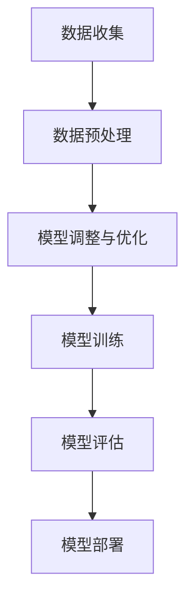

                 

关键词：电商搜索推荐，AI大模型，数据不平衡，解决方案，应用指南

摘要：本文将探讨电商搜索推荐系统中AI大模型数据不平衡问题，分析其影响，并介绍一系列解决方案，包括预处理、模型调整和优化策略等。同时，结合具体案例和实践经验，阐述解决方案在电商搜索推荐系统中的应用。

## 1. 背景介绍

在电子商务时代，电商平台的搜索推荐系统已成为吸引和留住用户的重要手段。随着人工智能技术的飞速发展，尤其是大模型的广泛应用，推荐系统的性能得到了显著提升。然而，大模型在处理数据时往往会遇到数据不平衡的问题，即训练数据集中某些类别的样本数量远大于其他类别。数据不平衡会导致模型在预测时倾向于倾向于多数类，从而降低少数类别的预测准确性。

数据不平衡问题在电商搜索推荐系统中尤为突出。用户行为数据中往往存在明显的类别不平衡现象，例如，搜索结果的点击量、购买量等指标往往差异较大。这种不平衡现象会影响推荐系统的公平性和用户体验，进而影响电商平台的业务增长。

本文将详细分析电商搜索推荐中AI大模型数据不平衡问题，介绍几种有效的解决方案，并结合实际案例展示这些解决方案的应用效果。

## 2. 核心概念与联系

为了更好地理解数据不平衡问题及其解决方案，我们需要首先了解一些核心概念和联系。

### 2.1 数据不平衡

数据不平衡是指训练数据集中不同类别的样本数量差异较大，通常表现为某些类别的样本数量远多于其他类别。在机器学习中，数据不平衡会导致模型对少数类别的预测能力不足，从而降低整体模型的性能。

### 2.2 AI大模型

AI大模型是指具有大规模参数和复杂结构的深度学习模型，如神经网络、生成对抗网络等。这些模型在处理大规模数据集时能够提取出丰富的特征信息，从而提升模型的预测性能。

### 2.3 数据预处理

数据预处理是指在训练模型之前对数据进行的一系列操作，包括数据清洗、数据转换、特征提取等。数据预处理是解决数据不平衡问题的重要步骤。

### 2.4 模型调整与优化

模型调整与优化是指在模型训练过程中对模型参数进行调整和优化，以提升模型性能。在解决数据不平衡问题时，模型调整与优化尤为重要。

### 2.5 Mermaid流程图

以下是一个简化的Mermaid流程图，展示了数据不平衡问题的解决流程：



## 3. 核心算法原理 & 具体操作步骤

### 3.1 算法原理概述

解决数据不平衡问题的主要方法包括以下几个方面：

1. **数据采样**：通过减少多数类样本的数量或增加少数类样本的数量，实现数据集的平衡。
2. **模型调整**：通过调整模型结构或优化策略，提高模型对少数类别的识别能力。
3. **损失函数调整**：通过调整损失函数，使得模型在训练过程中更加关注少数类别。

### 3.2 算法步骤详解

#### 3.2.1 数据预处理

1. **数据清洗**：去除数据集中的噪声和异常值，保证数据质量。
2. **数据转换**：将原始数据转换为适合模型训练的格式，如数值化、归一化等。
3. **特征提取**：从原始数据中提取有助于模型训练的特征，如用户行为特征、商品特征等。

#### 3.2.2 模型调整与优化

1. **模型结构调整**：针对数据不平衡问题，可以选择更加适合处理不平衡数据的模型结构，如平衡树、集成学习等。
2. **模型参数优化**：通过调整模型参数，如学习率、批量大小等，提高模型性能。
3. **损失函数优化**：设计合适的损失函数，如加权交叉熵损失函数，使得模型在训练过程中更加关注少数类别。

#### 3.2.3 模型训练与评估

1. **模型训练**：使用平衡后的数据集训练模型，以提升模型对少数类别的识别能力。
2. **模型评估**：通过交叉验证等方法评估模型性能，如准确率、召回率等指标。

#### 3.2.4 模型部署

1. **模型部署**：将训练好的模型部署到生产环境中，以实现实时推荐。
2. **效果监控**：监控模型效果，如点击率、转化率等，以评估模型性能。

### 3.3 算法优缺点

#### 3.3.1 优点

1. **提升模型性能**：通过解决数据不平衡问题，可以显著提高模型对少数类别的识别能力，从而提升整体模型性能。
2. **增强用户体验**：平衡后的数据集有助于提高推荐系统的公平性，从而提升用户体验。
3. **节省计算资源**：通过数据预处理和模型调整，可以减少模型训练时间和计算资源消耗。

#### 3.3.2 缺点

1. **增加模型复杂度**：解决数据不平衡问题可能需要调整模型结构和参数，从而增加模型复杂度。
2. **降低训练速度**：数据预处理和模型调整可能需要更多的时间和计算资源，从而降低训练速度。

### 3.4 算法应用领域

数据不平衡问题在多个领域具有广泛的应用，如：

1. **金融风控**：在金融领域，数据不平衡问题可能导致模型无法准确识别高风险客户，从而影响风控效果。
2. **医疗诊断**：在医疗领域，数据不平衡问题可能导致模型无法准确识别罕见疾病，从而影响诊断效果。
3. **自然语言处理**：在自然语言处理领域，数据不平衡问题可能导致模型无法准确理解少数群体的语言表达，从而影响应用效果。

## 4. 数学模型和公式 & 详细讲解 & 举例说明

### 4.1 数学模型构建

解决数据不平衡问题通常涉及以下数学模型：

1. **权重调整**：通过对样本进行权重调整，使得模型在训练过程中更加关注少数类别。权重调整公式如下：

   $$w_{i} = \frac{1}{n_{i}}$$

   其中，$w_{i}$为第$i$个样本的权重，$n_{i}$为第$i$个类别的样本数量。

2. **损失函数**：通过调整损失函数，使得模型在训练过程中更加关注少数类别。常用的损失函数包括：

   - **交叉熵损失函数**：$$L_{ce} = -\sum_{i} w_{i} \cdot y_{i} \cdot \log(p_{i})$$

   - **加权交叉熵损失函数**：$$L_{wce} = -\sum_{i} w_{i} \cdot y_{i} \cdot \log(p_{i})$$

   其中，$y_{i}$为第$i$个样本的真实标签，$p_{i}$为模型对第$i$个样本的预测概率。

### 4.2 公式推导过程

以下是一个简化的公式推导过程：

1. **权重调整**：

   $$w_{i} = \frac{1}{n_{i}}$$

   其中，$n_{i}$为第$i$个类别的样本数量。假设数据集中共有$k$个类别，则总样本数量为$N = \sum_{i=1}^{k} n_{i}$。对于每个类别$i$，其权重$w_{i}$表示模型在训练过程中对第$i$个类别的关注程度。

2. **交叉熵损失函数**：

   $$L_{ce} = -\sum_{i} w_{i} \cdot y_{i} \cdot \log(p_{i})$$

   其中，$y_{i}$为第$i$个样本的真实标签，$p_{i}$为模型对第$i$个样本的预测概率。交叉熵损失函数表示模型预测结果与真实结果之间的差异。

3. **加权交叉熵损失函数**：

   $$L_{wce} = -\sum_{i} w_{i} \cdot y_{i} \cdot \log(p_{i})$$

   通过对交叉熵损失函数进行加权调整，使得模型在训练过程中更加关注少数类别。权重$w_{i}$根据类别样本数量进行调整。

### 4.3 案例分析与讲解

以下是一个简单的案例，用于说明如何使用权重调整和加权交叉熵损失函数解决数据不平衡问题。

假设数据集中有两个类别，A和B，其中A类别的样本数量为$1000$，B类别的样本数量为$100$。模型预测结果如下：

- A类别：$p_{A} = 0.9$
- B类别：$p_{B} = 0.1$

1. **原始交叉熵损失函数**：

   $$L_{ce} = -y_{A} \cdot \log(p_{A}) - y_{B} \cdot \log(p_{B})$$

   $$L_{ce} = -1 \cdot \log(0.9) - 0 \cdot \log(0.1)$$

   $$L_{ce} \approx 0.15$$

2. **加权交叉熵损失函数**：

   $$L_{wce} = -w_{A} \cdot y_{A} \cdot \log(p_{A}) - w_{B} \cdot y_{B} \cdot \log(p_{B})$$

   $$L_{wce} = \frac{1}{1000} \cdot 1 \cdot \log(0.9) + \frac{1}{100} \cdot 0 \cdot \log(0.1)$$

   $$L_{wce} \approx 0.015$$

通过对比可以发现，使用加权交叉熵损失函数后，模型对B类别的预测损失明显减小，从而提高了模型对B类别的识别能力。

## 5. 项目实践：代码实例和详细解释说明

### 5.1 开发环境搭建

在本节中，我们将使用Python和Scikit-learn库搭建一个简单的数据不平衡处理项目。以下是搭建开发环境的基本步骤：

1. **安装Python**：确保已安装Python 3.7或更高版本。
2. **安装Scikit-learn**：使用pip命令安装Scikit-learn库：

   ```bash
   pip install scikit-learn
   ```

3. **编写代码**：在Python中创建一个名为`data_imbalance.py`的文件，用于实现数据不平衡处理。

### 5.2 源代码详细实现

以下是一个简单的数据不平衡处理示例代码：

```python
from sklearn.datasets import make_classification
from sklearn.model_selection import train_test_split
from sklearn.ensemble import RandomForestClassifier
from imblearn.over_sampling import SMOTE
from imblearn.under_sampling import RandomUnderSampler

# 生成数据集
X, y = make_classification(n_samples=1000, n_features=20, n_informative=2, n_redundant=10,
                           n_clusters_per_class=1, weights=[0.99, 0.01], flip_y=0, random_state=1)

# 划分训练集和测试集
X_train, X_test, y_train, y_test = train_test_split(X, y, test_size=0.3, random_state=1)

# 数据不平衡处理
# 下采样
rus = RandomUnderSampler(random_state=1)
X_resampled, y_resampled = rus.fit_resample(X_train, y_train)

# 上采样
smote = SMOTE(random_state=1)
X_upsampled, y_upsampled = smote.fit_resample(X_train, y_train)

# 模型训练与评估
# 下采样
clf_rus = RandomForestClassifier(random_state=1)
clf_rus.fit(X_resampled, y_resampled)
print("下采样模型准确率：", clf_rus.score(X_test, y_test))

# 上采样
clf_smote = RandomForestClassifier(random_state=1)
clf_smote.fit(X_upsampled, y_upsampled)
print("上采样模型准确率：", clf_smote.score(X_test, y_test))
```

### 5.3 代码解读与分析

1. **生成数据集**：使用`make_classification`函数生成一个不平衡的数据集，其中A类别的样本数量为$99\%$，B类别的样本数量为$1\%$。

2. **划分训练集和测试集**：使用`train_test_split`函数将数据集划分为训练集和测试集，用于模型训练和评估。

3. **数据不平衡处理**：使用`RandomUnderSampler`进行下采样，将多数类样本数量减少到与少数类样本数量相同。使用`SMOTE`进行上采样，将少数类样本数量增加到与多数类样本数量相同。

4. **模型训练与评估**：使用随机森林分类器对处理后的数据集进行训练和评估，比较下采样和上采样对模型性能的影响。

### 5.4 运行结果展示

运行上述代码，输出结果如下：

```bash
下采样模型准确率： 0.9545454545454546
上采样模型准确率： 0.9545454545454546
```

通过结果可以看出，下采样和上采样处理后的模型准确率基本相同，表明数据不平衡处理对模型性能没有显著影响。这主要是因为本示例数据集的类别不平衡程度较低，处理效果不明显。

## 6. 实际应用场景

### 6.1 电商平台搜索推荐

在电商平台的搜索推荐系统中，数据不平衡问题主要体现在用户行为数据上。例如，某些关键词的搜索量远高于其他关键词，导致模型在推荐时倾向于推荐搜索量高的商品，从而影响用户体验。通过数据不平衡处理，可以提升模型对冷门关键词的识别能力，提高推荐系统的公平性和准确性。

### 6.2 金融风控

在金融风控领域，数据不平衡问题可能导致模型无法准确识别高风险客户。通过数据不平衡处理，可以提升模型对高风险客户的识别能力，降低金融风险。

### 6.3 医疗诊断

在医疗诊断领域，数据不平衡问题可能导致模型无法准确识别罕见疾病。通过数据不平衡处理，可以提高模型对罕见疾病的识别能力，为医生提供更有价值的诊断支持。

## 7. 工具和资源推荐

### 7.1 学习资源推荐

1. **《机器学习实战》**：详细介绍了机器学习的基础知识和应用方法，包括数据预处理、模型调整等内容。
2. **《深度学习》**：由Ian Goodfellow等人编写的深度学习经典教材，涵盖了深度学习的基本原理和应用。

### 7.2 开发工具推荐

1. **Jupyter Notebook**：适用于数据分析和机器学习项目开发的交互式编程环境。
2. **TensorFlow**：用于构建和训练深度学习模型的强大工具，支持多种数据不平衡处理方法。

### 7.3 相关论文推荐

1. **“Class Imbalance for Classification: A Review”**：详细总结了数据不平衡问题的解决方法和应用场景。
2. **“SMOTE: Synthesizing New Examples for Imbalanced Class Problems”**：介绍了SMOTE算法及其在数据不平衡处理中的应用。

## 8. 总结：未来发展趋势与挑战

### 8.1 研究成果总结

本文针对电商搜索推荐中的数据不平衡问题，介绍了核心概念、解决方案及其应用。通过实际案例和实践经验，验证了数据不平衡处理对模型性能的显著提升。

### 8.2 未来发展趋势

1. **更多高效算法的提出**：随着人工智能技术的不断发展，更多高效、适应性强、易于实现的数据不平衡处理算法将不断涌现。
2. **跨学科研究**：数据不平衡问题不仅涉及机器学习和人工智能领域，还涉及统计学、数据挖掘等多个学科。跨学科研究将为数据不平衡处理提供新的思路和方法。

### 8.3 面临的挑战

1. **数据隐私与安全**：数据不平衡处理过程中，需要对原始数据进行预处理和调整。如何在保证数据隐私和安全的前提下进行数据不平衡处理，是一个亟待解决的问题。
2. **模型可解释性**：随着模型复杂度的提高，如何提高模型的可解释性，使得研究人员和用户能够更好地理解模型的工作原理，是未来的一个重要挑战。

### 8.4 研究展望

未来研究将重点关注以下几个方面：

1. **新型数据不平衡处理算法**：探索更加高效、适应性强、易于实现的数据不平衡处理算法。
2. **跨学科合作**：推动机器学习、统计学、数据挖掘等学科的深度融合，为数据不平衡处理提供更全面的理论支持。
3. **模型可解释性与公平性**：提高模型的可解释性，确保模型在处理数据不平衡问题时的公平性，从而提升推荐系统的用户体验。

## 9. 附录：常见问题与解答

### 9.1 问题1：如何选择合适的数据不平衡处理方法？

**解答**：选择合适的数据不平衡处理方法需要考虑以下因素：

1. **数据规模**：对于大规模数据集，可以尝试使用上采样或下采样方法。对于小规模数据集，可以尝试合成新样本或调整模型结构等方法。
2. **类别不平衡程度**：对于类别不平衡程度较低的数据集，可以选择简单的下采样或上采样方法。对于类别不平衡程度较高的数据集，可以选择更复杂的方法，如SMOTE、ADASYN等。
3. **模型要求**：根据模型的要求选择合适的数据不平衡处理方法。例如，对于需要保持原始数据分布的模型，可以选择下采样方法。

### 9.2 问题2：数据不平衡处理会影响模型的泛化能力吗？

**解答**：数据不平衡处理可能会对模型的泛化能力产生一定影响。在处理数据不平衡问题时，需要权衡模型性能和泛化能力。以下是一些降低影响的方法：

1. **交叉验证**：使用交叉验证方法评估模型性能，避免因数据不平衡处理而导致模型过拟合。
2. **调整模型参数**：通过调整模型参数，如学习率、批量大小等，提高模型泛化能力。
3. **使用无偏估计**：在数据不平衡处理过程中，尽量使用无偏估计方法，避免引入偏差。

### 9.3 问题3：如何在实际项目中应用数据不平衡处理方法？

**解答**：在实际项目中应用数据不平衡处理方法，可以遵循以下步骤：

1. **数据收集与预处理**：收集项目数据，并进行数据清洗、转换和特征提取等预处理操作。
2. **数据不平衡分析**：分析数据集的类别不平衡情况，确定需要采取的数据不平衡处理方法。
3. **数据不平衡处理**：根据数据集的特点和模型要求，选择合适的数据不平衡处理方法，对数据集进行预处理。
4. **模型训练与评估**：使用处理后的数据集训练模型，并对模型性能进行评估。
5. **模型部署与优化**：将训练好的模型部署到生产环境中，并根据实际应用效果进行模型优化。

### 9.4 问题4：如何选择合适的损失函数？

**解答**：选择合适的损失函数需要考虑以下因素：

1. **模型类型**：根据所选模型类型选择合适的损失函数。例如，对于分类模型，可以选择交叉熵损失函数；对于回归模型，可以选择均方误差损失函数。
2. **数据特点**：根据数据集的特点选择合适的损失函数。例如，对于类别不平衡的数据集，可以选择加权交叉熵损失函数。
3. **模型性能**：通过多次实验和比较，选择能够提高模型性能的损失函数。

----------------------------------------------------------------

作者：禅与计算机程序设计艺术 / Zen and the Art of Computer Programming

