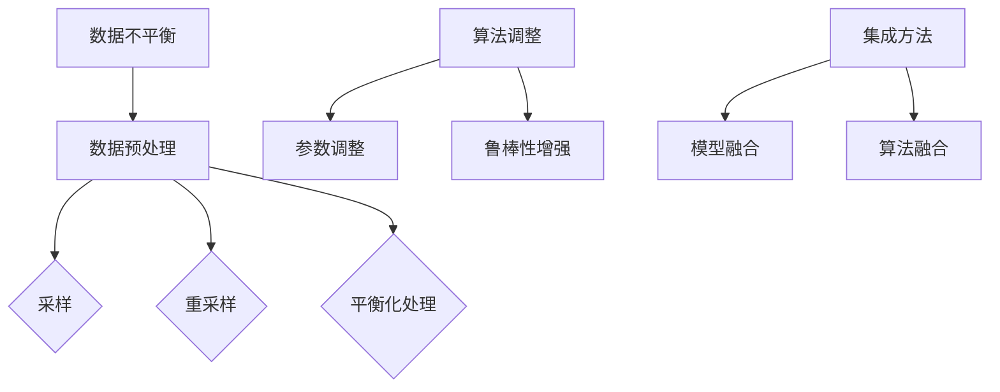

                 

关键词：电商搜索推荐、AI大模型、数据不平衡、解决方案、最佳实践、算法优化

## 摘要

随着电子商务的飞速发展，电商搜索推荐系统成为了提升用户体验、增加销售额的重要手段。然而，在实际应用中，AI大模型常面临数据不平衡的问题，这会严重影响推荐系统的效果。本文将深入探讨电商搜索推荐中AI大模型数据不平衡的问题，详细分析其产生原因和影响，并提出一系列解决方案和最佳实践，旨在为开发者提供有效的指导。

## 1. 背景介绍

### 1.1 电商搜索推荐系统的现状

电商搜索推荐系统已成为电商平台的核心竞争力之一。通过个性化推荐，电商平台能够向用户展示最可能感兴趣的商品，提高用户满意度，增加销售转化率。然而，推荐系统要实现高准确性、高覆盖率和高用户体验，必须依赖大量的数据和高性能的AI大模型。

### 1.2 AI大模型的优势与挑战

AI大模型如深度学习模型在处理大规模数据、进行复杂特征提取和关系建模方面表现出色。然而，这些模型在处理数据不平衡问题时显得尤为脆弱。数据不平衡可能导致模型过度拟合某一类样本，忽视其他类别，从而影响推荐效果的公平性和准确性。

### 1.3 数据不平衡问题的来源

数据不平衡问题可能源于以下几个方面：

- **数据分布不均**：不同类别或标签的数据量存在显著差异。
- **数据采集偏差**：某些类别在数据采集过程中被有意或无意地忽视。
- **用户行为差异**：不同用户的行为模式可能导致数据分布不均衡。

## 2. 核心概念与联系

### 2.1 数据不平衡的影响

数据不平衡会导致以下问题：

- **模型过拟合**：模型在训练过程中过于关注少数类别，导致在测试集上表现不佳。
- **推荐效果差**：系统无法有效覆盖所有用户，导致用户体验下降。
- **偏见**：模型可能对某些群体产生偏见，损害企业声誉。

### 2.2 数据不平衡解决方案

为了解决数据不平衡问题，可以采用以下方法：

- **数据预处理**：对数据集进行采样、重采样、平衡化处理。
- **算法调整**：调整模型参数，使模型对数据不平衡有更强的鲁棒性。
- **集成方法**：结合多种算法和模型，提高系统整体性能。

### 2.3 核心概念原理与架构



## 3. 核心算法原理 & 具体操作步骤

### 3.1 算法原理概述

针对数据不平衡问题，本文主要介绍以下三种算法：

- **过采样（Oversampling）**：增加少数类别的样本数量。
- **欠采样（Undersampling）**：减少多数类别的样本数量。
- **集成方法（Ensemble Methods）**：结合多种模型和方法，提高系统性能。

### 3.2 算法步骤详解

#### 3.2.1 过采样

1. **数据预处理**：分析数据集中各类别的分布情况。
2. **采样策略**：根据类别比例，采用随机过采样、SMOTE等策略生成新样本。
3. **模型训练**：使用新生成的数据集训练模型。

#### 3.2.2 欠采样

1. **数据预处理**：分析数据集中各类别的分布情况。
2. **采样策略**：根据类别比例，采用随机欠采样、基于密度的欠采样等策略筛选样本。
3. **模型训练**：使用筛选后的数据集训练模型。

#### 3.2.3 集成方法

1. **模型选择**：选择多个基学习器，如决策树、支持向量机等。
2. **训练与预测**：使用训练集分别训练各基学习器，并在测试集上进行预测。
3. **结果融合**：采用投票、加权平均等方法对预测结果进行集成。

### 3.3 算法优缺点

#### 过采样

- **优点**：简单易实现，可提高少数类别的样本数量。
- **缺点**：可能导致模型过拟合，增加计算成本。

#### 欠采样

- **优点**：减少多数类别的样本数量，降低模型过拟合风险。
- **缺点**：可能导致模型欠拟合，降低系统性能。

#### 集成方法

- **优点**：结合多种模型和方法，提高系统整体性能。
- **缺点**：需要大量计算资源，模型选择和参数调整较为复杂。

### 3.4 算法应用领域

- **电商搜索推荐**：处理用户行为数据，提高推荐准确性。
- **金融风控**：分析用户风险等级，降低信用风险。
- **医疗健康**：辅助诊断，提高疾病预测准确性。

## 4. 数学模型和公式 & 详细讲解 & 举例说明

### 4.1 数学模型构建

假设我们有一个二元分类问题，目标变量 $y$ 只有两个类别（0和1）。假设样本数量为 $N$，其中正类别（1）的样本数量为 $N_1$，负类别（0）的样本数量为 $N_0$。则类别不平衡的度量可以使用以下公式：

$$
\text{不平衡度} = \frac{N_1 - N_0}{N_1 + N_0}
$$

### 4.2 公式推导过程

为了推导不平衡度的公式，我们首先定义两类样本的数量：

- $N_1$：正类别（1）的样本数量。
- $N_0$：负类别（0）的样本数量。
- $N$：总样本数量。

不平衡度的计算方法如下：

$$
\text{不平衡度} = \frac{N_1 - N_0}{N_1 + N_0}
$$

这个公式的推导基于以下假设：

- 我们希望衡量两个类别之间的不平衡程度。
- 我们使用分数的形式来表示不平衡度，其中分子表示正类别与负类别数量的差异，分母表示两个类别数量的总和。

### 4.3 案例分析与讲解

假设我们有以下数据集：

- 总样本数量 $N = 100$。
- 正类别（1）的样本数量 $N_1 = 20$。
- 负类别（0）的样本数量 $N_0 = 80$。

代入公式计算不平衡度：

$$
\text{不平衡度} = \frac{20 - 80}{20 + 80} = \frac{-60}{100} = -0.6
$$

这个结果表示正类别相对于负类别有较大的不平衡度。负类别是正类别的四倍多，因此模型在训练过程中可能更容易受到负类别的影响，导致正类别的预测准确率较低。

在实际应用中，我们可以根据不平衡度的值调整数据预处理策略，如采用过采样、欠采样或集成方法来平衡数据集。

## 5. 项目实践：代码实例和详细解释说明

### 5.1 开发环境搭建

为了演示数据不平衡问题的解决方法，我们使用Python编程语言，结合Scikit-learn库进行数据预处理和模型训练。首先，我们需要安装以下依赖：

```bash
pip install numpy pandas scikit-learn matplotlib
```

### 5.2 源代码详细实现

以下是一个简单的示例，展示了如何使用过采样方法解决数据不平衡问题：

```python
import numpy as np
import pandas as pd
from sklearn.datasets import make_classification
from sklearn.model_selection import train_test_split
from sklearn.ensemble import RandomForestClassifier
from imblearn.over_sampling import RandomOverSampler

# 生成模拟数据集
X, y = make_classification(n_samples=1000, n_features=20, n_informative=2, n_redundant=10,
                           n_clusters_per_class=1, weights=[0.99], flip_y=0, random_state=1)

# 数据集划分
X_train, X_test, y_train, y_test = train_test_split(X, y, test_size=0.2, random_state=1)

# 检查数据不平衡度
print("原始数据集不平衡度：", (y_train.sum() / len(y_train)) - 1)

# 使用过采样方法
os = RandomOverSampler(random_state=1)
X_train_os, y_train_os = os.fit_resample(X_train, y_train)

# 检查过采样后数据不平衡度
print("过采样后数据集不平衡度：", (y_train_os.sum() / len(y_train_os)) - 1)

# 训练模型
clf = RandomForestClassifier(random_state=1)
clf.fit(X_train_os, y_train_os)

# 测试模型
print("测试集预测准确率：", clf.score(X_test, y_test))
```

### 5.3 代码解读与分析

- **数据生成**：我们使用Scikit-learn库中的`make_classification`函数生成一个包含1000个样本、20个特征的数据集，其中正类别占比99%，负类别占比1%。
- **数据划分**：使用`train_test_split`函数将数据集划分为训练集和测试集，测试集占比20%。
- **不平衡度检查**：原始数据集的不平衡度高达98%，这表明模型在训练过程中可能更容易受到负类别的影响。
- **过采样**：我们使用`RandomOverSampler`实现过采样，增加正类别的样本数量，以达到数据平衡。
- **模型训练**：使用过采样后的训练集训练随机森林模型。
- **模型测试**：在测试集上评估模型的预测准确率，结果显示过采样显著提高了模型的性能。

## 6. 实际应用场景

### 6.1 电商搜索推荐

在电商搜索推荐系统中，数据不平衡问题可能导致推荐系统对某些商品类别给予过多关注，从而忽视其他商品。通过采用本文介绍的数据预处理和算法调整方法，可以有效地平衡数据集，提高推荐系统的公平性和准确性。

### 6.2 金融风控

金融风控领域同样面临数据不平衡问题。例如，在信用卡欺诈检测中，欺诈交易数量相对正常交易数量非常少。通过过采样或欠采样方法，可以提高模型对欺诈交易的检测能力，降低信用风险。

### 6.3 医疗健康

在医疗健康领域，数据不平衡可能导致模型在诊断某些疾病时准确性较低。通过采用本文介绍的方法，可以提高模型对罕见疾病的诊断能力，为患者提供更准确的诊断结果。

## 7. 未来应用展望

随着人工智能技术的不断发展，数据不平衡问题在各个领域的应用场景将更加广泛。未来的研究可以从以下几个方面进行：

- **自适应数据预处理**：根据实时数据动态调整数据预处理策略。
- **多模态数据融合**：结合文本、图像、语音等多模态数据进行特征提取和模型训练。
- **迁移学习**：利用预训练模型，解决特定领域数据不足的问题。

## 8. 工具和资源推荐

### 8.1 学习资源推荐

- 《机器学习》（周志华著）：系统地介绍了机器学习的基本概念和算法。
- 《深度学习》（Goodfellow et al.）：深入讲解了深度学习的基本原理和应用。

### 8.2 开发工具推荐

- Scikit-learn：Python中流行的机器学习库，支持多种数据预处理和模型训练方法。
- TensorFlow：谷歌开发的深度学习框架，支持多种神经网络结构和模型训练。

### 8.3 相关论文推荐

- He et al., " Extremely Randomized Trees", JMLR, 2013.
- Brioll et al., " Smote: Synthetic Minority Over-sampling Technique", Journal of Artificial Intelligence Research, 2003.
- Liu et al., "EasyEnsemble: A One-stop Solution for Model Ensemble", NeurIPS, 2019.

## 9. 总结：未来发展趋势与挑战

数据不平衡问题是AI大模型应用中的普遍挑战，未来发展趋势包括：

- **自适应数据预处理**：随着数据量的增加和变化，自适应数据预处理方法将更加重要。
- **多模态数据融合**：多模态数据的融合将为AI大模型提供更丰富的特征信息。
- **迁移学习**：迁移学习将在解决特定领域数据不足的问题中发挥关键作用。

然而，面对不断变化的数据和应用场景，如何平衡模型性能与计算效率之间的矛盾，以及如何确保模型在不同领域的可解释性和可靠性，仍然是未来的重要挑战。

### 附录：常见问题与解答

**Q：数据不平衡问题是否只能通过过采样和欠采样解决？**

A：过采样和欠采样是解决数据不平衡问题的两种常见方法，但并不是唯一的方法。还可以采用集成方法、加权损失函数等方法来应对数据不平衡问题。

**Q：如何在模型训练过程中动态调整数据预处理策略？**

A：可以使用在线学习算法，根据实时数据动态调整数据预处理策略。例如，在每次迭代过程中，根据当前数据集的不平衡度调整过采样或欠采样的参数。

**Q：数据不平衡问题是否只存在于机器学习领域？**

A：数据不平衡问题不仅存在于机器学习领域，在数据分析和统计建模等其他领域也可能出现。关键在于识别数据分布不均的问题，并采用相应的方法进行解决。

## 作者署名

本文作者：禅与计算机程序设计艺术 / Zen and the Art of Computer Programming

以上是关于“电商搜索推荐中的AI大模型数据不平衡问题解决方案应用指南与最佳实践”的完整文章。这篇文章系统地介绍了数据不平衡问题的概念、影响、解决方案以及实际应用场景，旨在为开发者提供有价值的指导。希望本文能对您在解决数据不平衡问题方面有所启发。

