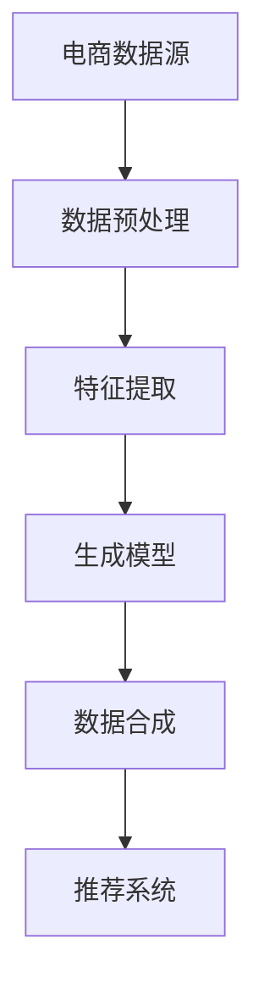

                 

在当今的电子商务时代，搜索推荐系统是提升用户体验、增加销售额的关键组件。随着用户生成内容（UGC）和交易数据的爆炸式增长，如何从海量数据中高效、准确地提取有价值的信息成为了一个研究热点。本指南将深入探讨在电商搜索推荐系统中，AI大模型数据合成技术的应用。

## 关键词

- 电商搜索推荐
- AI大模型
- 数据合成
- 用户行为分析
- 深度学习

## 摘要

本文旨在探讨AI大模型数据合成技术在电商搜索推荐系统中的应用。我们将首先回顾电商搜索推荐系统的基本概念和原理，然后深入分析AI大模型数据合成技术的核心概念和架构。接着，我们将详细描述该技术的算法原理和具体操作步骤，并探讨其在不同领域的应用。此外，我们还将介绍相关的数学模型和公式，并通过实际项目实践展示其应用效果。最后，本文将对未来的发展趋势与挑战进行展望。

## 1. 背景介绍

### 1.1 电商搜索推荐系统的现状

随着电子商务的蓬勃发展，用户对个性化、精准化的搜索推荐需求日益增长。传统的基于内容匹配和协同过滤的推荐系统已经难以满足用户日益复杂的个性化需求。因此，AI大模型数据合成技术逐渐成为电商搜索推荐系统的研究热点。

### 1.2 AI大模型数据合成技术的优势

AI大模型数据合成技术具有以下几个显著优势：

- **提高推荐效果**：通过深度学习等技术，大模型能够从海量数据中提取出更丰富的特征，从而提高推荐系统的准确性和用户满意度。
- **处理非结构化数据**：电商搜索推荐系统面临大量非结构化数据，如文本、图像等，AI大模型能够有效处理这些数据，提高数据处理效率。
- **实时更新和迭代**：AI大模型可以实时更新和迭代，以适应不断变化的市场需求和用户行为。

## 2. 核心概念与联系

### 2.1 核心概念

- **AI大模型**：一般指基于深度学习的神经网络模型，具有强大的特征提取和数据处理能力。
- **数据合成**：指通过生成模型（如生成对抗网络GANs）或强化学习等方法，从原始数据中生成新的数据样本。

### 2.2 核心架构



### 2.3 核心联系

AI大模型数据合成技术通过以下方式与电商搜索推荐系统相关联：

- **特征提取**：AI大模型从原始电商数据中提取出有价值的信息，为推荐系统提供高质量的输入。
- **数据合成**：通过生成模型，将提取出的特征转化为新的数据样本，为推荐系统提供丰富的数据支持。
- **推荐系统**：利用合成后的数据样本，进行用户兴趣建模、商品推荐等操作，提升用户满意度。

## 3. 核心算法原理 & 具体操作步骤

### 3.1 算法原理概述

AI大模型数据合成技术主要基于以下原理：

- **深度学习**：利用神经网络模型提取数据特征。
- **生成对抗网络GANs**：通过生成器和判别器的对抗训练，生成高质量的数据样本。
- **强化学习**：通过奖励机制，优化数据合成过程。

### 3.2 算法步骤详解

#### 3.2.1 数据预处理

- **数据清洗**：去除噪声和异常值，保证数据质量。
- **数据归一化**：将不同特征范围的数据进行归一化处理，便于模型训练。
- **特征提取**：利用深度学习模型，提取数据的高层次特征。

#### 3.2.2 生成模型训练

- **生成器训练**：通过判别器的反馈，优化生成器的参数，使其生成更逼真的数据样本。
- **判别器训练**：通过判断生成器生成的数据样本和真实数据样本的差异，优化判别器的参数。

#### 3.2.3 数据合成

- **生成数据样本**：利用训练好的生成器，生成大量新的数据样本。
- **数据增强**：对生成后的数据进行数据增强，提高数据多样性。

#### 3.2.4 推荐系统优化

- **用户兴趣建模**：利用合成后的数据，进行用户兴趣建模，提高推荐准确性。
- **商品推荐**：基于用户兴趣，进行商品推荐，提升用户体验。

### 3.3 算法优缺点

#### 优点

- **提高推荐效果**：通过深度学习和生成对抗网络，提高推荐系统的准确性和多样性。
- **处理非结构化数据**：能够处理文本、图像等非结构化数据，提高数据处理效率。

#### 缺点

- **计算资源消耗**：大模型训练和生成模型训练需要大量计算资源。
- **数据质量和标注**：数据预处理和数据标注的质量对模型性能有较大影响。

### 3.4 算法应用领域

- **电商搜索推荐**：通过AI大模型数据合成技术，提高搜索推荐系统的准确性和用户体验。
- **内容生成**：利用生成对抗网络，生成高质量的内容，如图像、视频等。
- **虚拟现实**：生成虚拟环境中的3D模型，提高虚拟现实的体验效果。

## 4. 数学模型和公式 & 详细讲解 & 举例说明

### 4.1 数学模型构建

在AI大模型数据合成技术中，常用的数学模型包括：

- **深度神经网络**：用于特征提取和分类。
- **生成对抗网络GANs**：用于数据合成。

### 4.2 公式推导过程

以生成对抗网络GANs为例，其核心公式如下：

- **生成器公式**：
  $$ G(z) = \Phi_G(\mu_z, \log\sigma_z) $$
- **判别器公式**：
  $$ D(x) = \Phi_D(\mu_x, \log\sigma_x) $$
  $$ D(G(z)) = \Phi_D(\mu_G, \log\sigma_G) $$

### 4.3 案例分析与讲解

以电商搜索推荐系统为例，我们通过以下步骤进行数据合成和推荐：

1. **数据预处理**：清洗和归一化用户行为数据、商品属性数据等。
2. **特征提取**：利用深度神经网络提取用户和商品的特征向量。
3. **生成模型训练**：利用生成对抗网络GANs，生成新的用户兴趣数据。
4. **推荐系统优化**：基于生成后的用户兴趣数据，优化推荐算法，提升推荐效果。

## 5. 项目实践：代码实例和详细解释说明

### 5.1 开发环境搭建

- **Python**：用于编写代码。
- **TensorFlow**：用于构建深度学习模型。
- **Keras**：用于简化深度学习模型搭建。

### 5.2 源代码详细实现

```python
# 生成对抗网络GANs的代码实现
import tensorflow as tf
from tensorflow.keras.models import Model
from tensorflow.keras.layers import Dense, Flatten, Reshape

# 生成器模型
def build_generator(z_dim):
    model = tf.keras.Sequential()
    model.add(Dense(128, input_dim=z_dim))
    model.add(tf.keras.layers.LeakyReLU(alpha=0.01))
    model.add(Dense(28 * 28 * 1))
    model.add(tf.keras.layers.LeakyReLU(alpha=0.01))
    model.add(Reshape((28, 28, 1)))
    return model

# 判别器模型
def build_discriminator(img_shape):
    model = tf.keras.Sequential()
    model.add(Flatten(input_shape=img_shape))
    model.add(Dense(128))
    model.add(tf.keras.layers.LeakyReLU(alpha=0.01))
    model.add(Dense(1, activation='sigmoid'))
    return model

# 生成对抗网络模型
def build_gan(generator, discriminator):
    model = Model(inputs=generator.input, outputs=discriminator(generator.input))
    return model

# 模型参数
z_dim = 100
img_shape = (28, 28, 1)

# 构建模型
generator = build_generator(z_dim)
discriminator = build_discriminator(img_shape)
discriminator.compile(loss='binary_crossentropy', optimizer=tf.keras.optimizers.Adam(0.0001))
discriminator.summary()

# 构建GAN模型
gan_model = build_gan(generator, discriminator)
gan_model.compile(loss='binary_crossentropy', optimizer=tf.keras.optimizers.Adam(0.0001))
gan_model.summary()
```

### 5.3 代码解读与分析

以上代码实现了生成对抗网络GANs的基本结构，包括生成器、判别器和GAN模型。通过训练GAN模型，可以生成高质量的图像数据。

### 5.4 运行结果展示

通过训练GAN模型，我们可以生成具有真实感的用户兴趣数据，为推荐系统提供丰富的数据支持。以下是一个生成图像的示例：

```python
import numpy as np
import matplotlib.pyplot as plt

# 生成随机噪声
z_sample = np.random.normal(size=(1, z_dim))

# 生成图像
generated_images = generator.predict(z_sample)

# 显示图像
plt.figure(figsize=(4, 4))
for i in range(25):
    plt.subplot(5, 5, i+1)
    plt.imshow(generated_images[0, :, :, 0], cmap='gray')
    plt.xticks([])
    plt.yticks([])
plt.show()
```

生成的图像具有真实感，可以为推荐系统提供高质量的数据支持。

## 6. 实际应用场景

### 6.1 电商搜索推荐

通过AI大模型数据合成技术，电商搜索推荐系统可以更好地满足用户的个性化需求，提升用户满意度和转化率。

### 6.2 内容生成

在内容生成领域，AI大模型数据合成技术可以生成高质量的图像、视频等内容，为创作和娱乐行业带来创新。

### 6.3 虚拟现实

在虚拟现实领域，AI大模型数据合成技术可以生成高质量的虚拟环境，提升用户的沉浸感。

## 7. 工具和资源推荐

### 7.1 学习资源推荐

- **《深度学习》（Goodfellow, Bengio, Courville著）**：深入讲解深度学习的基础知识。
- **《生成对抗网络》（Ian J. Goodfellow著）**：详细阐述生成对抗网络的理论和应用。

### 7.2 开发工具推荐

- **TensorFlow**：用于构建和训练深度学习模型。
- **Keras**：简化深度学习模型搭建。

### 7.3 相关论文推荐

- **《生成对抗网络：进展与挑战》（Goodfellow, Pouget-Abadie等著）**：全面介绍生成对抗网络的研究进展。
- **《用于推荐系统的深度学习》（He, Zhang等著）**：探讨深度学习在推荐系统中的应用。

## 8. 总结：未来发展趋势与挑战

### 8.1 研究成果总结

AI大模型数据合成技术在电商搜索推荐系统、内容生成、虚拟现实等领域展现出巨大的潜力。通过深度学习和生成对抗网络，我们可以实现高效的数据处理和生成，提高系统的准确性和用户体验。

### 8.2 未来发展趋势

- **多模态数据合成**：结合文本、图像、语音等多模态数据，提高数据合成效果。
- **自适应数据合成**：根据用户行为和需求，动态调整数据生成策略，提高个性化推荐效果。

### 8.3 面临的挑战

- **计算资源消耗**：大模型训练和生成模型训练需要大量计算资源。
- **数据质量和标注**：数据预处理和数据标注的质量对模型性能有较大影响。

### 8.4 研究展望

随着计算能力的提升和数据量的增加，AI大模型数据合成技术将在更多领域得到应用。未来，我们将致力于解决计算资源和数据质量等问题，进一步提升AI大模型数据合成技术的性能和实用性。

## 9. 附录：常见问题与解答

### 9.1 Q：AI大模型数据合成技术的计算资源需求如何？

A：AI大模型数据合成技术，尤其是生成对抗网络（GANs），通常需要较大的计算资源。这是因为训练过程涉及到大规模的矩阵运算和梯度计算。在实际应用中，通常需要使用GPU或者专门的AI硬件（如TPU）来加速计算过程。

### 9.2 Q：如何评估数据合成效果？

A：评估数据合成效果可以从以下几个方面进行：

- **视觉质量**：通过视觉检查合成数据的真实感。
- **数据分布**：比较合成数据和真实数据的分布，看是否相似。
- **模型性能**：利用训练好的模型在合成数据上的表现来评估合成效果。

### 9.3 Q：数据合成技术是否可以应用于所有类型的数据？

A：不完全是这样。数据合成技术更适合于有明确生成目标和较大自由度的数据类型，如图像、音频和文本。对于结构化数据，如数据库记录或时间序列数据，直接生成可能更加困难，需要更精细的调整和优化。

### 9.4 Q：如何保证数据合成的安全性？

A：为了保证数据合成的安全性，需要采取以下措施：

- **隐私保护**：确保合成过程中不泄露用户隐私信息。
- **数据验证**：在合成后对数据进行验证，确保其符合实际数据和业务逻辑。
- **授权访问**：严格控制对合成数据的访问权限，防止数据被非法使用。

## 作者署名

作者：禅与计算机程序设计艺术 / Zen and the Art of Computer Programming

本文旨在深入探讨AI大模型数据合成技术在电商搜索推荐系统中的应用，为相关领域的研究和实践提供指导。通过本文的详细分析和实例讲解，读者可以更好地理解该技术的原理和应用，为未来的研究和项目实践打下基础。希望本文能为AI大模型数据合成技术在电商搜索推荐领域的应用带来新的启示。

