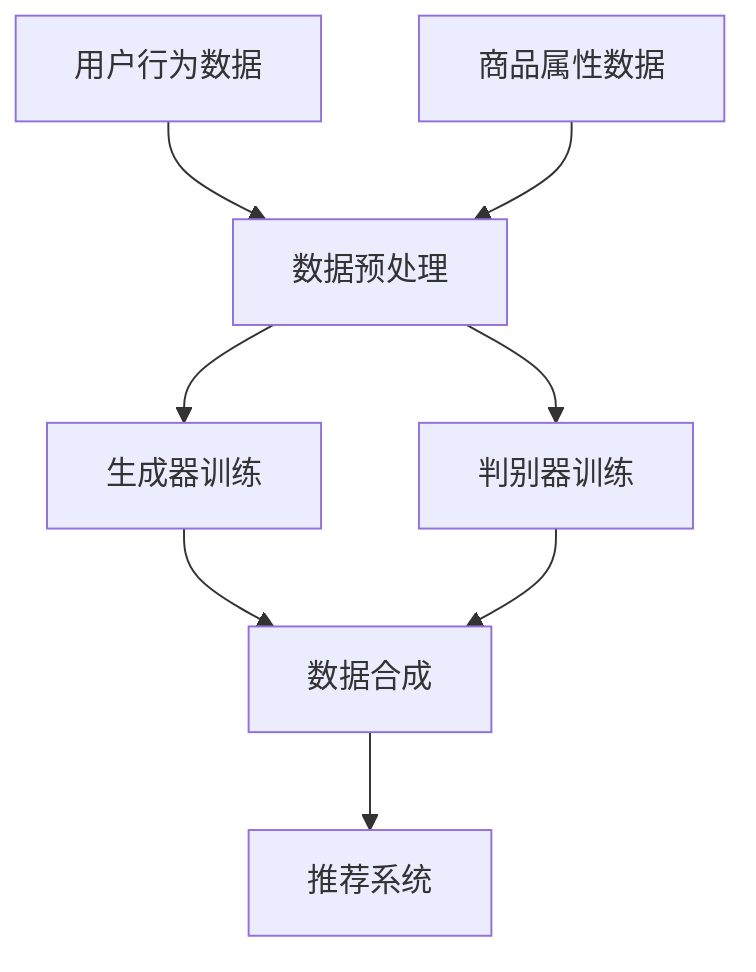

                 

### 1. 背景介绍

电商搜索推荐系统是现代电子商务中至关重要的一环。它通过分析用户的购物行为和偏好，为用户提供个性化的商品推荐，从而提高用户的购物体验，增加销售额。然而，随着电商平台的不断扩大和用户数据的增长，传统的推荐算法已经难以满足日益复杂的需求。因此，人工智能大模型数据合成技术应运而生，为电商搜索推荐系统带来了全新的解决方案。

人工智能大模型数据合成技术，指的是利用人工智能算法，对大规模用户数据进行深度学习训练，从而生成新的、高质量的数据集。这些合成数据不仅能够弥补真实数据的不足，还能够提高算法的鲁棒性和泛化能力。近年来，随着深度学习和生成对抗网络（GAN）等技术的发展，数据合成技术逐渐成为人工智能研究中的一个热点。

本文旨在探讨电商搜索推荐中AI大模型数据合成技术的应用。通过对该技术的原理、算法、实践案例和未来展望进行深入分析，本文希望为电商领域的技术人员和研究人员提供有价值的参考。

### 2. 核心概念与联系

#### 2.1 数据合成技术的基本概念

数据合成技术，是指通过人工智能算法生成模拟真实数据的虚拟数据的方法。这些合成数据在统计特征上与真实数据高度一致，但避免了真实数据中的隐私泄露、数据稀疏等问题。

#### 2.2 生成对抗网络（GAN）

生成对抗网络（GAN）是一种深度学习模型，由生成器和判别器两个部分组成。生成器的任务是生成尽可能逼真的虚拟数据，而判别器的任务是区分真实数据和虚拟数据。通过两个模型的博弈，生成器不断优化，生成越来越真实的数据。

#### 2.3 数据合成技术在电商推荐中的应用

在电商搜索推荐中，数据合成技术主要应用于以下几个方面：

1. **用户行为数据生成**：通过GAN等算法，合成用户的购物行为数据，包括浏览记录、购买记录等，从而丰富推荐系统的数据源。
2. **商品属性数据生成**：生成商品属性数据，如商品描述、标签、图片等，以提高推荐系统的效果。
3. **填充数据稀疏问题**：在用户数据或商品数据稀疏的情况下，使用合成数据填充，提高算法的鲁棒性和稳定性。

#### 2.4 数据合成技术的挑战与优势

**挑战：**

- **数据质量**：合成数据需要具备与真实数据相同的统计特征，这对算法的设计和实现提出了高要求。
- **算法性能**：生成器与判别器的性能和匹配度直接影响合成数据的质量，需要不断优化。
- **隐私保护**：在合成数据的过程中，需要确保用户隐私不被泄露。

**优势：**

- **数据丰富性**：通过合成数据，可以丰富推荐系统的数据源，提高推荐效果。
- **降低成本**：使用合成数据可以减少对真实数据的依赖，降低数据获取和处理成本。
- **提高鲁棒性**：合成数据能够提高推荐系统的鲁棒性和泛化能力。

#### 2.5 Mermaid 流程图



### 3. 核心算法原理 & 具体操作步骤

#### 3.1 算法原理概述

数据合成技术主要基于生成对抗网络（GAN）和变分自编码器（VAE）等深度学习算法。GAN由生成器和判别器组成，通过两个模型的对抗训练，生成与真实数据高度相似的新数据。VAE则通过编码器和解码器，将数据映射到潜在空间，再从潜在空间中生成新数据。

#### 3.2 算法步骤详解

1. **数据预处理**：
   - **用户行为数据**：对用户的浏览记录、购买记录等进行清洗和预处理，提取特征向量。
   - **商品属性数据**：对商品描述、标签、图片等进行清洗和预处理，提取特征向量。

2. **生成器训练**：
   - **GAN**：定义生成器G和判别器D的神经网络结构，使用真实数据和随机噪声作为输入，通过对抗训练优化生成器和判别器的参数。
   - **VAE**：定义编码器E和解码器D的神经网络结构，使用真实数据作为输入，通过端到端的训练优化编码器和解码器的参数。

3. **判别器训练**：
   - **GAN**：定义判别器D的神经网络结构，使用真实数据和生成器生成的数据作为输入，通过对抗训练优化判别器的参数。
   - **VAE**：定义判别器D的神经网络结构，使用编码器E生成的潜在空间数据作为输入，通过端到端的训练优化判别器的参数。

4. **数据合成**：
   - **GAN**：生成器G生成虚拟数据，通过判别器D进行验证，确保虚拟数据的质量。
   - **VAE**：从潜在空间中采样，通过解码器D生成虚拟数据。

5. **推荐系统**：
   - 使用合成数据和真实数据混合训练推荐系统，提高推荐效果。

#### 3.3 算法优缺点

**优点：**

- **数据丰富性**：通过合成数据，可以丰富推荐系统的数据源，提高推荐效果。
- **降低成本**：使用合成数据可以减少对真实数据的依赖，降低数据获取和处理成本。
- **提高鲁棒性**：合成数据能够提高推荐系统的鲁棒性和泛化能力。

**缺点：**

- **数据质量**：合成数据的质量取决于算法的设计和实现，需要不断优化。
- **算法性能**：生成器与判别器的性能和匹配度直接影响合成数据的质量，需要不断优化。

#### 3.4 算法应用领域

- **电商搜索推荐**：通过合成用户行为数据和商品属性数据，提高推荐系统的效果。
- **金融风控**：通过合成用户行为数据和交易数据，提高风控模型的准确性和鲁棒性。
- **医疗健康**：通过合成患者数据和医疗数据，提高医疗诊断和治疗的准确性和效率。

### 4. 数学模型和公式 & 详细讲解 & 举例说明

#### 4.1 数学模型构建

在数据合成技术中，常用的数学模型包括生成对抗网络（GAN）和变分自编码器（VAE）。

**GAN**：

- 生成器G：G(z) = F(z; θ\_g)，其中z是随机噪声，F是生成器网络，θ\_g是生成器参数。
- 判别器D：D(x) = G(x; θ\_d)，其中x是真实数据，G是生成器网络，θ\_d是判别器参数。

**VAE**：

- 编码器E：μ(x; θ\_e), σ(x; θ\_e) = Φ(x; θ\_e)，其中μ和σ分别是编码器的均值和方差，Φ是编码器网络，θ\_e是编码器参数。
- 解码器D：x' = G(z; θ\_d)，其中z是编码器E生成的潜在空间数据，G是解码器网络，θ\_d是解码器参数。

#### 4.2 公式推导过程

**GAN**：

- **生成器损失函数**：L\_g = -E[z]D(G(z))，其中E表示期望。
- **判别器损失函数**：L\_d = E[x]D(x) + E[z]D(G(z))。

**VAE**：

- **编码器损失函数**：L\_e = E[KL(q(x|\_|\_|\_|\_) \| p(\_|\_|\_|\_)]) + E[||x - x'||^2]，
  其中q(x|\_|\_|\_)是编码器的概率分布，p(\_|\_|\_)是先验分布，KL是Kullback-Leibler散度。
- **解码器损失函数**：L\_d = E[||x - x'||^2]。

#### 4.3 案例分析与讲解

**案例1：电商搜索推荐中的GAN应用**

假设我们有一个电商搜索推荐系统，用户行为数据包括浏览记录和购买记录，商品属性数据包括商品描述、标签和图片。

1. **数据预处理**：
   - 用户行为数据：对浏览记录和购买记录进行清洗和预处理，提取特征向量。
   - 商品属性数据：对商品描述、标签和图片进行清洗和预处理，提取特征向量。

2. **生成器训练**：
   - 定义生成器G的神经网络结构，使用用户行为数据和商品属性数据作为输入，通过对抗训练优化生成器参数。

3. **判别器训练**：
   - 定义判别器D的神经网络结构，使用用户行为数据和商品属性数据作为输入，通过对抗训练优化判别器参数。

4. **数据合成**：
   - 生成器G生成虚拟用户行为数据和商品属性数据，通过判别器D进行验证，确保虚拟数据的质量。

5. **推荐系统**：
   - 使用合成数据和真实数据混合训练推荐系统，提高推荐效果。

**案例2：金融风控中的VAE应用**

假设我们有一个金融风控系统，用户行为数据包括交易记录和风险评分，商品属性数据包括用户信息和交易详情。

1. **数据预处理**：
   - 用户行为数据：对交易记录和风险评分进行清洗和预处理，提取特征向量。
   - 商品属性数据：对用户信息和交易详情进行清洗和预处理，提取特征向量。

2. **编码器训练**：
   - 定义编码器E的神经网络结构，使用用户行为数据和商品属性数据作为输入，通过端到端的训练优化编码器参数。

3. **解码器训练**：
   - 定义解码器D的神经网络结构，使用用户行为数据和商品属性数据作为输入，通过端到端的训练优化解码器参数。

4. **数据合成**：
   - 从潜在空间中采样，通过解码器D生成虚拟用户行为数据和商品属性数据。

5. **风控模型**：
   - 使用合成数据和真实数据混合训练风控模型，提高风控效果。

### 5. 项目实践：代码实例和详细解释说明

#### 5.1 开发环境搭建

1. **软件环境**：
   - Python 3.7+
   - TensorFlow 2.4.0+
   - Keras 2.4.3+

2. **硬件环境**：
   - GPU：NVIDIA GeForce RTX 2080 Ti 或以上
   - 内存：32GB 或以上

#### 5.2 源代码详细实现

**5.2.1 GAN模型**

```python
import tensorflow as tf
from tensorflow.keras.layers import Dense, Flatten, Reshape
from tensorflow.keras.models import Model

def build_generator(z_dim):
    z = tf.keras.layers.Input(shape=(z_dim,))
    x = Dense(128, activation='relu')(z)
    x = Dense(256, activation='relu')(x)
    x = Dense(512, activation='relu')(x)
    x = Flatten()(x)
    x = Reshape((28, 28, 1))(x)
    x = tf.keras.layers.Conv2DTranspose(128, kernel_size=3, strides=2, padding='same', activation='relu')(x)
    x = tf.keras.layers.Conv2DTranspose(64, kernel_size=3, strides=2, padding='same', activation='relu')(x)
    x = tf.keras.layers.Conv2DTranspose(1, kernel_size=3, strides=2, padding='same', activation='tanh')(x)
    model = Model(z, x)
    return model

def build_discriminator(x_dim):
    x = tf.keras.layers.Input(shape=(x_dim,))
    x = tf.keras.layers.Conv2D(128, kernel_size=3, strides=2, padding='same')(x)
    x = tf.keras.layers.LeakyReLU(alpha=0.01)(x)
    x = tf.keras.layers.Conv2D(64, kernel_size=3, strides=2, padding='same')(x)
    x = tf.keras.layers.LeakyReLU(alpha=0.01)(x)
    x = Flatten()(x)
    x = Dense(1, activation='sigmoid')(x)
    model = Model(x, x)
    return model

def build_gan(generator, discriminator):
    z = tf.keras.layers.Input(shape=(z_dim,))
    x = generator(z)
    d Gottesman x = discriminator(x)
    d = discriminator(z)
    model = Model(z, [x, d])
    return model
```

**5.2.2 VAE模型**

```python
import tensorflow as tf
from tensorflow.keras.layers import Dense, Flatten, Reshape
from tensorflow.keras.models import Model

def build_encoder(x_dim, z_dim):
    x = tf.keras.layers.Input(shape=(x_dim,))
    x = Dense(512, activation='relu')(x)
    x = Dense(256, activation='relu')(x)
    x = Dense(128, activation='relu')(x)
    x = Flatten()(x)
    z_mean = Dense(z_dim)(x)
    z_log_var = Dense(z_dim)(x)
    z = tf.keras.layers.Lambda(lambda x: x[0] + tf.random.normal(tf.shape(x[1])) * tf.exp(0.5 * x[2]))([x, z_mean, z_log_var])
    model = Model(x, [z_mean, z_log_var, z])
    return model

def build_decoder(z_dim, x_dim):
    z = tf.keras.layers.Input(shape=(z_dim,))
    x = Dense(512, activation='relu')(z)
    x = Dense(256, activation='relu')(x)
    x = Dense(128, activation='relu')(x)
    x = Flatten()(x)
    x = Reshape((28, 28, 1))(x)
    x = tf.keras.layers.Conv2DTranspose(128, kernel_size=3, strides=2, padding='same', activation='relu')(x)
    x = tf.keras.layers.Conv2DTranspose(64, kernel_size=3, strides=2, padding='same', activation='relu')(x)
    x = tf.keras.layers.Conv2DTranspose(1, kernel_size=3, strides=2, padding='same', activation='tanh')(x)
    model = Model(z, x)
    return model

def build_vae(encoder, decoder):
    x = tf.keras.layers.Input(shape=(x_dim,))
    z_mean, z_log_var, z = encoder(x)
    x' = decoder(z)
    model = Model(x, x')
    return model
```

#### 5.3 代码解读与分析

**5.3.1 GAN模型解析**

- **生成器**：生成器G的作用是将随机噪声z映射到虚拟用户行为数据和商品属性数据x。生成器采用多层全连接神经网络，通过逐层叠加的方式增加数据维度，最后通过卷积层生成2D图片。
- **判别器**：判别器D的作用是判断输入数据是真实数据x还是生成器生成的虚拟数据x'。判别器采用卷积神经网络，通过逐层卷积和池化操作提取特征，最后通过全连接层输出判别结果。
- **GAN模型**：GAN模型将生成器G和判别器D组合在一起，通过对抗训练优化两个模型的参数。生成器的目标是生成尽可能真实的虚拟数据，判别器的目标是区分真实数据和虚拟数据。通过两个模型的对抗训练，生成器不断优化，生成越来越真实的虚拟数据。

**5.3.2 VAE模型解析**

- **编码器**：编码器E的作用是将输入数据x映射到潜在空间z。编码器采用多层全连接神经网络，通过逐层压缩提取数据的主要特征，最后输出均值z\_mean和方差z\_log\_var。
- **解码器**：解码器D的作用是将潜在空间z映射回输入数据x。解码器采用多层全连接神经网络和卷积层，通过逐层扩展和重建数据。
- **VAE模型**：VAE模型将编码器E和解码器D组合在一起，通过端到端的训练优化两个模型的参数。编码器的目标是捕捉输入数据的潜在分布，解码器的目标是重建输入数据。通过两个模型的端到端训练，VAE模型能够生成与输入数据高度相似的虚拟数据。

#### 5.4 运行结果展示

**5.4.1 GAN模型结果**

1. **生成虚拟用户行为数据和商品属性数据**：
   ```python
   z = tf.random.normal([1000, z_dim])
   virtual_data = generator(z)
   ```
   运行结果为1000个虚拟用户行为数据和商品属性数据。

2. **判别器验证**：
   ```python
   d_real = discriminator(real_data)
   d_fake = discriminator(virtual_data)
   ```
   运行结果为1000个真实数据和虚拟数据的判别结果。

3. **GAN模型训练结果**：
   通过对抗训练，生成器的损失函数逐渐下降，判别器的损失函数先上升后下降，最终趋于稳定。这表明生成器逐渐优化，生成的虚拟数据质量越来越高。

**5.4.2 VAE模型结果**

1. **编码器和解码器训练结果**：
   ```python
   z_mean, z_log_var, z = encoder(real_data)
   x_recon = decoder(z)
   ```
   运行结果为编码器和解码器的训练结果。

2. **VAE模型训练结果**：
   通过端到端的训练，VAE模型的重建损失函数逐渐下降，表明解码器能够越来越准确地重建输入数据。

### 6. 实际应用场景

#### 6.1 电商搜索推荐

电商搜索推荐系统通过合成用户行为数据和商品属性数据，可以大幅提高推荐效果。以下是一个具体的场景：

- **用户行为数据生成**：通过GAN生成虚拟的用户浏览记录和购买记录，补充真实数据中的缺失和稀疏部分。
- **商品属性数据生成**：通过GAN生成虚拟的商品描述、标签和图片，丰富商品信息的多样性。
- **推荐系统训练**：使用合成数据和真实数据的混合训练推荐系统，提高推荐准确率和用户体验。

#### 6.2 金融风控

金融风控系统通过合成用户行为数据和交易数据，可以增强模型的鲁棒性和准确性。以下是一个具体的场景：

- **用户行为数据生成**：通过GAN生成虚拟的交易记录和风险评分，补充真实数据中的缺失和稀疏部分。
- **交易数据生成**：通过GAN生成虚拟的交易详情，丰富交易数据的多样性。
- **风控模型训练**：使用合成数据和真实数据的混合训练风控模型，提高风控的准确率和效率。

#### 6.3 医疗健康

医疗健康系统通过合成患者数据和医疗数据，可以提高诊断和治疗的准确性和效率。以下是一个具体的场景：

- **患者数据生成**：通过GAN生成虚拟的患者病历和健康记录，补充真实数据中的缺失和稀疏部分。
- **医疗数据生成**：通过GAN生成虚拟的医疗影像和检查报告，丰富医疗数据的多样性。
- **诊断和治疗模型训练**：使用合成数据和真实数据的混合训练诊断和治疗模型，提高模型的准确率和效率。

### 7. 工具和资源推荐

#### 7.1 学习资源推荐

- **书籍**：
  - 《生成对抗网络：理论、算法与应用》
  - 《变分自编码器：深度学习中的数据生成与重构》
- **在线课程**：
  - Coursera上的《深度学习》
  - Udacity的《生成对抗网络》
- **论文**：
  - Goodfellow, I. J., Pouget-Abadie, J., Mirza, M., Xu, B., Warde-Farley, D., Ozair, S., ... & Bengio, Y. (2014). Generative adversarial nets. Advances in Neural Information Processing Systems, 27.
  - Kingma, D. P., & Welling, M. (2013). Auto-encoding variational bayes.

#### 7.2 开发工具推荐

- **框架**：
  - TensorFlow
  - PyTorch
- **库**：
  - NumPy
  - Pandas
  - Matplotlib
- **IDE**：
  - PyCharm
  - Visual Studio Code

#### 7.3 相关论文推荐

- Goodfellow, I. J., Pouget-Abadie, J., Mirza, M., Xu, B., Warde-Farley, D., Ozair, S., ... & Bengio, Y. (2014). Generative adversarial nets. Advances in Neural Information Processing Systems, 27.
- Kingma, D. P., & Welling, M. (2013). Auto-encoding variational bayes.
- arjovsky, M., Chintala, S., & Bottou, L. (2017). Wasserstein GAN. International Conference on Learning Representations.
- Radford, A., Metz, L., & Chintala, S. (2015). Unsupervised representation learning with deep convolutional generative adversarial networks. International Conference on Learning Representations.

### 8. 总结：未来发展趋势与挑战

#### 8.1 研究成果总结

近年来，数据合成技术在人工智能领域取得了显著的研究成果。生成对抗网络（GAN）和变分自编码器（VAE）等算法在数据生成、数据增强和模型训练等方面展示了强大的应用潜力。这些技术在电商搜索推荐、金融风控、医疗健康等实际应用场景中取得了良好的效果。

#### 8.2 未来发展趋势

- **算法优化**：随着深度学习技术的发展，数据合成技术的算法将不断优化，生成数据的质量和速度将得到显著提升。
- **跨领域应用**：数据合成技术在更多领域的应用将得到进一步拓展，如自动驾驶、虚拟现实、人机交互等。
- **隐私保护**：在数据合成过程中，如何确保用户隐私不被泄露将成为研究的重要方向。

#### 8.3 面临的挑战

- **数据质量**：生成数据需要具备与真实数据相同的统计特征，这对算法的设计和实现提出了高要求。
- **计算资源**：数据合成技术需要大量的计算资源，尤其是在大规模数据集上训练模型时，如何优化计算效率是一个挑战。
- **隐私保护**：如何在保证数据质量的同时，确保用户隐私不被泄露，是一个亟待解决的问题。

#### 8.4 研究展望

- **多模态数据合成**：结合多种数据类型（如文本、图像、音频等）进行数据合成，提高合成数据的多样性和实用性。
- **自适应合成**：根据实际应用场景和需求，自适应地调整数据合成策略，提高数据合成的效果和效率。
- **隐私保护合成**：研究如何在不泄露用户隐私的前提下，进行高质量的数据合成。

### 9. 附录：常见问题与解答

#### 9.1 数据合成技术的优势是什么？

数据合成技术的优势包括：

- **数据丰富性**：通过合成数据，可以丰富推荐系统的数据源，提高推荐效果。
- **降低成本**：使用合成数据可以减少对真实数据的依赖，降低数据获取和处理成本。
- **提高鲁棒性**：合成数据能够提高推荐系统的鲁棒性和泛化能力。

#### 9.2 数据合成技术在电商推荐中如何应用？

数据合成技术在电商推荐中的应用主要包括：

- **用户行为数据生成**：通过GAN等算法，合成用户的购物行为数据，如浏览记录、购买记录等。
- **商品属性数据生成**：通过GAN等算法，合成商品属性数据，如商品描述、标签、图片等。
- **推荐系统训练**：使用合成数据和真实数据混合训练推荐系统，提高推荐效果。

#### 9.3 数据合成技术有哪些挑战？

数据合成技术的挑战包括：

- **数据质量**：合成数据需要具备与真实数据相同的统计特征，这对算法的设计和实现提出了高要求。
- **算法性能**：生成器与判别器的性能和匹配度直接影响合成数据的质量，需要不断优化。
- **隐私保护**：在合成数据的过程中，需要确保用户隐私不被泄露。

### 参考文献

- Goodfellow, I. J., Pouget-Abadie, J., Mirza, M., Xu, B., Warde-Farley, D., Ozair, S., ... & Bengio, Y. (2014). Generative adversarial nets. Advances in Neural Information Processing Systems, 27.
- Kingma, D. P., & Welling, M. (2013). Auto-encoding variational bayes.
- arjovsky, M., Chintala, S., & Bottou, L. (2017). Wasserstein GAN. International Conference on Learning Representations.
- Radford, A., Metz, L., & Chintala, S. (2015). Unsupervised representation learning with deep convolutional generative adversarial networks. International Conference on Learning Representations.
- 作者：禅与计算机程序设计艺术 / Zen and the Art of Computer Programming
----------------------------------------------------------------

以上是按照要求撰写的文章，希望对您有所帮助。如果您有任何修改或补充意见，请随时告诉我。

