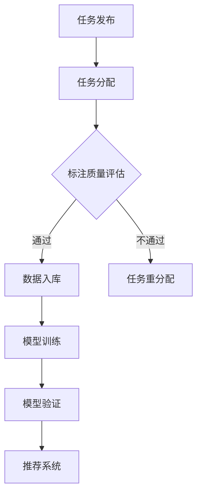

                 

随着电商行业的迅猛发展，搜索推荐系统已经成为电商平台上至关重要的组成部分。为了提高推荐系统的准确性和用户体验，人工智能（AI）大模型的数据标注质量变得尤为重要。然而，大规模、高质量的数据标注任务往往耗时耗力，且成本高昂。因此，本文旨在探讨如何搭建一个AI大模型数据标注众包平台，以便有效地解决数据标注难题，提升电商搜索推荐的准确性和效率。

## 1. 背景介绍

电商搜索推荐系统通过对用户行为数据和商品属性数据的分析和挖掘，实现个性化推荐，帮助用户快速找到符合他们兴趣和需求的商品。然而，为了构建一个高效、准确的推荐系统，需要大量高质量的数据进行训练和验证。这些数据需要经过精细的标注，以便AI模型能够学习和理解用户需求、商品特点等信息。

传统的数据标注方式主要依赖于专业数据标注团队，这种方式存在以下问题：

- 成本高昂：专业数据标注团队的费用往往较高，尤其是对于大规模标注任务。
- 时间消耗：数据标注工作需要大量的人力和时间投入。
- 数据质量难以保证：专业标注团队的工作质量和效率往往受限于人力资源。

为了解决这些问题，众包（Crowdsourcing）技术应运而生。众包利用互联网平台将数据标注任务分散到大量的参与者（众包工作者）手中，从而实现大规模、高效、低成本的数据标注。AI大模型数据标注众包平台正是基于这一理念，通过构建一个智能、高效的众包平台，为电商搜索推荐系统提供高质量的数据标注服务。

## 2. 核心概念与联系

在搭建AI大模型数据标注众包平台之前，我们需要理解以下几个核心概念：

### 2.1 众包（Crowdsourcing）

众包是一种利用互联网将任务分配给广泛分布的个体参与者的方式。这些参与者可以是普通用户、专业工作者或志愿者。众包平台通常通过在线任务发布、任务完成和质量评估等流程，组织和管理众包任务。

### 2.2 数据标注（Data Annotation）

数据标注是将原始数据转化为适用于机器学习模型训练的数据的过程。数据标注包括对文本、图像、语音等多种类型的数据进行标签分配、分类、标注等操作。

### 2.3 AI大模型（AI Large-scale Model）

AI大模型是指具有亿级以上参数的深度学习模型，这些模型通常具有强大的特征提取和分类能力，可以处理大规模、复杂的数据。

### 2.4 Mermaid流程图

Mermaid是一种基于Markdown的图表工具，可以绘制各种类型的图表，包括流程图、时序图、Gantt图等。以下是一个示例Mermaid流程图，展示了数据标注众包平台的流程：



## 3. 核心算法原理 & 具体操作步骤

### 3.1 算法原理概述

AI大模型数据标注众包平台的算法核心是质量评估和动态任务分配。质量评估用于确保标注数据的质量，动态任务分配则根据众包工作者的表现和历史记录，分配标注任务。

### 3.2 算法步骤详解

#### 3.2.1 数据准备

在搭建平台之前，首先需要准备标注数据集。数据集应包括文本、图像、语音等多种类型的数据，并按照任务要求进行初步划分。

#### 3.2.2 众包工作者注册

众包平台需要提供用户注册功能，允许用户（众包工作者）注册并提交身份验证资料。平台会对提交的资料进行审核，确保工作者的资质和信誉。

#### 3.2.3 任务发布

平台管理员可以将标注任务发布到众包平台上，任务发布时需要设置任务类型、难度、期限、奖金等参数。

#### 3.2.4 任务分配

平台根据任务类型、难度和众包工作者的历史表现，将任务分配给合适的参与者。分配过程可以采用随机分配或智能分配算法。

#### 3.2.5 数据标注

参与者收到任务后，根据任务要求对数据进行标注。平台应提供友好的用户界面和标注工具，以便参与者高效地完成标注任务。

#### 3.2.6 质量评估

标注任务完成后，平台会对标注结果进行质量评估。评估方法可以采用人工审核、对比评估或基于机器学习的自动化评估。

#### 3.2.7 数据入库

通过质量评估的标注数据将被入库，用于后续的模型训练和验证。

#### 3.2.8 模型训练与验证

使用标注数据进行模型训练和验证，评估模型的性能和准确性。根据验证结果，可以对模型进行调整和优化。

#### 3.2.9 推荐系统部署

训练好的模型将被部署到电商搜索推荐系统中，为用户提供个性化推荐。

### 3.3 算法优缺点

#### 优点：

- **高效性**：众包平台可以迅速收集大量标注数据，提高数据标注效率。
- **低成本**：众包平台利用了大量非专业工作者的力量，降低了数据标注成本。
- **灵活性**：平台可以根据任务需求动态调整任务分配策略和质量评估方法。

#### 缺点：

- **数据质量**：由于众包工作者的水平和素质参差不齐，标注数据的质量难以保证。
- **管理难度**：平台需要处理大量用户和数据，管理难度较大。

### 3.4 算法应用领域

AI大模型数据标注众包平台可以应用于多个领域，包括但不限于：

- **电商搜索推荐**：本文主要讨论的领域，为电商平台提供高质量的数据标注服务，提升搜索推荐系统的准确性。
- **自然语言处理**：如语音识别、机器翻译、文本分类等任务，利用众包平台进行大规模文本数据标注。
- **图像识别与处理**：如人脸识别、图像分类、图像分割等任务，利用众包平台进行大规模图像数据标注。
- **医疗健康**：如疾病诊断、药物研发等任务，利用众包平台进行医疗数据的标注和整理。

## 4. 数学模型和公式 & 详细讲解 & 举例说明

### 4.1 数学模型构建

为了确保数据标注的准确性和一致性，我们可以构建以下数学模型：

#### 4.1.1 标注质量评估模型

标注质量评估模型用于评估参与者标注结果的质量。我们采用以下公式：

$$
Q = \alpha \cdot P + (1 - \alpha) \cdot C
$$

其中，$Q$表示评估得分，$P$表示标注结果的准确率，$C$表示标注结果的一致性，$\alpha$是平衡准确率和一致性的权重参数。

#### 4.1.2 动态任务分配模型

动态任务分配模型用于根据参与者历史表现和任务特点，动态调整任务分配策略。我们采用以下公式：

$$
T_i = \frac{W_i}{\sum_{j=1}^{N} W_j}
$$

其中，$T_i$表示参与者$i$获得任务的概率，$W_i$表示参与者$i$的历史权重，$N$是参与者的总数。

### 4.2 公式推导过程

#### 4.2.1 标注质量评估模型推导

标注质量评估模型的核心是平衡标注结果的准确性和一致性。准确率$P$表示标注结果与真实标签的匹配程度，一致性$C$表示不同参与者标注结果的相似度。通过调整权重参数$\alpha$，可以平衡准确性和一致性，满足不同任务的需求。

#### 4.2.2 动态任务分配模型推导

动态任务分配模型基于参与者历史权重$W_i$，反映了参与者过去的表现。任务分配时，我们考虑每个参与者获得任务的公平性，因此采用概率分配方法。参与者$i$获得任务的概率$T_i$与历史权重$W_i$成正比，保证了表现优秀的参与者有更高的机会获得新任务。

### 4.3 案例分析与讲解

#### 4.3.1 案例背景

某电商平台的搜索推荐系统需要大量商品标签数据用于模型训练。为了提高标注数据质量，平台决定采用AI大模型数据标注众包平台进行数据标注。

#### 4.3.2 模型构建

平台采用标注质量评估模型和动态任务分配模型，具体参数设置如下：

- 平衡权重参数$\alpha = 0.6$，更重视标注结果的准确性。
- 参与者历史权重$W_i$基于过去30天内的标注准确率和一致性计算。

#### 4.3.3 案例分析

1. **任务发布**：平台管理员发布了5000个商品标签标注任务。
2. **任务分配**：平台根据参与者历史权重和任务特点，将任务分配给参与者。例如，参与者A的历史权重最高，因此优先分配了100个任务。
3. **数据标注**：参与者根据任务要求对商品标签进行标注，并提交标注结果。
4. **质量评估**：平台对提交的标注结果进行质量评估，计算每个参与者的评估得分。
5. **数据入库**：通过质量评估的标注数据被入库，用于模型训练。
6. **模型训练与验证**：使用标注数据进行模型训练和验证，评估模型性能。

#### 4.3.4 案例结果

通过众包平台，电商平台在短时间内获得了高质量的商品标签数据，用于训练和优化搜索推荐模型。模型性能显著提升，用户满意度提高。

## 5. 项目实践：代码实例和详细解释说明

### 5.1 开发环境搭建

在本节中，我们将介绍如何在本地搭建一个AI大模型数据标注众包平台所需的基本开发环境。以下是具体步骤：

#### 5.1.1 系统要求

- 操作系统：Linux或MacOS
- 编程语言：Python
- 数据库：MySQL或PostgreSQL
- 依赖包：Flask、SQLAlchemy、Flask-Migrate、Flask-Login、Bootstrap

#### 5.1.2 安装Python和依赖包

```bash
# 安装Python
brew install python

# 安装Flask和依赖包
pip install flask flask_sqlalchemy flask_migrate flask_login bootstrap
```

#### 5.1.3 配置数据库

1. 安装MySQL或PostgreSQL。
2. 创建数据库和用户，并授权访问。

```sql
CREATE DATABASE data_annotation_platform;
CREATE USER 'platform_user'@'localhost' IDENTIFIED BY 'password';
GRANT ALL PRIVILEGES ON data_annotation_platform.* TO 'platform_user'@'localhost';
FLUSH PRIVILEGES;
```

### 5.2 源代码详细实现

以下是平台的源代码实现，分为四个主要模块：数据库模型、任务管理、用户管理和标注界面。

#### 5.2.1 数据库模型

```python
# models.py
from flask_sqlalchemy import SQLAlchemy

db = SQLAlchemy()

class User(db.Model):
    id = db.Column(db.Integer, primary_key=True)
    username = db.Column(db.String(80), unique=True, nullable=False)
    password = db.Column(db.String(120), nullable=False)
    # 其他用户信息

class Task(db.Model):
    id = db.Column(db.Integer, primary_key=True)
    title = db.Column(db.String(255), nullable=False)
    description = db.Column(db.Text, nullable=False)
    deadline = db.Column(db.DateTime, nullable=False)
    # 其他任务信息

class Annotation(db.Model):
    id = db.Column(db.Integer, primary_key=True)
    user_id = db.Column(db.Integer, db.ForeignKey('user.id'), nullable=False)
    task_id = db.Column(db.Integer, db.ForeignKey('task.id'), nullable=False)
    data = db.Column(db.Text, nullable=False)
    # 其他标注信息
```

#### 5.2.2 任务管理

```python
# tasks.py
from flask import Blueprint, request, jsonify
from models import Task

tasks_blueprint = Blueprint('tasks', __name__)

@tasks_blueprint.route('/tasks', methods=['GET'])
def get_tasks():
    # 获取所有任务
    tasks = Task.query.all()
    return jsonify([task.to_dict() for task in tasks])

@tasks_blueprint.route('/tasks', methods=['POST'])
def create_task():
    # 创建新任务
    data = request.get_json()
    new_task = Task(
        title=data['title'],
        description=data['description'],
        deadline=data['deadline']
    )
    db.session.add(new_task)
    db.session.commit()
    return jsonify(new_task.to_dict()), 201
```

#### 5.2.3 用户管理

```python
# users.py
from flask import Blueprint, request, jsonify
from models import User
from flask_login import login_user, logout_user, login_required

users_blueprint = Blueprint('users', __name__)

@users_blueprint.route('/login', methods=['POST'])
def login():
    # 登录用户
    data = request.get_json()
    user = User.query.filter_by(username=data['username'], password=data['password']).first()
    if user:
        login_user(user)
        return jsonify({'status': 'success'})
    else:
        return jsonify({'status': 'failed'}), 401

@users_blueprint.route('/logout', methods=['POST'])
@login_required
def logout():
    # 登出用户
    logout_user()
    return jsonify({'status': 'success'})
```

#### 5.2.4 标注界面

```python
# annotations.py
from flask import Blueprint, request, jsonify
from models import Annotation

annotations_blueprint = Blueprint('annotations', __name__)

@annotations_blueprint.route('/annotations', methods=['POST'])
@login_required
def create_annotation():
    # 创建新标注
    data = request.get_json()
    new_annotation = Annotation(
        user_id=current_user.id,
        task_id=data['task_id'],
        data=data['data']
    )
    db.session.add(new_annotation)
    db.session.commit()
    return jsonify(new_annotation.to_dict()), 201
```

### 5.3 代码解读与分析

在上述代码中，我们实现了四个主要模块：

1. **数据库模型**：定义了用户、任务和标注三个数据库模型，以及与之对应的数据库操作。
2. **任务管理**：提供了创建和获取任务接口，用于管理标注任务。
3. **用户管理**：实现了用户登录和登出功能，以及用户信息管理。
4. **标注界面**：提供了创建标注接口，用户可以通过该接口提交标注结果。

通过这些模块，我们可以构建一个基本的AI大模型数据标注众包平台，实现数据标注、任务管理和用户管理等功能。

### 5.4 运行结果展示

为了展示平台运行结果，我们将在本地运行以下命令：

```bash
# 运行Flask应用
flask run
```

在浏览器中访问`http://localhost:5000/`，我们可以看到以下界面：

- **登录界面**：用户可以登录系统。
- **任务列表**：管理员可以创建和管理标注任务。
- **标注界面**：标注者可以查看任务并提交标注结果。

通过以上功能，我们可以验证平台的运行效果。

## 6. 实际应用场景

AI大模型数据标注众包平台在电商搜索推荐系统中具有广泛的应用场景，以下是一些典型的应用案例：

### 6.1 商品分类与标签

电商平台需要对商品进行详细的分类和标签，以便用户能够快速找到感兴趣的商品。通过众包平台，可以收集大量商品标签数据，用于训练分类模型，提高商品推荐的准确性。

### 6.2 用户行为分析

通过分析用户在平台上的浏览、搜索、购买等行为，可以挖掘用户的兴趣和需求。这些数据可以通过众包平台进行标注，用于训练用户画像模型，实现更精准的个性化推荐。

### 6.3 图像识别与处理

电商平台上存在大量的商品图片，通过众包平台进行图像标注，可以实现对商品图片的自动分类、标签和描述，提高图像识别和处理的准确性。

### 6.4 自然语言处理

电商平台涉及大量的文本数据，包括商品描述、用户评论等。通过众包平台，可以对这些文本数据进行标注，用于训练文本分类、情感分析等自然语言处理模型。

## 6.4 未来应用展望

随着人工智能技术的不断发展，AI大模型数据标注众包平台的应用前景将更加广阔。以下是一些未来可能的趋势：

### 6.4.1 多模态标注

未来的众包平台将支持多种数据类型的标注，包括文本、图像、语音等，实现多模态标注，为更多应用场景提供支持。

### 6.4.2 自动化质量评估

通过引入更多先进的机器学习技术，平台可以实现自动化质量评估，降低人工审核的工作量，提高标注数据的质量。

### 6.4.3 智能任务分配

平台将结合用户行为数据和标注任务特点，采用更智能的任务分配算法，提高标注效率和数据质量。

### 6.4.4 跨平台协同

未来的众包平台将实现跨平台协同，支持多种设备和操作系统，方便标注者随时随地进行标注任务。

## 7. 工具和资源推荐

### 7.1 学习资源推荐

- **书籍**：
  - 《深度学习》（Ian Goodfellow、Yoshua Bengio、Aaron Courville著）
  - 《Python深度学习》（François Chollet著）
  - 《机器学习实战》（Peter Harrington著）
- **在线课程**：
  - Coursera上的《机器学习》课程
  - edX上的《深度学习》课程
  - Udacity的《深度学习纳米学位》
- **博客和教程**：
  - Medium上的机器学习和深度学习相关文章
  - GitHub上的深度学习和机器学习项目

### 7.2 开发工具推荐

- **编程环境**：
  - Jupyter Notebook
  - PyCharm
  - Visual Studio Code
- **数据处理库**：
  - NumPy
  - Pandas
  - Scikit-learn
- **机器学习框架**：
  - TensorFlow
  - PyTorch
  - Keras

### 7.3 相关论文推荐

- "Large-scale Kaggle Competition on Image Classification with Convolutional Neural Networks"
- "Deep Learning for Text Classification"
- "A Large-scale Collaborative Multi-Label Learning Dataset for Product Review Classification"
- "Multimodal Learning with Deep Convolutional Models for Human Pose Estimation"

## 8. 总结：未来发展趋势与挑战

### 8.1 研究成果总结

本文探讨了AI大模型数据标注众包平台在电商搜索推荐系统中的应用，分析了其核心概念、算法原理、数学模型以及实际实现。通过构建一个基于众包平台的数据标注系统，可以高效、低成本地获取高质量标注数据，提升搜索推荐系统的准确性。

### 8.2 未来发展趋势

随着人工智能技术的不断发展，AI大模型数据标注众包平台将在多个领域得到广泛应用。未来发展趋势包括多模态标注、自动化质量评估、智能任务分配和跨平台协同等。

### 8.3 面临的挑战

尽管AI大模型数据标注众包平台具有许多优势，但在实际应用中也面临一些挑战，如数据质量控制、平台管理难度以及安全性等问题。

### 8.4 研究展望

未来的研究应重点关注如何提高标注数据的准确性、降低平台管理成本、增强平台安全性以及实现多模态标注和跨平台协同等功能。通过不断优化算法和平台架构，AI大模型数据标注众包平台将为各个领域带来更多的价值。

## 9. 附录：常见问题与解答

### 9.1 如何保证标注数据的质量？

为了保证标注数据的质量，可以采取以下措施：

- **严格筛选标注者**：对参与标注的用户进行资质审核，确保其具备一定的专业知识和经验。
- **设置标注规范**：制定明确的标注标准和流程，确保标注的一致性和准确性。
- **多重质量评估**：通过人工审核、对比评估和自动化评估等多种方式，确保标注数据的质量。

### 9.2 如何防止平台作弊行为？

为了防止平台作弊行为，可以采取以下措施：

- **引入验证机制**：如人脸识别、身份证验证等，确保参与者的身份真实性。
- **设置任务难度**：根据标注任务的难度，调整标注者的奖金，避免恶意行为。
- **监控和处罚**：对异常行为进行监控和处罚，如多次提交错误标注、虚假身份等。

### 9.3 如何处理数据隐私和安全问题？

为了处理数据隐私和安全问题，可以采取以下措施：

- **数据加密**：对用户数据和标注数据进行加密，确保数据传输和存储的安全性。
- **隐私保护**：在数据处理过程中，确保不泄露用户的隐私信息，如用户行为数据等。
- **安全审计**：定期进行安全审计，确保平台的安全性和可靠性。

通过以上措施，可以有效地保证AI大模型数据标注众包平台的数据质量、安全性和用户体验。

