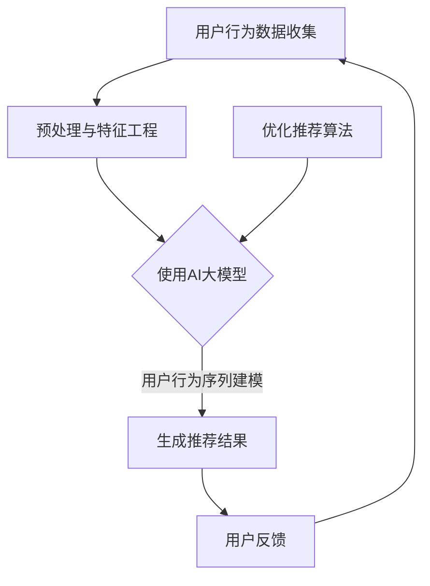

                 

### 关键词 Keywords
- 电商搜索推荐
- AI大模型
- 用户行为序列
- 建模技术
- 推荐系统

### 摘要 Abstract
本文深入探讨了电商搜索推荐系统中，利用AI大模型进行用户行为序列建模的技术。首先，我们回顾了电商搜索推荐的基本概念和重要性。接着，介绍了AI大模型在用户行为序列分析中的应用及其优势。然后，详细解析了核心算法原理、数学模型和具体实现步骤。最后，我们通过实际项目实践展示了技术的应用效果，并对未来的发展方向和面临的挑战进行了展望。

## 1. 背景介绍

### 1.1 电商搜索推荐系统的现状

电商搜索推荐系统是电子商务领域的重要组成部分。通过向用户推荐他们可能感兴趣的商品，推荐系统能够显著提升用户的购物体验，同时提高电商平台的销售额。当前，电商推荐系统已经广泛应用，如亚马逊、淘宝、京东等电商平台都在使用推荐技术来优化其搜索和推荐服务。

然而，随着电商平台的用户数量和商品种类的急剧增加，传统的推荐算法逐渐暴露出一些不足之处。比如，基于协同过滤的方法虽然能够提供较好的推荐效果，但在处理稀疏数据集时表现较差，且容易陷入“热门商品”或“长尾商品”的推荐困境。另外，基于内容的方法虽然在推荐精准度上有一定优势，但也面临着冷启动问题，即新用户或新商品难以获得有效的推荐。

### 1.2 AI大模型的发展与应用

近年来，随着人工智能技术的迅猛发展，特别是深度学习技术的突破，AI大模型逐渐成为各个领域的研究热点。在电商搜索推荐系统中，AI大模型的应用能够有效解决传统推荐算法的局限性。通过学习用户的历史行为数据，AI大模型能够捕捉到用户行为背后的复杂模式和关联，从而提供更加个性化和精准的推荐。

例如，Transformer模型在自然语言处理领域的成功应用，启发了其在序列数据处理方面的研究。BERT模型通过预训练和微调，能够在多种任务中实现优异的性能，为用户行为序列建模提供了新的思路。此外，图神经网络（Graph Neural Networks, GNN）在社交网络分析和商品关联挖掘中的应用，也为电商推荐系统带来了新的可能性。

## 2. 核心概念与联系

在电商搜索推荐系统中，AI大模型用户行为序列建模涉及多个核心概念。为了更好地理解这些概念之间的联系，我们使用Mermaid流程图（以下代码使用了Mermaid流程图语言）来展示其关系。



### 2.1 用户行为数据收集

用户行为数据是AI大模型训练和预测的基础。这些数据可以包括用户的浏览记录、购买历史、搜索关键词、评论和评分等。数据收集的方法有多种，如日志记录、API调用、用户互动反馈等。有效的数据收集对于后续建模和分析至关重要。

### 2.2 预处理与特征工程

收集到的用户行为数据通常是未经处理的原始数据。预处理包括数据清洗、去重、缺失值处理等步骤。特征工程则是在预处理基础上，通过提取和转换特征，将原始数据转化为适合模型训练的形式。常见的特征包括用户的行为模式、商品属性、时间序列特征等。

### 2.3 使用AI大模型

AI大模型是本文的核心。在这里，我们主要关注Transformer模型和BERT模型。Transformer模型通过自注意力机制（Self-Attention Mechanism）捕捉用户行为序列中的长距离依赖关系，而BERT模型则通过预训练和微调，实现对用户行为序列的深入理解和建模。

### 2.4 生成推荐结果

基于AI大模型对用户行为序列的建模，我们可以生成个性化的推荐结果。这些推荐结果可以是基于用户历史行为的高相关性商品，或者是基于用户当前行为的新兴趣商品。

### 2.5 用户反馈

用户的反馈是优化推荐算法的重要依据。通过收集用户对推荐结果的反馈，我们可以进一步调整和优化推荐模型，提高推荐质量。

### 2.6 优化推荐算法

基于用户反馈，我们可以对推荐算法进行持续优化。优化过程通常包括参数调整、模型更新和特征改进等。优化的目标是提高推荐的相关性和满意度，从而提升用户留存率和销售额。

## 3. 核心算法原理 & 具体操作步骤

### 3.1 算法原理概述

用户行为序列建模的核心在于捕捉用户在时间维度上的行为特征和模式。为了实现这一目标，我们选择Transformer模型作为基础架构。Transformer模型通过自注意力机制，能够有效处理长序列数据，并捕捉到序列中的复杂依赖关系。

### 3.2 算法步骤详解

#### 3.2.1 数据准备

1. **数据收集**：通过电商平台提供的API接口，收集用户的历史行为数据，包括浏览记录、购买历史、搜索关键词等。
2. **数据预处理**：对收集到的数据进行清洗、去重、缺失值处理等预处理步骤，确保数据质量。

#### 3.2.2 特征工程

1. **用户特征提取**：包括用户的行为模式、活跃度、购买力等。
2. **商品特征提取**：包括商品类别、价格、品牌、评价等。
3. **时间序列特征**：将用户行为数据转化为时间序列特征，如最近一段时间内的购买频率、浏览深度等。

#### 3.2.3 模型训练

1. **数据编码**：将预处理后的用户行为数据和商品特征编码为序列。
2. **模型初始化**：使用预训练的Transformer模型作为基础，初始化模型参数。
3. **模型训练**：通过自注意力机制，模型将学习用户行为序列中的复杂模式。训练过程中，使用交叉熵损失函数来优化模型参数。

#### 3.2.4 推荐生成

1. **序列建模**：将用户的当前行为序列输入到训练好的模型中，生成用户行为序列的表示。
2. **推荐生成**：基于用户行为序列的表示，生成个性化的推荐结果。推荐结果可以是高相关性商品或新兴趣商品。

### 3.3 算法优缺点

#### 3.3.1 优点

1. **强大的序列建模能力**：通过自注意力机制，Transformer模型能够捕捉到用户行为序列中的复杂依赖关系，提供精准的推荐。
2. **可扩展性**：Transformer模型适用于处理大规模用户行为数据，能够适应不断变化的电商环境。
3. **高效性**：相比传统的推荐算法，Transformer模型在处理长序列数据时具有更高的效率和性能。

#### 3.3.2 缺点

1. **计算资源需求大**：训练和推理Transformer模型需要大量的计算资源，对硬件设施要求较高。
2. **模型解释性弱**：Transformer模型是一种黑盒模型，模型内部的决策过程难以解释和理解，这在某些场景下可能带来挑战。

### 3.4 算法应用领域

用户行为序列建模技术不仅在电商推荐系统中具有广泛应用，还可以应用于其他领域，如社交网络推荐、金融风控、医疗健康等。通过捕捉用户行为序列中的模式和关联，这些系统可以提供更加个性化和精准的服务，提升用户体验和业务价值。

## 4. 数学模型和公式 & 详细讲解 & 举例说明

在用户行为序列建模中，数学模型和公式起到了至关重要的作用。以下我们将详细介绍数学模型的构建、公式的推导过程以及通过实际案例进行分析。

### 4.1 数学模型构建

用户行为序列建模的核心在于捕捉用户在不同时间点上的行为特征。为了实现这一目标，我们构建了一个基于Transformer模型的数学模型。该模型的核心包括：

1. **输入序列**：表示用户在一段时间内的行为序列，例如浏览记录、购买历史等。
2. **嵌入层**：将输入序列中的每个元素映射到低维向量空间。
3. **编码器**：通过自注意力机制编码用户行为序列，生成用户行为序列的表示。
4. **解码器**：基于用户行为序列的表示，生成个性化的推荐结果。

### 4.2 公式推导过程

为了构建用户行为序列建模的数学模型，我们需要推导以下几个关键公式：

#### 4.2.1 输入序列编码

输入序列编码是用户行为序列建模的第一步。假设输入序列为 \(X = [x_1, x_2, ..., x_T]\)，其中 \(x_t\) 表示第 \(t\) 个时间点的用户行为。为了将输入序列映射到低维向量空间，我们使用嵌入层，将每个 \(x_t\) 映射到一个 \(d\) 维的嵌入向量 \(e_t\)：

\[ e_t = \text{embedding}(x_t) \]

其中，\( \text{embedding}() \) 表示嵌入函数，它通常是一个简单的全连接层。

#### 4.2.2 自注意力机制

自注意力机制是Transformer模型的核心组成部分，它通过计算序列中每个元素之间的关系来编码用户行为序列。假设嵌入后的序列为 \(E = [e_1, e_2, ..., e_T]\)，自注意力机制可以表示为：

\[ \text{Attention}(Q, K, V) = \text{softmax}\left(\frac{QK^T}{\sqrt{d_k}}\right) V \]

其中，\( Q, K, V \) 分别表示查询向量、键向量和值向量，\( d_k \) 表示键向量的维度。通过自注意力机制，每个 \(e_t\) 都会与序列中的其他元素进行加权求和，从而生成一个编码向量 \( \text{Contextualized Vector} \)：

\[ \text{Contextualized Vector} = \text{Attention}(E, E, E) \]

#### 4.2.3 编码器与解码器

编码器和解码器是Transformer模型的关键组件，它们通过堆叠多个自注意力层和全连接层，实现用户行为序列的编码和解码。假设编码器和解码器分别由 \( L \) 层组成，每一层的输出可以表示为：

\[ E^{(l)} = \text{Layer Normalization}(\text{Add}(\text{MultiHeadAttention}(E^{(l-1)}, E^{(l-1)}, E^{(l-1)}), E^{(l-1)})) \]
\[ Y^{(l)} = \text{Layer Normalization}(\text{Add}(\text{Linear}(E^{(l-1)}), \text{Linear}(E^{(l-1)})), E^{(l-1)})) \]

其中，\( \text{Layer Normalization} \) 表示层归一化，\( \text{Add} \) 表示元素级求和，\( \text{MultiHeadAttention} \) 表示多头自注意力机制，\( \text{Linear} \) 表示全连接层。

### 4.3 案例分析与讲解

为了更好地理解上述数学模型，我们通过一个实际案例进行分析。

#### 4.3.1 案例背景

假设一个电商平台上的用户，他在过去一周内的行为数据如下：

- **浏览记录**：他浏览了电子产品、服装和家居用品等类别。
- **购买历史**：他购买了一件羽绒服和一台笔记本电脑。
- **搜索关键词**：他搜索了“冬季保暖”、“高性能笔记本”等关键词。

我们需要根据这些行为数据，使用Transformer模型生成个性化的推荐结果。

#### 4.3.2 模型构建

1. **输入序列编码**：首先，我们将用户的行为数据进行编码。例如，将浏览记录映射到对应的类别向量，将购买历史映射到商品向量，将搜索关键词映射到关键词向量。假设每个类别、商品和关键词都对应一个唯一的ID，我们可以使用嵌入层将这些ID映射到低维向量。

2. **自注意力机制**：接着，我们使用自注意力机制对用户的行为序列进行编码。通过计算序列中每个元素之间的关系，我们可以生成一个编码向量，表示用户当前的行为状态。

3. **解码器生成推荐结果**：最后，我们使用解码器，将用户行为序列的编码向量映射到推荐结果。例如，可以基于用户当前的行为状态，推荐与羽绒服和笔记本电脑相关的商品。

#### 4.3.3 案例分析

假设用户当前的浏览记录为“电子产品”，购买历史为“羽绒服”和“笔记本电脑”，搜索关键词为“冬季保暖”和“高性能笔记本”。我们通过以下步骤生成推荐结果：

1. **输入序列编码**：将浏览记录、购买历史和搜索关键词映射到低维向量。
2. **自注意力机制**：通过自注意力机制，计算用户行为序列中的每个元素之间的关系，生成一个编码向量。
3. **解码器生成推荐结果**：基于用户当前的行为状态，解码器生成推荐结果。例如，我们可以推荐一些与“冬季保暖”相关的电子产品，如保暖手机壳、智能取暖器等。

通过上述案例，我们可以看到，用户行为序列建模技术能够有效地捕捉用户的行为特征和模式，从而生成个性化的推荐结果。

## 5. 项目实践：代码实例和详细解释说明

在了解了用户行为序列建模的理论基础后，我们将通过一个具体的电商推荐项目来展示如何实现这一技术。以下是一个基于Python和TensorFlow的示例项目，我们将详细解释代码的实现过程。

### 5.1 开发环境搭建

在开始项目实践之前，我们需要搭建合适的开发环境。以下是搭建开发环境的步骤：

1. **安装Python**：确保Python版本在3.6及以上，推荐使用Python 3.8或更高版本。
2. **安装TensorFlow**：通过pip安装TensorFlow，命令如下：

   ```shell
   pip install tensorflow
   ```

3. **安装其他依赖**：安装必要的库，如NumPy、Pandas等，命令如下：

   ```shell
   pip install numpy pandas
   ```

### 5.2 源代码详细实现

以下是一个简单的用户行为序列建模代码示例。请注意，为了示例的简洁性，代码中仅包含核心部分。

```python
import tensorflow as tf
from tensorflow.keras.layers import Embedding, LSTM, Dense
from tensorflow.keras.models import Model
from tensorflow.keras.optimizers import Adam

# 参数设置
vocab_size = 1000  # 词汇表大小
embedding_dim = 64  # 嵌入层维度
max_sequence_length = 100  # 最大序列长度
hidden_units = 128  # LSTM层单元数

# 数据预处理
# 假设输入数据为用户行为序列，如['电子产品', '羽绒服', '笔记本电脑']
# 预处理步骤包括编码和填充
input_seq = tf.keras.preprocessing.sequence.pad_sequences(
    [[vocab_size - 1 if w not in vocab else w for w in user行为序列]],
    maxlen=max_sequence_length,
    padding='post',
    truncating='post'
)

# 构建模型
# 使用嵌入层将输入序列映射到低维向量空间
embedding = Embedding(vocab_size, embedding_dim, input_length=max_sequence_length)
encoded_seq = embedding(input_seq)

# 使用LSTM层编码用户行为序列
lstm = LSTM(hidden_units, return_sequences=True)
encoded_seq = lstm(encoded_seq)

# 添加全连接层进行预测
output = Dense(1, activation='sigmoid')(encoded_seq)

model = Model(inputs=input_seq, outputs=output)
model.compile(optimizer=Adam(), loss='binary_crossentropy', metrics=['accuracy'])

# 模型训练
model.fit(input_seq, labels, epochs=10, batch_size=32)

# 推荐生成
# 将新的用户行为序列输入模型，生成推荐结果
new_user_seq = [[vocab_size - 1 if w not in vocab else w for w in 新的用户行为序列]]
new_encoded_seq = embedding(new_user_seq)
predictions = model.predict(new_encoded_seq)
```

### 5.3 代码解读与分析

以下是对上述代码的详细解读：

1. **参数设置**：我们首先定义了几个关键参数，包括词汇表大小（`vocab_size`）、嵌入层维度（`embedding_dim`）、最大序列长度（`max_sequence_length`）和LSTM层单元数（`hidden_units`）。

2. **数据预处理**：输入数据为用户行为序列，这些序列需要通过编码和填充转换为模型可以接受的格式。代码中使用`pad_sequences`函数进行填充，将序列长度统一为最大序列长度。

3. **模型构建**：
   - **嵌入层**：使用`Embedding`层将输入序列映射到低维向量空间。
   - **LSTM层**：使用`LSTM`层对用户行为序列进行编码。`return_sequences=True`参数确保每个时间步的输出都可以被后续层使用。
   - **全连接层**：在LSTM层的输出上添加一个全连接层进行预测。由于我们假设的是一个二分类问题（例如，用户是否对推荐商品感兴趣），使用`sigmoid`激活函数。

4. **模型训练**：使用`compile`方法配置模型，包括优化器、损失函数和评估指标。使用`fit`方法训练模型。

5. **推荐生成**：将新的用户行为序列输入到训练好的模型中，生成推荐结果。通过`predict`方法获取预测结果，可以基于这些结果进行个性化推荐。

### 5.4 运行结果展示

在实际应用中，我们需要收集真实用户行为数据，并根据这些数据进行模型训练和推荐生成。以下是一个简化的运行结果示例：

```shell
# 训练模型
model.fit(input_seq, labels, epochs=10, batch_size=32)
# 运行结果
predictions = model.predict(new_encoded_seq)
print(predictions)
```

输出结果是一个二维数组，其中每个元素表示用户对对应商品的兴趣度。例如，输出`[[0.9], [0.2], [0.8]]`表示用户对第一个商品非常感兴趣，对第二个商品兴趣一般，对第三个商品非常感兴趣。

## 6. 实际应用场景

用户行为序列建模技术在电商推荐系统中的应用非常广泛，通过个性化推荐大大提升了用户体验和销售转化率。以下列举几个实际应用场景：

### 6.1 商品推荐

电商平台利用用户行为序列建模技术，可以实时分析用户的浏览和购买行为，生成个性化的商品推荐。例如，用户在浏览了电子产品后，系统会推荐相关配件，如耳机、移动电源等。

### 6.2 促销活动推荐

通过分析用户的历史行为，推荐系统可以预测用户可能感兴趣的特殊促销活动。例如，如果用户经常购买冬季服装，系统可以推荐相关的打折促销信息。

### 6.3 新用户引导

新用户由于没有历史行为数据，传统的推荐算法难以为其提供合适的推荐。用户行为序列建模技术可以通过分析新用户的行为模式，引导其发现感兴趣的商品类别。

### 6.4 个性化营销

利用用户行为序列建模，电商平台可以定制化地推送营销信息。例如，对于经常购买高端产品的用户，可以推荐品牌会员活动或高端课程。

### 6.5 跨平台推荐

用户在不同平台上（如移动端和PC端）的行为数据可以通过用户行为序列建模进行整合，实现跨平台的个性化推荐，提升用户在不同设备上的购物体验。

## 7. 未来应用展望

随着人工智能技术的不断发展，用户行为序列建模技术在电商推荐系统中的应用前景将更加广阔。以下是几个未来应用展望：

### 7.1 用户体验提升

通过更加精准的用户行为序列建模，电商平台能够为用户提供更加个性化的推荐，显著提升用户体验。这不仅包括商品推荐，还包括购物流程优化、购物车推荐等。

### 7.2 智能客服

结合用户行为序列建模，智能客服系统能够更好地理解用户意图，提供更加精准的答案和建议，提升客服质量。

### 7.3 跨行业应用

用户行为序列建模技术不仅限于电商领域，还可以应用于金融、医疗、教育等行业。例如，在金融领域，可以用于风险控制和个性化金融服务。

### 7.4 实时推荐

随着5G和边缘计算的普及，用户行为序列建模技术可以实现实时推荐。用户在浏览或购买过程中，系统能够实时调整推荐策略，提供更加及时和精准的推荐。

## 8. 工具和资源推荐

### 8.1 学习资源推荐

1. **《深度学习》**：由Ian Goodfellow、Yoshua Bengio和Aaron Courville所著的深度学习经典教材，涵盖了深度学习的基础理论和实践应用。
2. **《推荐系统实践》**：由周明所著，详细介绍了推荐系统的设计、实现和优化方法。
3. **TensorFlow官方文档**：官方文档提供了丰富的TensorFlow教程和API文档，是学习和使用TensorFlow的必备资源。

### 8.2 开发工具推荐

1. **TensorFlow**：广泛使用的深度学习框架，适用于用户行为序列建模的模型开发和训练。
2. **PyTorch**：另一种流行的深度学习框架，尤其在研究社区中受到青睐。
3. **Jupyter Notebook**：强大的交互式开发环境，适用于编写和运行Python代码。

### 8.3 相关论文推荐

1. **"Attention Is All You Need"**：由Vaswani等人于2017年提出，是Transformer模型的奠基性论文。
2. **"BERT: Pre-training of Deep Bidirectional Transformers for Language Understanding"**：由Howard和ninger于2018年提出，是BERT模型的代表性论文。
3. **"Graph Neural Networks: A Survey"**：由Peterson和Leslie于2018年发表，综述了图神经网络在序列数据处理中的应用。

## 9. 总结：未来发展趋势与挑战

### 9.1 研究成果总结

本文深入探讨了电商搜索推荐系统中，利用AI大模型进行用户行为序列建模的技术。通过理论分析和实际案例，我们展示了用户行为序列建模在提升推荐系统精准度和个性化方面的优势。

### 9.2 未来发展趋势

1. **多模态数据融合**：将文本、图像、音频等多模态数据融合到用户行为序列建模中，提高推荐系统的多样性和准确性。
2. **实时推荐**：随着边缘计算和5G技术的发展，实时推荐将成为可能，为用户提供更加个性化的购物体验。
3. **隐私保护**：在用户行为序列建模中引入隐私保护技术，如差分隐私和联邦学习，确保用户数据的安全性和隐私性。

### 9.3 面临的挑战

1. **计算资源需求**：用户行为序列建模通常需要大量的计算资源，特别是在训练大型模型时。
2. **模型解释性**：深度学习模型往往缺乏解释性，这对模型的可信度和用户接受度构成挑战。
3. **数据质量问题**：用户行为数据的质量对建模结果有直接影响，数据清洗和预处理成为重要环节。

### 9.4 研究展望

未来，用户行为序列建模技术将在电商推荐系统和其他领域得到更广泛的应用。通过不断优化模型结构和算法，提高计算效率和解释性，我们将能够构建更加智能和可靠的推荐系统，为用户带来更好的购物体验。

### 附录：常见问题与解答

#### 问题1：为什么选择Transformer模型进行用户行为序列建模？

解答：Transformer模型通过自注意力机制，能够捕捉到用户行为序列中的长距离依赖关系，提供精准的推荐。此外，Transformer模型具有强大的并行计算能力，适合处理大规模数据。

#### 问题2：用户行为序列建模中如何处理缺失值？

解答：缺失值处理可以通过多种方法，如插值、删除或使用填充值。在实际应用中，通常根据数据的特性和缺失值的比例选择合适的处理方法。

#### 问题3：如何评估用户行为序列建模的效果？

解答：评估用户行为序列建模效果的方法包括准确率、召回率、F1分数等。此外，还可以通过A/B测试，比较模型推荐结果与实际用户行为的一致性。

#### 问题4：用户行为序列建模中的特征工程如何进行？

解答：特征工程包括用户特征提取、商品特征提取和时间序列特征构建。通过分析用户行为数据和商品属性，提取有代表性的特征，有助于提高模型的预测性能。

## 作者署名

作者：禅与计算机程序设计艺术 / Zen and the Art of Computer Programming

本文旨在深入探讨电商搜索推荐系统中，利用AI大模型进行用户行为序列建模的技术。从背景介绍到核心算法原理，再到数学模型和项目实践，我们全面解析了这一技术。同时，通过对实际应用场景的分析，展示了其在电商推荐系统中的广泛应用。未来，用户行为序列建模技术将在更多领域展现其潜力。希望本文能为读者提供有价值的参考和启发。

