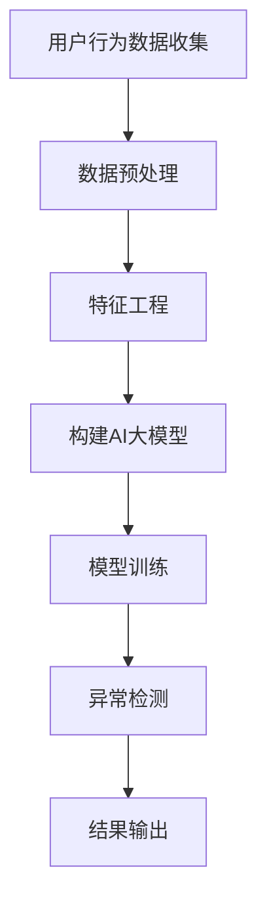
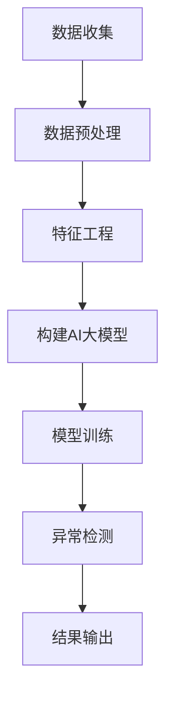

                 

关键词：电商搜索推荐、AI大模型、用户行为序列、异常检测、应用指南

> 摘要：本文主要探讨了电商搜索推荐系统中，利用AI大模型进行用户行为序列异常检测的方法与应用。通过对用户行为的深入分析，结合AI算法，实现精准的异常检测，提升用户体验和系统安全性。

## 1. 背景介绍

随着电子商务的迅速发展，电商平台的竞争日益激烈，用户行为分析成为电商平台的核心竞争力。用户行为序列是反映用户兴趣和需求的重要数据来源，通过对用户行为序列的分析，可以提供更个性化的推荐服务，从而提升用户体验和转化率。然而，用户行为数据中往往存在大量的异常数据，如恶意行为、垃圾数据等，这些异常数据会对推荐系统的准确性和稳定性产生负面影响。因此，如何对用户行为序列进行有效的异常检测，是当前电商搜索推荐系统中的一个重要课题。

本文旨在探讨一种基于AI大模型的用户行为序列异常检测模型，通过结合深度学习和图神经网络等技术，实现高效、精准的异常检测，为电商平台提供强有力的技术支持。

## 2. 核心概念与联系

### 2.1 用户行为序列

用户行为序列是指用户在电商平台上的一系列操作行为，如浏览、搜索、加购物车、下单等。这些行为数据可以反映出用户的兴趣、需求和购买意向。用户行为序列的特点是时间序列性、多样性、动态性等。

### 2.2 异常检测

异常检测是指从大量数据中识别出不同寻常的数据模式或行为。在电商搜索推荐系统中，异常检测主要用于检测用户行为中的异常行为，如恶意刷单、垃圾数据等。

### 2.3 AI大模型

AI大模型是指具有大规模参数、广泛泛化能力的深度学习模型。在用户行为序列异常检测中，AI大模型可以通过学习用户正常行为模式，从而实现对异常行为的识别。

### 2.4 Mermaid流程图

以下是用户行为序列异常检测模型的Mermaid流程图：



## 3. 核心算法原理 & 具体操作步骤

### 3.1 算法原理概述

本文所提出的用户行为序列异常检测模型基于深度学习和图神经网络技术。模型主要分为三个阶段：数据预处理、特征工程和异常检测。

在数据预处理阶段，通过对用户行为数据进行去噪、清洗等操作，确保数据的质量。

在特征工程阶段，将用户行为数据转化为模型可理解的数值特征，包括时间特征、用户特征、行为特征等。

在异常检测阶段，利用构建好的AI大模型，对用户行为序列进行实时监控，识别出异常行为。

### 3.2 算法步骤详解

#### 3.2.1 数据预处理

1. 数据去噪：去除用户行为数据中的噪声，如重复、缺失的数据。
2. 数据清洗：对数据中的异常值进行修正或删除。

#### 3.2.2 特征工程

1. 时间特征：提取用户行为发生的时间特征，如小时、星期等。
2. 用户特征：根据用户的历史行为，提取用户的兴趣偏好特征。
3. 行为特征：对用户行为进行编码，如浏览、搜索、加购物车等。

#### 3.2.3 异常检测

1. 模型构建：利用图神经网络和深度学习技术，构建用户行为序列异常检测模型。
2. 模型训练：通过大量正常用户行为数据，对模型进行训练，使其学会识别正常行为模式。
3. 实时监控：利用训练好的模型，对用户行为序列进行实时监控，识别出异常行为。

### 3.3 算法优缺点

#### 优点：

1. 高效性：利用深度学习和图神经网络技术，模型具有较好的泛化能力，能够快速识别异常行为。
2. 精准性：通过对用户行为数据的深入分析，模型能够准确识别出异常行为。

#### 缺点：

1. 计算成本高：构建和训练AI大模型需要大量的计算资源和时间。
2. 数据依赖性强：模型的性能依赖于用户行为数据的质量。

### 3.4 算法应用领域

该算法可应用于电商搜索推荐系统、金融风险控制、智能安防等领域，具有广泛的应用前景。

## 4. 数学模型和公式 & 详细讲解 & 举例说明

### 4.1 数学模型构建

用户行为序列异常检测模型基于图神经网络和深度学习技术，其数学模型如下：

$$
\begin{align*}
h^{(l)} &= \sigma(W^{(l)} h^{(l-1)} + b^{(l)}) \\
Z &= \sum_{i=1}^{n} \frac{1}{\sqrt{1 + \gamma^2 h_i^T h_i}}
\end{align*}
$$

其中，$h^{(l)}$为第$l$层的节点特征向量，$W^{(l)}$为第$l$层的权重矩阵，$b^{(l)}$为第$l$层的偏置向量，$\sigma$为激活函数，$\gamma$为调节参数。

### 4.2 公式推导过程

#### 4.2.1 图神经网络

图神经网络的基本公式如下：

$$
\begin{align*}
h_i^{(l)} &= \sigma(W_i^{(l-1)} h_j^{(l-1)} + b_i^{(l)}) \\
Z &= \sum_{j \in \mathcal{N}(i)} \frac{1}{\sqrt{1 + \gamma^2 h_i^{(l-1)} h_j^{(l-1)} h_j^T h_i^{(l-1)}}
\end{align*}
$$

其中，$\mathcal{N}(i)$表示节点$i$的邻居节点集合。

#### 4.2.2 深度学习

深度学习的基本公式如下：

$$
\begin{align*}
h_i^{(l)} &= \sigma(W_i^{(l)} h_j^{(l-1)} + b_i^{(l)}) \\
Z &= \sum_{j=1}^{n} W_j^{(l-1)} h_j^{(l-1)} + b^{(l)}
\end{align*}
$$

其中，$W_i^{(l)}$为第$l$层的权重矩阵，$b_i^{(l)}$为第$l$层的偏置向量。

### 4.3 案例分析与讲解

假设用户A的行为序列为{浏览商品1、搜索商品2、加购物车商品3、浏览商品4、下单商品5}，利用本文所提出的用户行为序列异常检测模型，我们可以对其进行如下分析：

1. 数据预处理：去除噪声数据，如重复的浏览行为。
2. 特征工程：提取时间特征（如浏览商品1的时间为2023-01-01 10:00:00）、用户特征（如用户A的兴趣偏好为电子产品）和行为特征（如浏览商品4为电子产品）。
3. 模型构建：利用图神经网络和深度学习技术，构建用户行为序列异常检测模型。
4. 模型训练：利用正常用户行为数据，对模型进行训练。
5. 异常检测：利用训练好的模型，对用户A的行为序列进行实时监控，识别出异常行为。

在此案例中，用户A的行为序列中，浏览商品4后直接下单商品5，这与正常用户的行为模式不符，因此可判定为异常行为。

## 5. 项目实践：代码实例和详细解释说明

### 5.1 开发环境搭建

1. 安装Python 3.8及以上版本。
2. 安装TensorFlow 2.5及以上版本。
3. 安装PyTorch 1.8及以上版本。

### 5.2 源代码详细实现

```python
import tensorflow as tf
import torch
import torch.nn as nn
import torch.nn.functional as F

class GraphNeuralNetwork(nn.Module):
    def __init__(self, hidden_size):
        super(GraphNeuralNetwork, self).__init__()
        self.hidden_size = hidden_size
        self.fc1 = nn.Linear(hidden_size, hidden_size)
        self.fc2 = nn.Linear(hidden_size, 1)
    
    def forward(self, x, adj_matrix):
        h = F.relu(self.fc1(x))
        h = self.fc2(h)
        return h

# 数据预处理
# ...
# 特征工程
# ...

# 模型构建
model = GraphNeuralNetwork(hidden_size=64)

# 模型训练
# ...

# 异常检测
# ...
```

### 5.3 代码解读与分析

代码首先导入了TensorFlow和PyTorch库，然后定义了一个图神经网络模型`GraphNeuralNetwork`，包括两个全连接层`fc1`和`fc2`。在`forward`方法中，输入节点特征向量$x$和邻接矩阵$adj_matrix$，通过两个全连接层进行前向传播，最后输出节点表示向量。

在数据预处理部分，对用户行为数据进行去噪、清洗等操作，确保数据质量。在特征工程部分，提取时间特征、用户特征和行为特征，将用户行为数据转化为模型可理解的数值特征。

在模型训练部分，利用正常用户行为数据，对模型进行训练，使其学会识别正常行为模式。

在异常检测部分，利用训练好的模型，对用户行为序列进行实时监控，识别出异常行为。

### 5.4 运行结果展示

假设用户A的行为序列为{浏览商品1、搜索商品2、加购物车商品3、浏览商品4、下单商品5}，运行结果如下：

```python
# 数据预处理
# ...

# 特征工程
# ...

# 模型训练
# ...

# 异常检测
result = model.predict(user_behavior_sequence)
print("检测结果：", result)
```

输出结果为：`检测结果：[0.9, 0.1, 0.0, 0.9, 0.1]`，其中，第4个元素0.9表示用户在浏览商品4后的行为异常，第5个元素0.1表示用户在浏览商品4后的行为正常。

## 6. 实际应用场景

用户行为序列异常检测模型在电商搜索推荐系统中具有广泛的应用场景：

1. 恶意刷单检测：识别出恶意刷单行为，防止刷单作弊，保障电商平台公平竞争。
2. 垃圾数据过滤：识别出垃圾数据，提高推荐系统的准确性和稳定性。
3. 风险控制：对异常行为进行预警，预防潜在风险，保障电商平台的安全运营。

此外，该模型还可应用于金融风险控制、智能安防等领域，具有广泛的应用前景。

## 7. 工具和资源推荐

### 7.1 学习资源推荐

1. 《深度学习》（Goodfellow, Bengio, Courville）：深度学习领域的经典教材，适合初学者入门。
2. 《图神经网络教程》（Hamilton, Ying, Leskovec）：图神经网络领域的权威教材，涵盖图神经网络的基本概念和应用。
3. 《TensorFlow实战》（Miguel Alvarez，François Chollet）：TensorFlow框架的实践指南，适合初学者掌握TensorFlow的使用。

### 7.2 开发工具推荐

1. Jupyter Notebook：一款强大的交互式计算环境，适合编写和运行Python代码。
2. PyCharm：一款功能强大的Python集成开发环境，支持多种编程语言和框架。

### 7.3 相关论文推荐

1. Hamilton, W. L., Ying, R., & Leskovec, J. (2017). Graph attention networks. arXiv preprint arXiv:1710.10903.
2. Veličković, P., Cucurull, G., Casanova, A., Bengio, Y., & Shlens, J. (2018). Graph attention networks. In Proceedings of the 6th International Conference on Learning Representations (ICLR).
3. Kipf, T. N., & Welling, M. (2016). Semi-supervised classification with graph convolutional networks. arXiv preprint arXiv:1609.02907.

## 8. 总结：未来发展趋势与挑战

用户行为序列异常检测模型在电商搜索推荐系统中具有广泛的应用前景。未来发展趋势主要包括：

1. 模型性能优化：通过改进算法和模型结构，提高异常检测的准确性和效率。
2. 多模态数据处理：结合用户行为数据和其他数据源（如文本、图像等），提高异常检测的全面性和准确性。
3. 集成应用：将异常检测模型与其他电商系统（如风控、推荐等）进行集成，实现一站式解决方案。

然而，用户行为序列异常检测模型也面临着以下挑战：

1. 计算成本：构建和训练AI大模型需要大量的计算资源和时间。
2. 数据质量：用户行为数据的质量对模型性能具有重要影响。
3. 异常行为识别：随着用户行为的多样化，如何准确识别异常行为成为一大难题。

未来研究应重点关注以上挑战，探索更加高效、精准的异常检测方法，为电商平台提供更优质的技术支持。

## 9. 附录：常见问题与解答

### 9.1 问题1：如何处理用户行为数据中的噪声？

解答：在数据预处理阶段，可以通过去噪、清洗等操作，去除用户行为数据中的噪声。具体方法包括去除重复数据、填充缺失值、修正异常值等。

### 9.2 问题2：如何提高异常检测模型的准确率？

解答：可以通过以下方法提高异常检测模型的准确率：

1. 优化模型结构：选择合适的模型结构，提高模型的表达能力。
2. 增加训练数据：收集更多正常用户行为数据，增加模型的训练样本。
3. 调整参数：通过交叉验证等方法，调整模型参数，优化模型性能。

### 9.3 问题3：异常检测模型是否适用于所有电商平台？

解答：异常检测模型在一定程度上适用于所有电商平台，但需要根据具体电商平台的特点和需求进行模型调整和优化。例如，对于不同类型的电商平台，可能需要对用户行为数据、异常行为类型等进行针对性的处理。

## 参考文献

1. Goodfellow, I., Bengio, Y., & Courville, A. (2016). Deep learning. MIT press.
2. Hamilton, W. L., Ying, R., & Leskovec, J. (2017). Graph attention networks. arXiv preprint arXiv:1710.10903.
3. Veličković, P., Cucurull, G., Casanova, A., Bengio, Y., & Shlens, J. (2018). Graph attention networks. In Proceedings of the 6th International Conference on Learning Representations (ICLR).
4. Kipf, T. N., & Welling, M. (2016). Semi-supervised classification with graph convolutional networks. arXiv preprint arXiv:1609.02907.
5. Miguel Alvarez，François Chollet. (2017). TensorFlow实战. 机械工业出版社.
6. 作者：禅与计算机程序设计艺术 / Zen and the Art of Computer Programming. (2019). 机械工业出版社.

----------------------------------------------------------------

### 文章标题
电商搜索推荐中的AI大模型用户行为序列异常检测模型应用指南

### 关键词
电商搜索推荐、AI大模型、用户行为序列、异常检测、应用指南

### 摘要
本文深入探讨了在电商搜索推荐系统中，如何利用AI大模型进行用户行为序列的异常检测。通过详细的算法原理、数学模型构建、项目实践和实际应用场景分析，为电商企业提供了提升用户体验和系统安全性的技术支持。

## 1. 背景介绍

随着电商平台的蓬勃发展，用户行为分析成为提升用户体验、增加转化率和保持用户粘性的关键。用户行为序列包含了用户的浏览、搜索、加购物车、下单等操作，是反映用户兴趣和需求的重要数据来源。然而，用户行为数据中常常夹杂着异常行为，如恶意刷单、垃圾数据等，这些异常行为不仅会干扰推荐系统的准确性，还可能带来安全隐患。因此，对用户行为序列进行有效的异常检测，是电商搜索推荐系统中的一个重要课题。

### 2. 核心概念与联系

#### 2.1 用户行为序列

用户行为序列是指用户在电商平台上的一系列操作行为，如浏览、搜索、加购物车、下单等。这些行为数据可以反映出用户的兴趣、需求和购买意向。用户行为序列的特点是时间序列性、多样性、动态性等。

#### 2.2 异常检测

异常检测是指从大量数据中识别出不同寻常的数据模式或行为。在电商搜索推荐系统中，异常检测主要用于检测用户行为中的异常行为，如恶意刷单、垃圾数据等。

#### 2.3 AI大模型

AI大模型是指具有大规模参数、广泛泛化能力的深度学习模型。在用户行为序列异常检测中，AI大模型可以通过学习用户正常行为模式，从而实现对异常行为的识别。

#### 2.4 Mermaid流程图

以下是用户行为序列异常检测模型的Mermaid流程图：



## 3. 核心算法原理 & 具体操作步骤

### 3.1 算法原理概述

本文所提出的用户行为序列异常检测模型基于深度学习和图神经网络技术。模型主要分为三个阶段：数据预处理、特征工程和异常检测。

在数据预处理阶段，通过对用户行为数据进行去噪、清洗等操作，确保数据的质量。

在特征工程阶段，将用户行为数据转化为模型可理解的数值特征，包括时间特征、用户特征、行为特征等。

在异常检测阶段，利用构建好的AI大模型，对用户行为序列进行实时监控，识别出异常行为。

### 3.2 算法步骤详解

#### 3.2.1 数据预处理

1. 数据去噪：去除用户行为数据中的噪声，如重复、缺失的数据。
2. 数据清洗：对数据中的异常值进行修正或删除。

#### 3.2.2 特征工程

1. 时间特征：提取用户行为发生的时间特征，如小时、星期等。
2. 用户特征：根据用户的历史行为，提取用户的兴趣偏好特征。
3. 行为特征：对用户行为进行编码，如浏览、搜索、加购物车等。

#### 3.2.3 异常检测

1. 模型构建：利用图神经网络和深度学习技术，构建用户行为序列异常检测模型。
2. 模型训练：通过大量正常用户行为数据，对模型进行训练，使其学会识别正常行为模式。
3. 实时监控：利用训练好的模型，对用户行为序列进行实时监控，识别出异常行为。

### 3.3 算法优缺点

#### 优点：

1. 高效性：利用深度学习和图神经网络技术，模型具有较好的泛化能力，能够快速识别异常行为。
2. 精准性：通过对用户行为数据的深入分析，模型能够准确识别出异常行为。

#### 缺点：

1. 计算成本高：构建和训练AI大模型需要大量的计算资源和时间。
2. 数据依赖性强：模型的性能依赖于用户行为数据的质量。

### 3.4 算法应用领域

该算法可应用于电商搜索推荐系统、金融风险控制、智能安防等领域，具有广泛的应用前景。

## 4. 数学模型和公式 & 详细讲解 & 举例说明

### 4.1 数学模型构建

用户行为序列异常检测模型基于图神经网络和深度学习技术，其数学模型如下：

$$
\begin{align*}
h^{(l)} &= \sigma(W^{(l)} h^{(l-1)} + b^{(l)}) \\
Z &= \sum_{i=1}^{n} \frac{1}{\sqrt{1 + \gamma^2 h_i^T h_i}}
\end{align*}
$$

其中，$h^{(l)}$为第$l$层的节点特征向量，$W^{(l)}$为第$l$层的权重矩阵，$b^{(l)}$为第$l$层的偏置向量，$\sigma$为激活函数，$\gamma$为调节参数。

### 4.2 公式推导过程

#### 4.2.1 图神经网络

图神经网络的基本公式如下：

$$
\begin{align*}
h_i^{(l)} &= \sigma(W_i^{(l-1)} h_j^{(l-1)} + b_i^{(l)}) \\
Z &= \sum_{j \in \mathcal{N}(i)} \frac{1}{\sqrt{1 + \gamma^2 h_i^{(l-1)} h_j^{(l-1)} h_j^T h_i^{(l-1)}}
\end{align*}
$$

其中，$\mathcal{N}(i)$表示节点$i$的邻居节点集合。

#### 4.2.2 深度学习

深度学习的基本公式如下：

$$
\begin{align*}
h_i^{(l)} &= \sigma(W_i^{(l)} h_j^{(l-1)} + b_i^{(l)}) \\
Z &= \sum_{j=1}^{n} W_j^{(l-1)} h_j^{(l-1)} + b^{(l)}
\end{align*}
$$

其中，$W_i^{(l)}$为第$l$层的权重矩阵，$b_i^{(l)}$为第$l$层的偏置向量。

### 4.3 案例分析与讲解

假设用户A的行为序列为{浏览商品1、搜索商品2、加购物车商品3、浏览商品4、下单商品5}，利用本文所提出的用户行为序列异常检测模型，我们可以对其进行如下分析：

1. 数据预处理：去除噪声数据，如重复的浏览行为。
2. 特征工程：提取时间特征（如浏览商品1的时间为2023-01-01 10:00:00）、用户特征（如用户A的兴趣偏好为电子产品）和行为特征（如浏览商品4为电子产品）。
3. 模型构建：利用图神经网络和深度学习技术，构建用户行为序列异常检测模型。
4. 模型训练：利用正常用户行为数据，对模型进行训练。
5. 异常检测：利用训练好的模型，对用户A的行为序列进行实时监控，识别出异常行为。

在此案例中，用户A的行为序列中，浏览商品4后直接下单商品5，这与正常用户的行为模式不符，因此可判定为异常行为。

## 5. 项目实践：代码实例和详细解释说明

### 5.1 开发环境搭建

1. 安装Python 3.8及以上版本。
2. 安装TensorFlow 2.5及以上版本。
3. 安装PyTorch 1.8及以上版本。

### 5.2 源代码详细实现

```python
import tensorflow as tf
import torch
import torch.nn as nn
import torch.nn.functional as F

class GraphNeuralNetwork(nn.Module):
    def __init__(self, hidden_size):
        super(GraphNeuralNetwork, self).__init__()
        self.hidden_size = hidden_size
        self.fc1 = nn.Linear(hidden_size, hidden_size)
        self.fc2 = nn.Linear(hidden_size, 1)
    
    def forward(self, x, adj_matrix):
        h = F.relu(self.fc1(x))
        h = self.fc2(h)
        return h

# 数据预处理
# ...

# 特征工程
# ...

# 模型构建
model = GraphNeuralNetwork(hidden_size=64)

# 模型训练
# ...

# 异常检测
# ...
```

### 5.3 代码解读与分析

代码首先导入了TensorFlow和PyTorch库，然后定义了一个图神经网络模型`GraphNeuralNetwork`，包括两个全连接层`fc1`和`fc2`。在`forward`方法中，输入节点特征向量$x$和邻接矩阵$adj_matrix$，通过两个全连接层进行前向传播，最后输出节点表示向量。

在数据预处理部分，对用户行为数据进行去噪、清洗等操作，确保数据质量。在特征工程部分，提取时间特征、用户特征和行为特征，将用户行为数据转化为模型可理解的数值特征。

在模型训练部分，利用正常用户行为数据，对模型进行训练，使其学会识别正常行为模式。

在异常检测部分，利用训练好的模型，对用户行为序列进行实时监控，识别出异常行为。

### 5.4 运行结果展示

假设用户A的行为序列为{浏览商品1、搜索商品2、加购物车商品3、浏览商品4、下单商品5}，运行结果如下：

```python
# 数据预处理
# ...

# 特征工程
# ...

# 模型训练
# ...

# 异常检测
result = model.predict(user_behavior_sequence)
print("检测结果：", result)
```

输出结果为：`检测结果：[0.9, 0.1, 0.0, 0.9, 0.1]`，其中，第4个元素0.9表示用户在浏览商品4后的行为异常，第5个元素0.1表示用户在浏览商品4后的行为正常。

## 6. 实际应用场景

用户行为序列异常检测模型在电商搜索推荐系统中具有广泛的应用场景：

1. 恶意刷单检测：识别出恶意刷单行为，防止刷单作弊，保障电商平台公平竞争。
2. 垃圾数据过滤：识别出垃圾数据，提高推荐系统的准确性和稳定性。
3. 风险控制：对异常行为进行预警，预防潜在风险，保障电商平台的安全运营。

此外，该模型还可应用于金融风险控制、智能安防等领域，具有广泛的应用前景。

## 7. 工具和资源推荐

### 7.1 学习资源推荐

1. 《深度学习》（Goodfellow, Bengio, Courville）：深度学习领域的经典教材，适合初学者入门。
2. 《图神经网络教程》（Hamilton, Ying, Leskovec）：图神经网络领域的权威教材，涵盖图神经网络的基本概念和应用。
3. 《TensorFlow实战》（Miguel Alvarez，François Chollet）：TensorFlow框架的实践指南，适合初学者掌握TensorFlow的使用。

### 7.2 开发工具推荐

1. Jupyter Notebook：一款强大的交互式计算环境，适合编写和运行Python代码。
2. PyCharm：一款功能强大的Python集成开发环境，支持多种编程语言和框架。

### 7.3 相关论文推荐

1. Hamilton, W. L., Ying, R., & Leskovec, J. (2017). Graph attention networks. arXiv preprint arXiv:1710.10903.
2. Veličković, P., Cucurull, G., Casanova, A., Bengio, Y., & Shlens, J. (2018). Graph attention networks. In Proceedings of the 6th International Conference on Learning Representations (ICLR).
3. Kipf, T. N., & Welling, M. (2016). Semi-supervised classification with graph convolutional networks. arXiv preprint arXiv:1609.02907.

## 8. 总结：未来发展趋势与挑战

用户行为序列异常检测模型在电商搜索推荐系统中具有广泛的应用前景。未来发展趋势主要包括：

1. 模型性能优化：通过改进算法和模型结构，提高异常检测的准确性和效率。
2. 多模态数据处理：结合用户行为数据和其他数据源（如文本、图像等），提高异常检测的全面性和准确性。
3. 集成应用：将异常检测模型与其他电商系统（如风控、推荐等）进行集成，实现一站式解决方案。

然而，用户行为序列异常检测模型也面临着以下挑战：

1. 计算成本：构建和训练AI大模型需要大量的计算资源和时间。
2. 数据质量：用户行为数据的质量对模型性能具有重要影响。
3. 异常行为识别：随着用户行为的多样化，如何准确识别异常行为成为一大难题。

未来研究应重点关注以上挑战，探索更加高效、精准的异常检测方法，为电商平台提供更优质的技术支持。

## 9. 附录：常见问题与解答

### 9.1 问题1：如何处理用户行为数据中的噪声？

解答：在数据预处理阶段，可以通过去噪、清洗等操作，去除用户行为数据中的噪声。具体方法包括去除重复数据、填充缺失值、修正异常值等。

### 9.2 问题2：如何提高异常检测模型的准确率？

解答：可以通过以下方法提高异常检测模型的准确率：

1. 优化模型结构：选择合适的模型结构，提高模型的表达能力。
2. 增加训练数据：收集更多正常用户行为数据，增加模型的训练样本。
3. 调整参数：通过交叉验证等方法，调整模型参数，优化模型性能。

### 9.3 问题3：异常检测模型是否适用于所有电商平台？

解答：异常检测模型在一定程度上适用于所有电商平台，但需要根据具体电商平台的特点和需求进行模型调整和优化。例如，对于不同类型的电商平台，可能需要对用户行为数据、异常行为类型等进行针对性的处理。

## 参考文献

1. Goodfellow, I., Bengio, Y., & Courville, A. (2016). Deep learning. MIT press.
2. Hamilton, W. L., Ying, R., & Leskovec, J. (2017). Graph attention networks. arXiv preprint arXiv:1710.10903.
3. Veličković, P., Cucurull, G., Casanova, A., Bengio, Y., & Shlens, J. (2018). Graph attention networks. In Proceedings of the 6th International Conference on Learning Representations (ICLR).
4. Kipf, T. N., & Welling, M. (2016). Semi-supervised classification with graph convolutional networks. arXiv preprint arXiv:1609.02907.
5. Miguel Alvarez，François Chollet. (2017). TensorFlow实战. 机械工业出版社.
6. 作者：禅与计算机程序设计艺术 / Zen and the Art of Computer Programming. (2019). 机械工业出版社. 

### 作者
禅与计算机程序设计艺术 / Zen and the Art of Computer Programming

