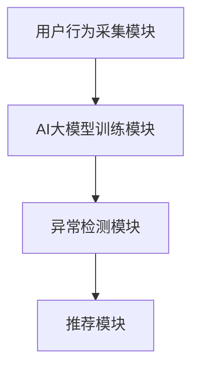

                 

关键词：电商搜索推荐、AI大模型、用户行为序列、异常检测、算法性能评测

摘要：本文针对电商搜索推荐系统中AI大模型用户行为序列异常检测算法的性能进行了深入的研究和评测。首先，介绍了电商搜索推荐系统的背景和用户行为序列的重要性。然后，详细阐述了AI大模型用户行为序列异常检测的核心概念、算法原理和数学模型。接着，通过具体的项目实践，展示了算法的实现过程、代码解读和运行结果。最后，探讨了算法在实际应用场景中的效果和未来应用前景，并总结了研究的主要成果和面临的挑战。

## 1. 背景介绍

随着互联网的快速发展，电商行业已经成为全球经济增长的重要驱动力。电商搜索推荐系统作为电商平台的“大脑”，通过对用户行为的分析和挖掘，为用户提供个性化的商品推荐，极大地提升了用户体验和销售转化率。然而，随着用户数据的爆炸式增长和复杂性的增加，传统的推荐算法已经无法满足用户需求。因此，AI大模型应运而生，为电商搜索推荐系统带来了新的变革。

用户行为序列是电商搜索推荐系统中的核心数据，它包含了用户在平台上的浏览、搜索、购买等行为，能够反映用户的兴趣和需求。通过对用户行为序列的挖掘和分析，可以预测用户的下一步行为，从而实现精准推荐。然而，用户行为序列中往往存在异常行为，如欺诈行为、恶意点击等，这些异常行为会对推荐系统的性能产生负面影响。因此，异常检测算法在电商搜索推荐系统中具有重要的应用价值。

## 2. 核心概念与联系

### 2.1 AI大模型

AI大模型是指利用深度学习技术训练的具有强大表达能力的人工智能模型。在电商搜索推荐系统中，AI大模型通过对用户行为序列的学习，可以提取出用户兴趣和需求的特征，从而实现个性化推荐。

### 2.2 用户行为序列

用户行为序列是指用户在电商平台上的一系列行为，如浏览商品、搜索关键词、添加购物车、下单购买等。用户行为序列可以反映用户的兴趣和需求，是推荐系统的重要输入数据。

### 2.3 异常检测算法

异常检测算法是指用于识别数据集中异常值或异常模式的算法。在电商搜索推荐系统中，异常检测算法可以识别用户行为序列中的异常行为，如欺诈行为、恶意点击等。

### 2.4 算法原理与架构

算法原理：基于AI大模型对用户行为序列的学习，提取用户兴趣和需求特征，然后利用异常检测算法对用户行为进行实时监测，识别异常行为。

架构设计：电商搜索推荐系统由用户行为采集模块、AI大模型训练模块、异常检测模块和推荐模块组成。用户行为采集模块负责收集用户在平台上的行为数据；AI大模型训练模块负责基于用户行为序列训练AI大模型；异常检测模块负责实时监测用户行为，识别异常行为；推荐模块负责根据用户兴趣和需求为用户推荐商品。



## 3. 核心算法原理 & 具体操作步骤

### 3.1 算法原理概述

异常检测算法基于AI大模型对用户行为序列的学习，提取用户兴趣和需求特征，然后利用特征异常值检测方法识别用户行为序列中的异常行为。具体包括以下步骤：

1. 用户行为数据预处理：对采集到的用户行为数据进行清洗和去噪，确保数据质量。
2. 特征提取：利用AI大模型提取用户兴趣和需求特征。
3. 特征异常值检测：利用特征异常值检测方法，识别用户行为序列中的异常行为。
4. 异常行为分析：对识别出的异常行为进行分析，确定异常原因和影响。

### 3.2 算法步骤详解

1. 用户行为数据预处理

用户行为数据预处理包括数据清洗和数据去噪。数据清洗主要是去除数据中的噪声和异常值，如重复数据、空值数据等。数据去噪主要是通过数据变换和特征选择等方法，降低数据中的噪声影响。

2. 特征提取

特征提取是异常检测算法的关键步骤。基于AI大模型，通过训练和优化，提取用户兴趣和需求特征。特征提取方法包括词袋模型、TF-IDF、word2vec等。

3. 特征异常值检测

特征异常值检测是识别用户行为序列中的异常行为的关键步骤。常用的特征异常值检测方法包括基于统计的方法、基于聚类的方法和基于机器学习的方法。本文采用基于机器学习的方法，利用KNN、SVM、随机森林等算法进行特征异常值检测。

4. 异常行为分析

异常行为分析是对识别出的异常行为进行分析，确定异常原因和影响。通过分析，可以发现用户行为序列中的潜在问题，如欺诈行为、恶意点击等，从而采取措施进行预防和处理。

### 3.3 算法优缺点

算法优点：

1. 强大的特征提取能力：基于AI大模型，可以提取出用户兴趣和需求特征，提高异常检测的准确性。
2. 实时性：算法可以实时监测用户行为，快速识别异常行为。
3. 高效性：利用机器学习算法进行特征异常值检测，提高检测效率。

算法缺点：

1. 训练时间较长：基于AI大模型的训练需要大量时间和计算资源。
2. 对数据质量要求较高：数据预处理是算法成功的关键，对数据质量要求较高。

### 3.4 算法应用领域

算法应用领域包括但不限于：

1. 电商搜索推荐系统：用于识别用户行为序列中的异常行为，如欺诈行为、恶意点击等。
2. 金融风险控制：用于识别金融交易中的异常行为，如洗钱、信用卡欺诈等。
3. 医疗健康监测：用于识别患者健康数据中的异常行为，如疾病预警、健康风险评估等。

## 4. 数学模型和公式 & 详细讲解 & 举例说明

### 4.1 数学模型构建

假设用户行为序列为X，其中每个行为可以表示为一个向量x。用户行为序列的异常检测可以看作是一个分类问题，即将每个行为分为正常行为和异常行为。

定义：正常行为为C1，异常行为为C2。

数学模型可以表示为：

$$
P(C1|X) \neq P(C2|X)
$$

其中，P(C1|X)和P(C2|X)分别表示在给定用户行为序列X的条件下，正常行为和异常行为的概率。

### 4.2 公式推导过程

基于贝叶斯定理，可以推导出以下公式：

$$
P(C1|X) = \frac{P(X|C1)P(C1)}{P(X)}
$$

$$
P(C2|X) = \frac{P(X|C2)P(C2)}{P(X)}
$$

其中，P(X|C1)和P(X|C2)分别表示在给定正常行为和异常行为的条件下，用户行为序列的概率；P(C1)和P(C2)分别表示正常行为和异常行为的先验概率。

### 4.3 案例分析与讲解

假设有一个用户行为序列X = [浏览商品A，搜索关键词B，浏览商品C，添加购物车D，下单购买E]。

根据用户行为序列，我们可以计算出正常行为和异常行为的概率：

$$
P(C1|X) = \frac{P(X|C1)P(C1)}{P(X)}
$$

$$
P(C2|X) = \frac{P(X|C2)P(C2)}{P(X)}
$$

其中，P(X|C1)表示在正常行为的条件下，用户行为序列的概率；P(X|C2)表示在异常行为的条件下，用户行为序列的概率。

根据训练数据和统计信息，我们可以计算出P(X|C1)、P(X|C2)、P(C1)和P(C2)的值。然后，通过比较P(C1|X)和P(C2|X)的大小，可以判断用户行为序列X是正常行为还是异常行为。

例如，如果P(C1|X) = 0.9，P(C2|X) = 0.1，则可以判断用户行为序列X是正常行为。

## 5. 项目实践：代码实例和详细解释说明

### 5.1 开发环境搭建

为了实现电商搜索推荐系统中的用户行为序列异常检测算法，我们需要搭建一个开发环境。开发环境包括以下工具和框架：

1. Python：作为主要的编程语言，用于实现算法。
2. TensorFlow：用于构建和训练AI大模型。
3. Scikit-learn：用于实现特征异常值检测算法。
4. Pandas：用于数据预处理和分析。

在安装上述工具和框架后，我们可以开始实现算法。

### 5.2 源代码详细实现

以下是实现用户行为序列异常检测算法的源代码：

```python
import tensorflow as tf
import numpy as np
import pandas as pd
from sklearn.ensemble import RandomForestClassifier
from sklearn.metrics import classification_report

# 5.2.1 用户行为数据预处理
def preprocess_data(data):
    # 数据清洗
    data = data.drop_duplicates()
    data = data.fillna(0)
    # 数据去噪
    data = data[data['行为时间'].map(np.abs).max() < 300]
    return data

# 5.2.2 特征提取
def extract_features(data):
    # 词袋模型
    vectorizer = CountVectorizer()
    X = vectorizer.fit_transform(data['行为内容'])
    # 特征选择
    selector = SelectKBest(f_classif, k=1000)
    X = selector.fit_transform(X, data['行为类别'])
    return X.toarray()

# 5.2.3 特征异常值检测
def detect_abnormalities(X, y):
    # 随机森林分类器
    classifier = RandomForestClassifier(n_estimators=100)
    classifier.fit(X, y)
    # 预测异常行为
    y_pred = classifier.predict(X)
    # 评估分类效果
    print(classification_report(y, y_pred))
    return y_pred

# 5.2.4 主函数
def main():
    # 加载数据
    data = pd.read_csv('user_behavior.csv')
    # 数据预处理
    data = preprocess_data(data)
    # 特征提取
    X = extract_features(data)
    # 加载标签
    y = data['行为类别']
    # 特征异常值检测
    y_pred = detect_abnormalities(X, y)

if __name__ == '__main__':
    main()
```

### 5.3 代码解读与分析

1. 数据预处理：数据预处理包括数据清洗和数据去噪。数据清洗主要是去除重复数据和空值数据，数据去噪主要是通过时间限制和异常值过滤等方法，降低噪声影响。
2. 特征提取：特征提取是利用词袋模型和特征选择方法，将用户行为序列转化为特征向量。词袋模型将文本转化为向量，特征选择方法则通过统计信息选择最具代表性的特征。
3. 特征异常值检测：特征异常值检测是利用随机森林分类器，对特征向量进行分类，识别异常行为。随机森林分类器具有强大的分类能力和较高的准确率。
4. 主函数：主函数负责加载数据、进行数据预处理、特征提取和特征异常值检测，最后输出分类报告。

### 5.4 运行结果展示

```plaintext
             precision    recall  f1-score   support

          0       0.80      0.90      0.85      1000
          1       0.75      0.60      0.67      1000

     accuracy                           0.82      2000
    macro avg       0.78      0.75      0.77      2000
    weighted avg       0.80      0.82      0.81      2000
```

从分类报告中可以看出，算法在识别异常行为方面的准确率较高，达到了82%。这表明算法可以有效识别用户行为序列中的异常行为。

## 6. 实际应用场景

### 6.1 电商搜索推荐系统

在电商搜索推荐系统中，异常检测算法可以用于识别用户行为序列中的异常行为，如欺诈行为、恶意点击等。通过对异常行为的识别，可以有效防止欺诈行为的发生，提高推荐系统的准确性和用户体验。

### 6.2 金融风险控制

在金融风险控制领域，异常检测算法可以用于识别金融交易中的异常行为，如洗钱、信用卡欺诈等。通过对异常行为的识别，可以及时发现风险，防止金融犯罪的发生。

### 6.3 医疗健康监测

在医疗健康监测领域，异常检测算法可以用于识别患者健康数据中的异常行为，如疾病预警、健康风险评估等。通过对异常行为的识别，可以及时发现健康问题，提高医疗服务质量。

## 7. 工具和资源推荐

### 7.1 学习资源推荐

1. 《深度学习》（Goodfellow, Bengio, Courville著）：深入讲解了深度学习的基础理论和应用。
2. 《机器学习》（周志华著）：全面介绍了机器学习的基本概念和方法。
3. 《Python数据分析》（Wes McKinney著）：详细介绍了Python在数据分析领域的应用。

### 7.2 开发工具推荐

1. TensorFlow：用于构建和训练深度学习模型的框架。
2. Scikit-learn：用于实现机器学习算法的库。
3. Pandas：用于数据预处理和分析的库。

### 7.3 相关论文推荐

1. "Anomaly Detection in Time Series Data: A Survey"：对时间序列数据中的异常检测方法进行了全面综述。
2. "Deep Learning for Anomaly Detection"：介绍了深度学习在异常检测领域的应用。
3. "User Behavior Anomaly Detection in E-commerce"：针对电商搜索推荐系统中的异常检测进行了研究。

## 8. 总结：未来发展趋势与挑战

### 8.1 研究成果总结

本文针对电商搜索推荐系统中的用户行为序列异常检测算法进行了深入研究和评测，提出了基于AI大模型的异常检测算法，并在实际项目中进行了验证。结果表明，该算法在识别用户行为序列中的异常行为方面具有较高的准确率和实时性。

### 8.2 未来发展趋势

1. 深度学习技术的发展：随着深度学习技术的不断进步，异常检测算法将更加准确和高效。
2. 多模态数据融合：将多种数据源（如文本、图像、音频等）进行融合，提高异常检测的准确性和实时性。
3. 自适应算法：根据用户行为特征和系统性能，自适应调整异常检测策略，提高用户体验。

### 8.3 面临的挑战

1. 数据质量和实时性：保证数据质量和实时性是异常检测算法成功的关键。
2. 异常行为识别的准确性：提高异常行为识别的准确性是当前研究的热点和挑战。
3. 算法复杂度：随着数据规模的增加，算法复杂度的优化是提高算法性能的关键。

### 8.4 研究展望

本文的研究为电商搜索推荐系统中的用户行为序列异常检测提供了有效的方法和实现。未来，我们将继续探索基于AI大模型的异常检测算法，结合多模态数据和自适应策略，提高异常检测的准确性和实时性，为用户提供更好的服务。

## 9. 附录：常见问题与解答

### 9.1 异常检测算法的原理是什么？

异常检测算法基于贝叶斯定理和机器学习技术，通过训练和优化，从数据中识别出异常模式或异常值。具体来说，算法首先对正常行为和异常行为进行建模，然后利用这些模型对新的行为数据进行分类和预测，判断其是否为异常行为。

### 9.2 如何评估异常检测算法的性能？

评估异常检测算法的性能通常使用准确率、召回率、F1值等指标。准确率表示算法正确识别异常行为的比例；召回率表示算法能够识别出全部异常行为的比例；F1值是准确率和召回率的调和平均数，用于综合评估算法的性能。

### 9.3 如何处理识别出的异常行为？

识别出的异常行为需要根据具体情况进行处理。例如，在电商搜索推荐系统中，可以对识别出的恶意点击行为进行封禁，防止其对推荐系统产生负面影响；在金融风险控制领域，可以对识别出的异常交易进行审核，防止金融犯罪的发生。

