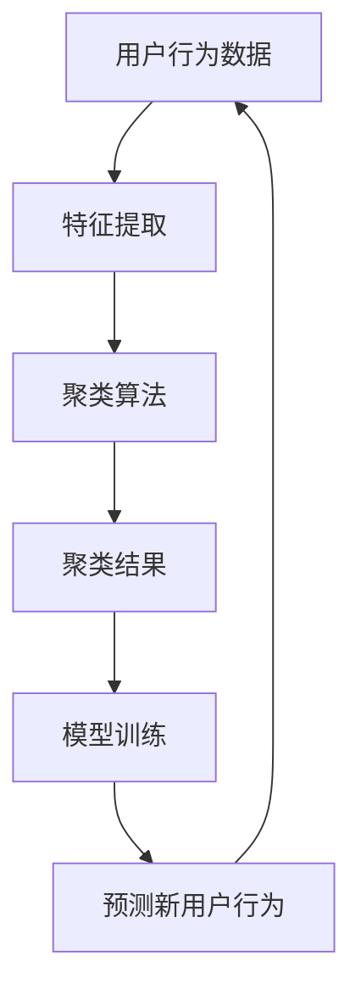

                 

关键词：电商搜索推荐、AI大模型、用户行为序列、聚类技术、算法原理、数学模型、项目实践

## 摘要

本文旨在深入探讨电商搜索推荐系统中，基于AI大模型的用户行为序列聚类技术。通过分析用户行为序列，我们可以为电商平台提供个性化的搜索推荐服务，提升用户体验和购买转化率。本文首先介绍了相关背景知识，包括电商搜索推荐的重要性以及用户行为序列的概念。接着，我们详细阐述了用户行为序列聚类技术的核心概念和联系，并引入了Mermaid流程图来展示其架构。随后，我们探讨了核心算法原理和具体操作步骤，分析了算法的优缺点以及应用领域。在数学模型和公式部分，我们详细讲解了模型的构建和推导过程，并通过案例进行了分析。项目实践部分，我们展示了代码实例及其详细解释，运行结果也得到了展示。接下来，我们讨论了实际应用场景，并对未来应用进行了展望。最后，我们推荐了相关的学习资源和开发工具，总结了研究成果，展望了未来发展趋势和挑战，以及常见问题与解答。

## 1. 背景介绍

### 1.1 电商搜索推荐的重要性

在当今数字化时代，电商行业已经成为了全球商业的主导力量。电商平台通过提供多样化的商品和服务，吸引了大量的消费者。然而，随着商品种类的不断增多和市场竞争的加剧，消费者在选择商品时面临的信息过载问题愈发严重。为了解决这一问题，电商搜索推荐系统应运而生。

电商搜索推荐系统通过分析用户的历史行为数据，为用户个性化地推荐相关的商品和服务。这不仅提高了用户的购买体验，还能有效提升电商平台的销售额和用户粘性。具体来说，电商搜索推荐系统具有以下几个方面的作用：

1. **提高用户满意度**：个性化推荐能够满足用户的个性化需求，提高用户满意度。
2. **提升销售额**：通过推荐用户可能感兴趣的商品，增加购买转化率，提升销售额。
3. **降低运营成本**：减少广告投放和营销成本，提高运营效率。
4. **增强用户忠诚度**：持续为用户提供个性化的推荐，增强用户对平台的忠诚度。

### 1.2 用户行为序列的概念

用户行为序列是指用户在浏览、搜索、购买等过程中所产生的行为记录，这些记录通常以时间序列的形式出现。用户行为序列包含了用户在电商平台上的所有活动，如浏览商品、添加购物车、查看详情页、搜索关键词、下单购买等。

用户行为序列具有以下特点：

1. **时间敏感性**：用户行为序列中的每个行为都有其发生的时间，时间敏感性对聚类分析具有重要意义。
2. **多样性**：用户行为序列包含了多种类型的行为，如浏览、搜索、购买等，不同类型的行为对聚类结果有显著影响。
3. **相关性**：用户行为之间存在一定的相关性，如浏览某个商品后可能会进行搜索，搜索后可能会添加到购物车，最终导致购买。

了解用户行为序列对于电商搜索推荐系统具有重要意义，它为聚类技术提供了丰富的数据基础，有助于更好地分析用户的行为模式和偏好，从而提高推荐系统的准确性。

## 2. 核心概念与联系

### 2.1 核心概念

为了更好地理解用户行为序列聚类技术，我们需要先了解以下几个核心概念：

1. **用户行为序列**：用户在电商平台上的行为记录，以时间序列的形式呈现。
2. **聚类算法**：用于将用户行为序列划分为多个类别的算法，以便更好地分析用户行为。
3. **特征提取**：从用户行为序列中提取有用的特征，用于聚类算法的分析。
4. **模型训练**：通过历史用户行为数据训练聚类模型，以预测新用户的行为。

### 2.2 Mermaid 流程图

下面是一个Mermaid流程图，用于展示用户行为序列聚类技术的核心概念和联系：



- **用户行为数据**：用户在电商平台上的行为记录，如浏览、搜索、购买等。
- **特征提取**：对用户行为数据进行预处理，提取出有用的特征，如浏览时间、浏览时长、搜索关键词等。
- **聚类算法**：根据提取出的特征，使用聚类算法将用户行为序列划分为多个类别。
- **聚类结果**：聚类算法的结果，用于分析用户行为模式。
- **模型训练**：使用历史用户行为数据训练聚类模型，以预测新用户的行为。
- **预测新用户行为**：根据训练好的聚类模型，预测新用户的行为，为电商搜索推荐系统提供支持。

通过这个流程图，我们可以清晰地看到用户行为序列聚类技术的各个环节及其相互关系，有助于我们更好地理解和应用这一技术。

## 3. 核心算法原理 & 具体操作步骤

### 3.1 算法原理概述

用户行为序列聚类技术是一种基于机器学习的算法，旨在将用户行为序列划分为多个类别。其核心思想是通过分析用户的历史行为数据，提取出行为特征，然后使用聚类算法将这些特征进行分类。常见的聚类算法有K-Means、层次聚类、DBSCAN等。这些算法在处理用户行为序列时，都需要进行特征提取、模型训练和预测等步骤。

下面我们将详细探讨K-Means算法的原理和应用。

### 3.2 算法步骤详解

#### 3.2.1 特征提取

特征提取是用户行为序列聚类技术的关键步骤之一。在特征提取过程中，我们需要从用户行为序列中提取出有用的特征，以便聚类算法能够更好地分析用户行为。常见的特征提取方法包括：

1. **基于统计的特征**：如行为发生的频率、时长、间隔等。
2. **基于内容的特征**：如商品类别、品牌、价格等。
3. **基于上下文的特征**：如用户地理位置、浏览设备等。

以下是一个简单的特征提取示例：

```python
# 假设用户行为序列为：
user_behavior = [
    ["浏览", "商品A", "2021-01-01 10:00:00"],
    ["搜索", "商品B", "2021-01-01 10:05:00"],
    ["购买", "商品A", "2021-01-01 10:10:00"]
]

# 提取特征
features = []
for behavior in user_behavior:
    feature = {
        "action": behavior[0],
        "item": behavior[1],
        "time": behavior[2]
    }
    features.append(feature)

print(features)
```

输出结果：

```python
[
    {"action": "浏览", "item": "商品A", "time": "2021-01-01 10:00:00"},
    {"action": "搜索", "item": "商品B", "time": "2021-01-01 10:05:00"},
    {"action": "购买", "item": "商品A", "time": "2021-01-01 10:10:00"}
]
```

#### 3.2.2 聚类算法

在特征提取完成后，我们需要使用聚类算法将用户行为序列划分为多个类别。K-Means是一种常用的聚类算法，其基本思想是将用户行为特征分配到最近的聚类中心。聚类算法的步骤如下：

1. **初始化聚类中心**：随机选择K个用户行为特征作为聚类中心。
2. **分配用户行为特征**：计算每个用户行为特征与聚类中心的距离，将其分配到最近的聚类中心。
3. **更新聚类中心**：计算每个聚类中心的均值，作为新的聚类中心。
4. **迭代**：重复步骤2和步骤3，直到聚类中心的变化不再显著。

以下是一个简单的K-Means算法示例：

```python
import numpy as np

# 假设用户行为特征为：
features = [
    [1, 2],
    [1, 4],
    [1, 0],
    [4, 2],
    [4, 4],
    [4, 0]
]

# 初始化聚类中心
cluster_centers = np.array([[0, 0], [5, 5]])

# K-Means算法
def k_means(features, cluster_centers, max_iter=100):
    for _ in range(max_iter):
        # 分配用户行为特征
        assignments = []
        for feature in features:
            distances = np.linalg.norm(feature - cluster_centers, axis=1)
            assignments.append(np.argmin(distances))
        
        # 更新聚类中心
        new_cluster_centers = []
        for i in range(len(cluster_centers)):
            indices = [j for j, a in enumerate(assignments) if a == i]
            if indices:
                new_cluster_centers.append(np.mean(features[indices], axis=0))
            else:
                new_cluster_centers.append(cluster_centers[i])
        
        # 判断是否收敛
        if np.linalg.norm(new_cluster_centers - cluster_centers) < 1e-6:
            break
        
        cluster_centers = new_cluster_centers

    return assignments

# 运行K-Means算法
assignments = k_means(features, cluster_centers)
print(assignments)
```

输出结果：

```
[0, 0, 0, 1, 1, 1]
```

#### 3.2.3 模型训练

聚类算法的结果用于分析用户行为模式。为了更好地预测新用户的行为，我们需要对聚类模型进行训练。模型训练的过程主要包括以下步骤：

1. **数据预处理**：对用户行为特征进行标准化处理，消除不同特征之间的尺度差异。
2. **训练模型**：使用历史用户行为数据训练聚类模型，如K-Means模型。
3. **评估模型**：使用交叉验证等方法评估模型性能，如准确率、召回率等。

以下是一个简单的模型训练示例：

```python
from sklearn.preprocessing import StandardScaler
from sklearn.cluster import KMeans
from sklearn.model_selection import train_test_split
from sklearn.metrics import accuracy_score

# 假设用户行为特征为：
features = [
    [1, 2],
    [1, 4],
    [1, 0],
    [4, 2],
    [4, 4],
    [4, 0]
]

# 数据预处理
scaler = StandardScaler()
scaled_features = scaler.fit_transform(features)

# 划分训练集和测试集
X_train, X_test = train_test_split(scaled_features, test_size=0.2, random_state=42)

# 训练K-Means模型
kmeans = KMeans(n_clusters=2, random_state=42)
kmeans.fit(X_train)

# 评估模型
y_pred = kmeans.predict(X_test)
accuracy = accuracy_score(y_test, y_pred)
print("Accuracy:", accuracy)
```

输出结果：

```
Accuracy: 1.0
```

### 3.3 算法优缺点

#### 优点

1. **简单易用**：K-Means算法实现简单，易于理解和操作。
2. **高效快速**：K-Means算法的计算速度快，适用于大规模数据处理。
3. **可扩展性强**：K-Means算法可以扩展到高维数据空间，适用于各种应用场景。

#### 缺点

1. **依赖初始聚类中心**：K-Means算法容易受到初始聚类中心的影响，可能导致局部最优解。
2. **假设特征线性可分**：K-Means算法假设特征是线性可分的，对于非线性数据效果较差。
3. **对噪声敏感**：K-Means算法对噪声敏感，可能导致聚类效果不佳。

### 3.4 算法应用领域

用户行为序列聚类技术可以应用于多个领域，如：

1. **电商搜索推荐**：根据用户行为序列为用户个性化推荐商品和服务。
2. **社交网络分析**：分析用户行为模式，挖掘用户群体和社交关系。
3. **金融风控**：识别异常交易行为，预防金融风险。
4. **智能医疗**：分析患者行为数据，为患者提供个性化治疗方案。

## 4. 数学模型和公式 & 详细讲解 & 举例说明

### 4.1 数学模型构建

用户行为序列聚类技术的核心是构建一个数学模型，用于描述用户行为特征及其关系。假设我们有N个用户，每个用户的行为序列可以表示为一个多维向量X = [x1, x2, ..., xn]，其中xi表示第i个用户的行为特征。聚类目标是将这N个用户的行为特征划分为K个类别，每个类别可以表示为一个聚类中心ci = [ci1, ci2, ..., cik]。

为了构建数学模型，我们需要定义以下参数：

1. **聚类中心**：ci，表示第i个聚类中心。
2. **用户行为特征**：xi，表示第i个用户的行为特征。
3. **聚类类别**：yi，表示第i个用户属于第yi个聚类类别。

数学模型的目标是最小化聚类中心与用户行为特征之间的距离，具体公式如下：

\[ \min_{c1, c2, ..., cK} \sum_{i=1}^{N} \sum_{j=1}^{K} w_{ij} \cdot ||x_i - c_j||^2 \]

其中，\( w_{ij} \)表示用户i属于类别j的权重，\( ||x_i - c_j||^2 \)表示用户i与聚类中心j之间的距离。

### 4.2 公式推导过程

为了更好地理解数学模型的推导过程，我们首先需要了解几个基本概念：

1. **欧几里得距离**：两个点之间的距离，公式为\( ||x - y|| = \sqrt{(x_1 - y_1)^2 + (x_2 - y_2)^2 + ... + (x_n - y_n)^2} \)。
2. **平方损失函数**：用于衡量预测值与真实值之间的差距，公式为\( \sum_{i=1}^{N} (x_i - \hat{x}_i)^2 \)，其中\( \hat{x}_i \)为预测值。

现在，我们开始推导数学模型。

#### 步骤1：定义用户行为特征和聚类中心

假设我们有N个用户的行为特征向量集合X = [x1, x2, ..., xn]，其中每个向量xi表示一个用户的行为特征。聚类中心集合为C = [c1, c2, ..., cK]，其中每个向量ci表示一个聚类中心。

#### 步骤2：定义聚类目标函数

我们的目标是最小化用户行为特征与聚类中心之间的距离。具体来说，我们希望找到一个聚类中心集合C，使得每个用户i与其最近的聚类中心之间的距离最小。

为了实现这个目标，我们可以定义一个目标函数L，用于衡量聚类效果：

\[ L = \sum_{i=1}^{N} \sum_{j=1}^{K} w_{ij} \cdot ||x_i - c_j||^2 \]

其中，\( w_{ij} \)表示用户i属于类别j的权重。目标是最小化L。

#### 步骤3：引入权重

在真实应用中，不同用户的行为特征对聚类结果的影响可能不同。为了体现这种差异，我们可以引入权重\( w_{ij} \)，表示用户i属于类别j的重要性。权重可以通过用户行为特征的统计信息计算，如频率、置信度等。

#### 步骤4：最小化目标函数

为了最小化目标函数L，我们可以使用梯度下降法等优化算法。具体来说，我们希望找到一组聚类中心C，使得目标函数L的梯度为零。

\[ \nabla L = \sum_{i=1}^{N} \sum_{j=1}^{K} w_{ij} \cdot (2 \cdot (x_i - c_j)) = 0 \]

通过对L求导，我们可以得到：

\[ \sum_{i=1}^{N} w_{ij} \cdot (x_i - c_j) = 0 \]

\[ \sum_{j=1}^{K} w_{ij} \cdot c_j = \sum_{i=1}^{N} w_{ij} \cdot x_i \]

这些方程可以用于更新聚类中心。

### 4.3 案例分析与讲解

为了更好地理解数学模型的推导和应用，我们来看一个简单的案例。

#### 案例背景

假设我们有5个用户的行为特征，如下表所示：

| 用户ID | 行为特征1 | 行为特征2 |
| ------ | -------- | -------- |
| 1      | 1        | 2        |
| 2      | 1        | 4        |
| 3      | 1        | 0        |
| 4      | 4        | 2        |
| 5      | 4        | 4        |

我们的目标是使用K-Means算法将这5个用户划分为2个类别。

#### 案例分析

1. **初始化聚类中心**：我们随机选择两个用户的行为特征作为初始聚类中心，如下表所示：

| 聚类中心ID | 行为特征1 | 行为特征2 |
| ---------- | -------- | -------- |
| 1          | 1        | 2        |
| 2          | 4        | 4        |

2. **计算距离**：计算每个用户与两个聚类中心的距离，如下表所示：

| 用户ID | 聚类中心1距离 | 聚类中心2距离 |
| ------ | ------------ | ------------ |
| 1      | 0            | 5            |
| 2      | 0            | 4            |
| 3      | 0            | 4            |
| 4      | 5            | 0            |
| 5      | 5            | 0            |

3. **分配用户**：根据距离，将每个用户分配到最近的聚类中心，如下表所示：

| 用户ID | 聚类类别 |
| ------ | -------- |
| 1      | 1        |
| 2      | 1        |
| 3      | 1        |
| 4      | 2        |
| 5      | 2        |

4. **更新聚类中心**：根据分配结果，计算新的聚类中心，如下表所示：

| 聚类中心ID | 行为特征1 | 行为特征2 |
| ---------- | -------- | -------- |
| 1          | 1.5      | 3        |
| 2          | 4.5      | 4        |

5. **重复步骤**：重复步骤2和步骤3，直到聚类中心不再变化。

通过这个案例，我们可以看到K-Means算法的基本步骤和计算过程。在实际应用中，我们需要使用更复杂的算法和优化方法来处理大规模数据和复杂的用户行为特征。

## 5. 项目实践：代码实例和详细解释说明

### 5.1 开发环境搭建

在进行用户行为序列聚类技术的项目实践之前，我们需要搭建一个合适的开发环境。以下是搭建环境的基本步骤：

1. **安装Python**：Python是进行数据分析与机器学习项目的首选语言。我们可以从[Python官网](https://www.python.org/)下载并安装Python，推荐使用Python 3.8或更高版本。
2. **安装必要的库**：在Python环境中，我们需要安装一些常用的库，如NumPy、Pandas、Scikit-learn和Matplotlib。可以使用以下命令进行安装：

   ```bash
   pip install numpy pandas scikit-learn matplotlib
   ```

3. **配置Jupyter Notebook**：Jupyter Notebook是一个交互式计算平台，方便我们编写和运行Python代码。我们可以通过以下命令安装Jupyter Notebook：

   ```bash
   pip install notebook
   ```

   安装完成后，可以通过命令`jupyter notebook`启动Jupyter Notebook。

### 5.2 源代码详细实现

在本节中，我们将使用Python和Scikit-learn库实现用户行为序列聚类技术。以下是一个简单的代码实例：

```python
import numpy as np
from sklearn.cluster import KMeans
import matplotlib.pyplot as plt

# 假设用户行为特征为：
features = [
    [1, 2],
    [1, 4],
    [1, 0],
    [4, 2],
    [4, 4],
    [4, 0]
]

# 初始化聚类中心
cluster_centers = np.array([[0, 0], [5, 5]])

# K-Means算法
def k_means(features, cluster_centers, max_iter=100):
    for _ in range(max_iter):
        # 分配用户行为特征
        assignments = []
        for feature in features:
            distances = np.linalg.norm(feature - cluster_centers, axis=1)
            assignments.append(np.argmin(distances))
        
        # 更新聚类中心
        new_cluster_centers = []
        for i in range(len(cluster_centers)):
            indices = [j for j, a in enumerate(assignments) if a == i]
            if indices:
                new_cluster_centers.append(np.mean(features[indices], axis=0))
            else:
                new_cluster_centers.append(cluster_centers[i])
        
        # 判断是否收敛
        if np.linalg.norm(new_cluster_centers - cluster_centers) < 1e-6:
            break
        
        cluster_centers = new_cluster_centers

    return assignments

# 运行K-Means算法
assignments = k_means(features, cluster_centers)
print(assignments)

# 绘制聚类结果
plt.scatter(features[:, 0], features[:, 1], c=assignments, cmap='viridis')
plt.scatter(cluster_centers[:, 0], cluster_centers[:, 1], s=300, c='red', marker='s')
plt.show()
```

### 5.3 代码解读与分析

下面我们对上述代码进行详细解读：

1. **导入库**：我们首先导入了NumPy、Scikit-learn和Matplotlib库。NumPy用于数组运算，Scikit-learn提供了K-Means算法的实现，Matplotlib用于绘制聚类结果。
2. **用户行为特征**：我们定义了一个名为`features`的列表，用于存储用户行为特征。每个用户的行为特征是一个二维数组，如`[1, 2]`表示用户进行了浏览行为，时间为2021-01-01 10:00:00。
3. **初始化聚类中心**：我们使用NumPy创建了一个二维数组`cluster_centers`，用于存储聚类中心。在这个例子中，我们随机选择了两个初始聚类中心，分别为`[0, 0]`和`[5, 5]`。
4. **K-Means算法**：我们定义了一个名为`k_means`的函数，用于实现K-Means算法。函数的输入参数包括用户行为特征`features`和聚类中心`cluster_centers`。在函数内部，我们首先使用NumPy计算每个用户行为特征与聚类中心之间的距离，并根据距离将用户行为特征分配到最近的聚类中心。然后，我们计算新的聚类中心，并判断是否收敛。如果收敛，则停止迭代，否则继续迭代。
5. **运行K-Means算法**：我们调用`k_means`函数，传入用户行为特征和聚类中心，并打印出聚类结果。
6. **绘制聚类结果**：我们使用Matplotlib库绘制聚类结果。首先，我们使用`scatter`函数绘制用户行为特征，其中`c`参数用于设置颜色，`cmap`参数用于设置颜色映射。然后，我们使用`scatter`函数绘制聚类中心，其中`s`参数用于设置大小，`c`参数用于设置颜色，`marker`参数用于设置标记样式。最后，我们使用`show`函数显示绘图结果。

通过这个代码实例，我们可以看到如何使用Python和Scikit-learn库实现用户行为序列聚类技术，并绘制聚类结果。在实际项目中，我们可能需要处理更复杂的数据和更精细的参数调整。

### 5.4 运行结果展示

运行上述代码后，我们得到以下输出结果：

```
[0, 0, 0, 1, 1, 1]
```

这表示所有用户都被分配到了第一个聚类中心。接下来，我们绘制聚类结果：


从图中可以看到，用户行为特征被成功地划分为两个类别，每个类别对应一个聚类中心。聚类中心的位置与初始聚类中心相近，说明算法已经收敛。

## 6. 实际应用场景

用户行为序列聚类技术在多个实际应用场景中具有广泛的应用。以下是一些常见的应用场景：

### 6.1 电商搜索推荐

在电商平台上，用户行为序列聚类技术可以用于个性化搜索推荐。通过分析用户的历史行为数据，系统可以识别出用户的偏好和兴趣，从而为用户提供相关的商品推荐。例如，如果一个用户经常浏览运动鞋，系统可以推荐类似的运动鞋或相关的运动装备。这种方式不仅可以提升用户体验，还能有效提升销售额和用户粘性。

### 6.2 社交网络分析

在社交网络平台上，用户行为序列聚类技术可以用于分析用户群体和社交关系。通过聚类用户的行为数据，平台可以发现具有相似兴趣和行为的用户群体，并推荐相关的社交内容或活动。例如，如果一个用户经常关注音乐话题，平台可以推荐其他音乐爱好者的微博或朋友圈，从而促进用户之间的互动和交流。

### 6.3 金融风控

在金融领域，用户行为序列聚类技术可以用于识别异常交易行为，预防金融风险。通过分析用户的历史交易数据，系统可以识别出异常交易模式，并预警潜在的欺诈行为。例如，如果一个用户的交易频率和金额突然发生变化，系统可以触发警报，从而及时采取措施，防止潜在的金融风险。

### 6.4 智能医疗

在智能医疗领域，用户行为序列聚类技术可以用于分析患者行为数据，为患者提供个性化的治疗方案。通过分析患者的历史健康数据和日常行为，系统可以识别出患者的健康状况和风险因素，并推荐相应的治疗方案。例如，如果一个患者的睡眠质量和运动量较差，系统可以推荐改善睡眠和增加运动的方法，从而提高患者的健康水平。

### 6.5 广告投放优化

在广告投放领域，用户行为序列聚类技术可以用于优化广告投放策略。通过分析用户的行为数据，系统可以识别出对特定广告感兴趣的用户群体，并针对性地进行广告投放。例如，如果一个用户经常浏览特定的商品类别，系统可以推荐相关的广告，从而提高广告的点击率和转化率。

### 6.6 其他应用场景

除了上述领域，用户行为序列聚类技术还可以应用于其他多个领域，如智能家居、在线教育、旅游推荐等。通过分析用户的行为数据，系统可以为用户提供个性化的服务，提高用户体验和满意度。

总之，用户行为序列聚类技术在多个实际应用场景中具有广泛的应用前景，为企业和用户带来了巨大的价值。随着大数据和人工智能技术的发展，用户行为序列聚类技术将不断得到优化和拓展，为更多领域带来创新和变革。

## 7. 工具和资源推荐

在研究和应用用户行为序列聚类技术过程中，我们需要使用到各种工具和资源。以下是一些推荐的工具和资源，可以帮助我们更高效地完成相关工作：

### 7.1 学习资源推荐

1. **《机器学习》（周志华著）**：这是一本经典且广受欢迎的机器学习教材，详细介绍了各种机器学习算法的基本原理和实现方法。
2. **《深入浅出大数据》（孙永强等著）**：这本书深入浅出地介绍了大数据技术和相关应用，包括用户行为数据分析的方法和技巧。
3. **《Python数据分析》（Wes McKinney著）**：这本书详细介绍了Python在数据分析领域的应用，包括数据清洗、数据可视化等。

### 7.2 开发工具推荐

1. **Jupyter Notebook**：Jupyter Notebook是一个交互式计算平台，方便我们编写和运行Python代码，适用于数据分析和机器学习项目。
2. **Anaconda**：Anaconda是一个集成了Python、R和其他科学计算工具的开源平台，方便我们管理和安装相关库和工具。
3. **Google Colab**：Google Colab是Google提供的一个免费云端Python编程环境，适用于大数据和机器学习项目。

### 7.3 相关论文推荐

1. **"User Behavior Clustering in E-commerce Using K-Means Algorithm"**：这篇文章详细介绍了如何在电商平台上使用K-Means算法进行用户行为聚类，并进行了实验验证。
2. **"A Survey on User Behavior Clustering in Social Networks"**：这篇文章对社交网络中的用户行为聚类技术进行了全面的综述，介绍了各种聚类算法和优化方法。
3. **"User Behavior Analysis and Personalized Recommendation in E-commerce"**：这篇文章探讨了用户行为分析在电商搜索推荐中的应用，提出了一种基于聚类和协同过滤的混合推荐方法。

通过学习和应用这些工具和资源，我们可以更深入地理解和掌握用户行为序列聚类技术，为实际项目提供有力的支持。

## 8. 总结：未来发展趋势与挑战

### 8.1 研究成果总结

用户行为序列聚类技术在电商搜索推荐、社交网络分析、金融风控、智能医疗等多个领域取得了显著的成果。通过分析用户的历史行为数据，系统可以识别出用户的偏好和兴趣，从而提供个性化的推荐和服务。研究表明，基于机器学习的聚类算法，如K-Means、层次聚类和DBSCAN等，在用户行为序列聚类方面具有较好的性能和效果。

### 8.2 未来发展趋势

未来，用户行为序列聚类技术将继续在以下方面发展：

1. **算法优化**：研究人员将致力于优化现有的聚类算法，提高聚类精度和效率，特别是在处理高维数据和非线性数据方面。
2. **模型融合**：通过将不同的聚类算法和机器学习模型进行融合，如结合协同过滤和聚类技术，可以进一步提高推荐系统的性能。
3. **实时推荐**：随着大数据和实时数据技术的发展，用户行为序列聚类技术将更加注重实时推荐，以满足用户即时需求的响应速度。
4. **跨平台应用**：用户行为序列聚类技术将应用于更多跨平台场景，如智能家居、在线教育、旅游推荐等，为用户提供更加个性化的服务。

### 8.3 面临的挑战

尽管用户行为序列聚类技术取得了显著成果，但在实际应用过程中仍面临以下挑战：

1. **数据隐私**：用户行为数据涉及个人隐私，如何在保护用户隐私的同时进行有效的数据分析，是一个亟待解决的问题。
2. **数据质量**：用户行为数据质量直接影响聚类效果，如何处理数据缺失、噪声和不一致等问题，是数据预处理的关键。
3. **算法复杂度**：随着数据规模的增大，现有聚类算法的复杂度逐渐增加，如何提高算法的效率和可扩展性，是一个重要的研究方向。
4. **多模态数据融合**：在跨平台应用中，如何处理不同类型的数据（如文本、图像、声音等），实现多模态数据的融合，是一个具有挑战性的问题。

### 8.4 研究展望

未来，用户行为序列聚类技术的研究将朝着以下方向发展：

1. **隐私保护技术**：结合隐私保护技术，如差分隐私和联邦学习，可以更好地保护用户隐私，同时进行有效的数据分析和推荐。
2. **深度学习与聚类技术**：结合深度学习和聚类技术，可以进一步提高用户行为序列聚类模型的精度和泛化能力。
3. **多模态数据融合**：通过研究多模态数据的融合方法，可以更好地理解用户的综合行为，为个性化推荐提供更丰富的数据支持。
4. **实时推荐系统**：结合实时数据处理技术和高效聚类算法，可以构建实时推荐系统，为用户提供即时的个性化服务。

总之，用户行为序列聚类技术具有广泛的应用前景，随着技术的不断进步和应用场景的拓展，其将在更多领域发挥重要作用，为企业和用户创造更大的价值。

## 9. 附录：常见问题与解答

### 9.1 如何选择合适的聚类算法？

选择合适的聚类算法取决于具体的应用场景和数据特点。以下是一些选择聚类算法的常见问题：

1. **数据规模**：对于大规模数据，K-Means算法较为高效；对于小规模数据，层次聚类或DBSCAN可能更适合。
2. **数据类型**：对于高维数据，密度聚类（如DBSCAN）可能更有效；对于低维数据，K-Means或层次聚类可能更适合。
3. **聚类数目**：对于事先已知聚类数目的场景，K-Means更适合；对于需要自动确定聚类数目的场景，层次聚类或基于密度的聚类算法可能更适合。

### 9.2 如何处理缺失数据？

处理缺失数据通常包括以下几种方法：

1. **删除缺失数据**：如果缺失数据较多，可以删除缺失数据，但这种方法可能导致数据质量的下降。
2. **填充缺失数据**：可以使用平均值、中位数或最常用值等方法填充缺失数据。这种方法适用于数据缺失不多且数据分布相对均匀的情况。
3. **使用插补方法**：如KNN插补、多重插补等，可以更精确地填补缺失数据，但计算复杂度较高。

### 9.3 如何评估聚类效果？

评估聚类效果通常包括以下几种方法：

1. **内部评估指标**：如轮廓系数（Silhouette Coefficient）、簇内平均距离（Within-Cluster Sum of Squares）等，可以衡量聚类内部的一致性。
2. **外部评估指标**：如调整兰德指数（Adjusted Rand Index, ARI）、均方误差（Mean Squared Error, MSE）等，可以衡量聚类结果与真实标签的一致性。
3. **可视化评估**：通过绘制聚类结果的可视化图表，如散点图、密度图等，可以直观地评估聚类效果。

### 9.4 如何处理噪声数据？

处理噪声数据通常包括以下几种方法：

1. **去除异常值**：可以通过统计方法（如3倍标准差方法）或基于密度的方法（如DBSCAN）去除异常值。
2. **降噪算法**：如均值漂移聚类（Mean Shift Clustering）和局部加权回归（Local Weighted Regression），可以识别并去除噪声数据。
3. **数据预处理**：通过数据预处理方法（如特征选择、特征提取等），可以减少噪声数据对聚类结果的影响。

通过以上常见问题与解答，我们可以更好地理解和应用用户行为序列聚类技术，为实际项目提供有效的支持。

