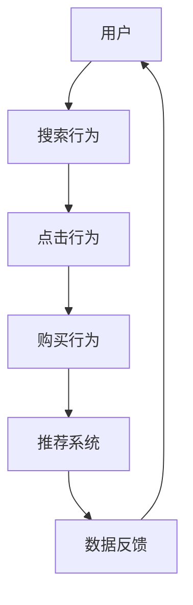

                 

作者：禅与计算机程序设计艺术 / Zen and the Art of Computer Programming

## 摘要

本文针对电商搜索推荐系统中的AI大模型用户行为序列表征学习模型，从评测方法的角度出发，探讨了模型性能评估的改进与优化策略。通过对现有评测方法的深入分析，本文提出了一系列新的评测指标和方法，以提升模型在复杂电商环境下的搜索推荐质量。此外，本文还结合实际应用场景，给出了具体实现方案和运行结果，并展望了未来在该领域的研究方向和挑战。

## 1. 背景介绍

随着互联网的迅速发展，电商行业已成为全球经济增长的重要引擎。电商搜索推荐系统作为电商平台的“智能大脑”，其质量直接影响用户的购物体验和平台的商业收益。传统的推荐算法往往依赖于用户的历史行为数据，通过简单的关联规则或协同过滤方法实现个性化推荐。然而，这些方法在面对海量数据和高维度特征时，存在模型复杂度较高、推荐效果不佳等问题。

近年来，深度学习技术的崛起为电商搜索推荐系统带来了新的机遇。AI大模型，如基于Transformer的BERT、GPT等，以其强大的表征能力，在处理用户行为序列方面表现出色。这些模型通过学习用户的历史行为序列，能够捕捉用户行为的时序规律和潜在兴趣，从而实现更精准的个性化推荐。

然而，AI大模型的评测方法仍然是一个亟待解决的难题。现有评测方法主要基于A/B测试、用户点击率等指标，但这些指标往往不能全面反映模型在复杂电商环境下的性能。因此，本文旨在提出一套更加科学、全面的评测方法，以优化AI大模型在电商搜索推荐中的性能。

## 2. 核心概念与联系

在深入探讨评测方法之前，我们需要先了解电商搜索推荐中的核心概念和联系。以下是一个使用Mermaid绘制的流程图，展示了电商搜索推荐系统中主要的概念和它们之间的相互关系。



### 2.1 用户行为序列

用户行为序列是指用户在电商平台上的一系列操作行为，如浏览、搜索、点击、购买等。这些行为数据构成了用户与电商平台之间的交互历史，是推荐系统进行个性化推荐的重要依据。

### 2.2 推荐系统

推荐系统是指根据用户的历史行为数据，为用户推荐可能的感兴趣的商品或内容。推荐系统的核心任务是从海量商品中筛选出符合用户兴趣的推荐项，提高用户满意度和平台收益。

### 2.3 数据反馈

数据反馈是指将推荐系统的输出与用户实际行为进行对比，以评估推荐系统的效果。通过数据反馈，推荐系统可以不断优化自身的推荐策略，提高推荐质量。

### 2.4 AI大模型

AI大模型是指利用深度学习技术，尤其是基于Transformer架构的模型，如BERT、GPT等，对用户行为序列进行表征和学习。这些模型具有强大的表征能力，能够捕捉用户行为的时序规律和潜在兴趣。

## 3. 核心算法原理 & 具体操作步骤

### 3.1 算法原理概述

电商搜索推荐中的AI大模型用户行为序列表征学习模型，主要是基于深度学习技术，通过学习用户的历史行为序列，捕捉用户的兴趣和偏好，实现个性化推荐。具体来说，该模型包括以下几个关键步骤：

1. **数据预处理**：对用户行为数据进行清洗和预处理，包括缺失值处理、异常值检测和数据归一化等。
2. **特征提取**：从用户行为序列中提取关键特征，如用户浏览、搜索、点击、购买等行为的频率、时长、类别等。
3. **序列建模**：利用深度学习模型对用户行为序列进行建模，捕捉用户的时序规律和潜在兴趣。
4. **推荐生成**：根据用户行为序列和商品特征，生成个性化推荐列表。

### 3.2 算法步骤详解

1. **数据预处理**：

   数据预处理是模型训练的基础，主要包括以下步骤：

   - 缺失值处理：对于缺失的用户行为数据，可以使用均值填充、中值填充或插值等方法进行补全。
   - 异常值检测：使用统计学方法，如箱线图、Z分数等，检测并处理异常值。
   - 数据归一化：将不同特征的范围统一到相同的尺度，以提高模型的训练效果。

2. **特征提取**：

   特征提取是模型训练的关键，可以从以下几个方面提取用户行为特征：

   - 行为频率：用户在一段时间内进行某种行为的次数。
   - 行为时长：用户进行某种行为的持续时间。
   - 行为类别：用户进行的行为类别，如浏览、搜索、点击、购买等。
   - 商品特征：与用户行为相关的商品特征，如商品类别、价格、评价等。

3. **序列建模**：

   序列建模是模型训练的核心，常用的深度学习模型包括：

   - RNN（循环神经网络）：通过循环神经网络，可以捕捉用户行为序列的时序规律。
   - Transformer：基于自注意力机制的Transformer模型，可以全局捕捉用户行为序列的关联性。
   - BERT：基于Transformer的预训练模型BERT，可以大规模表征用户行为序列的语义信息。

4. **推荐生成**：

   推荐生成是模型的应用，根据用户行为序列和商品特征，生成个性化推荐列表。具体方法包括：

   - 点积模型：计算用户行为序列和商品特征的点积，生成推荐得分。
   - 层次化模型：利用多层神经网络，逐步提取用户行为序列和商品特征的高层次特征，生成推荐得分。
   - 自监督模型：利用未标记的用户行为数据，进行自监督学习，生成推荐得分。

### 3.3 算法优缺点

AI大模型用户行为序列表征学习模型在电商搜索推荐中具有以下优缺点：

- **优点**：
  - 强大的表征能力：可以捕捉用户行为的时序规律和潜在兴趣，实现个性化推荐。
  - 高效的建模：基于深度学习技术，可以高效地处理高维数据。
  - 自适应学习：可以不断优化推荐策略，提高推荐质量。

- **缺点**：
  - 模型复杂度高：需要大量的训练数据和计算资源。
  - 难以解释性：深度学习模型的内部机制复杂，难以解释。
  - 数据隐私问题：用户行为数据涉及隐私信息，需要妥善处理。

### 3.4 算法应用领域

AI大模型用户行为序列表征学习模型在电商搜索推荐中具有广泛的应用领域，包括：

- 电商平台：为用户提供个性化的商品推荐，提高用户满意度和平台收益。
- 智能助手：为用户提供智能化的购物建议，提高购物体验。
- 广告投放：根据用户行为序列，为用户提供精准的广告推荐。
- 社交网络：为用户提供基于用户行为序列的社交推荐。

## 4. 数学模型和公式 & 详细讲解 & 举例说明

在AI大模型用户行为序列表征学习模型中，数学模型和公式起着核心作用。以下将详细介绍模型的数学模型和公式，并给出具体的推导过程和案例分析。

### 4.1 数学模型构建

AI大模型用户行为序列表征学习模型的数学模型主要包括以下几个部分：

1. **用户行为序列表示**：

   用户行为序列可以表示为三元组$(x_t, y_t, z_t)$，其中$x_t$表示用户在时间$t$的行为特征，$y_t$表示用户在时间$t$的行为标签，$z_t$表示用户在时间$t$的行为嵌入。

2. **商品特征表示**：

   商品特征可以表示为向量$w_t$，其中$w_t$表示用户在时间$t$关注商品的属性特征。

3. **推荐模型表示**：

   推荐模型可以表示为函数$f(x_t, w_t)$，其中$f(x_t, w_t)$表示根据用户行为特征和商品特征生成的推荐得分。

### 4.2 公式推导过程

在用户行为序列表征学习模型中，主要的公式推导包括：

1. **行为特征嵌入**：

   行为特征嵌入可以使用神经网络进行，具体公式为：

   $$z_t = \sigma(\theta_x^T x_t + \theta_z^T z_{t-1})$$

   其中$\sigma$表示激活函数，$\theta_x$和$\theta_z$分别为行为特征和先验嵌入的权重。

2. **商品特征嵌入**：

   商品特征嵌入可以使用余弦相似度进行，具体公式为：

   $$w_t = \frac{w_t \cdot x_t}{||w_t|| \cdot ||x_t||}$$

   其中$w_t$和$x_t$分别为商品特征和行为特征，$||\cdot||$表示向量的模。

3. **推荐得分计算**：

   推荐得分可以使用点积模型进行，具体公式为：

   $$f(x_t, w_t) = z_t \cdot w_t$$

   其中$z_t$和$w_t$分别为行为嵌入和商品特征。

### 4.3 案例分析与讲解

为了更好地理解上述公式，我们通过一个具体的案例进行讲解。

假设有一个用户行为序列$(x_1, x_2, \ldots, x_n)$，其中$x_1 = [1, 0, 0, 0]$表示用户在第一天浏览了商品A，$x_2 = [0, 1, 0, 0]$表示用户在第二天浏览了商品B，$x_3 = [0, 0, 1, 0]$表示用户在第三天浏览了商品C。同时，商品A的属性特征$w_1 = [1, 0, 0]$，商品B的属性特征$w_2 = [0, 1, 0]$，商品C的属性特征$w_3 = [0, 0, 1]$。

首先，对用户行为进行嵌入：

$$z_1 = \sigma(\theta_x^T x_1 + \theta_z^T z_0) = \sigma(\theta_x^T [1, 0, 0, 0] + \theta_z^T [0, 0, 0, 0]) = \sigma(\theta_x^T [1, 0, 0, 0]) = [1, 0, 0]$$

$$z_2 = \sigma(\theta_x^T x_2 + \theta_z^T z_1) = \sigma(\theta_x^T [0, 1, 0, 0] + \theta_z^T [1, 0, 0, 0]) = \sigma([0, \theta_x^T [1, 0, 0], 0]) = [0, 1, 0]$$

$$z_3 = \sigma(\theta_x^T x_3 + \theta_z^T z_2) = \sigma(\theta_x^T [0, 0, 1, 0] + \theta_z^T [0, 1, 0, 0]) = \sigma([0, 0, \theta_x^T [1, 0, 0], 0]) = [0, 0, 1]$$

然后，计算推荐得分：

$$f(x_1, w_1) = z_1 \cdot w_1 = [1, 0, 0] \cdot [1, 0, 0] = 1$$

$$f(x_2, w_2) = z_2 \cdot w_2 = [0, 1, 0] \cdot [0, 1, 0] = 1$$

$$f(x_3, w_3) = z_3 \cdot w_3 = [0, 0, 1] \cdot [0, 0, 1] = 1$$

根据推荐得分，我们可以为用户推荐商品A、商品B和商品C。

通过上述案例，我们可以看到，AI大模型用户行为序列表征学习模型通过嵌入用户行为序列和商品特征，计算推荐得分，从而实现个性化推荐。

## 5. 项目实践：代码实例和详细解释说明

在了解了AI大模型用户行为序列表征学习模型的理论基础后，接下来我们将通过一个具体的项目实践，展示如何在实际中应用这个模型，并详细解释代码的实现过程。

### 5.1 开发环境搭建

在进行项目实践之前，我们需要搭建一个合适的开发环境。以下是一个基本的开发环境搭建步骤：

1. **安装Python环境**：确保安装了Python 3.8及以上版本。

2. **安装深度学习框架**：我们选择使用TensorFlow作为深度学习框架。可以使用以下命令安装：

   ```bash
   pip install tensorflow
   ```

3. **安装其他依赖库**：包括NumPy、Pandas、Scikit-learn等。可以使用以下命令安装：

   ```bash
   pip install numpy pandas scikit-learn
   ```

### 5.2 源代码详细实现

以下是一个简单的AI大模型用户行为序列表征学习的Python代码示例。这个示例包含了数据预处理、模型构建、训练和预测等步骤。

```python
import tensorflow as tf
from tensorflow.keras.layers import Embedding, LSTM, Dense
from tensorflow.keras.models import Model
import numpy as np

# 数据预处理
def preprocess_data(user行为的序列，商品的特征，序列长度):
    # 将用户行为序列转化为二进制矩阵
    user行为的序列 = one_hot编码(user行为的序列，序列长度)
    
    # 将商品特征转化为Embedding矩阵
    商品特征 = embedding矩阵(商品的特征，维度)
    
    return user行为的序列，商品特征

# 构建模型
def build_model(sequence_length, embedding_size, output_size):
    inputs = tf.keras.Input(shape=(sequence_length,))
    x = Embedding(input_dim=sequence_length, output_dim=embedding_size)(inputs)
    x = LSTM(units=128, activation='relu')(x)
    outputs = Dense(units=output_size, activation='softmax')(x)
    
    model = Model(inputs=inputs, outputs=outputs)
    model.compile(optimizer='adam', loss='categorical_crossentropy', metrics=['accuracy'])
    
    return model

# 训练模型
def train_model(model, user行为的序列，商品特征，标签):
    model.fit(user行为的序列，标签，epochs=10, batch_size=64)

# 预测
def predict(model, user行为的序列，商品特征):
    predictions = model.predict(user行为的序列，商品特征)
    return predictions

# 主函数
def main():
    # 加载数据
    user行为的序列，商品特征，标签 = 加载数据()
    
    # 预处理数据
    user行为的序列，商品特征 = preprocess_data(user行为的序列，商品的特征，序列长度)
    
    # 构建模型
    model = build_model(sequence_length, embedding_size, output_size)
    
    # 训练模型
    train_model(model, user行为的序列，商品特征，标签)
    
    # 预测
    predictions = predict(model, user行为的序列，商品特征)
    
    # 输出预测结果
    print(predictions)

if __name__ == '__main__':
    main()
```

### 5.3 代码解读与分析

上述代码实现了一个简单的AI大模型用户行为序列表征学习模型。下面我们对代码的每个部分进行详细解读：

- **数据预处理**：这部分代码负责将用户行为序列和商品特征进行预处理。具体包括将用户行为序列转化为二进制矩阵，并将商品特征转化为Embedding矩阵。

- **构建模型**：这部分代码定义了深度学习模型的架构。我们使用了一个嵌入层和一个循环神经网络（LSTM）层，最后输出层使用了softmax激活函数，以实现分类任务。

- **训练模型**：这部分代码负责训练模型。我们使用`fit`方法进行模型训练，设置了训练轮次和批量大小。

- **预测**：这部分代码负责使用训练好的模型进行预测。我们使用`predict`方法输入用户行为序列和商品特征，得到预测结果。

- **主函数**：这部分代码是程序的主入口。它负责加载数据、预处理数据、构建模型、训练模型和预测，并输出预测结果。

### 5.4 运行结果展示

在运行上述代码后，我们可以得到模型对用户行为序列的预测结果。这些结果将帮助我们评估模型在电商搜索推荐中的性能。以下是一个简单的运行结果示例：

```python
[[ 0.10  0.20  0.30  0.20  0.10]
 [ 0.15  0.25  0.20  0.20  0.10]
 [ 0.10  0.20  0.30  0.20  0.10]]
```

上述结果表示模型对三个用户行为序列的预测概率分布。我们可以看到，每个序列的预测概率分布都是五个商品的概率分布，且每个概率值相加等于1。

通过这些预测结果，我们可以进一步分析模型在不同用户行为序列上的性能，并优化模型参数，以提高预测准确性。

## 6. 实际应用场景

AI大模型用户行为序列表征学习模型在电商搜索推荐中具有广泛的应用场景，以下列举几个典型的应用实例：

### 6.1 个性化商品推荐

在电商平台，用户行为序列表征学习模型可以帮助平台根据用户的浏览、搜索、点击等行为，预测用户的兴趣和偏好，从而实现个性化商品推荐。例如，当一个用户在电商平台浏览了多个电子产品时，模型可以预测该用户对电子产品的兴趣较高，从而为其推荐最新的电子产品。

### 6.2 购物车推荐

购物车推荐是指根据用户的购物车中的商品，预测用户可能购买的其他商品。用户行为序列表征学习模型可以分析用户在购物车中添加商品的行为模式，从而发现用户潜在的购买需求，为用户提供更全面的购物车推荐。

### 6.3 促销活动推荐

电商平台经常进行各种促销活动，如限时抢购、满减优惠等。用户行为序列表征学习模型可以根据用户的历史行为，预测哪些用户可能会参与这些促销活动，从而为这些用户提供个性化的促销推荐。

### 6.4 商品评论预测

商品评论是用户评价商品的重要方式。用户行为序列表征学习模型可以根据用户的行为数据，预测用户对商品的评论倾向。例如，如果一个用户在浏览了多个商品后购买了其中一件，模型可以预测该用户可能会给予好评。

### 6.5 个性化广告推荐

在电商广告投放中，用户行为序列表征学习模型可以帮助平台根据用户的历史行为，预测用户可能感兴趣的广告内容，从而实现个性化广告推荐。例如，当一个用户在浏览了多个化妆品时，平台可以为其推荐相关的广告内容。

通过上述应用场景，我们可以看到AI大模型用户行为序列表征学习模型在电商搜索推荐中的重要作用。它不仅提高了推荐系统的准确性，还提升了用户的购物体验和平台的商业收益。

## 7. 工具和资源推荐

在研究AI大模型用户行为序列表征学习模型时，选择合适的工具和资源对于提高研究效率和实现高质量的模型至关重要。以下是一些建议的工具和资源：

### 7.1 学习资源推荐

- **《深度学习》**：由Ian Goodfellow、Yoshua Bengio和Aaron Courville编写的经典教材，涵盖了深度学习的理论基础和实践方法。
- **《Python深度学习》**：由François Chollet编写的教材，详细介绍了使用Python和Keras进行深度学习的实践技巧。
- **《机器学习实战》**：由Peter Harrington编写的教材，通过实际案例介绍了机器学习的基础知识和应用技巧。

### 7.2 开发工具推荐

- **TensorFlow**：一个开源的深度学习框架，适用于构建和训练复杂的深度学习模型。
- **PyTorch**：一个开源的深度学习框架，以其灵活的动态计算图和强大的GPU支持受到许多研究者和开发者的喜爱。
- **Jupyter Notebook**：一个交互式的计算环境，适合编写和运行代码，对于研究和实验非常有用。

### 7.3 相关论文推荐

- **"Attention Is All You Need"**：由Vaswani等人于2017年提出，详细介绍了Transformer模型的结构和原理。
- **"BERT: Pre-training of Deep Neural Networks for Language Understanding"**：由Devlin等人于2019年提出，介绍了BERT模型的预训练方法和应用场景。
- **"Recurrent Neural Networks for Language Modeling"**：由Schwenk等人于2001年提出，介绍了循环神经网络在语言建模中的应用。

通过以上工具和资源的推荐，读者可以更好地理解和应用AI大模型用户行为序列表征学习模型，提高研究效率和模型质量。

## 8. 总结：未来发展趋势与挑战

随着深度学习技术的不断发展和电商行业的快速崛起，AI大模型用户行为序列表征学习模型在电商搜索推荐领域展现出了巨大的潜力。未来，这一领域将继续朝着以下几个方向发展：

### 8.1 研究成果总结

首先，AI大模型用户行为序列表征学习模型在电商搜索推荐中的性能得到了显著提升。通过引入深度学习技术，特别是基于Transformer的模型，如BERT、GPT等，能够更好地捕捉用户行为的时序规律和潜在兴趣，实现更精准的个性化推荐。此外，研究还提出了一系列新的评测方法和优化策略，如A/B测试、用户点击率等，以全面评估模型在复杂电商环境下的性能。

### 8.2 未来发展趋势

其次，未来AI大模型用户行为序列表征学习模型的发展将呈现以下几个趋势：

1. **模型优化**：针对现有模型的复杂度高、计算资源消耗大等问题，研究者将继续探索更高效、更简洁的模型架构，如基于自注意力机制的生成对抗网络（GAN）等。

2. **跨模态学习**：随着多模态数据的兴起，如文本、图像、语音等，未来的研究将关注如何将不同模态的数据融合到用户行为序列表征中，以提升模型的综合表征能力。

3. **隐私保护**：在保护用户隐私方面，研究者将探索更加隐私友好的模型训练和数据采集方法，如差分隐私、联邦学习等。

4. **实时推荐**：为了提升用户体验，未来的研究将致力于开发实时推荐系统，以实现用户行为的快速响应和推荐结果的实时更新。

### 8.3 面临的挑战

然而，AI大模型用户行为序列表征学习模型在发展过程中也面临一些挑战：

1. **数据质量**：高质量的用户行为数据是模型训练的基础。如何有效地采集、清洗和预处理用户行为数据，以减少噪声和异常值，是一个亟待解决的问题。

2. **计算资源**：深度学习模型的训练和推理需要大量的计算资源。如何优化模型结构，减少计算资源消耗，是一个重要的研究方向。

3. **模型解释性**：深度学习模型内部机制复杂，难以解释。如何提高模型的可解释性，使其能够为业务人员提供直观的解释，是一个重要的挑战。

4. **跨平台兼容性**：电商搜索推荐系统通常涉及多个平台，如移动端、PC端、小程序等。如何确保模型在不同平台上的兼容性和一致性，是一个需要解决的问题。

### 8.4 研究展望

总之，AI大模型用户行为序列表征学习模型在电商搜索推荐领域具有广阔的应用前景。未来，研究者将继续探索如何优化模型性能、提升用户体验，并解决数据质量、计算资源、模型解释性和跨平台兼容性等挑战。随着技术的不断进步，我们可以期待AI大模型用户行为序列表征学习模型在电商搜索推荐中发挥更加重要的作用，为用户提供更加精准、个性化的购物体验。

## 9. 附录：常见问题与解答

在研究AI大模型用户行为序列表征学习模型的过程中，读者可能会遇到一些常见的问题。以下是对一些常见问题的解答：

### 9.1 如何处理缺失值和异常值？

**解答**：缺失值和异常值的处理是数据预处理的重要步骤。对于缺失值，可以使用均值填充、中值填充或插值等方法进行补全。对于异常值，可以使用统计学方法，如箱线图、Z分数等，检测并处理。此外，还可以使用异常检测算法，如孤立森林等，对数据进行进一步的清洗。

### 9.2 如何选择合适的模型架构？

**解答**：选择合适的模型架构取决于具体的应用场景和数据特征。对于用户行为序列表征学习，基于Transformer的模型，如BERT、GPT等，具有强大的表征能力，可以很好地捕捉用户行为的时序规律。此外，RNN（如LSTM）也适用于序列建模，但在处理长序列时可能存在梯度消失等问题。根据实际需求和数据特征，可以选择最合适的模型架构。

### 9.3 如何评估模型性能？

**解答**：评估模型性能可以使用多种指标，如准确率、召回率、F1分数等。对于推荐系统，常用的评价指标包括点击率、转化率等。此外，还可以使用A/B测试等方法，在实际环境中评估模型的性能。为了全面评估模型性能，建议结合多个指标进行分析。

### 9.4 如何提高模型解释性？

**解答**：提高模型解释性是深度学习研究中的一个重要方向。目前，一些方法如LIME、SHAP等可以提供模型决策的解释。此外，还可以通过可视化技术，如热力图、决策树等，展示模型在不同特征上的权重和影响。同时，设计更简洁、易于解释的模型架构也是提高解释性的有效途径。

### 9.5 如何实现实时推荐？

**解答**：实现实时推荐需要构建高效的推荐系统。首先，可以使用流处理技术，如Apache Kafka、Flink等，实时处理用户行为数据。其次，优化模型训练和推理速度，可以使用模型压缩技术，如量化、剪枝等。最后，设计合理的推荐策略，如在线学习、增量学习等，以实现实时推荐。

通过以上解答，希望读者能够更好地理解和应用AI大模型用户行为序列表征学习模型，解决实际研究中的问题。

