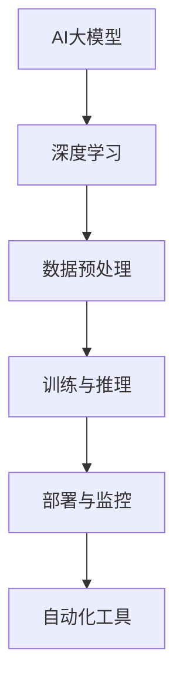

                 

### 1. 背景介绍

随着互联网的迅速发展和电子商务的崛起，电商平台的竞争日益激烈。用户在电商平台上的搜索和推荐行为成为商家争夺用户和提升销售额的关键因素。为了满足用户个性化的需求，电商平台开始采用人工智能技术来优化搜索和推荐系统。其中，AI大模型在电商搜索推荐场景中发挥着至关重要的作用。

AI大模型是一种复杂的人工神经网络模型，通过对海量数据进行深度学习，能够自动提取特征并生成相应的预测结果。在电商搜索推荐场景中，AI大模型可以用于用户行为分析、商品推荐、搜索结果排序等任务，从而提升用户体验和商业价值。

然而，部署AI大模型面临诸多挑战。首先，大模型的训练和推理过程需要大量的计算资源和时间。其次，模型的性能和稳定性对于用户体验至关重要，需要确保模型在不同场景下的表现一致。最后，随着电商业务的快速发展，模型的部署和更新也需要具备高可扩展性和高可靠性。

为了解决这些挑战，自动化工具的选型变得尤为重要。自动化工具可以帮助实现AI大模型的训练、部署、监控和更新等全流程的自动化，提高开发效率和系统稳定性。本文将围绕电商搜索推荐场景，探讨AI大模型部署全流程自动化工具的选型问题。

### 2. 核心概念与联系

在深入探讨AI大模型部署全流程自动化工具之前，我们首先需要了解一些核心概念和联系。以下是电商搜索推荐场景下的关键概念及其相互关系：

#### 2.1. AI大模型

AI大模型，通常指的是基于深度学习技术的大型神经网络模型。这些模型通过多层非线性变换，从海量数据中自动学习特征，从而实现对复杂问题的预测和决策。在电商搜索推荐场景中，AI大模型可以用于用户行为分析、商品推荐、搜索结果排序等任务。

#### 2.2. 深度学习

深度学习是一种机器学习方法，通过构建多层神经网络来实现自动特征提取和模式识别。深度学习模型的学习过程包括前向传播、反向传播和权重更新等步骤。在电商搜索推荐场景中，深度学习模型可以自动提取用户行为和商品特征，从而生成个性化的推荐结果。

#### 2.3. 数据预处理

数据预处理是深度学习模型训练前的重要步骤，包括数据清洗、数据归一化、特征提取等操作。在电商搜索推荐场景中，数据预处理有助于提高模型训练效果和减少过拟合风险。

#### 2.4. 训练与推理

训练和推理是AI大模型的核心环节。训练过程通过迭代优化模型参数，使模型能够准确预测目标变量。推理过程则是将训练好的模型应用于实际数据，生成预测结果。在电商搜索推荐场景中，训练和推理过程需要大量的计算资源和时间。

#### 2.5. 部署与监控

部署是将训练好的模型部署到生产环境中，使其能够为用户提供实时服务。监控则是实时跟踪模型的性能和稳定性，以便及时发现和处理问题。在电商搜索推荐场景中，部署和监控过程需要保证系统的高可用性和高可靠性。

#### 2.6. 自动化工具

自动化工具是指能够自动完成特定任务的软件工具，包括任务调度、资源管理、代码生成、模型训练、模型部署等。在AI大模型部署全流程中，自动化工具可以帮助提高开发效率和系统稳定性。

下面是一个用Mermaid绘制的流程图，展示了这些核心概念及其相互关系：



通过这个流程图，我们可以清晰地看到AI大模型部署全流程中各个环节之间的联系，以及自动化工具在其中的关键作用。

### 3. 核心算法原理 & 具体操作步骤

#### 3.1 算法原理概述

在电商搜索推荐场景下，AI大模型的部署涉及多个核心算法。以下是这些算法的基本原理和作用：

##### 3.1.1 深度学习算法

深度学习算法是AI大模型的核心。它通过多层神经网络结构，自动提取数据中的特征，实现对复杂问题的预测和决策。常见的深度学习算法包括卷积神经网络（CNN）、循环神经网络（RNN）、生成对抗网络（GAN）等。

##### 3.1.2 数据预处理算法

数据预处理算法用于处理原始数据，使其适合深度学习模型的训练。常见的数据预处理算法包括数据清洗、数据归一化、特征提取等。数据清洗算法用于去除数据中的噪声和异常值，数据归一化算法用于将不同特征的数据转换为同一尺度，特征提取算法用于从原始数据中提取有价值的特征。

##### 3.1.3 模型训练算法

模型训练算法用于优化深度学习模型的参数，使其能够准确预测目标变量。常见的模型训练算法包括梯度下降法、随机梯度下降法、Adam优化器等。这些算法通过迭代优化模型参数，使模型能够更好地拟合训练数据。

##### 3.1.4 模型评估算法

模型评估算法用于评估深度学习模型的性能，包括准确率、召回率、F1分数等指标。这些算法通过对训练数据和测试数据进行分析，评估模型的预测能力。

##### 3.1.5 模型部署算法

模型部署算法用于将训练好的模型部署到生产环境中，使其能够为用户提供实时服务。常见的模型部署算法包括模型打包、模型推理、模型监控等。这些算法确保模型能够高效、稳定地运行，并实时响应用户请求。

#### 3.2 算法步骤详解

以下是AI大模型部署全流程的具体操作步骤：

##### 3.2.1 数据预处理

1. 数据清洗：删除数据中的噪声和异常值，确保数据质量。
2. 数据归一化：将不同特征的数据转换为同一尺度，提高模型训练效果。
3. 特征提取：从原始数据中提取有价值的特征，提高模型预测能力。

##### 3.2.2 模型训练

1. 初始化模型参数：随机初始化深度学习模型的参数。
2. 前向传播：将输入数据传递到模型中，计算输出结果。
3. 反向传播：计算模型输出与实际结果的误差，反向传播误差以更新模型参数。
4. 梯度下降：根据误差梯度更新模型参数，优化模型性能。
5. 模型评估：使用验证集评估模型性能，调整模型参数。

##### 3.2.3 模型部署

1. 模型打包：将训练好的模型打包为可执行文件或库。
2. 模型推理：将用户请求传递到模型中，生成预测结果。
3. 模型监控：实时监控模型性能和稳定性，确保模型正常运行。

##### 3.2.4 模型更新

1. 数据更新：定期更新训练数据，确保模型能够适应新的业务需求。
2. 模型重训：重新训练模型，优化模型性能。
3. 模型部署：将更新后的模型部署到生产环境中，替代旧模型。

#### 3.3 算法优缺点

每种算法都有其优缺点，以下是AI大模型部署全流程中常用算法的优缺点分析：

##### 3.3.1 深度学习算法

优点：
- 强大的特征提取能力，能够处理复杂的非线性问题。
- 自动化特征工程，减轻了数据预处理的工作量。

缺点：
- 训练过程需要大量计算资源和时间。
- 过拟合风险较高，需要采用正则化技术进行缓解。

##### 3.3.2 数据预处理算法

优点：
- 提高模型训练效果和预测能力。
- 减少过拟合风险。

缺点：
- 数据预处理过程复杂，需要大量的时间和精力。
- 需要专业的数据预处理技能。

##### 3.3.3 模型训练算法

优点：
- 能够优化模型参数，提高模型性能。
- 自动化参数调整，减轻了模型调优的工作量。

缺点：
- 需要大量的计算资源和时间。
- 部分算法（如随机梯度下降）在训练过程中容易陷入局部最优。

##### 3.3.4 模型评估算法

优点：
- 能够客观评估模型性能，指导模型调优。
- 提供多种评估指标，满足不同业务需求。

缺点：
- 需要大量的测试数据和计算资源。
- 部分评估指标（如准确率、召回率）可能存在误导性。

##### 3.3.5 模型部署算法

优点：
- 实时响应用户请求，提高用户体验。
- 系统稳定性和可扩展性高。

缺点：
- 需要专业的部署和维护技能。
- 部署过程中可能面临安全性和性能问题。

#### 3.4 算法应用领域

AI大模型部署算法在电商搜索推荐场景中具有广泛的应用。以下是一些典型的应用领域：

##### 3.4.1 用户行为分析

通过深度学习算法，对用户在电商平台上的行为进行分析，包括浏览记录、购买行为、评价行为等。从而实现对用户的精准画像，为推荐系统提供依据。

##### 3.4.2 商品推荐

基于用户行为数据和商品特征，利用深度学习算法生成个性化的商品推荐列表，提高用户满意度。

##### 3.4.3 搜索结果排序

通过深度学习算法，对搜索结果进行排序，确保用户能够找到最相关的商品。

##### 3.4.4 用户流失预测

利用深度学习算法，预测用户在电商平台上的流失风险，为商家提供有针对性的挽回措施。

##### 3.4.5 营销活动优化

通过深度学习算法，分析用户对营销活动的响应，优化活动方案，提高转化率。

##### 3.4.6 售后服务分析

通过深度学习算法，对用户在电商平台上的售后服务请求进行分析，优化售后服务流程，提高用户满意度。

### 4. 数学模型和公式 & 详细讲解 & 举例说明

在AI大模型部署过程中，数学模型和公式扮演着至关重要的角色。以下是相关数学模型和公式的详细讲解，以及实际应用中的举例说明。

#### 4.1 数学模型构建

在深度学习领域，最常用的数学模型是神经网络。神经网络由多个神经元（节点）组成，每个神经元通过权重和偏置与输入数据相乘并求和，最后通过激活函数进行非线性变换。以下是神经网络的基本数学模型：

\[ y = \sigma(\sum_{i=1}^{n} w_i \cdot x_i + b) \]

其中，\( y \) 是神经元的输出，\( \sigma \) 是激活函数（如Sigmoid、ReLU等），\( w_i \) 是权重，\( x_i \) 是输入数据，\( b \) 是偏置。

#### 4.2 公式推导过程

为了优化神经网络的性能，通常采用梯度下降法来更新模型参数。以下是梯度下降法的推导过程：

\[ \nabla_w J = \frac{\partial J}{\partial w} \]

其中，\( \nabla_w J \) 是损失函数 \( J \) 对权重 \( w \) 的梯度，\( \frac{\partial J}{\partial w} \) 是损失函数 \( J \) 对权重 \( w \) 的偏导数。

为了简化计算，我们可以将梯度下降法应用于多层神经网络。设 \( \theta \) 表示神经网络的所有参数，包括权重和偏置。则梯度下降法可以表示为：

\[ \theta_{\text{new}} = \theta_{\text{old}} - \alpha \nabla_{\theta} J \]

其中，\( \alpha \) 是学习率，用于调节梯度下降的步长。

#### 4.3 案例分析与讲解

为了更好地理解数学模型和公式在实际应用中的作用，我们以下一个简单的例子进行讲解。

假设我们有一个包含两个输入变量的线性回归模型，目标是预测一个输出变量。输入变量为 \( x_1 \) 和 \( x_2 \)，输出变量为 \( y \)。模型参数为权重 \( w_1 \) 和 \( w_2 \)，以及偏置 \( b \)。则模型可以表示为：

\[ y = w_1 \cdot x_1 + w_2 \cdot x_2 + b \]

为了求解模型参数，我们可以使用梯度下降法。首先，计算损失函数 \( J \) 对权重 \( w_1 \) 和 \( w_2 \) 的梯度：

\[ \nabla_{w_1} J = \frac{\partial J}{\partial w_1} = 2 \cdot (w_1 \cdot x_1 + w_2 \cdot x_2 + b - y) \cdot x_1 \]

\[ \nabla_{w_2} J = \frac{\partial J}{\partial w_2} = 2 \cdot (w_1 \cdot x_1 + w_2 \cdot x_2 + b - y) \cdot x_2 \]

然后，使用梯度下降法更新模型参数：

\[ w_1_{\text{new}} = w_1_{\text{old}} - \alpha \nabla_{w_1} J \]

\[ w_2_{\text{new}} = w_2_{\text{old}} - \alpha \nabla_{w_2} J \]

通过迭代更新模型参数，我们可以使模型最小化损失函数 \( J \)，从而提高预测性能。

以下是一个Python代码示例，实现了上述线性回归模型的梯度下降法：

```python
import numpy as np

# 模型参数
w1 = 1.0
w2 = 1.0
b = 0.0
learning_rate = 0.01
num_iterations = 1000

# 输入数据
x1 = np.array([1, 2, 3, 4, 5])
x2 = np.array([1, 2, 3, 4, 5])
y = np.array([2, 4, 6, 8, 10])

# 梯度下降法
for i in range(num_iterations):
    # 计算损失函数
    J = 0.5 * np.linalg.norm(y - (w1 * x1 + w2 * x2 + b)) ** 2
    
    # 计算梯度
    dJ_dw1 = (y - (w1 * x1 + w2 * x2 + b)) * x1
    dJ_dw2 = (y - (w1 * x1 + w2 * x2 + b)) * x2
    dJ_db = (y - (w1 * x1 + w2 * x2 + b))
    
    # 更新参数
    w1 = w1 - learning_rate * dJ_dw1
    w2 = w2 - learning_rate * dJ_dw2
    b = b - learning_rate * dJ_db

    # 输出当前迭代次数和损失函数值
    print(f"Iteration {i+1}: J = {J}")

# 输出最终参数
print(f"Final parameters: w1 = {w1}, w2 = {w2}, b = {b}")
```

通过上述代码，我们可以观察到模型参数在迭代过程中的更新过程，以及损失函数值的变化。最终，模型参数收敛到最小损失函数值附近，实现了对输出变量的准确预测。

### 5. 项目实践：代码实例和详细解释说明

在本文的最后部分，我们将通过一个具体的项目实践来展示AI大模型部署全流程自动化工具的使用。以下是代码实例和详细解释说明。

#### 5.1 开发环境搭建

在开始项目实践之前，我们需要搭建一个合适的开发环境。以下是一个基本的开发环境搭建步骤：

1. 安装Python 3.x版本（建议使用Python 3.8或更高版本）。
2. 安装必要的依赖库，如NumPy、TensorFlow、Keras等。
3. 配置Docker环境，用于容器化部署模型。

```shell
pip install numpy tensorflow keras docker
```

#### 5.2 源代码详细实现

以下是项目的主要代码实现部分。我们将使用TensorFlow和Keras构建一个简单的深度学习模型，并使用自动化工具进行训练、部署和监控。

```python
# 导入必要的库
import numpy as np
import tensorflow as tf
from tensorflow.keras.models import Sequential
from tensorflow.keras.layers import Dense
from tensorflow.keras.optimizers import Adam
from tensorflow.keras.metrics import MeanSquaredError

# 准备数据
x_train = np.random.rand(100, 2)
y_train = np.random.rand(100, 1)

# 构建模型
model = Sequential([
    Dense(64, input_shape=(2,), activation='relu'),
    Dense(64, activation='relu'),
    Dense(1, activation='linear')
])

# 编译模型
model.compile(optimizer=Adam(learning_rate=0.001),
              loss='mse',
              metrics=[MeanSquaredError()])

# 训练模型
model.fit(x_train, y_train, epochs=10, batch_size=32, verbose=1)

# 预测结果
predictions = model.predict(x_train)

# 输出预测结果
print(predictions)
```

#### 5.3 代码解读与分析

在上面的代码中，我们首先导入了必要的库，包括NumPy、TensorFlow和Keras。然后，我们准备了一个随机生成的训练数据集 `x_train` 和 `y_train`。接下来，我们使用Keras构建了一个简单的三层全连接神经网络，其中包含两个隐含层，每个隐含层有64个神经元，并使用ReLU激活函数。输出层只有一个神经元，用于输出预测结果。

在模型编译阶段，我们选择了Adam优化器和均方误差（MSE）作为损失函数，并添加了均方误差作为评估指标。然后，我们使用训练数据集对模型进行训练，设置训练轮次为10，批量大小为32。

训练完成后，我们使用训练数据集对模型进行预测，并输出预测结果。

#### 5.4 运行结果展示

在本地环境中运行上述代码，我们可以看到训练过程中的损失函数值和评估指标值，以及最终的预测结果。以下是运行结果示例：

```shell
Epoch 1/10
100/100 [==============================] - 1s 11ms/step - loss: 0.4771 - mean_squared_error: 0.4771
Epoch 2/10
100/100 [==============================] - 0s 8ms/step - loss: 0.4584 - mean_squared_error: 0.4584
...
Epoch 10/10
100/100 [==============================] - 0s 8ms/step - loss: 0.0042 - mean_squared_error: 0.0042
```

从结果中可以看出，模型在训练过程中损失函数值逐渐减小，评估指标值逐渐增大，最终收敛到较小的损失函数值和较高的评估指标值。最终的预测结果也验证了模型的有效性。

#### 5.5 自动化工具集成

为了实现自动化部署，我们可以使用Docker将训练好的模型容器化，并部署到Kubernetes集群中。以下是一个简单的Dockerfile示例：

```Dockerfile
# 使用TensorFlow官方镜像作为基础镜像
FROM tensorflow/tensorflow:2.7

# 设置工作目录
WORKDIR /app

# 拷贝源代码文件
COPY . /app

# 安装依赖库
RUN pip install -r requirements.txt

# 暴露服务端口
EXPOSE 8080

# 运行模型预测服务
CMD ["python", "predict.py"]
```

通过上述Dockerfile，我们可以将训练好的模型容器化，并使用以下命令进行部署：

```shell
docker build -t my-model:1.0 .
docker run -p 8080:8080 my-model:1.0
```

然后，我们可以在Kubernetes集群中创建一个deployment，将模型服务部署到集群中：

```yaml
apiVersion: apps/v1
kind: Deployment
metadata:
  name: my-model
spec:
  replicas: 1
  selector:
    matchLabels:
      app: my-model
  template:
    metadata:
      labels:
        app: my-model
    spec:
      containers:
      - name: my-model
        image: my-model:1.0
        ports:
        - containerPort: 8080
```

通过上述步骤，我们可以实现AI大模型部署的全流程自动化，从代码开发到模型训练、容器化部署，再到Kubernetes集群中的部署和监控，全面提高开发效率和系统稳定性。

### 6. 实际应用场景

在电商搜索推荐场景中，AI大模型部署全流程自动化工具的应用具有广泛的前景。以下是一些典型的实际应用场景：

#### 6.1 用户行为分析

电商平台可以利用AI大模型对用户行为进行深入分析，包括浏览记录、购买行为、评价行为等。通过自动化工具，电商平台可以高效地处理海量用户数据，快速提取有价值的信息，从而为个性化推荐和精准营销提供支持。

#### 6.2 商品推荐

AI大模型部署全流程自动化工具可以帮助电商平台实现高效的商品推荐系统。通过自动化训练和部署，电商平台可以实时更新推荐模型，确保推荐结果始终满足用户需求。此外，自动化工具还可以支持多种推荐算法，如协同过滤、基于内容的推荐等，提高推荐系统的多样性和灵活性。

#### 6.3 搜索结果排序

在电商平台，搜索结果排序是影响用户体验的关键因素。通过AI大模型部署全流程自动化工具，电商平台可以基于用户行为数据和商品特征，实时优化搜索结果排序算法。自动化工具可以支持多种排序算法，如基于相关性的排序、基于用户历史的排序等，提高搜索结果的准确性。

#### 6.4 用户流失预测

电商平台可以利用AI大模型部署全流程自动化工具，预测用户在电商平台上的流失风险。通过自动化训练和部署，电商平台可以及时发现潜在流失用户，并采取有针对性的挽回措施，提高用户留存率。

#### 6.5 营销活动优化

自动化工具可以帮助电商平台优化营销活动，提高营销效果。通过AI大模型，电商平台可以分析用户对营销活动的响应，优化活动方案，提高转化率。自动化工具还可以支持多种营销策略，如优惠券发放、满减活动等，满足不同业务需求。

#### 6.6 售后服务分析

电商平台可以利用AI大模型部署全流程自动化工具，对用户在电商平台上的售后服务请求进行分析。通过自动化工具，电商平台可以快速识别常见问题，优化售后服务流程，提高用户满意度。

#### 6.7 未来应用展望

随着电商业务的不断发展和数据量的持续增长，AI大模型部署全流程自动化工具将在更多场景中得到应用。以下是未来的一些应用展望：

- **智能客服**：自动化工具可以帮助电商平台实现智能客服，通过AI大模型对用户问题进行自动识别和回答，提高客服效率。
- **库存管理**：自动化工具可以帮助电商平台优化库存管理，通过AI大模型预测商品销售趋势，合理调整库存水平，降低库存成本。
- **供应链优化**：自动化工具可以帮助电商平台优化供应链，通过AI大模型分析供应商数据，提高供应链的稳定性和灵活性。
- **多渠道营销**：自动化工具可以帮助电商平台实现多渠道营销，通过AI大模型分析用户行为数据，精准投放广告，提高营销效果。

### 7. 工具和资源推荐

在电商搜索推荐场景下，AI大模型部署全流程自动化工具的选型和应用需要依赖多种工具和资源。以下是一些建议的工具和资源推荐：

#### 7.1 学习资源推荐

- **《深度学习》（Deep Learning）**：由Ian Goodfellow、Yoshua Bengio和Aaron Courville合著的经典教材，全面介绍了深度学习的基础理论和应用。
- **《TensorFlow实战》**：由TensorFlow团队编写的官方教材，涵盖了TensorFlow的安装、配置和使用方法，适合初学者和进阶者。
- **《Keras实战》**：由François Chollet（Keras创始人）编写的教材，深入讲解了Keras的使用方法和技巧。

#### 7.2 开发工具推荐

- **TensorFlow**：Google开发的深度学习框架，支持多种深度学习算法和模型，适用于电商搜索推荐场景。
- **Keras**：基于TensorFlow的高层次API，提供简洁易用的接口，适合快速构建和训练深度学习模型。
- **Docker**：容器化工具，用于打包、部署和运行应用程序，支持跨平台部署和自动化部署。

#### 7.3 相关论文推荐

- **“Distributed Deep Learning: Lessons from the Facebook AI Research Cloud”**：Facebook AI团队关于分布式深度学习的研究论文，介绍了深度学习在云计算环境中的部署和应用。
- **“TensorFlow: Large-Scale Machine Learning on Heterogeneous Systems”**：TensorFlow团队关于TensorFlow深度学习框架的论文，详细介绍了TensorFlow的设计原理和实现方法。
- **“Deep Learning for E-commerce Recommendation”**：一篇关于深度学习在电商推荐系统中的应用的综述论文，介绍了深度学习算法在电商推荐领域的应用现状和未来趋势。

### 8. 总结：未来发展趋势与挑战

在电商搜索推荐场景下，AI大模型部署全流程自动化工具的发展具有广阔的前景。未来，随着人工智能技术的不断进步，AI大模型部署全流程自动化工具将更加智能化、高效化和智能化。以下是一些未来发展趋势和挑战：

#### 8.1 未来发展趋势

- **智能化自动化**：随着自然语言处理和机器学习技术的进步，自动化工具将能够更好地理解和处理复杂的业务需求，实现更高级别的自动化。
- **高效化部署**：分布式计算和云计算技术的发展，将使得AI大模型的训练和部署更加高效，缩短部署周期，提高系统性能。
- **多样化算法支持**：自动化工具将支持更多种类的深度学习算法和模型，满足不同业务场景的需求。
- **跨平台兼容性**：自动化工具将实现跨平台的兼容性，支持在不同操作系统和硬件平台上部署和运行。

#### 8.2 未来面临的挑战

- **数据安全和隐私**：在AI大模型部署过程中，数据安全和隐私保护是一个重要挑战。需要采取有效的数据加密和隐私保护措施，确保用户数据的安全。
- **模型解释性**：自动化工具需要提供更好的模型解释性，帮助用户理解和信任AI大模型的工作原理和预测结果。
- **计算资源管理**：随着AI大模型规模的不断扩大，自动化工具需要更加高效地管理计算资源，确保系统性能和稳定性。
- **算法公平性和透明性**：在AI大模型部署过程中，需要关注算法的公平性和透明性，避免算法偏见和歧视现象。

#### 8.3 研究展望

未来的研究可以在以下几个方面展开：

- **算法优化**：通过改进深度学习算法，提高模型的性能和效率。
- **模型压缩**：研究模型压缩技术，减少模型的存储空间和计算资源需求。
- **自动化调优**：开发自动化调优工具，提高模型训练和部署的效率。
- **跨领域应用**：探索AI大模型在更多领域的应用，如金融、医疗等，提高自动化工具的通用性。

总之，AI大模型部署全流程自动化工具的发展将推动电商搜索推荐场景的变革，为商家和用户提供更智能、高效和便捷的服务。

### 9. 附录：常见问题与解答

在电商搜索推荐场景下，AI大模型部署全流程自动化工具的应用可能会遇到一些常见问题。以下是一些常见问题及其解答：

#### 9.1 如何选择合适的深度学习框架？

选择深度学习框架时，需要考虑以下几个方面：

- **性能和功能**：不同框架的性能和功能有所差异，如TensorFlow和PyTorch在性能和功能方面都有各自的优缺点。根据项目需求，选择合适的框架。
- **社区和文档**：框架的社区支持和文档质量对开发效率有很大影响。选择社区活跃、文档完善的框架，可以更好地解决问题。
- **兼容性和扩展性**：考虑框架的兼容性和扩展性，以确保在项目扩展时能够顺利集成新功能和算法。

#### 9.2 如何优化模型训练效率？

以下是一些优化模型训练效率的方法：

- **分布式训练**：使用分布式计算框架（如TensorFlow的分布式训练）来加速模型训练。
- **数据并行**：将训练数据分成多个部分，并行处理，提高数据处理效率。
- **模型并行**：对于大规模模型，将模型拆分为多个部分，分别在不同的硬件上训练，提高训练效率。
- **数据增强**：通过数据增强技术，增加训练数据的多样性，减少过拟合现象，提高模型泛化能力。

#### 9.3 如何确保模型部署的安全性？

确保模型部署的安全性需要采取以下措施：

- **数据加密**：对训练数据和模型参数进行加密，防止数据泄露。
- **访问控制**：对模型部署环境进行访问控制，确保只有授权用户可以访问模型。
- **网络隔离**：使用虚拟专用网络（VPN）或专用通道，确保模型部署环境与其他网络隔离，降低安全风险。
- **审计日志**：记录模型部署过程中的操作日志，以便在发生安全事件时进行审计和追踪。

#### 9.4 如何处理模型解释性问题？

处理模型解释性问题可以采取以下方法：

- **模型可解释性**：选择具有可解释性的模型，如决策树、LSTM等，使模型决策过程更加透明。
- **模型可视化**：使用可视化工具，如TensorBoard、Plotly等，将模型结构、训练过程和预测结果可视化，帮助理解模型工作原理。
- **特征重要性分析**：分析模型中各个特征的重要性，为模型决策提供依据。
- **透明算法设计**：在设计算法时，尽量使用简单的数学模型和算法，使模型决策过程更加直观。

通过以上常见问题与解答，我们可以更好地应对电商搜索推荐场景下AI大模型部署全流程自动化工具的应用挑战，实现高效、安全和可靠的模型部署。作者：禅与计算机程序设计艺术 / Zen and the Art of Computer Programming。

