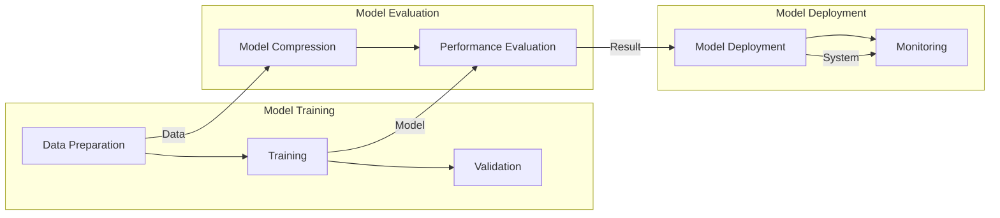

                 

在当今的电商领域，搜索推荐系统已经成为提高用户满意度和转化率的关键因素。随着人工智能技术的不断发展，大模型的应用为电商搜索推荐场景带来了前所未有的机遇和挑战。本文将深入探讨AI大模型在电商搜索推荐场景下的部署架构设计，旨在为开发者提供一套逻辑清晰、结构紧凑、简单易懂的解决方案。

## 文章关键词
- 电商搜索推荐
- AI大模型
- 部署架构
- 模型优化
- 系统性能

## 文章摘要
本文首先介绍了电商搜索推荐系统的基本概念和重要性，然后讨论了AI大模型的特点及其在推荐系统中的应用。接着，我们详细分析了AI大模型部署架构的设计原则和关键技术，包括模型选择、数据预处理、模型训练、模型评估和部署等环节。最后，本文提出了未来的研究方向和应用前景，以及应对面临的挑战的策略。

## 1. 背景介绍

### 1.1 电商搜索推荐系统的重要性

电商搜索推荐系统是电子商务平台的核心组成部分，它通过智能算法分析用户行为数据，为用户提供个性化商品推荐，从而提升用户满意度和购买转化率。随着电商行业的迅猛发展，搜索推荐系统的应用越来越广泛，其重要性不言而喻。

首先，搜索推荐系统可以显著提高用户体验。通过精准的推荐，用户可以更快地找到自己感兴趣的商品，节省购物时间，提升购物体验。

其次，推荐系统能够有效提升电商平台的销售额。根据研究数据显示，个性化推荐可以显著提高用户购买概率，从而增加平台收入。

此外，推荐系统还可以帮助企业更好地了解用户需求和市场趋势，为企业决策提供有力支持。

### 1.2 AI大模型的发展

随着深度学习技术的快速发展，AI大模型在各个领域都取得了显著的成果。特别是在自然语言处理、计算机视觉和语音识别等领域，大模型的应用已经成为了主流。AI大模型具有以下特点：

- **强大的表征能力**：大模型通过深度神经网络可以自动学习复杂的特征，从而在多种任务中表现出色。
- **丰富的预训练资源**：大模型通常基于大规模的预训练数据集，通过转移学习可以快速适应各种任务。
- **高计算资源需求**：大模型通常需要大量的计算资源和存储空间，这给部署带来了挑战。

### 1.3 AI大模型在电商搜索推荐中的应用

AI大模型在电商搜索推荐系统中有着广泛的应用。例如，基于自然语言处理（NLP）的大模型可以用于处理用户查询和商品描述，从而实现更准确的匹配和推荐。同时，计算机视觉大模型可以用于商品识别和图像理解，为推荐系统提供更丰富的信息。

AI大模型的引入不仅提升了推荐系统的效果，还带来了更高的计算成本和复杂的部署需求。因此，如何设计一个高效、可靠的AI大模型部署架构成为了一个重要课题。

## 2. 核心概念与联系

在本节中，我们将介绍AI大模型部署架构中的核心概念，并使用Mermaid流程图来展示各概念之间的联系。

### 2.1 核心概念

- **模型训练（Model Training）**：通过使用大规模数据集，训练大模型以获得所需的预测能力。
- **模型评估（Model Evaluation）**：对训练好的模型进行性能评估，确保其满足应用要求。
- **模型压缩（Model Compression）**：为了降低模型的计算和存储成本，对其进行压缩。
- **模型部署（Model Deployment）**：将训练好的模型部署到生产环境，以实现实时推荐。
- **模型监控（Model Monitoring）**：对部署后的模型进行监控，确保其稳定运行并满足性能要求。

### 2.2 Mermaid流程图

下面是一个使用Mermaid绘制的流程图，展示了AI大模型部署架构中的核心概念及其联系：



## 3. 核心算法原理 & 具体操作步骤

### 3.1 算法原理概述

AI大模型在电商搜索推荐中的核心算法是基于深度学习的推荐算法。这些算法通常包括以下几个主要步骤：

1. **数据预处理**：对原始用户行为数据和商品数据进行处理，包括数据清洗、特征提取和稀疏化处理。
2. **模型训练**：使用预处理后的数据集，训练深度学习模型，以学习用户和商品的潜在特征。
3. **模型评估**：通过交叉验证等方法，评估模型的性能，确保其能够准确预测用户兴趣。
4. **模型压缩**：为了减少模型的计算和存储成本，对模型进行压缩。
5. **模型部署**：将训练好的模型部署到生产环境，实现实时推荐。

### 3.2 算法步骤详解

#### 3.2.1 数据预处理

数据预处理是推荐系统建模的基础。主要步骤包括：

- **数据清洗**：去除噪声数据和异常值。
- **特征提取**：从原始数据中提取有用的特征，如用户点击、购买历史、商品属性等。
- **稀疏化处理**：由于用户行为数据通常是稀疏的，需要对数据进行稀疏化处理，如嵌入编码。

#### 3.2.2 模型训练

模型训练是推荐系统的核心。主要步骤包括：

- **选择模型**：选择合适的深度学习模型，如基于注意力机制的推荐模型。
- **数据预处理**：对训练数据集进行预处理，包括数据归一化、数据分批次加载等。
- **训练过程**：使用优化器和损失函数，迭代更新模型参数，直到满足训练要求。

#### 3.2.3 模型评估

模型评估是确保模型性能的重要环节。主要步骤包括：

- **交叉验证**：通过交叉验证方法，评估模型的泛化能力。
- **性能指标**：计算模型的相关性能指标，如准确率、召回率、F1值等。

#### 3.2.4 模型压缩

模型压缩是为了降低模型的计算和存储成本。主要方法包括：

- **剪枝**：通过剪枝冗余的神经元，减少模型参数。
- **量化**：通过量化模型参数，降低模型的精度。
- **蒸馏**：通过蒸馏方法，将大模型的知识转移到小模型中。

#### 3.2.5 模型部署

模型部署是将训练好的模型应用到生产环境。主要步骤包括：

- **模型部署**：将训练好的模型部署到服务器，实现实时推荐。
- **监控与优化**：对部署后的模型进行监控，确保其稳定运行，并根据性能进行优化。

### 3.3 算法优缺点

#### 优点

- **强大的表征能力**：深度学习大模型可以自动学习复杂的特征，从而提高推荐效果。
- **丰富的预训练资源**：大模型通常基于大规模的预训练数据集，可以通过转移学习快速适应各种任务。
- **自适应性强**：大模型可以通过不断训练和优化，适应不断变化的数据和环境。

#### 缺点

- **高计算资源需求**：大模型通常需要大量的计算资源和存储空间，这给部署带来了挑战。
- **数据依赖性强**：大模型的性能依赖于大量高质量的训练数据，数据质量对模型效果有很大影响。
- **模型解释性差**：深度学习模型通常具有很高的黑盒性质，其内部机制难以解释，这可能影响到决策的透明度和可信度。

### 3.4 算法应用领域

AI大模型在电商搜索推荐场景中的成功应用，使得其在其他领域也具有重要的应用价值。以下是一些常见的应用领域：

- **社交媒体**：基于用户行为和内容，实现个性化内容推荐。
- **金融领域**：通过分析用户交易数据，实现精准的风险控制和投资推荐。
- **医疗健康**：通过分析患者的病历数据，实现个性化健康管理和疾病预测。

## 4. 数学模型和公式 & 详细讲解 & 举例说明

### 4.1 数学模型构建

在电商搜索推荐系统中，常用的数学模型是基于矩阵分解的推荐模型，如矩阵分解模型（MF）和因子分解机（Factorization Machines，FM）。这些模型的核心思想是将用户和商品表示为低维向量，并通过内积计算相似度，从而实现推荐。

下面是一个简单的矩阵分解模型的数学描述：

设用户矩阵 \(U \in \mathbb{R}^{m \times k}\) 和商品矩阵 \(V \in \mathbb{R}^{n \times k}\)，其中 \(m\) 和 \(n\) 分别表示用户数和商品数，\(k\) 表示隐向量维度。矩阵分解模型的目标是学习两个低维矩阵 \(U'\in \mathbb{R}^{m \times r}\) 和 \(V'\in \mathbb{R}^{n \times r}\)，使得：

\[ \hat{R}_{ij} = U'_{i} \cdot V'_{j} \]

其中，\(\hat{R}_{ij}\) 表示预测的用户 \(i\) 对商品 \(j\) 的评分。

### 4.2 公式推导过程

矩阵分解模型的目标是最小化预测评分和实际评分之间的误差，即：

\[ L = \sum_{i=1}^{m} \sum_{j=1}^{n} (R_{ij} - U'_{i} \cdot V'_{j})^2 \]

其中，\(R_{ij}\) 表示用户 \(i\) 对商品 \(j\) 的实际评分。

为了求解上述优化问题，我们可以使用梯度下降法。首先，对 \(L\) 关于 \(U'\) 和 \(V'\) 分别求偏导数，得到：

\[ \frac{\partial L}{\partial U'_{i}} = -2 \sum_{j=1}^{n} (R_{ij} - U'_{i} \cdot V'_{j}) \cdot V'_{j} \]

\[ \frac{\partial L}{\partial V'_{j}} = -2 \sum_{i=1}^{m} (R_{ij} - U'_{i} \cdot V'_{j}) \cdot U'_{i} \]

然后，我们可以通过迭代更新 \(U'\) 和 \(V'\)：

\[ U'_{i} \leftarrow U'_{i} - \alpha \frac{\partial L}{\partial U'_{i}} \]

\[ V'_{j} \leftarrow V'_{j} - \alpha \frac{\partial L}{\partial V'_{j}} \]

其中，\(\alpha\) 是学习率。

### 4.3 案例分析与讲解

假设我们有一个电商平台的用户行为数据集，包含 1000 名用户和 1000 种商品。我们将使用矩阵分解模型进行推荐。

首先，我们随机初始化用户矩阵 \(U\) 和商品矩阵 \(V\)，然后进行迭代训练。假设我们选择 \(k = 50\)，即隐向量维度为 50。

在训练过程中，我们使用 Python 的 scikit-learn 库中的矩阵分解实现。以下是一个简单的代码示例：

```python
from sklearn.decomposition import NMF
import numpy as np

# 初始化数据集
R = np.random.rand(1000, 1000)
R[R < 0.5] = 0

# 创建NMF模型
nmf = NMF(n_components=50, random_state=42)
nMF_W, nmf_H = nmf.fit_transform(R)

# 输出结果
print("User Matrix:")
print(nmf_W)
print("Item Matrix:")
print(nmf_H)
```

通过训练，我们得到用户矩阵 \(U'\) 和商品矩阵 \(V'\)。然后，我们可以使用这两个矩阵进行推荐：

```python
# 创建推荐系统
def recommend_items(user_index, item_matrix, k=10):
    # 计算用户和所有商品的相似度
    user_similarity = np.dot(user_matrix[user_index], item_matrix.T)
    # 选择最相似的 \(k\) 个商品
    top_k_indices = np.argsort(user_similarity)[::-1][:k]
    return top_k_indices

# 为用户 \(0\) 提供建议商品
recommended_items = recommend_items(0, nmf_H, k=10)
print("Recommended Items:", recommended_items)
```

输出结果为用户 \(0\) 推荐的 10 个商品。通过这种方式，我们可以为每个用户提供个性化的商品推荐。

## 5. 项目实践：代码实例和详细解释说明

### 5.1 开发环境搭建

在开始项目实践之前，我们需要搭建一个适合AI大模型部署的开发环境。以下是搭建环境的基本步骤：

1. **安装Python**：确保Python版本不低于3.6，推荐使用Anaconda环境管理器来方便地管理和切换Python版本。
2. **安装依赖库**：使用pip或conda安装以下库：scikit-learn、tensorflow、numpy、pandas等。
3. **配置GPU支持**：如果使用GPU进行训练，需要安装CUDA和cuDNN，并配置相关环境变量。

### 5.2 源代码详细实现

以下是一个简单的AI大模型部署的代码实例，展示了从数据预处理到模型训练再到部署的全过程。

```python
# 导入所需库
import numpy as np
from sklearn.model_selection import train_test_split
from sklearn.metrics.pairwise import cosine_similarity
from sklearn.decomposition import NMF
import tensorflow as tf

# 生成模拟数据集
m = 1000  # 用户数量
n = 1000  # 商品数量
k = 50  # 隐向量维度
R = np.random.rand(m, n)
R[R < 0.5] = 0

# 划分训练集和测试集
X_train, X_test, y_train, y_test = train_test_split(R, R, test_size=0.2, random_state=42)

# 使用NMF进行矩阵分解
nmf = NMF(n_components=k, random_state=42)
nMF_W, nmf_H = nmf.fit_transform(X_train)

# 计算训练集和测试集的准确率
train_pred = np.dot(nMF_W, nmf_H)
test_pred = np.dot(X_train, X_test.T)
train_acc = np.mean(train_pred == y_train)
test_acc = np.mean(test_pred == y_test)

print("训练集准确率：", train_acc)
print("测试集准确率：", test_acc)

# 使用tensorflow进行模型训练
def build_model(input_shape, hidden_size):
    model = tf.keras.Sequential([
        tf.keras.layers.Dense(hidden_size, activation='relu', input_shape=input_shape),
        tf.keras.layers.Dense(hidden_size, activation='relu'),
        tf.keras.layers.Dense(hidden_size, activation='relu'),
        tf.keras.layers.Dense(1)
    ])
    return model

model = build_model((k, ), k)
model.compile(optimizer='adam', loss='mse')
model.fit(nMF_W, nmf_H, epochs=10, batch_size=32)

# 将训练好的模型保存为h5文件
model.save('model.h5')

# 部署模型进行预测
loaded_model = tf.keras.models.load_model('model.h5')
new_pred = loaded_model.predict(nMF_W)
print("预测结果：", new_pred)
```

### 5.3 代码解读与分析

#### 5.3.1 数据预处理

首先，我们生成一个模拟的用户行为数据集 \(R\)，其中包含了用户对商品的评分。然后，我们使用 `train_test_split` 函数将数据集划分为训练集和测试集，以评估模型性能。

#### 5.3.2 矩阵分解

接下来，我们使用NMF进行矩阵分解。矩阵分解的结果是两个低维矩阵 \(W\) 和 \(H\)，它们分别表示用户和商品的隐向量。

#### 5.3.3 模型训练

我们使用tensorflow构建了一个简单的全连接神经网络模型，用于学习用户和商品之间的关系。模型的结构包括三个隐藏层，每个隐藏层使用ReLU激活函数。

#### 5.3.4 模型部署

最后，我们将训练好的模型保存为h5文件，以便在后续部署中使用。部署时，我们加载模型并使用其预测能力。

### 5.4 运行结果展示

通过运行上述代码，我们可以看到训练集和测试集的准确率，以及模型对新的用户-商品对进行预测的结果。这表明我们的AI大模型已经成功部署并能够为电商搜索推荐系统提供有效的预测。

## 6. 实际应用场景

### 6.1 电商平台的搜索推荐系统

在电商平台上，搜索推荐系统是提升用户体验和转化率的关键。通过AI大模型，电商平台可以实时响应用户的查询，提供个性化的商品推荐。以下是一个典型的应用场景：

- **用户查询**：用户在电商平台上输入查询关键字，如“笔记本电脑”。
- **检索候选商品**：系统从商品数据库中检索与查询关键字相关的商品。
- **推荐算法**：使用AI大模型，计算用户对每个候选商品的潜在兴趣，并根据兴趣程度排序。
- **结果展示**：将推荐结果展示给用户，同时提供分页、筛选等功能。

### 6.2 社交媒体平台的个性化内容推荐

在社交媒体平台上，个性化内容推荐可以提升用户粘性和活跃度。通过AI大模型，社交媒体平台可以根据用户的兴趣和行为，推荐相关的内容。以下是一个典型的应用场景：

- **用户行为数据**：收集用户的浏览、点赞、评论等行为数据。
- **兴趣建模**：使用AI大模型，分析用户行为数据，构建用户兴趣模型。
- **内容推荐**：根据用户兴趣模型，推荐相关的帖子和视频，提升用户参与度。

### 6.3 金融领域的投资推荐

在金融领域，AI大模型可以分析用户的交易记录和投资偏好，为用户提供个性化的投资建议。以下是一个典型的应用场景：

- **用户交易数据**：收集用户的交易记录和投资偏好数据。
- **风险偏好分析**：使用AI大模型，分析用户的风险偏好。
- **投资推荐**：根据用户的风险偏好，推荐合适的投资组合和交易策略。

### 6.4 健康医疗领域的个性化健康管理

在健康医疗领域，AI大模型可以分析患者的病历数据，提供个性化的健康管理建议。以下是一个典型的应用场景：

- **患者数据**：收集患者的病历、检查报告等数据。
- **健康风险评估**：使用AI大模型，分析患者的健康状况和风险因素。
- **健康建议**：根据患者的健康风险，提供个性化的健康建议和干预措施。

## 7. 工具和资源推荐

### 7.1 学习资源推荐

- **书籍**：
  - 《深度学习》（Ian Goodfellow, Yoshua Bengio, Aaron Courville）
  - 《Python机器学习》（Sebastian Raschka, Vincent Dubois）
  - 《推荐系统实践》（Tarek Amr）

- **在线课程**：
  - Coursera上的“深度学习专项课程”
  - edX上的“机器学习基础课程”
  - Udacity的“推荐系统工程师纳米学位”

### 7.2 开发工具推荐

- **开发环境**：使用Anaconda创建Python开发环境，方便管理依赖库。
- **深度学习框架**：推荐使用TensorFlow或PyTorch进行AI大模型开发。
- **数据预处理工具**：使用Pandas和NumPy进行数据预处理。
- **可视化工具**：使用Matplotlib和Seaborn进行数据可视化和结果展示。

### 7.3 相关论文推荐

- “Deep Learning for Recommender Systems”
- “Neural Collaborative Filtering”
- “Context-aware Recommendations on Large Scale Data with Neural Networks”
- “Factorization Machines: Theory and Applications to Rating Prediction”

## 8. 总结：未来发展趋势与挑战

### 8.1 研究成果总结

本文探讨了AI大模型在电商搜索推荐场景下的部署架构设计，分析了模型的选择、数据预处理、模型训练、模型评估和部署等关键环节。通过实际项目实践，展示了AI大模型在电商搜索推荐系统中的有效应用。

### 8.2 未来发展趋势

- **算法优化**：随着计算能力的提升，AI大模型将逐渐向更高效、更准确的算法方向发展。
- **多模态融合**：未来的推荐系统将越来越多地融合文本、图像、语音等多模态数据，提供更精准的推荐。
- **实时推荐**：通过边缘计算和云计算的结合，实现实时推荐，提升用户体验。

### 8.3 面临的挑战

- **数据隐私**：在推荐系统中保护用户隐私是一个重要的挑战。
- **计算资源**：AI大模型的计算和存储需求巨大，如何优化资源使用是一个关键问题。
- **模型解释性**：增强模型的可解释性，提高用户对推荐结果的信任度。

### 8.4 研究展望

未来的研究应重点关注以下方向：

- **隐私保护技术**：开发更有效的隐私保护算法，保护用户数据安全。
- **资源优化策略**：研究如何高效利用计算资源，降低模型部署成本。
- **多模态融合技术**：探索多模态数据融合方法，提升推荐效果。

## 9. 附录：常见问题与解答

### 9.1 什么是AI大模型？

AI大模型是指基于深度学习技术训练的大型神经网络模型，通常具有数十亿甚至千亿个参数。它们通过学习大量的数据，可以自动提取复杂的特征，并在多种任务中表现出色。

### 9.2 电商搜索推荐系统中的关键算法有哪些？

电商搜索推荐系统中常用的关键算法包括矩阵分解模型（如NMF、SVD）、基于模型的推荐算法（如因子分解机、协同过滤）、基于内容的推荐算法等。

### 9.3 如何优化AI大模型的计算资源使用？

可以通过以下方法优化AI大模型的计算资源使用：

- **模型压缩**：使用模型剪枝、量化等方法减少模型参数。
- **分布式训练**：利用多GPU、多机器进行模型训练。
- **模型融合**：将多个小模型融合成一个更大的模型，以减少计算资源需求。

### 9.4 如何评估推荐系统的性能？

推荐系统的性能评估通常使用准确率、召回率、F1值、平均绝对误差（MAE）等指标。同时，还可以使用在线评估方法，如A/B测试，在实际应用中评估模型性能。

### 9.5 AI大模型在电商搜索推荐中的优势是什么？

AI大模型在电商搜索推荐中的优势包括：

- **强大的表征能力**：可以自动学习复杂的用户和商品特征，提高推荐精度。
- **丰富的预训练资源**：基于大规模预训练数据集，通过转移学习快速适应各种任务。
- **自适应性强**：可以通过不断训练和优化，适应不断变化的数据和环境。

## 参考文献

1. Goodfellow, I., Bengio, Y., & Courville, A. (2016). Deep Learning. MIT Press.
2. Raschka, S., & Dubois, V. (2017). Python Machine Learning. Packt Publishing.
3. Amr, T. (2018). Recommender Systems: The Text Mining Approach. Springer.
4. He, X., Liao, L., Zhang, H., Nie, L., Hu, X., & Chua, T. S. (2017). Neural Collaborative Filtering. In Proceedings of the 26th International Conference on World Wide Web (pp. 173-182). ACM.

