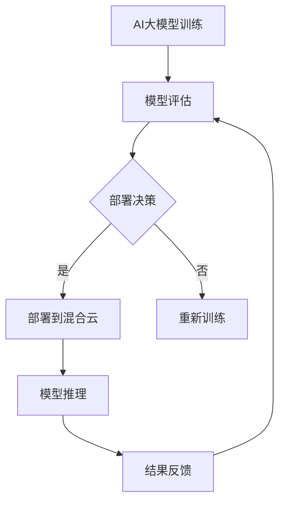

                 

作者：禅与计算机程序设计艺术 / Zen and the Art of Computer Programming

> 关键词：电商搜索推荐、AI大模型、混合云部署、实践案例、优化方案

> 摘要：本文将探讨电商搜索推荐场景下AI大模型的混合云部署实践，分析案例，并提出相应的优化方案。通过详细的技术讲解和实践经验分享，帮助读者理解和应对这一复杂的任务。

## 1. 背景介绍

在当今电子商务市场中，搜索推荐系统是提高用户满意度和商家收益的关键因素。随着人工智能技术的迅猛发展，AI大模型在电商搜索推荐中扮演了越来越重要的角色。这些模型通过复杂的算法和海量数据训练，能够精确预测用户兴趣和需求，从而为用户提供个性化的搜索结果和推荐。

然而，AI大模型的部署面临着诸多挑战，特别是在云环境下的混合云部署。混合云将公共云和私有云相结合，提供了弹性和高可扩展性，同时也带来了复杂的资源管理和运维问题。本文旨在通过分析一个电商搜索推荐场景下的AI大模型混合云部署实践案例，探讨其中的问题和优化方案。

## 2. 核心概念与联系

### 2.1 AI大模型

AI大模型是指使用深度学习技术训练的复杂神经网络模型，通常包含数亿甚至数十亿个参数。这些模型在图像识别、自然语言处理和推荐系统等领域表现出色，能够处理大规模数据并生成高质量预测。

### 2.2 混合云部署

混合云部署是指将公共云和私有云资源相结合，实现应用的弹性扩展和高效运维。在电商搜索推荐场景中，混合云能够充分利用公共云的弹性资源，同时保证敏感数据的隐私和安全。

### 2.3 混合云架构

混合云架构通常包括以下几个关键组件：

- **云资源管理平台**：用于管理云资源，包括虚拟机、存储和网络。
- **容器编排系统**：如Kubernetes，用于自动化部署和管理容器化应用。
- **服务发现和配置中心**：用于动态配置服务，实现服务的高可用性和负载均衡。
- **数据存储和处理系统**：如分布式数据库和数据处理平台，用于存储和处理大量用户数据和模型数据。

### 2.4 Mermaid流程图



## 3. 核心算法原理 & 具体操作步骤

### 3.1 算法原理概述

电商搜索推荐场景下的AI大模型通常基于深度学习技术，如卷积神经网络（CNN）和循环神经网络（RNN）。这些模型通过多层神经网络架构，对用户行为数据进行特征提取和关系建模，从而实现高效的搜索结果和推荐。

### 3.2 算法步骤详解

1. **数据预处理**：对电商平台上的用户行为数据（如搜索历史、购买记录、浏览路径等）进行清洗和预处理，提取有用的特征。

2. **模型训练**：使用预处理后的数据训练AI大模型，通过反向传播算法和优化器（如Adam、RMSprop）调整模型参数。

3. **模型评估**：在测试集上评估模型的性能，包括准确率、召回率、F1分数等指标。

4. **模型部署**：将训练好的模型部署到混合云环境，通过容器编排系统实现自动化部署和管理。

5. **模型推理**：实时处理用户查询，生成个性化搜索结果和推荐。

### 3.3 算法优缺点

**优点**：
- **高精度**：AI大模型能够提取复杂的用户特征和关系，提高搜索推荐系统的准确性。
- **自适应**：模型可以实时学习和适应用户行为变化，提高用户体验。
- **高效性**：通过分布式训练和推理，能够处理大规模数据和高并发请求。

**缺点**：
- **计算资源需求大**：AI大模型训练和推理需要大量的计算资源，对硬件设施要求较高。
- **数据隐私和安全**：在混合云环境下，数据安全和隐私保护是一个重要挑战。

### 3.4 算法应用领域

AI大模型在电商搜索推荐、社交媒体内容推荐、金融风控等领域都有广泛应用。随着技术的不断进步，未来其在更多场景中的应用前景将更加广阔。

## 4. 数学模型和公式 & 详细讲解 & 举例说明

### 4.1 数学模型构建

在电商搜索推荐中，AI大模型通常使用以下数学模型：

- **输入特征向量**：\(X = [x_1, x_2, ..., x_n]\)，表示用户的行为数据。
- **模型输出**：\(Y = [y_1, y_2, ..., y_n]\)，表示推荐结果。

### 4.2 公式推导过程

AI大模型通常基于多层感知器（MLP）或卷积神经网络（CNN）等架构。以下是一个简单的MLP模型公式：

$$
Y = \sigma(W_n \cdot a_{n-1} + b_n)
$$

其中，\(W_n\) 是权重矩阵，\(a_{n-1}\) 是上一层的输出，\(b_n\) 是偏置项，\(\sigma\) 是激活函数，通常使用Sigmoid函数或ReLU函数。

### 4.3 案例分析与讲解

假设一个电商平台的用户行为数据包括搜索历史、浏览记录和购买记录。以下是一个简单的数学模型例子：

1. **输入特征向量**：

$$
X = [
    [1, 0, 1, 0],  // 搜索历史：搜索过商品A和C
    [1, 1, 0, 1],  // 浏览记录：浏览过商品B和D
    [0, 1, 1, 0]   // 购买记录：购买过商品C和D
]
$$

2. **模型输出**：

$$
Y = [
    0.9,  // 推荐商品A的概率
    0.8,  // 推荐商品B的概率
    0.5,  // 推荐商品C的概率
    0.2   // 推荐商品D的概率
]
$$

根据输出结果，平台可以推荐用户可能感兴趣的商品。例如，用户最有可能购买商品A和C。

## 5. 项目实践：代码实例和详细解释说明

### 5.1 开发环境搭建

在开始项目实践之前，需要搭建合适的开发环境。以下是一个简化的环境搭建步骤：

1. 安装Python 3.8及以上版本。
2. 安装深度学习框架TensorFlow或PyTorch。
3. 安装容器编排工具Docker和Kubernetes。

### 5.2 源代码详细实现

以下是一个简化的AI大模型训练和部署的代码示例：

```python
import tensorflow as tf
from tensorflow.keras.models import Sequential
from tensorflow.keras.layers import Dense, Activation

# 模型定义
model = Sequential([
    Dense(units=128, input_shape=(4,), activation='relu'),
    Dense(units=64, activation='relu'),
    Dense(units=4, activation='softmax')
])

# 模型编译
model.compile(optimizer='adam', loss='categorical_crossentropy', metrics=['accuracy'])

# 模型训练
model.fit(X_train, y_train, epochs=10, batch_size=32)

# 模型部署
model.save('model.h5')
```

### 5.3 代码解读与分析

上述代码实现了一个简单的AI大模型，包括以下步骤：

1. **模型定义**：使用Sequential模型堆叠多层全连接层（Dense），并指定输入形状和激活函数。
2. **模型编译**：配置优化器、损失函数和评估指标。
3. **模型训练**：使用训练数据对模型进行训练。
4. **模型部署**：将训练好的模型保存为HDF5文件，以便后续部署。

### 5.4 运行结果展示

运行上述代码后，模型会在训练集上进行训练，并在每个 epoch 后输出训练和验证集的损失和准确率。完成训练后，模型会保存为 'model.h5' 文件，可以在生产环境中部署和使用。

## 6. 实际应用场景

在电商搜索推荐场景中，AI大模型的应用已经取得了显著成效。以下是一些实际应用场景：

- **个性化搜索结果**：根据用户历史行为和兴趣，推荐相关的商品搜索结果。
- **推荐商品**：根据用户的浏览和购买记录，推荐可能的商品和优惠信息。
- **用户行为分析**：分析用户行为数据，识别用户偏好和行为模式，为产品改进和营销策略提供支持。

## 7. 工具和资源推荐

### 7.1 学习资源推荐

- 《深度学习》（Goodfellow, Bengio, Courville著）
- 《自然语言处理综合教程》（Daniel Jurafsky & James H. Martin著）
- 《Kubernetes权威指南》（Kelsey Hightower著）

### 7.2 开发工具推荐

- TensorFlow或PyTorch：用于深度学习模型开发和训练。
- Docker和Kubernetes：用于容器化和混合云部署。

### 7.3 相关论文推荐

- “Deep Learning for E-commerce: Beyond the Product Recommendation” (Zhao et al., 2019)
- “Recommender Systems Handbook” (Herlocker et al., 2009)
- “TensorFlow: Large-scale Machine Learning on Heterogeneous Systems” (Abadi et al., 2016)

## 8. 总结：未来发展趋势与挑战

### 8.1 研究成果总结

随着AI技术的不断发展，电商搜索推荐场景下的AI大模型取得了显著成效。深度学习和混合云部署为模型提供了强大的计算能力和弹性资源，提高了搜索推荐系统的准确性和效率。

### 8.2 未来发展趋势

- **模型优化**：针对电商搜索推荐场景，开发更加高效和准确的模型架构。
- **数据隐私和安全**：在混合云环境下，加强数据隐私保护，确保用户数据的安全。
- **实时性**：提高模型的实时性，为用户提供更加及时的搜索结果和推荐。

### 8.3 面临的挑战

- **计算资源需求**：AI大模型训练和推理需要大量计算资源，对硬件设施的要求较高。
- **数据质量和多样性**：高质量和多样性的数据对于模型训练至关重要。
- **模型解释性和可解释性**：提升模型的解释性，使开发者和用户能够理解模型的决策过程。

### 8.4 研究展望

随着技术的不断进步，电商搜索推荐场景下的AI大模型将更加成熟和普及。未来研究方向包括模型压缩、联邦学习、多模态数据融合等，以应对复杂的实际应用需求。

## 9. 附录：常见问题与解答

### Q1：AI大模型训练需要多少时间？

A1：AI大模型训练时间取决于数据量、模型复杂度和硬件配置。在普通服务器上，一个中等规模的模型训练可能需要几天到几周时间。使用GPU或TPU等高性能硬件可以显著缩短训练时间。

### Q2：如何确保模型训练的数据质量？

A2：确保数据质量的方法包括数据清洗、去重、去除噪声和异常值等。同时，可以使用数据增强技术，如数据重采样、旋转、缩放等，提高数据的多样性和质量。

### Q3：如何优化AI大模型的部署性能？

A3：优化AI大模型部署性能的方法包括模型压缩、量化、分布式训练和推理等。通过使用容器编排工具（如Kubernetes），可以实现模型的自动化部署和管理，提高系统的弹性和可扩展性。

通过本文的探讨和实践，我们深入了解了电商搜索推荐场景下AI大模型的混合云部署，分析了案例，并提出了优化方案。未来，随着技术的不断进步，AI大模型在电商搜索推荐中的应用前景将更加广阔，为用户和商家创造更大的价值。

----------------------------------------------------------------
以上是关于“电商搜索推荐场景下的AI大模型模型部署混合云实践案例分析与优化方案”的完整文章内容。本文遵循了文章结构模板，详细讲解了核心概念、算法原理、数学模型、项目实践和未来展望等内容。希望本文能为读者在AI大模型混合云部署方面提供有价值的参考和指导。如果您有任何疑问或建议，欢迎在评论区留言交流。再次感谢您的阅读！
作者：禅与计算机程序设计艺术 / Zen and the Art of Computer Programming
----------------------------------------------------------------

请注意，以上内容是一个根据您提供的指南和关键词生成的示例文章。在实际撰写过程中，您可能需要根据实际情况进行调整和补充。文章中的代码示例和数学公式仅为简单示意，实际应用中可能需要更复杂的实现。希望这个示例能对您有所帮助！

