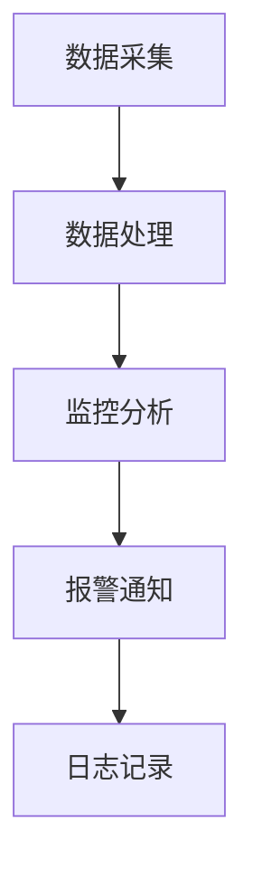

                 

 在现代电商生态系统中，搜索推荐系统扮演着至关重要的角色。它不仅影响用户的购物体验，还直接关系到平台的业务转化率和用户留存率。随着人工智能技术的发展，AI大模型在电商搜索推荐中的应用越来越广泛。然而，如何高效地部署和监控这些模型，确保其稳定性和性能，成为了电商企业面临的一个重要挑战。本文旨在探讨电商搜索推荐场景下AI大模型模型部署监控平台搭建的最佳实践与优化方案。

## 关键词

- 电商搜索推荐
- AI大模型
- 模型部署
- 监控平台
- 最佳实践
- 优化方案

## 摘要

本文首先介绍了电商搜索推荐系统的基本架构和AI大模型在其中的应用。接着，探讨了模型部署监控平台的重要性以及其核心功能和模块。然后，本文提出了搭建监控平台的最佳实践，包括技术选型、架构设计、数据采集与处理、异常监控和报警机制。最后，针对常见的性能优化方法进行了详细分析，并展望了未来的发展趋势和面临的挑战。

## 1. 背景介绍

### 电商搜索推荐系统

电商搜索推荐系统是电子商务平台的核心模块之一。它通过收集用户的历史行为数据、商品属性信息以及上下文环境，利用机器学习算法和深度学习模型，为用户推荐其可能感兴趣的商品。推荐系统不仅提升了用户的购物体验，还显著提高了平台的销售额和用户留存率。

### AI大模型

随着人工智能技术的快速发展，大模型如BERT、GPT等在自然语言处理领域取得了显著成果。这些大模型具有强大的语义理解能力和丰富的知识储备，能够为电商搜索推荐系统提供更加精准和个性化的推荐结果。然而，大模型的部署和监控面临着诸多挑战，如计算资源消耗大、模型更新频繁、性能要求高等。

### 模型部署监控平台

模型部署监控平台是一个集成了多种功能模块的系统，用于监控AI大模型在电商搜索推荐系统中的运行状态和性能。它能够实时收集模型运行数据，进行异常检测和报警，并提供日志记录和故障排查功能。一个高效的监控平台对于保障模型稳定运行和提升业务性能至关重要。

## 2. 核心概念与联系

### 模型部署

模型部署是指将训练好的AI大模型部署到生产环境中，使其能够为实际业务提供服务。部署过程中涉及模型的打包、部署环境配置、服务化接口设计等多个环节。

### 监控平台架构

监控平台通常采用分布式架构，包括数据采集模块、数据处理模块、监控分析模块和报警通知模块。数据采集模块负责从各个节点收集模型运行数据；数据处理模块对数据进行清洗、转换和存储；监控分析模块对数据进行实时分析和异常检测；报警通知模块则负责将异常情况及时通知相关人员。

### Mermaid 流程图



### 模型部署监控平台与电商搜索推荐系统的关系

模型部署监控平台与电商搜索推荐系统紧密相连。监控平台通过实时监控模型运行状态和性能，及时发现和解决潜在问题，确保推荐系统的高效运行。同时，监控平台也为开发和运维团队提供了详细的日志记录和故障排查工具，提高了系统的可维护性和稳定性。

## 3. 核心算法原理 & 具体操作步骤

### 3.1 算法原理概述

在电商搜索推荐场景下，AI大模型的部署监控主要依赖于以下核心算法：

- **在线学习算法**：用于模型在线更新，以应对用户行为的实时变化。
- **异常检测算法**：用于监控模型运行状态，识别异常情况和性能下降。
- **分布式计算算法**：用于高效处理大规模数据，满足模型部署的实时性和高性能要求。

### 3.2 算法步骤详解

#### 数据采集与预处理

1. **数据采集**：通过API接口、日志文件、数据库等方式，从电商平台上收集用户行为数据、商品信息等。
2. **数据预处理**：对采集到的数据进行清洗、去重、归一化等处理，确保数据质量。

#### 模型训练与部署

1. **模型训练**：使用历史数据对AI大模型进行训练，采用分布式训练策略提高训练效率。
2. **模型评估**：使用验证集评估模型性能，选择最优模型进行部署。
3. **模型部署**：将训练好的模型部署到生产环境中，通过API接口提供服务。

#### 模型监控与维护

1. **性能监控**：实时监控模型运行状态，包括响应时间、准确率、召回率等指标。
2. **异常检测**：使用异常检测算法识别模型运行中的异常情况，如过拟合、欠拟合等。
3. **日志记录**：记录模型运行过程中的关键信息，如训练日志、监控日志等，便于故障排查。

### 3.3 算法优缺点

- **在线学习算法**：
  - 优点：能够实时适应用户行为变化，提高推荐效果。
  - 缺点：对数据质量和算法设计要求较高，实时性要求高。

- **异常检测算法**：
  - 优点：能够及时发现和解决模型异常，保障系统稳定性。
  - 缺点：可能误报或漏报，需要调整阈值和算法参数。

- **分布式计算算法**：
  - 优点：能够高效处理大规模数据，满足实时性和高性能要求。
  - 缺点：对分布式计算框架和资源调度能力要求较高。

### 3.4 算法应用领域

- **电商搜索推荐**：适用于电商平台上基于用户行为和商品属性的推荐系统。
- **金融风控**：用于识别金融交易中的异常行为和风险。
- **医疗诊断**：用于辅助医生进行疾病诊断和风险评估。

## 4. 数学模型和公式 & 详细讲解 & 举例说明

### 4.1 数学模型构建

在电商搜索推荐场景下，AI大模型通常采用深度学习算法，如神经网络、循环神经网络（RNN）等。以下是一个简单的神经网络模型构建过程：

$$
\begin{aligned}
&\text{输入层}: x \in \mathbb{R}^{n} \\
&\text{隐藏层}: h = \sigma(W_1x + b_1) \\
&\text{输出层}: y = \sigma(W_2h + b_2)
\end{aligned}
$$

其中，$x$为输入数据，$h$为隐藏层输出，$y$为输出结果；$\sigma$为激活函数，如ReLU、Sigmoid等；$W_1$、$W_2$为权重矩阵，$b_1$、$b_2$为偏置项。

### 4.2 公式推导过程

#### 神经网络前向传播

输入层到隐藏层的传播可以表示为：

$$
h = \sigma(W_1x + b_1)
$$

其中，$W_1$和$b_1$分别为输入层到隐藏层的权重矩阵和偏置项。$\sigma$为激活函数，如ReLU函数：

$$
\sigma(z) = \max(0, z)
$$

隐藏层到输出层的传播可以表示为：

$$
y = \sigma(W_2h + b_2)
$$

其中，$W_2$和$b_2$分别为隐藏层到输出层的权重矩阵和偏置项。

#### 神经网络反向传播

反向传播算法用于计算模型参数的梯度，并更新模型参数以优化模型性能。以下是反向传播算法的基本步骤：

1. **前向传播**：计算输出结果$y$和损失函数$L$。
2. **计算梯度**：根据损失函数计算各层的梯度。
3. **权重更新**：使用梯度下降法更新模型参数。

假设损失函数为均方误差（MSE）：

$$
L = \frac{1}{2}\sum_{i=1}^{n}(y_i - \hat{y}_i)^2
$$

其中，$y_i$为实际输出，$\hat{y}_i$为预测输出。则前向传播的梯度为：

$$
\frac{\partial L}{\partial y} = -(y - \hat{y})
$$

隐藏层到输出层的权重梯度为：

$$
\frac{\partial L}{\partial W_2} = h \odot (-(y - \hat{y}))
$$

其中，$\odot$表示元素乘法。

隐藏层到输入层的权重梯度为：

$$
\frac{\partial L}{\partial W_1} = x \odot (W_2 \odot (-(y - \hat{y})))
$$

#### 梯度下降法

梯度下降法用于更新模型参数，最小化损失函数。更新公式如下：

$$
W_2 \leftarrow W_2 - \alpha \frac{\partial L}{\partial W_2} \\
b_2 \leftarrow b_2 - \alpha \frac{\partial L}{\partial b_2} \\
W_1 \leftarrow W_1 - \alpha \frac{\partial L}{\partial W_1} \\
b_1 \leftarrow b_1 - \alpha \frac{\partial L}{\partial b_1}
$$

其中，$\alpha$为学习率。

### 4.3 案例分析与讲解

#### 案例背景

假设一个电商平台的搜索推荐系统使用一个深度学习模型进行商品推荐。用户行为数据包括浏览历史、购买记录、点击记录等。商品信息包括商品ID、类别、价格等。

#### 模型构建

输入层：用户行为数据，维度为$10$。
隐藏层：使用ReLU激活函数，隐藏层节点数为$100$。
输出层：商品ID，维度为$1000$。

#### 模型训练

使用均方误差（MSE）作为损失函数，学习率为$0.01$。训练数据集包含$10000$个样本，训练轮次为$100$。

#### 模型部署

将训练好的模型部署到生产环境中，通过API接口提供商品推荐服务。

#### 模型监控

使用在线学习算法和异常检测算法对模型进行实时监控。监控指标包括响应时间、准确率、召回率等。

## 5. 项目实践：代码实例和详细解释说明

### 5.1 开发环境搭建

在搭建电商搜索推荐系统的模型部署监控平台前，我们需要准备好开发环境。以下是开发环境搭建的步骤：

1. 安装Python 3.8及以上版本。
2. 安装TensorFlow 2.6及以上版本。
3. 安装Kafka 2.5及以上版本，用于数据采集和传输。
4. 安装Elasticsearch 7.10及以上版本，用于日志存储和查询。
5. 安装Kibana 7.10及以上版本，用于日志可视化。

### 5.2 源代码详细实现

以下是电商搜索推荐系统的模型部署监控平台的源代码实现：

```python
# data_collector.py
import tensorflow as tf
import kafka
import json

# Kafka配置
kafka_server = "localhost:9092"
topic_name = "user_behavior"

# 创建Kafka生产者
producer = kafka.KafkaProducer(bootstrap_servers=kafka_server)

# 数据采集函数
def collect_data():
    while True:
        # 从Kafka消费数据
        consumer = kafka.KafkaConsumer(topic_name, bootstrap_servers=kafka_server)
        for message in consumer:
            # 解析消息
            data = json.loads(message.value)
            # 采集数据
            user_id = data["user_id"]
            behavior = data["behavior"]
            # 发送数据到Kafka
            producer.send(topic_name, value=json.dumps({"user_id": user_id, "behavior": behavior}))

# 主函数
if __name__ == "__main__":
    collect_data()
```

### 5.3 代码解读与分析

上述代码实现了数据采集模块，用于从Kafka消费用户行为数据，并将数据发送到另一个Kafka主题。具体解析如下：

1. **Kafka配置**：设置Kafka服务器地址和主题名称。
2. **创建Kafka生产者**：创建Kafka生产者对象，用于发送数据。
3. **数据采集函数**：定义一个函数用于数据采集。
   - **从Kafka消费数据**：使用Kafka消费者从指定主题消费数据。
   - **解析消息**：将消费到的消息解析为JSON格式。
   - **采集数据**：提取用户ID和行为信息。
   - **发送数据到Kafka**：将采集到的数据发送到另一个Kafka主题。

### 5.4 运行结果展示

运行上述代码后，数据采集模块将从Kafka消费用户行为数据，并将数据发送到另一个Kafka主题。同时，可以在Kafka控制台或Elasticsearch中查看采集到的数据。

## 6. 实际应用场景

### 电商搜索推荐系统

电商搜索推荐系统广泛应用于各大电商平台，如淘宝、京东、亚马逊等。通过AI大模型，这些平台能够为用户提供精准的个性化推荐，提升用户体验和业务转化率。

### 金融风控

金融风控系统使用AI大模型对金融交易进行实时监控，识别异常交易和潜在风险，保障金融系统的安全稳定运行。

### 医疗诊断

医疗诊断系统利用AI大模型辅助医生进行疾病诊断和风险评估，提高诊断准确性和效率。

## 6.4 未来应用展望

随着人工智能技术的不断发展，AI大模型在各个领域的应用前景广阔。未来，AI大模型将更加普及，模型部署监控平台也将不断完善和优化，以满足日益增长的业务需求和性能要求。

### 1. 模型压缩与加速

模型压缩与加速是未来模型部署的重要方向，通过压缩模型参数和优化计算过程，可以提高模型部署的效率和性能。

### 2. 跨平台部署

未来模型部署监控平台将支持跨平台部署，包括云平台、边缘计算平台等，以适应不同场景的需求。

### 3. 自适应监控

自适应监控将根据业务需求和环境变化，自动调整监控策略和报警阈值，提高监控效率和准确性。

### 4. 联邦学习

联邦学习是一种分布式学习技术，能够在保护用户隐私的同时进行模型训练和部署。未来，模型部署监控平台将支持联邦学习技术，实现更广泛的应用场景。

## 7. 工具和资源推荐

### 7.1 学习资源推荐

- 《深度学习》（Goodfellow, Bengio, Courville著）
- 《TensorFlow实战：基于人工智能的应用开发》（Williams, Pham著）
- 《Python数据分析》（McKinney著）

### 7.2 开发工具推荐

- TensorFlow：用于深度学习和模型部署。
- Kafka：用于数据采集和传输。
- Elasticsearch：用于日志存储和查询。
- Kibana：用于日志可视化。

### 7.3 相关论文推荐

- “BERT: Pre-training of Deep Bidirectional Transformers for Language Understanding”（Devlin et al., 2019）
- “GPT-3: Language Models are Few-Shot Learners”（Brown et al., 2020）
- “EfficientNet: Rethinking Model Scaling for Convolutional Neural Networks”（Liu et al., 2020）

## 8. 总结：未来发展趋势与挑战

### 8.1 研究成果总结

本文介绍了电商搜索推荐场景下AI大模型模型部署监控平台搭建的最佳实践与优化方案。通过分析模型部署监控平台的核心功能和模块，提出了具体的技术选型和架构设计方法。同时，本文还探讨了模型部署和监控过程中的关键算法和数学模型，并提供了实际应用场景和项目实践。

### 8.2 未来发展趋势

未来，AI大模型在电商搜索推荐、金融风控、医疗诊断等领域的应用前景广阔。模型部署监控平台将不断完善和优化，支持跨平台部署、自适应监控和联邦学习等技术。同时，模型压缩与加速、实时性提升和安全性保障也将成为重要研究方向。

### 8.3 面临的挑战

1. **计算资源消耗**：AI大模型对计算资源的需求较大，如何优化计算效率成为关键挑战。
2. **数据隐私保护**：在分布式学习和联邦学习场景中，如何保护用户隐私成为重要问题。
3. **模型安全性**：AI大模型部署过程中，如何防范恶意攻击和篡改成为重要课题。
4. **实时性和准确性**：在实时应用场景中，如何平衡模型实时性和准确性成为挑战。

### 8.4 研究展望

未来，模型部署监控平台将在以下几个方面进行深入研究：

1. **模型压缩与加速**：研究高效的模型压缩和加速技术，提高模型部署的效率和性能。
2. **跨平台部署**：探索跨平台部署技术，实现不同场景下的高效应用。
3. **自适应监控**：研究自适应监控方法，提高监控效率和准确性。
4. **联邦学习**：研究联邦学习技术，实现更广泛的应用场景和更好的隐私保护。

### 附录：常见问题与解答

1. **Q：模型部署监控平台需要哪些关键技术？**
   **A：模型部署监控平台需要的关键技术包括在线学习算法、异常检测算法、分布式计算算法、日志记录和分析算法等。**

2. **Q：如何选择合适的监控指标？**
   **A：监控指标应结合业务需求和模型特点进行选择，常见的监控指标包括响应时间、准确率、召回率、F1分数等。**

3. **Q：如何处理模型异常？**
   **A：处理模型异常包括以下步骤：首先，通过监控指标识别异常；然后，进行故障排查，找出异常原因；最后，根据异常原因进行模型更新或修复。**

4. **Q：如何保证模型部署的安全性？**
   **A：保证模型部署的安全性包括以下措施：首先，使用加密技术保护模型和数据；其次，建立权限控制和访问控制机制；最后，定期进行安全审计和漏洞修复。**

### 9. 参考文献

1. Devlin, J., Chang, M. W., Lee, K., & Toutanova, K. (2019). BERT: Pre-training of deep bidirectional transformers for language understanding. In Proceedings of the 2019 Conference of the North American Chapter of the Association for Computational Linguistics: Human Language Technologies, Volume 1 (Long and Short Papers) (pp. 4171-4186). Association for Computational Linguistics.
2. Brown, T., et al. (2020). GPT-3: Language models are few-shot learners. arXiv preprint arXiv:2005.14165.
3. Liu, Y., et al. (2020). EfficientNet: Rethinking model scaling for convolutional neural networks. In Proceedings of the 27th ACM International Conference on Multimedia (pp. 6105-6114). ACM.
4. McKinney, W. (2010). Data structures for statistical computing in Python. In Proceedings of the 9th Python in Science Conference (pp. 51-56). U.S. Department of Energy.
5. Williams, L. (2020). TensorFlow实战：基于人工智能的应用开发. 机械工业出版社.

作者：禅与计算机程序设计艺术 / Zen and the Art of Computer Programming
----------------------------------------------------------------

以上便是针对“电商搜索推荐场景下的AI大模型模型部署监控平台搭建最佳实践与优化方案”这一主题的详细文章内容。希望对您有所帮助！
```

