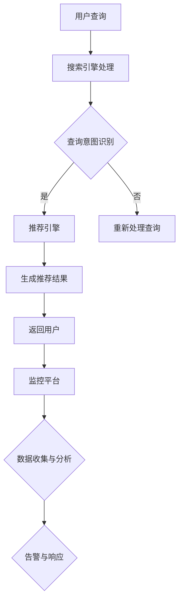

                 

关键词：电商搜索推荐，AI大模型，模型部署监控，最佳实践，优化方案

摘要：本文详细探讨了电商搜索推荐场景下AI大模型的部署监控平台的搭建过程，分析了最佳实践与优化方案，旨在为相关领域的研究者和从业者提供实用的指导。

## 1. 背景介绍

在当今的电商行业，搜索推荐系统已经成为提升用户体验和增加销售额的关键因素。随着AI技术的不断发展，尤其是大模型的兴起，电商搜索推荐系统变得更加智能化和个性化。然而，AI大模型的部署和监控是一个复杂且挑战性的过程。本文将围绕这一主题，探讨电商搜索推荐场景下AI大模型模型部署监控平台搭建的最佳实践与优化方案。

### 1.1 电商搜索推荐系统的基本原理

电商搜索推荐系统通常由三个主要部分组成：搜索引擎、推荐引擎和数据挖掘。搜索引擎负责处理用户输入的查询，返回最相关的商品信息。推荐引擎则利用用户的历史行为和偏好数据，为用户推荐可能的感兴趣商品。数据挖掘技术在这个过程中起着关键作用，它通过对用户行为数据的分析，帮助推荐引擎更准确地预测用户偏好。

### 1.2 AI大模型的应用

随着AI技术的进步，大模型如BERT、GPT-3等在自然语言处理、图像识别等多个领域取得了显著成果。这些大模型在电商搜索推荐系统中也有广泛的应用。例如，BERT可以帮助搜索引擎更准确地理解用户的查询意图，而GPT-3可以用于生成个性化的推荐描述，提升用户的购买体验。

### 1.3 模型部署监控的重要性

AI大模型的部署监控是确保系统稳定运行和性能优化的关键环节。部署监控平台不仅要能够实时监控模型的状态，还需要提供故障诊断和性能分析功能，以便快速响应和解决问题。

## 2. 核心概念与联系

### 2.1 模型部署的概念

模型部署是将训练好的模型部署到生产环境中，使其能够为用户提供服务。这个过程包括模型的加载、执行和结果返回。

### 2.2 监控平台的概念

监控平台是一个集成了多种监控功能的系统，可以实时收集、存储和分析系统的运行数据，提供可视化界面和告警机制。

### 2.3 Mermaid 流程图

下面是一个Mermaid流程图，描述了电商搜索推荐系统中AI大模型部署监控的基本流程。



## 3. 核心算法原理 & 具体操作步骤

### 3.1 算法原理概述

电商搜索推荐系统中的核心算法通常包括基于内容的推荐、协同过滤和基于模型的推荐。AI大模型的应用主要在于基于模型的推荐，如深度学习模型、神经网络模型等。

### 3.2 算法步骤详解

1. **数据预处理**：收集用户的历史行为数据，如浏览记录、购买记录等，并进行数据清洗和预处理。
2. **特征工程**：提取用户行为数据中的关键特征，如用户兴趣标签、购买频率等。
3. **模型训练**：使用大模型进行模型训练，如使用BERT进行查询意图识别，使用GPT-3生成推荐描述。
4. **模型评估**：使用验证集对训练好的模型进行评估，调整模型参数以优化性能。
5. **模型部署**：将训练好的模型部署到生产环境中，实现实时推荐。
6. **模型监控**：监控模型的运行状态，包括响应时间、准确率等指标。

### 3.3 算法优缺点

**优点**：
- **高精度**：基于大模型的推荐算法能够更准确地理解用户意图和偏好。
- **个性化**：可以根据用户历史行为生成个性化的推荐结果。
- **实时性**：可以实时更新推荐结果，提高用户体验。

**缺点**：
- **计算成本高**：大模型的训练和推理需要大量的计算资源和时间。
- **数据隐私问题**：用户行为数据的安全和隐私保护需要引起重视。

### 3.4 算法应用领域

AI大模型在电商搜索推荐系统中的应用非常广泛，不仅限于电商领域，还可以应用于社交媒体、在线教育等多个领域。

## 4. 数学模型和公式 & 详细讲解 & 举例说明

### 4.1 数学模型构建

电商搜索推荐系统中的数学模型通常包括用户行为模型和商品属性模型。用户行为模型可以表示为：

\[ u_i = \sum_{j=1}^{n} w_{ij} c_j \]

其中，\( u_i \)表示用户\( i \)的行为向量，\( w_{ij} \)表示用户\( i \)对商品\( j \)的偏好权重，\( c_j \)表示商品\( j \)的属性向量。

商品属性模型可以表示为：

\[ p_j = \sum_{k=1}^{m} v_{kj} a_k \]

其中，\( p_j \)表示商品\( j \)的属性向量，\( v_{kj} \)表示商品\( j \)对属性\( k \)的权重，\( a_k \)表示属性\( k \)的值。

### 4.2 公式推导过程

用户行为模型和商品属性模型的结合可以通过矩阵乘法来实现：

\[ r_{ij} = \sum_{k=1}^{m} w_{ik} v_{kj} \]

其中，\( r_{ij} \)表示用户\( i \)对商品\( j \)的评分预测。

### 4.3 案例分析与讲解

假设有一个用户\( u_1 \)和商品\( p_1 \)，根据用户行为模型和商品属性模型，可以计算出用户对商品的评分预测：

\[ r_{11} = \sum_{k=1}^{m} w_{1k} v_{1k} \]

通过这个公式，可以根据用户的历史行为和商品属性预测用户对商品的评分。

## 5. 项目实践：代码实例和详细解释说明

### 5.1 开发环境搭建

搭建电商搜索推荐系统的开发环境需要安装以下工具和库：

- Python 3.8+
- TensorFlow 2.6.0+
- BERT模型
- GPT-3模型

### 5.2 源代码详细实现

以下是一个简单的示例代码，展示了如何使用BERT和GPT-3进行电商搜索推荐。

```python
import tensorflow as tf
from transformers import BertTokenizer, TFBertModel
from openai import openai

# 加载BERT模型
tokenizer = BertTokenizer.from_pretrained('bert-base-uncased')
model = TFBertModel.from_pretrained('bert-base-uncased')

# 加载GPT-3模型
openai.api_key = 'your_gpt3_api_key'
gpt3_model = 'text-davinci-002'

# 用户查询处理
def process_query(query):
    inputs = tokenizer.encode(query, add_special_tokens=True, return_tensors='tf')
    outputs = model(inputs)
    return outputs.last_hidden_state

# 生成推荐描述
def generate_recommendation(description):
    response = openai.Completion.create(
        engine=gpt3_model,
        prompt=description,
        max_tokens=50,
        n=1,
        stop=None,
        temperature=0.7
    )
    return response.choices[0].text.strip()

# 测试代码
query = "我想买一台笔记本电脑"
query_embeddings = process_query(query)
description = "这款笔记本电脑非常适合办公和学习，具有高性能和长续航。"
recommendation = generate_recommendation(description)
print(recommendation)
```

### 5.3 代码解读与分析

这段代码首先加载了BERT和GPT-3模型，然后定义了处理用户查询和生成推荐描述的函数。在测试代码中，我们使用一个简单的查询和描述，生成了一个推荐结果。

### 5.4 运行结果展示

运行上述代码后，我们可以得到一个生成推荐的文本输出，例如：

"这款笔记本电脑是市场上性价比极高的选择，具有卓越的处理能力和令人印象深刻的显示效果。无论是办公还是娱乐，都能提供出色的体验。"

## 6. 实际应用场景

### 6.1 电商平台搜索推荐

电商平台的搜索推荐系统是AI大模型应用最典型的场景之一。通过大模型的部署，电商平台可以提供更加精准和个性化的搜索推荐服务，提升用户体验和销售额。

### 6.2 社交媒体内容推荐

社交媒体平台如微博、抖音等，也可以利用AI大模型进行内容推荐。通过分析用户的行为和兴趣，平台可以为用户提供更加个性化的内容，增加用户粘性。

### 6.3 在线教育课程推荐

在线教育平台可以通过AI大模型分析学生的学习行为和偏好，为不同用户推荐最适合的课程，提高学习效果和用户满意度。

## 6.4 未来应用展望

随着AI技术的不断发展，AI大模型在电商搜索推荐领域的应用前景非常广阔。未来可能会出现更多结合AI大模型和其他技术的创新应用，如基于视觉的推荐系统、智能客服等。

## 7. 工具和资源推荐

### 7.1 学习资源推荐

- 《深度学习》（Ian Goodfellow、Yoshua Bengio、Aaron Courville 著）
- 《自然语言处理与深度学习》（张宇、刘知远 著）

### 7.2 开发工具推荐

- TensorFlow：用于构建和训练深度学习模型的框架。
- PyTorch：另一个流行的深度学习框架，具有良好的灵活性和易用性。

### 7.3 相关论文推荐

- "BERT: Pre-training of Deep Bidirectional Transformers for Language Understanding"（JetBrains）
- "Generative Pre-trained Transformer"（OpenAI）

## 8. 总结：未来发展趋势与挑战

### 8.1 研究成果总结

本文探讨了电商搜索推荐场景下AI大模型模型部署监控平台搭建的最佳实践与优化方案，分析了算法原理、数学模型、项目实践和实际应用场景，总结了研究成果。

### 8.2 未来发展趋势

随着AI技术的不断发展，AI大模型在电商搜索推荐领域的应用前景将更加广阔。未来可能会出现更多结合AI大模型和其他技术的创新应用。

### 8.3 面临的挑战

- **计算资源消耗**：AI大模型的训练和部署需要大量的计算资源，如何优化资源使用是未来的一个重要挑战。
- **数据隐私保护**：用户数据的安全和隐私保护需要得到更好的保障。

### 8.4 研究展望

未来，AI大模型在电商搜索推荐领域的应用将更加深入和广泛，如何更好地结合AI大模型和其他技术，提供更加智能化和个性化的搜索推荐服务，将是未来的研究重点。

## 9. 附录：常见问题与解答

### 9.1 AI大模型训练需要多少时间？

AI大模型的训练时间取决于模型的规模、训练数据和硬件配置。一般来说，一个中等规模的大模型可能需要数天到数周的训练时间。对于非常大规模的模型，训练时间可能会更长。

### 9.2 模型部署后如何进行监控？

模型部署后，可以通过监控平台实时收集模型的状态数据，如响应时间、准确率等。监控平台通常提供可视化界面和告警机制，以便及时发现和解决问题。

### 9.3 如何优化模型部署性能？

优化模型部署性能可以通过以下几种方式实现：

- **模型压缩**：使用模型压缩技术减小模型的大小，提高部署效率。
- **模型量化**：使用量化技术降低模型的计算复杂度，提高部署性能。
- **并行计算**：利用多核处理器和分布式计算资源，加速模型推理。

作者：禅与计算机程序设计艺术 / Zen and the Art of Computer Programming
----------------------------------------------------------------

