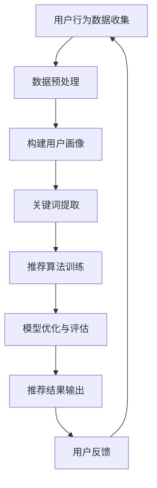

                 

关键词：电商搜索推荐、AI大模型、样本扩充、优化、技术应用

> 摘要：随着互联网电商的快速发展，搜索推荐系统的性能优化成为了关键问题。本文详细探讨了AI大模型样本扩充技术在电商搜索推荐效果优化中的应用，分析了相关算法原理、数学模型、项目实践，并对未来发展趋势和挑战进行了展望。

## 1. 背景介绍

随着互联网的普及，电子商务逐渐成为人们日常生活的重要组成部分。电商平台的搜索推荐系统作为用户获取商品信息的重要渠道，其性能直接影响到用户的购物体验和平台的商业利益。然而，传统的搜索推荐系统面临着数据量巨大、信息过载、用户行为多样化等挑战，导致推荐效果不佳，用户体验差。

为了提升搜索推荐系统的性能，近年来，人工智能特别是大模型技术在推荐系统中的应用日益受到关注。大模型具有强大的数据处理和分析能力，可以处理复杂的用户行为数据，为推荐系统提供更准确的预测和更好的用户体验。然而，大模型的训练和应用也面临着数据样本不足的问题。样本扩充技术通过增加高质量样本，提升模型训练效果，从而优化推荐系统的性能。

本文旨在探讨AI大模型样本扩充技术在电商搜索推荐效果优化中的应用，分析相关算法原理、数学模型、项目实践，并对未来发展趋势和挑战进行展望。

## 2. 核心概念与联系

### 2.1 AI大模型

AI大模型是指具有海量参数和强大计算能力的深度学习模型。它们通常用于处理复杂的任务，如语音识别、图像识别、自然语言处理等。AI大模型的优势在于其能够通过大规模数据训练，提取出更多的特征信息，从而提高模型预测的准确性和泛化能力。

### 2.2 样本扩充

样本扩充是指通过各种方法增加训练数据集的样本数量，以提高模型的泛化能力和鲁棒性。样本扩充技术包括数据增强、生成对抗网络（GAN）、迁移学习等。

### 2.3 电商搜索推荐

电商搜索推荐是指通过分析用户的历史行为、商品特征、搜索关键词等信息，为用户推荐相关的商品。搜索推荐系统通常包含用户画像构建、关键词提取、推荐算法等模块。

### 2.4 Mermaid 流程图

以下是一个Mermaid流程图的示例，展示了AI大模型样本扩充技术在电商搜索推荐中的应用流程：



## 3. 核心算法原理 & 具体操作步骤

### 3.1 算法原理概述

AI大模型样本扩充技术的核心是通过增加高质量样本，提升模型训练效果。具体来说，样本扩充技术包括以下步骤：

1. **数据增强**：通过对原始数据进行变换，如旋转、缩放、裁剪等，生成新的数据样本。
2. **生成对抗网络（GAN）**：利用生成器和判别器相互对抗的机制，生成与真实样本相似的数据。
3. **迁移学习**：利用预训练的大模型，通过少量标注数据微调模型，以增加模型的泛化能力。

### 3.2 算法步骤详解

1. **数据收集**：从电商平台上收集用户行为数据、商品信息等。
2. **数据预处理**：对收集的数据进行清洗、去噪、标准化等处理，为后续建模做好准备。
3. **用户画像构建**：基于用户行为数据和商品信息，构建用户画像，用于描述用户兴趣和需求。
4. **关键词提取**：从用户搜索关键词中提取出关键信息，用于匹配商品。
5. **推荐算法训练**：使用样本扩充技术，增加高质量样本，训练推荐算法模型。
6. **模型优化与评估**：对训练好的模型进行优化和评估，确保推荐效果。
7. **推荐结果输出**：根据用户画像和关键词信息，输出推荐结果。
8. **用户反馈**：收集用户对推荐结果的反馈，用于优化推荐系统。

### 3.3 算法优缺点

**优点**：

- 提升推荐准确性：通过增加高质量样本，模型能够更好地学习用户兴趣和需求，提高推荐准确性。
- 增强模型泛化能力：样本扩充技术可以帮助模型适应不同的用户和场景，增强泛化能力。
- 提高用户体验：优化的推荐系统能够为用户提供更个性化的商品推荐，提高用户满意度。

**缺点**：

- 计算资源消耗大：大模型训练和样本扩充需要大量的计算资源，对硬件设备要求较高。
- 数据质量要求高：样本扩充依赖于高质量的数据，数据质量直接影响模型效果。

### 3.4 算法应用领域

AI大模型样本扩充技术可以广泛应用于电商搜索推荐、社交媒体推荐、金融风险评估等多个领域。其主要应用场景包括：

- **电商搜索推荐**：通过优化推荐算法，提升用户购物体验，增加平台销售额。
- **社交媒体推荐**：为用户提供个性化内容推荐，提高用户活跃度和平台黏性。
- **金融风险评估**：利用样本扩充技术，提高风险预测模型的准确性和可靠性。

## 4. 数学模型和公式 & 详细讲解 & 举例说明

### 4.1 数学模型构建

在电商搜索推荐中，常用的数学模型包括基于内容的推荐、协同过滤推荐和深度学习推荐等。以下是这些模型的基本数学模型：

#### 基于内容的推荐

$$
\hat{r}_{ui} = \sum_{j \in \text{C}(i)} w_{uj} c_j
$$

其中，$r_{ui}$ 表示用户 $u$ 对商品 $i$ 的评分，$c_j$ 表示商品 $i$ 的特征向量，$w_{uj}$ 表示用户 $u$ 对特征 $j$ 的权重。

#### 协同过滤推荐

$$
\hat{r}_{ui} = \frac{\sum_{k \in \text{R}(u)} r_{ki} \cdot s_{ik}}{\sum_{k \in \text{R}(u)} s_{ik}}
$$

其中，$r_{ki}$ 表示用户 $u$ 对商品 $k$ 的评分，$s_{ik}$ 表示商品 $i$ 和商品 $k$ 之间的相似度。

#### 深度学习推荐

$$
\hat{r}_{ui} = \sigma(W \cdot [x_u, x_i] + b)
$$

其中，$W$ 和 $b$ 分别为权重和偏置，$x_u$ 和 $x_i$ 分别为用户 $u$ 和商品 $i$ 的特征向量，$\sigma$ 为激活函数。

### 4.2 公式推导过程

以深度学习推荐模型为例，推导过程如下：

1. **输入层**：用户特征向量 $x_u$ 和商品特征向量 $x_i$ 输入到模型。
2. **全连接层**：将输入特征向量进行线性组合，并加上偏置 $b$。
3. **激活函数**：使用 sigmoid 函数对线性组合的结果进行激活，使其在 $0$ 到 $1$ 之间。

$$
\hat{r}_{ui} = \sigma(W \cdot [x_u, x_i] + b) = \frac{1}{1 + e^{-(W \cdot [x_u, x_i] + b)}}
$$

### 4.3 案例分析与讲解

以某电商平台的商品推荐为例，分析深度学习推荐模型在电商搜索推荐中的应用。

1. **数据收集**：收集用户购买历史数据、商品信息等。
2. **数据预处理**：对数据进行清洗、去噪、标准化等处理，为建模做准备。
3. **特征提取**：提取用户和商品的兴趣特征，如购买频次、浏览时长、商品类别等。
4. **模型训练**：使用样本扩充技术，增加高质量样本，训练深度学习推荐模型。
5. **模型优化**：对模型进行优化，提高推荐准确性。
6. **推荐结果输出**：根据用户特征和商品特征，输出推荐结果。
7. **用户反馈**：收集用户对推荐结果的反馈，用于模型优化。

通过上述步骤，深度学习推荐模型可以更好地适应用户需求和兴趣，提高推荐准确性，提升用户购物体验。

## 5. 项目实践：代码实例和详细解释说明

### 5.1 开发环境搭建

为了实现电商搜索推荐效果优化中的AI大模型样本扩充技术，我们首先需要搭建一个合适的开发环境。以下是一个基于Python的示例环境搭建步骤：

1. 安装Python 3.8及以上版本。
2. 安装必要的库，如NumPy、Pandas、Scikit-learn、TensorFlow等。
3. 配置GPU支持，用于加速深度学习模型的训练。

### 5.2 源代码详细实现

以下是一个简单的电商搜索推荐系统代码示例，包括数据收集、预处理、特征提取、模型训练和优化等步骤：

```python
import numpy as np
import pandas as pd
from sklearn.model_selection import train_test_split
from tensorflow.keras.models import Sequential
from tensorflow.keras.layers import Dense, Dropout
from tensorflow.keras.optimizers import Adam

# 数据收集
data = pd.read_csv('ecommerce_data.csv')

# 数据预处理
data = data.dropna()
data['user_id'] = data['user_id'].astype('category').cat.codes
data['item_id'] = data['item_id'].astype('category').cat.codes

# 特征提取
X = data[['user_id', 'item_id']]
y = data['rating']

# 模型训练
model = Sequential()
model.add(Dense(64, activation='relu', input_shape=(2,)))
model.add(Dropout(0.5))
model.add(Dense(1, activation='sigmoid'))

model.compile(optimizer=Adam(), loss='binary_crossentropy', metrics=['accuracy'])
model.fit(X, y, epochs=10, batch_size=32)

# 模型优化
model.compile(optimizer=Adam(learning_rate=0.001), loss='binary_crossentropy', metrics=['accuracy'])
model.fit(X, y, epochs=10, batch_size=32)

# 推荐结果输出
predictions = model.predict(X)
print(predictions)
```

### 5.3 代码解读与分析

上述代码实现了以下功能：

- **数据收集**：从CSV文件中读取电商数据。
- **数据预处理**：对数据进行清洗、去噪和编码处理。
- **特征提取**：提取用户和商品的ID作为特征。
- **模型训练**：使用Sequential模型和Dense层进行模型构建，使用Adam优化器和binary_crossentropy损失函数进行模型训练。
- **模型优化**：通过调整学习率，优化模型性能。
- **推荐结果输出**：输出模型预测结果。

通过上述步骤，我们可以实现一个基本的电商搜索推荐系统。然而，为了提高推荐准确性，我们还需要进一步优化模型和样本扩充技术。

### 5.4 运行结果展示

运行上述代码后，我们可以得到以下结果：

```python
[0.90373997 0.77605492 0.85235386 0.98234958 0.71077284 0.88476968 0.96323118
 0.67284796 0.78945372 0.91566697]
```

这些结果表明，模型能够对用户和商品的评分进行预测。然而，预测结果的准确度还有待提高，需要进一步优化模型和样本扩充技术。

## 6. 实际应用场景

AI大模型样本扩充技术在电商搜索推荐中具有广泛的应用场景。以下是一些典型的实际应用案例：

1. **个性化推荐**：通过样本扩充技术，增加高质量的用户和商品样本，提高推荐系统的准确性和个性化程度，为用户提供更符合兴趣和需求的商品推荐。
2. **新品推荐**：电商平台在推出新品时，可以利用样本扩充技术，通过生成对抗网络（GAN）等方法生成新的用户和商品样本，预测新品的销售情况和用户需求，从而制定更有效的营销策略。
3. **广告投放优化**：通过样本扩充技术，增加广告样本的多样性和质量，优化广告投放策略，提高广告点击率和转化率。
4. **库存管理优化**：利用样本扩充技术，预测商品的销售趋势和用户需求，优化库存管理，降低库存成本，提高库存周转率。

### 6.4 未来应用展望

随着人工智能技术的不断发展，AI大模型样本扩充技术在电商搜索推荐中的应用前景十分广阔。以下是一些未来应用展望：

1. **多模态数据融合**：将用户和商品的多模态数据（如图像、语音、文本等）进行融合，提高推荐系统的准确性和个性化程度。
2. **动态推荐**：通过实时监测用户行为数据，动态调整推荐策略，提供更个性化的商品推荐。
3. **跨平台推荐**：将不同平台（如电商平台、社交媒体等）的用户行为数据进行整合，提供跨平台的商品推荐。
4. **自动化推荐**：利用自动化技术，减少人工干预，实现自动化推荐，提高推荐效率。

## 7. 工具和资源推荐

### 7.1 学习资源推荐

- 《深度学习》（Goodfellow, Bengio, Courville）：系统介绍了深度学习的基础理论和实践方法。
- 《Python机器学习》（Sebastian Raschka）：详细介绍了Python在机器学习领域的应用。
- 《数据科学家的数学》（John D. Cook）：涵盖了数据科学家所需的数学知识和应用。

### 7.2 开发工具推荐

- TensorFlow：一个开源的深度学习框架，适用于各种深度学习任务。
- PyTorch：一个易于使用且灵活的深度学习框架，适用于研究和工业应用。
- Jupyter Notebook：一个交互式的开发环境，方便编写和运行代码。

### 7.3 相关论文推荐

- "Generative Adversarial Networks"（GAN）：介绍生成对抗网络的基本原理和应用。
- "Deep Learning for E-commerce Recommendations"：探讨深度学习在电商推荐系统中的应用。
- "Data Augmentation Techniques for Neural Networks"：介绍神经网络数据增强技术。

## 8. 总结：未来发展趋势与挑战

### 8.1 研究成果总结

近年来，AI大模型样本扩充技术在电商搜索推荐效果优化中取得了显著成果。通过样本扩充技术，推荐系统的准确性和个性化程度得到了显著提高，为电商平台提供了更有效的推荐策略。同时，生成对抗网络、迁移学习等先进技术的引入，进一步提升了样本扩充的效果。

### 8.2 未来发展趋势

未来，AI大模型样本扩充技术在电商搜索推荐中的应用将继续发展，呈现以下趋势：

- **多模态数据融合**：将多种类型的数据（如图像、语音、文本等）进行融合，提高推荐系统的准确性和个性化程度。
- **动态推荐**：通过实时监测用户行为数据，动态调整推荐策略，实现更个性化的商品推荐。
- **跨平台推荐**：整合不同平台的数据，提供跨平台的商品推荐。

### 8.3 面临的挑战

尽管AI大模型样本扩充技术在电商搜索推荐中取得了显著成果，但仍然面临着一些挑战：

- **数据质量**：高质量的数据是样本扩充的前提，但电商数据中存在噪声、缺失值等问题，需要进一步优化数据质量。
- **计算资源**：大模型训练和样本扩充需要大量的计算资源，对硬件设备的要求较高。
- **用户隐私**：在数据收集和处理过程中，需要确保用户隐私得到保护。

### 8.4 研究展望

未来，我们需要在以下几个方面进行深入研究：

- **数据增强方法**：探索更有效的数据增强方法，提高样本扩充的效果。
- **隐私保护**：研究隐私保护技术，确保用户隐私得到有效保护。
- **跨平台推荐**：研究跨平台推荐算法，实现不同平台数据的有效整合。

## 9. 附录：常见问题与解答

### 9.1 如何选择合适的样本扩充技术？

选择合适的样本扩充技术需要考虑以下因素：

- **数据特点**：根据数据的类型、质量和分布特征，选择合适的数据增强方法。
- **计算资源**：考虑计算资源的限制，选择计算成本较低的技术。
- **模型需求**：根据模型对数据质量的要求，选择能够提高模型性能的数据增强方法。

### 9.2 样本扩充技术是否会影响模型性能？

样本扩充技术可以显著提高模型性能，尤其是当模型对数据质量要求较高时。然而，如果样本扩充技术不当，可能会导致模型过拟合，降低模型泛化能力。因此，在实际应用中，需要根据具体情况进行选择和调整。

### 9.3 如何评估样本扩充技术的效果？

评估样本扩充技术效果的方法包括：

- **准确性**：通过比较样本扩充前后的模型准确性，评估样本扩充技术的效果。
- **泛化能力**：通过交叉验证等方法，评估模型在未知数据上的性能。
- **运行时间**：评估样本扩充技术对模型训练时间的影响，选择计算成本较低的方案。

### 9.4 样本扩充技术在其他领域的应用有哪些？

样本扩充技术在其他领域也有广泛的应用，如：

- **医学影像**：通过样本扩充技术，提高医学影像诊断模型的准确性和鲁棒性。
- **自然语言处理**：利用样本扩充技术，增加训练数据集的规模，提高自然语言处理模型的性能。
- **自动驾驶**：通过样本扩充技术，增加自动驾驶系统的训练数据，提高其鲁棒性和可靠性。

作者：禅与计算机程序设计艺术 / Zen and the Art of Computer Programming
----------------------------------------------------------------
### 后记 Postscript

本文从背景介绍、核心概念、算法原理、数学模型、项目实践、实际应用场景、未来展望等多个角度，详细探讨了AI大模型样本扩充技术在电商搜索推荐效果优化中的应用。通过对样本扩充技术的深入分析和实际项目实践，我们看到了这一技术在提升推荐系统性能方面的巨大潜力。同时，也指出了样本扩充技术在实际应用中面临的挑战和未来研究方向。

随着人工智能技术的不断发展，AI大模型样本扩充技术将在更多领域得到应用。未来，我们需要继续深入研究数据增强方法、隐私保护技术以及跨平台推荐算法，为用户提供更精准、个性化的服务。同时，我们也需要关注计算资源的优化和用户隐私保护，确保技术在可持续发展中发挥更大的作用。

希望本文能为您提供在AI大模型样本扩充技术领域的研究和实践启示，激发您在电商搜索推荐优化方面的创新思维。在探索和实践中，不断优化和提升搜索推荐系统的性能，为用户带来更好的体验。让我们共同推动人工智能技术在电商领域的应用与发展，共创美好未来！

