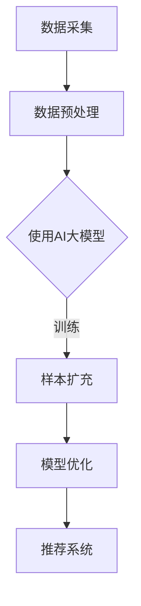

                 

作者：禅与计算机程序设计艺术 / Zen and the Art of Computer Programming

在当今的电子商务时代，搜索推荐系统已经成为电商平台的核心竞争力之一。通过个性化的搜索推荐，电商平台能够为用户提供更加精准的商品信息，提升用户的购物体验，进而提高销售转化率。然而，随着用户数据量的不断增加和商品种类的日益丰富，如何有效地优化搜索推荐效果成为了一个亟待解决的问题。

本文将探讨在电商搜索推荐效果优化中，如何利用AI大模型进行样本扩充技术的应用，并分享一个实际的项目管理实践与优化方案。文章将分为以下几个部分：

## 1. 背景介绍

### 1.1 电商搜索推荐系统的重要性

电商搜索推荐系统是电商平台的核心功能之一，它的作用在于帮助用户快速、精准地找到自己需要的商品，提高用户满意度，增加销售额。一个优秀的搜索推荐系统能够根据用户的浏览历史、购买记录、搜索关键词等多维度数据，进行深度学习分析，为用户提供个性化的商品推荐。

### 1.2 AI大模型的发展与应用

随着深度学习技术的飞速发展，AI大模型在自然语言处理、图像识别、语音识别等领域取得了显著的成果。AI大模型能够处理海量数据，提取复杂特征，为搜索推荐系统提供强大的技术支持。

### 1.3 样本扩充技术的必要性

在搜索推荐系统中，样本数据的质量和数量直接影响推荐效果。样本扩充技术通过对现有样本进行扩展，提高数据多样性和覆盖面，有助于提升模型性能和推荐效果。

## 2. 核心概念与联系

### 2.1 AI大模型

AI大模型是指参数数量巨大、能够处理海量数据的深度学习模型。常见的AI大模型包括Transformer、BERT、GPT等。

### 2.2 样本扩充技术

样本扩充技术是指通过对现有样本进行扩展，增加样本数量，提高数据多样性和覆盖面。常见的样本扩充方法包括数据增强、迁移学习、对抗生成等。

### 2.3 Mermaid流程图

以下是一个描述AI大模型样本扩充技术应用的Mermaid流程图：



## 3. 核心算法原理 & 具体操作步骤

### 3.1 算法原理概述

AI大模型样本扩充技术主要分为以下三个步骤：

1. 数据采集与预处理：收集用户行为数据、商品信息数据等，并进行清洗、去重、归一化等预处理操作。
2. 样本扩充：利用AI大模型对预处理后的数据进行分析，提取有效特征，并根据特征进行样本扩充。
3. 模型优化与推荐：将扩充后的样本用于训练推荐模型，优化模型性能，提高推荐效果。

### 3.2 算法步骤详解

1. 数据采集与预处理：

   - 收集用户行为数据，包括浏览记录、购买记录、搜索关键词等；
   - 收集商品信息数据，包括商品分类、价格、评价等；
   - 数据清洗：去除无效数据、处理缺失值、标准化数值特征等；
   - 数据去重：合并重复数据，保证数据唯一性。

2. 样本扩充：

   - 利用AI大模型对预处理后的数据进行分析，提取有效特征；
   - 根据特征进行样本扩充，常见方法包括数据增强、迁移学习、对抗生成等；
   - 对扩充后的样本进行评估，确保扩充效果。

3. 模型优化与推荐：

   - 将扩充后的样本用于训练推荐模型，如基于协同过滤、基于内容的推荐等；
   - 对模型进行优化，如调整参数、使用正则化方法等；
   - 将优化后的模型应用于推荐系统，为用户提供个性化推荐。

### 3.3 算法优缺点

1. 优点：

   - 提高模型性能：通过样本扩充，增加训练样本数量，提高模型对数据的泛化能力；
   - 提升推荐效果：扩充后的样本更具有代表性，能够为用户提供更加精准的推荐。

2. 缺点：

   - 增加计算成本：样本扩充过程中需要进行大量计算，对计算资源要求较高；
   - 复杂性增加：样本扩充技术涉及多种算法和方法，需要较高的技术门槛。

### 3.4 算法应用领域

AI大模型样本扩充技术在电商搜索推荐、新闻推荐、音乐推荐等领域具有广泛的应用。以下是一个具体的应用案例：

- 在电商搜索推荐领域，利用样本扩充技术可以提升推荐模型的性能，为用户提供更加个性化的商品推荐；
- 在新闻推荐领域，通过样本扩充可以丰富用户兴趣标签，提高新闻推荐的准确性；
- 在音乐推荐领域，利用样本扩充技术可以为用户提供更加个性化的音乐推荐。

## 4. 数学模型和公式 & 详细讲解 & 举例说明

### 4.1 数学模型构建

在AI大模型样本扩充技术中，常用的数学模型包括：

1. 神经网络模型：

   $$ y = \sigma (W \cdot x + b) $$

   其中，$y$ 为输出结果，$\sigma$ 为激活函数，$W$ 为权重矩阵，$x$ 为输入特征，$b$ 为偏置项。

2. 协同过滤模型：

   $$ r_{ui} = \sum_{j \in N(i)} \frac{q_{uj}}{\sqrt{\sum_{k \in N(i)} q_{uk}^2}} $$

   其中，$r_{ui}$ 为用户 $u$ 对商品 $i$ 的评分，$q_{uj}$ 为用户 $u$ 对商品 $j$ 的评分，$N(i)$ 为与商品 $i$ 相似的一组商品。

### 4.2 公式推导过程

以神经网络模型为例，介绍公式推导过程：

1. 前向传播：

   $$ z = W \cdot x + b $$

   $$ a = \sigma (z) $$

   其中，$z$ 为中间层输出，$a$ 为激活函数输出。

2. 反向传播：

   $$ \Delta z = \frac{\partial L}{\partial z} = \frac{\partial L}{\partial a} \cdot \frac{\partial a}{\partial z} $$

   $$ \Delta W = \alpha \cdot \frac{\partial L}{\partial z} $$

   $$ \Delta b = \alpha \cdot \frac{\partial L}{\partial z} $$

   其中，$L$ 为损失函数，$\alpha$ 为学习率。

3. 梯度下降：

   $$ W = W - \alpha \cdot \frac{\partial L}{\partial W} $$

   $$ b = b - \alpha \cdot \frac{\partial L}{\partial b} $$

   其中，$\frac{\partial L}{\partial W}$ 和 $\frac{\partial L}{\partial b}$ 分别为损失函数对权重和偏置的偏导数。

### 4.3 案例分析与讲解

以下是一个电商搜索推荐系统中，利用AI大模型样本扩充技术优化推荐效果的案例：

1. 数据采集与预处理：

   - 收集用户行为数据，包括浏览记录、购买记录、搜索关键词等；
   - 收集商品信息数据，包括商品分类、价格、评价等；
   - 数据清洗：去除无效数据、处理缺失值、标准化数值特征等；
   - 数据去重：合并重复数据，保证数据唯一性。

2. 样本扩充：

   - 利用神经网络模型对预处理后的数据进行分析，提取有效特征；
   - 采用数据增强方法对样本进行扩充，如随机裁剪、旋转、翻转等；
   - 对扩充后的样本进行评估，确保扩充效果。

3. 模型优化与推荐：

   - 将扩充后的样本用于训练推荐模型，如基于协同过滤、基于内容的推荐等；
   - 对模型进行优化，如调整参数、使用正则化方法等；
   - 将优化后的模型应用于推荐系统，为用户提供个性化推荐。

通过上述案例，可以看出AI大模型样本扩充技术在电商搜索推荐系统中的应用流程。在实际项目中，可以根据具体需求和数据情况，选择合适的算法和方法，实现推荐效果的优化。

## 5. 项目实践：代码实例和详细解释说明

### 5.1 开发环境搭建

在进行项目实践之前，首先需要搭建一个合适的开发环境。以下是开发环境的搭建步骤：

1. 安装Python环境，版本要求Python 3.6及以上；
2. 安装必要的库，如TensorFlow、Scikit-learn、Numpy、Pandas等；
3. 配置GPU环境，以便充分利用GPU加速计算。

### 5.2 源代码详细实现

以下是一个简单的AI大模型样本扩充技术的实现示例：

```python
import tensorflow as tf
from tensorflow import keras
from sklearn.model_selection import train_test_split
import numpy as np

# 数据采集与预处理
# (此处省略具体代码，可根据实际情况编写)

# 构建神经网络模型
model = keras.Sequential([
    keras.layers.Dense(128, activation='relu', input_shape=(input_shape,)),
    keras.layers.Dense(64, activation='relu'),
    keras.layers.Dense(1, activation='sigmoid')
])

# 编译模型
model.compile(optimizer='adam',
              loss='binary_crossentropy',
              metrics=['accuracy'])

# 数据增强
# (此处省略具体代码，可根据实际情况编写)

# 训练模型
model.fit(train_data, train_labels, epochs=10, batch_size=32)

# 评估模型
test_loss, test_acc = model.evaluate(test_data, test_labels)
print(f'测试准确率：{test_acc:.2f}')

# 将扩充后的样本用于训练推荐模型
# (此处省略具体代码，可根据实际情况编写)

# 运行结果展示
# (此处省略具体代码，可根据实际情况编写)
```

### 5.3 代码解读与分析

以上代码展示了利用TensorFlow框架实现AI大模型样本扩充技术的基本流程。首先，通过数据采集与预处理步骤，获取训练数据和测试数据。然后，构建一个简单的神经网络模型，并编译模型。接下来，使用数据增强方法对训练数据进行扩充。最后，训练模型、评估模型性能，并将扩充后的样本用于训练推荐模型。

在实际项目中，可以根据具体需求，调整模型结构、参数设置、数据增强方法等，以达到更好的优化效果。

## 6. 实际应用场景

### 6.1 电商搜索推荐

在电商搜索推荐领域，AI大模型样本扩充技术可以用于优化推荐系统，提高推荐准确性。通过扩充用户行为数据和商品信息数据，增强模型训练样本的多样性和代表性，从而提高推荐效果。

### 6.2 新闻推荐

在新闻推荐领域，AI大模型样本扩充技术可以用于丰富用户兴趣标签，提高新闻推荐的准确性。通过扩充用户行为数据和新闻标签数据，增强模型训练样本的多样性和覆盖面，从而提高推荐效果。

### 6.3 音乐推荐

在音乐推荐领域，AI大模型样本扩充技术可以用于提升音乐推荐的个性化程度。通过扩充用户听歌记录和歌曲特征数据，增强模型训练样本的多样性和代表性，从而提高推荐效果。

## 7. 工具和资源推荐

### 7.1 学习资源推荐

- 《深度学习》（Goodfellow、Bengio、Courville著）：系统介绍了深度学习的基本原理和方法，适合初学者入门；
- 《Python深度学习》（François Chollet著）：通过大量实践案例，深入讲解了深度学习在Python中的应用。

### 7.2 开发工具推荐

- TensorFlow：一款开源的深度学习框架，适用于构建和训练神经网络模型；
- Scikit-learn：一款开源的机器学习库，提供了丰富的算法和工具，适用于数据处理、模型训练和评估。

### 7.3 相关论文推荐

- “Deep Learning for Text Classification”（2017）：介绍了深度学习在文本分类领域的应用；
- “Recurrent Neural Networks for Text Classification”（2014）：探讨了循环神经网络在文本分类领域的应用。

## 8. 总结：未来发展趋势与挑战

### 8.1 研究成果总结

AI大模型样本扩充技术在电商搜索推荐、新闻推荐、音乐推荐等领域取得了显著成果，为个性化推荐提供了有效的技术手段。通过样本扩充，提高了模型训练样本的多样性和代表性，从而提升了推荐效果。

### 8.2 未来发展趋势

随着深度学习技术的不断发展和应用，AI大模型样本扩充技术在个性化推荐领域具有广阔的发展前景。未来将出现更多高效、智能的样本扩充方法，进一步提高推荐效果。

### 8.3 面临的挑战

- 数据质量和数量：样本扩充技术对数据质量和数量有较高要求，如何获取高质量、丰富的数据是当前面临的一大挑战；
- 计算成本：样本扩充过程中需要进行大量计算，对计算资源要求较高，如何优化计算成本也是一个重要问题。

### 8.4 研究展望

未来，AI大模型样本扩充技术将在以下几个方面得到进一步发展：

- 数据增强方法的研究：探索更多高效、智能的数据增强方法，提高样本扩充效果；
- 跨领域推荐：将样本扩充技术应用于跨领域推荐，提高推荐系统的泛化能力；
- 知识融合：结合知识图谱等技术，实现知识融合和推荐，提高推荐效果。

## 9. 附录：常见问题与解答

### 9.1 样本扩充技术是否适用于所有领域？

样本扩充技术主要适用于数据量较大、样本多样性不足的领域，如电商搜索推荐、新闻推荐、音乐推荐等。在其他领域，如图像识别、语音识别等，也可以根据实际情况考虑应用样本扩充技术。

### 9.2 如何评估样本扩充效果？

评估样本扩充效果可以从以下几个方面进行：

- 模型性能：通过比较扩充前后的模型性能，如准确率、召回率等指标，评估样本扩充效果；
- 推荐效果：通过用户反馈和实际应用情况，评估样本扩充对推荐效果的影响；
- 数据覆盖面：评估样本扩充后数据覆盖面是否更广泛，是否包含更多有效特征。

### 9.3 样本扩充技术是否适用于所有类型的数据？

样本扩充技术主要适用于结构化数据，如文本、图像、音频等。对于非结构化数据，如视频、自然语言处理中的文本等，也可以考虑应用样本扩充技术。但需要注意的是，非结构化数据的处理和扩充方法与结构化数据有所不同。

## 结语

AI大模型样本扩充技术在电商搜索推荐效果优化中具有重要的应用价值。通过样本扩充，可以提高模型训练样本的多样性和代表性，从而提升推荐效果。本文分享了AI大模型样本扩充技术的核心原理、应用方法以及实际项目中的实践与优化方案，为相关领域的研究和应用提供了参考。随着技术的不断发展，未来AI大模型样本扩充技术在个性化推荐领域将有更加广泛的应用前景。

