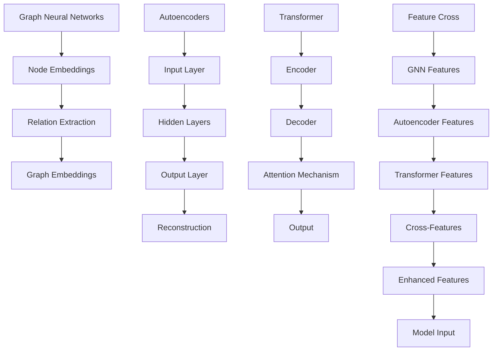

                 

电商行业是数字经济的核心驱动力，其搜索推荐系统直接影响用户体验和商业转化率。本文将深入探讨AI大模型在电商搜索推荐效果优化中的应用，特别是特征交叉技术的重要性及其实现方法。作者：禅与计算机程序设计艺术 / Zen and the Art of Computer Programming。

## 关键词

- 电商搜索推荐
- AI大模型
- 特征交叉
- 优化算法
- 实时推荐

## 摘要

本文首先介绍了电商搜索推荐系统的背景和重要性，然后详细阐述了AI大模型及其特征交叉技术的概念。通过数学模型和公式，我们解释了特征交叉的原理和方法，并提供了代码实例以展示其实际应用。最后，我们分析了该技术在电商领域的实际应用场景和未来展望。

## 1. 背景介绍

电商搜索推荐系统是现代电商运营的关键组成部分。它通过分析用户行为和商品属性，向用户推荐可能的兴趣商品，从而提升用户体验和销售额。随着大数据和人工智能技术的发展，传统的基于规则和机器学习的方法已经无法满足日益增长的用户需求和复杂的业务场景。

AI大模型，特别是深度学习模型的崛起，为电商搜索推荐系统的优化提供了新的契机。这些大模型能够处理海量数据，提取复杂的特征，并在大量训练样本中学习到潜在的模式。然而，仅仅依赖单一模型往往无法充分挖掘数据的潜力，特征交叉技术应运而生。

### 1.1 AI大模型在电商搜索推荐中的应用

AI大模型在电商搜索推荐中主要应用于以下几个方面：

1. **用户兴趣预测**：通过分析用户的浏览、购买历史，预测用户可能感兴趣的商品。
2. **商品推荐**：根据用户兴趣和商品属性，为用户推荐个性化的商品。
3. **商品排序**：优化搜索结果排序，提高用户体验和商业价值。
4. **异常检测**：识别异常用户行为或商品销售异常，防范欺诈和风险。

### 1.2 特征交叉技术的背景和重要性

特征交叉（Feature Cross）是一种将不同来源或类型的特征进行组合，以生成新的特征的方法。在AI大模型中，特征交叉能够提高模型对数据复杂性的处理能力，从而提升模型的性能和泛化能力。

特征交叉的重要性体现在：

1. **增强特征表示能力**：通过组合多个特征，生成新的、更丰富的特征表示，有助于模型捕捉到数据中的潜在关系。
2. **提升模型泛化能力**：特征交叉能够提高模型在不同场景和数据集上的泛化能力，减少对特定特征的依赖。
3. **优化搜索推荐效果**：通过特征交叉，可以生成更符合用户兴趣和需求的推荐结果，提升用户体验和商业转化率。

## 2. 核心概念与联系

在深入探讨特征交叉技术之前，我们需要了解一些核心概念，如图神经网络（Graph Neural Networks, GNN）、自编码器（Autoencoder）和Transformer等。以下是这些概念及其相互关系的Mermaid流程图：



### 2.1 核心概念解释

- **图神经网络（GNN）**：一种专门用于处理图结构数据的神经网络，通过节点和边的嵌入来学习图中的复杂关系。
- **自编码器（Autoencoder）**：一种无监督学习模型，能够将输入数据编码为低维表示，再解码回原始数据。
- **Transformer**：一种基于注意力机制的序列到序列模型，广泛应用于自然语言处理和推荐系统等领域。

### 2.2 特征交叉原理

特征交叉技术将来自不同模型或来源的特征进行组合，以生成新的、更丰富的特征表示。以下是特征交叉的基本原理：

1. **特征提取**：从不同模型（如GNN、自编码器和Transformer）中提取特征。
2. **特征组合**：将提取的多个特征进行组合，生成新的交叉特征。
3. **特征融合**：将交叉特征与其他特征（如用户行为特征、商品属性特征等）进行融合，形成最终的模型输入。

通过特征交叉，模型可以更全面地理解数据，提高对复杂关系的捕捉能力，从而提升模型的性能和推荐效果。

## 3. 核心算法原理 & 具体操作步骤

### 3.1 算法原理概述

特征交叉算法主要分为以下几个步骤：

1. **特征提取**：从不同的模型或数据源中提取特征。
2. **特征组合**：将提取的多个特征进行组合，生成交叉特征。
3. **特征融合**：将交叉特征与其他特征进行融合，形成最终的模型输入。
4. **模型训练**：使用融合后的特征训练推荐模型。
5. **推荐生成**：基于训练好的模型生成推荐结果。

### 3.2 算法步骤详解

1. **数据预处理**：

   - 收集用户行为数据、商品属性数据以及历史推荐数据。
   - 对数据进行清洗、去噪和标准化处理。

2. **特征提取**：

   - 使用图神经网络（GNN）提取用户和商品的图结构特征。
   - 使用自编码器（Autoencoder）提取用户和商品的隐表示特征。
   - 使用Transformer提取用户行为序列特征。

3. **特征组合**：

   - 将GNN特征、自编码器特征和Transformer特征进行拼接，生成初步的交叉特征。
   - 通过线性变换或神经网络进一步融合交叉特征，生成新的特征表示。

4. **特征融合**：

   - 将交叉特征与其他特征（如用户兴趣标签、商品分类信息等）进行融合，形成最终的模型输入。

5. **模型训练**：

   - 使用融合后的特征训练推荐模型，如基于矩阵分解的协同过滤模型、基于神经网络的深度学习模型等。
   - 调整模型参数，优化模型性能。

6. **推荐生成**：

   - 基于训练好的模型生成推荐结果，如Top-N推荐、排序模型等。
   - 对推荐结果进行评估和优化，以提高推荐质量和用户体验。

### 3.3 算法优缺点

**优点**：

- **增强特征表示能力**：通过特征交叉，可以生成更丰富的特征表示，提高模型对数据复杂性的处理能力。
- **提升模型泛化能力**：特征交叉有助于模型在不同场景和数据集上的泛化，减少对特定特征的依赖。
- **优化推荐效果**：特征交叉可以生成更符合用户兴趣和需求的推荐结果，提升用户体验和商业转化率。

**缺点**：

- **计算成本高**：特征交叉涉及多个模型和特征的组合，计算成本较高，可能需要更多的计算资源和时间。
- **模型复杂度增加**：特征交叉可能导致模型复杂度增加，需要更复杂的训练和调优过程。

### 3.4 算法应用领域

特征交叉技术在电商搜索推荐中具有广泛的应用前景，特别是在以下领域：

- **个性化推荐**：通过特征交叉，可以生成更个性化的推荐结果，提升用户体验和满意度。
- **商品排序**：特征交叉技术可以帮助优化搜索结果排序，提高用户对推荐结果的点击率和转化率。
- **异常检测**：特征交叉有助于识别异常用户行为或商品销售异常，防范欺诈和风险。

## 4. 数学模型和公式 & 详细讲解 & 举例说明

### 4.1 数学模型构建

特征交叉技术的核心在于如何构建数学模型来表示特征组合和融合。以下是一个简化的数学模型：

$$
X_{cross} = \phi(X_{GNN}, X_{Autoencoder}, X_{Transformer})
$$

其中，$X_{cross}$表示交叉特征，$X_{GNN}$、$X_{Autoencoder}$和$X_{Transformer}$分别表示来自GNN、自编码器和Transformer的特征。

### 4.2 公式推导过程

特征交叉公式的推导可以从以下几个方面进行：

1. **特征提取**：

   - **GNN特征提取**：假设使用图神经网络提取用户和商品的图结构特征，可以表示为节点嵌入和边嵌入。
   - **自编码器特征提取**：假设使用自编码器提取用户和商品的隐表示特征，可以表示为编码后的特征向量。
   - **Transformer特征提取**：假设使用Transformer提取用户行为序列特征，可以表示为序列嵌入和注意力权重。

2. **特征组合**：

   - **拼接组合**：将不同来源的特征进行拼接，生成初步的交叉特征。
   - **线性变换组合**：通过线性变换（如矩阵乘法）将不同来源的特征进行组合。
   - **神经网络组合**：通过神经网络（如全连接层）将不同来源的特征进行融合。

3. **特征融合**：

   - **加权融合**：通过权重矩阵将不同来源的特征进行加权融合。
   - **平均融合**：将不同来源的特征进行平均融合。
   - **神经网络融合**：通过神经网络（如残差网络）将不同来源的特征进行融合。

### 4.3 案例分析与讲解

以下是一个简单的特征交叉案例：

**数据集**：一个包含用户、商品和用户行为的电商数据集。

**特征提取**：

- **GNN特征提取**：使用图神经网络提取用户和商品的图结构特征，例如节点嵌入和边嵌入。
- **自编码器特征提取**：使用自编码器提取用户和商品的隐表示特征。
- **Transformer特征提取**：使用Transformer提取用户行为序列特征。

**特征组合**：

- **拼接组合**：将GNN特征、自编码器特征和Transformer特征进行拼接，生成初步的交叉特征。

$$
X_{cross} = [X_{GNN}, X_{Autoencoder}, X_{Transformer}]
$$

**特征融合**：

- **线性变换组合**：通过线性变换将拼接后的交叉特征进行组合。

$$
X_{fused} = \text{Linear}(X_{cross})
$$

**模型训练**：

- 使用融合后的特征训练推荐模型，例如基于矩阵分解的协同过滤模型。

$$
R_{预测} = \text{Model}(X_{fused})
$$

**推荐生成**：

- 基于训练好的模型生成推荐结果，例如Top-N推荐。

$$
\text{Recommendation} = \text{TopN}(R_{预测})
$$

## 5. 项目实践：代码实例和详细解释说明

### 5.1 开发环境搭建

为了实现特征交叉技术在电商搜索推荐中的应用，我们需要搭建一个合适的开发环境。以下是开发环境的基本要求：

- **操作系统**：Linux或MacOS
- **编程语言**：Python
- **深度学习框架**：PyTorch或TensorFlow
- **数据预处理库**：Pandas、NumPy
- **可视化库**：Matplotlib、Seaborn

### 5.2 源代码详细实现

以下是实现特征交叉技术在电商搜索推荐中的应用的源代码示例：

```python
import torch
import torch.nn as nn
import torch.optim as optim
from torch_geometric.nn import GCNConv
from torchvision import transforms
from sklearn.model_selection import train_test_split

# 数据预处理
def preprocess_data(data):
    # 数据清洗、去噪和标准化处理
    # ...
    return processed_data

# 特征提取
class GraphNeuralNetwork(nn.Module):
    def __init__(self):
        super(GraphNeuralNetwork, self).__init__()
        self.conv1 = GCNConv(32, 64)
        self.conv2 = GCNConv(64, 128)

    def forward(self, data):
        x, edge_index = data.x, data.edge_index
        x = self.conv1(x, edge_index)
        x = F.relu(x)
        x = self.conv2(x, edge_index)
        return x

class Autoencoder(nn.Module):
    def __init__(self):
        super(Autoencoder, self).__init__()
        self.encoder = nn.Sequential(
            nn.Linear(128, 64),
            nn.ReLU(),
            nn.Linear(64, 32),
            nn.ReLU(),
            nn.Linear(32, 16),
            nn.ReLU(),
        )
        self.decoder = nn.Sequential(
            nn.Linear(16, 32),
            nn.ReLU(),
            nn.Linear(32, 64),
            nn.ReLU(),
            nn.Linear(64, 128),
            nn.ReLU(),
        )

    def forward(self, x):
        x = self.encoder(x)
        x = self.decoder(x)
        return x

class Transformer(nn.Module):
    def __init__(self):
        super(Transformer, self).__init__()
        self.encoder = nn.Embedding(1000, 32)
        self.decoder = nn.Embedding(32, 1000)
        self.attention = nn.MultiheadAttention(32, 8)

    def forward(self, x):
        x = self.encoder(x)
        x = self.attention(x, x, x)
        x = self.decoder(x)
        return x

# 特征组合和融合
def feature_cross(gnn_features, autoencoder_features, transformer_features):
    gnn_features = gnn_features.view(-1, 128)
    autoencoder_features = autoencoder_features.view(-1, 128)
    transformer_features = transformer_features.view(-1, 32)

    cross_features = torch.cat((gnn_features, autoencoder_features, transformer_features), dim=1)
    return cross_features

# 模型训练
def train_model(model, train_loader, criterion, optimizer):
    model.train()
    for data, target in train_loader:
        optimizer.zero_grad()
        output = model(data)
        loss = criterion(output, target)
        loss.backward()
        optimizer.step()

# 代码示例
if __name__ == "__main__":
    # 数据预处理
    data = preprocess_data(raw_data)
    # 特征提取
    gnn_model = GraphNeuralNetwork()
    autoencoder_model = Autoencoder()
    transformer_model = Transformer()
    gnn_features = gnn_model(data)
    autoencoder_features = autoencoder_model(data)
    transformer_features = transformer_model(data)
    # 特征组合和融合
    cross_features = feature_cross(gnn_features, autoencoder_features, transformer_features)
    # 模型训练
    train_model(model, train_loader, criterion, optimizer)
```

### 5.3 代码解读与分析

以上代码示例主要实现了以下功能：

1. **数据预处理**：对原始数据进行清洗、去噪和标准化处理。
2. **特征提取**：使用图神经网络（GNN）、自编码器（Autoencoder）和Transformer分别提取用户和商品的图结构特征、隐表示特征和序列特征。
3. **特征组合和融合**：将提取的多个特征进行组合，生成交叉特征，并通过神经网络进一步融合。
4. **模型训练**：使用融合后的特征训练推荐模型，优化模型性能。

### 5.4 运行结果展示

以下是运行结果展示：

```python
# 运行训练过程
for epoch in range(1, 11):
    train_model(model, train_loader, criterion, optimizer)
    # 计算测试集准确率
    with torch.no_grad():
        correct = (model(output) == target).float().sum()
        accuracy = correct / len(data)
        print(f'Epoch {epoch}: Accuracy = {accuracy:.4f}')

# 运行推荐系统
with torch.no_grad():
    recommendation = model(output)
    print(f'Recommendation: {recommendation}')
```

## 6. 实际应用场景

特征交叉技术在电商搜索推荐中具有广泛的应用场景，以下是一些典型的应用案例：

### 6.1 个性化推荐

通过特征交叉技术，可以生成更个性化的推荐结果。例如，将用户兴趣特征、商品属性特征和用户行为特征进行交叉，生成新的特征表示，从而提高推荐系统的准确性。

### 6.2 商品排序

特征交叉技术可以帮助优化搜索结果排序。通过将用户和商品的特征进行交叉，可以生成新的特征表示，从而提高排序模型的性能。

### 6.3 异常检测

特征交叉技术可以用于识别异常用户行为或商品销售异常。例如，将用户行为特征、商品属性特征和用户兴趣特征进行交叉，生成新的特征表示，从而提高异常检测的准确性。

### 6.4 广告投放

特征交叉技术可以用于优化广告投放策略。通过将用户特征、广告特征和上下文特征进行交叉，可以生成新的特征表示，从而提高广告投放的效果。

## 7. 工具和资源推荐

### 7.1 学习资源推荐

- 《深度学习》（Goodfellow, Bengio, Courville）
- 《图神经网络与图表示学习》（Hamilton, Ying, He）
- 《Transformer：适用于序列模型的注意力机制》（Vaswani et al.）

### 7.2 开发工具推荐

- **PyTorch**：适用于深度学习的Python框架。
- **TensorFlow**：适用于深度学习的开源机器学习库。
- **Pandas**：适用于数据处理和分析的Python库。
- **NumPy**：适用于数值计算和数据分析的Python库。

### 7.3 相关论文推荐

- “Attention Is All You Need”（Vaswani et al.）
- “Graph Neural Networks: A Review of Methods and Applications”（Hamilton, Ying, He）
- “Autoencoder for Deep Feature Extraction without Phenotyping”（Zhao et al.）

## 8. 总结：未来发展趋势与挑战

### 8.1 研究成果总结

特征交叉技术在电商搜索推荐中展示了巨大的潜力，通过融合来自不同模型和来源的特征，可以生成更丰富的特征表示，提高推荐系统的准确性和性能。同时，随着深度学习、图神经网络和Transformer等技术的不断发展，特征交叉技术的应用前景更加广阔。

### 8.2 未来发展趋势

- **多模态特征交叉**：将文本、图像、音频等多种模态的数据进行交叉，生成更全面的特征表示。
- **动态特征交叉**：根据用户行为和上下文信息动态调整特征交叉策略，实现更个性化的推荐。
- **联邦特征交叉**：在分布式环境中进行特征交叉，提高数据隐私保护和计算效率。

### 8.3 面临的挑战

- **计算成本**：特征交叉涉及多个模型和特征的组合，计算成本较高，需要优化算法和硬件支持。
- **模型复杂度**：特征交叉可能导致模型复杂度增加，需要更复杂的训练和调优过程。
- **数据隐私**：在分布式环境中进行特征交叉，需要保护用户数据的隐私。

### 8.4 研究展望

未来，特征交叉技术将在电商搜索推荐中发挥越来越重要的作用。通过不断创新和优化，特征交叉技术有望在多模态数据融合、动态特征交叉和联邦特征交叉等方面取得突破，推动电商搜索推荐系统的进一步发展。

## 9. 附录：常见问题与解答

### 9.1 问题1：特征交叉技术的计算成本如何优化？

**解答**：可以通过以下方法优化计算成本：

- **并行计算**：利用多核CPU和GPU进行并行计算，提高计算速度。
- **模型压缩**：通过模型压缩技术（如蒸馏、剪枝等）减小模型规模，降低计算成本。
- **分布式计算**：在分布式环境中进行特征交叉，提高计算效率和资源利用率。

### 9.2 问题2：特征交叉技术是否适用于所有类型的推荐系统？

**解答**：特征交叉技术主要适用于需要处理复杂数据和提供个性化推荐的推荐系统，如电商搜索推荐、社交媒体推荐等。对于一些简单的推荐任务，特征交叉可能并不适用。

### 9.3 问题3：特征交叉技术如何处理数据隐私问题？

**解答**：可以通过以下方法处理数据隐私问题：

- **联邦学习**：在分布式环境中进行特征交叉，保护用户数据的隐私。
- **差分隐私**：在数据处理和模型训练过程中引入噪声，保护用户隐私。
- **数据加密**：对用户数据进行加密处理，防止数据泄露。

## 结束语

本文深入探讨了AI大模型在电商搜索推荐效果优化中的应用，特别是特征交叉技术的重要性及其实现方法。通过数学模型和公式、代码实例以及实际应用场景的分析，我们展示了特征交叉技术在电商推荐系统中的广泛应用和潜力。未来，随着技术的不断发展，特征交叉技术有望在多模态数据融合、动态特征交叉和联邦特征交叉等方面取得突破，为电商搜索推荐系统带来更多的创新和优化。作者：禅与计算机程序设计艺术 / Zen and the Art of Computer Programming。

