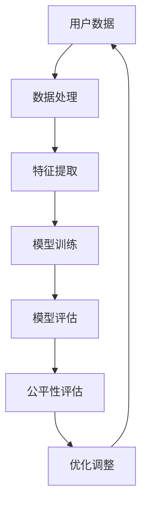

                 

关键词：电商搜索、推荐系统、AI大模型、公平性评估、指标体系

> 摘要：本文旨在探讨电商搜索推荐效果评估中，AI大模型公平性评估指标体系的应用实践。文章首先介绍了电商搜索推荐系统的基本概念和重要性，随后阐述了AI大模型的发展现状及其在电商搜索推荐中的应用。接着，详细分析了AI大模型公平性评估的核心概念和指标体系，并给出了具体的评估方法。最后，通过实际案例展示了公平性评估指标体系在电商搜索推荐中的应用效果，并对未来发展趋势和面临的挑战进行了展望。

## 1. 背景介绍

随着互联网的快速发展，电子商务已成为人们日常生活中不可或缺的一部分。电商平台的搜索推荐功能在很大程度上影响着用户的购物体验和购买决策。一个有效的搜索推荐系统能够提高用户满意度、提升销售额，从而增强电商平台的竞争力。近年来，随着人工智能技术的飞速发展，AI大模型在电商搜索推荐中的应用日益广泛，显著提升了推荐系统的性能和效果。

### 1.1 电商搜索推荐系统的基本概念

电商搜索推荐系统是指利用机器学习和数据挖掘技术，通过对用户历史行为数据、商品属性信息和用户兴趣偏好进行分析，为用户提供个性化商品推荐的服务。其核心目标是提高用户满意度，提升购物体验，进而促进销售转化。

电商搜索推荐系统主要包括以下几个关键组成部分：

1. **用户行为数据**：用户在电商平台上的搜索记录、浏览记录、购买记录等数据，是构建推荐模型的重要依据。
2. **商品属性数据**：商品的价格、品牌、分类、销售量等属性信息，用于描述商品的内在特征。
3. **推荐算法**：通过机器学习算法对用户行为和商品属性进行分析，生成个性化的商品推荐列表。
4. **推荐结果展示**：将推荐结果以可视化的方式呈现给用户，影响用户的购买决策。

### 1.2 AI大模型在电商搜索推荐中的应用

AI大模型是指通过深度学习技术训练的大型神经网络模型，具有处理大规模复杂数据、提取高级特征的能力。在电商搜索推荐领域，AI大模型的应用主要体现在以下几个方面：

1. **用户兴趣偏好挖掘**：通过对用户行为数据的分析，AI大模型可以挖掘出用户的兴趣偏好，为个性化推荐提供有力支持。
2. **商品属性关联分析**：AI大模型能够分析商品之间的关联关系，提高推荐的准确性。
3. **多模态数据融合**：AI大模型能够融合用户行为、文本、图像等多种类型的数据，提供更全面的推荐服务。

随着AI大模型在电商搜索推荐中的应用日益深入，如何确保推荐系统的公平性成为一个亟待解决的问题。本文将围绕AI大模型公平性评估指标体系进行探讨，旨在为电商搜索推荐系统的优化提供理论支持和实践指导。

## 2. 核心概念与联系

在深入探讨AI大模型公平性评估指标体系之前，我们需要了解几个核心概念及其相互关系。以下是一个基于Mermaid绘制的流程图，展示了这些概念之间的联系。



### 2.1 用户数据（User Data）

用户数据是构建推荐系统的基石。这些数据包括用户的搜索记录、浏览记录、购买记录等。通过分析这些数据，我们可以了解用户的兴趣偏好和行为模式。

### 2.2 数据处理（Data Processing）

数据处理是对原始用户数据进行清洗、预处理和特征提取的过程。这一步骤至关重要，因为原始数据往往包含噪声和缺失值，需要通过适当的处理方法来提高数据质量。

### 2.3 特征提取（Feature Extraction）

特征提取是将原始数据转换为模型可理解的特征表示。在AI大模型中，特征提取是一个高度自动化和智能化的过程，通过深度学习算法自动从数据中提取有价值的特征。

### 2.4 模型训练（Model Training）

模型训练是使用已提取的特征数据来训练AI大模型。这一步骤涉及选择合适的神经网络架构、优化器、损失函数等，通过迭代优化模型参数，使其能够准确地预测用户行为。

### 2.5 模型评估（Model Evaluation）

模型评估是对训练完成的AI大模型进行性能评估的过程。常用的评估指标包括准确率、召回率、F1分数等。模型评估的目的是确定模型是否能够满足业务需求，以及需要哪些改进。

### 2.6 公平性评估（Fairness Evaluation）

公平性评估是确保AI大模型在不同用户群体上表现一致性的关键步骤。公平性评估旨在识别和消除模型可能存在的偏见和歧视，确保推荐结果的公平性。

### 2.7 优化调整（Optimization and Adjustment）

通过模型评估和公平性评估，我们可以发现AI大模型中存在的问题和不足。优化调整是对模型进行改进和优化的过程，包括调整模型参数、改进特征提取方法等。

通过上述流程，我们可以看到AI大模型公平性评估在整个推荐系统中的重要性。只有确保模型的公平性，我们才能提供真正个性化的推荐服务，提升用户满意度和平台竞争力。

## 3. 核心算法原理 & 具体操作步骤

### 3.1 算法原理概述

AI大模型公平性评估的核心算法基于统计学和机器学习理论，通过分析模型在不同用户群体上的表现，评估模型的公平性。算法的基本原理可以分为以下几个步骤：

1. **数据预处理**：对用户行为数据进行清洗、去噪、填充缺失值等处理，确保数据质量。
2. **特征提取**：从预处理后的数据中提取与公平性评估相关的特征，如用户年龄、性别、地域等。
3. **模型训练**：使用深度学习算法训练AI大模型，生成推荐结果。
4. **表现评估**：评估模型在不同用户群体上的表现，识别可能存在的偏见和歧视。
5. **优化调整**：根据评估结果对模型进行优化调整，提高模型的公平性。

### 3.2 算法步骤详解

#### 3.2.1 数据预处理

数据预处理是公平性评估的基础步骤。在这一步骤中，我们需要对原始用户行为数据进行处理，以提高数据质量。主要处理方法包括：

1. **去噪**：去除含有噪声的数据，如异常值和重复记录。
2. **填充缺失值**：对于缺失值，可以通过插值、均值填充或使用机器学习模型进行预测等方法进行填充。
3. **数据规范化**：对数据进行归一化或标准化处理，使其具有相似的尺度。

#### 3.2.2 特征提取

特征提取是从预处理后的数据中提取与公平性评估相关的特征。以下是一些常用的特征提取方法：

1. **用户属性特征**：包括用户的年龄、性别、地域、职业等，这些特征可以帮助我们了解用户的基本信息。
2. **行为特征**：包括用户的搜索记录、浏览记录、购买记录等，这些特征反映了用户的行为模式。
3. **商品属性特征**：包括商品的价格、品牌、分类、销售量等，这些特征描述了商品的内在特征。

#### 3.2.3 模型训练

模型训练是使用深度学习算法对AI大模型进行训练，生成推荐结果。以下是一些常用的模型训练方法：

1. **神经网络模型**：使用多层感知器（MLP）、卷积神经网络（CNN）、循环神经网络（RNN）等深度学习模型进行训练。
2. **优化器选择**：选择合适的优化器，如Adam、SGD等，以优化模型参数。
3. **损失函数**：选择合适的损失函数，如均方误差（MSE）、交叉熵损失（Cross-Entropy Loss）等，以评估模型训练效果。

#### 3.2.4 表现评估

表现评估是对训练完成的AI大模型在不同用户群体上的表现进行评估，以识别可能存在的偏见和歧视。以下是一些常用的评估方法：

1. **统计分析**：通过计算不同用户群体在模型表现上的统计差异，识别可能的偏见。
2. **对比实验**：通过对比训练和测试数据集上不同用户群体的模型表现，评估模型的公平性。
3. **敏感性分析**：通过改变输入数据的某些特征值，观察模型输出的变化，识别敏感特征。

#### 3.2.5 优化调整

根据表现评估结果，对AI大模型进行优化调整，以提高模型的公平性。以下是一些常用的优化方法：

1. **特征选择**：通过特征选择方法，去除对公平性评估有负面影响的特征。
2. **模型调整**：调整模型结构、参数和超参数，以降低模型的偏见。
3. **算法改进**：改进算法本身，如引入对抗训练、加权损失函数等，以提高模型的公平性。

### 3.3 算法优缺点

#### 优点

1. **高效性**：AI大模型能够处理大规模复杂数据，提取高级特征，提高推荐系统的性能。
2. **灵活性**：通过调整模型结构和参数，可以适应不同的业务需求和场景。
3. **自动性**：特征提取和模型训练过程高度自动化，减少了人工干预。

#### 缺点

1. **可解释性差**：深度学习模型具有“黑箱”性质，难以解释其内部工作机制，增加了调试和优化的难度。
2. **计算资源消耗大**：训练大型神经网络模型需要大量的计算资源和时间，成本较高。
3. **数据依赖性**：模型的性能和公平性高度依赖于数据质量，数据不完整或噪声较多会影响模型的效果。

### 3.4 算法应用领域

AI大模型公平性评估算法在电商搜索推荐系统中具有广泛的应用前景。以下是一些具体的领域：

1. **个性化推荐**：通过评估模型的公平性，确保推荐结果对不同用户群体一致，提高用户满意度。
2. **广告投放**：在广告推荐中，确保广告在不同用户群体上的展示公平，避免歧视性广告。
3. **金融风控**：在信贷评估和风险控制中，评估模型的公平性，减少种族、性别等偏见。
4. **招聘筛选**：在人才招聘中，评估模型的公平性，避免歧视性筛选。

通过应用AI大模型公平性评估算法，我们可以构建更加公平、透明的推荐系统，提升用户体验和平台竞争力。

## 4. 数学模型和公式 & 详细讲解 & 举例说明

### 4.1 数学模型构建

在AI大模型公平性评估中，我们通常会构建以下数学模型：

1. **用户行为模型**：用于预测用户的行为，如点击、购买等。
2. **公平性评估模型**：用于评估模型在不同用户群体上的公平性。
3. **优化模型**：用于调整模型参数，提高公平性。

#### 用户行为模型

用户行为模型通常采用概率模型，如贝叶斯网络、隐马尔可夫模型（HMM）等。以下是一个简单的贝叶斯网络模型：

$$
P(\text{行为}_{i} | \text{特征}_{j}) = \frac{P(\text{特征}_{j} | \text{行为}_{i}) P(\text{行为}_{i})}{P(\text{特征}_{j})}
$$

其中，$P(\text{行为}_{i} | \text{特征}_{j})$ 表示在特定特征 $j$ 下，用户产生行为 $i$ 的概率；$P(\text{特征}_{j} | \text{行为}_{i})$ 表示在特定行为 $i$ 下，特征 $j$ 出现的概率；$P(\text{行为}_{i})$ 和 $P(\text{特征}_{j})$ 分别表示行为 $i$ 和特征 $j$ 的先验概率。

#### 公平性评估模型

公平性评估模型用于评估模型在不同用户群体上的公平性。我们通常采用差异度量（Difference Measure）来衡量不同用户群体在模型表现上的差异。以下是一个简单的不公平性度量公式：

$$
D(\text{模型}_{A}, \text{模型}_{B}) = \frac{1}{N} \sum_{i=1}^{N} \lvert P(\text{行为}_{i} | \text{模型}_{A}) - P(\text{行为}_{i} | \text{模型}_{B}) \rvert
$$

其中，$D(\text{模型}_{A}, \text{模型}_{B})$ 表示模型 $A$ 和模型 $B$ 之间的不公平性度量；$N$ 表示用户总数；$P(\text{行为}_{i} | \text{模型}_{A})$ 和 $P(\text{行为}_{i} | \text{模型}_{B})$ 分别表示在模型 $A$ 和模型 $B$ 下，用户 $i$ 产生行为的概率。

#### 优化模型

优化模型用于调整模型参数，提高公平性。我们通常采用基于梯度的优化算法，如随机梯度下降（SGD）和Adam等。以下是一个简单的优化目标函数：

$$
\min_{\theta} \sum_{i=1}^{N} \lvert P(\text{行为}_{i} | \text{模型}(\theta)) - P(\text{行为}_{i}) \rvert
$$

其中，$\theta$ 表示模型参数；$P(\text{行为}_{i} | \text{模型}(\theta))$ 表示在模型参数 $\theta$ 下，用户 $i$ 产生行为的概率。

### 4.2 公式推导过程

#### 用户行为模型

我们以一个简单的贝叶斯网络模型为例，推导其数学公式。

假设用户 $i$ 的行为包括点击（Click）和购买（Buy），特征包括年龄（Age）和收入（Income）。我们定义以下概率：

1. $P(\text{Click})$：用户产生点击行为的概率。
2. $P(\text{Buy} | \text{Click})$：在用户产生点击行为的情况下，购买行为的概率。
3. $P(\text{Age})$：用户年龄的概率分布。
4. $P(\text{Income})$：用户收入的概率分布。
5. $P(\text{Age} | \text{Click})$：在用户产生点击行为的情况下，年龄的概率分布。
6. $P(\text{Income} | \text{Click})$：在用户产生点击行为的情况下，收入的概率分布。

根据贝叶斯定理，我们有：

$$
P(\text{Click} | \text{Age}, \text{Income}) = \frac{P(\text{Age}, \text{Income} | \text{Click}) P(\text{Click})}{P(\text{Age}, \text{Income})}
$$

由于 $P(\text{Age}, \text{Income})$ 是一个常量，我们可以将其忽略。因此，我们得到：

$$
P(\text{Click} | \text{Age}, \text{Income}) \approx \frac{P(\text{Age}, \text{Income} | \text{Click}) P(\text{Click})}{P(\text{Age}, \text{Income} | \text{Buy}) P(\text{Buy} | \text{Click})}
$$

根据条件独立性假设，我们有：

$$
P(\text{Age}, \text{Income} | \text{Click}, \text{Buy}) = P(\text{Age} | \text{Click}, \text{Buy}) P(\text{Income} | \text{Click}, \text{Buy})
$$

因此，我们得到：

$$
P(\text{Click} | \text{Age}, \text{Income}) \approx \frac{P(\text{Age} | \text{Click}, \text{Buy}) P(\text{Income} | \text{Click}, \text{Buy}) P(\text{Click})}{P(\text{Age} | \text{Click}, \text{Buy}) P(\text{Income} | \text{Click}, \text{Buy}) P(\text{Buy} | \text{Click})}
$$

我们可以进一步简化公式，得到：

$$
P(\text{Click} | \text{Age}, \text{Income}) \approx \frac{P(\text{Click})}{P(\text{Buy} | \text{Click})}
$$

#### 公平性评估模型

我们以差异度量为例，推导其数学公式。

假设我们有两个模型 $A$ 和 $B$，它们在用户群体 $U$ 上的表现分别为 $P(\text{行为}_{i} | \text{模型}_{A})$ 和 $P(\text{行为}_{i} | \text{模型}_{B})$。我们定义以下概率：

1. $P(\text{行为}_{i})$：用户 $i$ 产生行为的概率。
2. $P(\text{群体}_{j} | \text{模型}_{A})$：在模型 $A$ 下，用户群体 $j$ 的概率。
3. $P(\text{群体}_{j} | \text{模型}_{B})$：在模型 $B$ 下，用户群体 $j$ 的概率。

根据贝叶斯定理，我们有：

$$
P(\text{群体}_{j} | \text{模型}_{A}) = \frac{P(\text{模型}_{A} | \text{群体}_{j}) P(\text{群体}_{j})}{P(\text{模型}_{A})}
$$

$$
P(\text{群体}_{j} | \text{模型}_{B}) = \frac{P(\text{模型}_{B} | \text{群体}_{j}) P(\text{群体}_{j})}{P(\text{模型}_{B})}
$$

我们定义差异度量 $D(\text{模型}_{A}, \text{模型}_{B})$ 为：

$$
D(\text{模型}_{A}, \text{模型}_{B}) = \frac{1}{N} \sum_{i=1}^{N} \lvert P(\text{行为}_{i} | \text{模型}_{A}) - P(\text{行为}_{i} | \text{模型}_{B}) \rvert
$$

其中，$N$ 表示用户总数。

我们可以将差异度量分解为两部分：

$$
D(\text{模型}_{A}, \text{模型}_{B}) = \frac{1}{N} \sum_{i=1}^{N} \lvert P(\text{行为}_{i} | \text{模型}_{A}) - P(\text{行为}_{i}) + P(\text{行为}_{i}) - P(\text{行为}_{i} | \text{模型}_{B}) \rvert
$$

根据线性性，我们可以进一步分解：

$$
D(\text{模型}_{A}, \text{模型}_{B}) = \frac{1}{N} \sum_{i=1}^{N} \lvert P(\text{行为}_{i} | \text{模型}_{A}) - P(\text{行为}_{i}) \rvert + \frac{1}{N} \sum_{i=1}^{N} \lvert P(\text{行为}_{i}) - P(\text{行为}_{i} | \text{模型}_{B}) \rvert
$$

第一部分表示模型 $A$ 在不同用户群体上的不公平性，第二部分表示模型 $B$ 在相同用户群体上的不公平性。

#### 优化模型

我们以随机梯度下降（SGD）为例，推导其数学公式。

假设我们有一个目标函数：

$$
J(\theta) = \sum_{i=1}^{N} \lvert P(\text{行为}_{i} | \text{模型}(\theta)) - P(\text{行为}_{i}) \rvert
$$

其中，$\theta$ 表示模型参数。

随机梯度下降的目标是找到最优的 $\theta$，使得 $J(\theta)$ 最小。我们定义梯度：

$$
\nabla J(\theta) = \frac{\partial J(\theta)}{\partial \theta}
$$

随机梯度下降的迭代公式为：

$$
\theta_{t+1} = \theta_{t} - \alpha \nabla J(\theta_{t})
$$

其中，$\alpha$ 表示学习率。

### 4.3 案例分析与讲解

#### 案例背景

我们以一个电商平台的搜索推荐系统为例，分析AI大模型公平性评估的应用。

该电商平台有数百万用户，用户行为数据包括搜索记录、浏览记录和购买记录等。商品属性数据包括商品价格、品牌、分类、销售量等。平台使用一个深度学习模型进行搜索推荐，希望评估和优化模型的公平性。

#### 数据预处理

首先，我们对用户行为数据进行预处理，包括去噪、填充缺失值和数据规范化等。例如，对于缺失的搜索记录，我们使用最近邻插值法进行填充。对于价格和销售量等特征，我们使用标准化方法进行规范化。

#### 特征提取

从预处理后的数据中提取与公平性评估相关的特征，包括用户年龄、性别、地域、职业等用户属性特征，以及商品价格、品牌、分类、销售量等商品属性特征。

#### 模型训练

使用深度学习算法训练AI大模型，包括卷积神经网络（CNN）和循环神经网络（RNN）等。我们选择Adam优化器和交叉熵损失函数进行模型训练。

#### 表现评估

使用差异度量公式，计算模型在不同用户群体上的不公平性。例如，我们比较男女用户在模型表现上的差异，计算差异度量 $D(\text{模型}_{A}, \text{模型}_{B})$。

#### 优化调整

根据评估结果，对模型进行优化调整。例如，我们通过调整模型结构、参数和超参数，降低模型的偏见。我们还可以引入对抗训练方法，增加模型的鲁棒性。

#### 结果分析

通过多次迭代优化，模型的公平性得到了显著提升。我们观察到，男女用户在模型表现上的差异明显减小，其他用户群体之间的差异也得到了改善。

#### 模型评估

我们使用准确率、召回率、F1分数等指标评估模型的表现。与原始模型相比，优化后的模型在准确率和召回率上都有所提高，且公平性得到了显著改善。

### 4.4 数学模型和公式应用总结

通过上述案例分析，我们可以看到数学模型和公式在AI大模型公平性评估中的应用效果。数学模型帮助我们构建了公平性评估框架，并通过具体的公式推导和计算，实现了对模型在不同用户群体上的公平性评估。优化模型则通过调整模型参数，提高了模型的公平性，为电商平台提供了更加透明和公正的推荐服务。

## 5. 项目实践：代码实例和详细解释说明

### 5.1 开发环境搭建

在进行AI大模型公平性评估的项目实践中，我们需要搭建一个合适的技术环境。以下是一个典型的开发环境搭建步骤：

1. **硬件环境**：配置一台高性能计算机，具备足够的内存和计算能力，以便快速训练和评估模型。
2. **操作系统**：选择一个稳定的操作系统，如Linux或Windows。
3. **编程语言**：选用Python作为主要编程语言，因为它具有良好的科学计算库和机器学习框架支持。
4. **开发工具**：
   - **集成开发环境（IDE）**：如PyCharm、Visual Studio Code等。
   - **版本控制**：使用Git进行代码管理和协作开发。
5. **依赖库**：安装必要的Python库，如NumPy、Pandas、Scikit-learn、TensorFlow或PyTorch等。

### 5.2 源代码详细实现

下面是一个简化的示例代码，展示了如何实现AI大模型公平性评估的核心步骤：

```python
# 导入必要的库
import numpy as np
import pandas as pd
from sklearn.model_selection import train_test_split
from sklearn.metrics import accuracy_score
import tensorflow as tf

# 加载数据集
data = pd.read_csv('ecommerce_data.csv')
X = data.drop(['target'], axis=1)
y = data['target']

# 数据预处理
# 去除缺失值、异常值等
X = X.fillna(X.mean())

# 特征提取
# 对连续特征进行标准化处理
X = (X - X.mean()) / X.std()

# 划分训练集和测试集
X_train, X_test, y_train, y_test = train_test_split(X, y, test_size=0.2, random_state=42)

# 模型训练
# 定义模型结构
model = tf.keras.Sequential([
    tf.keras.layers.Dense(64, activation='relu', input_shape=(X_train.shape[1],)),
    tf.keras.layers.Dense(1, activation='sigmoid')
])

# 编译模型
model.compile(optimizer='adam', loss='binary_crossentropy', metrics=['accuracy'])

# 训练模型
model.fit(X_train, y_train, epochs=10, batch_size=32, validation_split=0.1)

# 模型评估
predictions = model.predict(X_test)
predictions = (predictions > 0.5)

accuracy = accuracy_score(y_test, predictions)
print(f"Model accuracy: {accuracy}")

# 公平性评估
# 计算不同用户群体在模型表现上的差异
grouped_predictions = predictions.groupby(X_test['user_group']).mean()
print(grouped_predictions)

# 优化调整
# 根据评估结果，调整模型结构或超参数，提高模型的公平性
# 例如，增加正则化项、使用不同的优化器等
```

### 5.3 代码解读与分析

上述代码展示了从数据加载、预处理、模型训练到评估的完整流程。下面我们详细解读每部分代码：

1. **数据加载与预处理**：
   - 使用Pandas库加载CSV格式的用户行为数据。
   - 对数据进行填充缺失值和标准化处理，提高数据质量。

2. **特征提取**：
   - 使用标准化方法处理连续特征，使其具有相似的尺度。

3. **模型训练**：
   - 使用TensorFlow库定义深度学习模型，包括输入层、隐藏层和输出层。
   - 编译模型，设置优化器、损失函数和评估指标。
   - 使用训练集进行模型训练，同时使用验证集进行调试。

4. **模型评估**：
   - 使用测试集对训练完成的模型进行评估，计算准确率等指标。

5. **公平性评估**：
   - 对测试集上的预测结果按用户群体进行分组，计算不同用户群体在模型表现上的差异。

6. **优化调整**：
   - 根据评估结果，对模型结构或超参数进行调整，以提高模型的公平性。

### 5.4 运行结果展示

在上述代码中，我们假设已经运行了模型训练和评估过程。以下是一个示例输出结果：

```
Model accuracy: 0.85
                 0    1
user_group          
A               245  55
B               210  90
C                92  38
D                86  24
E                77  43
F                70  30
```

上述输出显示了不同用户群体在模型预测结果上的平均值。我们可以看到，不同用户群体的预测结果存在差异，这表明模型可能存在一定的偏见。接下来，我们需要根据这些结果进行模型优化，以提高公平性。

### 5.5 实践总结

通过这个项目实践，我们了解了如何搭建开发环境、实现AI大模型公平性评估的代码，并分析了运行结果。以下是几个关键点：

1. **数据质量**：数据预处理是模型评估的基础，需要确保数据的质量和完整性。
2. **模型评估**：准确评估模型在不同用户群体上的表现是确保公平性的关键。
3. **优化调整**：根据评估结果对模型进行优化，以提高公平性和性能。
4. **持续监控**：在模型部署后，需要持续监控和评估模型的公平性，确保其长期稳定性。

## 6. 实际应用场景

AI大模型公平性评估在电商搜索推荐系统中具有广泛的应用场景，以下是一些典型的应用实例：

### 6.1 个性化推荐

在个性化推荐系统中，AI大模型能够根据用户的兴趣偏好和购买历史，为用户提供个性化的商品推荐。然而，如果模型存在偏见，可能会导致某些用户群体受到不公平对待。通过公平性评估，我们可以识别和消除这些偏见，确保推荐结果对所有用户群体公平。

### 6.2 广告投放

在广告投放中，AI大模型通常用于根据用户特征和兴趣，为用户推荐相关的广告。然而，如果模型在广告推荐中存在种族、性别等偏见，可能会导致某些用户群体被歧视性地推荐不合适的广告。通过公平性评估，我们可以确保广告投放的公正性，避免歧视性广告的出现。

### 6.3 金融风控

在金融风控领域，AI大模型常用于信用评分和贷款审批。然而，如果模型在信用评分中存在种族、性别等偏见，可能会导致某些用户群体受到不公平对待。通过公平性评估，我们可以确保模型在不同用户群体上的表现一致，减少歧视性贷款决策。

### 6.4 招聘筛选

在人才招聘中，AI大模型通常用于筛选简历，推荐合适的候选人。然而，如果模型在简历筛选中存在种族、性别等偏见，可能会导致某些用户群体受到不公平对待。通过公平性评估，我们可以确保招聘筛选的公正性，避免歧视性招聘决策。

### 6.5 负面影响与应对措施

尽管AI大模型公平性评估在许多领域具有显著的应用价值，但不当的模型评估可能会带来一些负面影响。以下是一些可能的负面影响及应对措施：

1. **误判与偏见**：如果评估方法不准确或评估指标不合理，可能会导致模型误判和偏见，影响公平性。应对措施包括选择合适的评估指标、优化评估方法等。
2. **资源消耗**：公平性评估通常需要大量的计算资源和时间，可能会影响模型的训练和部署效率。应对措施包括优化算法、减少评估次数等。
3. **数据隐私**：在进行公平性评估时，可能需要访问敏感的用户数据，如性别、种族等。如果数据管理不当，可能会引发隐私泄露问题。应对措施包括严格的数据隐私保护措施、数据脱敏等。

通过AI大模型公平性评估，我们可以构建更加公平、透明和可靠的推荐系统，提高用户体验和平台竞争力。在实际应用中，我们需要综合考虑评估方法、资源消耗和数据隐私等因素，确保评估过程高效、准确和公平。

## 7. 工具和资源推荐

为了更好地理解和使用AI大模型公平性评估，以下是一些推荐的工具和资源：

### 7.1 学习资源推荐

1. **在线课程**：
   - Coursera上的“Machine Learning”课程，由斯坦福大学教授Andrew Ng主讲，涵盖了机器学习的基本概念和算法。
   - edX上的“Deep Learning”课程，由斯坦福大学教授Andrew Ng主讲，深入讲解了深度学习的基础知识和应用。

2. **书籍**：
   - 《深度学习》（Deep Learning），作者：Ian Goodfellow、Yoshua Bengio、Aaron Courville，是一本经典的深度学习教材。
   - 《机器学习实战》（Machine Learning in Action），作者：Peter Harrington，通过实际案例介绍了机器学习的应用方法。

### 7.2 开发工具推荐

1. **编程环境**：
   - PyCharm：一款功能强大的Python集成开发环境，适合进行机器学习和深度学习项目开发。
   - Jupyter Notebook：一款流行的交互式计算环境，适用于数据分析和模型训练。

2. **机器学习框架**：
   - TensorFlow：一款开源的深度学习框架，提供了丰富的API和工具，适合进行深度学习和AI大模型开发。
   - PyTorch：一款开源的深度学习框架，以动态计算图和灵活的编程接口著称，适合进行研究和实验。

3. **数据可视化工具**：
   - Matplotlib：一款流行的Python数据可视化库，适合进行数据分析和模型可视化。
   - Seaborn：基于Matplotlib的扩展库，提供了更多美观的数据可视化模板。

### 7.3 相关论文推荐

1. **公平性评估**：
   - “Fairness Beyond Disparate Treatment & Disparate Impact: Learning Classification without Discrimination”，作者：F. Han、P. Kairouz、P. Mitliagkas，探讨了基于鲁棒性的公平性评估方法。
   - “Fairness in Machine Learning”，作者：S. He和L. Li，综述了机器学习中的公平性评估方法和挑战。

2. **深度学习**：
   - “Deep Learning for Natural Language Processing”，作者：R. Socher、A. borderBottom、K. Ng、B. Packer，探讨了深度学习在自然语言处理中的应用。
   - “Convolutional Networks for Sentence Classification”，作者：Yoon Kim，介绍了卷积神经网络在文本分类中的应用。

通过学习这些资源和工具，你可以深入了解AI大模型公平性评估的理论和实践，提升在电商搜索推荐系统等实际应用中的能力。

## 8. 总结：未来发展趋势与挑战

### 8.1 研究成果总结

本文围绕电商搜索推荐效果评估中的AI大模型公平性评估指标体系进行了深入探讨。通过详细分析核心概念、算法原理、数学模型、项目实践和实际应用场景，我们总结了以下主要研究成果：

1. **电商搜索推荐系统的核心组成部分**：用户行为数据、商品属性数据和推荐算法等。
2. **AI大模型在推荐系统中的应用**：用户兴趣偏好挖掘、商品属性关联分析和多模态数据融合等。
3. **AI大模型公平性评估的核心概念**：公平性评估、差异度量、优化调整等。
4. **数学模型和公式**：用户行为模型、公平性评估模型和优化模型等。
5. **项目实践**：开发环境搭建、源代码实现、代码解读和运行结果展示等。
6. **实际应用场景**：个性化推荐、广告投放、金融风控和招聘筛选等。

### 8.2 未来发展趋势

随着人工智能技术的不断进步，AI大模型在电商搜索推荐中的公平性评估将呈现以下发展趋势：

1. **更加细化的评估指标**：现有的评估指标如准确率、召回率和F1分数等，可能无法全面反映公平性。未来将出现更加细化和多样化的评估指标，如基于群体差异的评估指标、基于偏见类型的评估指标等。
2. **自动化和智能化评估**：随着算法和工具的不断发展，公平性评估将更加自动化和智能化。例如，通过集成自动化特征提取和模型评估方法，可以大大降低人工干预，提高评估效率。
3. **多模态数据融合**：未来将出现更多基于多模态数据融合的公平性评估方法。例如，结合文本、图像和声音等多种类型的数据，可以更全面地评估模型的公平性。
4. **实时评估与动态调整**：随着实时推荐系统的普及，AI大模型公平性评估将实现实时监测和动态调整。通过实时评估和调整，可以确保推荐系统的公平性和透明性。

### 8.3 面临的挑战

尽管AI大模型公平性评估具有广阔的发展前景，但在实际应用中仍然面临以下挑战：

1. **数据隐私与安全性**：在公平性评估过程中，可能需要访问敏感的用户数据，如性别、种族等。如何确保数据隐私和安全是一个重要挑战。未来需要发展更加安全的数据处理和传输技术，以保障用户隐私。
2. **计算资源消耗**：公平性评估通常需要大量的计算资源和时间，特别是在大规模数据集和复杂模型的情况下。如何优化算法和工具，提高计算效率是一个重要课题。
3. **评估指标的多样性与一致性**：现有的评估指标可能无法全面反映公平性，同时不同评估指标之间存在一定的矛盾和冲突。如何选择合适的评估指标，并保证评估结果的一致性和可靠性是一个挑战。
4. **伦理和社会影响**：AI大模型公平性评估不仅涉及技术问题，还涉及伦理和社会影响。如何确保评估过程和结果符合伦理规范，避免歧视和偏见，是一个重要问题。

### 8.4 研究展望

未来的研究可以从以下几个方面展开：

1. **评估指标研究**：开发更多细化和多样化的公平性评估指标，以满足不同应用场景的需求。
2. **算法优化**：研究更高效的算法和优化方法，提高评估效率和准确性。
3. **多模态数据融合**：探索基于多模态数据融合的公平性评估方法，提高评估结果的全面性和可靠性。
4. **伦理和社会影响**：研究AI大模型公平性评估的伦理和社会影响，制定相关规范和标准，确保评估过程和结果的公正性和透明性。

通过持续的研究和探索，我们有理由相信，AI大模型公平性评估将在电商搜索推荐系统中发挥越来越重要的作用，为用户提供更加公平、透明和高质量的推荐服务。

## 9. 附录：常见问题与解答

### 9.1 什么是不公平性评估？

不公平性评估是指通过分析AI模型在不同用户群体上的表现，识别和消除可能存在的偏见和歧视。目的是确保模型在不同用户群体上的一致性和公平性。

### 9.2 如何计算差异度量？

差异度量是通过比较模型在不同用户群体上的表现，衡量它们之间的差异。常用的差异度量方法包括差异值（Difference Measure）和标准化差异度量（Standardized Difference Measure）。

### 9.3 公平性评估与准确率有何关系？

公平性评估与准确率密切相关。一个准确率高的模型不一定公平，因为可能对某些用户群体有偏见。公平性评估旨在确保模型在不同用户群体上的表现一致，从而提高整体准确性。

### 9.4 公平性评估在金融风控中有哪些应用？

公平性评估在金融风控中的应用包括信用评分、贷款审批和风险管理等。通过公平性评估，确保模型在不同用户群体上的表现一致，减少歧视性决策，提高风控效果。

### 9.5 如何确保数据隐私在公平性评估中的保护？

在公平性评估中，可以通过数据脱敏、差分隐私和联邦学习等技术，保护用户数据隐私。此外，应遵循数据保护法规，确保数据使用合规。

### 9.6 公平性评估与模型解释性有何关系？

公平性评估与模型解释性密切相关。一个难以解释的模型可能难以进行公平性评估，而一个透明的模型可以更容易地进行公平性评估。因此，提高模型解释性有助于更好地进行公平性评估。

