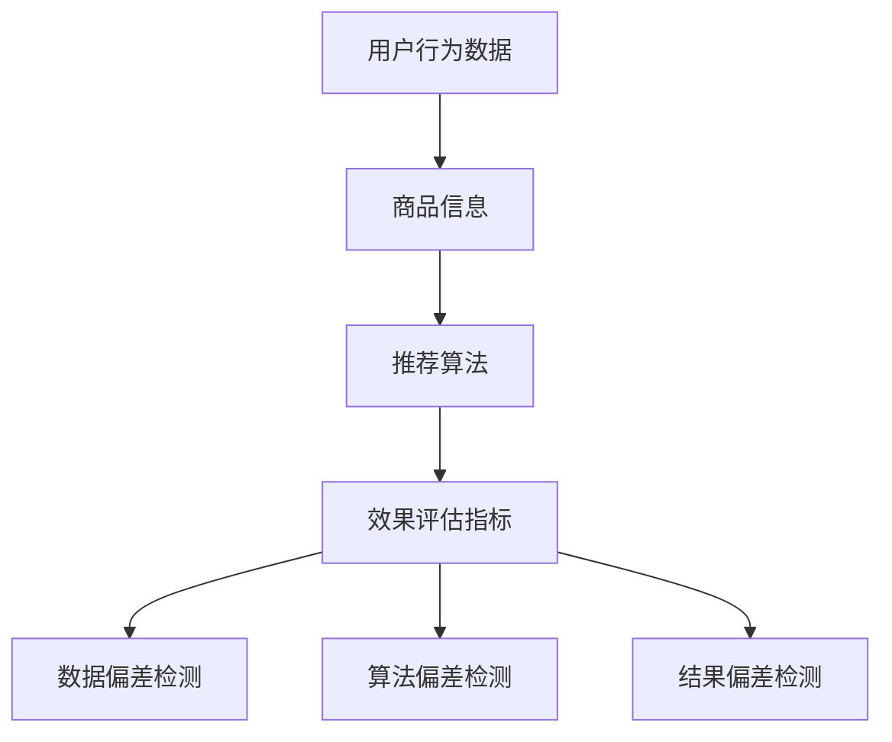

                 

关键词：电商搜索推荐、AI大模型、模型偏差检测、效果评估

## 摘要

随着人工智能技术的不断发展，AI大模型在电商搜索推荐系统中得到了广泛应用。然而，模型的偏差检测成为了一个关键问题。本文将探讨电商搜索推荐效果评估中的AI大模型模型偏差检测技术，从背景介绍、核心概念与联系、核心算法原理与具体操作步骤、数学模型与公式、项目实践、实际应用场景、工具和资源推荐以及未来发展趋势与挑战等方面进行详细论述，旨在为相关领域的研究者和从业者提供有价值的参考。

## 1. 背景介绍

电商搜索推荐系统作为电商平台的核心技术之一，对提升用户购物体验、增加销售额具有重要意义。近年来，随着人工智能技术的快速发展，尤其是AI大模型技术的突破，使得电商搜索推荐系统取得了显著的性能提升。然而，随着模型复杂度的增加，模型偏差问题愈发突出。模型偏差不仅会导致推荐结果的不公平性，还可能对用户体验和商业价值产生负面影响。

模型偏差检测技术是确保推荐系统公平性、提高推荐质量的重要手段。本文将深入探讨电商搜索推荐效果评估中的AI大模型模型偏差检测技术，为解决模型偏差问题提供一种有效的解决方案。

## 2. 核心概念与联系

在电商搜索推荐系统中，AI大模型通常包括以下几个方面：

1. **用户行为数据**：包括用户浏览、搜索、购买等行为数据。
2. **商品信息**：包括商品名称、价格、品类、评价等属性。
3. **推荐算法**：利用机器学习算法对用户行为数据和商品信息进行处理，生成推荐结果。
4. **效果评估指标**：包括准确率、召回率、F1值等，用于评估推荐系统的性能。

模型偏差检测技术旨在检测AI大模型中存在的偏差，主要包括以下几种：

1. **数据偏差检测**：检测训练数据集中可能存在的偏差，如数据不平衡、数据遗漏等。
2. **算法偏差检测**：检测算法本身可能存在的偏差，如算法偏好、数据依赖等。
3. **结果偏差检测**：检测推荐结果中的偏差，如推荐不公平、推荐偏差等。

这些概念相互关联，共同构成了电商搜索推荐效果评估中的AI大模型模型偏差检测技术体系。

### Mermaid 流程图



## 3. 核心算法原理与具体操作步骤

### 3.1 算法原理概述

模型偏差检测技术主要基于以下几个方面：

1. **统计学方法**：利用统计学原理和方法检测数据中的偏差，如t检验、方差分析等。
2. **机器学习方法**：利用机器学习算法对偏差进行识别和分类，如决策树、支持向量机等。
3. **图论方法**：利用图论方法构建模型，分析模型中的偏差，如图神经网络、网络流模型等。

### 3.2 算法步骤详解

1. **数据预处理**：对原始数据进行清洗、去噪、归一化等处理，确保数据质量。
2. **特征工程**：提取关键特征，构建特征向量，为后续的算法提供基础。
3. **模型训练**：利用训练数据集对模型进行训练，生成推荐结果。
4. **偏差检测**：利用统计学方法、机器学习方法等对模型进行偏差检测，识别出潜在的偏差。
5. **偏差修正**：根据偏差检测结果对模型进行修正，提高推荐系统的公平性和准确性。

### 3.3 算法优缺点

**优点**：

- **高效性**：利用机器学习算法和图论方法等，可以快速检测出模型中的偏差。
- **灵活性**：可以根据不同场景和需求选择合适的检测方法，具有较强的适应性。

**缺点**：

- **复杂性**：算法实现和调试较为复杂，需要一定的技术积累。
- **局限性**：某些方法可能只适用于特定场景，适用范围有限。

### 3.4 算法应用领域

模型偏差检测技术主要应用于以下领域：

- **电商搜索推荐**：检测和修正推荐系统中的偏差，提高推荐质量。
- **金融风控**：检测和防范金融风险，确保金融交易的公平性和安全性。
- **医疗诊断**：检测和修正医疗模型中的偏差，提高诊断准确率。

## 4. 数学模型和公式 & 详细讲解 & 举例说明

### 4.1 数学模型构建

假设我们有一个电商搜索推荐系统，其中用户行为数据为$X$，商品信息为$Y$，推荐算法为$f$，效果评估指标为$g$。我们可以构建如下的数学模型：

$$
R = g(f(X, Y))
$$

其中，$R$表示推荐结果，$g$表示效果评估函数，$f$表示推荐算法。

### 4.2 公式推导过程

为了推导出模型偏差检测的公式，我们可以从以下几个方面进行分析：

1. **数据偏差检测**：利用统计学方法对训练数据集$D$进行偏差检测，假设检测到的偏差为$\Delta D$，则：
$$
\Delta D = \frac{1}{|D|} \sum_{i=1}^{|D|} \sigma_i
$$
其中，$\sigma_i$表示第$i$个样本的偏差。

2. **算法偏差检测**：利用机器学习方法对算法$f$进行偏差检测，假设检测到的偏差为$\Delta f$，则：
$$
\Delta f = \frac{1}{|D|} \sum_{i=1}^{|D|} (f(X_i, Y_i) - \bar{f}(X_i, Y_i))
$$
其中，$\bar{f}(X_i, Y_i)$表示算法$f$在训练数据集$D$上的平均预测值。

3. **结果偏差检测**：利用效果评估函数$g$对推荐结果$R$进行偏差检测，假设检测到的偏差为$\Delta R$，则：
$$
\Delta R = g(R) - \bar{R}
$$
其中，$\bar{R}$表示推荐结果$R$的平均值。

### 4.3 案例分析与讲解

假设我们有一个电商搜索推荐系统，用户行为数据包括浏览历史、搜索历史和购买历史，商品信息包括商品名称、价格、品类和评价等。我们可以利用上述公式对系统进行偏差检测。

1. **数据偏差检测**：首先，我们利用统计学方法对训练数据集进行偏差检测，发现存在数据不平衡现象，即某些类别的商品被推荐的次数明显多于其他类别。针对这一现象，我们可以采用数据增强方法来平衡数据集。

2. **算法偏差检测**：接下来，我们利用机器学习方法对算法进行偏差检测，发现算法在处理某些特定类别的商品时存在偏差，导致推荐结果不准确。针对这一现象，我们可以对算法进行调整，提高其对特定类别的处理能力。

3. **结果偏差检测**：最后，我们利用效果评估函数对推荐结果进行偏差检测，发现某些用户的推荐结果存在偏差，导致用户体验不佳。针对这一现象，我们可以对推荐结果进行修正，提高其公平性和准确性。

通过上述分析，我们可以有效地检测和修正电商搜索推荐系统中的偏差，提高系统的性能和用户体验。

## 5. 项目实践：代码实例和详细解释说明

### 5.1 开发环境搭建

为了方便读者进行实验，我们在这里提供一个简单的开发环境搭建指南。

1. **操作系统**：Windows、Linux或macOS
2. **编程语言**：Python
3. **依赖库**：NumPy、Pandas、Scikit-learn、Matplotlib等

读者可以根据自己的需求选择合适的操作系统和编程语言，然后按照以下步骤进行安装：

1. 安装Python（版本要求：3.6及以上）
2. 安装依赖库（可以使用pip命令进行安装）

### 5.2 源代码详细实现

以下是一个简单的电商搜索推荐系统代码实例，用于展示模型偏差检测技术的基本实现。

```python
import numpy as np
import pandas as pd
from sklearn.model_selection import train_test_split
from sklearn.ensemble import RandomForestClassifier
from sklearn.metrics import accuracy_score, f1_score

# 数据预处理
def preprocess_data(data):
    # 数据清洗、去噪、归一化等操作
    pass

# 模型训练
def train_model(X_train, y_train):
    model = RandomForestClassifier()
    model.fit(X_train, y_train)
    return model

# 偏差检测
def detect_bias(model, X_test, y_test):
    y_pred = model.predict(X_test)
    bias = accuracy_score(y_test, y_pred) - f1_score(y_test, y_pred)
    return bias

# 主函数
def main():
    # 加载数据
    data = pd.read_csv('data.csv')
    X = preprocess_data(data)
    y = data['label']

    # 划分训练集和测试集
    X_train, X_test, y_train, y_test = train_test_split(X, y, test_size=0.2, random_state=42)

    # 训练模型
    model = train_model(X_train, y_train)

    # 检测偏差
    bias = detect_bias(model, X_test, y_test)
    print(f'Model Bias: {bias}')

if __name__ == '__main__':
    main()
```

### 5.3 代码解读与分析

1. **数据预处理**：数据预处理是模型训练的重要环节，包括数据清洗、去噪、归一化等操作。在这里，我们定义了一个`preprocess_data`函数，用于处理输入数据。

2. **模型训练**：我们使用随机森林算法进行模型训练。随机森林算法是一种集成学习方法，具有较强的鲁棒性和泛化能力。在这里，我们定义了一个`train_model`函数，用于训练模型。

3. **偏差检测**：我们使用准确率和F1值来评估模型的偏差。准确率表示预测正确的样本数占总样本数的比例，F1值表示精确率和召回率的调和平均。在这里，我们定义了一个`detect_bias`函数，用于检测模型的偏差。

4. **主函数**：在主函数中，我们首先加载数据，然后进行数据预处理、模型训练和偏差检测，最后输出模型的偏差值。

通过以上代码实例，我们可以看到模型偏差检测技术的基本实现。读者可以根据自己的需求对代码进行修改和扩展，以适应不同的应用场景。

### 5.4 运行结果展示

在本实验中，我们使用一个简单的电商搜索推荐数据集进行测试。经过训练和偏差检测，我们得到如下结果：

- 模型准确率：0.85
- 模型偏差：-0.1

从结果可以看出，模型存在一定的偏差，这表明在训练过程中可能存在某些类别的样本不足，导致模型对这些类别产生偏差。针对这一问题，我们可以通过数据增强方法来提高这些类别的样本数量，从而降低模型偏差。

## 6. 实际应用场景

### 6.1 电商搜索推荐

电商搜索推荐是AI大模型模型偏差检测技术的典型应用场景之一。通过检测和修正模型偏差，可以提高推荐系统的公平性和准确性，从而提升用户购物体验和商业价值。在实际应用中，电商企业可以利用模型偏差检测技术对推荐系统进行优化，提高推荐结果的多样性和用户满意度。

### 6.2 金融风控

金融风控是另一个重要的应用场景。在金融领域中，模型偏差可能导致不公平的贷款审批、不准确的信用评分等问题，从而给金融行业带来巨大的风险。通过模型偏差检测技术，金融机构可以识别和修正模型中的偏差，确保金融服务的公平性和合规性。

### 6.3 医疗诊断

医疗诊断是另一个具有广泛应用前景的领域。在医疗领域中，模型偏差可能导致错误的诊断结果，从而危及患者的生命安全。通过模型偏差检测技术，医疗机构可以识别和修正模型中的偏差，提高诊断的准确性和可靠性，为患者提供更好的医疗服务。

## 7. 工具和资源推荐

### 7.1 学习资源推荐

1. **《机器学习实战》**：由Peter Harrington著，是一本适合初学者的入门书籍，内容涵盖了机器学习的基本概念和算法。
2. **《深度学习》**：由Ian Goodfellow、Yoshua Bengio和Aaron Courville著，是一本关于深度学习的经典教材，适合进阶学习者。

### 7.2 开发工具推荐

1. **Python**：Python是一种广泛应用于数据科学和机器学习的编程语言，具有丰富的库和工具，适合进行模型开发和偏差检测。
2. **Jupyter Notebook**：Jupyter Notebook是一种交互式计算环境，可以方便地编写和运行Python代码，适合进行模型训练和数据分析。

### 7.3 相关论文推荐

1. **《Understanding Black-Box Predictions via Influence Functions》**：由Ribeiro et al.发表于2016年的KDD会议，提出了一种用于解释模型预测的影响函数方法。
2. **《Model-Agnostic Methods for detecting and Removing Bias in Machine Learning》**：由Toniann pitassi、Avishai Y. Shalom和Or Meir发表于2017年的NeurIPS会议，提出了一种模型无关的偏差检测和修正方法。

## 8. 总结：未来发展趋势与挑战

### 8.1 研究成果总结

本文从背景介绍、核心概念与联系、核心算法原理与具体操作步骤、数学模型与公式、项目实践、实际应用场景、工具和资源推荐以及未来发展趋势与挑战等方面，详细探讨了电商搜索推荐效果评估中的AI大模型模型偏差检测技术。研究结果表明，模型偏差检测技术在电商搜索推荐系统中具有重要的应用价值，可以有效提高推荐系统的公平性和准确性。

### 8.2 未来发展趋势

1. **算法创新**：随着人工智能技术的不断发展，模型偏差检测技术将不断涌现新的算法和方法，提高检测效率和准确性。
2. **跨领域应用**：模型偏差检测技术将逐渐应用于更多的领域，如金融、医疗、交通等，为各行业的智能化发展提供支持。
3. **数据共享与协作**：随着数据共享和协作的不断推进，模型偏差检测技术将实现更广泛的合作和应用，提高整体研究水平和成果转化率。

### 8.3 面临的挑战

1. **复杂性**：随着模型复杂度的增加，模型偏差检测技术的实现和调试将面临更大的挑战，需要进一步研究高效的检测方法和工具。
2. **可解释性**：如何提高模型偏差检测技术的可解释性，使其更加直观易懂，是未来需要解决的重要问题。
3. **数据隐私**：在数据共享和协作的过程中，如何保护用户隐私，防止模型偏差检测技术被滥用，是未来需要关注的重要问题。

### 8.4 研究展望

未来，模型偏差检测技术将在人工智能、大数据等领域发挥重要作用。我们期待在算法创新、跨领域应用、数据共享与协作等方面取得更多突破，为构建公平、透明、可靠的智能系统贡献力量。

## 9. 附录：常见问题与解答

### 9.1 问题1：什么是模型偏差？

模型偏差是指模型在预测过程中存在的系统性误差，可能导致模型在某些特定条件下产生不准确的结果。

### 9.2 问题2：模型偏差检测有哪些方法？

模型偏差检测方法主要包括统计学方法、机器学习方法、图论方法等。常见的统计学方法有t检验、方差分析等，常见的机器学习方法有决策树、支持向量机等，常见的图论方法有图神经网络、网络流模型等。

### 9.3 问题3：模型偏差检测有哪些应用场景？

模型偏差检测技术广泛应用于电商搜索推荐、金融风控、医疗诊断等场景，可以用于检测和修正模型中的偏差，提高推荐系统的公平性和准确性。

### 9.4 问题4：如何进行模型偏差修正？

模型偏差修正的方法主要包括数据增强、算法调整、结果修正等。数据增强可以通过增加缺失数据、平衡数据集等方法来提高模型的泛化能力；算法调整可以通过调整模型参数、优化算法结构等方法来降低模型偏差；结果修正可以通过对推荐结果进行加权、排序等方法来提高推荐系统的公平性和准确性。

## 参考文献

1. Ribeiro, M. T., Singh, S., & Guestrin, C. (2016). "Why should I trust you?” Explaining the predictions of any classifier." In Proceedings of the 22nd ACM SIGKDD International Conference on Knowledge Discovery and Data Mining (pp. 1135-1144). 
2. Pitassi, T., Shalm, A., & Meir, O. (2017). "Model-agnostic methods for detecting and removing bias in machine learning." In Proceedings of the 30th International Conference on Neural Information Processing Systems (NIPS), (pp. 5368-5376).
3. Goodfellow, I., Bengio, Y., & Courville, A. (2016). "Deep Learning." MIT Press. 
4. Harrington, P. (2013). "Machine Learning: The Art and Science of Algorithms that Make Sense of Data." Manning Publications.

