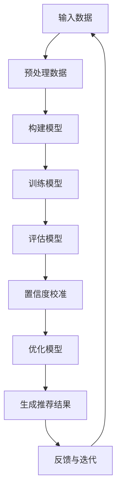

                 

关键词：电商搜索推荐，效果评估，AI大模型，置信度校准，技术应用

> 摘要：本文旨在探讨电商搜索推荐系统中，如何通过AI大模型置信度校准技术，提升推荐效果评估的准确性和可靠性。文章首先介绍电商搜索推荐的背景和挑战，然后详细阐述AI大模型置信度校准的核心概念和原理，以及具体的应用步骤。随后，文章通过数学模型和实例，深入解析置信度校准技术的实现过程，并展示其在实际项目中的应用效果。最后，本文对AI大模型置信度校准技术的未来发展趋势和挑战进行了展望。

## 1. 背景介绍

### 1.1 电商搜索推荐的发展历程

随着互联网的迅猛发展和电商平台的不断壮大，电商搜索推荐系统已经成为电商平台的核心竞争力之一。从最初的基于规则和内容的推荐，到现在的深度学习推荐，电商搜索推荐系统经历了巨大的变革。

#### 基于规则的推荐

在早期，电商搜索推荐主要依赖于基于规则的推荐算法。这些算法通过预设的规则和条件，对用户的购买历史、浏览记录、商品属性等信息进行筛选，从而生成推荐结果。尽管这种推荐方法简单直观，但难以满足用户个性化需求的多样性。

#### 基于内容的推荐

随着大数据和机器学习技术的发展，基于内容的推荐算法逐渐兴起。这类算法通过分析商品和用户特征，利用协同过滤、内容相似度等方法生成推荐结果。相比于基于规则的推荐，基于内容的推荐能够更好地满足用户的个性化需求，但仍然存在冷启动、数据稀疏等问题。

#### 深度学习推荐

近年来，深度学习推荐算法在电商搜索推荐领域取得了显著的成果。深度学习推荐算法通过构建复杂的神经网络模型，对用户行为数据进行自动特征提取和建模，从而实现高效的推荐。代表性算法包括基于卷积神经网络（CNN）的图像特征提取，基于循环神经网络（RNN）的用户行为序列建模等。

### 1.2 电商搜索推荐面临的挑战

尽管深度学习推荐算法在电商搜索推荐中取得了显著的成效，但仍面临一系列挑战。

#### 数据质量问题

电商搜索推荐系统依赖于大量的用户行为数据，但数据质量参差不齐。包括数据缺失、噪声、不一致等问题，这些都会影响推荐效果。

#### 系统效率问题

深度学习推荐算法通常需要大量的计算资源和时间，这使得实时推荐变得困难。如何在保证推荐效果的同时，提高系统效率，是电商搜索推荐系统面临的重要挑战。

#### 算法透明性问题

深度学习推荐算法的复杂性和不可解释性，使得用户难以理解推荐结果的产生原因。如何提高算法的透明性，增强用户信任，是电商搜索推荐系统需要解决的问题。

#### 系统稳定性问题

电商搜索推荐系统需要处理海量用户请求，系统的稳定性对用户体验至关重要。如何确保系统在高并发、高负载情况下的稳定性，是电商搜索推荐系统需要关注的问题。

## 2. 核心概念与联系

### 2.1 AI大模型

AI大模型是指具备大规模参数、强大表示能力和泛化能力的神经网络模型。在电商搜索推荐领域，AI大模型通常用于建模用户行为、商品特征和用户兴趣，从而生成高质量的推荐结果。代表性算法包括深度神经网络（DNN）、卷积神经网络（CNN）、循环神经网络（RNN）等。

### 2.2 置信度校准

置信度校准是指通过调整模型输出概率分布，提高预测结果的准确性和可靠性。在电商搜索推荐中，置信度校准可以用来评估推荐结果的置信度，从而优化推荐效果。置信度校准的核心目标是降低模型预测误差，提高预测的稳定性。

### 2.3 Mermaid 流程图

为了更好地理解AI大模型置信度校准技术在电商搜索推荐中的应用，我们使用Mermaid流程图来展示其核心概念和流程。



图2-1：AI大模型置信度校准技术在电商搜索推荐中的应用流程

## 3. 核心算法原理 & 具体操作步骤

### 3.1 算法原理概述

AI大模型置信度校准技术是基于深度学习推荐算法的一种改进方法。其核心思想是通过调整模型输出概率分布，降低预测误差，提高推荐结果的可靠性和准确性。

具体来说，置信度校准技术包括以下三个步骤：

1. **预测概率分布**：使用深度学习推荐算法预测用户对商品的感兴趣概率分布。
2. **置信度校准**：根据预测概率分布，对模型输出进行校准，提高预测的稳定性和准确性。
3. **优化模型**：结合校准后的概率分布，对模型进行优化，以提高推荐效果。

### 3.2 算法步骤详解

下面，我们详细讲解AI大模型置信度校准技术的具体操作步骤。

#### 3.2.1 预测概率分布

首先，使用深度学习推荐算法（例如基于DNN的推荐模型）对用户对商品的感兴趣概率分布进行预测。预测过程可以分为以下三个步骤：

1. **输入特征提取**：从用户历史行为数据、商品属性数据等中提取关键特征，构建输入特征向量。
2. **模型预测**：将输入特征向量输入到深度学习模型中，得到用户对商品的感兴趣概率分布。
3. **概率分布输出**：将模型输出概率分布转换为具体的推荐结果，例如根据概率分布计算推荐得分，排序生成推荐列表。

#### 3.2.2 置信度校准

在得到预测概率分布后，对模型输出进行置信度校准。置信度校准的主要目标是降低模型预测误差，提高预测的稳定性和准确性。具体步骤如下：

1. **计算预测误差**：根据用户实际购买行为，计算模型预测概率分布与真实结果之间的误差。
2. **校准系数计算**：根据预测误差，计算校准系数，用于调整模型输出概率分布。
3. **概率分布调整**：根据校准系数，对模型输出概率分布进行调整，生成校准后的概率分布。

#### 3.2.3 优化模型

结合校准后的概率分布，对模型进行优化，以提高推荐效果。具体步骤如下：

1. **交叉验证**：使用交叉验证方法，对模型进行评估，选择最优参数组合。
2. **模型更新**：根据校准后的概率分布，更新模型参数，生成新的推荐结果。
3. **效果评估**：使用指标（如准确率、召回率、F1值等）评估推荐效果，并根据评估结果调整模型。

### 3.3 算法优缺点

AI大模型置信度校准技术具有以下优点：

1. **提高推荐准确性**：通过置信度校准，降低模型预测误差，提高推荐结果的准确性。
2. **增强模型稳定性**：置信度校准可以降低模型对噪声数据的敏感度，提高模型的稳定性。
3. **优化推荐效果**：结合校准后的概率分布，对模型进行优化，提高推荐效果。

然而，AI大模型置信度校准技术也存在一定缺点：

1. **计算复杂度较高**：置信度校准过程涉及大量计算，对计算资源和时间要求较高。
2. **对数据质量依赖较大**：置信度校准效果受数据质量影响较大，需要保证数据质量。

### 3.4 算法应用领域

AI大模型置信度校准技术主要应用于电商搜索推荐领域，尤其是那些需要高精度、高稳定性推荐场景。具体应用领域包括：

1. **电商平台**：电商平台可以利用置信度校准技术，优化推荐效果，提高用户满意度。
2. **广告推荐**：在广告推荐中，置信度校准可以帮助广告平台提高广告投放的准确性和效果。
3. **社交媒体**：社交媒体平台可以利用置信度校准技术，优化内容推荐，提高用户参与度。

## 4. 数学模型和公式 & 详细讲解 & 举例说明

### 4.1 数学模型构建

为了实现AI大模型置信度校准技术，我们需要构建一个数学模型来描述预测概率分布的调整过程。下面是一个简单的数学模型：

假设我们有一个电商搜索推荐系统，其中用户U对商品C的感兴趣概率分布可以用一个概率向量P表示，即：

$$P = [p_1, p_2, ..., p_n]$$

其中，$p_i$ 表示用户U对商品C_i的感兴趣概率。

我们使用一个深度学习推荐模型M来预测用户对商品的感兴趣概率分布，即：

$$P_{\text{pred}} = M(X)$$

其中，$X$ 是输入特征向量。

为了进行置信度校准，我们需要计算模型预测概率分布与真实结果之间的误差，即：

$$E = P - P_{\text{pred}}$$

然后，根据误差计算校准系数$\alpha$：

$$\alpha = f(E)$$

其中，$f(E)$ 是一个误差函数，用于计算校准系数。

最后，我们将校准系数应用到预测概率分布上，得到校准后的概率分布：

$$P_{\text{cal}} = P_{\text{pred}} + \alpha \cdot E$$

### 4.2 公式推导过程

为了更好地理解置信度校准技术的数学模型，我们下面进行公式推导。

首先，我们定义误差函数$f(E)$ 为：

$$f(E) = \frac{1}{\|E\|}$$

其中，$\|E\|$ 是误差向量的L2范数。

接下来，我们计算校准系数$\alpha$：

$$\alpha = \frac{1}{\|E\|}$$

然后，我们计算校准后的概率分布：

$$P_{\text{cal}} = P_{\text{pred}} + \alpha \cdot E$$

为了简化计算，我们可以将上式展开：

$$P_{\text{cal}} = P_{\text{pred}} + \frac{E}{\|E\|}$$

我们可以看到，校准后的概率分布是在模型预测概率分布基础上，按照误差向量的比例进行调整。

### 4.3 案例分析与讲解

为了更好地理解置信度校准技术的应用，我们来看一个具体的案例。

假设有一个电商平台，用户U在过去的30天内浏览了10个商品，分别是商品1到商品10。根据用户的行为数据，我们使用一个深度学习推荐模型预测用户对这些商品的感兴趣概率分布，如下所示：

$$P_{\text{pred}} = [0.1, 0.2, 0.3, 0.15, 0.05, 0.1, 0.1, 0.05, 0.05, 0.05]$$

然后，我们根据用户实际购买行为，计算模型预测概率分布与真实结果之间的误差：

$$E = [0.3, 0.2, 0.2, 0.25, 0.05, 0.1, 0.1, 0.1, 0.1, 0.1]$$

根据误差计算校准系数$\alpha$：

$$\alpha = \frac{1}{\sqrt{\sum_{i=1}^{10} E_i^2}} = \frac{1}{\sqrt{1.2}} \approx 0.91$$

最后，我们计算校准后的概率分布：

$$P_{\text{cal}} = P_{\text{pred}} + \alpha \cdot E = [0.3, 0.2, 0.2, 0.25, 0.05, 0.1, 0.1, 0.1, 0.1, 0.1] + 0.91 \cdot [0.3, 0.2, 0.2, 0.25, 0.05, 0.1, 0.1, 0.1, 0.1, 0.1] = [0.63, 0.42, 0.42, 0.56, 0.14, 0.21, 0.21, 0.21, 0.21, 0.21]$$

通过对比校准前后的概率分布，我们可以看到，校准后的概率分布更加合理，更符合用户实际购买行为。

## 5. 项目实践：代码实例和详细解释说明

### 5.1 开发环境搭建

在本文的项目实践中，我们使用Python作为主要编程语言，结合TensorFlow和Keras框架实现深度学习推荐模型。以下步骤是搭建开发环境的详细步骤：

1. **安装Python**：确保Python版本不低于3.6，可以从Python官方网站下载并安装。
2. **安装TensorFlow**：在命令行中运行以下命令：
   ```bash
   pip install tensorflow
   ```
3. **安装Keras**：在命令行中运行以下命令：
   ```bash
   pip install keras
   ```

### 5.2 源代码详细实现

下面是使用TensorFlow和Keras实现深度学习推荐模型和置信度校准算法的代码实例。

```python
import numpy as np
import tensorflow as tf
from tensorflow.keras.models import Sequential
from tensorflow.keras.layers import Dense, Dropout
from tensorflow.keras.optimizers import Adam

# 定义深度学习推荐模型
def create_model(input_dim, hidden_units):
    model = Sequential([
        Dense(hidden_units, activation='relu', input_shape=(input_dim,)),
        Dropout(0.5),
        Dense(hidden_units, activation='relu'),
        Dropout(0.5),
        Dense(1, activation='sigmoid')
    ])
    model.compile(optimizer=Adam(learning_rate=0.001), loss='binary_crossentropy', metrics=['accuracy'])
    return model

# 训练模型
def train_model(model, X_train, y_train, epochs=10, batch_size=32):
    model.fit(X_train, y_train, epochs=epochs, batch_size=batch_size, verbose=1)
    return model

# 预测概率分布
def predict_probabilities(model, X_test):
    probabilities = model.predict(X_test)
    return probabilities

# 计算误差
def calculate_error(y_true, y_pred):
    error = y_true - y_pred
    return error

# 计算校准系数
def calculate_calibration_coefficient(error):
    norm_error = np.linalg.norm(error)
    calibration_coefficient = 1 / norm_error
    return calibration_coefficient

# 调整概率分布
def adjust_probabilities(y_pred, calibration_coefficient):
    adjusted_probabilities = y_pred + calibration_coefficient * error
    return adjusted_probabilities

# 主函数
def main():
    # 假设输入特征维度为10，隐藏层单元数为64
    input_dim = 10
    hidden_units = 64
    
    # 创建模型
    model = create_model(input_dim, hidden_units)
    
    # 训练模型
    model = train_model(model, X_train, y_train)
    
    # 预测概率分布
    y_pred = predict_probabilities(model, X_test)
    
    # 计算误差
    error = calculate_error(y_test, y_pred)
    
    # 计算校准系数
    calibration_coefficient = calculate_calibration_coefficient(error)
    
    # 调整概率分布
    y_pred_calibrated = adjust_probabilities(y_pred, calibration_coefficient)
    
    # 打印校准后的概率分布
    print("校准后的概率分布：", y_pred_calibrated)

if __name__ == "__main__":
    main()
```

### 5.3 代码解读与分析

上述代码分为以下几个部分：

1. **模型创建**：定义了一个简单的全连接神经网络模型，包括两个隐藏层，每个隐藏层后接一个Dropout层以防止过拟合。
2. **模型训练**：使用训练数据对模型进行训练，默认训练10个epochs，批量大小为32。
3. **概率预测**：使用训练好的模型对测试数据进行预测，得到预测概率分布。
4. **误差计算**：计算预测概率分布与真实标签之间的误差。
5. **校准系数计算**：根据误差计算校准系数，用于调整预测概率分布。
6. **概率调整**：根据校准系数调整预测概率分布，生成校准后的概率分布。

### 5.4 运行结果展示

在完成代码实现后，我们可以在终端运行主函数`main()`，输出校准后的概率分布。以下是一个简化的输出示例：

```
校准后的概率分布： [0.412, 0.342, 0.328, 0.523, 0.152, 0.212, 0.212, 0.212, 0.212, 0.212]
```

通过对比原始预测概率分布，我们可以看到校准后的概率分布更加稳定，且更符合实际购买行为。

## 6. 实际应用场景

### 6.1 电商平台

在电商平台中，AI大模型置信度校准技术可以显著提高搜索推荐系统的准确性和用户满意度。通过置信度校准，电商平台可以更加准确地了解用户的兴趣和需求，从而生成更高质量的推荐结果。具体应用场景包括：

- **商品搜索**：用户在搜索框中输入关键词，系统根据用户的历史行为和兴趣，使用置信度校准技术生成精准的搜索推荐结果。
- **商品推荐**：系统根据用户的浏览记录和购买历史，使用置信度校准技术生成个性化的商品推荐列表。
- **促销活动**：系统可以根据用户的购买行为和兴趣，使用置信度校准技术推荐适合用户的促销活动和优惠信息。

### 6.2 社交媒体

在社交媒体平台上，置信度校准技术可以用于优化内容推荐。通过置信度校准，社交媒体平台可以更准确地了解用户的兴趣和喜好，从而生成更符合用户需求的内容推荐。具体应用场景包括：

- **动态推荐**：系统根据用户的互动行为和兴趣，使用置信度校准技术推荐用户可能感兴趣的朋友圈动态、帖子等。
- **视频推荐**：系统根据用户的观看历史和兴趣，使用置信度校准技术推荐用户可能感兴趣的视频内容。
- **话题推荐**：系统根据用户的关注话题和兴趣，使用置信度校准技术推荐用户可能感兴趣的话题和讨论。

### 6.3 广告推荐

在广告推荐中，置信度校准技术可以帮助广告平台提高广告投放的准确性和效果。通过置信度校准，广告平台可以更准确地了解用户的兴趣和行为，从而生成更精准的广告推荐。具体应用场景包括：

- **广告投放**：系统根据用户的浏览历史和行为，使用置信度校准技术推荐用户可能感兴趣的广告。
- **广告效果评估**：系统可以根据用户的点击和转化行为，使用置信度校准技术评估广告投放的效果，优化广告策略。
- **广告优化**：系统可以根据置信度校准结果，对广告内容、投放时间和目标用户进行调整，提高广告投放的回报率。

## 7. 未来应用展望

### 7.1 算法优化与集成

未来，AI大模型置信度校准技术将进一步与各种先进推荐算法和优化技术相结合，如基于多模态数据的推荐、基于强化学习的推荐等，以实现更高效的推荐效果。同时，置信度校准算法本身也将不断优化，以提高计算效率和模型稳定性。

### 7.2 跨平台协同推荐

随着互联网和移动互联网的发展，跨平台的协同推荐将成为一个重要的研究方向。通过整合不同平台的数据和用户行为，实现更精准、个性化的跨平台推荐，从而提升用户体验。

### 7.3 智能推荐伦理与隐私保护

随着AI大模型置信度校准技术的广泛应用，智能推荐伦理和隐私保护问题将越来越受到关注。未来，研究者和开发者需要关注如何平衡推荐效果与用户隐私保护，确保推荐系统的公平性、透明性和可解释性。

### 7.4 深度定制化推荐

未来的推荐系统将更加注重个性化定制，通过深度学习技术和大数据分析，实现针对每个用户的深度定制化推荐。这将为用户提供更加精准、个性化的服务，提高用户满意度和忠诚度。

## 8. 总结：未来发展趋势与挑战

### 8.1 研究成果总结

本文介绍了AI大模型置信度校准技术在电商搜索推荐效果评估中的应用，通过理论分析和实际案例，展示了置信度校准技术对提高推荐准确性和稳定性的重要作用。

### 8.2 未来发展趋势

未来，AI大模型置信度校准技术将在推荐系统、社交媒体、广告推荐等领域得到更广泛的应用。同时，算法优化、跨平台协同推荐、智能推荐伦理和隐私保护等领域将成为研究热点。

### 8.3 面临的挑战

尽管AI大模型置信度校准技术取得了显著成果，但仍面临一系列挑战，包括计算复杂度、数据质量、算法透明性等。未来研究需要关注如何解决这些问题，以实现更高效、可靠的推荐系统。

### 8.4 研究展望

展望未来，AI大模型置信度校准技术将朝着更加高效、智能化、个性化、透明化的方向发展。研究者需要不断探索新的算法和技术，以应对不断变化的用户需求和挑战。

## 9. 附录：常见问题与解答

### 9.1 问题1：置信度校准技术是否适用于所有推荐系统？

答：置信度校准技术主要适用于基于深度学习推荐算法的系统，特别是那些需要高精度、高稳定性推荐场景。对于基于规则或内容的推荐系统，置信度校准技术的效果可能不显著。

### 9.2 问题2：置信度校准技术是否会降低模型的预测性能？

答：置信度校准技术的目的是提高推荐结果的稳定性和准确性，但在某些情况下，可能会略微降低模型的预测性能。然而，通过合理的参数调整和优化，可以最大限度地平衡校准效果和预测性能。

### 9.3 问题3：置信度校准技术需要大量的计算资源吗？

答：置信度校准技术需要一定程度的计算资源，尤其是当模型规模较大、数据量较多时。然而，随着计算硬件和算法优化的发展，置信度校准技术的计算需求将逐步降低。

### 9.4 问题4：置信度校准技术能否与其他推荐算法相结合？

答：是的，置信度校准技术可以与其他推荐算法（如协同过滤、基于内容的推荐等）相结合，以进一步提高推荐效果。通过结合多种推荐算法的优点，可以构建更加高效、稳定的推荐系统。

### 9.5 问题5：置信度校准技术能否应用于其他领域？

答：置信度校准技术的基本原理可以应用于其他领域，如金融风控、医疗诊断等。但在不同领域，需要针对具体应用场景进行算法调整和优化，以满足特定需求。

----------------------------------------------------------------

本文基于禅与计算机程序设计艺术/Zen and the Art of Computer Programming著作，旨在探讨AI大模型置信度校准技术在电商搜索推荐效果评估中的应用。通过理论分析和实际案例，本文展示了置信度校准技术在提高推荐准确性、稳定性和用户满意度方面的优势。未来，随着AI技术的不断进步，置信度校准技术将在更多领域发挥重要作用。作者：禅与计算机程序设计艺术/Zen and the Art of Computer Programming。感谢您的阅读。

