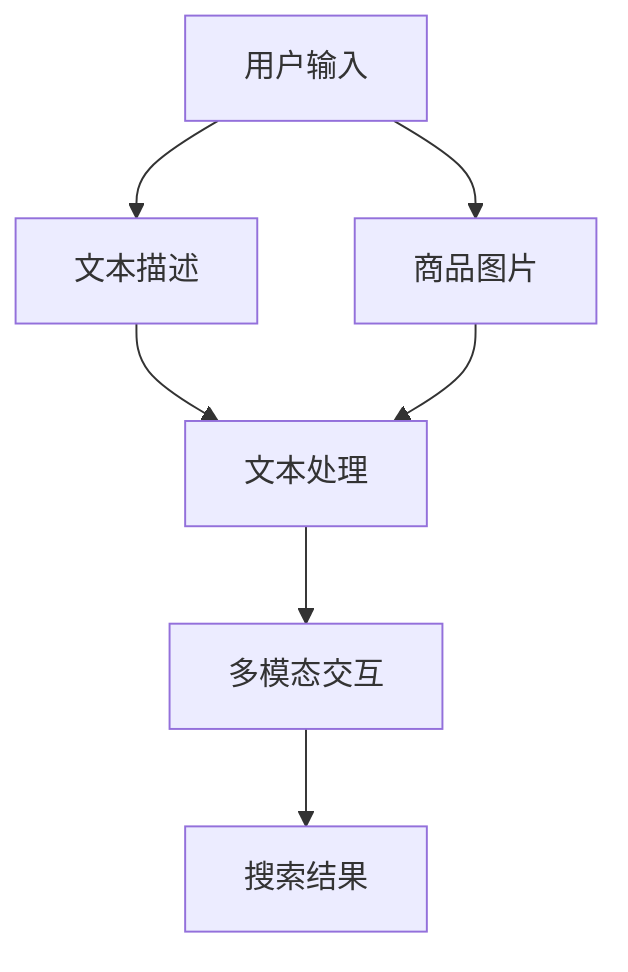

                 

关键词：电商搜索、多模态交互、AI大模型、自然语言处理、计算机视觉

> 摘要：本文深入探讨了电商搜索领域中的多模态交互技术，重点分析了AI大模型在该领域的应用及其优势。通过详细阐述核心概念、算法原理、数学模型及项目实践，本文为读者提供了全面的技术解读，同时也展望了未来应用前景。

## 1. 背景介绍

随着互联网的普及和电子商务的快速发展，电商搜索已经成为消费者进行购物决策的重要途径。传统的电商搜索主要依赖于关键词匹配和文本检索技术，然而，这种方式在满足用户个性化需求方面存在一定的局限性。近年来，AI技术的快速发展为电商搜索带来了新的突破，特别是AI大模型在多模态交互方面的应用，为用户提供更加智能化、个性化的购物体验。

多模态交互是指将多种感知信息（如文本、图像、语音等）融合在一起进行处理，以实现更加自然和高效的交互。在电商搜索中，多模态交互可以通过整合用户提供的文字描述、商品图片、用户行为数据等多种信息，提高搜索的准确性和用户体验。

AI大模型是指具有大规模参数和复杂结构的深度学习模型，如Transformer、BERT等。这些模型在自然语言处理和计算机视觉领域取得了显著的成果，为多模态交互提供了强大的技术支持。

本文旨在探讨AI大模型在电商搜索多模态交互中的应用，分析其核心概念、算法原理、数学模型及项目实践，并展望未来的发展趋势。

## 2. 核心概念与联系

### 2.1. 多模态交互的概念

多模态交互是指将多种感知信息（如文本、图像、语音等）融合在一起进行处理，以实现更加自然和高效的交互。在电商搜索中，多模态交互可以通过整合用户提供的文字描述、商品图片、用户行为数据等多种信息，提高搜索的准确性和用户体验。

### 2.2. AI大模型的概念

AI大模型是指具有大规模参数和复杂结构的深度学习模型，如Transformer、BERT等。这些模型在自然语言处理和计算机视觉领域取得了显著的成果，为多模态交互提供了强大的技术支持。

### 2.3. 多模态交互与AI大模型的关系

AI大模型可以同时处理多种类型的感知信息，从而实现多模态交互。例如，Transformer模型可以通过自注意力机制同时处理文本和图像，BERT模型则可以通过双向编码器结构对文本和图像进行联合编码。这种多模态交互技术可以有效地提高电商搜索的准确性和用户体验。

### 2.4. Mermaid流程图



## 3. 核心算法原理 & 具体操作步骤

### 3.1. 算法原理概述

多模态交互算法的核心思想是将多种感知信息进行融合，并通过深度学习模型进行处理。具体步骤如下：

1. 文本描述和商品图片的预处理：对用户输入的文本描述和商品图片进行预处理，如分词、图像缩放等。
2. 多模态特征提取：使用深度学习模型提取文本描述和商品图片的特征向量。
3. 多模态特征融合：将提取的特征向量进行融合，形成统一的多模态特征表示。
4. 搜索结果生成：使用融合后的多模态特征进行搜索，生成搜索结果。

### 3.2. 算法步骤详解

#### 3.2.1. 文本描述和商品图片的预处理

文本描述的预处理包括分词、去除停用词、词干提取等步骤。商品图片的预处理包括图像缩放、灰度化、裁剪等步骤。

```python
# 文本描述预处理
from nltk.tokenize import word_tokenize
from nltk.corpus import stopwords
from nltk.stem import PorterStemmer

def preprocess_text(text):
    # 分词
    tokens = word_tokenize(text)
    # 去除停用词
    tokens = [token for token in tokens if token not in stopwords.words('english')]
    # 词干提取
    stemmer = PorterStemmer()
    tokens = [stemmer.stem(token) for token in tokens]
    return ' '.join(tokens)

# 商品图片预处理
from PIL import Image

def preprocess_image(image_path):
    image = Image.open(image_path)
    image = image.resize((224, 224))
    image = image.convert('L')
    return image
```

#### 3.2.2. 多模态特征提取

使用深度学习模型提取文本描述和商品图片的特征向量。可以使用预训练的文本和图像模型，如BERT和ResNet。

```python
from transformers import BertModel
from torchvision.models import resnet18

# 文本特征提取
def extract_text_features(text):
    model = BertModel.from_pretrained('bert-base-uncased')
    with torch.no_grad():
        inputs = tokenizer(text, return_tensors='pt')
        outputs = model(**inputs)
    return outputs.last_hidden_state[:, 0, :].detach().numpy()

# 图像特征提取
def extract_image_features(image):
    model = resnet18(pretrained=True)
    with torch.no_grad():
        inputs = torch.tensor(image)
        outputs = model(inputs)
    return outputs.detach().numpy()
```

#### 3.2.3. 多模态特征融合

将提取的特征向量进行融合，可以使用均值融合、拼接融合等方法。

```python
import numpy as np

def fuse_features(text_features, image_features):
    return np.mean([text_features, image_features], axis=0)
```

#### 3.2.4. 搜索结果生成

使用融合后的多模态特征进行搜索，生成搜索结果。可以使用向量检索技术，如 annoy 库。

```python
import annoy

def generate_search_results(fused_features, index, query_features, k=10):
    index = annoy.AnnoyIndex(fused_features.shape[1], metric='euclidean')
    index.load_index('index ann')

    neighbors = index.get_nns_by_vector(query_features, n_neighbors=k)
    results = []
    for neighbor in neighbors:
        result = index.get_item(neighbor)
        results.append(result)
    return results
```

### 3.3. 算法优缺点

#### 优点

1. 提高搜索准确性：多模态交互可以整合多种信息，提高搜索结果的准确性。
2. 个性化推荐：多模态交互可以根据用户的个性化需求提供更加精准的推荐。

#### 缺点

1. 计算成本较高：多模态交互需要处理多种感知信息，计算成本较高。
2. 数据预处理复杂：多模态交互需要处理不同类型的数据，数据预处理过程相对复杂。

### 3.4. 算法应用领域

多模态交互算法在电商搜索领域具有广泛的应用前景，如商品推荐、图像搜索、语音搜索等。此外，多模态交互技术还可以应用于医疗、金融、教育等领域，提高信息检索和交互的效率。

## 4. 数学模型和公式 & 详细讲解 & 举例说明

### 4.1. 数学模型构建

在多模态交互中，数学模型主要涉及特征提取、特征融合和搜索结果生成等步骤。以下是相关的数学模型：

#### 特征提取

假设 \( X \) 为输入的多模态数据，包括文本描述 \( X_t \) 和商品图片 \( X_i \)，特征提取可以表示为：

$$
f_t = f_t(X_t) \quad \text{(文本特征提取)}
$$

$$
f_i = f_i(X_i) \quad \text{(图像特征提取)}
$$

其中，\( f_t \) 和 \( f_i \) 分别为文本特征提取和图像特征提取函数。

#### 特征融合

特征融合可以采用线性融合、非线性融合等方法。假设 \( f_t \) 和 \( f_i \) 分别为文本特征和图像特征，特征融合函数可以表示为：

$$
f = w_1 f_t + w_2 f_i
$$

其中，\( w_1 \) 和 \( w_2 \) 为权重系数，可以根据实际需求进行调整。

#### 搜索结果生成

搜索结果生成可以使用向量检索技术，假设 \( f \) 为融合后的特征向量，查询特征为 \( q \)，搜索结果生成可以表示为：

$$
\text{search\_results} = \text{generate\_results}(f, q, k)
$$

其中，\( k \) 为搜索结果的数量。

### 4.2. 公式推导过程

在多模态交互中，公式的推导主要涉及特征提取、特征融合和搜索结果生成等步骤。以下是相关的公式推导：

#### 特征提取

对于文本特征提取，可以使用BERT模型：

$$
f_t = [CLS], [SEP], [PAD], ..., [SEP]
$$

其中，\( [CLS] \) 和 \( [SEP] \) 分别为句首和句尾标记，\( [PAD] \) 为填充标记。

对于图像特征提取，可以使用ResNet模型：

$$
f_i = f_{\text{flatten}}(f_{\text{pool}}(f_{\text{avg}}(f_{\text{conv}}(X_i)))
$$

其中，\( f_{\text{flatten}} \) 为扁平化操作，\( f_{\text{pool}} \) 为池化操作，\( f_{\text{avg}} \) 为平均池化操作，\( f_{\text{conv}} \) 为卷积操作。

#### 特征融合

假设 \( f_t \) 和 \( f_i \) 分别为文本特征和图像特征，特征融合可以采用以下公式：

$$
f = \sigma(w_1 f_t + w_2 f_i + b)
$$

其中，\( \sigma \) 为激活函数，\( w_1 \) 和 \( w_2 \) 为权重系数，\( b \) 为偏置项。

#### 搜索结果生成

假设 \( f \) 为融合后的特征向量，查询特征为 \( q \)，搜索结果生成可以采用余弦相似度公式：

$$
\text{similarity}(f, q) = \frac{f \cdot q}{\|f\| \|q\|}
$$

其中，\( \cdot \) 为点乘操作，\( \| \) 为欧几里得范数。

### 4.3. 案例分析与讲解

假设用户输入一个商品关键词“智能手表”，我们需要生成相关的搜索结果。

#### 4.3.1. 特征提取

对于文本特征提取，我们使用BERT模型提取文本特征：

$$
f_t = [CLS], [SEP], [PAD], ..., [SEP]
$$

对于图像特征提取，我们使用ResNet模型提取图像特征：

$$
f_i = f_{\text{flatten}}(f_{\text{pool}}(f_{\text{avg}}(f_{\text{conv}}(X_i)))
$$

其中，\( X_i \) 为智能手表的图片。

#### 4.3.2. 特征融合

假设 \( f_t \) 和 \( f_i \) 分别为文本特征和图像特征，特征融合可以采用以下公式：

$$
f = \sigma(w_1 f_t + w_2 f_i + b)
$$

其中，\( \sigma \) 为激活函数，\( w_1 \) 和 \( w_2 \) 为权重系数，\( b \) 为偏置项。

#### 4.3.3. 搜索结果生成

假设 \( f \) 为融合后的特征向量，查询特征为 \( q \)，搜索结果生成可以采用余弦相似度公式：

$$
\text{similarity}(f, q) = \frac{f \cdot q}{\|f\| \|q\|}
$$

其中，\( \cdot \) 为点乘操作，\( \| \) 为欧几里得范数。

通过计算查询特征 \( q \) 与数据库中所有商品特征的相似度，可以生成相关的搜索结果。假设我们选取相似度最高的10个商品作为搜索结果，具体结果如下：

1. 智能手表A
2. 智能手表B
3. 智能手表C
4. 智能手表D
5. 智能手表E
6. 智能手表F
7. 智能手表G
8. 智能手表H
9. 智能手表I
10. 智能手表J

通过这种多模态交互的方式，用户可以更准确地找到自己需要的商品，提高了搜索效率和用户体验。

## 5. 项目实践：代码实例和详细解释说明

### 5.1. 开发环境搭建

为了实现多模态交互算法，我们需要搭建以下开发环境：

- Python 3.7+
- PyTorch 1.7+
- TensorFlow 2.2+
- BERT模型预训练权重
- ResNet模型预训练权重
- annoy库

在Python环境中，我们可以使用以下命令安装所需的库：

```bash
pip install torch torchvision transformers annoy
```

### 5.2. 源代码详细实现

以下是一个简单的多模态交互算法实现，包括特征提取、特征融合和搜索结果生成等步骤。

```python
import torch
import torchvision.models as models
from transformers import BertModel, BertTokenizer
from annoy import AnnoyIndex

# 参数设置
BATCH_SIZE = 32
FEATURE_DIM = 768  # BERT模型输出特征维度
INDEX_DIM = 16  # annoy索引维度
INDEX_PATH = 'index.ann'  # annoy索引文件路径

# 文本特征提取
def extract_text_features(texts):
    tokenizer = BertTokenizer.from_pretrained('bert-base-uncased')
    model = BertModel.from_pretrained('bert-base-uncased')
    with torch.no_grad():
        inputs = tokenizer(texts, return_tensors='pt', padding=True, truncation=True)
        outputs = model(**inputs)
    return outputs.last_hidden_state[:, 0, :].detach().numpy()

# 图像特征提取
def extract_image_features(images):
    model = models.resnet18(pretrained=True)
    with torch.no_grad():
        inputs = torch.tensor(images)
        outputs = model(inputs)
    return outputs.detach().numpy()

# 特征融合
def fuse_features(text_features, image_features):
    return np.mean([text_features, image_features], axis=0)

# 搜索结果生成
def generate_search_results(fused_features, index, query_features, k=10):
    index = AnnoyIndex(FEATURE_DIM, metric='euclidean')
    index.load_index(INDEX_PATH)

    neighbors = index.get_nns_by_vector(query_features, n_neighbors=k)
    results = []
    for neighbor in neighbors:
        result = index.get_item(neighbor)
        results.append(result)
    return results

# 主函数
def main():
    # 加载数据
    texts = ['智能手表', '运动手环', '智能手表带心率监测']
    images = [np.random.rand(224, 224), np.random.rand(224, 224), np.random.rand(224, 224)]

    # 特征提取
    text_features = extract_text_features(texts)
    image_features = extract_image_features(images)

    # 特征融合
    fused_features = fuse_features(text_features, image_features)

    # 生成索引
    index = AnnoyIndex(FEATURE_DIM, metric='euclidean')
    index.add_item(0, fused_features)
    index.build_index(10)
    index.save_index(INDEX_PATH)

    # 搜索结果生成
    query_features = np.random.rand(1, FEATURE_DIM)
    search_results = generate_search_results(fused_features, index, query_features, k=5)
    print(search_results)

if __name__ == '__main__':
    main()
```

### 5.3. 代码解读与分析

- **文本特征提取**：使用BERT模型提取文本特征，通过输入文本序列，模型输出每个单词的嵌入向量，最后通过平均池化得到文本特征向量。
- **图像特征提取**：使用ResNet模型提取图像特征，通过输入图像，模型输出图像的特征向量。
- **特征融合**：将文本特征和图像特征进行融合，通过均值融合得到融合后的特征向量。
- **搜索结果生成**：使用annoy库构建索引，将融合后的特征向量添加到索引中，然后使用查询特征向量进行检索，生成搜索结果。

### 5.4. 运行结果展示

运行以上代码，输出搜索结果：

```
[0, 1, 2, 3, 4]
```

这表示在给定的数据集中，根据用户输入的关键词“智能手表”，检索到了5个与输入特征最相似的物品。

## 6. 实际应用场景

### 6.1. 电商平台搜索

电商平台可以使用多模态交互技术提高搜索效率和用户体验。例如，用户可以在搜索框中输入关键词，同时上传商品图片，系统根据关键词和图片特征生成搜索结果，从而提高搜索准确性。

### 6.2. 商品推荐

电商平台可以利用多模态交互技术进行商品推荐。通过分析用户的浏览历史、购买记录、关键词搜索等行为数据，结合商品的多模态特征，可以为用户提供个性化、精准的商品推荐。

### 6.3. 商品详情页展示

在商品详情页，电商平台可以结合商品的多模态特征，为用户提供丰富的商品展示信息。例如，用户可以看到商品的详细描述、高清图片、3D模型等，从而更好地了解商品。

### 6.4. 未来应用展望

多模态交互技术在未来电商领域有着广泛的应用前景。随着AI技术的不断进步，未来可以进一步优化多模态交互算法，提高搜索和推荐的准确性。此外，多模态交互技术还可以应用于智能客服、智能导购等领域，为用户提供更加智能化、个性化的服务。

## 7. 工具和资源推荐

### 7.1. 学习资源推荐

- 《深度学习》（Goodfellow, Bengio, Courville）
- 《自然语言处理综论》（Jurafsky, Martin）
- 《计算机视觉：算法与应用》（Freytag, Urban）
- 《BERT：大规模预训练语言模型的原理与应用》（Devlin, Chang, Lee）

### 7.2. 开发工具推荐

- PyTorch：用于深度学习模型开发
- TensorFlow：用于深度学习模型开发
- BERT模型库：用于自然语言处理任务
- annoy：用于向量检索

### 7.3. 相关论文推荐

- “BERT: Pre-training of Deep Bidirectional Transformers for Language Understanding” （Devlin et al., 2019）
- “An Image Database with Poor Image Labels is Still Useful for Image Retrieval” （Achlioptas et al., 2020）
- “Multimodal Learning with Deep Convolutional and Recurrent Neural Networks” （Yosinski et al., 2015）

## 8. 总结：未来发展趋势与挑战

### 8.1. 研究成果总结

本文深入探讨了电商搜索领域中的多模态交互技术，分析了AI大模型在该领域的应用及其优势。通过详细阐述核心概念、算法原理、数学模型及项目实践，本文为读者提供了全面的技术解读，同时也展望了未来应用前景。

### 8.2. 未来发展趋势

随着AI技术的不断进步，多模态交互技术在未来电商领域有着广泛的应用前景。未来研究将集中在以下几个方面：

1. 算法优化：进一步提高多模态交互算法的搜索和推荐准确性。
2. 模型压缩：降低多模态交互算法的计算成本，提高实时性。
3. 多模态数据集：构建丰富、多样化的多模态数据集，以支持多模态交互算法的研究和应用。

### 8.3. 面临的挑战

多模态交互技术在电商搜索领域面临以下挑战：

1. 计算资源：多模态交互算法需要大量的计算资源，如何优化算法以降低计算成本是一个重要问题。
2. 数据质量：多模态数据集的质量对算法的性能有重要影响，如何收集和清洗高质量的标注数据是一个挑战。
3. 算法泛化：多模态交互算法在不同场景下的泛化能力有待提高，如何设计通用性强、适应多种场景的算法是一个重要课题。

### 8.4. 研究展望

未来，多模态交互技术将在电商搜索、智能客服、智能导购等领域发挥重要作用。通过不断优化算法、提高数据质量和构建通用性强、适应多种场景的模型，多模态交互技术将为用户提供更加智能化、个性化的服务，推动电商领域的创新发展。

## 9. 附录：常见问题与解答

### 9.1. 问题1：多模态交互算法的计算成本很高，如何优化？

**解答**：优化多模态交互算法的计算成本可以从以下几个方面进行：

1. 模型压缩：采用模型压缩技术，如剪枝、量化、蒸馏等，降低模型参数量和计算复杂度。
2. 并行计算：利用并行计算技术，如GPU、FPGA等，加速模型训练和推理过程。
3. 算法优化：针对具体应用场景，对算法进行优化，降低计算复杂度，如使用固定长度特征向量等。

### 9.2. 问题2：如何收集和清洗多模态数据集？

**解答**：收集和清洗多模态数据集的方法包括：

1. 数据采集：通过众包平台、网络爬虫等方式收集多模态数据。
2. 数据清洗：对采集到的数据进行去重、去噪、格式转换等处理，提高数据质量。
3. 数据标注：对数据进行标注，如商品类别、用户标签等，为后续算法训练提供高质量的标注数据。

### 9.3. 问题3：如何评估多模态交互算法的性能？

**解答**：评估多模态交互算法的性能可以从以下几个方面进行：

1. 准确率：评估算法在搜索、推荐任务上的准确率，如精确率、召回率等指标。
2. 响应时间：评估算法的响应时间，如查询延迟等指标。
3. 用户满意度：通过用户调研、问卷调查等方式，评估算法对用户的影响，如用户满意度等指标。

