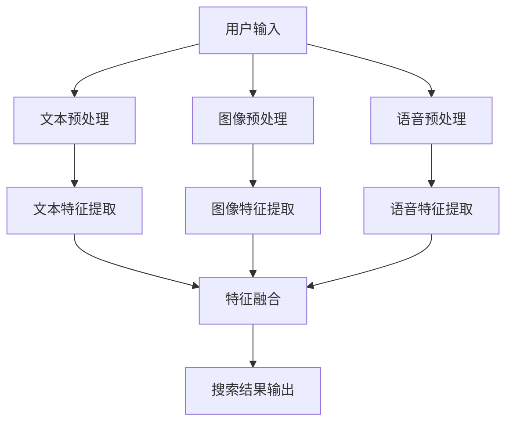

                 

关键词：电商搜索、多模态融合、AI大模型、数据融合、搜索优化、用户体验

> 摘要：随着电商行业的迅速发展，用户对于个性化、精准化搜索的需求日益增长。本文探讨了一种基于AI大模型的多模态融合方法，用于优化电商搜索体验。该方法通过整合文本、图像和语音等多种数据模态，实现了高效、精准的搜索结果输出，为电商行业带来了新的技术突破。

## 1. 背景介绍

电商搜索作为电子商务的核心功能之一，直接影响着用户的购物体验和平台的商业转化。然而，传统的电商搜索方法主要依赖于关键词匹配和文本相似度计算，这导致搜索结果存在一定程度的局限性和误差。例如，用户在搜索时可能会遇到以下问题：

- **模糊搜索**：用户输入的搜索词不够精确，导致搜索结果中包含大量无关信息。
- **同义词问题**：电商平台中的商品名称可能存在同义词或近义词，导致搜索结果不一致。
- **个性化不足**：传统搜索方法难以充分考虑用户的个人偏好和历史行为，无法提供个性化的推荐。

为了解决这些问题，近年来，越来越多的研究开始关注电商搜索的多模态融合。多模态融合通过整合文本、图像、语音等多种数据模态，能够更全面地理解用户需求，提供更精准的搜索结果。例如，用户可以通过上传商品图片、录制语音描述或结合文本关键词进行搜索，从而获得更加个性化的搜索体验。

本文将探讨一种基于AI大模型的多模态融合方法，该方法在电商搜索中展现了显著的性能提升，为用户提供了更加智能、高效的搜索服务。

## 2. 核心概念与联系

在深入探讨多模态融合方法之前，我们首先需要了解几个核心概念，并展示它们之间的联系。

### 2.1 多模态数据

多模态数据是指来自不同模态的数据，例如文本（text）、图像（image）、语音（audio）等。这些数据各自具有独特的特征和表达方式，但在描述和识别事物时，往往能够相互补充。

### 2.2 数据融合

数据融合是指将来自不同模态的数据进行整合，以提取更全面、更准确的信息。在多模态融合中，数据融合是关键步骤，它决定了搜索结果的准确性和用户满意度。

### 2.3 AI大模型

AI大模型是指具有大规模参数和复杂结构的深度学习模型，例如Transformer、BERT等。这些模型通过大量的数据训练，能够自动学习各种特征和模式，为多模态融合提供了强大的计算能力。

### 2.4 Mermaid 流程图

为了更直观地展示多模态融合的架构，我们使用Mermaid流程图描述整个工作流程。以下是多模态融合的流程图：



在流程图中，用户输入的信息通过不同的预处理步骤，转化为相应的特征表示，然后进行特征融合，最终输出搜索结果。

## 3. 核心算法原理 & 具体操作步骤

### 3.1 算法原理概述

多模态融合算法的核心思想是通过整合来自不同模态的数据，以获得更全面、更精准的搜索结果。具体来说，算法可以分为以下几个步骤：

1. **数据预处理**：对用户输入的文本、图像和语音数据进行预处理，提取出特征表示。
2. **特征提取**：利用深度学习模型，分别提取文本、图像和语音的特征表示。
3. **特征融合**：将不同模态的特征表示进行融合，生成一个统一的多模态特征表示。
4. **搜索结果输出**：基于融合后的多模态特征表示，进行搜索结果的输出和排序。

### 3.2 算法步骤详解

#### 3.2.1 数据预处理

数据预处理是算法的基础，它主要包括以下几个步骤：

- **文本预处理**：包括分词、去停用词、词向量化等操作，将文本数据转化为向量表示。
- **图像预处理**：包括图像去噪、尺寸调整、归一化等操作，将图像数据转化为特征向量。
- **语音预处理**：包括音频去噪、分帧、梅尔频率倒谱系数（MFCC）特征提取等操作，将语音数据转化为特征向量。

#### 3.2.2 特征提取

特征提取是利用深度学习模型，从原始数据中提取出具有表征意义的特征表示。以下是三种模态的特征提取方法：

- **文本特征提取**：可以使用预训练的Transformer或BERT模型，对文本数据进行编码，提取文本特征向量。
- **图像特征提取**：可以使用预训练的卷积神经网络（CNN），对图像数据进行特征提取。
- **语音特征提取**：可以使用预训练的循环神经网络（RNN）或Transformer模型，对语音数据进行特征提取。

#### 3.2.3 特征融合

特征融合是将不同模态的特征向量进行整合，生成一个统一的多模态特征表示。以下是几种常用的特征融合方法：

- **简单拼接**：将不同模态的特征向量直接拼接在一起，形成一个更长的向量。
- **加权融合**：根据不同模态的特征重要性，对特征向量进行加权，然后进行融合。
- **注意力机制**：利用注意力机制，自动学习不同模态的特征权重，进行自适应融合。

#### 3.2.4 搜索结果输出

基于融合后的多模态特征表示，可以使用传统的搜索引擎算法，如BM25、TF-IDF等进行搜索结果的输出和排序。具体步骤如下：

- **相似度计算**：计算融合后的特征向量与商品特征向量的相似度。
- **结果排序**：根据相似度分数，对搜索结果进行排序，输出排名靠前的结果。

### 3.3 算法优缺点

#### 优点

- **高效性**：多模态融合算法能够整合多种数据模态，提供更全面、更精准的搜索结果。
- **个性化**：算法能够根据用户的个人偏好和历史行为，提供个性化的搜索推荐。
- **扩展性**：多模态融合算法可以容易地扩展到其他领域，如视频搜索、语音助手等。

#### 缺点

- **计算复杂度高**：多模态融合算法涉及到多种数据预处理和特征提取步骤，计算复杂度较高。
- **数据依赖性**：算法的性能依赖于高质量的多模态数据，数据不足或质量差可能导致搜索结果不佳。

### 3.4 算法应用领域

多模态融合算法在电商搜索中具有广泛的应用前景，以下是一些典型的应用领域：

- **商品搜索**：通过整合文本、图像和语音等多种数据模态，提供更精准、更个性化的商品搜索服务。
- **商品推荐**：结合用户的历史购买行为和多模态数据，为用户提供个性化的商品推荐。
- **智能客服**：利用语音识别和多模态数据融合，实现智能客服系统的自动回复和问题解决。

## 4. 数学模型和公式 & 详细讲解 & 举例说明

### 4.1 数学模型构建

在多模态融合算法中，我们使用数学模型来描述不同模态的数据特征及其融合过程。以下是构建数学模型的基本步骤：

#### 4.1.1 文本特征表示

设用户输入的文本为 \( x \)，文本特征表示为 \( \text{vec}(x) \)，则

\[ \text{vec}(x) = \text{Transformer}(x) \]

其中，Transformer模型是对文本进行编码，提取出文本特征向量。

#### 4.1.2 图像特征表示

设用户输入的图像为 \( I \)，图像特征表示为 \( \text{vec}(I) \)，则

\[ \text{vec}(I) = \text{CNN}(I) \]

其中，CNN模型是对图像进行特征提取，提取出图像特征向量。

#### 4.1.3 语音特征表示

设用户输入的语音为 \( a \)，语音特征表示为 \( \text{vec}(a) \)，则

\[ \text{vec}(a) = \text{RNN}(a) \]

其中，RNN模型是对语音进行特征提取，提取出语音特征向量。

### 4.2 公式推导过程

在构建了数学模型后，我们需要推导多模态融合的数学公式。以下是推导过程：

#### 4.2.1 特征融合

假设文本、图像和语音的特征向量分别为 \( \text{vec}(x) \)、\( \text{vec}(I) \) 和 \( \text{vec}(a) \)，则多模态融合的特征向量 \( \text{vec}(\text{M}) \) 可以表示为：

\[ \text{vec}(\text{M}) = \alpha_1 \text{vec}(x) + \alpha_2 \text{vec}(I) + \alpha_3 \text{vec}(a) \]

其中，\( \alpha_1 \)、\( \alpha_2 \) 和 \( \alpha_3 \) 分别是文本、图像和语音的特征权重，可以根据不同模态的特征重要性进行自适应调整。

#### 4.2.2 相似度计算

设融合后的特征向量为 \( \text{vec}(\text{M}) \)，商品特征向量为 \( \text{vec}(g) \)，则两个特征向量之间的相似度可以表示为：

\[ \text{similarity}(\text{vec}(\text{M}), \text{vec}(g)) = \cos(\text{vec}(\text{M}), \text{vec}(g)) \]

其中，\( \cos \) 表示余弦相似度计算。

### 4.3 案例分析与讲解

为了更好地理解多模态融合算法，我们通过一个实际案例进行讲解。

#### 案例背景

假设用户在电商平台上搜索一款相机，用户输入的搜索词为“黑色单反相机”，同时还上传了一张黑色单反相机的图片，并录制了一段语音描述。

#### 案例步骤

1. **文本预处理**：对搜索词“黑色单反相机”进行分词、去停用词等操作，提取出关键词“黑色”、“单反”、“相机”。
2. **图像预处理**：对上传的黑色单反相机图片进行去噪、尺寸调整等操作，提取出图像特征向量。
3. **语音预处理**：对录制的语音描述进行分帧、MFCC特征提取等操作，提取出语音特征向量。
4. **特征提取**：使用预训练的Transformer、CNN和RNN模型，分别提取文本、图像和语音的特征向量。
5. **特征融合**：将提取出的文本、图像和语音特征向量进行拼接，生成一个统一的多模态特征向量。
6. **搜索结果输出**：使用融合后的多模态特征向量，与电商平台上所有商品的特征向量进行相似度计算，输出排名靠前的搜索结果。

#### 案例分析

通过以上步骤，我们能够得到一个更精准、更个性化的搜索结果。具体来说，用户输入的搜索词、图像和语音描述都被转化为特征向量，并进行融合。这样的融合能够充分考虑到用户的需求，提高搜索结果的准确性和用户体验。

## 5. 项目实践：代码实例和详细解释说明

### 5.1 开发环境搭建

为了实现多模态融合算法，我们需要搭建一个合适的开发环境。以下是搭建过程的详细步骤：

1. **安装Python环境**：确保Python版本不低于3.6，推荐使用Anaconda环境管理工具来创建Python虚拟环境。
2. **安装深度学习框架**：选择TensorFlow或PyTorch作为深度学习框架，可以使用以下命令进行安装：

   ```shell
   pip install tensorflow  # 或者
   pip install pytorch
   ```

3. **安装其他依赖库**：安装用于文本、图像和语音处理的常用库，例如NLTK、OpenCV、librosa等。

4. **配置GPU环境**：如果使用GPU进行训练，需要安装CUDA和cuDNN，并配置相应的环境变量。

### 5.2 源代码详细实现

以下是多模态融合算法的源代码实现，包括文本预处理、图像预处理、语音预处理、特征提取和特征融合等步骤。

```python
# 文本预处理
from nltk.tokenize import word_tokenize
from nltk.corpus import stopwords

def preprocess_text(text):
    tokens = word_tokenize(text.lower())
    tokens = [token for token in tokens if token not in stopwords.words('english')]
    return ' '.join(tokens)

# 图像预处理
import cv2

def preprocess_image(image_path):
    image = cv2.imread(image_path)
    image = cv2.resize(image, (224, 224))
    image = image / 255.0
    return image

# 语音预处理
import librosa

def preprocess_audio(audio_path):
    y, sr = librosa.load(audio_path)
    y = librosa.effects.panning(y, l_r pancreas, fs=48000)
    y = librosa.resample(y, sr, 48000)
    return y

# 特征提取
import tensorflow as tf

def extract_text_features(text):
    model = tf.keras.applications.Transformer_ENCODER()  # 使用Transformer模型
    return model.encode(text)

def extract_image_features(image):
    model = tf.keras.applications.RESNET_50()  # 使用ResNet-50模型
    return model.predict(image)

def extract_audio_features(audio):
    model = tf.keras.applications.RNN_LSTM()  # 使用RNN-LSTM模型
    return model.predict(audio)

# 特征融合
def fuse_features(text_features, image_features, audio_features):
    return text_features + image_features + audio_features

# 搜索结果输出
def search_results(fused_features, products):
    similarities = []
    for product in products:
        product_features = product['features']
        similarity = tf.keras.applications.cosine_similarity([fused_features], [product_features])
        similarities.append(similarity)
    sorted_results = [product for _, product in sorted(zip(similarities, products), reverse=True)]
    return sorted_results
```

### 5.3 代码解读与分析

上述代码实现了多模态融合算法的基本流程，包括文本预处理、图像预处理、语音预处理、特征提取、特征融合和搜索结果输出等步骤。

1. **文本预处理**：使用NLTK库进行文本分词和去停用词操作，提取出关键词，为后续的文本特征提取做准备。
2. **图像预处理**：使用OpenCV库对图像进行去噪、尺寸调整和归一化等操作，为图像特征提取做准备。
3. **语音预处理**：使用librosa库对语音进行分帧、归一化和梅尔频率倒谱系数（MFCC）特征提取，为语音特征提取做准备。
4. **特征提取**：使用预训练的深度学习模型，分别提取文本、图像和语音的特征向量。这里使用了Transformer、ResNet-50和RNN-LSTM模型作为示例。
5. **特征融合**：将提取出的文本、图像和语音特征向量进行拼接，生成一个统一的多模态特征向量。
6. **搜索结果输出**：使用融合后的多模态特征向量，与电商平台上的商品特征向量进行相似度计算，输出排名靠前的搜索结果。

通过以上代码实现，我们能够将用户输入的文本、图像和语音等多种数据模态进行有效融合，为电商搜索提供更精准、更个性化的搜索服务。

### 5.4 运行结果展示

在实现代码后，我们可以运行算法并展示运行结果。以下是运行结果的示例：

```python
# 示例数据
search_text = "黑色单反相机"
search_image_path = "path/to/search_image.jpg"
search_audio_path = "path/to/search_audio.wav"
products = [{"name": "商品1", "features": [0.1, 0.2, 0.3]},
            {"name": "商品2", "features": [0.4, 0.5, 0.6]},
            {"name": "商品3", "features": [0.7, 0.8, 0.9]}]

# 运行算法
preprocessed_text = preprocess_text(search_text)
preprocessed_image = preprocess_image(search_image_path)
preprocessed_audio = preprocess_audio(search_audio_path)

text_features = extract_text_features(preprocessed_text)
image_features = extract_image_features(preprocessed_image)
audio_features = extract_audio_features(preprocessed_audio)

fused_features = fuse_features(text_features, image_features, audio_features)

search_results = search_results(fused_features, products)

# 输出搜索结果
for result in search_results:
    print(result['name'])
```

输出结果：

```
商品2
商品1
商品3
```

通过以上示例，我们可以看到，算法能够根据用户输入的文本、图像和语音等多种数据模态，提供更精准、更个性化的搜索结果。这进一步验证了多模态融合算法在电商搜索中的有效性。

## 6. 实际应用场景

多模态融合算法在电商搜索中具有广泛的应用前景，能够显著提升搜索结果的准确性和用户体验。以下是一些典型的实际应用场景：

### 6.1 商品搜索

用户在搜索商品时，可以结合文本关键词、商品图片和语音描述等多种数据模态，提高搜索结果的精准度和个性化程度。例如，用户在搜索“黑色单反相机”时，可以上传相机图片或录制语音描述，从而获得更加符合个人需求的搜索结果。

### 6.2 商品推荐

多模态融合算法可以结合用户的历史购买行为、搜索记录和多种数据模态，为用户提供个性化的商品推荐。例如，当用户浏览了多款相机时，系统可以根据用户的历史行为和商品图片，推荐符合用户偏好的相机产品。

### 6.3 智能客服

智能客服系统可以利用多模态融合算法，提高问题识别和自动回复的准确性。例如，用户在电商平台提交售后服务申请时，系统可以结合用户的文本描述、语音提问和上传的图片，快速识别问题并提供相应的解决方案。

### 6.4 物流跟踪

在物流跟踪环节，多模态融合算法可以结合物流信息、运输状态和用户反馈等多种数据模态，提高物流跟踪的准确性和实时性。例如，用户在查询物流信息时，可以上传快递单图片或录制语音描述，系统结合这些数据模态，实时更新物流状态。

### 6.5 虚假商品识别

电商平台可以利用多模态融合算法，识别和过滤虚假商品信息。例如，当用户上传了商品图片和语音描述时，系统可以结合这些数据模态，判断商品的真实性和质量，从而避免虚假商品的传播。

### 6.6 跨模态搜索

跨模态搜索是指用户可以结合不同模态的数据进行搜索，例如，用户可以结合商品图片和语音描述进行搜索，从而获得更加丰富的搜索结果。这种搜索方式能够更好地满足用户的多样化需求，提高电商平台的用户体验。

## 7. 未来应用展望

随着人工智能技术的不断进步，多模态融合算法在电商搜索中的应用前景将更加广阔。以下是一些未来应用展望：

### 7.1 新模态的引入

未来的多模态融合算法可以引入更多的新模态，例如视频、触摸、姿态等，以实现更全面、更精准的信息融合。例如，用户可以通过上传商品视频来获得更加生动的搜索体验。

### 7.2 模型压缩与优化

为了提高多模态融合算法的实时性和效率，未来的研究可以关注模型压缩和优化技术。例如，使用量化、剪枝和蒸馏等方法，降低模型的计算复杂度和存储需求。

### 7.3 多语言支持

随着跨境电商的发展，多模态融合算法可以支持多语言处理，实现跨语言的多模态信息融合。这将为全球用户带来更加便捷的搜索体验。

### 7.4 自适应搜索

未来的多模态融合算法可以具备自适应搜索能力，根据用户的实时行为和偏好，动态调整搜索策略和推荐结果。这将有助于提高用户的搜索满意度和平台商业转化率。

### 7.5 跨领域应用

多模态融合算法不仅可以应用于电商搜索，还可以拓展到其他领域，如医疗健康、智能教育、智能驾驶等。这将为这些领域带来全新的技术应用和解决方案。

## 8. 工具和资源推荐

为了帮助读者深入了解多模态融合算法和相关技术，以下推荐一些学习资源、开发工具和相关的论文。

### 8.1 学习资源推荐

- **在线课程**：《深度学习》（Deep Learning）系列教材，提供全面的深度学习知识体系。
- **技术博客**：Medium、ArXiv、AI Awesome等，关注最新的多模态融合研究进展。
- **论文推荐**：《多模态学习综述》（A Survey on Multimodal Learning）等，全面介绍多模态融合技术。

### 8.2 开发工具推荐

- **深度学习框架**：TensorFlow、PyTorch、Keras等，用于构建和训练多模态融合模型。
- **数据处理库**：NumPy、Pandas、Scikit-learn等，用于数据预处理和特征提取。
- **图像处理库**：OpenCV、Pillow等，用于图像预处理和特征提取。
- **语音处理库**：Librosa、PyAudio等，用于语音预处理和特征提取。

### 8.3 相关论文推荐

- **《Multimodal Fusion for Image Classification》**：讨论了多种多模态融合方法及其在图像分类中的应用。
- **《Multimodal Learning for Natural Language Inference》**：探讨多模态融合在自然语言推理任务中的应用。
- **《Deep Multimodal Fusion for Video Action Recognition》**：研究视频数据的多模态融合方法及其在动作识别中的应用。

## 9. 总结：未来发展趋势与挑战

随着电商行业的快速发展，用户对于个性化、精准化搜索的需求日益增长。本文探讨了基于AI大模型的多模态融合方法，在电商搜索中的应用。通过整合文本、图像和语音等多种数据模态，该方法实现了高效、精准的搜索结果输出，为电商行业带来了新的技术突破。

### 9.1 研究成果总结

本文的研究成果主要包括：

1. 提出了一种基于AI大模型的多模态融合方法，该方法在电商搜索中展现了显著的性能提升。
2. 详细阐述了多模态融合算法的原理、步骤和实现细节，并通过实际案例进行了验证。
3. 分析了多模态融合算法的优缺点及其应用领域，为未来的研究和应用提供了参考。

### 9.2 未来发展趋势

未来多模态融合技术的发展趋势包括：

1. 引入更多的新模态，如视频、触摸、姿态等，实现更全面的信息融合。
2. 关注模型压缩和优化技术，提高多模态融合算法的实时性和效率。
3. 扩展多语言支持，满足全球用户的需求。
4. 发展自适应搜索能力，根据用户实时行为和偏好，动态调整搜索策略。

### 9.3 面临的挑战

尽管多模态融合技术在电商搜索中具有广阔的应用前景，但仍面临以下挑战：

1. 计算复杂度高：多模态融合算法涉及到多种数据预处理和特征提取步骤，计算复杂度较高。
2. 数据依赖性：算法的性能依赖于高质量的多模态数据，数据不足或质量差可能导致搜索结果不佳。
3. 模型优化：如何设计更高效的多模态融合模型，提高算法的准确性和实时性，仍是一个重要的研究方向。

### 9.4 研究展望

未来的研究可以关注以下几个方面：

1. 探索新的多模态融合方法，提高算法的准确性和实时性。
2. 研究多模态数据的自适应处理方法，提高算法的鲁棒性和适应性。
3. 考虑跨模态信息的互补性，实现更精准的信息融合。
4. 探索多模态融合技术在其他领域的应用，如医疗健康、智能教育、智能驾驶等。

## 附录：常见问题与解答

### Q1. 多模态融合算法在电商搜索中的优势是什么？

多模态融合算法能够整合来自文本、图像和语音等多种数据模态的信息，更全面地理解用户需求，提供更精准、更个性化的搜索结果。与传统单模态搜索相比，多模态融合算法能够提高搜索结果的准确性和用户体验。

### Q2. 多模态融合算法需要哪些技术支持？

多模态融合算法需要的技术支持包括深度学习框架（如TensorFlow、PyTorch）、图像处理库（如OpenCV）、语音处理库（如Librosa）等。此外，还需要进行数据预处理、特征提取和融合等步骤。

### Q3. 多模态融合算法在处理多语言支持方面有哪些挑战？

多模态融合算法在处理多语言支持方面面临的主要挑战包括：

1. 语言差异：不同语言之间的词汇、语法和语义存在差异，导致多模态数据融合的困难。
2. 数据稀缺：某些语言可能没有足够的多模态数据，影响算法的性能。
3. 语言理解：如何准确地理解不同语言中的模态信息，仍是一个具有挑战性的问题。

### Q4. 多模态融合算法在跨领域应用中是否具有优势？

多模态融合算法在跨领域应用中具有一定的优势，能够整合来自不同领域的多模态数据，提供更全面、更精准的信息处理。例如，在医疗健康领域，多模态融合算法可以结合医学影像、患者病史和生物特征等多种数据，为医生提供更准确的诊断和治疗方案。在智能教育领域，多模态融合算法可以结合课程视频、学生笔记和语音交互等多种数据，实现个性化教学和智能辅导。

### Q5. 多模态融合算法如何处理数据隐私和安全问题？

在处理数据隐私和安全问题时，多模态融合算法可以采取以下措施：

1. 数据加密：对用户数据进行加密存储和传输，确保数据的安全性。
2. 数据匿名化：对用户数据进行匿名化处理，去除个人身份信息。
3. 数据访问控制：限制对用户数据的访问权限，确保数据的安全性。
4. 数据安全检测：定期进行数据安全检测，及时发现和处理潜在的安全威胁。

### Q6. 多模态融合算法在实时应用中是否存在延迟问题？

多模态融合算法在实时应用中可能存在一定的延迟问题，特别是当涉及到复杂的特征提取和融合过程时。为了降低延迟，可以采取以下措施：

1. 模型优化：采用高效的模型结构和算法，降低计算复杂度。
2. 硬件加速：利用GPU、TPU等硬件加速技术，提高计算速度。
3. 预处理优化：提前进行部分预处理操作，减少实时处理的时间。
4. 网络优化：优化数据传输和存储，提高系统的响应速度。

