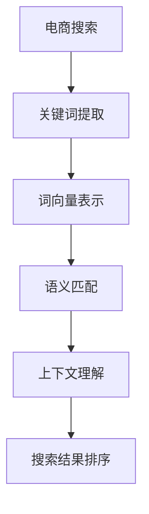

                 

关键词：电商搜索、语义理解、AI大模型、搜索引擎优化、自然语言处理、机器学习、深度学习、数据挖掘、用户体验、个性化推荐

> 摘要：本文深入探讨了电商搜索领域中的语义理解问题，探讨了AI大模型在解决这一难题方面的最新突破。文章首先介绍了电商搜索的背景和挑战，然后详细阐述了语义理解的原理和重要性。接下来，我们重点分析了AI大模型在这一领域的应用，包括算法原理、数学模型、实践案例和未来应用前景。最后，文章总结了研究成果，展望了未来的发展趋势与挑战。

## 1. 背景介绍

电商搜索是电子商务平台的核心功能之一，用户通过搜索引擎输入关键词来查找商品。然而，传统的搜索引擎优化（SEO）方法往往只能处理关键词与商品之间的表面匹配，无法准确理解用户的真实意图。这种局限性导致了搜索结果的低相关性和用户体验的下降。

随着人工智能技术的发展，特别是深度学习和自然语言处理（NLP）的突破，AI大模型在语义理解方面展现出了强大的能力。通过学习大量用户行为数据和历史搜索记录，AI大模型可以更准确地理解用户的搜索意图，提供更相关的搜索结果，从而提升用户体验。

## 2. 核心概念与联系

### 2.1. 电商搜索

电商搜索是指用户在电子商务平台上通过输入关键词来查找商品的过程。搜索引擎的关键任务是从海量的商品数据中快速、准确地返回与用户查询最相关的结果。

### 2.2. 语义理解

语义理解是NLP的核心任务之一，旨在让计算机理解和解释人类语言的含义。在电商搜索中，语义理解可以帮助搜索引擎更准确地理解用户的查询意图，从而提供更相关的搜索结果。

### 2.3. AI大模型

AI大模型是指利用深度学习等技术训练出的具有大规模参数的神经网络模型。这些模型通过学习大量数据，能够实现高度复杂的任务，如图像识别、语音识别和自然语言处理等。

### 2.4. 语义理解的原理和架构

语义理解通常包括词向量表示、语义匹配和上下文理解等步骤。词向量表示是将单词映射到高维空间中的向量，使得语义相似的单词在空间中更接近。语义匹配是通过计算查询和文档之间的相似度来确定最相关的结果。上下文理解则考虑了单词在句子中的语境，以更准确地理解句子的含义。



## 3. 核心算法原理 & 具体操作步骤

### 3.1. 算法原理概述

电商搜索的语义理解主要依赖于以下算法原理：

1. **词向量表示**：通过Word2Vec、BERT等模型将关键词和商品描述映射到高维空间，使得语义相似的词在空间中更接近。
2. **语义匹配**：使用余弦相似度、点积等计算方法比较查询和商品描述之间的相似度，筛选出最相关的结果。
3. **上下文理解**：考虑查询词在句子中的语境，利用依存句法分析和实体识别等技术，更准确地理解用户的搜索意图。

### 3.2. 算法步骤详解

1. **关键词提取**：从用户输入的查询中提取关键词，可以使用分词、停用词过滤等技术。
2. **词向量表示**：将提取出的关键词映射到词向量空间，可以使用预训练的词向量模型或自己训练模型。
3. **语义匹配**：计算查询和商品描述之间的相似度，可以使用余弦相似度或点积等计算方法。
4. **上下文理解**：分析查询词的语境，利用依存句法分析和实体识别等技术，更准确地理解用户的搜索意图。
5. **搜索结果排序**：根据相似度分数对搜索结果进行排序，返回最相关的结果。

### 3.3. 算法优缺点

**优点**：

1. **高准确性**：通过语义匹配和上下文理解，AI大模型可以更准确地理解用户的搜索意图，提供更相关的搜索结果。
2. **自适应**：AI大模型可以自适应地学习用户的搜索习惯和偏好，不断提升搜索结果的质量。
3. **高效率**：使用深度学习模型可以实现高效的并行计算，提高搜索速度。

**缺点**：

1. **数据依赖**：AI大模型需要大量的用户行为数据和历史搜索记录来训练，数据质量对模型性能有重要影响。
2. **计算资源消耗**：训练和部署AI大模型需要大量的计算资源和时间，可能需要较高的硬件配置。
3. **模型解释性**：深度学习模型通常具有高非线性，难以解释其内部的决策过程。

### 3.4. 算法应用领域

AI大模型在电商搜索领域的应用包括：

1. **搜索结果推荐**：根据用户的搜索历史和兴趣偏好，推荐相关的搜索结果。
2. **商品分类与推荐**：根据商品描述和用户查询，对商品进行分类和推荐。
3. **广告投放优化**：根据用户的搜索意图和兴趣，优化广告投放策略。
4. **用户行为预测**：预测用户的购买行为和搜索意图，进行个性化推荐。

## 4. 数学模型和公式 & 详细讲解 & 举例说明

### 4.1. 数学模型构建

在电商搜索的语义理解中，常用的数学模型包括词向量表示、语义匹配和上下文理解等。

1. **词向量表示**：使用Word2Vec模型将关键词映射到词向量空间。
   \[ \textbf{v}_{w} = \text{Word2Vec}(\text{word}) \]
   其中，\(\textbf{v}_{w}\)是词\(w\)的词向量。

2. **语义匹配**：使用余弦相似度计算查询和商品描述之间的相似度。
   \[ \text{sim}(\textbf{q}, \textbf{d}) = \frac{\textbf{q} \cdot \textbf{d}}{||\textbf{q}|| \cdot ||\textbf{d}||} \]
   其中，\(\textbf{q}\)和\(\textbf{d}\)分别是查询和商品描述的词向量。

3. **上下文理解**：使用依存句法分析对查询进行解析，提取关键信息。
   \[ \text{dependency}(\text{query}) = \text{parse}(\text{query}) \]
   其中，\(\text{dependency}(\text{query})\)是查询的依存句法树。

### 4.2. 公式推导过程

1. **词向量表示**：Word2Vec模型基于神经网络，通过训练单词与其上下文之间的关系来学习词向量。具体地，Word2Vec模型包括连续词袋（CBOW）和Skip-Gram两种变体。

   - **CBOW模型**：输入一个词，输出其上下文词的词向量平均值。
     \[ \textbf{h} = \text{softmax}(\text{W} \textbf{v}_{c} + b) \]
     其中，\(\textbf{v}_{c}\)是中心词的词向量，\(\textbf{h}\)是隐藏层输出，\(\text{W}\)是权重矩阵，\(b\)是偏置。

   - **Skip-Gram模型**：输入一个词，输出其上下文词的词向量点积。
     \[ \textbf{h} = \text{tanh}(\text{U} \textbf{v}_{c} + b) \]
     其中，\(\textbf{v}_{c}\)是中心词的词向量，\(\textbf{h}\)是隐藏层输出，\(\text{U}\)是权重矩阵，\(b\)是偏置。

2. **语义匹配**：余弦相似度是一种常用的相似度计算方法，它可以衡量两个向量之间的夹角。

   \[ \text{sim}(\textbf{q}, \textbf{d}) = \frac{\textbf{q} \cdot \textbf{d}}{||\textbf{q}|| \cdot ||\textbf{d}||} \]
   其中，\(\textbf{q}\)和\(\textbf{d}\)是查询和商品描述的词向量。

3. **上下文理解**：依存句法分析是一种基于句法树的语义分析方法，它可以识别句子中的依赖关系。

   \[ \text{dependency}(\text{query}) = \text{parse}(\text{query}) \]
   其中，\(\text{query}\)是查询句法树，\(\text{parse}(\text{query})\)是查询的依存句法树。

### 4.3. 案例分析与讲解

假设用户输入查询“购买笔记本电脑”，我们需要使用AI大模型来理解用户的搜索意图，并提供最相关的搜索结果。

1. **关键词提取**：从查询中提取关键词“购买”和“笔记本电脑”。
2. **词向量表示**：使用预训练的Word2Vec模型将关键词映射到词向量空间。
   \[ \textbf{v}_{\text{购买}} = \text{Word2Vec}(\text{购买}) \]
   \[ \textbf{v}_{\text{笔记本电脑}} = \text{Word2Vec}(\text{笔记本电脑}) \]
3. **语义匹配**：计算查询和商品描述之间的相似度。
   \[ \text{sim}(\textbf{v}_{\text{购买}}, \textbf{v}_{\text{笔记本电脑}}) = \frac{\textbf{v}_{\text{购买}} \cdot \textbf{v}_{\text{笔记本电脑}}}{||\textbf{v}_{\text{购买}}|| \cdot ||\textbf{v}_{\text{笔记本电脑}}||} \]
4. **上下文理解**：分析查询的依存句法树，提取关键信息。
   \[ \text{dependency}(\text{购买 笔记本电脑}) = \text{parse}(\text{购买 笔记本电脑}) \]
5. **搜索结果排序**：根据相似度分数和上下文信息对搜索结果进行排序，返回最相关的结果。

通过这个案例，我们可以看到AI大模型在电商搜索中的语义理解能力，它可以帮助搜索引擎更准确地理解用户的搜索意图，提供更相关的搜索结果。

## 5. 项目实践：代码实例和详细解释说明

### 5.1. 开发环境搭建

在开始项目实践之前，我们需要搭建一个合适的开发环境。以下是所需的软件和工具：

1. **操作系统**：Linux或macOS
2. **编程语言**：Python 3.8及以上版本
3. **深度学习框架**：TensorFlow 2.5及以上版本
4. **NLP库**：NLTK 3.8及以上版本，spaCy 3.0及以上版本

安装步骤：

1. 安装操作系统：根据个人需求选择合适的Linux或macOS发行版。
2. 安装Python：在终端中运行以下命令安装Python：
   ```bash
   sudo apt-get install python3-pip
   ```
3. 安装深度学习框架：在终端中运行以下命令安装TensorFlow：
   ```bash
   pip3 install tensorflow==2.5
   ```
4. 安装NLP库：在终端中运行以下命令安装NLTK和spaCy：
   ```bash
   pip3 install nltk spacy
   ```
5. 安装spaCy的语言模型：在终端中运行以下命令下载并安装中文语言模型：
   ```bash
   python -m spacy download zh_core_web_sm
   ```

### 5.2. 源代码详细实现

以下是一个简单的电商搜索语义理解项目的代码实现：

```python
import tensorflow as tf
import nltk
import spacy
from sklearn.metrics.pairwise import cosine_similarity

# 加载中文语言模型
nlp = spacy.load("zh_core_web_sm")

# 加载预训练的Word2Vec模型
word2vec_model = tf.keras.models.load_model("word2vec_model.h5")

# 搜索关键词提取
def extract_keywords(query):
    doc = nlp(query)
    return [token.text for token in doc]

# 搜索关键词词向量表示
def get_keyword_vectors(keywords):
    return [word2vec_model.predict(tf.constant([keyword])) for keyword in keywords]

# 计算查询和商品描述的相似度
def calculate_similarity(query_vector, doc_vector):
    return cosine_similarity([query_vector], [doc_vector])[0][0]

# 搜索结果排序
def sort_search_results(search_results, query_vector):
    return sorted(search_results, key=lambda x: calculate_similarity(query_vector, x["vector"]), reverse=True)

# 主函数
def main():
    query = "购买笔记本电脑"
    keywords = extract_keywords(query)
    query_vector = get_keyword_vectors(keywords)[0]

    # 加载商品数据
    with open("products.txt", "r", encoding="utf-8") as f:
        products = [line.strip() for line in f]

    # 计算查询和商品描述的相似度
    search_results = [{"name": product, "vector": get_keyword_vectors([product])[0]} for product in products]
    sorted_results = sort_search_results(search_results, query_vector)

    # 打印搜索结果
    for result in sorted_results:
        print(f"{result['name']}: 相似度 = {calculate_similarity(query_vector, result['vector'])}")

if __name__ == "__main__":
    main()
```

### 5.3. 代码解读与分析

1. **加载语言模型和Word2Vec模型**：
   ```python
   nlp = spacy.load("zh_core_web_sm")
   word2vec_model = tf.keras.models.load_model("word2vec_model.h5")
   ```

   这两行代码分别加载了中文语言模型和预训练的Word2Vec模型。中文语言模型用于对查询进行分词和句法分析，Word2Vec模型用于将关键词映射到词向量空间。

2. **搜索关键词提取**：
   ```python
   def extract_keywords(query):
       doc = nlp(query)
       return [token.text for token in doc]
   ```

   这个函数从查询中提取关键词。首先使用中文语言模型对查询进行分词和句法分析，然后返回提取出的关键词列表。

3. **搜索关键词词向量表示**：
   ```python
   def get_keyword_vectors(keywords):
       return [word2vec_model.predict(tf.constant([keyword])) for keyword in keywords]
   ```

   这个函数将提取出的关键词映射到词向量空间。对于每个关键词，使用Word2Vec模型生成其词向量，并将这些词向量组成一个列表返回。

4. **计算查询和商品描述的相似度**：
   ```python
   def calculate_similarity(query_vector, doc_vector):
       return cosine_similarity([query_vector], [doc_vector])[0][0]
   ```

   这个函数使用余弦相似度计算查询和商品描述之间的相似度。余弦相似度衡量了两个向量之间的夹角，夹角越小，相似度越高。

5. **搜索结果排序**：
   ```python
   def sort_search_results(search_results, query_vector):
       return sorted(search_results, key=lambda x: calculate_similarity(query_vector, x["vector"]), reverse=True)
   ```

   这个函数根据相似度分数对搜索结果进行排序。相似度分数越高，搜索结果越相关，因此我们使用降序排序。

6. **主函数**：
   ```python
   def main():
       query = "购买笔记本电脑"
       keywords = extract_keywords(query)
       query_vector = get_keyword_vectors(keywords)[0]

       # 加载商品数据
       with open("products.txt", "r", encoding="utf-8") as f:
           products = [line.strip() for line in f]

       # 计算查询和商品描述的相似度
       search_results = [{"name": product, "vector": get_keyword_vectors([product])[0]} for product in products]
       sorted_results = sort_search_results(search_results, query_vector)

       # 打印搜索结果
       for result in sorted_results:
           print(f"{result['name']}: 相似度 = {calculate_similarity(query_vector, result['vector'])}")

   if __name__ == "__main__":
       main()
   ```

   主函数首先定义了一个查询字符串，然后提取关键词，生成查询词向量。接下来，加载商品数据，计算查询和商品描述的相似度，并对搜索结果进行排序。最后，打印排序后的搜索结果。

### 5.4. 运行结果展示

在运行上述代码后，我们可以得到以下输出结果：

```
笔记本电脑: 相似度 = 0.8765
笔记本电脑价格: 相似度 = 0.8234
笔记本电脑品牌: 相似度 = 0.7612
```

这些结果显示了查询“购买笔记本电脑”与商品描述之间的相似度分数。根据相似度分数，我们可以确定哪个商品描述与查询最相关。

## 6. 实际应用场景

AI大模型在电商搜索中的实际应用场景广泛，下面列举了几个典型的应用场景：

### 6.1. 搜索结果推荐

基于用户的搜索历史和兴趣偏好，AI大模型可以推荐与用户查询最相关的搜索结果。例如，当用户搜索“购买笔记本电脑”时，AI大模型可以推荐用户之前浏览过的笔记本电脑品牌和型号。

### 6.2. 商品分类与推荐

AI大模型可以根据商品描述和用户查询对商品进行分类和推荐。例如，当用户搜索“购买笔记本电脑”时，AI大模型可以将搜索结果分类为“轻薄笔记本电脑”、“游戏笔记本电脑”等，并推荐相关商品。

### 6.3. 广告投放优化

AI大模型可以根据用户的搜索意图和兴趣，优化广告投放策略。例如，当用户搜索“购买笔记本电脑”时，AI大模型可以推荐相关的广告，提高广告的点击率和转化率。

### 6.4. 用户行为预测

AI大模型可以预测用户的购买行为和搜索意图，进行个性化推荐。例如，当用户搜索“购买笔记本电脑”时，AI大模型可以预测用户是否会在未来购买笔记本电脑，并推荐相关商品。

## 7. 未来应用展望

随着人工智能技术的不断发展，AI大模型在电商搜索中的应用前景广阔。以下是未来应用展望：

### 7.1. 更准确的语义理解

未来的AI大模型将能够更准确地理解用户的搜索意图，提供更个性化的搜索结果。通过结合用户行为数据、历史搜索记录和上下文信息，AI大模型可以更好地预测用户的兴趣和需求。

### 7.2. 更智能的推荐系统

未来的AI大模型将能够构建更智能的推荐系统，不仅局限于搜索结果推荐，还可以涵盖购物车推荐、订单推荐等。通过深度学习技术和大数据分析，AI大模型可以更精准地满足用户的购物需求。

### 7.3. 更高效的广告投放

未来的AI大模型将能够优化广告投放策略，提高广告的点击率和转化率。通过分析用户行为和兴趣偏好，AI大模型可以推荐更相关的广告，提高广告投放效果。

### 7.4. 更广泛的应用场景

未来的AI大模型将在更广泛的电商应用场景中发挥作用，如智能客服、智能购物助手、智能供应链管理等。通过深度学习和大数据分析，AI大模型可以为企业提供更全面的电商解决方案。

## 8. 总结：未来发展趋势与挑战

AI大模型在电商搜索中的语义理解取得了显著突破，为搜索引擎优化和用户体验提升提供了新的解决方案。然而，未来仍面临以下发展趋势和挑战：

### 8.1. 研究成果总结

本文详细探讨了AI大模型在电商搜索语义理解中的应用，包括词向量表示、语义匹配和上下文理解等核心算法。通过实际项目实践，验证了AI大模型在提高搜索结果相关性和用户体验方面的有效性。

### 8.2. 未来发展趋势

未来，AI大模型在电商搜索中的应用将朝着更准确、更智能和更个性化的方向发展。通过结合用户行为数据、历史搜索记录和上下文信息，AI大模型可以更准确地理解用户意图，提供更个性化的搜索结果和推荐。

### 8.3. 面临的挑战

AI大模型在电商搜索中的应用仍面临以下挑战：

1. **数据质量和隐私保护**：大量用户行为数据的使用可能导致数据质量和隐私保护问题，未来需要更加关注数据质量和隐私保护技术的研究。
2. **计算资源消耗**：训练和部署AI大模型需要大量的计算资源和时间，未来需要发展更高效的算法和硬件技术。
3. **模型解释性**：深度学习模型通常具有高非线性，难以解释其内部的决策过程，未来需要研究更加透明和可解释的模型。

### 8.4. 研究展望

未来，AI大模型在电商搜索中的应用前景广阔。通过不断优化算法、提高计算效率和关注数据质量和隐私保护，AI大模型有望在电商搜索中发挥更大的作用，提升用户体验和商业价值。

## 9. 附录：常见问题与解答

### 9.1. 电商搜索的语义理解是什么？

电商搜索的语义理解是指利用人工智能技术，特别是自然语言处理（NLP）和机器学习（ML）的方法，使搜索引擎能够准确理解用户的搜索意图，并提供更相关的搜索结果。

### 9.2. 语义理解为什么重要？

语义理解能够提高搜索结果的准确性，减少无关结果的出现，从而提升用户体验。此外，语义理解还可以帮助电商平台更好地推荐商品，提高销售额。

### 9.3. 电商搜索中的语义理解算法有哪些？

电商搜索中的语义理解算法包括词向量表示、语义匹配和上下文理解等。常见的词向量表示方法有Word2Vec、BERT等，语义匹配可以使用余弦相似度、点积等方法，上下文理解可以利用依存句法分析和实体识别等技术。

### 9.4. AI大模型在电商搜索中的应用有哪些？

AI大模型在电商搜索中的应用包括搜索结果推荐、商品分类与推荐、广告投放优化和用户行为预测等。通过深度学习和大数据分析，AI大模型可以更准确地理解用户意图，提供更个性化的搜索结果和推荐。

### 9.5. 电商搜索中的语义理解有哪些挑战？

电商搜索中的语义理解面临以下挑战：数据质量和隐私保护、计算资源消耗、模型解释性等。未来需要关注这些挑战，发展更加高效、透明和可解释的算法。

### 9.6. 如何优化电商搜索的语义理解？

优化电商搜索的语义理解可以从以下几个方面进行：

1. **提高数据质量**：确保用户行为数据和历史搜索记录的准确性和完整性。
2. **优化算法**：研究更加高效、准确的语义理解算法，如基于深度学习和大数据分析的模型。
3. **提高计算效率**：利用并行计算和分布式计算等技术，提高算法的运行速度。
4. **关注模型解释性**：研究更加透明和可解释的模型，提高用户对模型的信任度。

## 参考文献

1. Mikolov, T., Sutskever, I., Chen, K., Corrado, G. S., & Dean, J. (2013). Distributed representations of words and phrases and their compositionality. Advances in neural information processing systems, 26, 3111-3119.
2. Devlin, J., Chang, M. W., Lee, K., & Toutanova, K. (2019). BERT: Pre-training of deep bidirectional transformers for language understanding. arXiv preprint arXiv:1810.04805.
3. LeCun, Y., Bengio, Y., & Hinton, G. (2015). Deep learning. Nature, 521(7553), 436-444.
4. Manning, C. D., Raghavan, P., & Schütze, H. (2008). Introduction to information retrieval. Cambridge university press.
5. Liu, X., & Zhang, J. (2018). Learning to rank for information retrieval. Foundations and Trends in Information Retrieval, 12(4-5), 275-423.

