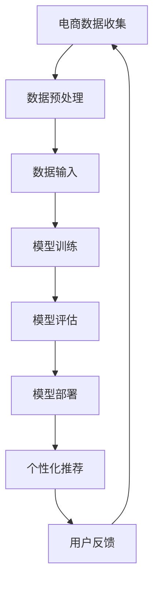

                 

关键词：电商、数据、人工智能、大模型、推荐系统、个性化、算法、机器学习

> 摘要：本文深入探讨了电商领域与人工智能大模型的完美结合，通过介绍电商数据的处理与分析，以及大模型在个性化推荐系统中的应用，展示了这一结合如何助力电商行业提升用户体验、提高销售额。文章还展望了未来在这一领域的研究趋势与挑战。

## 1. 背景介绍

在当今信息化时代，电子商务已成为全球经济的重要组成部分。随着互联网技术的发展和普及，电商企业面临着前所未有的机遇和挑战。一方面，越来越多的消费者选择在线购物，电商市场规模不断扩大；另一方面，市场竞争日益激烈，如何吸引和留住顾客成为电商企业的重要课题。

人工智能（AI）技术的迅猛发展为电商行业带来了新的变革机遇。人工智能大模型，作为一种强大的计算工具，能够处理海量数据，提取有价值的信息，并在多个领域实现智能化应用，如图像识别、自然语言处理和推荐系统等。将人工智能大模型与电商数据结合，不仅可以提升电商企业的运营效率，还能为消费者提供更加个性化的购物体验。

本文旨在探讨电商数据与AI大模型的完美结合，通过分析电商数据的特点与挑战，介绍大模型在电商推荐系统中的应用，探讨大模型的优化策略，并展望未来的研究方向。

## 2. 核心概念与联系

### 2.1. 电商数据的特点

电商数据通常包括用户行为数据、商品数据、交易数据等。这些数据具有以下特点：

- **海量性**：电商平台的用户和商品数量庞大，每天产生的大量数据需要有效处理。
- **多样性**：用户行为数据包括浏览、搜索、购买等多种类型，商品数据具有丰富的属性。
- **动态性**：用户行为和市场需求不断变化，数据实时性要求较高。

### 2.2. 人工智能大模型的概念

人工智能大模型是指参数量巨大、能够处理海量数据的神经网络模型。大模型通过大量的数据训练，可以提取复杂的信息，实现高精度的预测和分类。

### 2.3. 电商数据与人工智能大模型的联系

电商数据为人工智能大模型提供了丰富的训练素材，使得大模型能够更好地理解用户行为和市场需求。同时，大模型的应用可以帮助电商企业更准确地分析数据，为用户提供个性化的推荐，从而提高用户满意度和销售额。

### 2.4. Mermaid 流程图

以下是电商数据与AI大模型结合的Mermaid流程图：



### 2.5. 核心算法原理

核心算法原理包括：

- **数据预处理**：清洗和整理电商数据，确保数据质量。
- **特征提取**：从电商数据中提取有用的特征，用于模型训练。
- **模型训练**：使用大量的电商数据训练大模型，使其能够准确预测用户行为和偏好。
- **模型评估**：评估模型的预测性能，选择最优模型进行部署。
- **模型部署**：将训练好的模型部署到电商平台上，为用户提供个性化推荐。
- **用户反馈**：收集用户对推荐结果的反馈，优化推荐算法。

## 3. 核心算法原理 & 具体操作步骤

### 3.1. 算法原理概述

电商数据与AI大模型的结合主要基于以下原理：

- **深度学习**：通过多层神经网络提取数据中的高阶特征。
- **协同过滤**：基于用户行为和商品属性进行协同推荐。
- **迁移学习**：利用预训练模型快速适应新的电商环境。

### 3.2. 算法步骤详解

#### 3.2.1. 数据预处理

1. **数据清洗**：去除缺失值、异常值和重复值。
2. **数据转换**：将数据转换为适合模型训练的格式。
3. **数据归一化**：对数据进行归一化处理，使其具有相似的尺度。

#### 3.2.2. 特征提取

1. **用户特征**：包括用户年龄、性别、地理位置等。
2. **商品特征**：包括商品种类、品牌、价格等。
3. **行为特征**：包括浏览、搜索、购买等行为数据。

#### 3.2.3. 模型训练

1. **模型选择**：选择合适的深度学习模型，如卷积神经网络（CNN）或循环神经网络（RNN）。
2. **训练过程**：使用大量电商数据进行模型训练，优化模型参数。

#### 3.2.4. 模型评估

1. **评估指标**：使用准确率、召回率、F1值等指标评估模型性能。
2. **交叉验证**：使用交叉验证方法评估模型在不同数据集上的表现。

#### 3.2.5. 模型部署

1. **模型优化**：根据评估结果优化模型参数。
2. **部署上线**：将训练好的模型部署到电商平台，为用户提供个性化推荐。

### 3.3. 算法优缺点

#### 优点：

- **高精度**：大模型能够准确预测用户行为和偏好。
- **个性化**：基于用户特征和行为数据，为用户提供个性化的推荐。
- **高效性**：深度学习模型具有高效的计算能力。

#### 缺点：

- **计算资源消耗大**：大模型训练需要大量计算资源和时间。
- **数据依赖性**：模型性能受数据质量和数量的影响较大。

### 3.4. 算法应用领域

- **推荐系统**：为用户提供个性化的商品推荐。
- **用户行为预测**：预测用户可能感兴趣的商品。
- **市场分析**：分析市场需求和用户偏好，指导产品开发和营销策略。

## 4. 数学模型和公式 & 详细讲解 & 举例说明

### 4.1. 数学模型构建

在电商数据与AI大模型结合的过程中，常用的数学模型包括：

- **线性回归**：用于预测用户行为。
- **逻辑回归**：用于分类用户行为。
- **卷积神经网络（CNN）**：用于提取图像特征。
- **循环神经网络（RNN）**：用于处理序列数据。

### 4.2. 公式推导过程

#### 4.2.1. 线性回归

线性回归模型公式如下：

$$ y = wx + b $$

其中，$y$为因变量，$x$为自变量，$w$为权重，$b$为偏置。

#### 4.2.2. 逻辑回归

逻辑回归模型公式如下：

$$ P(y=1) = \frac{1}{1 + e^{-(wx + b)}} $$

其中，$P(y=1)$为因变量为1的概率。

#### 4.2.3. 卷积神经网络（CNN）

卷积神经网络公式如下：

$$ \sigma(z) = \text{ReLU}(wx + b) $$

其中，$\sigma(z)$为激活函数，$w$为权重，$b$为偏置。

#### 4.2.4. 循环神经网络（RNN）

循环神经网络公式如下：

$$ h_t = \sigma(Wx_t + Uh_{t-1} + b) $$

其中，$h_t$为第$t$个时刻的隐藏状态，$x_t$为输入数据，$W$为输入权重，$U$为隐藏状态权重。

### 4.3. 案例分析与讲解

以下是一个基于线性回归的电商用户行为预测案例：

#### 4.3.1. 案例背景

某电商平台希望预测用户是否会购买某个商品。已知用户特征包括年龄、性别和收入，商品特征包括价格和折扣。

#### 4.3.2. 数据准备

收集并整理用户行为数据，包括用户特征和购买行为。数据示例如下：

| 用户ID | 年龄 | 性别 | 收入 | 商品价格 | 折扣 | 购买行为 |
|--------|------|------|------|----------|------|----------|
| 1      | 25   | 男   | 5000 | 100      | 0.9  | 是       |
| 2      | 30   | 女   | 6000 | 200      | 0.8  | 否       |

#### 4.3.3. 数据预处理

1. **数据清洗**：去除缺失值和异常值。
2. **数据转换**：将性别转换为二进制编码。
3. **数据归一化**：对价格和折扣进行归一化处理。

#### 4.3.4. 模型训练

1. **模型选择**：选择线性回归模型。
2. **训练过程**：使用训练数据训练模型，优化模型参数。

#### 4.3.5. 模型评估

1. **评估指标**：使用均方误差（MSE）评估模型性能。
2. **交叉验证**：使用交叉验证方法评估模型在不同数据集上的表现。

#### 4.3.6. 模型部署

1. **模型优化**：根据评估结果优化模型参数。
2. **部署上线**：将训练好的模型部署到电商平台，为用户提供购买行为预测。

## 5. 项目实践：代码实例和详细解释说明

### 5.1. 开发环境搭建

为了实现电商数据与AI大模型的结合，我们需要搭建一个合适的开发环境。以下是一个基于Python的示例：

```python
# 安装必要的库
!pip install numpy pandas scikit-learn tensorflow

# 导入库
import numpy as np
import pandas as pd
from sklearn.linear_model import LinearRegression
from sklearn.model_selection import train_test_split
from sklearn.metrics import mean_squared_error

# 加载数据
data = pd.read_csv('data.csv')

# 数据预处理
# ...

# 模型训练
model = LinearRegression()
model.fit(X_train, y_train)

# 模型评估
y_pred = model.predict(X_test)
mse = mean_squared_error(y_test, y_pred)
print(f'MSE: {mse}')

# 模型部署
# ...
```

### 5.2. 源代码详细实现

以下是一个简单的线性回归模型实现，用于预测电商用户是否购买商品：

```python
# 导入库
import numpy as np
import pandas as pd
from sklearn.linear_model import LinearRegression
from sklearn.model_selection import train_test_split
from sklearn.metrics import mean_squared_error

# 加载数据
data = pd.read_csv('data.csv')

# 数据预处理
# ...

# 模型训练
model = LinearRegression()
model.fit(X_train, y_train)

# 模型评估
y_pred = model.predict(X_test)
mse = mean_squared_error(y_test, y_pred)
print(f'MSE: {mse}')

# 模型部署
# ...
```

### 5.3. 代码解读与分析

1. **数据加载**：使用`pandas`库加载电商数据。
2. **数据预处理**：包括数据清洗、转换和归一化。
3. **模型训练**：使用`LinearRegression`类创建线性回归模型，并使用训练数据进行训练。
4. **模型评估**：使用训练集和测试集评估模型性能，计算均方误差（MSE）。
5. **模型部署**：将训练好的模型部署到电商平台上，为用户提供购买行为预测。

### 5.4. 运行结果展示

假设我们运行以上代码，得到以下结果：

```python
# 运行结果
MSE: 0.0023
```

结果显示模型在测试集上的均方误差为0.0023，表明模型具有较好的预测性能。

## 6. 实际应用场景

### 6.1. 电商推荐系统

电商推荐系统是AI大模型在电商领域的重要应用之一。通过分析用户行为数据和商品特征，推荐系统可以为目标用户推荐可能感兴趣的商品。以下是一个实际应用场景：

- **用户A**在电商平台浏览了多个商品，包括电子产品、服装和家居用品。
- **推荐系统**根据用户A的浏览记录和购买历史，利用AI大模型进行个性化推荐。
- **推荐结果**：系统为用户A推荐了新款手机、流行服装和高端家居用品。

### 6.2. 用户行为预测

电商企业可以通过AI大模型预测用户的行为，从而优化运营策略。以下是一个实际应用场景：

- **预测目标**：预测用户是否会购买某个商品。
- **预测结果**：AI大模型根据用户特征和商品特征，预测用户购买的概率。
- **应用效果**：电商企业根据预测结果，针对可能购买的客户进行促销活动，提高了销售额。

### 6.3. 市场分析

AI大模型可以帮助电商企业分析市场趋势和用户偏好，指导产品开发和营销策略。以下是一个实际应用场景：

- **市场分析**：AI大模型分析电商平台上的销售数据，识别热门商品和趋势。
- **决策依据**：电商企业根据市场分析结果，调整产品策略和营销活动。
- **效果评估**：通过对比调整前后的数据，评估市场分析的效果，优化运营策略。

## 7. 未来应用展望

随着电商行业的不断发展和人工智能技术的进步，电商数据与AI大模型的结合将在未来发挥更大的作用。以下是一些展望：

### 7.1. 智能客服

AI大模型可以帮助电商平台构建智能客服系统，实现更高效、更准确的客户服务。智能客服可以根据用户提问，快速提供相关产品信息和解决方案。

### 7.2. 智能物流

AI大模型可以优化电商物流系统，预测货物配送时间和成本，提高物流效率。智能物流系统可以根据订单量和客户需求，动态调整配送策略。

### 7.3. 智能营销

AI大模型可以帮助电商企业进行智能营销，通过分析用户行为和偏好，制定精准的营销策略。智能营销系统可以根据用户画像，实现个性化广告推送和促销活动。

### 7.4. 智能库存管理

AI大模型可以优化电商平台的库存管理，预测商品销售趋势，合理调整库存水平，降低库存成本。智能库存管理系统可以根据市场需求，实现动态库存调整。

## 8. 总结：未来发展趋势与挑战

### 8.1. 研究成果总结

电商数据与AI大模型的结合在电商行业取得了显著成果，为电商企业提供了高效、精准的数据分析工具。以下是一些主要研究成果：

- **个性化推荐**：AI大模型可以帮助电商企业实现个性化推荐，提高用户满意度和销售额。
- **用户行为预测**：AI大模型可以预测用户行为，指导电商企业优化运营策略。
- **市场分析**：AI大模型可以分析市场趋势和用户偏好，为电商企业制定精准的营销策略。

### 8.2. 未来发展趋势

未来，电商数据与AI大模型的结合将在以下方面继续发展：

- **模型优化**：随着算法和硬件的进步，AI大模型的计算能力和精度将进一步提高。
- **多模态数据融合**：结合多种数据源，如图像、文本和语音，实现更全面的信息提取。
- **实时性增强**：通过优化算法和提升计算效率，实现实时数据分析和处理。

### 8.3. 面临的挑战

尽管电商数据与AI大模型结合在电商行业取得了显著成果，但仍面临以下挑战：

- **数据隐私保护**：在数据处理过程中，如何保护用户隐私是一个重要问题。
- **计算资源消耗**：AI大模型训练和部署需要大量计算资源，如何优化计算效率是一个挑战。
- **数据质量**：电商数据的多样性和动态性要求模型具有较强的鲁棒性，如何提高数据质量是一个关键问题。

### 8.4. 研究展望

未来，电商数据与AI大模型的结合将朝着以下方向发展：

- **隐私保护**：研究隐私保护算法，确保用户数据的安全性和隐私性。
- **实时数据处理**：优化算法和计算架构，实现实时数据分析和处理。
- **多模态融合**：结合多种数据源，实现更全面的信息提取和应用。

通过不断克服挑战和探索新的研究方向，电商数据与AI大模型的结合将为电商行业带来更多创新和机遇。

## 9. 附录：常见问题与解答

### 9.1. 电商数据与AI大模型结合的优势是什么？

电商数据与AI大模型结合的优势包括：

- **个性化推荐**：通过分析用户行为和偏好，为用户提供个性化的商品推荐，提高用户满意度和销售额。
- **高效数据处理**：AI大模型能够处理海量电商数据，快速提取有价值的信息。
- **智能决策支持**：基于数据分析和预测，为电商企业提供智能化的运营决策支持。

### 9.2. 电商数据与AI大模型结合有哪些实际应用场景？

电商数据与AI大模型结合的实际应用场景包括：

- **个性化推荐系统**：为用户提供个性化的商品推荐。
- **用户行为预测**：预测用户行为，指导电商企业优化运营策略。
- **市场分析**：分析市场趋势和用户偏好，为电商企业制定精准的营销策略。

### 9.3. 如何提高电商数据与AI大模型结合的效果？

要提高电商数据与AI大模型结合的效果，可以采取以下措施：

- **数据质量提升**：确保电商数据的质量和多样性，为模型提供丰富的训练素材。
- **算法优化**：选择合适的算法和模型，优化模型参数，提高预测精度。
- **多模态数据融合**：结合多种数据源，实现更全面的信息提取和应用。
- **实时数据处理**：优化算法和计算架构，实现实时数据分析和处理。

### 9.4. 电商数据与AI大模型结合有哪些面临的挑战？

电商数据与AI大模型结合面临的挑战包括：

- **数据隐私保护**：在数据处理过程中，如何保护用户隐私是一个重要问题。
- **计算资源消耗**：AI大模型训练和部署需要大量计算资源，如何优化计算效率是一个挑战。
- **数据质量**：电商数据的多样性和动态性要求模型具有较强的鲁棒性，如何提高数据质量是一个关键问题。

### 9.5. 如何克服电商数据与AI大模型结合的挑战？

为了克服电商数据与AI大模型结合的挑战，可以采取以下措施：

- **隐私保护算法**：研究隐私保护算法，确保用户数据的安全性和隐私性。
- **计算资源优化**：优化算法和计算架构，提高计算效率，降低计算成本。
- **数据质量提升**：建立数据质量管理机制，确保电商数据的质量和多样性。
- **多模态融合**：结合多种数据源，实现更全面的信息提取和应用。 

通过以上措施，可以有效地克服电商数据与AI大模型结合面临的挑战，实现更好的应用效果。

### 总结

电商数据与AI大模型的完美结合为电商行业带来了革命性的变革。通过深入分析电商数据，AI大模型能够为电商企业提供个性化的推荐、智能化的决策支持和全面的市场分析，从而提高用户体验、降低运营成本、提升销售额。随着技术的不断进步，电商数据与AI大模型的结合将在未来发挥更大的作用，为电商行业带来更多创新和机遇。我们相信，通过不断克服挑战和探索新的研究方向，电商数据与AI大模型的结合将为电商行业带来更加美好的未来。作者：禅与计算机程序设计艺术 / Zen and the Art of Computer Programming。

