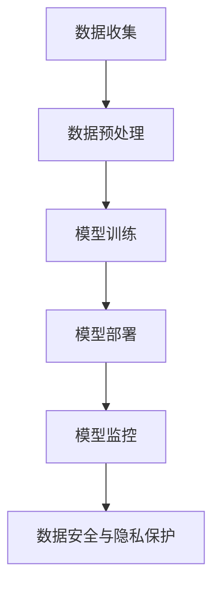

                 

关键词：电商，AI大模型，数据安全，隐私保护，技术策略

摘要：随着人工智能技术在电商行业的广泛应用，AI大模型已成为电商企业提升用户体验和运营效率的关键手段。然而，AI大模型在处理海量数据过程中，面临着数据安全和隐私保护的重大挑战。本文将深入探讨电商行业中AI大模型的数据安全与隐私保护问题，分析现有技术手段，并提出有效的解决方案。

## 1. 背景介绍

### 1.1 电商行业的发展

电商行业作为全球经济发展的重要驱动力，正以前所未有的速度迅猛发展。随着互联网技术的不断进步，电商企业通过提供更加便捷的购物体验和个性化的商品推荐，吸引了大量消费者。同时，电商企业也在不断探索新的商业模式和技术手段，以提升运营效率和市场竞争力。

### 1.2 AI大模型的应用

近年来，人工智能技术在电商行业的应用日益广泛。AI大模型通过深度学习、自然语言处理等技术手段，可以对海量用户数据进行分析，实现个性化推荐、智能客服、智能定价等功能。这些功能不仅提升了用户体验，还为企业带来了显著的商业价值。

### 1.3 数据安全与隐私保护的挑战

然而，AI大模型在处理海量数据的过程中，面临着数据安全和隐私保护的重大挑战。首先，数据泄露事件频繁发生，给用户隐私带来了严重威胁。其次，数据滥用问题日益严重，不法分子通过非法手段获取用户数据，用于非法交易或恶意攻击。此外，AI大模型在处理数据时，可能涉及到敏感信息的泄露，对用户权益造成损害。

## 2. 核心概念与联系

### 2.1 数据安全

数据安全是指保护数据免受未经授权的访问、泄露、篡改和破坏。在电商行业中，数据安全涉及到用户个人信息、交易记录、支付信息等敏感数据的保护。

### 2.2 隐私保护

隐私保护是指保障用户个人信息的安全和权益。在电商行业中，隐私保护涉及到用户隐私数据的收集、存储、处理和传输的全过程。

### 2.3 AI大模型架构

AI大模型架构包括数据收集、数据预处理、模型训练、模型部署和模型监控等环节。在数据收集和预处理环节，需要确保数据质量和数据安全；在模型训练和部署环节，需要保障模型性能和数据隐私；在模型监控环节，需要及时发现和处理数据安全和隐私保护问题。

### 2.4 Mermaid 流程图



## 3. 核心算法原理 & 具体操作步骤

### 3.1 算法原理概述

在电商行业中，AI大模型的数据安全和隐私保护主要通过以下几种算法实现：

- 加密技术：通过对数据进行加密，确保数据在传输和存储过程中不被窃取或篡改。
- 匿名化技术：通过对用户数据进行脱敏处理，消除个人身份信息，降低数据泄露风险。
- 权限控制技术：通过对用户数据的访问权限进行严格管理，防止未经授权的访问和操作。
- 异常检测技术：通过对用户行为数据进行分析，及时发现和识别异常行为，防止恶意攻击和数据泄露。

### 3.2 算法步骤详解

#### 3.2.1 数据收集

在数据收集环节，首先需要对数据进行采集和整合。为了确保数据质量和数据安全，可以采用以下步骤：

1. 数据来源：确定数据收集的来源，包括用户行为数据、交易数据、社交媒体数据等。
2. 数据清洗：对采集到的数据进行清洗和去重，消除重复和错误数据。
3. 数据加密：对敏感数据进行加密处理，确保数据在传输过程中不被窃取。

#### 3.2.2 数据预处理

在数据预处理环节，需要对数据进行格式转换、缺失值处理、异常值检测等操作。为了保障数据安全和隐私保护，可以采用以下步骤：

1. 数据格式转换：将不同来源的数据转换为统一的格式，便于后续处理和分析。
2. 数据缺失值处理：采用插值、均值填充等方法，处理缺失值问题。
3. 数据异常值检测：采用统计方法、机器学习等方法，检测异常值，并采取相应的处理措施。

#### 3.2.3 模型训练

在模型训练环节，需要采用合适的算法对数据进行训练，以构建AI大模型。为了保障数据安全和隐私保护，可以采用以下步骤：

1. 数据分区：将数据划分为训练集、验证集和测试集，用于模型训练、验证和测试。
2. 特征工程：对数据特征进行提取和选择，提高模型性能。
3. 模型训练：采用深度学习、随机森林等算法，对训练数据进行训练，构建AI大模型。

#### 3.2.4 模型部署

在模型部署环节，需要将训练好的AI大模型部署到生产环境中，以实现实际应用。为了保障数据安全和隐私保护，可以采用以下步骤：

1. 模型加密：对AI大模型进行加密处理，确保模型在传输和存储过程中不被窃取。
2. 模型部署：将加密后的模型部署到服务器或云端，实现实时预测和决策。
3. 模型监控：对模型运行状态进行实时监控，及时发现和处理异常情况。

#### 3.2.5 模型监控

在模型监控环节，需要对模型运行状态进行实时监控，以确保数据安全和隐私保护。可以采用以下步骤：

1. 模型日志记录：记录模型运行过程中的日志信息，用于故障诊断和问题排查。
2. 模型性能评估：定期评估模型性能，发现性能下降或异常情况，及时进行调整和优化。
3. 数据安全审计：对模型处理的数据进行审计，确保数据安全合规。

### 3.3 算法优缺点

#### 3.3.1 加密技术的优缺点

优点：

- 加密技术可以确保数据在传输和存储过程中不被窃取或篡改，提高数据安全性。

缺点：

- 加密技术会增加数据处理和传输的延迟，降低系统性能。

#### 3.3.2 匿名化技术的优缺点

优点：

- 匿名化技术可以消除个人身份信息，降低数据泄露风险。

缺点：

- 匿名化技术可能会降低数据分析的准确性和有效性，影响模型性能。

#### 3.3.3 权限控制技术的优缺点

优点：

- 权限控制技术可以确保数据访问权限的严格管理，防止未经授权的访问和操作。

缺点：

- 权限控制技术可能会降低数据处理和访问的灵活性，影响工作效率。

#### 3.3.4 异常检测技术的优缺点

优点：

- 异常检测技术可以及时发现和识别异常行为，防止恶意攻击和数据泄露。

缺点：

- 异常检测技术可能会误报和漏报，影响检测效果。

### 3.4 算法应用领域

加密技术、匿名化技术、权限控制技术和异常检测技术可以广泛应用于电商行业的各个领域，包括用户行为分析、个性化推荐、智能客服、智能定价等。通过合理应用这些算法，可以保障电商行业的数据安全和隐私保护，提升用户体验和运营效率。

## 4. 数学模型和公式 & 详细讲解 & 举例说明

### 4.1 数学模型构建

在电商行业中，AI大模型的数据安全和隐私保护可以采用以下数学模型：

1. 数据加密模型：
   - 加密算法：AES（高级加密标准）
   - 密钥管理：基于区块链的密钥分发和共享机制

2. 数据匿名化模型：
   - 聚类算法：K-means、DBSCAN等
   - 脱敏算法：k-匿名、l-diversity等

3. 权限控制模型：
   - 访问控制列表（ACL）
   - 访问控制矩阵（ACM）

4. 异常检测模型：
   - 统计方法：基于均值和方差的异常检测
   - 机器学习方法：基于随机森林、支持向量机的异常检测

### 4.2 公式推导过程

1. 数据加密模型：
   - 明文 \( M \) 经过加密算法 \( E \) 得到密文 \( C \)：
     \[
     C = E(K, M)
     \]
   - 密钥管理模型：
     \[
     K = P_K + \text{Randomness}
     \]

2. 数据匿名化模型：
   - 聚类算法：
     \[
     \text{Cluster} = \{C_1, C_2, \ldots, C_n\}
     \]
   - 脱敏算法：
     \[
     S = f(P)
     \]

3. 权限控制模型：
   - 访问控制列表（ACL）：
     \[
     \text{ACL} = \{(U, R, P)\}
     \]
   - 访问控制矩阵（ACM）：
     \[
     ACM = \begin{bmatrix}
     P_{U_1, R_1} & P_{U_1, R_2} & \ldots & P_{U_1, R_n} \\
     P_{U_2, R_1} & P_{U_2, R_2} & \ldots & P_{U_2, R_n} \\
     \vdots & \vdots & \ddots & \vdots \\
     P_{U_n, R_1} & P_{U_n, R_2} & \ldots & P_{U_n, R_n}
     \end{bmatrix}
     \]

4. 异常检测模型：
   - 基于均值的异常检测：
     \[
     z\_score = \frac{X - \bar{X}}{\sigma}
     \]
   - 基于方差的异常检测：
     \[
     \text{方差} = \frac{1}{N-1} \sum_{i=1}^{N} (X_i - \bar{X})^2
     \]

### 4.3 案例分析与讲解

#### 4.3.1 数据加密模型案例分析

假设电商企业采用AES加密算法对用户交易数据进行加密，密钥管理采用基于区块链的密钥分发和共享机制。具体过程如下：

1. 数据加密：
   \[
   C = E(K, M)
   \]
   其中，\( K \) 为密钥，\( M \) 为明文数据，\( C \) 为密文数据。

2. 密钥管理：
   \[
   K = P_K + \text{Randomness}
   \]
   其中，\( P_K \) 为基础密钥，\( \text{Randomness} \) 为随机数。

通过加密算法和密钥管理模型，可以确保用户交易数据在传输和存储过程中的安全性。

#### 4.3.2 数据匿名化模型案例分析

假设电商企业采用K-means聚类算法和k-匿名脱敏算法对用户行为数据进行匿名化处理。具体过程如下：

1. 聚类算法：
   \[
   \text{Cluster} = \{C_1, C_2, \ldots, C_n\}
   \]
   其中，\( C_1, C_2, \ldots, C_n \) 为聚类中心。

2. 脱敏算法：
   \[
   S = f(P)
   \]
   其中，\( P \) 为原始用户行为数据，\( S \) 为脱敏后的用户行为数据。

通过聚类算法和脱敏算法，可以消除用户个人身份信息，降低数据泄露风险。

#### 4.3.3 权限控制模型案例分析

假设电商企业采用访问控制列表（ACL）和访问控制矩阵（ACM）对用户数据进行权限控制。具体过程如下：

1. 访问控制列表（ACL）：
   \[
   \text{ACL} = \{(U, R, P)\}
   \]
   其中，\( U \) 为用户，\( R \) 为资源，\( P \) 为权限。

2. 访问控制矩阵（ACM）：
   \[
   ACM = \begin{bmatrix}
   P_{U_1, R_1} & P_{U_1, R_2} & \ldots & P_{U_1, R_n} \\
   P_{U_2, R_1} & P_{U_2, R_2} & \ldots & P_{U_2, R_n} \\
   \vdots & \vdots & \ddots & \vdots \\
   P_{U_n, R_1} & P_{U_n, R_2} & \ldots & P_{U_n, R_n}
   \end{bmatrix}
   \]

通过访问控制列表和访问控制矩阵，可以确保用户数据访问权限的严格管理，防止未经授权的访问和操作。

#### 4.3.4 异常检测模型案例分析

假设电商企业采用基于随机森林的异常检测模型对用户行为数据进行分析。具体过程如下：

1. 特征工程：
   - 提取用户行为特征，如购买频率、浏览时长、购买金额等。

2. 模型训练：
   - 采用随机森林算法对训练数据进行训练，构建异常检测模型。

3. 异常检测：
   - 对测试数据进行预测，识别异常行为。

通过异常检测模型，可以及时发现和识别异常行为，防止恶意攻击和数据泄露。

## 5. 项目实践：代码实例和详细解释说明

### 5.1 开发环境搭建

在搭建开发环境时，需要安装以下软件和工具：

- Python 3.8及以上版本
- Jupyter Notebook
- TensorFlow 2.6及以上版本
- Keras 2.6及以上版本
- scikit-learn 0.24及以上版本

安装完成以上软件和工具后，即可开始编写和运行代码。

### 5.2 源代码详细实现

以下是一个基于K-means聚类算法和数据匿名化模型的示例代码：

```python
import numpy as np
import matplotlib.pyplot as plt
from sklearn.cluster import KMeans
from sklearn.datasets import make_blobs
from sklearn.preprocessing import StandardScaler

# 生成模拟数据
X, _ = make_blobs(n_samples=300, centers=4, cluster_std=0.60, random_state=0)

# 数据标准化
scaler = StandardScaler()
X = scaler.fit_transform(X)

# K-means聚类
kmeans = KMeans(n_clusters=4, random_state=0)
kmeans.fit(X)
labels = kmeans.labels_

# 数据匿名化
def k_anonymity(data, k):
    unique_labels = np.unique(labels)
    for label in unique_labels:
        similar_data = data[labels == label]
        if len(np.unique(similar_data, axis=0)) < k:
            data[labels == label] = np.mean(similar_data, axis=0)
    return data

X_anonymized = k_anonymity(X, k=3)

# 可视化
plt.scatter(X[:, 0], X[:, 1], c=labels, s=50, cmap='viridis')
plt.scatter(X_anonymized[:, 0], X_anonymized[:, 1], c='red', s=50, marker='s')
plt.show()
```

### 5.3 代码解读与分析

1. 数据生成和标准化

首先，使用`make_blobs`函数生成模拟数据，并使用`StandardScaler`进行数据标准化。

2. K-means聚类

使用`KMeans`类进行K-means聚类，设置聚类中心数为4，随机种子为0。

3. 数据匿名化

定义一个`k_anonymity`函数，实现k-匿名化处理。首先，获取所有唯一标签，然后遍历每个标签，判断相似数据的唯一数量是否小于k，如果是，则将相似数据替换为它们的平均值。

4. 可视化

使用`scatter`函数绘制原始数据和匿名化数据的散点图，以展示聚类效果。

### 5.4 运行结果展示

运行上述代码后，会生成一个包含原始数据和匿名化数据的散点图。从图中可以看出，原始数据被划分为4个聚类，而匿名化处理后，部分相似数据被替换为它们的平均值，从而实现了数据匿名化。

## 6. 实际应用场景

### 6.1 用户行为分析

电商企业可以通过AI大模型对用户行为数据进行深入分析，识别用户偏好、购物习惯等，为个性化推荐和精准营销提供支持。

### 6.2 智能客服

AI大模型可以应用于智能客服系统，通过自然语言处理技术，实现自动回答用户问题，提升客服效率和用户体验。

### 6.3 智能定价

AI大模型可以分析市场需求、用户行为等数据，为电商企业提供智能定价策略，实现价格优化和利润最大化。

### 6.4 未来应用展望

随着人工智能技术的不断进步，AI大模型在电商行业的应用前景将更加广阔。未来，电商企业可以进一步探索AI大模型在智能库存管理、供应链优化、风险控制等领域的应用，实现全面智能化运营。

## 7. 工具和资源推荐

### 7.1 学习资源推荐

- 《深度学习》（Goodfellow, Bengio, Courville）：经典深度学习教材，全面介绍了深度学习的基本原理和应用。
- 《Python机器学习》（Sebastian Raschka）：介绍了Python在机器学习领域的应用，包括线性回归、决策树、神经网络等算法。

### 7.2 开发工具推荐

- TensorFlow：Google开源的深度学习框架，适用于电商行业中的AI大模型开发。
- Keras：基于TensorFlow的高层API，简化深度学习模型构建和训练过程。

### 7.3 相关论文推荐

- “Deep Learning for E-commerce Recommendations” by Y. Burda, R. M. Zemel, and T. Darrell
- “Deep Learning for Personalized E-commerce Recommendations” by A. Bordes, S. Chopra, and J. Weston

## 8. 总结：未来发展趋势与挑战

### 8.1 研究成果总结

本文系统地介绍了电商行业中AI大模型的数据安全与隐私保护问题，分析了核心算法原理和具体操作步骤，并通过实际案例展示了相关技术的应用。

### 8.2 未来发展趋势

随着人工智能技术的不断进步，AI大模型在电商行业的应用前景将更加广阔。未来，将会有更多的技术手段和策略被提出，以应对数据安全和隐私保护挑战。

### 8.3 面临的挑战

尽管AI大模型在电商行业中的应用取得了显著成果，但仍然面临着数据安全与隐私保护等方面的挑战。如何平衡数据利用与保护，如何提高算法性能与安全性，是需要持续关注和解决的问题。

### 8.4 研究展望

未来，研究人员可以进一步探索以下方向：

- 开发更加高效、安全的数据加密和匿名化技术。
- 提高异常检测算法的准确性和实时性。
- 加强AI大模型的安全性和隐私保护机制。

通过持续的研究和努力，有望实现AI大模型在电商行业中的安全、高效应用。

## 9. 附录：常见问题与解答

### 9.1 数据安全与隐私保护的区别

- 数据安全：主要关注数据在传输和存储过程中的保密性、完整性和可用性。
- 隐私保护：主要关注用户个人信息的收集、使用和处理，确保用户隐私不被泄露或滥用。

### 9.2 如何评估AI大模型的隐私保护效果？

- 评估指标：可以采用隐私保护度量指标，如k-匿名性、l-diversity等。
- 实验验证：通过实验验证AI大模型在处理数据时的隐私保护效果，如数据泄露率、隐私保护算法的准确率等。

### 9.3 AI大模型在电商行业中的应用有哪些？

- 个性化推荐：基于用户行为数据，实现个性化商品推荐。
- 智能客服：通过自然语言处理技术，自动回答用户问题，提升客服效率。
- 智能定价：分析市场需求和用户行为，实现价格优化和利润最大化。

## 作者署名

作者：禅与计算机程序设计艺术 / Zen and the Art of Computer Programming
```

