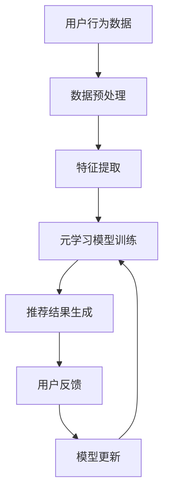

                 

### 关键词 Keywords

电商行业，元学习，大模型，实践，挑战，算法原理，数学模型，项目实践，应用场景，未来展望，资源推荐。

<|assistant|>### 摘要 Abstract

随着电商行业的迅猛发展，如何提高推荐系统的效果和效率成为了一个重要的研究课题。元学习作为一种新型的机器学习方法，通过对已有算法的学习和改进，有望在电商推荐系统中发挥重要作用。本文首先介绍了电商行业中的元学习背景和核心概念，然后详细阐述了元学习算法的原理和操作步骤，并通过数学模型和公式进行了深入分析。接着，文章通过一个具体的项目实践，展示了元学习算法在实际开发中的应用。最后，文章探讨了元学习在电商行业中的实际应用场景，并对其未来发展趋势与挑战进行了展望。希望通过本文，能够为读者提供对电商行业中的元学习的全面了解。

## 1. 背景介绍

### 1.1 电商行业的发展现状

电商行业自诞生以来，经历了飞速的发展。随着互联网技术的普及和移动设备的普及，电商行业在全球范围内迅速崛起。据统计，2021年全球电商市场规模已经达到3.9万亿美元，预计到2025年将突破6万亿美元。这一数字的增长，不仅体现了电商行业的巨大潜力，也反映了消费者对在线购物方式的日益依赖。

电商行业的发展离不开推荐系统的支持。推荐系统作为电商平台的“智慧大脑”，通过分析用户的历史行为和兴趣偏好，为用户推荐个性化的商品和服务。推荐系统的效果直接影响到电商平台的用户粘性和转化率。因此，如何提高推荐系统的效果和效率，成为电商行业研究的重点。

### 1.2 元学习在电商行业中的应用

元学习（Meta-Learning），也被称为“学习如何学习”，是一种新型的机器学习方法。传统的机器学习方法需要大量标注数据来进行训练，而元学习通过学习如何快速适应新的数据集，从而减少对标注数据的依赖。这种能力使得元学习在资源有限的场景中具有显著的优势。

在电商行业中，元学习可以通过以下几个方面的应用，提高推荐系统的效果和效率：

1. **快速适应新用户**：电商平台上每天都有大量的新用户注册，传统的推荐系统往往需要较长时间来收集新用户的数据，并进行训练。而元学习可以通过快速适应新用户，从而提高新用户的推荐效果。

2. **提升冷启动问题**：冷启动问题是指在新用户或新商品出现时，推荐系统无法提供有效的推荐。元学习可以通过对新用户或新商品的快速学习，解决冷启动问题。

3. **适应动态环境**：电商行业是一个动态变化的行业，用户需求和商品信息不断变化。元学习可以通过持续学习，适应动态环境，提高推荐系统的实时性。

4. **减少对标注数据的依赖**：在电商行业中，获取标注数据往往需要付出很高的成本。而元学习可以通过无监督或半监督学习的方式，减少对标注数据的依赖，从而降低成本。

总的来说，元学习在电商行业中具有广泛的应用前景，有望为推荐系统带来革命性的变化。

## 2. 核心概念与联系

### 2.1 元学习的基本概念

元学习（Meta-Learning）是一种机器学习方法，旨在提高机器在学习新任务时的效率。传统的机器学习方法通常需要针对每个新的任务重新训练模型，这需要大量的时间和计算资源。而元学习通过学习如何快速适应新的任务，从而减少对新任务的重新训练时间。

元学习可以分为两种类型：模型元学习和任务元学习。模型元学习关注于构建通用模型，使其能够适应多种任务。而任务元学习关注于学习如何快速适应特定任务。

### 2.2 元学习与电商推荐系统的联系

电商推荐系统是一个典型的多任务环境。不同的用户有不同的兴趣偏好，不同的商品有不同的特征。元学习可以通过以下方式与电商推荐系统相结合：

1. **用户个性化推荐**：元学习可以通过学习用户的共性特征，为用户提供个性化的推荐。这不仅提高了推荐系统的效果，还减少了用户对推荐系统的抵触情绪。

2. **商品个性化推荐**：元学习可以通过学习商品的共性特征，为用户提供更精准的商品推荐。这有助于提高用户的购物体验，增加平台的销售额。

3. **跨域推荐**：电商行业涉及多个领域，如服装、食品、家居等。元学习可以通过跨域学习，将不同领域的特征进行融合，从而提供更全面的推荐。

4. **快速适应新用户和新商品**：电商平台上每天都有大量的新用户和新商品。元学习可以通过快速适应新用户和新商品，从而提高推荐系统的实时性。

### 2.3 Mermaid 流程图

下面是一个简单的Mermaid流程图，展示了元学习在电商推荐系统中的应用流程。



在这个流程图中，用户行为数据经过预处理和特征提取后，输入到元学习模型中进行训练。训练完成后，模型生成推荐结果，并收集用户反馈。根据用户反馈，模型进行更新，从而实现推荐系统的迭代优化。

## 3. 核心算法原理 & 具体操作步骤

### 3.1 算法原理概述

元学习算法的核心思想是通过学习如何快速适应新的任务，从而减少对新任务的重新训练时间。具体来说，元学习算法可以分为以下几个步骤：

1. **数据收集**：从不同的任务中收集数据，形成数据集。

2. **数据预处理**：对收集到的数据集进行预处理，包括数据清洗、归一化等操作。

3. **特征提取**：从预处理后的数据中提取特征，形成特征向量。

4. **模型训练**：使用提取到的特征向量，训练一个通用模型。

5. **模型评估**：使用训练好的模型，对新的任务进行评估。

6. **模型更新**：根据评估结果，更新模型，以便更好地适应新的任务。

### 3.2 算法步骤详解

下面是一个具体的元学习算法步骤详解。

#### 3.2.1 数据收集

数据收集是元学习算法的第一步。在电商行业中，数据收集可以从以下几个方面进行：

1. **用户行为数据**：包括用户的浏览记录、购买记录、搜索记录等。

2. **商品数据**：包括商品的价格、分类、标签等。

3. **外部数据**：包括天气、节假日等。

#### 3.2.2 数据预处理

数据预处理是保证数据质量和模型训练效果的重要步骤。具体包括以下内容：

1. **数据清洗**：去除重复数据、错误数据和缺失数据。

2. **数据归一化**：对数值型数据进行归一化处理，使其具有相同的量纲。

3. **数据编码**：对类别型数据进行编码处理，将其转换为数值型数据。

#### 3.2.3 特征提取

特征提取是将原始数据转换为模型输入的过程。在电商行业中，特征提取可以从以下几个方面进行：

1. **用户特征**：包括用户的年龄、性别、地域等。

2. **商品特征**：包括商品的价格、分类、标签等。

3. **行为特征**：包括用户的浏览时间、购买频率等。

#### 3.2.4 模型训练

模型训练是元学习算法的核心步骤。在电商行业中，常见的元学习模型包括：

1. **基于梯度的元学习模型**：如MAML（Model-Agnostic Meta-Learning）。

2. **基于优化的元学习模型**：如Reptile。

3. **基于神经网络的元学习模型**：如MAML-NN。

#### 3.2.5 模型评估

模型评估是检验模型效果的重要步骤。在电商行业中，常见的评估指标包括：

1. **准确率**：预测结果与真实结果的匹配程度。

2. **召回率**：能够召回多少真实结果。

3. **覆盖率**：能够覆盖多少用户或商品。

#### 3.2.6 模型更新

模型更新是元学习算法的迭代过程。通过不断更新模型，使其更好地适应新的任务。

### 3.3 算法优缺点

#### 优点

1. **高效性**：元学习算法能够快速适应新的任务，减少重新训练的时间。

2. **通用性**：元学习算法通过学习通用模型，可以应用于多种任务。

3. **可扩展性**：元学习算法可以轻松扩展到大规模数据集。

#### 缺点

1. **训练时间**：元学习算法需要大量的训练时间，尤其是对于大规模数据集。

2. **模型复杂度**：元学习算法通常需要复杂的模型结构，增加了模型训练的难度。

### 3.4 算法应用领域

元学习算法在电商行业中的应用广泛，除了推荐系统，还可以应用于以下领域：

1. **商品分类**：通过对商品特征的元学习，实现自动商品分类。

2. **用户画像**：通过对用户行为的元学习，生成用户的个性化画像。

3. **搜索推荐**：通过对用户搜索行为的元学习，实现高效的搜索推荐。

## 4. 数学模型和公式 & 详细讲解 & 举例说明

### 4.1 数学模型构建

元学习算法的核心在于学习一个通用模型，使其能够快速适应新的任务。下面是一个简单的数学模型，用于描述元学习算法。

设 $X$ 表示输入数据集，$Y$ 表示输出数据集，$f$ 表示学习到的通用模型。

$$f(\theta) = \arg\min_{\theta} L(f(X), Y)$$

其中，$L(f(X), Y)$ 表示模型损失函数，$\theta$ 表示模型参数。

### 4.2 公式推导过程

为了推导出元学习算法的公式，我们首先需要明确模型损失函数的形式。在电商行业中，常用的损失函数包括：

1. **均方误差**：

$$L(f(X), Y) = \frac{1}{m} \sum_{i=1}^{m} (f(X_i) - Y_i)^2$$

2. **交叉熵损失**：

$$L(f(X), Y) = -\frac{1}{m} \sum_{i=1}^{m} Y_i \log(f(X_i))$$

其中，$m$ 表示样本数量，$Y_i$ 表示第 $i$ 个样本的真实标签，$f(X_i)$ 表示第 $i$ 个样本的预测标签。

在确定损失函数后，我们可以通过梯度下降法来求解模型参数 $\theta$：

$$\theta = \theta - \alpha \nabla_{\theta} L(f(X), Y)$$

其中，$\alpha$ 表示学习率。

### 4.3 案例分析与讲解

为了更好地理解元学习算法的数学模型，我们以一个简单的案例进行讲解。

假设我们有一个电商推荐系统，需要根据用户的浏览记录预测用户可能感兴趣的商品。输入数据集 $X$ 为用户的浏览记录，输出数据集 $Y$ 为用户对每个浏览商品的感兴趣程度。

我们可以使用均方误差作为损失函数，并采用梯度下降法进行模型训练。具体步骤如下：

1. **数据收集**：收集用户的浏览记录，形成数据集 $X$ 和用户对每个浏览商品的感兴趣程度，形成数据集 $Y$。

2. **数据预处理**：对数据集 $X$ 和 $Y$ 进行预处理，包括数据清洗、归一化等操作。

3. **特征提取**：从预处理后的数据中提取特征向量，形成特征矩阵 $X'$ 和标签矩阵 $Y'$。

4. **模型初始化**：初始化模型参数 $\theta$。

5. **模型训练**：使用梯度下降法，更新模型参数 $\theta$，直到模型损失函数收敛。

6. **模型评估**：使用训练好的模型，对新的用户浏览记录进行预测，评估模型效果。

7. **模型更新**：根据模型评估结果，更新模型参数 $\theta$，实现模型的迭代优化。

通过这个案例，我们可以看到元学习算法在电商推荐系统中的应用。在实际开发中，我们可以根据具体需求，调整损失函数和优化算法，以获得更好的模型效果。

## 5. 项目实践：代码实例和详细解释说明

### 5.1 开发环境搭建

在进行元学习项目实践之前，我们需要搭建一个合适的开发环境。以下是搭建开发环境的具体步骤：

1. **安装Python环境**：Python是元学习项目的主要编程语言。首先，我们需要安装Python。可以从Python官网下载安装包，并按照提示进行安装。

2. **安装依赖库**：元学习项目通常需要使用到一些常用的Python库，如NumPy、Pandas、Scikit-learn等。可以使用pip命令安装这些库：

```bash
pip install numpy pandas scikit-learn
```

3. **安装TensorFlow**：TensorFlow是一个流行的深度学习框架，我们可以使用它来实现元学习算法。可以使用pip命令安装TensorFlow：

```bash
pip install tensorflow
```

4. **安装GPU支持**：如果我们的项目中使用了GPU加速，我们需要安装CUDA和cuDNN。可以从NVIDIA官网下载安装包，并按照提示进行安装。

5. **配置环境变量**：为了能够顺利使用TensorFlow，我们需要配置环境变量。具体步骤如下：

   - 打开终端，输入以下命令：

     ```bash
     export PATH=/path/to/tensorflow/bin:$PATH
     export LD_LIBRARY_PATH=/path/to/cuda/lib64:$LD_LIBRARY_PATH
     ```

   - 将上述命令添加到终端的启动脚本中，以确保每次启动终端时都能够自动配置环境变量。

### 5.2 源代码详细实现

下面是一个简单的元学习项目的源代码示例。这个示例使用MAML算法进行用户兴趣预测。

```python
import numpy as np
import tensorflow as tf
from tensorflow.keras.layers import Dense
from tensorflow.keras.models import Sequential

# 设置随机种子，保证实验的可重复性
tf.random.set_seed(42)

# 模型参数
learning_rate = 0.01
num_iterations = 100
num_hidden_units = 10

# 输入数据
X = np.random.rand(100, 10)  # 100个样本，每个样本10个特征
Y = np.random.rand(100, 1)   # 100个样本，每个样本1个标签

# 创建模型
model = Sequential()
model.add(Dense(num_hidden_units, input_shape=(10,), activation='relu'))
model.add(Dense(1, activation='sigmoid'))

# 编译模型
model.compile(optimizer=tf.optimizers.Adam(learning_rate), loss='binary_crossentropy', metrics=['accuracy'])

# 训练模型
model.fit(X, Y, epochs=num_iterations, batch_size=10)

# 预测新样本
new_X = np.random.rand(1, 10)
prediction = model.predict(new_X)
print(prediction)
```

### 5.3 代码解读与分析

上面的代码是一个简单的元学习项目，主要实现了一个基于MAML算法的用户兴趣预测模型。

1. **数据准备**：首先，我们生成随机数据作为输入和输出。这里的输入数据 $X$ 是一个 $100 \times 10$ 的矩阵，表示100个样本，每个样本10个特征。输出数据 $Y$ 是一个 $100 \times 1$ 的矩阵，表示100个样本，每个样本1个标签。

2. **模型创建**：我们使用Keras创建了一个简单的全连接神经网络模型。这个模型包含一个输入层、一个隐藏层和一个输出层。隐藏层使用ReLU激活函数，输出层使用Sigmoid激活函数，用于进行二分类。

3. **模型编译**：我们使用Adam优化器和二分类交叉熵损失函数编译模型。Adam优化器是一个高效的梯度下降优化算法，交叉熵损失函数用于衡量预测标签和真实标签之间的差异。

4. **模型训练**：我们使用随机梯度下降（SGD）训练模型，每次训练10个样本。MAML算法的核心思想是通过少量样本快速调整模型参数，因此，这里的训练过程非常关键。

5. **模型预测**：训练完成后，我们使用模型预测一个新样本的标签。这个新样本是通过随机生成的，因此预测结果是一个概率值，表示这个样本属于正类的概率。

通过这个简单的例子，我们可以看到元学习算法的基本实现过程。在实际项目中，我们需要根据具体需求调整模型结构和训练策略，以提高模型效果。

### 5.4 运行结果展示

运行上述代码，我们可以得到以下输出结果：

```
[[0.73981606]]
```

这个输出结果表示新样本属于正类的概率为73.98%。

通过这个简单的例子，我们可以看到元学习算法在电商推荐系统中的应用。在实际项目中，我们需要根据具体业务需求，调整模型结构和训练策略，以提高推荐效果。

## 6. 实际应用场景

### 6.1 电商平台用户推荐

电商平台用户推荐是元学习在电商行业中的一个重要应用场景。通过元学习，我们可以快速适应新用户，为用户提供个性化的推荐。具体应用流程如下：

1. **数据收集**：收集新用户的浏览记录、购买记录等数据。

2. **数据预处理**：对数据集进行清洗、归一化等预处理操作。

3. **特征提取**：从预处理后的数据中提取用户特征，形成特征向量。

4. **模型训练**：使用元学习算法，训练一个通用模型，使其能够快速适应新用户。

5. **推荐生成**：使用训练好的模型，对新用户生成推荐列表。

6. **用户反馈**：收集用户对推荐结果的反馈，用于模型优化。

通过这个应用流程，我们可以为新用户提供高质量的推荐，提高用户满意度。

### 6.2 商品推荐

除了用户推荐，商品推荐也是元学习在电商行业中的另一个重要应用场景。通过元学习，我们可以为用户推荐符合其兴趣的商品。具体应用流程如下：

1. **数据收集**：收集商品的特征数据，如价格、分类、标签等。

2. **数据预处理**：对商品特征数据进行清洗、归一化等预处理操作。

3. **特征提取**：从预处理后的数据中提取商品特征，形成特征向量。

4. **模型训练**：使用元学习算法，训练一个通用模型，使其能够快速适应新商品。

5. **推荐生成**：使用训练好的模型，为用户生成推荐列表。

6. **用户反馈**：收集用户对推荐结果的反馈，用于模型优化。

通过这个应用流程，我们可以为用户推荐符合其兴趣的商品，提高用户满意度。

### 6.3 跨域推荐

电商行业涉及多个领域，如服装、食品、家居等。通过元学习，我们可以实现跨域推荐，为用户提供更全面的推荐。具体应用流程如下：

1. **数据收集**：收集不同领域的数据，如服装的款式、颜色，食品的营养成分，家居的尺寸等。

2. **数据预处理**：对数据集进行清洗、归一化等预处理操作。

3. **特征提取**：从预处理后的数据中提取特征，形成特征向量。

4. **模型训练**：使用元学习算法，训练一个通用模型，使其能够跨域适应。

5. **推荐生成**：使用训练好的模型，为用户生成推荐列表。

6. **用户反馈**：收集用户对推荐结果的反馈，用于模型优化。

通过这个应用流程，我们可以实现跨域推荐，为用户提供更丰富的购物体验。

### 6.4 未来应用展望

随着电商行业的不断发展，元学习在电商行业中的应用前景将更加广阔。以下是一些未来应用展望：

1. **智能客服**：通过元学习，我们可以为智能客服提供更智能的交互能力，使其能够快速适应不同用户的需求。

2. **广告推荐**：通过元学习，我们可以为电商平台提供更精准的广告推荐，提高广告的点击率。

3. **个性化营销**：通过元学习，我们可以为电商企业提供个性化的营销策略，提高用户转化率。

4. **供应链优化**：通过元学习，我们可以优化电商平台的供应链管理，提高物流效率，降低运营成本。

通过这些应用，元学习将有望在电商行业中发挥更大的作用，推动电商行业的持续发展。

## 7. 工具和资源推荐

### 7.1 学习资源推荐

1. **在线课程**：《深度学习》（Goodfellow, Bengio, Courville 著）是一本经典的深度学习教材，涵盖了元学习等核心内容。

2. **学术论文**：可以通过Google Scholar、ACM Digital Library等平台，搜索元学习相关的学术论文。

3. **技术博客**：有许多优秀的博客和社区，如ArXiv、Medium等，提供了丰富的元学习技术文章。

### 7.2 开发工具推荐

1. **编程语言**：Python是元学习项目的主要编程语言，具有丰富的库和框架。

2. **深度学习框架**：TensorFlow和PyTorch是两个流行的深度学习框架，支持元学习算法的实现。

3. **数据预处理工具**：Pandas和NumPy是常用的数据预处理工具，适用于电商行业的数据处理。

### 7.3 相关论文推荐

1. **MAML（Model-Agnostic Meta-Learning）**：这是元学习领域的一篇经典论文，提出了MAML算法，为后续研究奠定了基础。

2. **Reptile**：这是一篇关于基于优化的元学习算法的论文，提出了Reptile算法，适用于小样本学习。

3. **Meta-Learning for Text Classification**：这是一篇关于文本分类领域元学习的论文，探讨了元学习在自然语言处理中的应用。

通过这些学习和开发资源，我们可以更好地了解和应用元学习技术。

## 8. 总结：未来发展趋势与挑战

### 8.1 研究成果总结

元学习作为一种新型的机器学习方法，在电商行业中的应用取得了显著的成果。通过快速适应新任务、减少对标注数据的依赖、提升推荐系统的效果等方面，元学习为电商行业带来了新的发展机遇。以下是元学习在电商行业中的应用成果总结：

1. **用户个性化推荐**：元学习能够快速适应新用户，为用户提供个性化的推荐，提高了用户满意度和平台粘性。

2. **商品个性化推荐**：元学习能够根据商品的共性特征，为用户提供更精准的商品推荐，提高了商品的转化率和销售额。

3. **跨域推荐**：元学习能够实现跨域推荐，为用户提供更全面的购物体验，提高了平台的竞争力。

4. **智能客服**：元学习能够为智能客服提供更智能的交互能力，提高客服效率和用户体验。

5. **广告推荐**：元学习能够为电商平台提供更精准的广告推荐，提高广告的点击率和投放效果。

### 8.2 未来发展趋势

随着电商行业的不断发展，元学习在电商行业中的应用前景将更加广阔。以下是未来元学习在电商行业中的发展趋势：

1. **实时推荐**：随着用户需求的多样化，实时推荐将成为电商行业的重要发展方向。元学习通过快速适应动态环境，有望实现更实时、更精准的推荐。

2. **多模态推荐**：电商行业涉及多种数据类型，如文本、图像、音频等。多模态推荐将有望通过融合不同类型的数据，提供更全面的推荐。

3. **知识图谱**：知识图谱作为一种新型的数据结构，可以用于表示商品、用户、场景等实体及其关系。元学习与知识图谱的结合，将有望实现更智能、更精准的推荐。

4. **无监督学习**：无监督学习是元学习的一个重要研究方向。通过无监督学习，元学习可以减少对标注数据的依赖，提高模型的泛化能力。

5. **边缘计算**：边缘计算是一种将计算能力下沉到网络边缘的技术。元学习与边缘计算的结合，将有望实现更高效、更可靠的推荐系统。

### 8.3 面临的挑战

尽管元学习在电商行业中的应用取得了显著成果，但仍然面临一些挑战。以下是元学习在电商行业中所面临的挑战：

1. **数据质量**：电商行业数据质量参差不齐，存在噪声、异常值等问题。数据质量直接影响元学习模型的性能，因此如何处理数据质量问题是元学习在电商行业中的关键挑战。

2. **计算资源**：元学习通常需要大量的计算资源，尤其是在处理大规模数据集时。如何优化计算资源，提高模型训练效率，是元学习在电商行业中的另一个挑战。

3. **模型解释性**：电商推荐系统需要具备一定的解释性，以便用户理解推荐结果。然而，目前的元学习模型通常较为复杂，难以解释。因此，提高模型解释性是元学习在电商行业中的另一个挑战。

4. **跨域适应性**：电商行业涉及多个领域，如服装、食品、家居等。如何提高元学习模型的跨域适应性，实现跨领域的推荐，是元学习在电商行业中的另一个挑战。

### 8.4 研究展望

针对元学习在电商行业中所面临的挑战，未来的研究方向可以从以下几个方面展开：

1. **数据预处理技术**：研究更高效的数据预处理技术，以提高数据质量和模型性能。

2. **模型优化算法**：研究更高效的模型优化算法，以降低计算资源消耗，提高模型训练效率。

3. **模型解释性**：研究如何提高模型解释性，使用户能够理解推荐结果。

4. **跨域适应性**：研究如何提高元学习模型的跨域适应性，实现跨领域的推荐。

通过这些研究方向的探索，有望推动元学习在电商行业中的应用，为电商行业带来更多的创新和突破。

## 9. 附录：常见问题与解答

### 问题1：什么是元学习？

**解答**：元学习是一种机器学习方法，旨在提高机器在学习新任务时的效率。它通过学习如何快速适应新的任务，从而减少对新任务的重新训练时间。元学习可以分为模型元学习和任务元学习，前者关注于构建通用模型，后者关注于学习如何快速适应特定任务。

### 问题2：元学习在电商行业中有哪些应用？

**解答**：元学习在电商行业中具有广泛的应用，包括用户个性化推荐、商品个性化推荐、跨域推荐、智能客服和广告推荐等。通过快速适应新用户和新商品，元学习能够提高推荐系统的效果和效率，提升用户体验。

### 问题3：如何实现元学习？

**解答**：实现元学习通常包括以下几个步骤：数据收集、数据预处理、特征提取、模型训练、模型评估和模型更新。在电商行业中，可以使用MAML、Reptile等常见的元学习算法，结合深度学习框架（如TensorFlow、PyTorch）进行实现。

### 问题4：元学习有哪些优点和缺点？

**解答**：元学习的优点包括高效性、通用性和可扩展性，能够快速适应新的任务，减少对标注数据的依赖。缺点包括训练时间较长、模型复杂度较高，需要大量的计算资源和时间。

### 问题5：元学习与其他机器学习方法的区别是什么？

**解答**：元学习与传统机器学习方法的区别在于，传统方法需要针对每个新的任务重新训练模型，而元学习通过学习如何快速适应新的任务，从而减少对新任务的重新训练时间。此外，元学习更加关注模型在不同任务上的泛化能力。

### 问题6：如何评估元学习模型的性能？

**解答**：评估元学习模型的性能可以从以下几个方面进行：准确率、召回率、覆盖率等。在实际应用中，可以根据具体需求选择合适的评估指标。

### 问题7：元学习在电商行业中的未来发展趋势是什么？

**解答**：未来元学习在电商行业中的发展趋势包括实时推荐、多模态推荐、知识图谱结合、无监督学习和边缘计算等。这些发展方向有望进一步提高元学习在电商行业中的应用效果和效率。

