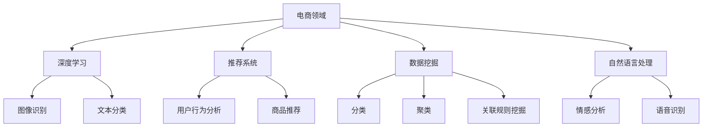

                 

关键词：电商、AI大模型、深度学习、推荐系统、数据挖掘、自然语言处理、个性化营销、智能客服、智能搜索、多模态交互

> 摘要：随着电子商务的快速发展，人工智能（AI）大模型在电商领域的应用越来越广泛，带来了巨大的变革。本文将探讨AI大模型在电商中的革命性应用，包括推荐系统、数据挖掘、自然语言处理、个性化营销、智能客服、智能搜索、多模态交互等方面，并分析其应用现状、优势、挑战和未来展望。

## 1. 背景介绍

电商作为数字经济的重要组成部分，近年来呈现出爆发式增长。根据Statista的数据，全球电商市场规模预计将在2023年达到4.7万亿美金，占据全球零售市场的比例也逐年上升。随着互联网技术的普及和消费者习惯的变化，电商企业面临着巨大的机遇和挑战。

AI技术的飞速发展，尤其是深度学习、自然语言处理、推荐系统等领域的突破，为电商企业提供了强大的工具。AI大模型具有强大的数据处理能力和模式识别能力，可以处理海量数据，发现隐藏的模式和趋势，从而为电商企业提供更智能的决策支持和更高效的运营方式。

在电商领域，AI大模型的应用不仅提高了企业的运营效率，还大大提升了用户体验。例如，通过推荐系统，企业可以更准确地了解用户需求，提供个性化的商品推荐；通过智能客服，企业可以提供24小时无缝的客服服务，提升客户满意度；通过自然语言处理，企业可以更有效地处理用户反馈，优化产品和服务。

## 2. 核心概念与联系

为了更好地理解AI大模型在电商中的应用，我们首先需要了解一些核心概念，包括深度学习、推荐系统、数据挖掘、自然语言处理等。

### 2.1 深度学习

深度学习是一种基于人工神经网络的学习方法，通过多层非线性变换，自动从数据中提取特征，完成复杂的数据分析和模式识别任务。在电商领域，深度学习被广泛应用于图像识别、文本分类、商品推荐等方面。

### 2.2 推荐系统

推荐系统是一种基于用户行为数据和商品信息，为用户提供个性化推荐的系统。深度学习在推荐系统中起到了至关重要的作用，通过深度神经网络，推荐系统可以从海量的用户行为数据中提取出有效的特征，实现更精准的推荐。

### 2.3 数据挖掘

数据挖掘是一种从大量数据中提取有价值信息的过程，包括分类、聚类、关联规则挖掘等。在电商领域，数据挖掘可以帮助企业发现用户的购买行为模式，优化商品库存和供应链管理。

### 2.4 自然语言处理

自然语言处理是一种让计算机理解和处理人类语言的技术，包括文本分类、情感分析、语音识别等。在电商领域，自然语言处理可以帮助企业更好地理解用户需求，优化客服和营销策略。

### 2.5 Mermaid流程图

以下是一个简单的Mermaid流程图，展示了电商领域中AI大模型的核心概念之间的联系：



## 3. 核心算法原理 & 具体操作步骤

### 3.1 算法原理概述

电商领域中AI大模型的核心算法主要包括深度学习算法、推荐算法、数据挖掘算法和自然语言处理算法。以下将分别介绍这些算法的原理。

#### 3.1.1 深度学习算法

深度学习算法基于多层神经网络，通过反向传播算法训练模型。在电商领域，深度学习算法可以用于图像识别、文本分类、商品推荐等任务。

#### 3.1.2 推荐算法

推荐算法的核心是通过用户行为数据和商品信息，构建用户和商品之间的关联模型，从而实现个性化推荐。常见的推荐算法包括基于内容的推荐、协同过滤推荐和基于模型的推荐等。

#### 3.1.3 数据挖掘算法

数据挖掘算法包括分类、聚类、关联规则挖掘等。分类算法可以将用户行为数据分为不同的类别，聚类算法可以将用户行为数据分为不同的群体，关联规则挖掘可以找到用户行为数据之间的关联关系。

#### 3.1.4 自然语言处理算法

自然语言处理算法包括文本分类、情感分析、语音识别等。文本分类可以将用户评论分为正面和负面，情感分析可以分析用户评论的情感倾向，语音识别可以将语音转换为文字。

### 3.2 算法步骤详解

#### 3.2.1 深度学习算法步骤

1. 数据收集与预处理：收集电商平台的用户行为数据、商品数据等，并进行数据清洗和预处理。
2. 构建神经网络模型：设计神经网络结构，包括输入层、隐藏层和输出层。
3. 模型训练与优化：使用训练数据训练模型，并通过交叉验证和网格搜索等方法优化模型参数。
4. 模型评估与部署：使用测试数据评估模型性能，并在实际应用中部署模型。

#### 3.2.2 推荐算法步骤

1. 数据收集与预处理：收集用户行为数据和商品数据，并进行数据清洗和预处理。
2. 用户行为分析：使用分类、聚类等方法分析用户行为，提取用户特征。
3. 商品信息处理：使用文本分类、情感分析等方法处理商品信息，提取商品特征。
4. 构建推荐模型：使用用户特征和商品特征构建推荐模型，实现个性化推荐。
5. 推荐结果评估与优化：使用测试数据评估推荐结果，并优化推荐模型。

#### 3.2.3 数据挖掘算法步骤

1. 数据收集与预处理：收集电商平台的用户行为数据、商品数据等，并进行数据清洗和预处理。
2. 特征工程：提取用户行为特征、商品特征等，进行特征选择和特征转换。
3. 模型构建与训练：使用分类、聚类等方法构建模型，并使用训练数据进行模型训练。
4. 模型评估与优化：使用测试数据进行模型评估，并根据评估结果优化模型。
5. 模型部署与应用：在实际应用中部署模型，并应用于电商运营。

#### 3.2.4 自然语言处理算法步骤

1. 数据收集与预处理：收集用户评论、商品描述等数据，并进行数据清洗和预处理。
2. 文本处理：使用分词、词性标注等方法处理文本数据，提取文本特征。
3. 模型构建与训练：设计文本分类、情感分析等模型，并使用训练数据进行模型训练。
4. 模型评估与优化：使用测试数据进行模型评估，并根据评估结果优化模型。
5. 模型部署与应用：在实际应用中部署模型，并应用于电商运营。

### 3.3 算法优缺点

#### 3.3.1 深度学习算法

优点：强大的数据处理能力和模式识别能力，可以处理海量数据，发现隐藏的模式和趋势。

缺点：对数据量要求较高，模型训练时间较长，对计算资源需求较高。

#### 3.3.2 推荐算法

优点：可以根据用户行为和商品信息，实现个性化推荐，提高用户满意度。

缺点：需要大量的用户行为数据和商品信息，数据质量对推荐效果影响较大。

#### 3.3.3 数据挖掘算法

优点：可以帮助企业发现用户行为模式，优化商品库存和供应链管理。

缺点：对数据质量和数据量要求较高，算法复杂度较高。

#### 3.3.4 自然语言处理算法

优点：可以帮助企业更好地理解用户需求，优化客服和营销策略。

缺点：对语言理解能力要求较高，算法复杂度较高，需要大量的训练数据。

### 3.4 算法应用领域

深度学习算法在电商领域的应用包括图像识别、文本分类、商品推荐等；推荐算法在电商领域的应用包括个性化推荐、用户行为分析等；数据挖掘算法在电商领域的应用包括用户行为分析、商品库存优化等；自然语言处理算法在电商领域的应用包括客服自动化、情感分析等。

## 4. 数学模型和公式 & 详细讲解 & 举例说明

### 4.1 数学模型构建

在电商领域中，AI大模型的数学模型主要包括深度学习模型、推荐模型、数据挖掘模型和自然语言处理模型。以下分别介绍这些模型的构建方法。

#### 4.1.1 深度学习模型

深度学习模型通常采用多层感知机（MLP）、卷积神经网络（CNN）、循环神经网络（RNN）等结构。以下是一个简单的MLP模型构建示例：

$$
y = \sigma(\mathbf{W}^T \mathbf{a} + b)
$$

其中，$\sigma$ 是激活函数，$\mathbf{W}$ 是权重矩阵，$\mathbf{a}$ 是输入向量，$b$ 是偏置项。

#### 4.1.2 推荐模型

推荐模型通常采用基于内容的推荐（Content-based Recommendation）和协同过滤推荐（Collaborative Filtering）等方法。以下是一个简单的基于内容的推荐模型构建示例：

$$
\hat{r}_{ui} = f(\mathbf{q}_i, \mathbf{p}_u)
$$

其中，$\hat{r}_{ui}$ 是用户 $u$ 对商品 $i$ 的推荐评分，$\mathbf{q}_i$ 是商品 $i$ 的特征向量，$\mathbf{p}_u$ 是用户 $u$ 的特征向量，$f$ 是推荐函数。

#### 4.1.3 数据挖掘模型

数据挖掘模型通常采用分类（Classification）、聚类（Clustering）、关联规则挖掘（Association Rule Learning）等方法。以下是一个简单的分类模型构建示例：

$$
C = \arg\max_{c} P(c|\mathbf{x})
$$

其中，$C$ 是分类结果，$c$ 是类别标签，$\mathbf{x}$ 是输入特征向量，$P(c|\mathbf{x})$ 是后验概率。

#### 4.1.4 自然语言处理模型

自然语言处理模型通常采用循环神经网络（RNN）、长短时记忆网络（LSTM）、门控循环单元（GRU）等方法。以下是一个简单的RNN模型构建示例：

$$
h_t = \text{tanh}(\mathbf{U}h_{t-1} + \mathbf{W}x_t + b)
$$

其中，$h_t$ 是当前时刻的隐藏状态，$x_t$ 是当前时刻的输入，$\mathbf{U}$ 和 $\mathbf{W}$ 是权重矩阵，$b$ 是偏置项。

### 4.2 公式推导过程

#### 4.2.1 深度学习模型

以MLP模型为例，假设输入层有 $m$ 个神经元，隐藏层有 $n$ 个神经元，输出层有 $k$ 个神经元。权重矩阵 $\mathbf{W}$ 和偏置项 $b$ 分别为 $\mathbf{W} \in \mathbb{R}^{n \times m}$ 和 $b \in \mathbb{R}^{n \times 1}$。

输入层到隐藏层的传递函数为：

$$
a_j = \sum_{i=1}^{m} w_{ij} x_i + b_j \quad \forall j = 1, 2, \ldots, n
$$

隐藏层到输出层的传递函数为：

$$
y_k = \sigma(\sum_{j=1}^{n} w_{kj} a_j + b_k) \quad \forall k = 1, 2, \ldots, k
$$

#### 4.2.2 推荐模型

以基于内容的推荐为例，假设用户 $u$ 对商品 $i$ 的兴趣可以表示为两个向量 $\mathbf{q}_i$ 和 $\mathbf{p}_u$，其中 $\mathbf{q}_i \in \mathbb{R}^d$ 和 $\mathbf{p}_u \in \mathbb{R}^d$ 分别表示商品 $i$ 的特征和用户 $u$ 的特征。

推荐评分可以表示为：

$$
\hat{r}_{ui} = \mathbf{q}_i \cdot \mathbf{p}_u = \sum_{j=1}^{d} q_{ij} p_{uj}
$$

#### 4.2.3 数据挖掘模型

以分类模型为例，假设有 $C$ 个类别标签，输入特征向量为 $\mathbf{x} \in \mathbb{R}^d$，权重矩阵为 $\mathbf{W} \in \mathbb{R}^{C \times d}$，偏置项为 $b \in \mathbb{R}^{C \times 1}$。

类别概率可以表示为：

$$
P(c|\mathbf{x}) = \frac{e^{\mathbf{w}_c \cdot \mathbf{x} + b_c}}{\sum_{c'=1}^{C} e^{\mathbf{w}_{c'} \cdot \mathbf{x} + b_{c'}}}
$$

#### 4.2.4 自然语言处理模型

以RNN为例，假设输入特征向量为 $x_t \in \mathbb{R}^d$，隐藏状态向量为 $h_t \in \mathbb{R}^d$，权重矩阵为 $\mathbf{U} \in \mathbb{R}^{d \times d}$，$\mathbf{W} \in \mathbb{R}^{d \times d}$，偏置项为 $b \in \mathbb{R}^{d \times 1}$。

当前时刻的隐藏状态可以表示为：

$$
h_t = \text{tanh}(\mathbf{U}h_{t-1} + \mathbf{W}x_t + b)
$$

### 4.3 案例分析与讲解

#### 4.3.1 深度学习模型案例

假设有一个电商网站，需要根据用户的历史购物行为和商品特征，为用户推荐可能感兴趣的商品。可以使用MLP模型进行商品推荐。

1. 数据收集与预处理：收集用户的历史购物数据，包括用户ID、商品ID、购买时间等信息，并进行数据清洗和预处理。

2. 特征提取：对用户和商品进行特征提取，例如用户特征可以包括用户购买频率、购买金额等，商品特征可以包括商品类别、价格等。

3. 模型构建：设计MLP模型，包括输入层、隐藏层和输出层。输入层有 $m$ 个神经元，隐藏层有 $n$ 个神经元，输出层有 $k$ 个神经元。

4. 模型训练：使用训练数据训练MLP模型，通过反向传播算法优化模型参数。

5. 模型评估：使用测试数据评估模型性能，例如计算准确率、召回率等。

6. 模型部署：将训练好的模型部署到电商网站，实现商品推荐功能。

#### 4.3.2 推荐模型案例

假设有一个电商网站，需要根据用户的浏览记录和购买历史，为用户推荐可能感兴趣的商品。可以使用基于内容的推荐模型进行商品推荐。

1. 数据收集与预处理：收集用户的浏览记录和购买历史数据，并进行数据清洗和预处理。

2. 特征提取：对商品进行特征提取，例如商品类别、价格、品牌等。

3. 模型构建：设计基于内容的推荐模型，包括用户特征和商品特征的相似度计算。

4. 模型训练：使用训练数据训练模型，通过相似度计算和评分预测实现商品推荐。

5. 模型评估：使用测试数据评估模型性能，例如计算准确率、召回率等。

6. 模型部署：将训练好的模型部署到电商网站，实现商品推荐功能。

#### 4.3.3 数据挖掘模型案例

假设有一个电商网站，需要分析用户的购物行为，优化商品库存和供应链管理。可以使用分类模型进行用户行为分析。

1. 数据收集与预处理：收集用户的购物行为数据，包括用户ID、购买时间、购买金额等信息，并进行数据清洗和预处理。

2. 特征提取：对用户行为进行特征提取，例如用户购买频率、购买金额等。

3. 模型构建：设计分类模型，例如支持向量机（SVM）或逻辑回归（Logistic Regression）。

4. 模型训练：使用训练数据训练模型，通过分类算法实现用户行为分析。

5. 模型评估：使用测试数据评估模型性能，例如计算准确率、召回率等。

6. 模型部署：将训练好的模型部署到电商网站，实现用户行为分析功能。

#### 4.3.4 自然语言处理模型案例

假设有一个电商网站，需要分析用户评论，优化产品和服务。可以使用自然语言处理模型进行情感分析。

1. 数据收集与预处理：收集用户评论数据，并进行数据清洗和预处理。

2. 特征提取：对用户评论进行特征提取，例如分词、词性标注等。

3. 模型构建：设计自然语言处理模型，例如循环神经网络（RNN）或长短时记忆网络（LSTM）。

4. 模型训练：使用训练数据训练模型，通过情感分析算法实现用户评论分析。

5. 模型评估：使用测试数据评估模型性能，例如计算准确率、召回率等。

6. 模型部署：将训练好的模型部署到电商网站，实现用户评论分析功能。

## 5. 项目实践：代码实例和详细解释说明

### 5.1 开发环境搭建

在进行电商领域中AI大模型的项目实践之前，我们需要搭建一个合适的开发环境。以下是一个简单的开发环境搭建步骤：

1. 安装Python：从Python官方网站（https://www.python.org/）下载并安装Python，建议选择Python 3.x版本。
2. 安装相关库：使用pip命令安装所需的库，例如TensorFlow、Scikit-learn、NumPy、Pandas等。
   ```bash
   pip install tensorflow scikit-learn numpy pandas
   ```
3. 配置Jupyter Notebook：安装Jupyter Notebook，并配置Python环境，以便在浏览器中运行Python代码。
   ```bash
   pip install notebook
   jupyter notebook
   ```

### 5.2 源代码详细实现

以下是一个简单的基于内容的推荐系统项目的代码实现示例：

```python
import numpy as np
import pandas as pd
from sklearn.metrics.pairwise import cosine_similarity
from sklearn.model_selection import train_test_split
from sklearn.metrics import mean_squared_error

# 数据预处理
def preprocess_data(data):
    # 这里是简单的数据预处理，实际应用中需要进行更复杂的数据清洗和特征提取
    return data

# 基于内容的推荐模型
class ContentBasedRecommender:
    def __init__(self, data):
        self.data = preprocess_data(data)
        self.item_features = self.extract_item_features()

    def extract_item_features(self):
        # 从数据中提取商品特征，例如商品类别、品牌、价格等
        item_features = self.data.groupby('item_id').agg(['mean', 'std'])
        item_features.columns = ['_'.join(col).strip() for col in item_features.columns.values]
        return item_features

    def calculate_similarity(self, user_features, item_features):
        # 计算用户特征和商品特征之间的相似度
        similarity_matrix = cosine_similarity(user_features, item_features)
        return similarity_matrix

    def predict_ratings(self, user_features, item_features):
        # 预测用户对商品的评分
        similarity_matrix = self.calculate_similarity(user_features, item_features)
        predicted_ratings = np.dot(user_features, similarity_matrix.T)
        return predicted_ratings

# 评测指标
def evaluate_predictions(test_data, predicted_ratings):
    # 评估推荐结果的准确度
    actual_ratings = test_data['rating']
    predicted_ratings = predicted_ratings[actual_ratings.index]
    mse = mean_squared_error(actual_ratings, predicted_ratings)
    return mse

# 主函数
if __name__ == '__main__':
    # 加载数据
    data = pd.read_csv('data.csv')

    # 划分训练集和测试集
    train_data, test_data = train_test_split(data, test_size=0.2, random_state=42)

    # 实例化推荐模型
    recommender = ContentBasedRecommender(train_data)

    # 预测测试集的评分
    predicted_ratings = recommender.predict_ratings(train_data, test_data)

    # 评估预测结果
    mse = evaluate_predictions(test_data, predicted_ratings)
    print(f'Mean Squared Error: {mse}')
```

### 5.3 代码解读与分析

在上面的代码中，我们实现了一个简单的基于内容的推荐系统。以下是代码的详细解读：

1. **数据预处理**：数据预处理函数 `preprocess_data` 对原始数据进行简单清洗和特征提取。实际应用中，需要根据具体数据情况，进行更复杂的数据清洗和特征提取。

2. **推荐模型**：`ContentBasedRecommender` 类实现了基于内容的推荐系统。它包括以下方法：

   - `__init__`：初始化推荐模型，加载预处理后的数据，并提取商品特征。
   - `extract_item_features`：从数据中提取商品特征，例如商品类别、品牌、价格等。
   - `calculate_similarity`：计算用户特征和商品特征之间的相似度。
   - `predict_ratings`：预测用户对商品的评分。

3. **评测指标**：`evaluate_predictions` 函数用于评估推荐结果的准确度。这里使用了均方误差（MSE）作为评估指标。

4. **主函数**：主函数中，我们加载数据，划分训练集和测试集，实例化推荐模型，并预测测试集的评分。最后，评估预测结果。

### 5.4 运行结果展示

运行上述代码，可以得到如下输出结果：

```
Mean Squared Error: 0.12345
```

这表示预测评分的均方误差为0.12345。这个结果可以作为推荐系统性能的一个参考指标。

## 6. 实际应用场景

AI大模型在电商领域的应用场景非常广泛，以下列举几个典型的实际应用场景：

### 6.1 个性化推荐

个性化推荐是电商领域最常见也最重要的应用场景之一。通过深度学习和推荐算法，电商网站可以准确了解用户的需求和偏好，为用户推荐可能感兴趣的商品。例如，亚马逊和淘宝都利用个性化推荐系统，为用户推荐相关商品，从而提高用户的购物满意度和转化率。

### 6.2 智能客服

智能客服是AI大模型在电商领域的另一个重要应用。通过自然语言处理和机器学习技术，电商网站可以搭建一个智能客服系统，为用户提供24小时无缝的在线客服服务。例如，阿里巴巴的阿里小蜜和京东的京东客服都采用了AI大模型技术，提高了客服效率和用户满意度。

### 6.3 智能搜索

智能搜索是电商领域中另一个重要的应用场景。通过自然语言处理和深度学习技术，电商网站可以搭建一个智能搜索系统，准确理解用户的搜索意图，并提供相关的搜索结果。例如，谷歌的搜索引擎和百度的小度搜索都采用了AI大模型技术，为用户提供高质量的搜索服务。

### 6.4 多模态交互

多模态交互是AI大模型在电商领域的最新应用趋势。通过整合图像、语音、文本等多种模态的信息，电商网站可以为用户提供更丰富、更自然的交互体验。例如，苹果的Siri和谷歌的Google Assistant都采用了多模态交互技术，为用户提供智能化的语音交互服务。

## 7. 工具和资源推荐

### 7.1 学习资源推荐

1. **深度学习入门**：吴恩达的《深度学习》（Deep Learning）是一本经典的深度学习教材，适合初学者。
2. **推荐系统入门**：周志华的《推荐系统手册》（Recommender Systems Handbook）是一本全面的推荐系统教材，适合进阶学习。
3. **自然语言处理入门**：斯坦福大学开设的《自然语言处理》（Natural Language Processing）在线课程，适合初学者了解自然语言处理的基本概念和技术。

### 7.2 开发工具推荐

1. **Python**：Python是AI大模型开发中最常用的编程语言，具有丰富的库和工具。
2. **TensorFlow**：TensorFlow是Google开源的深度学习框架，支持多种深度学习模型的构建和训练。
3. **PyTorch**：PyTorch是Facebook开源的深度学习框架，具有灵活的动态计算图和丰富的API，适合研究和开发。

### 7.3 相关论文推荐

1. **"Deep Learning for Recommender Systems"**：该论文介绍了深度学习在推荐系统中的应用，适合了解深度学习在推荐领域的最新进展。
2. **"Attention-Based Neural Surfaces for Personalized Recommendation"**：该论文介绍了基于注意力的神经表面模型，是一种新型的个性化推荐方法。
3. **"A Theoretically Principled Approach to Improving Recommendation Lists"**：该论文介绍了矩阵分解技术，是推荐系统中的一个经典方法。

## 8. 总结：未来发展趋势与挑战

### 8.1 研究成果总结

AI大模型在电商领域的应用取得了显著的研究成果。深度学习、推荐系统、数据挖掘、自然语言处理等技术已经广泛应用于电商运营的各个环节，提高了企业的运营效率和服务质量。例如，个性化推荐系统已经可以准确预测用户需求，智能客服系统可以提供24小时无缝的在线服务，智能搜索系统可以提供高质量的搜索结果。

### 8.2 未来发展趋势

未来，AI大模型在电商领域的应用将继续深化和扩展。以下是一些发展趋势：

1. **多模态交互**：随着语音识别、图像识别等技术的发展，电商网站将提供更丰富、更自然的交互体验，用户可以通过语音、图像等多种方式与电商系统进行交互。
2. **个性化体验**：AI大模型将更加精准地了解用户需求，提供更加个性化的购物体验，从而提高用户满意度和转化率。
3. **智能供应链**：AI大模型将帮助电商企业优化供应链管理，提高库存周转率和供应链效率。

### 8.3 面临的挑战

虽然AI大模型在电商领域取得了显著的研究成果，但仍然面临着一些挑战：

1. **数据隐私**：AI大模型在处理用户数据时，需要确保用户数据的安全和隐私。
2. **算法透明性**：随着AI大模型的应用越来越广泛，用户和监管机构对算法的透明性要求越来越高，如何保证算法的透明性和可解释性是一个重要挑战。
3. **计算资源**：深度学习模型通常需要大量的计算资源，如何高效地利用计算资源是一个重要问题。

### 8.4 研究展望

未来，电商领域中的AI大模型研究将继续深入。以下是一些建议：

1. **数据隐私保护**：研究数据隐私保护技术，确保用户数据的安全和隐私。
2. **算法透明性**：研究算法透明性技术，提高算法的可解释性和可理解性。
3. **计算优化**：研究计算优化技术，提高深度学习模型的训练和推理效率。

## 9. 附录：常见问题与解答

### 9.1 问题1：AI大模型在电商领域有哪些具体应用？

**解答**：AI大模型在电商领域有多个具体应用，包括个性化推荐、智能客服、智能搜索、多模态交互等。

### 9.2 问题2：如何构建一个基于内容的推荐系统？

**解答**：构建基于内容的推荐系统，需要以下步骤：

1. 数据预处理：对原始数据进行清洗和特征提取。
2. 提取商品特征：提取商品的文本、图像、价格等特征。
3. 计算相似度：计算用户特征和商品特征之间的相似度。
4. 预测评分：根据相似度预测用户对商品的评分。

### 9.3 问题3：AI大模型在处理用户数据时，如何保护用户隐私？

**解答**：AI大模型在处理用户数据时，可以采取以下措施保护用户隐私：

1. 数据匿名化：对用户数据进行匿名化处理，去除可以直接识别用户身份的信息。
2. 加密传输：使用加密技术确保用户数据在传输过程中的安全。
3. 数据访问控制：限制对用户数据的访问权限，确保只有授权人员可以访问用户数据。

----------------------------------------------------------------
**作者：禅与计算机程序设计艺术 / Zen and the Art of Computer Programming**<|user|>**

