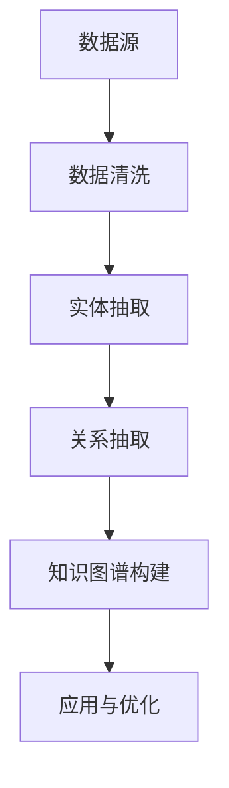

                 

关键词：电商、知识图谱、语义理解、数据治理、应用场景、算法优化

摘要：本文旨在探讨电商领域中的知识图谱构建与应用，通过分析知识图谱的核心概念、构建方法、算法原理以及实际应用，深入探讨知识图谱在电商业务中的价值与未来发展方向。

## 1. 背景介绍

随着互联网的快速发展，电商行业已经成为我国经济增长的重要引擎。电商企业通过线上销售、数据挖掘等手段不断优化客户体验，提升销售业绩。然而，在庞大的数据海洋中，如何有效地提取、组织和利用数据成为电商企业面临的重大挑战。知识图谱作为一种强大的语义理解工具，能够将数据转化为结构化的知识体系，为电商企业提供智能化决策支持。

知识图谱是一种语义网络，它通过实体、属性和关系等基本元素构建起丰富的知识体系。在电商领域，知识图谱可以应用于商品推荐、智能客服、广告投放等多个方面，为企业带来显著的商业价值。本文将围绕电商领域中的知识图谱构建与应用进行深入探讨。

## 2. 核心概念与联系

### 2.1 核心概念

知识图谱由以下核心概念构成：

- **实体（Entity）**：指知识图谱中的对象，如商品、用户、店铺等。
- **属性（Attribute）**：描述实体的特征，如商品的价格、重量、产地等。
- **关系（Relationship）**：表示实体之间的关联，如用户购买商品、商品属于某个品牌等。

### 2.2 知识图谱架构

知识图谱的架构可以分为三层：

1. **底层：数据源**：包括电商平台的商品数据、用户数据、交易数据等。
2. **中层：实体与关系抽取**：通过对底层数据清洗、处理，抽取实体和关系。
3. **顶层：知识图谱构建**：将底层数据转化为结构化的知识体系。

### 2.3 Mermaid 流程图

以下是电商领域知识图谱构建的 Mermaid 流程图：



## 3. 核心算法原理 & 具体操作步骤

### 3.1 算法原理概述

知识图谱的构建主要依赖于实体识别、关系抽取、实体链接等技术。以下简要介绍这些核心算法的原理：

- **实体识别**：通过自然语言处理技术识别文本中的实体。
- **关系抽取**：通过规则、深度学习等方法从文本中提取实体之间的关联。
- **实体链接**：将同一条数据中的不同实体映射到同一个实体，实现实体消歧。

### 3.2 算法步骤详解

1. **数据预处理**：对原始数据进行清洗、去重、格式转换等处理。
2. **实体识别**：使用命名实体识别（NER）技术对文本进行实体标注。
3. **关系抽取**：利用规则或深度学习模型从文本中提取实体关系。
4. **实体链接**：通过实体匹配、聚类等方法将不同来源的实体进行链接。
5. **知识图谱构建**：将实体、属性、关系等元素存储到图数据库中，构建知识图谱。

### 3.3 算法优缺点

- **优点**：知识图谱能够将海量数据转化为结构化的知识体系，提高数据处理和决策的效率。
- **缺点**：知识图谱构建过程复杂，需要大量数据和计算资源，且算法性能受数据质量和标注质量的影响。

### 3.4 算法应用领域

知识图谱在电商领域的应用主要包括：

1. **商品推荐**：基于用户行为和商品属性，构建推荐系统。
2. **智能客服**：利用知识图谱实现智能问答和问题分类。
3. **广告投放**：根据用户兴趣和商品特征，实现精准广告投放。
4. **商品搜索**：基于知识图谱实现高效、精准的商品搜索。

## 4. 数学模型和公式 & 详细讲解 & 举例说明

### 4.1 数学模型构建

知识图谱构建过程中，涉及到的数学模型主要包括：

- **实体识别模型**：使用朴素贝叶斯、支持向量机（SVM）等分类模型。
- **关系抽取模型**：使用条件随机场（CRF）、转换器-解码器（Transformer）等序列标注模型。
- **实体链接模型**：使用图神经网络（Graph Neural Network，GNN）等方法。

### 4.2 公式推导过程

以实体识别为例，其基本公式如下：

$$
P(entity|text) = \frac{P(text|entity) \cdot P(entity)}{P(text)}
$$

其中：

- \( P(entity|text) \)：实体识别的概率。
- \( P(text|entity) \)：实体条件下文本的概率。
- \( P(entity) \)：实体出现的概率。
- \( P(text) \)：文本的概率。

### 4.3 案例分析与讲解

假设我们有一个电商平台的商品评论数据，现需利用实体识别模型提取商品名称。以下是一个简单的案例：

- **训练数据**：包含商品名称和评论文本的样本。
- **测试数据**：待识别商品名称的评论文本。

经过模型训练，我们得到一个实体识别模型，可以预测评论文本中的商品名称。例如，输入评论文本“这款苹果手机真不错”，模型输出“苹果手机”。

## 5. 项目实践：代码实例和详细解释说明

### 5.1 开发环境搭建

1. 安装 Python 3.8 及以上版本。
2. 安装常用依赖库，如 numpy、pandas、scikit-learn、tensorflow 等。

### 5.2 源代码详细实现

以下是一个简单的实体识别代码示例：

```python
import pandas as pd
from sklearn.feature_extraction.text import TfidfVectorizer
from sklearn.naive_bayes import MultinomialNB

# 读取训练数据
train_data = pd.read_csv('train_data.csv')
X_train = train_data['text']
y_train = train_data['entity']

# 建立向量空间模型
vectorizer = TfidfVectorizer()
X_train_vectorized = vectorizer.fit_transform(X_train)

# 训练模型
model = MultinomialNB()
model.fit(X_train_vectorized, y_train)

# 识别实体
test_data = pd.read_csv('test_data.csv')
X_test = test_data['text']
X_test_vectorized = vectorizer.transform(X_test)
predictions = model.predict(X_test_vectorized)

# 输出结果
test_data['entity'] = predictions
test_data.to_csv('result.csv', index=False)
```

### 5.3 代码解读与分析

1. 读取训练数据和测试数据。
2. 使用 TF-IDF 向量空间模型将文本转换为向量。
3. 使用朴素贝叶斯模型训练实体识别模型。
4. 对测试数据进行实体识别，并将结果保存到文件。

### 5.4 运行结果展示

运行代码后，生成结果文件 `result.csv`，其中包含测试数据及其对应的商品名称。

## 6. 实际应用场景

知识图谱在电商领域的实际应用场景主要包括：

1. **商品推荐**：基于用户历史行为和商品属性，实现个性化推荐。
2. **智能客服**：利用知识图谱实现智能问答和问题分类，提高客服效率。
3. **广告投放**：根据用户兴趣和商品特征，实现精准广告投放。
4. **商品搜索**：基于知识图谱实现高效、精准的商品搜索。

### 6.1 商品推荐

通过知识图谱构建商品与用户之间的关联关系，结合用户历史行为数据，可以实现个性化的商品推荐。例如，用户在购买了一款手机后，系统可以推荐与之相关的手机配件或相似款式的手机。

### 6.2 智能客服

利用知识图谱实现智能客服，可以提高客服效率，降低人工成本。例如，当用户咨询“如何退换货”时，智能客服系统可以根据知识图谱中的相关关系，快速为用户提供解决方案。

### 6.3 广告投放

通过知识图谱分析用户兴趣和商品特征，可以实现精准的广告投放。例如，针对喜欢购买数码产品的用户，广告系统可以推送相关的数码产品广告。

### 6.4 商品搜索

基于知识图谱的商品搜索可以提供更加精准、高效的搜索结果。例如，当用户搜索“苹果手机”时，系统可以根据知识图谱中的相关关系，推荐与“苹果手机”相关的品牌、型号、价格等详细信息。

## 7. 工具和资源推荐

### 7.1 学习资源推荐

1. 《深度学习》（Goodfellow et al.）：介绍深度学习在知识图谱构建中的应用。
2. 《知识图谱》（杨明明）：详细讲解知识图谱的基本概念、构建方法与应用案例。

### 7.2 开发工具推荐

1. **ECharts**：一款强大的数据可视化工具，可用于展示知识图谱。
2. **Apache Flink**：一款流处理框架，可用于实时构建和更新知识图谱。

### 7.3 相关论文推荐

1. "Knowledge Graph Embedding: A Survey"：对知识图谱嵌入技术的全面综述。
2. "Deep Learning for Knowledge Graph Completion"：深度学习在知识图谱补全中的应用。

## 8. 总结：未来发展趋势与挑战

### 8.1 研究成果总结

本文对电商领域中的知识图谱构建与应用进行了全面探讨，包括核心概念、算法原理、应用场景等方面。研究成果表明，知识图谱在电商业务中具有重要的价值，有助于提升企业运营效率、降低成本、提高用户满意度。

### 8.2 未来发展趋势

1. **知识图谱与大数据技术的融合**：利用大数据技术挖掘更多潜在关联关系，丰富知识图谱。
2. **实时知识图谱构建**：利用流处理技术实现实时更新和查询，提高知识图谱的实用性。
3. **多模态知识图谱**：融合文本、图像、音频等多种数据类型，构建更加丰富、全面的知识体系。

### 8.3 面临的挑战

1. **数据质量和标注问题**：知识图谱构建依赖于高质量的数据和准确的标注，如何解决数据质量和标注问题仍是一个挑战。
2. **计算资源消耗**：知识图谱构建和查询过程需要大量计算资源，如何优化算法、降低计算成本是一个重要课题。

### 8.4 研究展望

未来研究应关注以下方向：

1. **知识图谱嵌入技术**：探索更加高效、可扩展的知识图谱嵌入方法。
2. **多模态知识图谱**：研究如何融合多种数据类型，构建多模态知识图谱。
3. **知识图谱在新兴应用领域的探索**：如金融、医疗、物联网等领域。

## 9. 附录：常见问题与解答

### 9.1 问题1：知识图谱与数据库有何区别？

**解答**：知识图谱与数据库的主要区别在于数据结构和查询方式。知识图谱是一种语义网络，通过实体、属性和关系等元素构建起丰富的知识体系，支持复杂查询和推理。而数据库是一种关系型数据管理系统，以表结构存储数据，支持简单的查询操作。

### 9.2 问题2：如何保证知识图谱的准确性？

**解答**：保证知识图谱的准确性需要从数据质量和标注质量两方面入手。首先，对原始数据进行严格清洗和去重，确保数据质量。其次，采用可靠的标注方法和标注工具，提高标注质量。此外，还可以通过实时监控、异常检测等技术手段，发现并修复知识图谱中的错误。

### 9.3 问题3：知识图谱在电商领域的应用前景如何？

**解答**：知识图谱在电商领域具有广阔的应用前景。通过构建商品、用户、店铺等实体之间的关联关系，知识图谱可以实现个性化推荐、智能客服、广告投放等功能，提高电商业务的运营效率、降低成本、提升用户满意度。未来，随着技术的不断发展和数据规模的扩大，知识图谱在电商领域的应用将更加深入和广泛。

### 9.4 问题4：如何评估知识图谱的性能？

**解答**：评估知识图谱的性能可以从以下几个方面进行：

1. **查询性能**：通过比较查询速度和资源消耗，评估知识图谱的查询性能。
2. **准确率**：通过对比知识图谱中的实体、关系预测结果与真实值，评估知识图谱的准确率。
3. **覆盖度**：评估知识图谱中包含的实体、关系数量与实际数据量的匹配程度。
4. **一致性**：检查知识图谱中的实体、关系是否一致，是否存在矛盾或不合理的情况。

通过综合评估以上指标，可以全面了解知识图谱的性能表现。作者：禅与计算机程序设计艺术 / Zen and the Art of Computer Programming。
----------------------------------------------------------------

以上是针对【电商领域的知识图谱构建与应用】这个主题的文章全文，包括文章标题、关键词、摘要、目录结构以及正文内容。请根据此模板撰写完整文章。如需调整，请及时通知。

