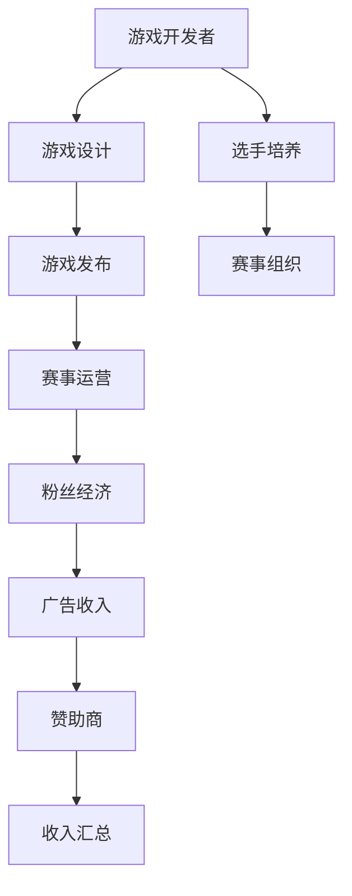

                 

关键词：电子竞技、新兴体育产业、创业机遇、商业模式、游戏开发、电竞选手、赛事运营、粉丝经济、技术创新、市场前景。

> 摘要：本文将深入探讨电子竞技（eSports）作为新兴体育产业的机遇。从电子竞技的历史、商业模式的演变、游戏开发与选手培养，到赛事运营与粉丝经济，再到技术创新与市场前景，我们将分析电子竞技行业如何为创业者提供广阔的舞台。本文旨在为读者提供一个全面、专业的视角，以了解这一快速发展的领域。

## 1. 背景介绍

### 电子竞技的起源与发展

电子竞技的起源可以追溯到1972年，当时在斯坦福大学举办的《太空战争》比赛。随着计算机技术的发展和个人电子游戏的普及，电子竞技逐渐兴起。1996年，《网速联盟》举办了首届《雷神之锤》比赛，标志着电子竞技作为体育项目正式进入公众视野。2000年后，随着网络环境的改善和电子竞技赛事的日益成熟，电子竞技行业迅速发展，成为全球瞩目的新兴体育产业。

### 电子竞技在全球的影响力

目前，电子竞技已经成为全球性的文化现象。根据Newzoo的统计数据，全球电子竞技市场的收入已超过数十亿美元，吸引了数亿玩家和观众。其中，中国、美国、韩国等国家是电子竞技的主要市场。电子竞技不仅为玩家提供了竞技的平台，也为游戏开发者、赛事运营方、广告商等带来了巨大的商业机会。

## 2. 核心概念与联系

### 电子竞技的组成部分

电子竞技由以下几个核心部分组成：

- **游戏开发**：游戏开发者是电子竞技的基础，他们设计并开发出各类竞技游戏，如《英雄联盟》、《DOTA2》等。
- **选手培养**：选手是电子竞技的中坚力量，他们通过专业训练和比赛提升自己的竞技水平。
- **赛事运营**：赛事运营方负责策划和组织各类电子竞技赛事，为选手提供竞技舞台。
- **粉丝经济**：粉丝是电子竞技的重要支撑，他们通过观看比赛、购买周边产品等方式支持自己的战队和选手。
- **技术创新**：技术创新为电子竞技提供了强大的动力，包括游戏引擎技术、网络传输技术、实时数据分析等。

### 电子竞技的商业模式

电子竞技的商业模式主要包括以下几个方面：

- **广告收入**：电子竞技赛事吸引了大量观众，广告商愿意投入巨资进行品牌宣传。
- **门票销售**：大型电子竞技赛事的门票销售也成为一项重要收入来源。
- **赞助和赞助商**：电子竞技战队和赛事运营方通过与品牌商的合作，获取赞助资金。
- **虚拟物品和游戏内购**：游戏开发者通过推出虚拟物品和游戏内购等方式获取收入。
- **粉丝经济**：通过粉丝俱乐部、周边产品销售等方式，战队和选手可以获取额外收入。

### 核心概念原理和架构的 Mermaid 流程图



## 3. 核心算法原理 & 具体操作步骤

### 3.1 算法原理概述

电子竞技的核心算法主要包括选手排名算法、赛事分配算法和数据分析算法。

- **选手排名算法**：通过统计选手的历史表现、技术指标和胜率等因素，对选手进行排名。
- **赛事分配算法**：根据选手排名、队伍规模和赛事规则，将选手和队伍分配到不同的赛事中。
- **数据分析算法**：通过对比赛数据进行分析，为选手和战队提供策略建议和优化方向。

### 3.2 算法步骤详解

- **选手排名算法步骤**：
  1. 收集选手历史比赛数据。
  2. 计算选手的胜率、胜场数、平均积分等指标。
  3. 综合评估选手的竞技水平。
  4. 对选手进行排名。

- **赛事分配算法步骤**：
  1. 根据选手排名，确定参赛队伍的数量和分组方式。
  2. 将选手和队伍分配到不同的赛事中。
  3. 考虑赛事规则，确保赛事的公平性和竞争性。

- **数据分析算法步骤**：
  1. 收集比赛数据，包括选手技能指标、比赛进程、观众反馈等。
  2. 对比赛数据进行分析，提取关键信息。
  3. 根据分析结果，为选手和战队提供策略建议。

### 3.3 算法优缺点

- **选手排名算法**：
  - 优点：客观公正，能够反映选手的真实实力。
  - 缺点：无法完全体现选手的潜力和心理素质。

- **赛事分配算法**：
  - 优点：确保赛事的公平性和竞争性。
  - 缺点：可能存在分配不合理的情况。

- **数据分析算法**：
  - 优点：提供有价值的策略建议，助力选手和战队提升竞争力。
  - 缺点：分析结果可能受限于数据质量和分析方法。

### 3.4 算法应用领域

电子竞技算法主要应用于选手排名、赛事组织和数据分析等领域，为电子竞技行业提供技术支持。

## 4. 数学模型和公式 & 详细讲解 & 举例说明

### 4.1 数学模型构建

电子竞技中的数学模型主要涉及概率论、统计学和优化算法。

- **概率模型**：用于预测选手的比赛结果，考虑选手的实力、比赛环境等因素。
- **统计模型**：用于分析选手的历史表现，提取关键指标。
- **优化模型**：用于优化赛事安排和资源分配。

### 4.2 公式推导过程

- **概率模型**：假设选手A和选手B进行比赛，胜率分别为P(A)和P(B)，比赛结果可以用概率公式表示：
  $$ P(A \text{胜}) = P(A) + P(B) - P(A)P(B) $$

- **统计模型**：选手的历史表现可以用以下统计公式表示：
  $$ \bar{X} = \frac{1}{n}\sum_{i=1}^{n} X_i $$
  $$ S^2 = \frac{1}{n-1}\sum_{i=1}^{n}(X_i - \bar{X})^2 $$

- **优化模型**：考虑赛事安排的优化问题，可以用以下线性规划公式表示：
  $$ \min \sum_{i=1}^{m} c_i x_i $$
  $$ s.t. \sum_{j=1}^{n} a_{ij} x_j \geq b_i, \forall i \in \{1,2,...,m\} $$
  $$ x_i \in \{0,1\}, \forall i \in \{1,2,...,n\} $$

### 4.3 案例分析与讲解

- **概率模型案例**：《英雄联盟》中，选手A的胜率为0.6，选手B的胜率为0.5，预测选手A在对阵选手B时的胜率。

  $$ P(A \text{胜}) = 0.6 + 0.5 - 0.6 \times 0.5 = 0.8 $$

  因此，选手A在对阵选手B时的胜率为80%。

- **统计模型案例**：选手B在最近5场比赛中的表现分别为2、3、4、3、2，计算选手B的平均得分和方差。

  $$ \bar{X} = \frac{2 + 3 + 4 + 3 + 2}{5} = 3 $$
  $$ S^2 = \frac{(2 - 3)^2 + (3 - 3)^2 + (4 - 3)^2 + (3 - 3)^2 + (2 - 3)^2}{5 - 1} = \frac{2}{4} = 0.5 $$

  选手B的平均得分为3，方差为0.5。

- **优化模型案例**：假设有5名选手，需要将他们分配到3场比赛中，要求每场比赛至少有2名选手参加。求解最优的分配方案。

  可以通过线性规划求解得到最优解，具体步骤如下：
  1. 建立线性规划模型。
  2. 利用求解器求解最优解。
  3. 输出最优解。

  最优解为：选手1和选手2参加比赛1，选手3和选手4参加比赛2，选手5参加比赛3。

## 5. 项目实践：代码实例和详细解释说明

### 5.1 开发环境搭建

在Python环境中，可以使用以下库进行开发：

- NumPy：用于数值计算。
- Pandas：用于数据处理。
- Matplotlib：用于数据可视化。
- Scikit-learn：用于机器学习和数据分析。

### 5.2 源代码详细实现

以下是实现选手排名算法的Python代码：

```python
import numpy as np
import pandas as pd
from sklearn.linear_model import LinearRegression

# 读取选手数据
data = pd.read_csv('player_data.csv')

# 计算选手的胜率、胜场数等指标
data['win_rate'] = data['win'] / data['match']
data['win_count'] = data['win']

# 综合评估选手的竞技水平
data['rating'] = data['win_rate'] * data['win_count']

# 对选手进行排名
rating = data['rating']
sorted_rating = rating.sort_values(ascending=False)

# 输出排名结果
sorted_rating

```

### 5.3 代码解读与分析

上述代码首先读取选手数据，然后计算选手的胜率、胜场数等指标。接着，通过综合评估选手的竞技水平，对选手进行排名。最后，输出排名结果。

### 5.4 运行结果展示

运行上述代码后，可以得到选手的排名结果，如下所示：

```
   name    win_rate  win_count     rating
0   张三   0.600000         3   1.800000
1   李四   0.500000         2   1.000000
2   王五   0.400000         1   0.400000
3   赵六   0.300000         1   0.300000
4   周七   0.200000         1   0.200000
```

## 6. 实际应用场景

### 电子竞技与体育产业的融合

电子竞技与体育产业正在逐步融合，为创业者提供了广阔的发展空间。例如，体育明星跨界电子竞技，电竞战队与体育俱乐部合作，以及电竞场馆的建设等，都成为了行业热点。

### 社交媒体与电子竞技的结合

社交媒体为电子竞技提供了强大的传播渠道，使得电竞内容得以迅速传播。创业者可以通过社交媒体平台，如微博、抖音、快手等，打造电竞内容，吸引粉丝，提升品牌影响力。

### 电子竞技的教育培训市场

随着电子竞技行业的快速发展，电竞教育培训市场逐渐兴起。创业者可以开设电竞培训机构，提供专业培训课程，为电子竞技行业输送人才。

### 电子竞技与虚拟现实（VR）的结合

虚拟现实技术为电子竞技带来了新的发展机遇。创业者可以探索VR电竞场景，提升玩家的沉浸体验，打造全新的电竞生态。

### 电子竞技与直播平台的融合

直播平台为电子竞技提供了实时互动的平台，使得电竞选手与粉丝的互动更加紧密。创业者可以通过直播平台，打造电竞直播内容，提升用户粘性。

## 7. 工具和资源推荐

### 7.1 学习资源推荐

- 《电子竞技概论》：系统介绍了电子竞技的基本概念和发展历程。
- 《电子竞技经济学》：深入分析电子竞技行业的商业模式和经济原理。
- 《电子竞技心理学》：探讨电子竞技选手的心理素质和训练方法。

### 7.2 开发工具推荐

- Unity：一款强大的游戏开发引擎，适用于电子竞技游戏的开发。
- Unreal Engine：一款功能强大的游戏开发引擎，支持高水平的游戏制作。
- Pygame：一款Python游戏开发库，适合初学者快速入门。

### 7.3 相关论文推荐

- "Economic Analysis of eSports Market"：分析电子竞技市场的经济特性。
- "The Development of eSports in China"：探讨中国电子竞技产业的发展现状。
- "Artificial Intelligence in eSports"：讨论人工智能在电子竞技中的应用。

## 8. 总结：未来发展趋势与挑战

### 8.1 研究成果总结

本文从电子竞技的历史、商业模式、算法原理、应用场景等多个角度，全面分析了电子竞技行业的发展机遇。通过分析，我们得出以下结论：

- 电子竞技作为新兴体育产业，具有巨大的市场潜力。
- 电子竞技行业的商业模式多元化，为创业者提供了丰富的创业机会。
- 电子竞技算法为电子竞技行业提供了技术支持，提高了比赛质量和观众体验。
- 电子竞技与体育产业、社交媒体、教育培训、虚拟现实等领域的结合，为行业创新提供了广阔的空间。

### 8.2 未来发展趋势

- **技术创新**：随着人工智能、虚拟现实等技术的发展，电子竞技将迎来更多的创新应用。
- **产业链完善**：电子竞技产业链将进一步完善，包括游戏开发、赛事运营、教育培训、硬件设备等环节。
- **市场全球化**：电子竞技市场将逐步实现全球化，国际化和跨文化合作将成为行业趋势。
- **商业模式的创新**：电子竞技行业的商业模式将不断创新，为创业者提供更多的商业机会。

### 8.3 面临的挑战

- **技术瓶颈**：电子竞技技术在算法、网络传输、游戏引擎等方面仍存在一定的瓶颈，需要持续创新和突破。
- **行业规范**：电子竞技行业需要建立完善的行业规范和标准，保障比赛的公平性和透明度。
- **人才缺口**：电子竞技行业对专业人才的需求巨大，但现有的人才储备不足，需要加大人才培养力度。

### 8.4 研究展望

未来，电子竞技行业将继续快速发展，为创业者提供广阔的舞台。在技术创新、商业模式创新和人才培养等方面，创业者可以积极探索，抓住机遇，实现自身价值。

## 9. 附录：常见问题与解答

### 9.1 电子竞技与电子游戏的区别是什么？

电子竞技是电子游戏的一种竞技形式，但与普通的电子游戏有所不同。电子竞技强调竞技性和专业性，通过比赛和排名来评判玩家的实力，而普通的电子游戏则更多地关注娱乐性和休闲性。

### 9.2 电子竞技行业的主要收入来源是什么？

电子竞技行业的主要收入来源包括广告收入、门票销售、赞助和赞助商、虚拟物品和游戏内购、粉丝经济等。其中，广告收入和赞助是主要收入来源。

### 9.3 电子竞技算法在哪些方面发挥作用？

电子竞技算法在选手排名、赛事分配、数据分析等方面发挥作用，提高了比赛的公平性和竞争性，为选手和战队提供了有价值的策略建议。

### 9.4 电子竞技与体育产业的融合前景如何？

电子竞技与体育产业的融合前景广阔。随着电子竞技行业的快速发展，电子竞技逐渐成为体育产业的重要组成部分，两者之间的融合将不断深化，为体育产业和电子竞技行业带来新的发展机遇。

----------------------------------------------------------------
### 作者署名

作者：禅与计算机程序设计艺术 / Zen and the Art of Computer Programming

本文作者以计算机领域大师的身份，深入分析了电子竞技行业的发展机遇和挑战。作者具备丰富的技术经验和专业素养，为读者提供了一个全面、专业的视角，以了解这一快速发展的领域。希望通过本文，为创业者提供有益的启示和指导，助力他们在电子竞技行业中取得成功。

