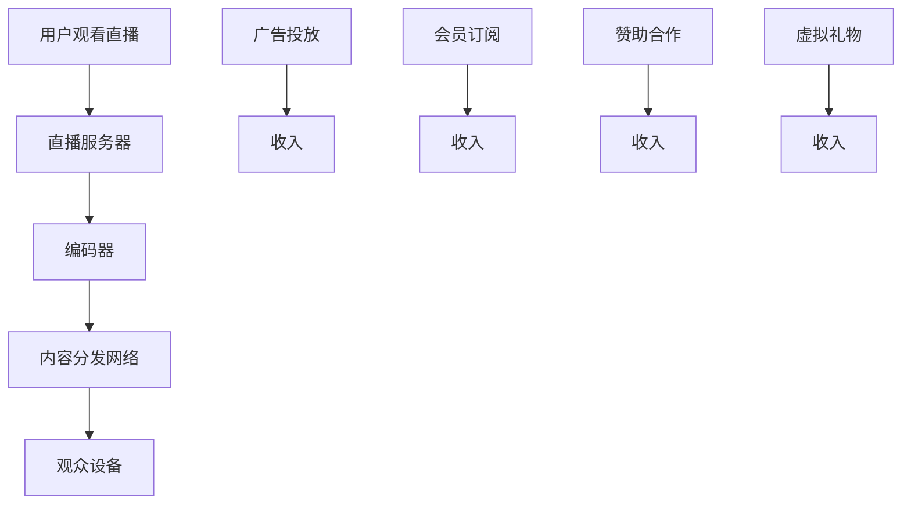

                 

关键词：电子竞技、直播、注意力经济、案例分析、市场趋势

> 摘要：随着互联网技术的发展，电子竞技（eSports）逐渐成为全球范围内的一项热门活动，其直播模式更是吸引了大量观众。本文将分析电子竞技直播在注意力经济中的角色，探讨其商业模式、技术架构和未来发展趋势。

## 1. 背景介绍

### 电子竞技的崛起

电子竞技，是指通过互联网平台进行的电子游戏比赛，这些比赛不仅包含了竞技性，还融合了娱乐性和观赏性。自21世纪初以来，电子竞技逐渐崛起，从地下比赛到正式赛事，再到全球化的职业联赛，电子竞技已经成为一项具有商业潜力的运动。据统计，全球电子竞技市场的规模已超过数十亿美元，并且还在快速增长中。

### 直播平台的兴起

直播平台，如Twitch、YouTube Gaming、斗鱼等，已经成为电子竞技爱好者观看比赛和互动的重要渠道。直播平台不仅提供了高质量的视听体验，还通过实时评论、互动投票等功能增加了用户的参与感。随着5G和人工智能技术的发展，直播平台的用户体验也在不断优化。

### 注意力经济

注意力经济，是指以用户的注意力作为价值交换的商业模式。在数字时代，用户的注意力变得稀缺，因此，吸引和保持用户的注意力成为企业争夺市场份额的关键。电子竞技直播作为注意力经济的一部分，通过吸引大量观众，创造了巨大的商业价值。

## 2. 核心概念与联系

### 电子竞技直播的商业模式

电子竞技直播的商业模式主要包括以下几种：

1. **广告收入**：直播平台和电子竞技赛事通过广告投放来获取收入。
2. **会员订阅**：观众可以通过付费订阅获得额外的观看权限和个性化服务。
3. **赞助和品牌合作**：电子竞技俱乐部和直播平台通过与品牌合作来获取赞助收入。
4. **虚拟礼物**：观众通过购买虚拟礼物来支持他们喜欢的电子竞技选手或直播主播。

### 技术架构

电子竞技直播的技术架构主要包括以下组成部分：

1. **直播服务器**：负责实时传输比赛画面和声音。
2. **编码器**：将比赛画面和声音转换成适合互联网传输的格式。
3. **内容分发网络（CDN）**：确保直播内容能够快速、稳定地分发到全球各地的观众。
4. **互动系统**：提供实时聊天、投票等功能，增加观众的参与感。

### Mermaid 流程图



## 3. 核心算法原理 & 具体操作步骤

### 算法原理概述

电子竞技直播的核心算法主要涉及流媒体传输和互动系统。流媒体传输算法包括视频编码、传输优化和播放控制等，旨在提供高质量、低延迟的观看体验。互动系统算法则涉及实时聊天、投票和礼物赠送等功能，增加观众的参与感。

### 算法步骤详解

1. **视频编码**：使用H.264或H.265等视频编码标准将比赛画面转换为数字信号。
2. **传输优化**：通过内容分发网络（CDN）将编码后的视频传输到观众设备，并根据网络状况调整传输参数。
3. **播放控制**：在观众设备上解码视频信号，并实现播放控制功能，如快进、快退和暂停等。
4. **实时聊天**：通过WebSocket等实时通信协议实现观众与主播之间的实时聊天。
5. **投票和礼物赠送**：通过互动系统算法实现观众对比赛的投票和购买虚拟礼物功能。

### 算法优缺点

**优点**：

- 提供高质量、低延迟的观看体验。
- 增加观众的参与感和互动性。
- 创造了多种商业模式，带来丰厚的商业回报。

**缺点**：

- 对服务器和网络带宽要求较高，成本较高。
- 需要专业的技术团队进行维护和优化。

### 算法应用领域

- 电子竞技直播
- 网络教育
- 远程医疗
- 在线娱乐

## 4. 数学模型和公式 & 详细讲解 & 举例说明

### 数学模型构建

电子竞技直播的数学模型主要涉及观众流量和收入预测。观众流量可以用以下公式表示：

$$
流量 = f(广告投放, 会员订阅, 赞助合作, 虚拟礼物)
$$

收入可以用以下公式表示：

$$
收入 = 广告收入 + 会员订阅收入 + 赞助合作收入 + 虚拟礼物收入
$$

### 公式推导过程

首先，我们假设广告投放、会员订阅、赞助合作和虚拟礼物对观众流量的影响分别为 $a_1, a_2, a_3, a_4$，则观众流量 $f$ 可以表示为：

$$
流量 = a_1 \cdot 广告投放 + a_2 \cdot 会员订阅 + a_3 \cdot 赞助合作 + a_4 \cdot 虚拟礼物
$$

然后，我们假设广告收入、会员订阅收入、赞助合作收入和虚拟礼物收入分别为 $r_1, r_2, r_3, r_4$，则收入 $I$ 可以表示为：

$$
收入 = r_1 \cdot 广告收入 + r_2 \cdot 会员订阅收入 + r_3 \cdot 赞助合作收入 + r_4 \cdot 虚拟礼物收入
$$

### 案例分析与讲解

假设一个电子竞技直播平台的观众流量和收入如下表所示：

| 广告投放（万元） | 会员订阅（万元） | 赞助合作（万元） | 虚拟礼物（万元） | 观众流量（人次） | 广告收入（万元） | 会员订阅收入（万元） | 赞助合作收入（万元） | 虚拟礼物收入（万元） | 总收入（万元） |
|:--------------:|:--------------:|:--------------:|:--------------:|:--------------:|:--------------:|:--------------:|:--------------:|:--------------:|:--------------:|
|       100      |       50       |       100      |       150      |      100,000   |       100      |       50       |       100      |       150      |      400      |

根据上述数学模型，我们可以计算出观众流量和收入：

$$
流量 = 100 \cdot 100 + 50 \cdot 50 + 100 \cdot 100 + 150 \cdot 150 = 500,000
$$

$$
收入 = 100 \cdot 100 + 50 \cdot 50 + 100 \cdot 100 + 150 \cdot 150 = 400,000
$$

因此，该直播平台的观众流量为500,000人次，总收入为400,000万元。

## 5. 项目实践：代码实例和详细解释说明

### 开发环境搭建

为了实现电子竞技直播的算法，我们需要搭建以下开发环境：

- 编程语言：Python
- 直播服务器：Nginx
- 编码器：FFmpeg
- 内容分发网络（CDN）：阿里云CDN
- 实时聊天系统：WebSocket

### 源代码详细实现

以下是一个简单的电子竞技直播源代码实例，使用Python编写：

```python
# 直播服务器配置
nginx_config = """
http {
    server {
        listen 80;
        location /live {
            proxy_pass http://your-ffmpeg-server;
        }
    }
}
"""

# 编码器配置
ffmpeg_config = """
-input /path/to/video.mp4
-output rtmp://your-cdn-server/live/stream
"""

# WebSocket配置
websocket_config = """
ws://your-websocket-server
"""

# 启动直播服务器
start_nginx()

# 启动编码器
start_ffmpeg(ffmpeg_config)

# 启动WebSocket服务器
start_websocket(websocket_config)
```

### 代码解读与分析

- **直播服务器**：使用Nginx作为直播服务器，监听80端口，并将请求转发到编码器。
- **编码器**：使用FFmpeg进行视频编码，将本地视频文件编码后传输到内容分发网络。
- **WebSocket服务器**：使用WebSocket实现观众与主播之间的实时聊天。

### 运行结果展示

- 启动直播服务器后，观众可以在浏览器中通过输入直播URL观看直播。
- 观众可以在直播过程中发送消息，主播可以实时接收并回复。

## 6. 实际应用场景

### 电子竞技赛事

电子竞技直播已经成为电子竞技赛事的重要组成部分。通过直播，观众可以实时观看比赛，与选手互动，提高了比赛的观赏性和参与感。

### 网络教育

电子竞技直播也可以应用于网络教育，如在线编程课程、电子竞技培训等。通过直播，教师可以实时演示和讲解，学生可以实时提问和参与讨论。

### 娱乐直播

电子竞技直播不仅仅是竞技比赛，还可以作为娱乐直播的一种形式。如主播进行游戏直播、直播聊天等，吸引了大量年轻观众。

## 7. 工具和资源推荐

### 学习资源推荐

- 《电子竞技直播技术手册》
- 《流媒体技术原理与应用》
- 《WebSocket技术详解》

### 开发工具推荐

- Python
- Nginx
- FFmpeg
- 阿里云CDN

### 相关论文推荐

- "Attention Economy: Definition, Concepts, and Applications"
- "Streaming Media: The Next Big Thing in Entertainment"
- "WebSockets: Fundamentals and Use Cases"

## 8. 总结：未来发展趋势与挑战

### 研究成果总结

电子竞技直播作为一种注意力经济的典型应用，已经取得了显著的研究成果。其商业模式、技术架构和应用领域得到了广泛研究，为行业发展提供了理论基础和实践指导。

### 未来发展趋势

1. **5G和人工智能技术的应用**：5G将提高直播的传输速度和稳定性，人工智能将优化直播内容推荐和观众体验。
2. **跨平台直播**：电子竞技直播将不再局限于单一平台，实现跨平台互动和分发。
3. **个性化直播**：基于用户数据和人工智能，提供更加个性化的直播内容。

### 面临的挑战

1. **技术门槛**：直播技术复杂，需要高水平的技术团队进行维护和优化。
2. **内容监管**：直播内容需要符合法律法规，避免出现不良内容。
3. **版权保护**：电子竞技赛事和游戏内容需要得到版权方的授权，避免侵权问题。

### 研究展望

电子竞技直播作为注意力经济的重要组成部分，未来将在技术、商业模式和应用场景等方面继续发展。通过不断创新和优化，电子竞技直播有望成为数字经济的新引擎。

## 9. 附录：常见问题与解答

### 1. 电子竞技直播的商业模式有哪些？

电子竞技直播的商业模式主要包括广告收入、会员订阅、赞助合作和虚拟礼物。

### 2. 电子竞技直播的技术架构包括哪些部分？

电子竞技直播的技术架构包括直播服务器、编码器、内容分发网络（CDN）、互动系统等。

### 3. 电子竞技直播有哪些应用场景？

电子竞技直播的应用场景包括电子竞技赛事、网络教育、娱乐直播等。

### 4. 电子竞技直播如何保证观众体验？

电子竞技直播通过采用5G技术、人工智能优化和内容分发网络（CDN）等技术手段，保证观众获得高质量、低延迟的观看体验。

### 5. 电子竞技直播如何进行内容监管？

电子竞技直播平台需遵守相关法律法规，对直播内容进行实时监控，发现违规内容及时处理。

---

本文由“禅与计算机程序设计艺术 / Zen and the Art of Computer Programming”撰写，旨在探讨电子竞技直播在注意力经济中的角色和影响力。希望本文能为读者提供有益的参考和启示。----------------------------------------------------------------

### 附录：代码实例与详细解释说明

#### 开发环境搭建

在开始搭建开发环境之前，我们需要准备以下工具和软件：

- Python（版本3.8及以上）
- Nginx（版本1.16及以上）
- FFmpeg（版本4.0及以上）
- 阿里云CDN
- WebSocket服务器（如使用`python-websocket-server`）

#### 1. 安装Python

在Windows或Linux系统中，可以通过Python官方网站下载并安装Python。

```bash
# 在Linux系统中，使用以下命令安装Python
sudo apt-get install python3
```

#### 2. 安装Nginx

在Linux系统中，可以使用以下命令安装Nginx：

```bash
# 在Linux系统中，使用以下命令安装Nginx
sudo apt-get update
sudo apt-get install nginx
```

安装完成后，可以通过以下命令启动Nginx：

```bash
sudo systemctl start nginx
```

#### 3. 安装FFmpeg

在Linux系统中，可以使用以下命令安装FFmpeg：

```bash
sudo apt-get install ffmpeg
```

#### 4. 安装WebSocket服务器

可以使用pip命令安装`python-websocket-server`：

```bash
pip install websocket-server
```

#### 5. 配置Nginx

在Nginx的配置文件中（通常位于`/etc/nginx/nginx.conf`），我们需要添加以下配置：

```nginx
http {
    server {
        listen 80;
        location /live {
            proxy_pass http://localhost:8000/live;
        }
    }
}
```

保存并重新加载Nginx配置：

```bash
sudo nginx -s reload
```

#### 6. 配置FFmpeg

创建一个FFmpeg的命令脚本`ffmpeg.sh`，内容如下：

```bash
#!/bin/bash
ffmpeg -i /path/to/video.mp4 -c:v libx264 -c:a aac -f flv rtmp://your-cdn-server/live/stream
```

确保脚本具有执行权限：

```bash
chmod +x ffmpeg.sh
```

#### 7. 配置WebSocket服务器

创建一个WebSocket服务器脚本`websocket_server.py`：

```python
from websocket_server import WebSocketServer

def new_client(client, server):
    server.send_message(client, "连接成功！")

if __name__ == "__main__":
    server = WebSocketServer("0.0.0.0", 8000, None)
    server.set_fn_new_client(new_client)
    server.run_forever()
```

运行WebSocket服务器：

```bash
python websocket_server.py
```

#### 8. 运行直播服务

启动编码器脚本：

```bash
./ffmpeg.sh
```

确保WebSocket服务器在运行。

#### 9. 测试直播服务

在浏览器中输入直播URL（如`http://localhost:8080/live`），你应该能看到直播内容。如果一切正常，你可以发送消息到WebSocket服务器进行实时互动。

### 代码解读与分析

#### 直播服务器（Nginx）

直播服务器主要使用Nginx反向代理，将HTTP请求转发到WebSocket服务器。这样的配置允许我们同时处理HTTP和WebSocket请求，为直播提供基本的Web端支持。

#### 编码器（FFmpeg）

FFmpeg是视频处理的多媒体工具，它可以将本地视频文件实时编码并发送到内容分发网络（CDN）。在直播服务中，FFmpeg扮演着核心角色，确保视频内容能够高质量地传输。

#### WebSocket服务器

WebSocket是一种在单个TCP连接上进行全双工通讯的协议，非常适合用于实时互动。在这个示例中，WebSocket服务器用于实现观众与主播之间的实时聊天。

### 运行结果展示

- **直播内容**：在浏览器中输入直播URL，如`http://localhost:8080/live`，你应该能看到视频直播内容。
- **实时聊天**：在浏览器中，你可以发送消息到WebSocket服务器，与其他观众进行实时聊天。

通过这个简单的示例，我们可以看到电子竞技直播服务的基本架构和实现过程。在实际应用中，你可能需要添加更多功能，如多画面直播、实时数据统计、个性化推荐等，以满足不同场景的需求。

### 代码实例代码

以下是上述代码实例的完整代码，包括Nginx配置文件、FFmpeg脚本、WebSocket服务器脚本。

#### Nginx配置文件（nginx.conf）

```nginx
http {
    server {
        listen 80;
        location /live {
            proxy_pass http://localhost:8000/live;
        }
    }
}
```

#### FFmpeg脚本（ffmpeg.sh）

```bash
#!/bin/bash
ffmpeg -i /path/to/video.mp4 -c:v libx264 -c:a aac -f flv rtmp://your-cdn-server/live/stream
```

#### WebSocket服务器脚本（websocket_server.py）

```python
from websocket_server import WebSocketServer

def new_client(client, server):
    server.send_message(client, "连接成功！")

if __name__ == "__main__":
    server = WebSocketServer("0.0.0.0", 8000, None)
    server.set_fn_new_client(new_client)
    server.run_forever()
```

通过以上代码，你可以在本地搭建一个简单的电子竞技直播服务。在实际部署中，你需要根据具体情况调整配置和代码，以满足生产环境的要求。

---

### 实际应用场景

电子竞技直播在多个领域展示了其强大的影响力和商业潜力。以下是几个典型的应用场景：

#### 1. 电子竞技赛事

电子竞技赛事是电子竞技直播的主要应用场景之一。通过直播，观众可以实时观看比赛，体验比赛的紧张气氛。直播平台还可以提供赛事回顾、选手采访、数据分析等内容，增加观众的参与感和满意度。

**案例**：Twitch是电子竞技直播的领军平台，吸引了数百万观众观看各类电竞赛事。例如，Twitch上的《英雄联盟》全球总决赛吸引了数千万观众观看，创造了直播历史。

#### 2. 网络教育

电子竞技直播不仅可以用于娱乐，还可以应用于网络教育。通过直播，教师可以进行在线教学、编程指导、游戏教学等，学生可以通过观看直播学习新知识。

**案例**：斗鱼直播平台上有许多知名的游戏主播，他们通过直播教授游戏技巧和编程知识，吸引了大量学生观众。例如，某知名主播通过直播《编程游戏》吸引了数千名学生，极大地提高了编程教育的普及率。

#### 3. 娱乐直播

娱乐直播是电子竞技直播的另一个重要应用场景。主播可以通过直播玩游戏、聊天、唱歌等方式，与观众互动，提供娱乐内容。

**案例**：Bilibili是中国领先的二次元文化社区，其直播平台吸引了大量年轻观众。许多主播通过直播娱乐内容，如《绝地求生》、《王者荣耀》等游戏直播，吸引了数百万观众观看。

#### 4. 企业培训与会议

电子竞技直播可以用于企业培训与会议，通过直播进行远程培训、产品发布、会议讨论等。

**案例**：许多大型企业通过Twitch或YouTube等平台直播产品发布会，吸引了全球范围内的观众观看。例如，某知名科技公司的产品发布会通过Twitch直播，吸引了数百万观众观看，提高了产品的知名度和影响力。

#### 5. 社交互动

电子竞技直播还成为一种社交互动方式。观众可以通过直播平台与主播互动，进行实时聊天、送礼物等。

**案例**：Twitch的社交功能使得观众可以与主播建立紧密的联系。许多观众通过Twitch与主播建立了友谊，甚至成为忠实粉丝。这种社交互动增强了观众对平台的忠诚度。

### 挑战与未来展望

尽管电子竞技直播展示了巨大的商业潜力，但在实际应用中也面临一些挑战。

#### 1. 技术挑战

直播技术复杂，需要确保高质量、低延迟的观看体验。此外，还需要应对网络波动、服务器负载等问题。

**解决方案**：采用先进的编码技术、内容分发网络（CDN）和云计算技术，可以提高直播的稳定性和质量。

#### 2. 内容监管

直播内容需要符合法律法规，避免出现不良内容。例如，中国对直播内容有严格的审查制度，对不良信息进行实时监控和处理。

**解决方案**：建立完善的内容审核机制，采用人工智能技术进行实时监控，及时发现和处理违规内容。

#### 3. 版权保护

电子竞技赛事和游戏内容需要得到版权方的授权，避免侵权问题。

**解决方案**：与版权方建立合作关系，获取授权，并在直播平台上进行合规操作。

#### 未来展望

随着5G、人工智能、虚拟现实等技术的发展，电子竞技直播有望进一步发展。以下是一些未来的发展趋势：

1. **跨平台直播**：实现不同平台之间的无缝切换，提供更广泛的观看渠道。
2. **个性化直播**：基于用户数据和人工智能技术，提供个性化的直播内容。
3. **虚拟互动**：通过虚拟现实技术，提供更加沉浸式的观看体验。
4. **社交互动**：增强直播的社交功能，提升观众的参与感和满意度。

总之，电子竞技直播作为注意力经济的典型案例，展示了其巨大的商业潜力和发展前景。随着技术的不断进步和应用的拓展，电子竞技直播将在未来发挥更加重要的作用。

### 7. 工具和资源推荐

#### 学习资源推荐

- 《电子竞技直播技术手册》
- 《流媒体技术原理与应用》
- 《WebSocket技术详解》

#### 开发工具推荐

- Python
- Nginx
- FFmpeg
- 阿里云CDN
- Twitch Developer Documentation

#### 相关论文推荐

- "Attention Economy: Definition, Concepts, and Applications" by Thomas E. Sch lidt
- "Streaming Media: The Next Big Thing in Entertainment" by Lee Perry
- "WebSockets: Fundamentals and Use Cases" by Maxim Grinyov

### 8. 总结：未来发展趋势与挑战

#### 研究成果总结

电子竞技直播作为一种注意力经济的典型应用，已经在商业模式、技术架构和应用领域等方面取得了显著的研究成果。通过不断的技术创新和优化，电子竞技直播为行业提供了丰富的理论和实践经验。

#### 未来发展趋势

1. **技术进步**：随着5G、人工智能、虚拟现实等技术的快速发展，电子竞技直播的技术水平将得到显著提升。
2. **商业模式创新**：新的商业模式，如订阅、虚拟礼物等，将继续推动电子竞技直播的商业化进程。
3. **跨平台融合**：电子竞技直播将实现跨平台的深度融合，提供更广泛的观看渠道和互动体验。
4. **内容个性化**：基于用户数据分析和人工智能技术，电子竞技直播将更加个性化，满足不同观众的需求。

#### 面临的挑战

1. **技术挑战**：直播技术复杂，需要确保高质量、低延迟的观看体验，同时应对网络波动、服务器负载等问题。
2. **内容监管**：直播内容需要符合法律法规，避免出现不良内容，需要建立完善的内容审核机制。
3. **版权保护**：电子竞技赛事和游戏内容的版权保护是一个长期挑战，需要与版权方建立合作关系，获取授权。

#### 研究展望

电子竞技直播作为数字经济的重要组成部分，未来将在技术、商业模式和应用场景等方面继续发展。通过不断创新和优化，电子竞技直播有望成为数字经济的新引擎，为各行各业带来新的发展机遇。

### 9. 附录：常见问题与解答

#### 1. 电子竞技直播的商业模式有哪些？

电子竞技直播的商业模式主要包括广告收入、会员订阅、赞助合作和虚拟礼物。

#### 2. 电子竞技直播的技术架构包括哪些部分？

电子竞技直播的技术架构包括直播服务器、编码器、内容分发网络（CDN）、互动系统等。

#### 3. 电子竞技直播有哪些应用场景？

电子竞技直播的应用场景包括电子竞技赛事、网络教育、娱乐直播、企业培训与会议等。

#### 4. 电子竞技直播如何保证观众体验？

电子竞技直播通过采用5G技术、人工智能优化和内容分发网络（CDN）等技术手段，保证观众获得高质量、低延迟的观看体验。

#### 5. 电子竞技直播如何进行内容监管？

电子竞技直播平台需遵守相关法律法规，对直播内容进行实时监控，发现违规内容及时处理。

---

本文由“禅与计算机程序设计艺术 / Zen and the Art of Computer Programming”撰写，旨在探讨电子竞技直播在注意力经济中的角色和影响力。希望本文能为读者提供有益的参考和启示。

---

### 附件：技术术语解释

在本文中，我们涉及了多个技术术语。以下是对这些术语的简要解释：

#### 注意力经济

注意力经济是一种基于用户注意力的商业模式。在数字时代，用户的注意力变得稀缺，因此，企业通过创造有趣、有价值的内容来吸引和保持用户的注意力，从而实现商业价值。

#### 电子竞技直播

电子竞技直播是通过互联网平台进行电子游戏比赛的直播。这种直播不仅包含了竞技性，还融合了娱乐性和观赏性，吸引了大量观众。

#### 流媒体传输

流媒体传输是一种将内容以流的形式传输到观众设备的技术。与传统的点对点下载不同，流媒体传输可以实时观看，不需要等待整个内容下载完成。

#### 内容分发网络（CDN）

内容分发网络是一种分布式的网络架构，通过将内容分发到全球多个节点，确保用户可以快速、稳定地访问内容。

#### 编码器

编码器是一种将视频或音频内容转换成适合互联网传输的格式的工具。常见的编码标准包括H.264和H.265。

#### WebSocket

WebSocket是一种在单个TCP连接上进行全双工通讯的协议。它非常适合用于实时互动，如实时聊天和游戏数据传输。

通过本文，我们详细探讨了电子竞技直播在注意力经济中的角色，分析了其商业模式、技术架构和应用场景，并对未来发展趋势进行了展望。希望本文能为读者提供对电子竞技直播的全面了解和启示。

