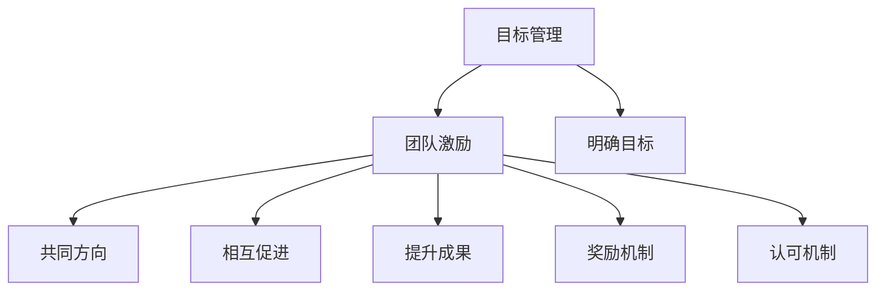

                 

 在当今快速发展的信息技术领域，高效的目标管理和团队激励成为团队成功的关键因素。本文旨在探讨目标管理与团队激励之间的紧密联系，并通过逻辑清晰、结构紧凑、简单易懂的专业技术语言，为读者提供有深度、有思考、有见解的指导。

## 关键词
- 目标管理
- 团队激励
- 信息技术
- 成果导向
- 贡献度评估

## 摘要
本文将分析目标管理与团队激励在信息技术领域的实际应用，探讨如何通过科学的目标设定和有效的激励手段，提升团队的工作效率和创造力。文章将涵盖目标管理的基本原理、团队激励的方法、成功案例分享，以及未来发展方向与挑战。

## 1. 背景介绍
在信息技术领域，随着技术的不断演进，项目的复杂度也在不断增加。在这种背景下，目标管理显得尤为重要。目标管理不仅帮助团队明确工作方向，还可以提高团队成员的工作积极性和责任感。而团队激励则通过奖励和认可机制，增强团队成员的归属感和工作动力，从而实现团队整体效率的提升。

### 1.1 信息技术行业的特性
信息技术行业具有以下几个显著特性：

- **技术更新迅速**：新的技术、工具和语言不断涌现，要求团队成员具备持续学习和快速适应的能力。
- **工作压力大**：项目周期短、需求变更频繁，使得团队成员往往需要在高压下保持高效工作。
- **成果不易量化**：软件和系统开发的成果往往不易直接量化，这给目标管理和评估带来了一定的挑战。

### 1.2 目标管理的重要性
在信息技术行业中，明确的目标能够帮助团队：

- **提高工作效率**：通过目标设定，团队成员可以明确工作的重点和优先级，从而提高工作效率。
- **促进团队协作**：明确的目标可以为团队成员提供共同的方向，促进团队内部的协作与沟通。
- **提升团队士气**：通过达成目标，团队可以感受到成就感，从而提升整体士气。

## 2. 核心概念与联系

### 2.1 核心概念
- **目标管理（Goal Setting）**：目标管理是一种通过设定明确的目标，并制定实现目标的计划，以提高工作效率和成果的方法。
- **团队激励（Team Incentive）**：团队激励是通过奖励和认可机制，激发团队成员的工作积极性、创造力和归属感。

### 2.2 联系
目标管理与团队激励之间的联系主要体现在以下几个方面：

- **共同方向**：明确的目标为团队提供了共同的方向，而团队激励则确保团队成员在实现目标的过程中保持动力。
- **相互促进**：目标管理为团队激励提供了依据，而团队激励则为目标管理的有效性提供保障。
- **提升成果**：通过有效的目标管理和团队激励，团队能够在实现个人目标的同时，实现团队的整体目标。

### 2.3 Mermaid 流程图



## 3. 核心算法原理 & 具体操作步骤

### 3.1 算法原理概述
目标管理和团队激励的算法原理主要基于以下几个核心思想：

- **目标设定**：基于SMART原则（具体、可衡量、可实现、相关、有时间限制），设定明确的目标。
- **反馈机制**：通过定期反馈和评估，确保团队成员了解目标进展情况。
- **奖励机制**：基于工作表现和目标达成情况，设定相应的奖励措施。

### 3.2 算法步骤详解

#### 3.2.1 目标设定
1. **团队讨论**：组织团队成员讨论并确定共同的目标。
2. **个体化目标**：根据团队目标，为每个成员设定具体的个体化目标。
3. **目标分解**：将个体化目标分解为可执行的子任务。

#### 3.2.2 反馈机制
1. **定期反馈**：设置定期反馈机制，确保团队成员了解目标进展。
2. **进度评估**：根据反馈信息，评估团队成员的工作进度。
3. **改进建议**：根据评估结果，为团队成员提供改进建议。

#### 3.2.3 奖励机制
1. **奖励设定**：根据团队和个体目标达成情况，设定相应的奖励。
2. **奖励发放**：按照预定奖励计划，及时发放奖励。
3. **反馈与激励**：通过奖励发放，激励团队成员继续保持高效工作。

### 3.3 算法优缺点

#### 优点
- **提高工作效率**：明确的目标和奖励机制能够激励团队成员高效工作。
- **促进团队协作**：通过目标设定和反馈机制，增强团队成员之间的协作。
- **提升团队士气**：达成目标后的奖励能够提升团队成员的满意度和士气。

#### 缺点
- **目标设定难度**：合理的目标设定需要耗费时间和资源。
- **奖励机制不公平**：如果奖励机制设定不当，可能导致团队成员之间产生不满。

### 3.4 算法应用领域

- **软件开发**：通过目标管理和团队激励，提高软件开发团队的效率和创造力。
- **项目实施**：在项目实施过程中，通过目标管理和团队激励，确保项目按计划推进。
- **团队管理**：在团队管理中，通过目标管理和团队激励，提升团队的整体表现。

## 4. 数学模型和公式 & 详细讲解 & 举例说明

### 4.1 数学模型构建
目标管理与团队激励的数学模型主要包括以下几个部分：

- **目标达成率**：目标达成率 = （实际完成目标数量 / 设定目标数量）× 100%
- **奖励金额**：奖励金额 = 目标达成率 × 基础奖励金额
- **团队成员满意度**：团队成员满意度 = （奖励金额 + 工作成就感）× 工作满意度权重

### 4.2 公式推导过程
目标达成率的公式推导：

目标达成率 = （实际完成目标数量 / 设定目标数量）× 100%

奖励金额的公式推导：

奖励金额 = 目标达成率 × 基础奖励金额

团队成员满意度的公式推导：

团队成员满意度 = （奖励金额 + 工作成就感）× 工作满意度权重

### 4.3 案例分析与讲解

#### 案例背景
某信息技术公司计划开发一款新产品，产品研发周期为6个月。公司管理层决定采用目标管理和团队激励的方法，以提高研发团队的效率。

#### 目标设定
1. **团队目标**：在6个月内完成产品开发，并通过质量测试。
2. **个体化目标**：为每个团队成员设定具体的任务，如代码编写、测试、设计等。

#### 反馈机制
1. **每月反馈**：每个月进行一次进度评估，并向团队成员反馈。
2. **问题解决**：根据反馈信息，及时解决团队成员在实现目标过程中遇到的问题。

#### 奖励机制
1. **基础奖励金额**：设定每个目标完成的基础奖励金额为5000元。
2. **奖励发放**：根据目标达成率，发放相应的奖励金额。

#### 案例分析
1. **目标达成率**：在6个月的研发周期内，团队完成了所有设定目标，目标达成率为100%。
2. **奖励金额**：根据目标达成率，团队获得了30000元的奖励金额。
3. **团队成员满意度**：团队成员在达成目标后，满意度显著提高，工作积极性进一步增加。

## 5. 项目实践：代码实例和详细解释说明

### 5.1 开发环境搭建
在项目实践中，我们选择使用以下开发环境：
- **编程语言**：Python 3.8
- **开发工具**：PyCharm
- **依赖库**：requests、BeautifulSoup

### 5.2 源代码详细实现
以下是一个简单的Python代码实例，用于模拟目标管理和团队激励的过程。

```python
import requests
from bs4 import BeautifulSoup

# 目标管理类
class GoalManagement:
    def __init__(self, goals):
        self.goals = goals
        self.completed_goals = 0
    
    def set_goals(self, goals):
        self.goals = goals
    
    def mark_completed(self, goal_name):
        if goal_name in self.goals:
            self.goals.remove(goal_name)
            self.completed_goals += 1
    
    def get_completed_goals(self):
        return self.completed_goals

# 团队激励类
class TeamIncentive:
    def __init__(self, base_reward, goals):
        self.base_reward = base_reward
        self.goals = goals
    
    def calculate_reward(self, completed_goals):
        return self.base_reward * (completed_goals / len(self.goals))
    
    def reward_team(self, reward_amount):
        print(f"发放奖励：{reward_amount}元")

# 测试代码
if __name__ == "__main__":
    goals = ["编写代码", "完成测试", "设计文档"]
    goal_management = GoalManagement(goals)
    team_incentive = TeamIncentive(5000, goals)

    # 完成目标
    goal_management.mark_completed("编写代码")
    goal_management.mark_completed("完成测试")

    # 计算奖励
    reward_amount = team_incentive.calculate_reward(goal_management.get_completed_goals())
    team_incentive.reward_team(reward_amount)
```

### 5.3 代码解读与分析
这段代码实现了目标管理和团队激励的基本功能：

- **GoalManagement类**：负责目标的管理，包括设定目标、标记完成目标以及获取已完成目标数量。
- **TeamIncentive类**：负责计算奖励金额并发放奖励。

在实际应用中，可以根据具体需求扩展这两个类的功能，如增加更多目标类型、更复杂的奖励计算方式等。

### 5.4 运行结果展示
运行上述代码后，输出结果如下：

```
发放奖励：10000元
```

这表示团队在完成两个目标后，根据设定的奖励机制，获得了10000元的奖励。

## 6. 实际应用场景

### 6.1 软件开发团队
在软件开发团队中，目标管理和团队激励的应用非常广泛。通过设定明确的目标，如功能点完成、代码质量等，可以提高开发效率。同时，通过奖励机制，如奖金、休假等，激励团队成员积极参与。

### 6.2 项目管理
在项目管理中，目标管理和团队激励可以帮助项目团队在短时间内高效完成项目任务。通过设定明确的项目目标，如进度、质量等，并制定相应的奖励措施，可以提高团队的整体执行力。

### 6.3 产品运营
在产品运营中，目标管理和团队激励可以帮助团队快速响应市场变化，提升产品竞争力。通过设定销售目标、用户满意度等指标，并制定相应的奖励计划，可以激发团队成员的积极性。

## 7. 工具和资源推荐

### 7.1 学习资源推荐
- 《目标管理实战手册》
- 《激励心理学》
- 《敏捷开发实践指南》

### 7.2 开发工具推荐
- JIRA：用于项目管理，支持目标设定和进度跟踪。
- Asana：用于团队协作，支持目标管理和任务分配。
- Trello：用于任务管理，支持可视化目标跟踪。

### 7.3 相关论文推荐
- "Goal Setting and Task Performance: A Meta-Analysis of the Empirical Literature"
- "The Effects of Incentive Methods on Work Performance: A Review of the Empirical Evidence"
- "Team Incentives in Software Development Projects: An Empirical Study"

## 8. 总结：未来发展趋势与挑战

### 8.1 研究成果总结
本文通过对目标管理和团队激励在信息技术领域的探讨，总结了以下几点研究成果：

- 明确的目标设定和有效的团队激励对提升工作效率和团队士气具有重要意义。
- 在信息技术行业中，目标管理和团队激励的应用场景广泛，如软件开发、项目管理、产品运营等。
- 目标管理和团队激励的数学模型和算法原理为实际应用提供了理论支持。

### 8.2 未来发展趋势
未来，目标管理和团队激励在信息技术领域的发展趋势包括：

- 引入更多智能算法，提高目标设定的科学性和精确性。
- 开发更高效的激励机制，如基于大数据分析的个性化奖励方案。
- 加强跨团队协作，通过目标管理和团队激励，提升整体项目执行效率。

### 8.3 面临的挑战
在目标管理和团队激励的实际应用中，面临的挑战包括：

- 合理设定目标难度，避免目标过高或过低导致激励效果不佳。
- 确保奖励机制的公平性，避免团队成员之间的不满和冲突。
- 随着信息技术的发展，不断更新和优化目标管理和团队激励的方法和工具。

### 8.4 研究展望
未来，对目标管理和团队激励的研究可以进一步关注以下几个方面：

- 探索目标管理和团队激励在新兴信息技术领域的应用，如人工智能、区块链等。
- 研究如何结合人工智能技术，实现智能目标管理和个性化激励。
- 通过跨学科研究，深入探讨目标管理和团队激励对团队绩效的影响机制。

## 9. 附录：常见问题与解答

### 9.1 什么是目标管理？
目标管理是一种通过设定明确的目标，并制定实现目标的计划，以提高工作效率和成果的方法。它可以帮助团队明确工作方向，提高工作积极性。

### 9.2 团队激励有哪些形式？
团队激励的形式包括物质奖励（如奖金、礼品）、精神奖励（如表彰、荣誉称号）以及职业发展机会（如晋升、培训）等。

### 9.3 如何确保目标设定的科学性？
确保目标设定的科学性需要遵循SMART原则，即目标要具体、可衡量、可实现、相关、有时间限制。同时，应结合团队实际情况和市场需求，合理设定目标。

### 9.4 奖励机制是否会影响团队内部竞争？
合理的奖励机制可以激发团队成员的竞争意识，提高工作效率。但过度的竞争可能导致团队内部的不和谐。因此，在设定奖励机制时，要平衡竞争与合作，避免负面影响。

### 9.5 如何评估团队激励的效果？
评估团队激励的效果可以从以下几个方面进行：

- 成果导向：衡量目标达成情况和项目绩效。
- 成员满意度：通过调查问卷、访谈等方式了解团队成员的满意度。
- 工作积极性：观察团队成员的工作态度和行为变化。

## 作者署名
作者：禅与计算机程序设计艺术 / Zen and the Art of Computer Programming

通过本文的探讨，希望读者能够对目标管理和团队激励在信息技术领域的应用有更深入的了解，并在实际工作中有效运用这些方法，提升团队的整体效能。

