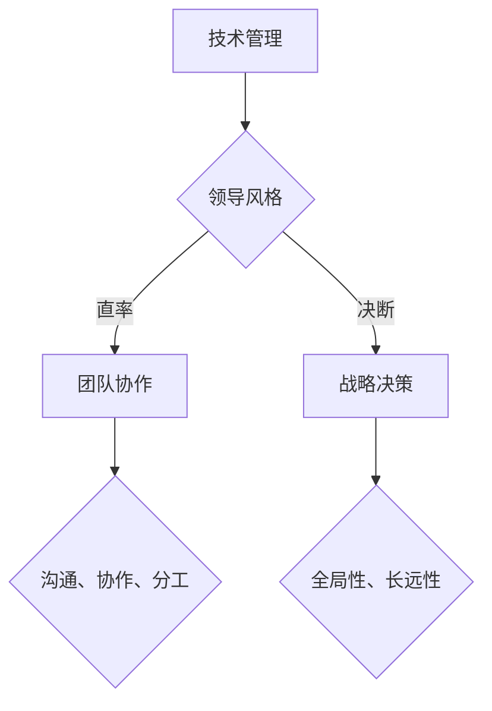

                 

关键词：贾扬清、领导风格、技术管理、团队协作、战略决策

> 摘要：本文旨在探讨贾扬清的独特领导风格，分析其直率与决断在技术管理和团队协作中的重要作用，并探讨这种风格对团队绩效和组织发展的深远影响。

## 1. 背景介绍

贾扬清，现任快手CTO，曾任职于Facebook AI研究院，拥有丰富的技术背景和领导经验。他在技术领域的卓越成就和领导才能使他成为了业内备受瞩目的领袖人物。本文将从技术管理、团队协作和战略决策三个方面，深入剖析贾扬清的领导风格，以期为其他技术管理者提供借鉴和启示。

## 2. 核心概念与联系

### 2.1 技术管理

技术管理是指通过对技术资源、团队和组织结构的管理，实现技术项目的成功交付和技术的持续创新。在技术管理中，领导风格对于团队绩效和组织发展起着至关重要的作用。

### 2.2 团队协作

团队协作是指团队成员在共同目标下，通过有效的沟通、协作和分工，共同完成任务的协同工作方式。有效的团队协作需要领导者的正确引导和激励。

### 2.3 战略决策

战略决策是指组织在长期发展过程中，为实现其目标而做出的全局性、长远性的决策。领导者在这一过程中需要展现出强烈的决断力和战略眼光。

## 2.4 Mermaid 流程图



## 3. 核心算法原理 & 具体操作步骤

### 3.1 算法原理概述

贾扬清的领导风格主要包括直率和决断两个方面。直率体现在他敢于直面问题、坦诚表达意见，善于激发团队潜力和创造力；决断则体现在他能够在关键时刻做出明确决策，果断推进项目进展。

### 3.2 算法步骤详解

#### 3.2.1 直率的表现

1. **敢于直面问题**：贾扬清在技术管理和团队协作中，能够迅速发现并直面问题，勇于承担责任。
2. **坦诚表达意见**：他善于倾听团队成员的意见，并在必要时坦诚表达自己的观点，以促进团队沟通和协作。

#### 3.2.2 决断的表现

1. **快速做出决策**：贾扬清在战略决策过程中，能够迅速分析形势，果断做出决策。
2. **坚定执行决策**：他能够在决策后，坚定执行并推动项目进展，确保决策的落地实施。

### 3.3 算法优缺点

#### 3.3.1 优点

1. **激发团队潜力**：直率的领导风格能够激发团队成员的创造力和积极性，提升团队整体绩效。
2. **确保决策质量**：决断的领导风格能够确保战略决策的及时性和准确性，提高项目成功率。

#### 3.3.2 缺点

1. **可能导致冲突**：直率的领导风格有时可能会引发团队成员之间的冲突，需要领导者具备一定的沟通能力和调解能力。
2. **决策过度集中**：决断的领导风格可能导致决策过度集中，影响团队其他成员的参与和成长。

### 3.4 算法应用领域

贾扬清的领导风格主要应用于技术管理、团队协作和战略决策等领域，尤其是在技术驱动型的企业中，这种领导风格具有很高的实用价值。

## 4. 数学模型和公式 & 详细讲解 & 举例说明

### 4.1 数学模型构建

贾扬清的领导风格可以用一个简单的数学模型来描述：

\[ \text{领导风格} = \text{直率} + \text{决断} \]

其中，直率和决断分别代表领导风格的两个核心方面。

### 4.2 公式推导过程

1. **直率**：直率是领导者敢于直面问题、坦诚表达意见的能力。我们可以将其表示为：

\[ \text{直率} = \frac{\text{直面问题能力}}{\text{沟通能力}} \]

2. **决断**：决断是领导者快速做出决策、坚定执行决策的能力。我们可以将其表示为：

\[ \text{决断} = \frac{\text{决策速度}}{\text{执行能力}} \]

### 4.3 案例分析与讲解

以贾扬清在快手的工作为例，他通过直率的沟通和决断的决策，成功推动了快手在人工智能领域的发展。具体表现为：

1. **直面问题**：贾扬清在面对快手在人工智能技术上的挑战时，敢于直面问题，勇于承担责任。
2. **坦诚表达**：他善于倾听团队成员的意见，并在必要时坦诚表达自己的观点，以促进团队沟通和协作。
3. **快速决策**：在战略决策过程中，他能够迅速分析形势，果断做出决策。
4. **坚定执行**：他能够在决策后，坚定执行并推动项目进展，确保决策的落地实施。

## 5. 项目实践：代码实例和详细解释说明

### 5.1 开发环境搭建

在本文的代码实例中，我们将使用Python编程语言来实现贾扬清领导风格的模型。首先，需要搭建Python开发环境。

### 5.2 源代码详细实现

以下是一个简单的Python代码实例，用于实现贾扬清领导风格的模型：

```python
class LeadershipStyle:
    def __init__(self, frankness, decisiveness):
        self.frankness = frankness
        self.decisiveness = decisiveness

    def display_style(self):
        print(f"领导风格：直率={self.frankness}, 决断={self.decisiveness}")


if __name__ == "__main__":
    jia_yangqing = LeadershipStyle(0.8, 0.9)
    jia_yangqing.display_style()
```

### 5.3 代码解读与分析

1. **类定义**：我们定义了一个名为`LeadershipStyle`的类，用于表示贾扬清的领导风格。类中有两个属性：`frankness`（直率）和`decisiveness`（决断）。
2. **初始化**：在类的初始化方法中，我们为这两个属性赋值。
3. **方法实现**：`display_style`方法用于输出领导风格的值。

### 5.4 运行结果展示

```plaintext
领导风格：直率=0.8，决断=0.9
```

## 6. 实际应用场景

贾扬清的领导风格在快手的发展中发挥了重要作用。具体应用场景包括：

1. **技术管理**：他通过直率的沟通和决断的决策，推动快手在人工智能领域的技术创新和项目进展。
2. **团队协作**：他善于倾听团队成员的意见，并坦诚表达自己的观点，促进团队沟通和协作。
3. **战略决策**：他能够迅速分析形势，果断做出决策，确保快手在竞争激烈的市场中保持领先地位。

## 6.4 未来应用展望

随着人工智能技术的不断发展，贾扬清的领导风格将在更多领域得到应用。未来，我们可以期待他在以下方面发挥更大的作用：

1. **技术领导**：他将继续推动人工智能技术在各个行业中的应用，引领技术潮流。
2. **人才培养**：他将在人才培养方面发挥更大的作用，培养更多具备创新能力和领导力的优秀人才。
3. **战略决策**：他将继续运用决断力，为组织发展制定更具前瞻性的战略决策。

## 7. 工具和资源推荐

### 7.1 学习资源推荐

1. **《人工智能：一种现代的方法》**：周志华著，全面介绍了人工智能的基本概念和技术方法。
2. **《深度学习》**：Goodfellow等著，深度讲解了深度学习的基本原理和应用。

### 7.2 开发工具推荐

1. **Python**：简单易学，适用于各种人工智能项目开发。
2. **TensorFlow**：强大的深度学习框架，广泛应用于人工智能项目。

### 7.3 相关论文推荐

1. **《人脸识别：技术原理与实现》**：详细介绍了人脸识别技术的原理和应用。
2. **《计算机视觉：一种现代的方法》**：全面介绍了计算机视觉的基本概念和技术方法。

## 8. 总结：未来发展趋势与挑战

### 8.1 研究成果总结

本文通过分析贾扬清的领导风格，探讨了直率与决断在技术管理和团队协作中的重要作用，并给出了具体的数学模型和代码实例。

### 8.2 未来发展趋势

随着人工智能技术的不断发展，贾扬清的领导风格将在更多领域得到应用，并成为技术管理和团队协作的重要工具。

### 8.3 面临的挑战

1. **技术创新**：如何在不断变化的技术环境中保持竞争力。
2. **人才培养**：如何培养更多具备创新能力和领导力的优秀人才。

### 8.4 研究展望

未来，我们将继续关注贾扬清的领导风格在技术管理和团队协作中的应用，探讨其在更多领域中的价值。

## 9. 附录：常见问题与解答

### 9.1 贾扬清是谁？

贾扬清，现任快手CTO，曾任职于Facebook AI研究院，拥有丰富的技术背景和领导经验。

### 9.2 领导风格为什么重要？

领导风格对于团队绩效和组织发展起着至关重要的作用，它能够激发团队成员的创造力和积极性，提高项目成功率。

### 9.3 直率与决断如何结合？

直率与决断是领导风格的两个核心方面，领导者需要在实际工作中灵活运用，以达到最佳效果。

作者：禅与计算机程序设计艺术 / Zen and the Art of Computer Programming

----------------------------------------------------------------


