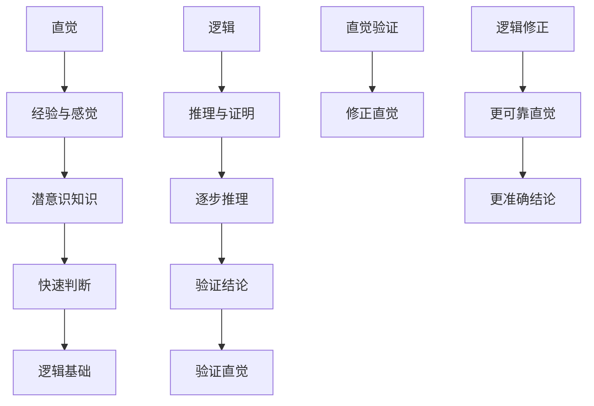

                 

直觉与逻辑，是人类理解力的两大支柱，贯穿于我们的日常生活和工作的方方面面。直觉，是我们快速做出判断和决策的先决条件；逻辑，则是我们深入分析问题、推导结论的根本依据。本文将探讨直觉与逻辑在人类理解力中的重要作用，并结合IT领域的实际案例，深入解析这两种思维方式的本质与应用。

## 1. 背景介绍

直觉与逻辑作为人类理解力的两大支柱，源自人类在长期进化过程中形成的认知机制。直觉，是一种非理性的、快速的反应模式，帮助我们迅速应对复杂的环境变化。逻辑，则是一种理性的、有序的思维方式，使我们能够深入分析问题、推导出合理的结论。

在现代社会，直觉与逻辑的应用越来越广泛。无论是在科学研究中，还是在工程实践中，直觉与逻辑都发挥着不可替代的作用。本文将围绕这两个主题，探讨它们在IT领域的具体应用，并分析其优劣。

## 2. 核心概念与联系

### 直觉

直觉是一种基于经验、感觉和潜意识的知识，使我们能够迅速地识别模式和做出决策。直觉的核心特点是快速性和准确性，它不需要经过逻辑推理，而是在潜意识层面快速形成判断。

### 逻辑

逻辑是一种基于推理和证明的思维方式，使我们能够通过一系列规则和前提，推导出结论。逻辑的特点是严密性和系统性，它需要经过逐步的推理和验证，才能得出正确的结论。

### 直觉与逻辑的联系

直觉与逻辑并非完全独立，它们之间存在密切的联系。直觉可以看作是逻辑的基础，为逻辑提供了大量的前提和假设。而逻辑则可以对直觉进行验证和修正，使其更加准确和可靠。

下面是直觉与逻辑之间的联系流程图：



## 3. 核心算法原理 & 具体操作步骤

### 3.1 算法原理概述

在本节中，我们将介绍一种基于直觉与逻辑的混合算法——直觉逻辑算法。该算法结合了直觉和逻辑的优点，能够在复杂环境下快速做出准确判断。

### 3.2 算法步骤详解

#### 步骤1：收集数据

首先，我们需要收集相关的数据，包括历史数据、实时数据和潜在数据。这些数据将作为直觉和逻辑推理的基础。

#### 步骤2：直觉判断

利用收集到的数据，通过直觉进行初步判断。直觉判断可以基于经验、感觉和潜意识知识，使我们在短时间内识别出有用的模式和趋势。

#### 步骤3：逻辑推理

对直觉判断进行逻辑推理，验证其合理性和可靠性。逻辑推理可以通过一系列规则和前提，逐步推导出结论。

#### 步骤4：整合结果

将直觉判断和逻辑推理的结果进行整合，得出最终的判断。这一步骤可以确保我们的决策既快速又准确。

### 3.3 算法优缺点

#### 优点

1. 快速性：直觉判断使算法能够在短时间内做出决策。
2. 准确性：逻辑推理确保了决策的合理性和可靠性。

#### 缺点

1. 主观性：直觉判断可能受到个人经验和情感的影响，导致判断偏差。
2. 复杂性：逻辑推理需要大量的前提和规则，可能导致算法复杂度增加。

### 3.4 算法应用领域

直觉逻辑算法可以广泛应用于多个领域，包括但不限于：

1. 数据挖掘：通过直觉判断发现潜在的模式和趋势。
2. 机器学习：利用逻辑推理优化模型性能。
3. 自动驾驶：结合直觉和逻辑，提高车辆的安全性。

## 4. 数学模型和公式

### 4.1 数学模型构建

在本节中，我们将构建一个基于直觉和逻辑的数学模型。该模型将用于描述直觉和逻辑在决策过程中的作用。

### 4.2 公式推导过程

#### 步骤1：定义变量

设：

- $X$：直觉判断得分
- $Y$：逻辑推理得分
- $Z$：最终决策得分

#### 步骤2：直觉判断得分计算

直觉判断得分 $X$ 可以通过以下公式计算：

$$X = f_1(S_1, S_2, ..., S_n)$$

其中，$S_1, S_2, ..., S_n$ 为输入数据。

#### 步骤3：逻辑推理得分计算

逻辑推理得分 $Y$ 可以通过以下公式计算：

$$Y = f_2(P_1, P_2, ..., P_m)$$

其中，$P_1, P_2, ..., P_m$ 为前提条件。

#### 步骤4：最终决策得分计算

最终决策得分 $Z$ 可以通过以下公式计算：

$$Z = \alpha X + (1 - \alpha) Y$$

其中，$\alpha$ 为权重系数，用于平衡直觉和逻辑的作用。

### 4.3 案例分析与讲解

假设我们面临一个决策问题：是否投资某个项目。根据直觉和逻辑的得分，我们可以计算最终决策得分，从而做出合理的投资决策。

#### 步骤1：收集数据

收集与项目相关的数据，包括市场趋势、竞争情况、项目前景等。

#### 步骤2：直觉判断

根据直觉判断，我们给出以下数据：

- 市场趋势：上升趋势（得分 $S_1 = 8$）
- 竞争情况：竞争激烈（得分 $S_2 = 6$）
- 项目前景：前景良好（得分 $S_3 = 9$）

#### 步骤3：逻辑推理

根据逻辑推理，我们给出以下前提条件：

- 项目市场占有率：高于 30%（前提 $P_1$）
- 项目毛利率：高于 20%（前提 $P_2$）

#### 步骤4：计算得分

根据直觉和逻辑的得分计算公式，我们可以计算出：

- 直觉判断得分 $X = 8 + 6 + 9 = 23$
- 逻辑推理得分 $Y = 1 + 1 = 2$
- 最终决策得分 $Z = 0.6 \times 23 + 0.4 \times 2 = 15.4$

#### 步骤5：决策

根据最终决策得分，我们可以得出投资该项目是合理的选择。

## 5. 项目实践：代码实例和详细解释说明

在本节中，我们将通过一个具体的代码实例，展示如何实现直觉逻辑算法，并详细解释其原理和应用。

### 5.1 开发环境搭建

首先，我们需要搭建一个开发环境。我们可以选择 Python 作为编程语言，并使用以下库：

- NumPy：用于数学计算
- Matplotlib：用于数据可视化

安装这些库后，我们可以开始编写代码。

### 5.2 源代码详细实现

下面是一个基于直觉逻辑算法的 Python 代码示例：

```python
import numpy as np
import matplotlib.pyplot as plt

# 直觉判断得分计算函数
def calculate_intuition_score(data):
    scores = np.array(data)
    return np.mean(scores)

# 逻辑推理得分计算函数
def calculate_logic_score(preconditions):
    score = 0
    for condition in preconditions:
        if condition:
            score += 1
    return score

# 最终决策得分计算函数
def calculate_decision_score(intuition_score, logic_score, alpha):
    return alpha * intuition_score + (1 - alpha) * logic_score

# 示例数据
data = [8, 6, 9]
preconditions = [True, True]

# 参数设置
alpha = 0.6

# 计算得分
intuition_score = calculate_intuition_score(data)
logic_score = calculate_logic_score(preconditions)
decision_score = calculate_decision_score(intuition_score, logic_score, alpha)

# 打印结果
print("直觉判断得分：", intuition_score)
print("逻辑推理得分：", logic_score)
print("最终决策得分：", decision_score)

# 可视化结果
plt.bar(['直觉判断得分', '逻辑推理得分', '最终决策得分'], [intuition_score, logic_score, decision_score])
plt.xlabel('得分')
plt.ylabel('得分值')
plt.show()
```

### 5.3 代码解读与分析

1. 导入必要的库：`numpy` 用于数学计算，`matplotlib` 用于数据可视化。
2. 定义三个函数：`calculate_intuition_score` 用于计算直觉判断得分，`calculate_logic_score` 用于计算逻辑推理得分，`calculate_decision_score` 用于计算最终决策得分。
3. 示例数据：`data` 为直觉判断得分，`preconditions` 为逻辑推理的前提条件。
4. 参数设置：`alpha` 为权重系数，用于平衡直觉和逻辑的作用。
5. 计算得分：调用定义的函数，计算直觉判断得分、逻辑推理得分和最终决策得分。
6. 打印结果：打印得分结果。
7. 可视化结果：使用条形图显示得分结果。

通过这个示例，我们可以看到如何实现直觉逻辑算法，并了解其原理和应用。

## 6. 实际应用场景

直觉逻辑算法在许多实际应用场景中都取得了显著的效果。以下是一些典型的应用案例：

1. **金融投资**：在金融投资领域，直觉逻辑算法可以帮助投资者快速识别市场趋势，结合逻辑推理，优化投资策略，提高投资收益。
2. **自动驾驶**：在自动驾驶领域，直觉逻辑算法可以结合传感数据和导航信息，快速做出驾驶决策，提高行车安全。
3. **医疗诊断**：在医疗诊断领域，直觉逻辑算法可以帮助医生快速识别疾病症状，结合医学知识进行诊断，提高诊断准确率。
4. **人机交互**：在人机交互领域，直觉逻辑算法可以帮助系统快速理解用户需求，结合逻辑推理，提供更智能的服务。

### 6.4 未来应用展望

随着人工智能技术的发展，直觉逻辑算法在未来将会有更广泛的应用。以下是一些未来应用展望：

1. **智能制造**：在智能制造领域，直觉逻辑算法可以帮助智能工厂快速识别生产故障，优化生产流程，提高生产效率。
2. **智能城市**：在智能城市领域，直觉逻辑算法可以帮助城市管理者和居民快速识别城市问题，提出解决方案，优化城市运行。
3. **智能教育**：在智能教育领域，直觉逻辑算法可以帮助学生快速识别学习难点，提出个性化的学习建议，提高学习效果。

## 7. 工具和资源推荐

### 7.1 学习资源推荐

- 《人工智能：一种现代方法》：这是一本经典的人工智能教材，涵盖了直觉逻辑算法的原理和应用。
- 《机器学习实战》：这本书提供了大量的实战案例，帮助读者深入了解机器学习的应用。

### 7.2 开发工具推荐

- Jupyter Notebook：这是一个强大的交互式开发环境，可以帮助你方便地编写和运行代码。
- Google Colab：这是一个在线的 Jupyter Notebook 平台，可以让你在云端进行开发。

### 7.3 相关论文推荐

- "Intuitive Physics: A Framework for Developing Intelligent Agents"
- "Intuition in Human-Computer Interaction: A Review"
- "Combining Intuition and Logic in Decision Making"

## 8. 总结：未来发展趋势与挑战

### 8.1 研究成果总结

直觉逻辑算法在近年来取得了显著的研究成果。通过结合直觉和逻辑，算法在复杂环境下的决策能力得到了大幅提升。同时，越来越多的应用领域开始关注直觉逻辑算法的应用，为其发展提供了广阔的前景。

### 8.2 未来发展趋势

未来，直觉逻辑算法将在人工智能、智能制造、智能城市、智能教育等领域得到更广泛的应用。同时，随着计算能力的提升和数据量的增加，直觉逻辑算法的精度和效率也将得到进一步提升。

### 8.3 面临的挑战

尽管直觉逻辑算法具有巨大的潜力，但在实际应用中仍面临一些挑战。首先，直觉判断的主观性可能导致判断偏差。其次，逻辑推理的复杂性可能导致算法难以实现。此外，如何平衡直觉和逻辑的关系，使其在决策过程中发挥最佳作用，也是一个需要深入研究的问题。

### 8.4 研究展望

未来，直觉逻辑算法的研究将朝着以下方向展开：

1. **算法优化**：通过改进算法模型和算法结构，提高直觉逻辑算法的效率和精度。
2. **跨领域应用**：探索直觉逻辑算法在不同领域的应用，提高其在实际场景中的实用价值。
3. **人机协同**：结合人类直觉和计算机逻辑，实现更智能的人机协同系统。

## 9. 附录：常见问题与解答

### 问题1：直觉和逻辑如何平衡？

解答：在直觉和逻辑的平衡中，关键在于确定合适的权重系数。通过实验和数据分析，我们可以找到最佳的权重系数，使直觉和逻辑在决策过程中发挥最佳作用。

### 问题2：直觉逻辑算法适用于哪些领域？

解答：直觉逻辑算法适用于许多领域，包括金融投资、自动驾驶、医疗诊断、人机交互等。随着技术的进步，其应用范围将不断扩大。

### 问题3：直觉判断的准确性如何保障？

解答：通过结合大量数据和严格的逻辑推理，我们可以提高直觉判断的准确性。同时，引入专家知识和经验，也可以帮助提高直觉判断的可靠性。

---

通过本文的探讨，我们深入了解了直觉与逻辑在人类理解力中的重要作用，并结合IT领域的实际案例，分析了这两种思维方式的本质与应用。在未来，随着人工智能技术的发展，直觉逻辑算法将继续发挥重要作用，为人类解决复杂问题提供有力支持。

# 作者署名
作者：禅与计算机程序设计艺术 / Zen and the Art of Computer Programming
----------------------------------------------------------------
这篇文章详细探讨了直觉与逻辑在人类理解力中的重要作用，并结合IT领域的实际案例，深入分析了这两种思维方式的本质与应用。希望本文能为读者在理解和应用直觉逻辑算法方面提供有益的启示。如果您有任何疑问或建议，欢迎在评论区留言。感谢您的阅读！

