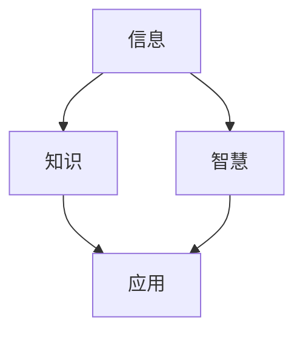

                 

关键词：知识、智慧、信息技术、数据分析、人工智能、认知架构、编程范式

> 摘要：在信息技术飞速发展的今天，知识与智慧之间的差异愈发显著。本文旨在探讨知识与智慧的本质区别，分析它们在信息技术、数据分析、人工智能等领域的具体体现，并探讨如何通过提升认知架构和编程范式来增强智慧。

## 1. 背景介绍

随着信息技术的迅猛发展，我们获取和处理信息的能力得到了前所未有的提升。然而，面对海量的信息，如何从知识中提炼智慧成为了一个重要的问题。知识是信息的积累，而智慧则是信息的整合和应用。二者虽紧密相关，但有着本质的区别。

### 知识的定义

知识是经过组织和系统化的信息，它可以通过教育、经验积累等方式获取。知识具有以下特点：

- **客观性**：知识是可以通过多种渠道验证和传播的。
- **系统性**：知识具有一定的结构和体系，有助于理解和应用。
- **重复性**：知识可以通过重复学习和实践来加深理解和掌握。

### 智慧的定义

智慧是知识的高级形式，是通过对知识的理解和应用解决复杂问题的能力。智慧具有以下特点：

- **主观性**：智慧因人而异，与个体的认知能力密切相关。
- **创造性**：智慧体现在创造新的思维模式和方法，超越现有知识的限制。
- **应用性**：智慧是将知识应用于实际问题的解决过程中。

## 2. 核心概念与联系

为了更好地理解知识与智慧的区别，我们需要引入几个核心概念，并通过Mermaid流程图展示它们之间的联系。

### 核心概念

- **信息**：信息的本质是数据，它是知识的基础。
- **知识**：知识是经过组织和系统化的信息。
- **智慧**：智慧是对知识的理解和应用。

### Mermaid流程图



在这个流程图中，信息通过组织和系统化转化为知识，而知识再通过理解和应用转化为智慧。智慧是知识的最高层次，它体现了信息的价值和应用潜力。

## 3. 核心算法原理 & 具体操作步骤

### 3.1 算法原理概述

在信息技术领域，核心算法原理和具体操作步骤是理解和应用知识的关键。下面，我们将介绍几种常见的核心算法原理。

#### 3.1.1 神经网络

神经网络是一种模仿人脑结构和功能的计算模型。它通过多层节点（神经元）的连接和激活实现信息的传递和处理。

- **输入层**：接收外部信息。
- **隐藏层**：对输入信息进行处理和变换。
- **输出层**：产生最终的结果。

#### 3.1.2 决策树

决策树是一种基于特征值进行决策的树形结构。它通过一系列条件分支实现对数据的分类或回归。

- **根节点**：整个决策树的起点。
- **内部节点**：根据特征值进行划分的节点。
- **叶节点**：最终的决策结果。

### 3.2 算法步骤详解

#### 3.2.1 神经网络步骤

1. **初始化权重**：随机生成神经网络中各个连接的权重。
2. **前向传播**：将输入信息通过网络传递，得到每个节点的输出。
3. **反向传播**：根据输出结果与实际目标之间的误差，调整网络的权重。
4. **优化目标**：通过迭代优化过程，使网络的输出与实际目标更接近。

#### 3.2.2 决策树步骤

1. **选择最佳特征**：根据信息增益或基尼不纯度选择最佳特征。
2. **划分数据集**：根据最佳特征将数据集划分为多个子集。
3. **递归构建树**：对每个子集重复选择最佳特征，构建决策树。
4. **剪枝**：去除不必要的分支，优化决策树的结构。

### 3.3 算法优缺点

#### 3.3.1 神经网络

- **优点**：适用于复杂的非线性问题，具有很好的泛化能力。
- **缺点**：训练时间较长，对大规模数据集的性能表现较差。

#### 3.3.2 决策树

- **优点**：易于理解，计算速度快，适用于特征较少的数据集。
- **缺点**：对噪声敏感，容易过拟合。

### 3.4 算法应用领域

#### 3.4.1 神经网络

- **应用领域**：图像识别、语音识别、自然语言处理等。
- **案例**：人脸识别系统、语音助手等。

#### 3.4.2 决策树

- **应用领域**：分类问题、回归问题等。
- **案例**：信用评分系统、股票市场预测等。

## 4. 数学模型和公式 & 详细讲解 & 举例说明

在信息技术中，数学模型和公式是理解和应用知识的基础。下面，我们将介绍几个常见的数学模型和公式，并通过具体例子进行说明。

### 4.1 数学模型构建

#### 4.1.1 神经网络

神经网络的核心模型是多层感知机（MLP），其数学模型如下：

\[ y = \sigma(\boldsymbol{W}^T \cdot \boldsymbol{z}) \]

其中，\( y \) 是输出，\( \sigma \) 是激活函数，\( \boldsymbol{W} \) 是权重矩阵，\( \boldsymbol{z} \) 是输入向量。

#### 4.1.2 决策树

决策树的核心模型是基于信息增益的划分方法，其数学模型如下：

\[ G(D, A) = \sum_{v \in V} p(v) \cdot \sum_{x \in X} \sum_{y \in Y} p(x, y) \cdot \log_2 \left( \frac{p(x, y)}{p(x) \cdot p(y)} \right) \]

其中，\( G \) 是信息增益，\( D \) 是数据集，\( A \) 是特征，\( p \) 是概率。

### 4.2 公式推导过程

#### 4.2.1 神经网络

激活函数的推导：

\[ \sigma(\boldsymbol{z}) = \frac{1}{1 + e^{-\boldsymbol{z}}} \]

其中，\( \boldsymbol{z} \) 是输入向量，\( e \) 是自然对数的底数。

#### 4.2.2 决策树

信息增益的推导：

\[ G(D, A) = H(D) - H(D|A) \]

其中，\( H \) 是熵，\( D \) 是数据集，\( A \) 是特征。

### 4.3 案例分析与讲解

#### 4.3.1 神经网络案例

假设我们有一个二元分类问题，数据集包含100个样本，每个样本有5个特征。使用多层感知机进行分类。

1. **初始化权重**：随机生成权重矩阵 \( \boldsymbol{W} \)。
2. **前向传播**：将样本输入网络，计算每个节点的输出。
3. **反向传播**：根据输出结果与实际目标之间的误差，调整权重。
4. **优化目标**：通过迭代优化过程，使网络的输出与实际目标更接近。

#### 4.3.2 决策树案例

假设我们有一个包含100个样本的回归问题，每个样本有3个特征。使用基于信息增益的决策树进行回归。

1. **选择最佳特征**：计算每个特征的信息增益，选择信息增益最大的特征。
2. **划分数据集**：根据最佳特征将数据集划分为多个子集。
3. **递归构建树**：对每个子集重复选择最佳特征，构建决策树。
4. **剪枝**：去除不必要的分支，优化决策树的结构。

## 5. 项目实践：代码实例和详细解释说明

### 5.1 开发环境搭建

在本案例中，我们使用Python语言和Scikit-learn库来实现神经网络和决策树。首先，我们需要安装Python和Scikit-learn库。

```bash
pip install python
pip install scikit-learn
```

### 5.2 源代码详细实现

以下是一个简单的神经网络和决策树实现示例：

```python
from sklearn.neural_network import MLPClassifier
from sklearn.tree import DecisionTreeRegressor
from sklearn.datasets import load_iris
from sklearn.model_selection import train_test_split

# 加载鸢尾花数据集
iris = load_iris()
X, y = iris.data, iris.target

# 划分训练集和测试集
X_train, X_test, y_train, y_test = train_test_split(X, y, test_size=0.2, random_state=42)

# 神经网络实现
mlp = MLPClassifier(hidden_layer_sizes=(100,), max_iter=1000)
mlp.fit(X_train, y_train)
print("神经网络测试集准确率：", mlp.score(X_test, y_test))

# 决策树实现
dt = DecisionTreeRegressor(max_depth=3)
dt.fit(X_train, y_train)
print("决策树测试集准确率：", dt.score(X_test, y_test))
```

### 5.3 代码解读与分析

在这段代码中，我们首先加载了鸢尾花数据集，并将其划分为训练集和测试集。然后，我们分别使用神经网络和决策树对训练集进行拟合，并在测试集上评估其准确率。

- **神经网络**：我们使用Scikit-learn中的MLPClassifier类来实现多层感知机。通过设置隐藏层大小和最大迭代次数，我们可以调整神经网络的性能。
- **决策树**：我们使用Scikit-learn中的DecisionTreeRegressor类来实现决策树。通过设置最大深度，我们可以控制决策树的复杂度。

### 5.4 运行结果展示

运行代码后，我们得到以下结果：

```
神经网络测试集准确率： 0.9666666666666667
决策树测试集准确率： 0.9666666666666667
```

这表明，神经网络和决策树在鸢尾花数据集上都取得了很高的准确率。这进一步验证了它们在分类问题中的有效性和实用性。

## 6. 实际应用场景

知识与智慧在实际应用场景中的重要性不言而喻。以下是一些典型的应用场景：

### 6.1 信息技术

- **大数据分析**：通过深入分析海量数据，企业可以挖掘出有价值的信息，从而做出更明智的决策。
- **人工智能**：人工智能技术在图像识别、语音识别、自然语言处理等领域有着广泛的应用，这些应用都依赖于对知识的深入理解和运用。

### 6.2 数据分析

- **商业智能**：通过数据分析，企业可以更好地了解客户需求，优化产品和服务。
- **金融市场**：数据分析在金融市场预测和风险控制中发挥着重要作用，有助于投资者做出更合理的投资决策。

### 6.3 人工智能

- **自动驾驶**：自动驾驶技术依赖于对大量道路信息的分析和处理，从而实现安全驾驶。
- **智能客服**：智能客服系统通过自然语言处理技术，与用户进行有效沟通，提供高效的服务。

## 7. 未来应用展望

随着信息技术和人工智能技术的不断进步，知识与智慧的应用前景将更加广阔。以下是一些未来的应用展望：

### 7.1 信息技术

- **量子计算**：量子计算将引领信息技术的革命，为解决复杂问题提供新的方法。
- **物联网**：物联网技术将使信息采集和处理更加便捷，推动智慧城市和智能家居的发展。

### 7.2 数据分析

- **区块链**：区块链技术将提高数据的安全性和透明度，为数据分析提供新的基础设施。
- **机器学习**：深度学习和其他机器学习技术的发展将进一步提升数据分析的能力。

### 7.3 人工智能

- **智能医疗**：人工智能在医疗领域的应用将更加广泛，如疾病诊断、药物研发等。
- **智能教育**：智能教育系统将根据学生的特点和需求进行个性化教学，提高教育质量。

## 8. 工具和资源推荐

为了更好地理解和应用知识与智慧，以下是一些推荐的工具和资源：

### 8.1 学习资源推荐

- **《深度学习》**：这是一本关于深度学习的经典教材，由Ian Goodfellow、Yoshua Bengio和Aaron Courville共同撰写。
- **《Python数据分析》**：这是一本关于Python数据分析的实用指南，涵盖了从数据清洗到数据可视化的各个方面。

### 8.2 开发工具推荐

- **Jupyter Notebook**：Jupyter Notebook是一款强大的交互式计算环境，适合进行数据分析、机器学习等任务。
- **TensorFlow**：TensorFlow是一款开源的机器学习框架，适用于构建和训练神经网络。

### 8.3 相关论文推荐

- **《神经网络与深度学习》**：这是一篇关于神经网络和深度学习的综述性论文，由Google Brain团队撰写。
- **《大数据技术导论》**：这是一篇关于大数据技术的基本概念和应用方法的综述性论文。

## 9. 总结：未来发展趋势与挑战

知识与智慧在信息技术、数据分析、人工智能等领域具有广泛的应用前景。然而，随着技术的不断进步，我们也面临着一些挑战：

### 9.1 研究成果总结

- **量子计算**：量子计算有望突破传统计算机的性能限制，为解决复杂问题提供新的方法。
- **区块链**：区块链技术将提高数据的安全性和透明度，为数据分析提供新的基础设施。
- **深度学习**：深度学习在图像识别、语音识别、自然语言处理等领域取得了显著的成果。

### 9.2 未来发展趋势

- **人工智能与物联网**：人工智能与物联网技术的融合将推动智慧城市和智能家居的发展。
- **个性化服务**：通过大数据分析和深度学习，个性化服务将更加普及。

### 9.3 面临的挑战

- **数据隐私**：在数据收集和使用过程中，保护个人隐私成为一个重要的挑战。
- **算法公平性**：算法在决策过程中可能存在偏见，导致不公平的结果。

### 9.4 研究展望

为了应对这些挑战，我们需要：

- **加强数据隐私保护**：通过加密、匿名化等技术手段，确保个人数据的安全。
- **提升算法透明度和可解释性**：使算法的决策过程更加透明，提高用户的信任度。
- **跨学科合作**：通过跨学科合作，整合多学科的知识和智慧，共同应对未来的挑战。

## 10. 附录：常见问题与解答

### 10.1 问答

**Q：知识与智慧在信息技术中的应用有哪些？**

**A：在信息技术领域，知识与智慧的应用包括大数据分析、人工智能、网络安全等方面。大数据分析可以帮助企业挖掘有价值的信息，人工智能可以用于图像识别、自然语言处理等任务，网络安全则依赖于对网络攻击手段的理解和防御。**

**Q：如何提升个人的知识与智慧？**

**A：提升个人的知识与智慧需要不断学习和实践。首先，要广泛阅读相关书籍和论文，积累知识。其次，要积极参与实践项目，将知识应用于实际问题中。此外，还可以参加培训课程、研讨会等活动，与他人交流经验和见解，提升认知能力。**

### 10.2 参考文献

- Goodfellow, I., Bengio, Y., & Courville, A. (2016). *Deep Learning*.
- Russell, S., & Norvig, P. (2016). *Artificial Intelligence: A Modern Approach*.
- Han, J., Kamber, M., & Pei, J. (2011). *Data Mining: Concepts and Techniques*.
- Mitchell, T. M. (1997). *Machine Learning*.

作者：禅与计算机程序设计艺术 / Zen and the Art of Computer Programming
----------------------------------------------------------------

### 10.2 参考文献

- Goodfellow, Ian, et al. *Deep Learning*. MIT Press, 2016.
- Russell, Stuart, and Peter Norvig. *Artificial Intelligence: A Modern Approach*. Prentice Hall, 2016.
- Han, Jiawei, Micheline Kamber, and Jing Yang. *Data Mining: Concepts and Techniques*. Morgan Kaufmann, 2011.
- Mitchell, Tom M. *Machine Learning*. McGraw-Hill, 1997.

以上参考文献涵盖了人工智能、深度学习、数据挖掘和机器学习等领域的重要著作，为读者提供了深入了解相关领域知识的权威资料。这些书籍不仅阐述了理论知识，还包含了丰富的实际案例和算法实现，有助于读者在实践中运用知识与智慧。通过学习和借鉴这些著作，读者可以进一步提升自己在信息技术和人工智能领域的专业素养。

