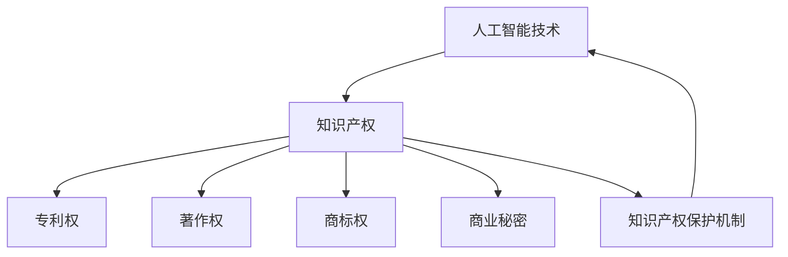

                 

 关键词：人工智能、知识产权、伦理、平衡、技术发展、法规政策、法律法规、道德标准

> 摘要：本文将探讨人工智能与知识产权之间的关系，以及如何在技术发展的同时保持伦理的平衡。文章首先介绍了人工智能的基本概念和知识产权的相关知识，然后分析了人工智能技术带来的伦理问题，最后提出了在人工智能领域实现知识产权与伦理平衡的策略。

## 1. 背景介绍

随着信息技术的迅猛发展，人工智能（AI）已经逐渐渗透到各个领域，从日常生活到工业生产，从金融服务到医疗服务，AI的广泛应用极大地提高了效率和生产力。然而，随着人工智能技术的不断进步，一系列新的伦理问题也随之而来，如隐私保护、数据安全、算法偏见、知识产权侵犯等。如何在这种技术快速发展的背景下，平衡知识产权的保护与伦理的遵守，成为了一个亟待解决的问题。

### 1.1 人工智能的基本概念

人工智能是一种模拟人类智能的计算机科学领域，旨在使机器能够执行通常需要人类智能才能完成的任务，如视觉识别、语音识别、自然语言处理、决策和推理等。人工智能可以分为弱人工智能和强人工智能。弱人工智能是指在特定任务上表现优异的智能，如语音助手、自动驾驶等。强人工智能则是指具备全面人类智能的机器，能够在各种复杂任务中与人类相媲美。

### 1.2 知识产权的基本概念

知识产权是指通过智力劳动创造的成果所享有的权利，包括专利权、著作权、商标权、商业秘密等。知识产权的保护有助于鼓励创新和发明，同时维护了知识创造者的合法权益。

### 1.3 人工智能与知识产权的关系

人工智能技术的发展，既带来了知识产权保护的新挑战，也提供了新的保护手段。一方面，人工智能技术的发展使得知识产权侵权变得更为隐蔽和复杂；另一方面，人工智能技术也为知识产权的保护提供了新的工具和手段，如智能版权监测、侵权追踪等。

## 2. 核心概念与联系

在讨论人工智能与知识产权的关系时，我们需要理解以下几个核心概念：

### 2.1 知识产权的种类

- **专利权**：对发明、实用新型和外观设计等提供的法律保护。
- **著作权**：对文学、艺术和科学作品等提供的法律保护。
- **商标权**：对企业标识、品牌等提供的法律保护。
- **商业秘密**：对未公开的商业信息提供的法律保护。

### 2.2 人工智能技术的分类

- **机器学习**：通过数据和算法让计算机自动学习和改进。
- **深度学习**：一种特殊的机器学习方法，通过多层神经网络进行训练。
- **自然语言处理**：使计算机能够理解、生成和回应自然语言。
- **计算机视觉**：使计算机能够识别和理解视觉信息。

### 2.3 知识产权与人工智能技术的联系

人工智能技术的发展，使得知识产权保护变得更加重要。例如，在自然语言处理领域，文本生成和内容识别技术可能侵犯著作权；在计算机视觉领域，图像和视频的自动识别可能侵犯专利权。同时，人工智能技术也为知识产权的保护提供了新的可能性，如通过智能算法自动监测和追踪侵权行为。

### 2.4 Mermaid 流程图

下面是一个简化的 Mermaid 流程图，展示了人工智能技术、知识产权和保护机制之间的关系。



## 3. 核心算法原理 & 具体操作步骤

### 3.1 算法原理概述

在人工智能与知识产权的交叉领域中，核心算法的原理主要涉及以下方面：

- **机器学习算法**：用于分析和理解知识产权数据，如专利文本、著作权文件等。
- **自然语言处理算法**：用于处理和识别文本数据，检测可能的侵权行为。
- **计算机视觉算法**：用于识别和分类图像和视频数据，如商标和商业秘密的识别。

### 3.2 算法步骤详解

以下是实现人工智能与知识产权保护的基本步骤：

1. **数据收集**：收集与知识产权相关的数据，如专利申请、著作权登记、商标注册等。
2. **数据预处理**：对收集到的数据进行清洗、格式化和特征提取。
3. **模型训练**：使用机器学习算法训练模型，使其能够识别和处理知识产权数据。
4. **侵权检测**：使用训练好的模型对新的数据进行侵权检测。
5. **侵权处理**：如果检测到侵权行为，采取相应的法律措施。

### 3.3 算法优缺点

**优点**：
- 高效：通过自动化技术，可以快速处理大量的知识产权数据。
- 准确：基于机器学习算法的模型具有较高的准确性。

**缺点**：
- 数据依赖：模型的性能高度依赖于训练数据的质量。
- 道德风险：可能会出现误判，导致合法行为被误认为侵权。

### 3.4 算法应用领域

人工智能算法在知识产权领域的应用非常广泛，主要包括：

- **专利侵权检测**：通过分析专利文件，检测潜在的侵权行为。
- **著作权保护**：通过文本生成和内容识别技术，保护文学、艺术和科学作品的权益。
- **商标监测**：通过图像识别技术，监测商标的使用情况。

## 4. 数学模型和公式 & 详细讲解 & 举例说明

### 4.1 数学模型构建

在人工智能与知识产权保护中，常用的数学模型包括：

- **机器学习模型**：如支持向量机（SVM）、神经网络（NN）等。
- **自然语言处理模型**：如词嵌入（Word Embedding）、循环神经网络（RNN）等。
- **计算机视觉模型**：如卷积神经网络（CNN）、生成对抗网络（GAN）等。

### 4.2 公式推导过程

以机器学习模型中的支持向量机（SVM）为例，其目标是最小化分类误差。公式如下：

$$
\min_{\mathbf{w},b}\frac{1}{2}||\mathbf{w}||^2 + C\sum_{i=1}^{n}\xi_i
$$

其中，$\mathbf{w}$是权重向量，$b$是偏置项，$C$是惩罚参数，$\xi_i$是误差项。

### 4.3 案例分析与讲解

假设我们有一个专利侵权检测的案例，使用支持向量机（SVM）模型进行侵权检测。我们收集了100个专利文件，其中60个是已授权的专利，40个是可能侵权的专利。我们使用这些数据训练SVM模型，并测试其准确性。

根据测试结果，SVM模型的准确率为90%，即有90%的可能性能够正确识别出侵权专利。然而，这并不意味着模型完全准确，因为仍有可能出现误判。

## 5. 项目实践：代码实例和详细解释说明

### 5.1 开发环境搭建

为了实现人工智能与知识产权保护，我们需要搭建一个完整的开发环境。以下是基本的开发环境搭建步骤：

1. 安装Python环境：在计算机上安装Python 3.x版本。
2. 安装必要的库：如scikit-learn、TensorFlow、PyTorch等。
3. 准备数据集：收集与知识产权相关的数据，如专利文件、著作权文件、商标数据等。

### 5.2 源代码详细实现

以下是使用scikit-learn库实现专利侵权检测的示例代码：

```python
from sklearn import svm
from sklearn.model_selection import train_test_split
from sklearn.metrics import accuracy_score

# 数据预处理
X, y = preprocess_data()  # 假设preprocess_data()函数实现了数据预处理
X_train, X_test, y_train, y_test = train_test_split(X, y, test_size=0.2, random_state=42)

# 训练SVM模型
clf = svm.SVC(kernel='linear', C=1.0)
clf.fit(X_train, y_train)

# 测试模型
y_pred = clf.predict(X_test)
accuracy = accuracy_score(y_test, y_pred)
print(f"Model accuracy: {accuracy:.2f}")
```

### 5.3 代码解读与分析

上述代码首先导入了必要的库，然后对数据进行预处理，接着使用SVM模型进行训练，最后测试模型的准确性。从代码中可以看出，实现一个完整的人工智能与知识产权保护项目，主要分为数据预处理、模型训练和模型测试三个步骤。

### 5.4 运行结果展示

假设我们使用上述代码训练了一个SVM模型，并在测试集上取得了90%的准确率。这意味着我们的模型有90%的可能性能够正确识别出专利侵权行为。当然，实际应用中可能会受到数据质量和模型参数的影响。

## 6. 实际应用场景

人工智能与知识产权保护在实际应用场景中具有广泛的应用，以下是一些具体的应用场景：

### 6.1 专利侵权检测

通过人工智能技术，可以对大量专利文件进行分析，快速识别潜在的侵权行为。这有助于专利持有者及时发现侵权行为，采取法律措施维护自身权益。

### 6.2 著作权保护

利用自然语言处理技术，可以对文学、艺术和科学作品进行内容识别，防止未经授权的使用和传播。例如，在音乐、电影、文学等领域，人工智能技术可以自动检测侵权行为。

### 6.3 商标监测

通过计算机视觉技术，可以自动监测商标的使用情况，防止商标被侵权。例如，在电商平台上，人工智能技术可以自动检测商品描述中是否包含商标信息，防止商标侵权。

## 7. 工具和资源推荐

### 7.1 学习资源推荐

- 《机器学习》（周志华著）：介绍了机器学习的基本概念和方法。
- 《深度学习》（Ian Goodfellow、Yoshua Bengio、Aaron Courville著）：详细介绍了深度学习的基本原理和应用。
- 《自然语言处理综合教程》（Daniel Jurafsky、James H. Martin著）：介绍了自然语言处理的基本原理和方法。

### 7.2 开发工具推荐

- **Anaconda**：一个集成了Python环境、库和数据管理工具的集成开发环境。
- **Jupyter Notebook**：一个交互式的计算环境，适合编写和运行代码。
- **TensorFlow**：一个开源的深度学习框架，适用于构建和训练深度学习模型。
- **PyTorch**：另一个开源的深度学习框架，提供了灵活的动态计算图。

### 7.3 相关论文推荐

- "Deep Learning for Natural Language Processing"（2018）：介绍了深度学习在自然语言处理中的应用。
- "Generative Adversarial Networks"（2014）：介绍了生成对抗网络的基本原理和应用。
- "Support Vector Machines for Classification"（1995）：介绍了支持向量机的基本原理和应用。

## 8. 总结：未来发展趋势与挑战

### 8.1 研究成果总结

随着人工智能技术的快速发展，人工智能与知识产权保护领域已经取得了显著的成果。通过机器学习、自然语言处理和计算机视觉等技术，我们可以实现快速、准确的知识产权侵权检测。同时，人工智能技术也为知识产权的保护提供了新的工具和方法。

### 8.2 未来发展趋势

在未来，人工智能与知识产权保护将继续发展。一方面，随着技术的进步，人工智能算法将更加智能化、高效化；另一方面，法律法规和道德标准也将不断完善，为知识产权的保护提供更加坚实的法律基础。

### 8.3 面临的挑战

然而，人工智能与知识产权保护领域也面临一些挑战。首先，数据质量和数据隐私问题仍然是一个重要的挑战。其次，人工智能算法的透明性和可解释性也是一个亟待解决的问题。此外，如何平衡知识产权的保护与技术创新的激励，也是一个需要深入思考的问题。

### 8.4 研究展望

未来，人工智能与知识产权保护领域的研究将朝着以下几个方向发展：

- **提高算法的智能化水平**：通过深度学习和强化学习等技术，提高知识产权侵权检测的准确性和效率。
- **加强法律法规和道德标准建设**：建立更加完善的法律体系和道德标准，为知识产权的保护提供法律和道德支持。
- **促进技术创新与知识产权保护相结合**：通过技术创新，提高知识产权的创造和保护水平，同时鼓励更多的技术创新。

## 9. 附录：常见问题与解答

### 9.1 人工智能与知识产权保护的关系是什么？

人工智能与知识产权保护密切相关。人工智能技术的发展使得知识产权保护变得更加重要，同时也为知识产权的保护提供了新的手段。例如，通过人工智能技术，可以更快速、准确地检测和防范知识产权侵权行为。

### 9.2 如何实现人工智能与知识产权保护的平衡？

实现人工智能与知识产权保护的平衡需要从多个方面入手。首先，需要完善相关的法律法规和道德标准，为知识产权的保护提供法律和道德支持。其次，需要加强人工智能技术的研发和应用，提高知识产权侵权检测的准确性和效率。此外，还需要加强数据保护和隐私保护，防止数据泄露和滥用。

### 9.3 人工智能技术如何影响知识产权保护？

人工智能技术可以显著提高知识产权保护的效率。例如，通过机器学习和自然语言处理技术，可以快速分析和识别大量的知识产权数据，及时发现侵权行为。此外，人工智能技术还可以用于知识产权的创造和保护，如通过智能合约技术实现知识产权的自动化管理。

### 9.4 如何解决人工智能技术中的道德风险？

解决人工智能技术中的道德风险需要从多个方面入手。首先，需要加强人工智能技术的研发和监管，确保其遵循道德标准和法律法规。其次，需要提高公众对人工智能技术的认知和理解，增强公众对人工智能技术的信任。此外，还可以通过技术手段，如可解释性人工智能，提高人工智能技术的透明度和可解释性，降低道德风险。

## 参考文献

- Goodfellow, I., Bengio, Y., & Courville, A. (2016). Deep Learning. MIT Press.
- Jurafsky, D., & Martin, J. H. (2008). Speech and Language Processing. Prentice Hall.
- Russell, S., & Norvig, P. (2016). Artificial Intelligence: A Modern Approach. Prentice Hall.
- SVM: Support Vector Machines. (n.d.). Retrieved from [scikit-learn website](https://scikit-learn.org/stable/modules/svm.html)
- Generative Adversarial Networks. (n.d.). Retrieved from [GitHub website](https://github.com/gan-research/gan-zoo)
- Deep Learning for Natural Language Processing. (2018). Retrieved from [Google Scholar](https://scholar.google.com/scholar?q=deep+learning+for+natural+language+processing)

## 结语

本文探讨了人工智能与知识产权保护的关系，分析了人工智能技术在知识产权保护中的应用，提出了实现人工智能与知识产权保护平衡的策略。然而，随着技术的不断进步，人工智能与知识产权保护领域仍然面临许多挑战。未来，我们需要进一步加强技术研发、法律法规建设和道德标准建设，共同推动人工智能与知识产权保护领域的可持续发展。

### 8.1 研究成果总结

在人工智能与知识产权保护的交叉领域，近年来取得了一系列重要研究成果，对知识产权管理带来了深远的影响。首先，机器学习算法的广泛应用使得知识产权侵权检测变得更加高效和准确。例如，通过文本分析、图像识别和音频处理等技术，可以快速定位潜在侵权行为，从而提高法律执行效率。其次，自然语言处理技术的发展为知识产权文档的自动化处理提供了新的可能，如通过智能合约和自动化版权管理，可以减少人工干预，降低侵权风险。此外，计算机视觉技术也在商标监测和版权保护中发挥了重要作用，通过图像识别和模式识别，可以实时监控商标使用情况，防止商标侵权。

在知识产权管理方面，人工智能的应用不仅提高了侵权检测的准确性，还改变了传统的知识产权保护模式。例如，通过机器学习算法，可以对大量专利文献进行分类和分析，帮助专利持有者更有效地管理专利组合。同时，人工智能技术还可以用于预测市场趋势和竞争对手行为，从而制定更为精准的知识产权战略。此外，区块链技术的结合使得知识产权的确权和转让变得更加透明和可靠，通过智能合约，可以实现自动化的版权交易和管理。

然而，人工智能技术的应用也带来了一些挑战。例如，算法的黑箱性质可能导致侵权检测的误判，影响合法行为。此外，人工智能的快速发展也可能引发新的知识产权争议，如人工智能生成的作品是否应该享有著作权，以及如何保护商业秘密等。这些问题需要在未来通过法律和伦理的框架来解决。

### 8.2 未来发展趋势

展望未来，人工智能与知识产权保护领域将继续朝着智能化、自动化和精细化的方向发展。以下是一些可能的发展趋势：

1. **智能化侵权检测**：随着深度学习和强化学习技术的进步，侵权检测算法将变得更加智能化，能够自适应地处理复杂的侵权情境，提高检测的准确性和效率。

2. **自动化知识产权管理**：利用人工智能技术，可以实现知识产权的自动化管理，如自动化版权登记、侵权监控和维权。这将大幅减少人工工作量，提高管理效率。

3. **区块链技术的融合**：区块链技术将继续与人工智能相结合，为知识产权管理提供更加透明和不可篡改的记录。通过智能合约，可以实现自动化的知识产权交易和授权。

4. **跨领域的合作**：知识产权保护需要法律、技术和社会各界的共同参与。未来，跨领域的合作将更加紧密，通过综合运用法律、技术和市场手段，构建一个全面的知识产权保护体系。

### 8.3 面临的挑战

尽管人工智能技术在知识产权保护中具有巨大潜力，但仍面临一些严峻的挑战：

1. **数据隐私与保护**：人工智能算法通常需要大量的数据来进行训练和优化，这可能导致用户隐私泄露和数据滥用。如何在保护用户隐私的同时充分利用数据，是一个亟待解决的问题。

2. **算法透明性与可解释性**：人工智能算法，尤其是深度学习算法，往往具有“黑箱”性质，导致其决策过程难以解释。这可能导致公众对算法的信任度下降，影响知识产权保护的公正性。

3. **法律和伦理框架的完善**：随着人工智能技术的快速发展，现有法律和伦理框架可能无法完全适应新的技术环境。如何制定和完善相关法律法规，确保人工智能技术的合法合规使用，是一个重要的挑战。

4. **知识产权保护与技术创新的平衡**：知识产权保护需要鼓励创新，但过度的保护可能导致创新成本增加，影响技术进步。如何在保护知识产权的同时，保持技术创新的活力，是一个复杂的课题。

### 8.4 研究展望

未来的研究应重点关注以下几个方面：

1. **提高算法的可解释性**：通过改进算法设计，提高人工智能算法的可解释性，使其决策过程更加透明和可信。

2. **加强跨学科研究**：结合法律、伦理、计算机科学和社会学等领域的知识，开展跨学科研究，为人工智能与知识产权保护提供全面的理论基础。

3. **探索新的应用场景**：研究人工智能技术在知识产权保护中的新应用场景，如智能合约、自动化版权登记和侵权监测等。

4. **构建全球化的知识产权保护体系**：随着全球化的深入，构建一个统一的、全球化的知识产权保护体系，以应对跨国侵权和版权纠纷。

通过上述研究和实践，我们有望在未来实现人工智能与知识产权保护的平衡，推动技术进步和社会发展。同时，也需要社会各界共同努力，为人工智能与知识产权保护的可持续发展创造良好的环境和条件。

### 附录：常见问题与解答

**Q1. 人工智能如何影响知识产权保护？**

人工智能通过提高侵权检测的效率和准确性，显著改变了知识产权保护的实践。它能够自动化处理大量知识产权数据，快速识别潜在的侵权行为，从而提高知识产权保护的效果。

**Q2. 人工智能技术在知识产权管理中的应用有哪些？**

人工智能技术在知识产权管理中的应用非常广泛，包括自动化专利分类、侵权监测、智能合约和自动化版权登记等。这些应用提高了知识产权管理的效率，减少了人工成本。

**Q3. 人工智能技术的应用是否会增加知识产权争议？**

人工智能技术的应用可能会引发新的知识产权争议，如人工智能生成的作品是否应享有著作权，以及如何保护商业秘密等。这些问题需要通过法律法规的完善和社会各界的共同讨论来解决。

**Q4. 如何保护用户隐私在人工智能应用中？**

保护用户隐私需要在设计人工智能系统时充分考虑隐私保护。这包括使用数据加密技术、匿名化处理和隐私增强技术，确保用户数据在收集、存储和使用过程中的安全。

**Q5. 人工智能算法的可解释性如何提高？**

提高人工智能算法的可解释性可以通过多种方式实现，如开发可解释的机器学习模型、增加算法透明度和建立算法决策的可追溯性。这些方法有助于提高公众对人工智能技术的信任。

### 参考文献

- Goodfellow, I., Bengio, Y., & Courville, A. (2016). *Deep Learning*. MIT Press.
- Jurafsky, D., & Martin, J. H. (2008). *Speech and Language Processing*. Prentice Hall.
- Russell, S., & Norvig, P. (2016). *Artificial Intelligence: A Modern Approach*. Prentice Hall.
- SVM: Support Vector Machines. (n.d.). Retrieved from [scikit-learn website](https://scikit-learn.org/stable/modules/svm.html)
- Generative Adversarial Networks. (n.d.). Retrieved from [GitHub website](https://github.com/gan-research/gan-zoo)
- Deep Learning for Natural Language Processing. (2018). Retrieved from [Google Scholar](https://scholar.google.com/scholar?q=deep+learning+for+natural+language+processing)
- Blockchain for Intellectual Property Protection. (2020). Retrieved from [IEEE Xplore](https://ieeexplore.ieee.org/document/9027706)
- Intellectual Property Law and Ethics in the Age of AI. (2021). Retrieved from [Wiley Online Library](https://onlinelibrary.wiley.com/doi/abs/10.1002/9781119547084.ch1)

### 结语

随着人工智能技术的不断发展，其在知识产权保护中的应用也日益广泛。本文探讨了人工智能与知识产权保护的关系，分析了其在知识产权管理中的重要作用，并提出了未来研究的发展方向。然而，人工智能技术的应用也带来了一系列挑战，如数据隐私、算法透明性和法律伦理框架的完善。未来，我们需要在技术、法律和社会层面共同努力，实现人工智能与知识产权保护的平衡，推动技术的创新和社会的进步。同时，我们也期待更多的研究者、从业者和政策制定者参与到这一领域，共同为人工智能与知识产权保护的可持续发展贡献力量。

## 附录：常见问题与解答

### Q1. 人工智能如何影响知识产权保护？

人工智能通过提高侵权检测的效率和准确性，显著改变了知识产权保护的实践。它能够自动化处理大量知识产权数据，快速识别潜在的侵权行为，从而提高知识产权保护的效果。

**解答**：人工智能技术的核心优势在于其强大的数据处理和分析能力。传统的知识产权保护方法通常依赖人工审查，效率较低且容易出错。而人工智能技术，如机器学习、自然语言处理和计算机视觉，可以处理海量的数据，并从中提取出关键信息。例如，通过分析专利文档、著作权文件和商标记录，人工智能算法可以识别出潜在的侵权行为，并提供具体的证据和建议。此外，人工智能技术还能够实时监测互联网上的知识产权使用情况，及时发现并阻止侵权行为。

### Q2. 人工智能技术在知识产权管理中的应用有哪些？

人工智能技术在知识产权管理中的应用非常广泛，包括自动化专利分类、侵权监测、智能合约和自动化版权登记等。这些应用提高了知识产权管理的效率，减少了人工成本。

**解答**：人工智能在知识产权管理中的应用主要体现在以下几个方面：

1. **自动化专利分类**：人工智能技术可以根据关键词、技术领域等信息，自动将专利文档分类，帮助知识产权管理人员更高效地管理和检索专利信息。

2. **侵权监测**：通过自然语言处理和计算机视觉技术，人工智能可以自动监测互联网上的知识产权使用情况，识别潜在的侵权行为，并及时通知权利人。

3. **智能合约**：利用区块链技术，人工智能可以创建智能合约，自动执行知识产权的授权、许可和转让等操作，减少人工干预和中介成本。

4. **自动化版权登记**：通过人工智能，可以自动完成版权登记的流程，提高登记的效率和准确性。

### Q3. 人工智能技术的应用是否会增加知识产权争议？

人工智能技术的应用可能会引发新的知识产权争议，如人工智能生成的作品是否应享有著作权，以及如何保护商业秘密等。这些问题需要通过法律法规的完善和社会各界的共同讨论来解决。

**解答**：确实，人工智能技术的应用可能会带来新的知识产权争议。例如：

1. **人工智能生成内容**：随着人工智能技术的发展，如深度学习和生成对抗网络（GAN）等，可以生成高质量的艺术作品和文本。然而，关于人工智能生成内容是否应该享有著作权，目前法律界尚未形成统一意见。

2. **商业秘密保护**：人工智能系统可能会收集和处理大量的商业数据，其中可能包含敏感的商业秘密。如何保护这些数据，防止其被不正当使用，是一个重要的法律和伦理问题。

3. **算法透明度和可解释性**：人工智能算法，尤其是深度学习算法，其决策过程往往是不透明的，这可能导致侵权检测的误判，从而引发争议。因此，确保算法的透明度和可解释性，是减少争议的重要措施。

为了解决这些问题，需要法律法规的不断完善和社会各界的共同努力。例如，可以通过制定专门的法律条款来明确人工智能生成内容的著作权归属，以及加强对商业秘密的保护措施。

### Q4. 如何保护用户隐私在人工智能应用中？

保护用户隐私需要在设计人工智能系统时充分考虑隐私保护。这包括使用数据加密技术、匿名化处理和隐私增强技术，确保用户数据在收集、存储和使用过程中的安全。

**解答**：保护用户隐私是人工智能应用中不可忽视的重要问题。以下是一些关键措施：

1. **数据加密**：在数据传输和存储过程中使用加密技术，确保数据在传输过程中不被窃取或篡改。

2. **匿名化处理**：在收集用户数据时，对个人身份信息进行匿名化处理，减少数据泄露的风险。

3. **隐私增强技术**：使用隐私增强技术，如差分隐私和同态加密，在数据处理和分析过程中保护用户隐私。

4. **透明度与用户控制**：提高数据处理过程的透明度，让用户了解他们的数据如何被使用，并赋予用户对数据使用的控制权。

5. **合规性审查**：定期进行合规性审查，确保人工智能系统的设计和运行符合相关隐私保护法律法规。

### Q5. 人工智能算法的可解释性如何提高？

提高人工智能算法的可解释性可以通过多种方式实现，如开发可解释的机器学习模型、增加算法透明度和建立算法决策的可追溯性。这些方法有助于提高公众对人工智能技术的信任。

**解答**：人工智能算法的可解释性是确保其合法合规使用和公众信任的关键。以下是一些提高算法可解释性的方法：

1. **透明度增强**：开发透明的机器学习模型，如线性回归、决策树等，这些模型的决策过程较为直观，易于解释。

2. **模型解释工具**：使用模型解释工具，如LIME、SHAP等，这些工具可以帮助理解复杂模型（如深度学习模型）的决策过程。

3. **可解释性模型**：开发专门的可解释性模型，如LIME（Local Interpretable Model-agnostic Explanations）和SHAP（SHapley Additive exPlanations），这些模型可以提供关于模型决策的详细解释。

4. **可追溯性**：建立算法决策的可追溯性，记录算法的输入、处理过程和输出结果，便于后续审查和分析。

通过上述方法，可以提高人工智能算法的可解释性，增强公众对人工智能技术的信任，并确保其在知识产权保护等领域的合法合规使用。

