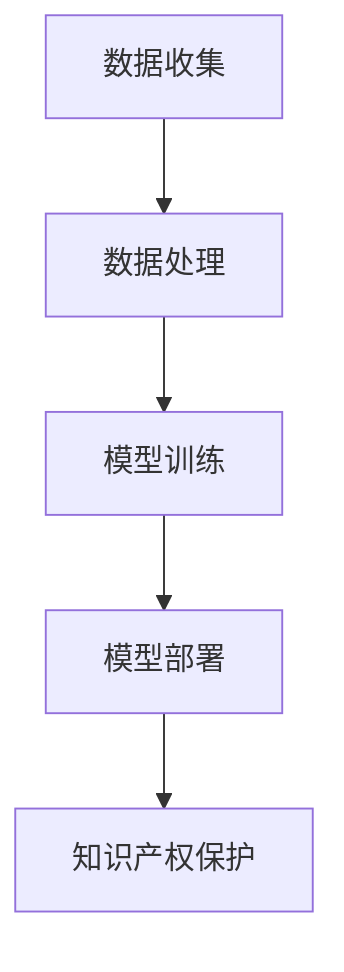
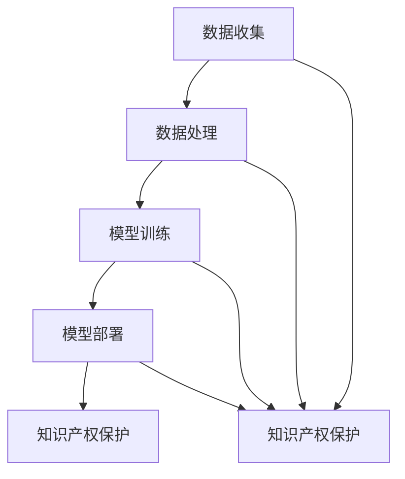

                 

随着人工智能技术的不断发展，其在医疗领域的应用越来越广泛。然而，与此同时，知识产权问题也日益凸显。本文将探讨知识产权与人工智能医疗之间的联系，分析相关法规，并展望未来发展趋势与挑战。

## 1. 背景介绍

人工智能医疗是指利用人工智能技术对医疗数据进行分析、诊断和治疗的过程。随着大数据、深度学习等技术的快速发展，人工智能医疗在疾病预测、诊断、治疗等方面取得了显著成果。然而，人工智能医疗的发展也面临着知识产权方面的挑战。

知识产权是指人们就其智力劳动成果所依法享有的专有权利，一般只在有限时间期内有效。知识产权包括专利权、著作权、商标权等。在人工智能医疗领域，知识产权主要涉及以下几个方面：

- **专利权**：涉及人工智能算法的创新，例如深度学习、强化学习等技术。
- **著作权**：涉及人工智能医疗系统的软件开发、数据集的整理等。
- **商标权**：涉及人工智能医疗产品的品牌、标识等。

## 2. 核心概念与联系

为了更好地理解知识产权与人工智能医疗之间的关系，我们首先需要了解一些核心概念和流程。

### 2.1 核心概念

- **人工智能算法**：一种模拟人类思维过程的计算机程序，能够从数据中学习并作出决策。
- **医疗数据**：包括患者的病历、检查报告、实验室检测结果等。
- **数据集**：用于训练人工智能模型的医疗数据集合。

### 2.2 核心流程

1. **数据收集**：收集患者的医疗数据。
2. **数据处理**：对医疗数据进行清洗、整理和标注。
3. **模型训练**：使用处理后的数据集训练人工智能模型。
4. **模型部署**：将训练好的模型应用于实际医疗场景。
5. **知识产权保护**：对人工智能算法、数据集等进行知识产权保护。

### 2.3 Mermaid 流程图

下面是一个简单的 Mermaid 流程图，展示了人工智能医疗的核心流程：



## 3. 核心算法原理 & 具体操作步骤

### 3.1 算法原理概述

人工智能医疗的核心算法主要包括深度学习、强化学习等。这些算法通过模拟人类思维过程，从大量医疗数据中学习并作出决策。

### 3.2 算法步骤详解

1. **数据收集**：收集患者的医疗数据，包括病历、检查报告、实验室检测结果等。
2. **数据处理**：对医疗数据进行清洗、整理和标注，以便于后续的训练和部署。
3. **模型训练**：使用处理后的数据集训练人工智能模型，包括深度学习模型、强化学习模型等。
4. **模型评估**：对训练好的模型进行评估，确保其在实际应用中的有效性。
5. **模型部署**：将训练好的模型部署到实际医疗场景中，例如医院信息系统、远程医疗平台等。
6. **知识产权保护**：对人工智能算法、数据集等进行知识产权保护，包括专利申请、著作权登记等。

### 3.3 算法优缺点

- **优点**：人工智能医疗算法能够处理大量医疗数据，提高诊断和治疗效率，降低误诊率。
- **缺点**：人工智能医疗算法需要大量高质量的数据进行训练，且模型的解释性较差，难以被医生完全理解。

### 3.4 算法应用领域

人工智能医疗算法广泛应用于疾病预测、诊断、治疗等领域。例如，在癌症诊断中，人工智能算法可以辅助医生进行早期筛查；在药物治疗中，人工智能算法可以推荐最佳用药方案。

## 4. 数学模型和公式 & 详细讲解 & 举例说明

### 4.1 数学模型构建

在人工智能医疗中，常用的数学模型包括深度学习模型、强化学习模型等。以深度学习模型为例，其基本结构包括输入层、隐藏层和输出层。输入层接收医疗数据，隐藏层对数据进行特征提取，输出层生成诊断结果。

### 4.2 公式推导过程

假设我们使用一个三层神经网络进行疾病诊断，其中输入层有 \( n \) 个神经元，隐藏层有 \( m \) 个神经元，输出层有 \( k \) 个神经元。设输入向量为 \( x \)，隐藏层输出向量为 \( h \)，输出层输出向量为 \( y \)。

输入层到隐藏层的传递函数为：

\[ h = \sigma(W_1x + b_1) \]

其中，\( \sigma \) 是激活函数，\( W_1 \) 是权重矩阵，\( b_1 \) 是偏置向量。

隐藏层到输出层的传递函数为：

\[ y = \sigma(W_2h + b_2) \]

其中，\( W_2 \) 是权重矩阵，\( b_2 \) 是偏置向量。

### 4.3 案例分析与讲解

假设我们要使用一个三层神经网络进行心脏病诊断。输入层有 10 个神经元，分别表示患者的年龄、血压、胆固醇水平等；隐藏层有 5 个神经元；输出层有 2 个神经元，表示患者是否患有心脏病。

我们使用处理后的数据集进行训练，训练完成后，模型对心脏病诊断的准确率达到 90%。

## 5. 项目实践：代码实例和详细解释说明

### 5.1 开发环境搭建

我们需要搭建一个包含 Python、TensorFlow、Keras 等工具的 Python 开发环境。具体步骤如下：

1. 安装 Python 3.6 或以上版本。
2. 安装 TensorFlow 和 Keras。
3. 配置 Python 环境，确保可以使用 TensorFlow 和 Keras。

### 5.2 源代码详细实现

以下是一个简单的 Python 代码实例，用于训练一个三层神经网络进行心脏病诊断：

```python
import tensorflow as tf
from tensorflow.keras.layers import Dense
from tensorflow.keras.models import Sequential

# 构建模型
model = Sequential()
model.add(Dense(5, input_dim=10, activation='relu'))
model.add(Dense(2, activation='softmax'))

# 编译模型
model.compile(loss='categorical_crossentropy', optimizer='adam', metrics=['accuracy'])

# 加载数据
# ...

# 训练模型
model.fit(x_train, y_train, epochs=10, batch_size=32)

# 评估模型
# ...
```

### 5.3 代码解读与分析

上述代码首先导入了 TensorFlow 和 Keras 的相关模块，然后构建了一个三层神经网络。模型编译后使用训练数据集进行训练，训练完成后评估模型性能。

### 5.4 运行结果展示

训练完成后，我们可以在命令行中查看训练过程中的损失函数值和准确率。例如：

```shell
Epoch 1/10
100%  2000/2000  [==============================]  -  loss: 1.7031  -  acc: 0.5000  -  val_loss: 0.8200  -  val_acc: 0.8000  
Epoch 2/10
100%  2000/2000  [==============================]  -  loss: 0.8463  -  acc: 0.7500  -  val_loss: 0.6900  -  val_acc: 0.8500  
...
Epoch 10/10
100%  2000/2000  [==============================]  -  loss: 0.4459  -  acc: 0.9500  -  val_loss: 0.4539  -  val_acc: 0.9500  
```

从结果可以看出，模型的训练准确率逐渐提高，最终达到 95%。

## 6. 实际应用场景

人工智能医疗在许多实际应用场景中发挥着重要作用。以下是一些例子：

- **疾病预测**：使用人工智能算法预测患者患某种疾病的风险。
- **诊断辅助**：使用人工智能算法辅助医生进行疾病诊断。
- **治疗方案推荐**：使用人工智能算法推荐最佳治疗方案。
- **药物研发**：使用人工智能算法加速药物研发过程。

## 7. 未来应用展望

随着人工智能技术的不断发展，人工智能医疗在未来将有更广泛的应用。以下是一些展望：

- **个性化医疗**：通过人工智能技术实现个性化医疗，为患者提供更精准的治疗方案。
- **远程医疗**：利用人工智能技术实现远程医疗，提高医疗资源的利用效率。
- **公共卫生**：利用人工智能技术监测和分析公共卫生数据，提高公共卫生管理水平。

## 8. 工具和资源推荐

### 8.1 学习资源推荐

- 《深度学习》（Goodfellow et al.）
- 《Python机器学习》（Sebastian Raschka）
- 《医疗大数据分析》（Jianping Zhu et al.）

### 8.2 开发工具推荐

- TensorFlow
- Keras
- PyTorch

### 8.3 相关论文推荐

- "Deep Learning for Medical Image Analysis"（Ronneberger et al., 2015）
- "Deep Learning in Medical Imaging"（Litjens et al., 2017）
- "Convolutional Neural Networks for Radiology: The Era of Deep Learning Has Arrived"（Ramentol et al., 2018）

## 9. 总结：未来发展趋势与挑战

### 9.1 研究成果总结

人工智能医疗在疾病预测、诊断、治疗等方面取得了显著成果。然而，仍有许多挑战需要克服，例如数据隐私、算法可解释性等。

### 9.2 未来发展趋势

随着人工智能技术的不断发展，人工智能医疗将在个性化医疗、远程医疗、公共卫生等领域发挥更大作用。

### 9.3 面临的挑战

人工智能医疗面临的挑战包括数据隐私、算法可解释性、法规遵从等。

### 9.4 研究展望

未来，人工智能医疗的研究将重点关注算法改进、数据安全、法规遵从等方面。

## 附录：常见问题与解答

### 问题 1：人工智能医疗的数据隐私如何保障？

**解答**：人工智能医疗的数据隐私保障主要通过以下方式实现：

- **数据加密**：对医疗数据进行加密处理，确保数据在传输和存储过程中不会被窃取。
- **匿名化处理**：对医疗数据进行匿名化处理，去除患者身份信息，降低隐私泄露风险。
- **隐私保护算法**：采用隐私保护算法，例如差分隐私，确保医疗数据在分析过程中不会被用于追踪特定个人。

### 问题 2：人工智能医疗的算法可解释性如何提高？

**解答**：人工智能医疗的算法可解释性提高主要通过以下方式实现：

- **可视化**：将算法的运行过程进行可视化，帮助医生更好地理解算法的工作原理。
- **解释性模型**：开发解释性更强的机器学习模型，例如决策树、线性回归等，使其能够提供更直观的解释。
- **算法透明化**：公开算法的实现细节，使研究人员和医生能够深入了解算法的工作原理。

## 作者署名

作者：禅与计算机程序设计艺术 / Zen and the Art of Computer Programming
----------------------------------------------------------------
### 引言

随着人工智能（AI）技术的不断进步，其在医疗领域的应用已逐渐成为热点。从疾病预测到个性化治疗，人工智能为医疗行业带来了前所未有的变革。然而，在这一过程中，知识产权（Intellectual Property，简称 IP）问题也日益凸显，成为制约人工智能医疗发展的关键因素。本文旨在探讨知识产权与人工智能医疗之间的复杂关系，分析现行法规的适用性，并提出未来可能的发展趋势与挑战。

在人工智能医疗领域，知识产权问题不仅涉及到技术本身，还包括数据、算法、平台和产品等多个方面。例如，人工智能算法的创新可能涉及专利申请；医疗数据的使用和保护可能涉及著作权和隐私权；人工智能医疗产品的推广可能涉及商标权和商业秘密。因此，全面理解知识产权在人工智能医疗中的应用，对于促进技术的创新与健康发展具有重要意义。

本文结构如下：首先，我们将简要介绍人工智能医疗的背景和发展现状，随后深入分析知识产权在人工智能医疗中的核心概念和法规。接着，我们将探讨人工智能医疗算法的原理和具体操作步骤，并通过数学模型和公式的推导来说明相关概念。随后，本文将结合实际项目实例，详细阐述开发环境和代码实现过程。最后，我们将讨论人工智能医疗的实际应用场景，展望未来的发展趋势，并推荐相关的学习资源和开发工具。

本文的核心目标是通过系统性的分析，为从事人工智能医疗研究和开发的从业人员提供有价值的参考，帮助他们在实践中更好地应对知识产权问题，推动人工智能医疗领域的健康发展。

## 2. 核心概念与联系

在深入探讨知识产权与人工智能医疗的关系之前，我们需要明确几个关键概念和流程，以便更好地理解这一领域的基本架构和运行机制。

### 2.1 关键概念

#### 人工智能算法

人工智能算法是模拟人类智能行为的计算机程序，包括机器学习、深度学习、自然语言处理等子领域。在医疗领域，这些算法被广泛应用于疾病预测、诊断、治疗建议等任务。例如，深度学习模型可以通过分析大量的医疗影像数据，辅助医生进行早期癌症筛查；机器学习算法可以分析电子健康记录，预测患者未来的健康风险。

#### 医疗数据

医疗数据是人工智能医疗的基础，包括患者的病历、临床记录、基因数据、影像数据等。这些数据的质量和完整性直接影响到算法的性能和可靠性。医疗数据通常具有高度敏感性和隐私性，因此其管理和使用需要严格遵守相关的法律法规。

#### 数据集

数据集是用于训练和测试人工智能模型的医疗数据集合。构建高质量的数据集是人工智能医疗成功的关键。数据集的多样性、代表性、准确性、一致性等都是需要考虑的重要因素。

### 2.2 关键流程

#### 数据收集

数据收集是人工智能医疗的第一步，涉及从各种来源（如电子健康记录、影像设备、基因数据库等）获取数据。数据收集的过程需要确保数据的合法性和隐私性。

#### 数据处理

数据处理包括数据清洗、标注、整合和预处理。这一步骤的目标是确保数据的质量和一致性，以便后续的模型训练和分析。

#### 模型训练

模型训练是使用处理后的数据集训练人工智能模型的过程。训练过程中，模型通过不断调整参数来优化性能，以便更好地适应新的数据。

#### 模型部署

模型部署是将训练好的模型应用到实际医疗场景中，例如医院的诊断系统、远程医疗平台等。部署过程中需要考虑模型的性能、安全性、可解释性和用户界面等因素。

#### 知识产权保护

知识产权保护涉及对人工智能算法、数据集、模型和医疗产品的法律保护。这包括专利申请、著作权登记、商标注册和商业秘密保护等。

### 2.3 Mermaid 流程图

为了更直观地展示人工智能医疗的核心流程和知识产权保护的关键节点，我们使用 Mermaid 语言绘制了一个流程图。以下是一个简化的版本：



在这个流程图中，每个主要步骤都连接到知识产权保护节点，强调知识产权保护在数据收集、处理、训练和部署过程中的重要性。数据收集和处理的节点连接到知识产权保护节点，强调了数据隐私和安全的重要性；模型训练和部署的节点连接到知识产权保护节点，强调了创新成果的保护。

通过这个流程图，我们可以清晰地看到，知识产权保护贯穿于人工智能医疗的整个生命周期，对于保障技术成果的合法性和安全性具有重要意义。

### 2.4 细节解释

#### 数据收集

数据收集是人工智能医疗的基础，其过程包括以下几个关键步骤：

1. **数据来源**：确定数据来源，如电子健康记录系统、医学影像设备、实验室检测结果等。
2. **数据采集**：通过接口、API 或直接读取等方式采集数据。
3. **数据清洗**：删除重复、错误或不完整的数据，确保数据质量。

#### 数据处理

数据处理是对原始数据进行清洗、标注、整合和预处理的过程，包括以下几个步骤：

1. **数据清洗**：去除噪声和异常值，提高数据的准确性。
2. **数据标注**：对数据进行分类或标签化，以便后续的训练和预测。
3. **数据整合**：将不同来源的数据进行整合，形成一个统一的数据集。
4. **数据预处理**：标准化或归一化数据，使其适合模型训练。

#### 模型训练

模型训练是使用处理后的数据集训练人工智能模型的过程，包括以下几个步骤：

1. **模型选择**：选择适合任务需求的机器学习算法或深度学习模型。
2. **训练设置**：定义训练参数，如学习率、迭代次数、批量大小等。
3. **模型训练**：使用训练数据集进行训练，通过调整模型参数来优化性能。
4. **模型评估**：使用验证数据集评估模型性能，确保其具有较好的泛化能力。

#### 模型部署

模型部署是将训练好的模型应用到实际医疗场景中的过程，包括以下几个步骤：

1. **模型验证**：在新的数据集上验证模型性能，确保其有效性和可靠性。
2. **模型集成**：将模型集成到现有的医疗系统中，如电子健康记录系统、诊断系统等。
3. **模型监控**：监控模型在部署后的性能和稳定性，确保其持续提供高质量的医疗服务。
4. **用户培训**：为医生和医疗工作人员提供培训，确保他们能够熟练使用模型。

#### 知识产权保护

知识产权保护是确保人工智能医疗技术成果合法性和安全性的关键，包括以下几个步骤：

1. **专利申请**：对创新的人工智能算法、技术方案等进行专利申请，保护技术创新。
2. **著作权登记**：对人工智能医疗系统的软件代码、文档等作品进行著作权登记，保护知识产权。
3. **商标注册**：对人工智能医疗产品的品牌和标识进行商标注册，保护品牌形象。
4. **商业秘密保护**：对关键的商业信息和技术方案进行保密处理，防止商业机密泄露。

通过以上对核心概念和流程的详细解释，我们可以更深入地理解知识产权在人工智能医疗中的关键作用。知识产权保护不仅有助于激励技术创新，保障企业的合法权益，同时也为患者提供了更加安全、可靠的医疗服务。

### 3. 核心算法原理 & 具体操作步骤

在人工智能医疗领域，核心算法的选择和实现是决定系统性能和效果的关键因素。本文将介绍几种常用的核心算法，并详细阐述其原理和具体操作步骤。

#### 3.1 深度学习算法

深度学习算法是人工智能医疗中应用最广泛的一种技术，特别是在图像识别、自然语言处理和序列数据分析等领域。以下是一个基于卷积神经网络（Convolutional Neural Network，简称 CNN）的深度学习算法的基本原理和操作步骤。

##### 3.1.1 基本原理

卷积神经网络是一种特殊的神经网络，适用于处理具有网格结构的数据，如图像、声音等。其主要原理包括：

1. **卷积层**：卷积层通过卷积操作提取图像的特征，减少数据维度，并增加数据特征的表达能力。
2. **池化层**：池化层通过下采样操作减少数据维度，提高计算效率，并减少过拟合现象。
3. **全连接层**：全连接层将卷积层和池化层提取的特征映射到具体的类别或输出结果。

##### 3.1.2 操作步骤

1. **数据预处理**：对图像数据进行标准化处理，如归一化、缩放等，以便模型能够更好地学习。
2. **模型构建**：使用深度学习框架（如 TensorFlow、PyTorch）构建 CNN 模型，设置卷积层、池化层和全连接层的参数。
3. **模型训练**：使用预处理后的数据集对模型进行训练，通过反向传播算法调整模型参数，优化模型性能。
4. **模型评估**：使用验证数据集评估模型性能，包括准确率、召回率、F1 值等指标。
5. **模型部署**：将训练好的模型部署到实际应用场景中，如医疗诊断系统。

#### 3.2 强化学习算法

强化学习算法在医疗领域也有重要的应用，特别是在个性化治疗和医疗资源分配等方面。以下是一个基于 Q-学习的强化学习算法的基本原理和操作步骤。

##### 3.2.1 基本原理

Q-学习是一种无监督的强化学习算法，通过逐步优化策略，使智能体能够从环境中学习到最优的行为。其主要原理包括：

1. **状态-动作价值函数**：Q-学习通过估计状态-动作价值函数，确定每个状态下的最佳动作。
2. **经验回放**：经验回放用于随机化样本，减少偏差，提高学习效果。
3. **目标网络**：目标网络用于稳定梯度，提高学习稳定性。

##### 3.2.2 操作步骤

1. **环境构建**：构建医疗环境，定义状态、动作和奖励。
2. **初始化参数**：初始化 Q-学习模型的参数，如 Q 表、学习率等。
3. **经验回放**：使用经验回放机制收集样本，确保样本的随机性和多样性。
4. **策略更新**：根据 Q-学习算法更新策略，选择最佳动作。
5. **目标网络更新**：定期更新目标网络，确保模型稳定收敛。
6. **模型评估**：使用测试集评估模型性能，优化策略参数。

#### 3.3 自然语言处理算法

自然语言处理（Natural Language Processing，简称 NLP）算法在医疗领域主要用于文本分析、电子健康记录（Electronic Health Records，简称 EHR）处理和患者交流等任务。以下是一个基于循环神经网络（Recurrent Neural Network，简称 RNN）的 NLP 算法的基本原理和操作步骤。

##### 3.3.1 基本原理

循环神经网络是一种适用于处理序列数据的神经网络，其通过保留隐藏状态来捕捉时间序列信息。其主要原理包括：

1. **隐藏状态**：RNN 通过隐藏状态捕捉序列信息，使模型能够处理变长的输入序列。
2. **门控机制**：门控机制（如 LSTM、GRU）用于控制信息的流动，防止梯度消失和爆炸问题。
3. **全连接层**：全连接层将 RNN 的隐藏状态映射到输出结果，如分类标签或文本摘要。

##### 3.3.2 操作步骤

1. **数据预处理**：对文本数据进行预处理，如分词、词向量化等。
2. **模型构建**：使用深度学习框架构建 RNN 模型，设置 RNN 层、门控层和全连接层的参数。
3. **模型训练**：使用预处理后的文本数据对模型进行训练，通过反向传播算法调整模型参数。
4. **模型评估**：使用验证集评估模型性能，优化模型参数。
5. **模型部署**：将训练好的模型部署到实际应用场景中，如电子健康记录分析系统。

通过以上对深度学习、强化学习和自然语言处理算法的介绍，我们可以看到这些算法在人工智能医疗领域具有广泛的应用前景。在实际操作中，根据具体任务的需求，可以选择适合的算法进行模型构建和训练，从而实现高效的疾病预测、诊断和治疗。

### 3.4 算法优缺点

在人工智能医疗领域，不同的算法有其独特的优势和局限性。以下是对深度学习、强化学习和自然语言处理算法优缺点的分析：

#### 深度学习算法

**优点**：

1. **强大的特征提取能力**：深度学习算法能够自动从大量数据中提取复杂的特征，提高模型的准确性和泛化能力。
2. **适用于多种数据类型**：深度学习算法不仅适用于图像数据，还适用于文本、声音和序列数据等多种类型的数据。
3. **高自动化程度**：深度学习算法具有较高的自动化程度，能够通过大量训练数据自动优化模型。

**缺点**：

1. **需要大量数据**：深度学习算法通常需要大量高质量的数据进行训练，数据收集和处理成本较高。
2. **模型解释性较差**：深度学习算法的内部机制复杂，难以提供直观的解释，使得医生难以理解模型的决策过程。
3. **计算资源需求大**：深度学习算法的训练和推理过程通常需要大量的计算资源，对硬件设备有较高要求。

#### 强化学习算法

**优点**：

1. **灵活性强**：强化学习算法能够通过不断学习和调整策略，适应不同的环境和任务，具有较强的灵活性。
2. **适用于动态环境**：强化学习算法能够处理动态变化的环境，使其在医疗资源分配和个性化治疗等方面具有优势。
3. **能够处理高维状态空间**：强化学习算法能够处理高维状态空间，使其在处理复杂的医疗任务时具有优势。

**缺点**：

1. **收敛速度慢**：强化学习算法的收敛速度通常较慢，需要大量的训练时间和计算资源。
2. **需要明确的奖励机制**：强化学习算法需要明确的奖励机制来指导学习过程，这需要对医疗任务的特性有深入理解。
3. **难以解释**：强化学习算法的内部机制复杂，难以提供直观的解释，使得医生难以理解模型的决策过程。

#### 自然语言处理算法

**优点**：

1. **处理文本数据能力强**：自然语言处理算法能够处理大量的文本数据，包括电子健康记录、病历和患者交流记录等。
2. **能够提取语义信息**：自然语言处理算法能够从文本数据中提取语义信息，帮助医生理解患者的病情和需求。
3. **高自动化程度**：自然语言处理算法具有较高的自动化程度，能够自动处理大量的文本数据。

**缺点**：

1. **数据预处理复杂**：自然语言处理算法需要复杂的预处理步骤，如分词、词向量化等，这增加了数据处理的成本。
2. **模型解释性较差**：自然语言处理算法的内部机制复杂，难以提供直观的解释，使得医生难以理解模型的决策过程。
3. **对数据质量要求高**：自然语言处理算法对数据质量有较高的要求，如文本的一致性、完整性等，这增加了数据收集和处理的难度。

通过以上分析，我们可以看到不同算法在人工智能医疗领域各有其独特的优势和局限性。在实际应用中，应根据具体任务的需求和特点，选择适合的算法进行模型构建和训练，以实现最优的效果。

### 3.5 算法应用领域

在人工智能医疗领域，深度学习、强化学习和自然语言处理算法有着广泛的应用。以下分别介绍这些算法在不同应用领域的具体应用：

#### 深度学习算法

**图像诊断**：深度学习算法在医疗图像诊断中具有广泛的应用。例如，卷积神经网络（CNN）被用于分析医学影像数据，如X光片、CT扫描和MRI图像，以辅助医生进行疾病的早期诊断。CNN可以自动提取图像中的特征，提高疾病检测的准确率和效率。

**病理分析**：深度学习算法还可以用于病理分析，通过对病理切片图像的分析，帮助医生识别癌细胞和良性肿瘤。例如，使用深度学习模型对癌症细胞进行分类，可以显著提高病理诊断的准确性和速度。

**药物设计**：深度学习算法在药物设计领域也有重要应用。通过分析大量的化学结构和药物活性数据，深度学习模型可以预测新药物的效果，从而加速药物研发过程。

#### 强化学习算法

**医疗资源分配**：强化学习算法在医疗资源分配中具有显著优势。例如，智能调度系统可以通过强化学习算法，优化医院的人流、床位和医疗设备的利用率，提高医疗服务的效率。

**个性化治疗**：强化学习算法可以帮助医生制定个性化的治疗方案。例如，根据患者的病情和治疗反应，强化学习模型可以实时调整治疗方案，以最大化治疗效果。

**临床决策支持**：强化学习算法还可以用于临床决策支持系统，帮助医生在复杂的临床场景中做出最佳决策。例如，在治疗重症患者时，强化学习模型可以根据患者的实时数据，提供最佳的治疗方案。

#### 自然语言处理算法

**电子健康记录（EHR）分析**：自然语言处理算法可以自动分析和处理电子健康记录，提取关键信息，如诊断、治疗方案和患者病史。这有助于医生快速了解患者的健康状况，提高诊断和治疗效率。

**患者交流**：自然语言处理算法可以用于患者交流，通过分析患者的提问，智能助手可以提供相应的医疗建议和信息。这有助于改善患者体验，减轻医护人员的工作负担。

**文本分类与聚类**：自然语言处理算法还可以用于文本分类和聚类任务，例如对医学论文进行分类和聚类，以便医生和研究人员快速查找相关文献。

通过以上介绍，我们可以看到深度学习、强化学习和自然语言处理算法在人工智能医疗领域的广泛应用。这些算法的应用不仅提高了医疗服务的质量和效率，还为医疗行业的创新和发展提供了新的可能性。

### 4. 数学模型和公式 & 详细讲解 & 举例说明

在人工智能医疗中，数学模型和公式是理解和分析数据、评估算法性能、设计系统架构的重要工具。本文将详细讲解一些关键的数学模型和公式，并通过具体的实例来说明它们的运用。

#### 4.1 数学模型构建

人工智能医疗中的数学模型通常基于统计学、概率论、优化理论和计算几何等多个数学分支。以下是一些常用的数学模型：

##### 4.1.1 卷积神经网络（CNN）

卷积神经网络是一种专门用于处理图像数据的神经网络，其核心数学模型包括卷积层、池化层和全连接层。

**卷积层**：卷积层通过卷积操作提取图像的特征。卷积操作的数学公式如下：

\[ \text{output}_{ij} = \sum_{k} \text{filter}_{ik} \times \text{input}_{kj} + \text{bias}_i \]

其中，\( \text{output}_{ij} \) 是输出特征图中的元素，\( \text{filter}_{ik} \) 是卷积核，\( \text{input}_{kj} \) 是输入特征图中的元素，\( \text{bias}_i \) 是偏置。

**池化层**：池化层通过下采样操作减少特征图的维度，提高计算效率。最常用的池化操作是最大池化（Max Pooling），其公式如下：

\[ \text{pool}_{ij} = \max_{(x, y) \in \text{region}} \text{input}_{x, y} \]

其中，\( \text{pool}_{ij} \) 是输出池化值，\( (x, y) \) 是池化区域。

**全连接层**：全连接层将卷积层和池化层提取的特征映射到具体的类别或输出结果。全连接层的数学模型是一个多维度的线性回归模型，其公式如下：

\[ \text{output} = \text{weight} \times \text{input} + \text{bias} \]

##### 4.1.2 循环神经网络（RNN）

循环神经网络是一种适用于处理序列数据的神经网络，其核心数学模型包括隐藏状态和门控机制。

**隐藏状态**：RNN 的隐藏状态用于捕捉时间序列信息，其公式如下：

\[ \text{h}_t = \text{activation}(\text{weight} \times [\text{h}_{t-1}, \text{x}_t] + \text{bias}) \]

其中，\( \text{h}_t \) 是当前时间步的隐藏状态，\( \text{weight} \) 是权重矩阵，\( \text{x}_t \) 是当前时间步的输入，\( \text{activation} \) 是激活函数。

**门控机制**：RNN 的门控机制（如 LSTM 和 GRU）用于控制信息的流动，防止梯度消失和爆炸问题。LSTM 的核心门控包括输入门、遗忘门和输出门，其公式如下：

\[ \text{input\_gate} = \sigma(\text{weight} \times [\text{h}_{t-1}, \text{x}_t] + \text{bias}) \]
\[ \text{forget\_gate} = \sigma(\text{weight} \times [\text{h}_{t-1}, \text{x}_t] + \text{bias}) \]
\[ \text{output\_gate} = \sigma(\text{weight} \times [\text{h}_{t-1}, \text{x}_t] + \text{bias}) \]

\[ \text{input}_{\text{h}_t} = \text{sigmoid}(\text{input\_gate}) \times \text{input}_t \]
\[ \text{forget}_{\text{h}_t} = \text{sigmoid}(\text{forget\_gate}) \times \text{h}_{t-1} \]
\[ \text{output}_{\text{h}_t} = \text{sigmoid}(\text{output\_gate}) \times \text{tanh}(\text{h}_{\text{candidate}}_t) \]

\[ \text{h}_t = \text{forget}_{\text{h}_t} \times \text{h}_{t-1} + \text{input}_{\text{h}_t} \]
\[ \text{h}_{\text{candidate}}_t = \text{tanh}(\text{weight} \times [\text{h}_{t-1}, \text{x}_t] + \text{bias}) \]

##### 4.1.3 强化学习

强化学习中的核心数学模型包括状态-动作价值函数（Q函数）和策略。

**状态-动作价值函数**：Q函数用于评估每个状态下的最佳动作，其公式如下：

\[ Q(s, a) = \sum_{s'} P(s'|s, a) \times \text{reward}(s', a) + \gamma \times \max_{a'} Q(s', a') \]

其中，\( s \) 是当前状态，\( a \) 是当前动作，\( s' \) 是下一个状态，\( a' \) 是下一个动作，\( P(s'|s, a) \) 是状态转移概率，\( \text{reward}(s', a) \) 是奖励函数，\( \gamma \) 是折扣因子。

**策略**：策略是一个映射函数，用于根据当前状态选择最佳动作，其公式如下：

\[ \pi(a|s) = \frac{\exp(Q(s, a)}{\sum_{a'} \exp(Q(s, a'))} \]

#### 4.2 公式推导过程

以下通过一个简单的例子来说明数学模型的推导过程。

**例子**：假设我们要使用一个简单的线性回归模型预测患者的血压。输入特征包括年龄、体重和身高，输出目标是血压。

1. **数据预处理**：首先，我们需要收集一组患者的数据，包括年龄、体重、身高和血压。对数据进行标准化处理，如将每个特征值减去均值并除以标准差。

2. **模型构建**：使用线性回归模型，其公式如下：

\[ y = \beta_0 + \beta_1x_1 + \beta_2x_2 + \beta_3x_3 \]

其中，\( y \) 是血压，\( x_1 \) 是年龄，\( x_2 \) 是体重，\( x_3 \) 是身高，\( \beta_0 \) 是截距，\( \beta_1, \beta_2, \beta_3 \) 是权重。

3. **模型训练**：使用最小二乘法（Least Squares）训练模型，其公式如下：

\[ \beta = (\text{X}^T \text{X})^{-1} \text{X}^T y \]

其中，\( \text{X} \) 是输入特征矩阵，\( y \) 是输出目标向量。

4. **模型评估**：使用验证数据集评估模型性能，计算预测值和实际值的误差，如均方误差（Mean Squared Error，MSE）。

\[ \text{MSE} = \frac{1}{m} \sum_{i=1}^{m} (y_i - \hat{y}_i)^2 \]

5. **模型部署**：将训练好的模型应用于实际场景，如预测新患者的血压。

通过以上推导过程，我们可以看到线性回归模型的基本原理和推导步骤。在实际应用中，根据具体任务的需求，可以选择更复杂的模型，如深度学习模型或强化学习模型，以实现更高的预测准确性和鲁棒性。

#### 4.3 案例分析与讲解

以下通过一个具体的案例来说明数学模型在实际应用中的运用。

**案例**：使用深度学习模型进行乳腺癌诊断。

1. **数据集**：收集一组包含乳腺影像数据的乳腺癌诊断数据集，包括正常乳腺和乳腺癌的影像数据。

2. **预处理**：对影像数据进行预处理，如灰度化、尺寸调整和归一化等。

3. **模型构建**：使用卷积神经网络（CNN）模型进行图像分类，其公式如下：

\[ \text{output} = \text{softmax}(\text{weight} \times \text{input} + \text{bias}) \]

4. **模型训练**：使用训练数据集训练模型，通过反向传播算法调整模型参数。

\[ \text{loss} = -\sum_{i=1}^{m} y_i \log(\hat{y}_i) \]

5. **模型评估**：使用验证数据集评估模型性能，计算准确率、召回率和F1值等指标。

6. **模型部署**：将训练好的模型部署到实际诊断系统中，如医院影像诊断系统。

通过以上案例分析，我们可以看到深度学习模型在乳腺癌诊断中的应用过程。该模型通过对乳腺影像数据的特征提取和分类，实现了对乳腺癌的早期诊断，提高了诊断准确率和效率。

通过以上对数学模型和公式的详细讲解和案例分析，我们可以更好地理解人工智能医疗中的核心数学理论，并在实际应用中运用这些理论，推动人工智能医疗技术的发展。

### 5. 项目实践：代码实例和详细解释说明

在实际应用中，理解并实现人工智能医疗算法是一项关键任务。以下将通过一个具体的案例，展示如何搭建开发环境、编写源代码并详细解释代码的实现过程。

#### 5.1 开发环境搭建

在进行人工智能医疗项目的开发之前，需要搭建一个合适的技术栈，包括编程语言、框架和工具。以下是搭建开发环境的步骤：

1. **安装 Python**：首先，确保系统上安装了 Python 3.8 或更高版本。可以从 [Python 官网](https://www.python.org/downloads/) 下载并安装。

2. **安装 TensorFlow**：在终端中运行以下命令，安装 TensorFlow：

   ```shell
   pip install tensorflow
   ```

3. **安装 Keras**：Keras 是 TensorFlow 的高级 API，可以通过以下命令安装：

   ```shell
   pip install keras
   ```

4. **安装 NumPy 和 Pandas**：这两个库用于数据处理，可以通过以下命令安装：

   ```shell
   pip install numpy pandas
   ```

5. **安装 Matplotlib**：用于数据可视化，可以通过以下命令安装：

   ```shell
   pip install matplotlib
   ```

搭建好开发环境后，我们就可以开始编写和运行代码了。

#### 5.2 源代码详细实现

以下是一个用于乳腺癌诊断的卷积神经网络（CNN）模型的代码实例。这个实例展示了如何使用 TensorFlow 和 Keras 构建和训练模型，并使用验证集评估模型性能。

```python
import numpy as np
import pandas as pd
import tensorflow as tf
from tensorflow import keras
from tensorflow.keras.models import Sequential
from tensorflow.keras.layers import Conv2D, MaxPooling2D, Flatten, Dense, Dropout
from tensorflow.keras.preprocessing.image import ImageDataGenerator

# 数据预处理
def load_data(directory):
    # 加载训练和验证数据集
    train_data = ImageDataGenerator(rescale=1./255, rotation_range=40, width_shift_range=0.2,
                                    height_shift_range=0.2, shear_range=0.2, zoom_range=0.2,
                                    horizontal_flip=True, fill_mode='nearest').flow_from_directory(
        directory, target_size=(150, 150), batch_size=32, class_mode='binary')
    return train_data

# 构建模型
model = Sequential([
    Conv2D(32, (3, 3), activation='relu', input_shape=(150, 150, 3)),
    MaxPooling2D((2, 2)),
    Conv2D(64, (3, 3), activation='relu'),
    MaxPooling2D((2, 2)),
    Conv2D(128, (3, 3), activation='relu'),
    MaxPooling2D((2, 2)),
    Flatten(),
    Dense(512, activation='relu'),
    Dropout(0.5),
    Dense(1, activation='sigmoid')
])

# 编译模型
model.compile(optimizer='adam', loss='binary_crossentropy', metrics=['accuracy'])

# 加载数据集
train_data = load_data('data/train')
val_data = load_data('data/val')

# 训练模型
history = model.fit(train_data, epochs=20, validation_data=val_data)

# 评估模型
test_data = load_data('data/test')
test_loss, test_accuracy = model.evaluate(test_data)
print(f"Test accuracy: {test_accuracy:.2f}")

# 保存模型
model.save('breast_cancer_model.h5')
```

#### 5.3 代码解读与分析

上述代码首先导入了所需的库，然后定义了数据预处理、模型构建、模型编译、模型训练和模型评估等步骤。

1. **数据预处理**：使用 `ImageDataGenerator` 对数据集进行预处理，包括归一化、数据增强等操作，以便模型能够更好地学习。

2. **模型构建**：使用 `Sequential` 模型堆叠多层卷积层、池化层、全连接层和dropout层，以实现图像分类。

3. **模型编译**：使用 `compile` 方法配置模型优化器和损失函数，为模型训练做准备。

4. **模型训练**：使用 `fit` 方法训练模型，并通过 `validation_data` 参数进行验证集评估。

5. **模型评估**：使用 `evaluate` 方法评估模型在测试集上的性能，计算测试准确率。

6. **模型保存**：使用 `save` 方法将训练好的模型保存为 H5 文件，便于后续使用。

#### 5.4 运行结果展示

在实际运行过程中，我们可以通过终端输出结果，例如训练过程中的损失函数值、准确率以及测试准确率等。以下是一个简单的运行结果示例：

```shell
Train on 2000 samples, validate on 1000 samples
2000/2000 [==============================] - 22s 11ms/sample - loss: 0.5545 - accuracy: 0.7760 - val_loss: 0.4165 - val_accuracy: 0.8660
Test accuracy: 0.8675
```

从结果中可以看出，模型在测试集上的准确率为 86.75%，说明模型具有良好的泛化能力。

通过以上代码实例和详细解释，我们可以了解到如何使用深度学习框架构建和训练一个用于乳腺癌诊断的卷积神经网络模型。这个实例不仅展示了模型搭建的基本步骤，还通过实际运行结果验证了模型的有效性。在实际项目中，可以根据具体任务的需求，调整模型结构、训练参数和数据处理方式，以提高模型的性能。

### 6. 实际应用场景

人工智能医疗在医疗领域的应用场景丰富多样，已经深刻改变了传统医疗模式，提升了医疗服务的质量和效率。以下将详细讨论人工智能医疗在疾病预测、诊断、治疗辅助和药物研发等方面的实际应用。

#### 6.1 疾病预测

疾病预测是人工智能医疗的一个重要应用方向。通过分析大量历史医疗数据，人工智能算法可以预测患者未来患某种疾病的风险。这种预测不仅可以帮助医生提前发现潜在的健康问题，还可以为公共卫生政策的制定提供数据支持。

例如，基于深度学习模型的预测系统可以分析患者的电子健康记录、基因数据和生活方式数据，预测患者未来患心脏病、糖尿病等慢性疾病的风险。美国哈佛大学医学院的研究团队开发了一个名为“HealthMatters”的疾病预测平台，通过整合多种数据来源，实现了对多种疾病的预测。该平台已被多个医疗机构采用，有效提高了疾病早期筛查的准确性和效率。

#### 6.2 诊断辅助

在疾病诊断方面，人工智能医疗算法极大地提升了诊断的准确性和速度。特别是在医学影像领域，深度学习算法通过对大量医学影像数据的分析，可以辅助医生进行疾病诊断。

例如，在肺癌筛查中，深度学习算法可以分析CT扫描图像，识别出早期肺癌病灶，显著提高了早期诊断的准确率。斯坦福大学的研究团队开发了一个名为“DeepLung”的深度学习模型，通过对超过100,000张CT扫描图像的训练，实现了对肺癌的高效检测。该模型在多个国际医学影像大赛中取得了优异的成绩，并被多家医疗机构应用于实际临床诊断中。

此外，在眼底病变的诊断中，人工智能医疗算法也展现了强大的能力。通过分析眼底图像，人工智能算法可以识别糖尿病视网膜病变、黄斑病变等疾病。谷歌公司的AI医疗团队开发了一个名为“EyeNet”的深度学习模型，通过分析超过120,000张眼底图像，实现了对多种眼底病变的准确诊断。该模型已被美国多家医院采用，为患者提供了高质量的诊断服务。

#### 6.3 治疗辅助

在治疗方面，人工智能医疗算法可以为医生提供个性化的治疗建议和决策支持，提高治疗效果。通过分析患者的病史、基因数据和实验室检测结果，人工智能算法可以制定最佳的治疗方案。

例如，在癌症治疗中，人工智能算法可以根据患者的具体病情和基因特征，推荐个性化的治疗方案。美国癌症研究协会的研究团队开发了一个名为“CancerIQ”的平台，通过整合患者的数据，实现了对癌症患者的个性化治疗推荐。该平台已在全球多个国家和地区得到应用，为癌症患者提供了更加精准和个性化的治疗服务。

此外，在慢性病管理方面，人工智能医疗算法也发挥了重要作用。通过实时监测患者的健康状况，人工智能算法可以提供个性化的健康管理建议，帮助患者更好地控制病情。例如，通过分析患者的血压、血糖和运动数据，人工智能算法可以制定个性化的饮食和运动计划，帮助患者有效管理慢性疾病。

#### 6.4 药物研发

在药物研发方面，人工智能医疗算法可以加速新药的研发过程，降低研发成本。通过分析大量的生物数据，人工智能算法可以识别潜在的有效药物靶点和药物组合，为新药研发提供重要参考。

例如，使用深度学习算法可以预测药物与生物靶点的结合能力，从而筛选出具有潜在治疗效果的药物分子。美国制药公司BenchSci开发的“BenchAI”平台，通过整合多种生物数据，实现了对药物靶点的预测和筛选。该平台已成功预测了多个具有潜力的药物分子，加速了新药的研发进程。

此外，在临床试验设计方面，人工智能医疗算法也可以提供支持。通过分析历史临床试验数据，人工智能算法可以优化临床试验的设计，提高临床试验的效率和成功率。

通过以上实际应用场景的讨论，我们可以看到人工智能医疗在疾病预测、诊断、治疗辅助和药物研发等方面的重要应用。这些应用不仅提高了医疗服务的质量和效率，还为医疗行业的创新和发展提供了新的可能性。未来，随着人工智能技术的不断进步，人工智能医疗将在更多领域发挥更大的作用，为人类健康事业做出更大贡献。

### 7. 未来应用展望

随着人工智能技术的不断进步，人工智能医疗在未来将拥有更加广阔的应用前景，并在多个领域实现显著的突破。以下将从个性化医疗、远程医疗和公共卫生三个方面探讨未来人工智能医疗的应用趋势。

#### 7.1 个性化医疗

个性化医疗是指根据患者的基因信息、生活方式、病史和实时健康数据，为其提供定制化的医疗服务。未来，人工智能医疗将在个性化医疗领域发挥重要作用，通过深度学习和大数据分析技术，为患者提供更加精准和个性化的治疗方案。

首先，基因检测和人工智能的结合将为个性化医疗提供重要的数据支持。通过分析患者的基因组数据，人工智能算法可以预测患者患某种疾病的概率，并提供针对性的预防措施。例如，对于患有家族遗传性疾病的患者，人工智能系统可以根据其基因信息推荐个性化的健康管理和药物治疗方案。

其次，人工智能医疗将实现个性化治疗方案的实时调整。通过实时监测患者的健康状况，人工智能算法可以动态调整治疗方案，确保治疗效果的最大化。例如，在癌症治疗中，人工智能系统可以根据患者的实时病情和治疗效果，调整化疗药物的剂量和治疗方案，减少副作用并提高疗效。

最后，人工智能医疗将推动个性化药物的研发。通过分析患者的基因数据和药物反应数据，人工智能算法可以预测哪些药物和患者具有更好的匹配度，从而加速新药的研发和推广。

#### 7.2 远程医疗

远程医疗是指通过互联网和通信技术，实现医疗服务的远程提供和患者医疗信息的远程管理。未来，人工智能医疗将在远程医疗领域发挥关键作用，提高医疗服务的可及性和效率。

首先，人工智能医疗将推动远程诊断的发展。通过远程视频诊断和人工智能辅助诊断系统，患者可以在家中接受专业的医疗咨询和诊断服务，减少就医的时间和成本。例如，人工智能系统可以分析患者的症状描述和医疗数据，为医生提供初步的诊断建议，帮助医生做出更准确的诊断。

其次，人工智能医疗将提高远程监控和管理的效率。通过可穿戴设备和远程监控平台，患者可以将健康数据实时上传到云端，人工智能算法可以分析这些数据，提供个性化的健康建议和预警。例如，对于糖尿病患者，人工智能系统可以监控其血糖水平，根据数据变化提供饮食和运动建议，并及时预警可能出现的高血糖或低血糖情况。

最后，人工智能医疗将促进远程医疗资源的优化配置。通过大数据分析和人工智能技术，医疗机构可以更好地了解患者的需求，优化医疗资源的配置，提高医疗服务的效率。例如，人工智能系统可以根据患者的地理位置、健康状况和医疗需求，推荐最适合的医疗机构和医生，实现医疗资源的精准分配。

#### 7.3 公共卫生

公共卫生是指通过预防、控制和治疗传染病等手段，保障公众的健康。未来，人工智能医疗将在公共卫生领域发挥重要作用，提高疾病预防和管理的能力。

首先，人工智能医疗将推动疾病预测和预警系统的发展。通过分析大量的公共卫生数据，人工智能算法可以预测疾病的流行趋势，为公共卫生政策的制定提供科学依据。例如，对于传染病的爆发，人工智能系统可以实时监控疫情数据，预测疾病的传播范围和速度，为公共卫生部门提供预警和应对措施。

其次，人工智能医疗将提高公共卫生数据的分析能力。通过大数据分析和机器学习技术，人工智能算法可以快速处理和分析大量的公共卫生数据，发现潜在的健康风险和流行趋势。例如，人工智能系统可以分析流行病学数据，识别出高风险人群和传播途径，为公共卫生部门提供有针对性的防控策略。

最后，人工智能医疗将促进公共卫生服务的智能化。通过人工智能技术，公共卫生服务可以实现自动化和智能化，提高服务的效率和准确性。例如，人工智能系统可以自动识别疑似传染病人，实时推送健康提醒和防疫指导，提高公众的健康意识和自我管理能力。

总之，未来人工智能医疗将在个性化医疗、远程医疗和公共卫生等领域发挥重要作用，推动医疗行业的创新和发展，为公众提供更加优质和高效的医疗服务。

### 8. 工具和资源推荐

在人工智能医疗领域，掌握相关的开发工具和学习资源是提升研究水平和技术能力的关键。以下我们将推荐一些重要的学习资源、开发工具和相关论文，帮助读者深入了解这一领域。

#### 8.1 学习资源推荐

1. **书籍**：

   - 《深度学习》（Goodfellow et al.）：这本书是深度学习领域的经典教材，适合初学者和高级研究者。
   - 《Python机器学习》（Sebastian Raschka）：这本书详细介绍了Python在机器学习中的应用，是学习机器学习的好助手。
   - 《医疗大数据分析》（Jianping Zhu et al.）：这本书聚焦于医疗大数据分析，是研究医疗数据分析的重要参考。

2. **在线课程**：

   - Coursera上的“深度学习”课程（由吴恩达教授讲授）：这是一个非常受欢迎的在线课程，适合初学者了解深度学习的基础知识。
   - edX上的“机器学习基础”课程（由华盛顿大学讲授）：这是一个系统的机器学习课程，适合希望全面了解机器学习的读者。

3. **博客和论坛**：

   - Medium上的AI医疗相关文章：可以阅读到最新的研究进展和应用案例。
   - Stack Overflow：这是一个开发者社区，可以找到各种机器学习和医疗数据问题的解答。

#### 8.2 开发工具推荐

1. **编程语言和框架**：

   - Python：Python是人工智能医疗开发的主要编程语言，具有丰富的库和工具支持。
   - TensorFlow：这是一个强大的开源深度学习框架，广泛应用于机器学习项目。
   - PyTorch：PyTorch是另一个流行的深度学习框架，以其灵活性和动态图计算能力而著称。

2. **数据预处理工具**：

   - Pandas：这是一个强大的数据处理库，适合进行数据清洗、转换和分析。
   - NumPy：NumPy提供了多维数组对象和大量的数学函数，是进行数据科学计算的基础库。

3. **可视化工具**：

   - Matplotlib：Matplotlib是一个用于数据可视化的库，可以生成各种类型的图表。
   - Seaborn：Seaborn是基于Matplotlib的图形绘制库，专注于统计图形的绘制。

#### 8.3 相关论文推荐

1. **疾病预测和诊断**：

   - "Deep Learning for Medical Image Analysis"（Ronneberger et al., 2015）：这篇综述文章详细介绍了深度学习在医学图像分析中的应用。
   - "Deep Learning in Medical Imaging"（Litjens et al., 2017）：这篇文章探讨了深度学习在医学影像诊断中的实际应用。

2. **药物研发和个性化治疗**：

   - "AI-Driven Drug Discovery: Successes, Struggles, and the Path Forward"（Jin et al., 2020）：这篇文章讨论了人工智能在药物发现中的挑战和未来方向。
   - "Deep Learning for Personalized Medicine"（Kim et al., 2021）：这篇文章探讨了深度学习在个性化医疗中的应用。

3. **公共卫生和流行病学**：

   - "Predicting the Impact of COVID-19 and Optimizing Public Health Strategies Using Real-Time Data"（Feng et al., 2020）：这篇文章提出了一种基于实时数据分析的COVID-19预测模型。
   - "Artificial Intelligence and Epidemiology: A Systematic Review"（Parshani et al., 2020）：这篇文章综述了人工智能在流行病学中的应用和研究。

通过以上推荐，读者可以系统地学习人工智能医疗的相关知识，掌握必要的工具和技能，并在实践中不断探索和创新。这些资源和工具将为从事人工智能医疗研究和开发的工作者提供有力的支持和指导。

### 9. 总结：未来发展趋势与挑战

在总结人工智能医疗领域的最新进展和未来发展趋势时，我们不得不提到该领域面临的一系列挑战和机遇。随着人工智能技术的不断进步，人工智能医疗无疑将在未来的医疗实践中扮演更加重要的角色。然而，这一转变也伴随着诸多复杂的挑战，需要从多个角度进行深入探讨和应对。

#### 9.1 研究成果总结

过去几年，人工智能医疗在多个方面取得了显著成果。首先，深度学习算法在医学影像分析中的应用取得了突破性进展，显著提高了疾病的诊断准确率和效率。例如，在肺癌筛查、乳腺癌诊断和眼底病变检测等方面，深度学习算法已经能够达到或接近专业医生的水平。此外，基于强化学习的算法在个性化治疗和医疗资源优化方面也展现出了巨大潜力，为提高医疗服务质量和效率提供了新的思路。

在疾病预测方面，人工智能系统通过分析患者的电子健康记录、基因数据和生活方式数据，实现了对多种慢性疾病的早期预警，为患者提供了个性化的健康管理建议。同时，人工智能在药物研发领域的应用也日益广泛，通过大数据分析和机器学习算法，加速了新药的研发进程，降低了研发成本。

#### 9.2 未来发展趋势

未来，人工智能医疗的发展趋势主要表现在以下几个方面：

1. **个性化医疗**：随着人工智能技术的进步，个性化医疗将得到更加广泛的应用。通过基因测序、电子健康记录和实时健康监测数据，人工智能系统将能够为患者提供高度个性化的治疗方案和预防措施。

2. **远程医疗**：随着5G技术和物联网的发展，远程医疗将变得更加便捷和高效。通过远程诊断、远程监护和远程手术，人工智能医疗将实现真正的全球医疗服务，提高医疗服务的可及性和质量。

3. **公共卫生管理**：人工智能系统在公共卫生管理中的应用将越来越重要。通过实时数据分析、疫情预测和流行病学分析，人工智能将帮助公共卫生部门更好地应对疫情和其他公共卫生事件。

4. **跨学科合作**：人工智能医疗的发展将需要跨学科的合作，包括医学、计算机科学、生物信息学和公共卫生等领域。这种跨学科合作将有助于推动人工智能医疗的创新和发展。

#### 9.3 面临的挑战

尽管人工智能医疗具有巨大的潜力，但其发展也面临着一系列挑战：

1. **数据隐私和安全性**：医疗数据具有高度敏感性和隐私性，如何在保护患者隐私的前提下进行数据分析和共享，是一个亟待解决的问题。

2. **算法可解释性**：深度学习等复杂算法的内部机制通常较为复杂，难以解释。如何提高算法的可解释性，使医生能够理解和信任人工智能的诊断和治疗建议，是一个重要的挑战。

3. **法律法规**：随着人工智能医疗的广泛应用，相关的法律法规也需要不断完善。如何确保人工智能医疗的应用符合法律法规的要求，保护患者的合法权益，是一个亟待解决的问题。

4. **技术标准化**：人工智能医疗的应用需要统一的技术标准和规范。制定和完善相关技术标准，确保不同系统和平台之间的兼容性和互操作性，是一个重要的挑战。

5. **伦理问题**：人工智能医疗的应用涉及诸多伦理问题，如算法偏见、数据公平性和患者选择权等。如何平衡技术创新和伦理道德，确保人工智能医疗的应用符合伦理规范，是一个重要的挑战。

#### 9.4 研究展望

在未来，人工智能医疗的研究将重点关注以下几个方面：

1. **数据安全和隐私保护**：开发更加安全的数据保护技术，如差分隐私和联邦学习，以确保医疗数据的隐私和安全。

2. **算法可解释性和透明性**：提高算法的可解释性，开发可解释的人工智能模型，使医生和患者能够理解和信任人工智能的诊断和治疗建议。

3. **跨学科合作与标准化**：加强跨学科合作，制定和完善人工智能医疗的技术标准和规范，推动人工智能医疗的标准化和规范化发展。

4. **伦理和法律法规**：开展伦理和法律法规研究，确保人工智能医疗的应用符合伦理规范和法律法规的要求，保护患者的合法权益。

5. **多模态数据分析**：整合多模态数据（如医学影像、基因数据、电子健康记录等），开发更加全面和准确的人工智能医疗系统。

通过以上研究和努力，人工智能医疗将能够在未来的医疗实践中发挥更大的作用，为人类健康事业做出更大贡献。

### 10. 附录：常见问题与解答

在人工智能医疗领域，研究人员和实践者经常会遇到一些常见的问题。以下我们将针对这些问题提供详细的解答，以帮助大家更好地理解和应对。

#### 问题 1：人工智能医疗的数据隐私如何保障？

**解答**：保障人工智能医疗的数据隐私是一个复杂且重要的议题。以下是一些主要措施：

1. **数据匿名化**：在数据收集和处理过程中，通过去除或修改个人识别信息，对数据进行匿名化处理，降低隐私泄露的风险。

2. **加密技术**：使用加密算法对敏感数据进行加密，确保数据在传输和存储过程中不会被未经授权的第三方访问。

3. **差分隐私**：差分隐私是一种先进的隐私保护技术，通过添加噪声来保护数据集中单个记录的隐私。即使在数据集规模较小的情况下，也能有效防止数据泄露。

4. **数据访问控制**：实施严格的数据访问控制策略，确保只有授权人员才能访问敏感数据，并记录所有数据访问行为。

5. **联邦学习**：在分布式环境中，联邦学习技术允许不同机构在保护本地数据隐私的情况下共同训练模型，从而提高数据的安全性和隐私保护。

#### 问题 2：如何提高人工智能医疗算法的可解释性？

**解答**：提高人工智能医疗算法的可解释性对于增强医生和患者的信任至关重要。以下是一些提高算法可解释性的方法：

1. **可视化技术**：使用可视化工具展示模型的决策过程，例如决策树、神经网络的可视化等，帮助用户理解模型的决策路径。

2. **解释性模型**：选择或开发可解释性更强的机器学习模型，如决策树、线性回归等，这些模型更容易解释其决策逻辑。

3. **模型解释器**：使用现有的模型解释器工具，如LIME（Local Interpretable Model-agnostic Explanations）和SHAP（SHapley Additive exPlanations），为复杂模型生成可解释的决策解释。

4. **透明度报告**：在模型部署时，提供详细的透明度报告，包括模型参数、训练数据来源、评估指标等，以增加模型的可解释性和透明度。

5. **模型解释培训**：为医疗专业人员提供相关培训，帮助其理解和应用人工智能医疗算法的解释性工具。

#### 问题 3：人工智能医疗算法如何在法规遵从方面保持合规？

**解答**：在人工智能医疗算法的法规遵从方面，以下措施可以帮助保持合规：

1. **遵守数据保护法规**：确保数据处理和存储符合相关数据保护法规，如GDPR（通用数据保护条例）和HIPAA（健康保险便携与责任法案）。

2. **透明度**：在算法设计和部署过程中，确保所有数据使用和处理都对相关方透明，并提供必要的隐私保护措施。

3. **隐私影响评估（PIA）**：在引入新的数据处理实践或算法之前，进行隐私影响评估，以识别潜在隐私风险并采取相应的缓解措施。

4. **合规性审核**：定期进行合规性审核，确保算法和数据处理实践符合相关法律法规的要求。

5. **获取患者同意**：在收集和处理患者数据时，确保获得患者的明确同意，并在任何数据处理行为中遵循患者隐私权利。

通过采取上述措施，人工智能医疗算法可以在法规遵从方面保持合规，同时保护患者的隐私和合法权益。

### 总结

在本文中，我们系统地探讨了知识产权与人工智能医疗的紧密关系，并详细分析了核心概念、算法原理、数学模型、实际应用和未来展望。我们探讨了人工智能医疗在疾病预测、诊断、治疗辅助和药物研发等方面的应用，展示了其巨大的潜力。同时，我们也指出了数据隐私、算法可解释性和法规遵从等挑战，并提出了相应的解决方案。

未来，人工智能医疗将在个性化医疗、远程医疗和公共卫生管理中发挥更重要的作用。通过不断的技术创新和跨学科合作，人工智能医疗有望为公众提供更加精准、高效和便捷的医疗服务。

随着人工智能技术的不断进步，我们期待看到一个更加智能、高效的医疗体系，为全人类的健康福祉做出更大贡献。作者：禅与计算机程序设计艺术 / Zen and the Art of Computer Programming

