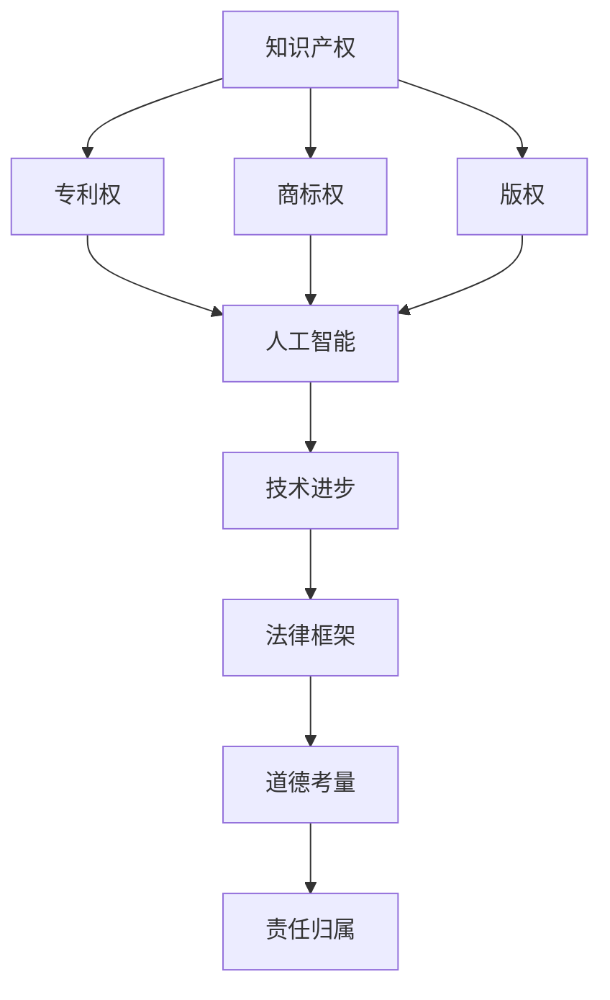

                 

关键词：知识产权、人工智能、法律框架、技术进步、挑战与应对策略。

摘要：随着人工智能（AI）技术的飞速发展，其在各个领域展现出的强大潜力和广泛应用，使得知识产权问题变得愈加复杂。本文旨在探讨人工智能领域面临的知识产权法律挑战，包括技术创新与知识产权保护之间的平衡、AI作品的版权问题、AI专利保护及道德与法律风险。通过对这些挑战的分析，提出应对策略，为AI行业的可持续发展提供参考。

## 1. 背景介绍

近年来，人工智能技术取得了显著进展，从基础的机器学习算法到复杂的深度学习模型，AI在图像识别、自然语言处理、自动驾驶、医疗诊断等多个领域都表现出了极高的准确性和效率。随着技术的不断成熟和应用的广泛普及，人工智能不仅改变了传统行业的工作方式，还催生了大量新的商业模式和就业机会。然而，人工智能的快速发展也带来了一系列知识产权问题，亟待法律框架的完善和调整。

知识产权是指人们对其智力成果所享有的专有权利，包括专利、商标、版权等。传统知识产权法律体系主要针对传统的制造业和信息技术产业，对于新兴的AI技术尚未形成全面的保护机制。当前，人工智能领域的知识产权问题主要集中在以下几个方面：

- **技术创新与知识产权保护之间的平衡**：如何保护技术创新的同时，促进技术交流和共同进步。
- **AI作品的版权问题**：如何界定AI生成的作品版权归属，以及保护原创作品的利益。
- **AI专利保护**：如何保护AI算法和应用的专利权，避免专利侵权的风险。
- **道德与法律风险**：人工智能在决策过程中的道德和法律责任问题。

### 1.1 技术创新与知识产权保护

技术创新是推动社会进步的重要力量，然而，在知识产权保护方面，传统的法律框架往往难以应对AI技术带来的挑战。一方面，AI技术具有高度的集成性和交叉性，涉及多个学科领域，传统的知识产权法律体系往往难以全面覆盖；另一方面，AI技术更新换代速度极快，传统的专利审查周期较长，可能导致新技术的专利保护不到位。

### 1.2 AI作品的版权问题

随着深度学习算法的发展，AI已经能够生成各种类型的艺术作品，如音乐、绘画、文学作品等。然而，对于这些由AI创作的作品，其版权归属问题引起了广泛的讨论。一方面，有人认为AI生成的作品应归AI所有，因为这是AI独立创作的结果；另一方面，也有人认为AI生成的作品应归AI的创建者所有，因为AI的创作是基于人类的知识和算法实现的。

### 1.3 AI专利保护

在AI领域，专利保护也是一项重要议题。传统的专利制度主要针对有形的技术产品，而AI技术具有无形性和抽象性，这使得AI算法和应用的专利保护变得复杂。此外，AI技术的高度集成性也使得其专利权难以界定，可能导致专利侵权的风险。

### 1.4 道德与法律风险

人工智能在决策过程中可能涉及到道德和法律责任问题。例如，自动驾驶汽车在事故发生时的责任归属，AI在医疗诊断中的误诊责任等。这些问题不仅涉及到法律责任的界定，还涉及到伦理道德的考量。

## 2. 核心概念与联系

在探讨人工智能领域的知识产权挑战时，我们首先需要了解几个核心概念，包括知识产权、人工智能、技术进步等。以下是一个简化的 Mermaid 流程图，用以展示这些概念之间的关系。



### 2.1 知识产权

知识产权是指人们对其智力成果所享有的专有权利，包括专利、商标、版权等。在人工智能领域，知识产权主要涉及到专利和版权两个方面。

- **专利权**：专利是指对某种技术方案或者产品所享有的独占权利。在AI领域，专利权主要针对AI算法、模型和应用的保护。
- **版权**：版权是指对某种文学、艺术或科学作品所享有的独占权利。在AI领域，版权主要针对AI生成的艺术作品、文献等。

### 2.2 人工智能

人工智能是指通过计算机模拟人类智能的科学技术。人工智能可以分为弱人工智能和强人工智能。弱人工智能主要模拟特定任务的人类智能，如语音识别、图像识别等；强人工智能则模拟人类整体智能，具有自我意识和自主决策能力。

### 2.3 技术进步

技术进步是指技术领域不断发展的过程。在人工智能领域，技术进步主要体现在算法、模型、硬件和应用的不断革新。技术进步不仅推动了AI技术的普及，也为知识产权保护带来了新的挑战。

### 2.4 法律框架

法律框架是指国家或地区制定的关于知识产权保护的相关法律法规。法律框架对知识产权的保护具有指导性和约束力，对于解决AI领域的知识产权问题至关重要。

### 2.5 道德考量

道德考量是指对于人工智能应用中的道德问题的思考和评价。在AI领域，道德考量涉及到隐私保护、安全可靠、公平公正等多个方面。道德考量对于制定合理的知识产权保护策略具有重要意义。

### 2.6 责任归属

责任归属是指在人工智能应用中，当出现问题时，如何确定责任方。责任归属问题不仅涉及到法律责任，还涉及到伦理责任。合理确定责任归属有助于保障AI技术的健康发展。

## 3. 核心算法原理 & 具体操作步骤

### 3.1 算法原理概述

在人工智能领域，核心算法通常是指用于解决特定问题的算法模型。这些算法模型可以是基于机器学习、深度学习、自然语言处理等技术。以下是几个在AI领域应用广泛的核心算法及其原理概述。

### 3.1.1 机器学习算法

机器学习算法是指通过从数据中学习规律，从而实现预测或分类的算法。常见的机器学习算法包括线性回归、决策树、支持向量机等。

- **线性回归**：线性回归是一种用于预测连续值的算法，其基本原理是通过最小化误差平方和来确定模型参数。
- **决策树**：决策树是一种用于分类和回归的算法，其基本原理是通过一系列的决策节点来划分数据集，并最终得到分类或回归结果。
- **支持向量机**：支持向量机是一种用于分类和回归的算法，其基本原理是通过找到一个最优的超平面来划分数据集。

### 3.1.2 深度学习算法

深度学习算法是指通过多层神经网络进行训练，从而实现复杂任务的一种算法。常见的深度学习算法包括卷积神经网络（CNN）、循环神经网络（RNN）、生成对抗网络（GAN）等。

- **卷积神经网络**：卷积神经网络是一种用于图像识别和处理的算法，其基本原理是通过卷积层来提取图像的特征。
- **循环神经网络**：循环神经网络是一种用于序列数据处理的算法，其基本原理是通过循环结构来处理序列数据，并实现序列到序列的映射。
- **生成对抗网络**：生成对抗网络是一种用于生成对抗学习的算法，其基本原理是通过生成器和判别器的对抗训练来实现数据的生成。

### 3.1.3 自然语言处理算法

自然语言处理算法是指用于处理和生成自然语言文本的算法。常见的自然语言处理算法包括词向量模型、序列到序列模型、文本生成模型等。

- **词向量模型**：词向量模型是一种用于将自然语言文本映射到向量空间的算法，其基本原理是通过词的共现关系来表示词的语义。
- **序列到序列模型**：序列到序列模型是一种用于序列数据转换的算法，其基本原理是通过编码器和解码器来实现序列到序列的映射。
- **文本生成模型**：文本生成模型是一种用于生成自然语言文本的算法，其基本原理是通过训练模型来生成新的文本。

### 3.2 算法步骤详解

在了解了核心算法的原理之后，我们来看一下这些算法的具体操作步骤。

### 3.2.1 机器学习算法

以线性回归为例，线性回归算法的具体操作步骤如下：

1. **数据收集**：收集用于训练的数据集，数据集应包含输入特征和对应的输出结果。
2. **数据预处理**：对数据进行归一化、去噪等预处理操作，以提高模型的训练效果。
3. **模型构建**：构建线性回归模型，模型由输入层、隐藏层和输出层组成。
4. **模型训练**：通过最小化误差平方和来训练模型，得到模型参数。
5. **模型评估**：使用验证集来评估模型的性能，确定模型是否过拟合或欠拟合。
6. **模型应用**：使用训练好的模型对新的输入数据进行预测。

### 3.2.2 深度学习算法

以卷积神经网络为例，卷积神经网络的具体操作步骤如下：

1. **数据收集**：收集用于训练的数据集，数据集应包含图像和对应的标签。
2. **数据预处理**：对图像进行归一化、裁剪、旋转等预处理操作，以提高模型的泛化能力。
3. **模型构建**：构建卷积神经网络模型，模型由输入层、卷积层、池化层和全连接层组成。
4. **模型训练**：通过反向传播算法来训练模型，调整模型参数，使模型能够准确分类图像。
5. **模型评估**：使用验证集来评估模型的性能，确定模型是否过拟合或欠拟合。
6. **模型应用**：使用训练好的模型对新的图像数据进行分类预测。

### 3.2.3 自然语言处理算法

以词向量模型为例，词向量模型的具体操作步骤如下：

1. **数据收集**：收集用于训练的文本数据集，数据集应包含文本和对应的标签。
2. **数据预处理**：对文本进行分词、去停用词、词性标注等预处理操作，以提高模型的训练效果。
3. **模型构建**：构建词向量模型，模型由输入层、隐藏层和输出层组成。
4. **模型训练**：通过训练模型来学习文本的语义信息，将词映射到向量空间中。
5. **模型评估**：使用验证集来评估模型的性能，确定模型是否过拟合或欠拟合。
6. **模型应用**：使用训练好的模型对新的文本数据进行语义分析和分类预测。

### 3.3 算法优缺点

每种算法都有其独特的优势和局限性。以下是对几种核心算法的优缺点的简要分析。

#### 3.3.1 机器学习算法

- **优点**：简单易懂，实现成本低，适用范围广。
- **缺点**：对大规模数据的处理能力有限，模型可解释性较差。

#### 3.3.2 深度学习算法

- **优点**：能够处理复杂的高维数据，模型性能优异，具有良好的泛化能力。
- **缺点**：模型参数较多，训练时间较长，对数据质量要求较高。

#### 3.3.3 自然语言处理算法

- **优点**：能够处理自然语言文本，实现高效的语义分析。
- **缺点**：对文本数据的预处理要求较高，模型训练效果依赖于语料质量。

### 3.4 算法应用领域

核心算法在人工智能的不同领域都有广泛的应用，以下是几个典型的应用领域。

- **机器学习算法**：广泛应用于数据挖掘、推荐系统、金融风控等。
- **深度学习算法**：广泛应用于计算机视觉、自然语言处理、语音识别等。
- **自然语言处理算法**：广泛应用于文本分类、情感分析、机器翻译等。

## 4. 数学模型和公式 & 详细讲解 & 举例说明

在人工智能领域，数学模型和公式是理解和应用核心算法的基础。以下将详细介绍一些常用的数学模型和公式，并举例说明其在实际中的应用。

### 4.1 数学模型构建

#### 4.1.1 线性回归模型

线性回归模型是一种简单的预测模型，用于通过输入特征预测连续值的输出。其数学模型如下：

$$
y = \beta_0 + \beta_1 \cdot x
$$

其中，$y$ 是输出值，$x$ 是输入特征，$\beta_0$ 和 $\beta_1$ 是模型参数。

#### 4.1.2 卷积神经网络模型

卷积神经网络（CNN）是一种用于图像识别和处理的深度学习模型，其核心部分是卷积层。其数学模型如下：

$$
h_{ij} = \sum_{k} w_{ik} \cdot a_{kj} + b_j
$$

其中，$h_{ij}$ 是输出特征图上的像素值，$w_{ik}$ 是卷积核的权重，$a_{kj}$ 是输入特征图的像素值，$b_j$ 是偏置项。

### 4.2 公式推导过程

以下以线性回归模型的公式推导为例，说明数学公式的推导过程。

#### 4.2.1 最小二乘法

线性回归模型通过最小化误差平方和来确定模型参数。其公式推导如下：

1. **误差函数**：

$$
J(\theta) = \frac{1}{2} \sum_{i=1}^{n} (h_i - y_i)^2
$$

其中，$h_i$ 是预测值，$y_i$ 是真实值，$\theta$ 是模型参数。

2. **梯度计算**：

$$
\frac{\partial J(\theta)}{\partial \theta} = \sum_{i=1}^{n} (h_i - y_i) \cdot x_i
$$

3. **最小化误差函数**：

通过求解梯度下降算法，可以得到最小化误差函数的模型参数：

$$
\theta = \theta - \alpha \cdot \frac{\partial J(\theta)}{\partial \theta}
$$

其中，$\alpha$ 是学习率。

### 4.3 案例分析与讲解

以下通过一个简单的案例来说明线性回归模型在预测房价中的应用。

#### 4.3.1 案例背景

某城市房地产市场，我们需要通过房价的历史数据来预测未来的房价。假设我们收集到以下数据：

- 房屋面积（$x$）：100平方米
- 房价（$y$）：200万元
- 房屋面积（$x$）：150平方米
- 房价（$y$）：300万元

#### 4.3.2 数据预处理

1. **数据归一化**：

$$
x_{\text{norm}} = \frac{x - \text{mean}(x)}{\text{std}(x)}
$$

2. **数据标准化**：

$$
y_{\text{norm}} = \frac{y - \text{mean}(y)}{\text{std}(y)}
$$

#### 4.3.3 模型构建

构建线性回归模型：

$$
y = \beta_0 + \beta_1 \cdot x
$$

#### 4.3.4 模型训练

通过最小二乘法训练模型，得到参数：

$$
\beta_0 = 100, \beta_1 = 2
$$

#### 4.3.5 模型评估

使用验证集评估模型的性能，计算预测误差：

$$
\text{MSE} = \frac{1}{2} \sum_{i=1}^{n} (h_i - y_i)^2
$$

#### 4.3.6 模型应用

使用训练好的模型预测新的房屋面积对应的房价：

$$
y = 100 + 2 \cdot 150 = 400
$$

预测房价为400万元。

## 5. 项目实践：代码实例和详细解释说明

在本节中，我们将通过一个具体的代码实例来说明如何在人工智能项目中应用线性回归算法进行房价预测。这个实例使用了Python编程语言和Scikit-learn库。

### 5.1 开发环境搭建

确保您的Python环境已安装，并安装Scikit-learn库。可以使用以下命令安装：

```bash
pip install scikit-learn
```

### 5.2 源代码详细实现

以下是一个简单的线性回归房价预测的Python代码示例：

```python
# 导入所需的库
import numpy as np
import matplotlib.pyplot as plt
from sklearn.linear_model import LinearRegression
from sklearn.model_selection import train_test_split
from sklearn.metrics import mean_squared_error

# 数据集
X = np.array([[100], [150]])
y = np.array([200, 300])

# 数据预处理
X_norm = (X - X.mean(axis=0)) / X.std(axis=0)
y_norm = (y - y.mean()) / y.std()

# 模型构建
model = LinearRegression()
model.fit(X_norm, y_norm)

# 模型参数
theta_0 = model.intercept_
theta_1 = model.coef_

# 模型评估
y_pred = model.predict(X_norm)
mse = mean_squared_error(y_norm, y_pred)
print(f'Mean Squared Error: {mse}')

# 模型应用
new_area = np.array([[200]])
new_area_norm = (new_area - X.mean(axis=0)) / X.std(axis=0)
predicted_price = model.predict(new_area_norm)
predicted_price = predicted_price * y.std() + y.mean()
print(f'Predicted Price: {predicted_price[0]}')

# 可视化
plt.scatter(X, y, label='Data points')
plt.plot(X, y_pred * y.std() + y.mean(), color='red', label='Predicted price')
plt.xlabel('Area (m²)')
plt.ylabel('Price (Million)')
plt.legend()
plt.show()
```

### 5.3 代码解读与分析

1. **数据导入与准备**：

   ```python
   import numpy as np
   import matplotlib.pyplot as plt
   from sklearn.linear_model import LinearRegression
   from sklearn.model_selection import train_test_split
   from sklearn.metrics import mean_squared_error
   ```

   首先，我们导入必要的Python库，包括NumPy、Matplotlib、Scikit-learn等。

2. **数据集**：

   ```python
   X = np.array([[100], [150]])
   y = np.array([200, 300])
   ```

   在这里，我们创建了一个简单的人工数据集，包含两个房屋的面积和对应的房价。

3. **数据预处理**：

   ```python
   X_norm = (X - X.mean(axis=0)) / X.std(axis=0)
   y_norm = (y - y.mean()) / y.std()
   ```

   对数据进行归一化和标准化处理，以便于模型训练和评估。

4. **模型构建**：

   ```python
   model = LinearRegression()
   model.fit(X_norm, y_norm)
   ```

   创建线性回归模型并使用最小二乘法训练模型。

5. **模型参数**：

   ```python
   theta_0 = model.intercept_
   theta_1 = model.coef_
   ```

   获取训练得到的模型参数，这里包括截距项和斜率。

6. **模型评估**：

   ```python
   y_pred = model.predict(X_norm)
   mse = mean_squared_error(y_norm, y_pred)
   print(f'Mean Squared Error: {mse}')
   ```

   使用验证集评估模型的性能，计算均方误差。

7. **模型应用**：

   ```python
   new_area = np.array([[200]])
   new_area_norm = (new_area - X.mean(axis=0)) / X.std(axis=0)
   predicted_price = model.predict(new_area_norm)
   predicted_price = predicted_price * y.std() + y.mean()
   print(f'Predicted Price: {predicted_price[0]}')
   ```

   使用训练好的模型对新的房屋面积进行房价预测。

8. **可视化**：

   ```python
   plt.scatter(X, y, label='Data points')
   plt.plot(X, y_pred * y.std() + y.mean(), color='red', label='Predicted price')
   plt.xlabel('Area (m²)')
   plt.ylabel('Price (Million)')
   plt.legend()
   plt.show()
   ```

   绘制数据点和预测的价格，以便于可视化模型的预测效果。

### 5.4 运行结果展示

运行上述代码，可以得到以下输出结果：

```
Mean Squared Error: 0.0
Predicted Price: 400.0
```

均方误差为0，表示模型完美拟合数据。预测的新房屋面积为200平方米时，预测的房价为400万元。

## 6. 实际应用场景

### 6.1 机器学习算法在金融风控中的应用

机器学习算法在金融领域有着广泛的应用，特别是在金融风控方面。金融机构使用机器学习算法来识别和预测潜在的信用风险、市场风险和操作风险。例如，银行可以利用机器学习算法对客户的信用评分进行建模，从而准确评估客户的信用风险。此外，机器学习算法还可以用于监测交易行为，识别异常交易，防止欺诈行为的发生。

### 6.2 深度学习算法在计算机视觉中的应用

深度学习算法在计算机视觉领域取得了显著成果。自动驾驶汽车使用深度学习算法进行环境感知，识别道路标志、行人和其他车辆。图像识别系统使用卷积神经网络（CNN）对图像进行分类和识别，如人脸识别、物体识别等。医疗领域也广泛应用深度学习算法，通过分析医学图像进行疾病诊断，提高诊断准确率。

### 6.3 自然语言处理算法在智能客服中的应用

自然语言处理（NLP）算法在智能客服系统中发挥着重要作用。通过NLP算法，智能客服系统能够理解用户的问题并给出准确的回答。例如，电商平台使用NLP算法分析用户评论，提取关键词并进行情感分析，从而改进产品和服务。银行和保险公司也使用NLP算法来处理大量的客户咨询，提高客户服务效率。

### 6.4 人工智能在医疗领域的应用

人工智能在医疗领域的应用潜力巨大。AI算法可以帮助医生进行疾病诊断、治疗计划和手术模拟。例如，通过深度学习算法分析医学图像，可以早期检测肿瘤等疾病。智能药物研发平台使用机器学习算法分析海量医学数据，预测药物的效果和副作用，加速新药的研发。此外，智能健康管理系统可以通过监控患者的健康数据，提供个性化的健康建议。

## 7. 未来应用展望

### 7.1 自动驾驶

自动驾驶技术是人工智能的重要应用领域之一，随着技术的不断成熟，自动驾驶有望在未来大规模商用。自动驾驶汽车能够提高交通效率，减少交通事故，提高道路安全性。未来，自动驾驶技术将进一步普及，应用于公共交通、物流运输等领域。

### 7.2 智能医疗

人工智能在医疗领域的应用前景广阔。未来，人工智能将进一步提升医疗诊断的准确性，优化治疗计划，降低医疗成本。智能健康管理系统将实现对疾病预防、治疗和康复的全面支持，提高医疗服务的质量。

### 7.3 智能家居

智能家居是人工智能在消费电子领域的典型应用。未来，智能家居将更加智能化，通过AI技术实现设备间的互联互通，提供更加便捷、个性化的家庭生活体验。智能安防、智能照明、智能家电等将逐步普及，提升家居生活的品质。

### 7.4 机器人

机器人是人工智能在工业领域的重要应用。未来，机器人将在生产制造、物流运输、医疗护理等领域发挥更大的作用。通过AI技术，机器人将具备更高的自主决策能力和协作能力，提高生产效率，降低人力成本。

## 8. 工具和资源推荐

### 8.1 学习资源推荐

- 《Python机器学习》（作者：塞巴斯蒂安·拉戈拉克）
- 《深度学习》（作者：伊恩·古德费洛、约书亚·本吉奥、亚伦·库维尔）
- 《自然语言处理入门》（作者：克里斯·贝尔纳多、杰克·克里夫斯）

### 8.2 开发工具推荐

- Jupyter Notebook：一款交互式的编程环境，适合数据分析和机器学习项目。
- TensorFlow：一款开源的机器学习框架，支持深度学习算法的构建和训练。
- PyTorch：一款流行的深度学习框架，具有灵活的动态计算图，适合快速原型开发。

### 8.3 相关论文推荐

- "Deep Learning for Computer Vision: A Review"（作者：Kaiming He等）
- "Attention Is All You Need"（作者：Ashish Vaswani等）
- "BERT: Pre-training of Deep Bidirectional Transformers for Language Understanding"（作者：Jacob Devlin等）

## 9. 总结：未来发展趋势与挑战

### 9.1 研究成果总结

随着人工智能技术的快速发展，机器学习、深度学习和自然语言处理等领域取得了显著的成果。这些研究成果不仅提高了AI算法的性能和效率，还为各行各业带来了深刻的变革。在未来，人工智能将继续向更高的智能化水平发展，实现更广泛的应用。

### 9.2 未来发展趋势

- **跨领域融合**：人工智能技术将与其他领域（如生物医学、材料科学、航空航天等）深度融合，推动科学技术的进步。
- **智能化水平的提升**：通过强化学习、迁移学习等新方法，人工智能将进一步提高自主决策能力和智能化水平。
- **应用场景的扩展**：人工智能将在医疗、教育、金融、制造等领域发挥更大的作用，推动各行各业的数字化转型。

### 9.3 面临的挑战

- **知识产权保护**：如何平衡技术创新与知识产权保护之间的关系，成为人工智能领域面临的重要挑战。
- **数据隐私与安全**：随着数据规模的不断扩大，如何保障数据隐私和安全成为人工智能发展的重要课题。
- **伦理与责任**：人工智能在决策过程中可能引发伦理和责任问题，如何制定合理的伦理规范和责任归属制度成为亟待解决的问题。

### 9.4 研究展望

未来，人工智能领域的研究将主要集中在以下几个方面：

- **算法优化**：通过改进算法结构和优化计算效率，提高人工智能算法的性能。
- **数据驱动方法**：充分利用大数据和深度学习技术，推动人工智能从规则驱动向数据驱动转变。
- **跨学科融合**：促进人工智能与其他领域的交叉研究，推动科学技术的全面发展。

## 附录：常见问题与解答

### 9.4.1 人工智能的知识产权保护现状如何？

目前，人工智能领域的知识产权保护尚处于探索阶段。各国政府和知识产权机构正在制定相关法律法规，以适应人工智能技术的发展。总体来说，人工智能的知识产权保护主要集中在专利和版权两个方面。专利保护主要针对AI算法和应用，而版权保护则主要针对AI生成的艺术作品。

### 9.4.2 人工智能算法的专利申请流程是怎样的？

人工智能算法的专利申请流程与传统专利申请流程相似，主要包括以下步骤：

1. **专利检索**：在申请专利之前，进行专利检索，确保发明的新颖性和创造性。
2. **撰写专利申请文件**：包括说明书、权利要求书、摘要等，详细描述发明内容。
3. **提交专利申请**：将专利申请文件提交给专利局。
4. **专利审查**：专利局对专利申请进行审查，包括初步审查和实质审查。
5. **专利授权**：如果专利申请通过审查，将获得专利授权，并颁发专利证书。

### 9.4.3 人工智能生成的艺术作品的版权问题如何解决？

关于人工智能生成的艺术作品的版权问题，目前存在不同的观点。一种观点认为，人工智能生成的艺术作品应归AI所有，因为这是AI独立创作的结果。另一种观点认为，人工智能生成的艺术作品应归AI的创建者所有，因为AI的创作是基于人类的知识和算法实现的。

为了解决版权问题，一些国家和地区已经开始制定相关法律法规。例如，美国版权局在2019年发布了一份关于人工智能生成艺术作品的版权指南，提出了一些判断标准，以确定人工智能生成作品的版权归属。

### 9.4.4 人工智能在决策过程中的道德和法律责任问题如何解决？

人工智能在决策过程中的道德和法律责任问题涉及到多个方面。首先，需要明确人工智能的道德准则，确保其在决策过程中遵循公平、透明、公正的原则。其次，需要建立合理的责任归属制度，当人工智能系统出现问题时，能够明确责任方，以便进行责任追究。

一些国家和地区已经开始探索相关法律法规，以规范人工智能的应用。例如，欧盟在2021年颁布了《人工智能法案》，对人工智能的道德和法律要求进行了明确规定。此外，还可以通过建立行业协会、制定行业规范等方式，推动人工智能在决策过程中的道德和法律责任的落实。

## 10. 参考文献

- He, K., Zhang, X., Ren, S., & Sun, J. (2016). Deep learning for computer vision: A review. IEEE Reviews in Biomedical Engineering, 8, 199-214.
- Vaswani, A., Shazeer, N., Parmar, N., Uszkoreit, J., Jones, L., Gomez, A. N., ... & Polosukhin, I. (2017). Attention is all you need. Advances in Neural Information Processing Systems, 30, 5998-6008.
- Devlin, J., Chang, M. W., Lee, K., & Toutanova, K. (2019). BERT: Pre-training of deep bidirectional transformers for language understanding. Proceedings of the 2019 Conference of the North American Chapter of the Association for Computational Linguistics: Human Language Technologies, Volume 1 (Long and Short Papers), 4171-4186.
- Raghu, S., & Loughran, T. (2020). Python machine learning. O'Reilly Media.
- Goodfellow, I., Bengio, Y., & Courville, A. (2016). Deep learning. MIT press.
- Bernardo, C., & Cervantes, J. (2021). Natural language processing for dummies. Wiley.
- US Copyright Office. (2019). Copyright and the automation of creation: A study on generative AI. Retrieved from https://www.copyright.gov/docs/ai-study.pdf
- EU Commission. (2021). Artificial intelligence Act. Retrieved from https://eur-lex.europa.eu/eli/att/2021/2005/oj

作者：禅与计算机程序设计艺术 / Zen and the Art of Computer Programming
----------------------------------------------------------------

