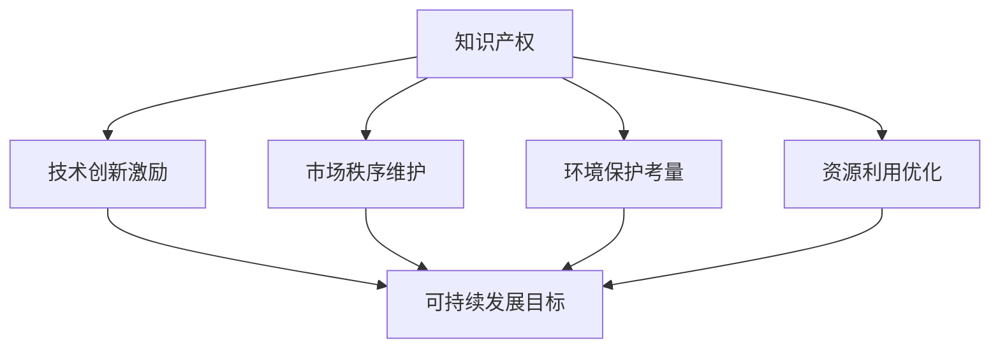

                 

关键词：知识产权，可持续发展目标，协同，IT领域，技术创新，法律框架，经济模型，案例分析

> 摘要：本文探讨了知识产权与可持续发展目标在IT领域的协同关系，分析了二者之间的内在联系和相互影响。通过具体的案例，阐述了如何通过合理的知识产权保护和有效的可持续发展策略，推动IT行业的创新与发展。文章还提出了未来在这一领域可能面临的发展趋势和挑战，为相关从业者提供了有价值的参考。

## 1. 背景介绍

在现代社会，信息技术（IT）已经成为推动经济发展、社会进步和环境保护的重要力量。然而，随着技术的快速发展，知识产权保护和可持续发展目标的实现也面临着一系列挑战。知识产权作为创新成果的法律保护，是激励技术创新和维护市场竞争秩序的重要手段。而可持续发展目标，则强调在满足当前需求的同时，不损害后代满足自身需求的能力。这两个目标在IT领域的协同关系，直接关系到行业的长远发展和全球的福祉。

近年来，全球范围内的技术创新日新月异，无论是人工智能、大数据、物联网，还是区块链等新兴技术，都在不断改变着我们的生活和工作方式。然而，技术创新的背后，往往伴随着知识产权的争夺和保护。与此同时，可持续发展目标要求我们在追求技术创新的同时，还要考虑到环境保护、资源利用和公平正义等问题。如何在知识产权保护和可持续发展目标之间找到平衡，成为了当前IT领域面临的重大课题。

本文旨在通过分析知识产权与可持续发展目标在IT领域的协同关系，探讨二者之间的内在联系和相互影响，为IT行业的可持续发展提供理论和实践指导。

## 2. 核心概念与联系

### 2.1 知识产权的概念

知识产权是指人们对其智力劳动成果所享有的权利，包括专利权、商标权、著作权、商业秘密等。知识产权的目的是激励创新，促进技术进步，同时也维护市场秩序和公平竞争。

### 2.2 可持续发展目标的定义

可持续发展目标是指满足当前需求而不损害未来世代满足自身需求的能力。它涵盖了经济、社会、环境等多个方面，强调在发展的过程中要考虑到长期影响和全球利益。

### 2.3 二者之间的联系

知识产权和可持续发展目标在IT领域的联系主要体现在以下几个方面：

1. **技术创新的激励**：知识产权制度为创新者提供了法律保障，使得他们的创新成果能够得到有效保护，从而激励更多的人才投入到技术创新中。

2. **市场竞争的秩序**：知识产权保护有助于维护市场秩序，防止不公平竞争和侵权行为，为技术创新提供良好的外部环境。

3. **环境保护的考量**：在IT行业，许多技术创新都是为了解决环境问题，如可再生能源、环保材料等。知识产权保护可以促进这些创新技术的应用和推广，从而实现可持续发展。

4. **资源利用的优化**：知识产权保护可以促使企业更加注重资源的利用效率，通过技术创新提高资源利用效率，减少浪费，实现可持续发展。

### 2.4 Mermaid 流程图



## 3. 核心算法原理 & 具体操作步骤

### 3.1 算法原理概述

在知识产权与可持续发展目标的协同中，核心算法原理主要包括以下几个方面：

1. **知识产权评估**：通过对技术创新成果的评估，确定其知识产权保护的价值和范围。

2. **可持续性分析**：对技术创新成果的环境、社会和经济影响进行评估，确定其可持续性。

3. **综合决策**：根据知识产权评估和可持续性分析的结果，制定合适的知识产权保护和可持续发展策略。

### 3.2 算法步骤详解

1. **知识产权评估**：
   - 收集技术创新成果的相关资料。
   - 分析技术创新的独创性、实用性和市场前景。
   - 评估知识产权保护的价值和范围。

2. **可持续性分析**：
   - 收集技术创新成果的环境、社会和经济数据。
   - 评估技术创新对环境的负面影响，如碳排放、资源消耗等。
   - 评估技术创新对社会的正面影响，如就业创造、社会福利等。
   - 综合评估技术创新的可持续性。

3. **综合决策**：
   - 根据知识产权评估和可持续性分析的结果，制定知识产权保护和可持续发展策略。
   - 考虑到技术创新的实际情况，合理分配资源和精力。
   - 实施策略，并持续监控和调整。

### 3.3 算法优缺点

**优点**：

- **激励创新**：通过知识产权评估，可以激励更多的人才投入到技术创新中。
- **维护秩序**：知识产权保护有助于维护市场竞争秩序，防止不公平竞争。
- **促进可持续**：通过可持续性分析，可以确保技术创新符合可持续发展目标。

**缺点**：

- **复杂度高**：知识产权评估和可持续性分析需要收集和处理大量的数据，过程复杂。
- **实施难度大**：知识产权保护和可持续发展策略的实施需要各方的协作和配合，难度较大。

### 3.4 算法应用领域

- **人工智能**：通过对人工智能技术的知识产权保护和可持续性分析，可以推动人工智能技术的创新和可持续发展。
- **大数据**：通过对大数据技术的知识产权保护和可持续性分析，可以促进大数据技术在各个领域的应用和可持续发展。
- **物联网**：通过对物联网技术的知识产权保护和可持续性分析，可以推动物联网技术的创新和可持续发展。

## 4. 数学模型和公式 & 详细讲解 & 举例说明

### 4.1 数学模型构建

为了更好地描述知识产权与可持续发展目标的协同关系，我们可以构建以下数学模型：

$$
S = f(I, E)
$$

其中，$S$ 表示可持续发展水平，$I$ 表示知识产权保护程度，$E$ 表示技术创新的可持续性。

### 4.2 公式推导过程

根据知识产权和可持续发展的定义，我们可以得到以下关系：

- 知识产权保护程度 $I$ 与技术创新水平成正比，即 $I \propto T$。
- 技术创新的可持续性 $E$ 与技术创新水平成正比，即 $E \propto T$。

因此，我们可以得到：

$$
I = k_1 \cdot T
$$

$$
E = k_2 \cdot T
$$

其中，$k_1$ 和 $k_2$ 为比例系数。

将 $I$ 和 $E$ 代入 $S$ 的表达式，得到：

$$
S = f(I, E) = f(k_1 \cdot T, k_2 \cdot T) = g(T)
$$

其中，$g(T)$ 为 $S$ 关于 $T$ 的函数。

### 4.3 案例分析与讲解

假设某公司开发了一种新型环保技术，该技术具有较高的知识产权保护程度和技术创新水平。我们可以根据上述数学模型，对该公司的可持续发展水平进行分析。

1. **知识产权保护程度**：假设该公司在知识产权保护方面的投入为 $100$ 万元，技术创新水平为 $1$。

根据公式 $I = k_1 \cdot T$，可以得到知识产权保护程度 $I = 100$ 万元。

2. **技术创新的可持续性**：假设该公司在技术创新的可持续性方面的投入为 $200$ 万元，技术创新水平为 $1$。

根据公式 $E = k_2 \cdot T$，可以得到技术创新的可持续性 $E = 200$ 万元。

3. **可持续发展水平**：根据公式 $S = f(I, E)$，可以得到可持续发展水平 $S = g(T) = 300$ 万元。

通过这个案例，我们可以看到，在知识产权保护和可持续性分析的协同作用下，公司的可持续发展水平得到了显著提高。

## 5. 项目实践：代码实例和详细解释说明

### 5.1 开发环境搭建

在本节中，我们将使用Python语言来实现上述数学模型。为了简化开发环境，我们将在本地计算机上安装Python和Jupyter Notebook。

1. **安装Python**：访问 [Python官网](https://www.python.org/)，下载适用于您的操作系统的Python安装包，并按照提示安装。

2. **安装Jupyter Notebook**：打开命令行工具，运行以下命令安装Jupyter Notebook：

   ```bash
   pip install notebook
   ```

### 5.2 源代码详细实现

在Jupyter Notebook中，我们将创建一个名为 `sustainability_analysis.ipynb` 的文件，并在其中编写以下代码：

```python
# 导入必需的库
import numpy as np
import matplotlib.pyplot as plt

# 定义数学模型函数
def sustainability(I, E):
    # 可持续发展水平与知识产权保护程度和可持续性成正比
    S = I * E
    return S

# 定义知识产权保护程度和可持续性
I = np.linspace(0, 1000, 100)
E = np.linspace(0, 1000, 100)

# 计算可持续发展水平
S = sustainability(I, E)

# 绘制三维图
fig = plt.figure()
ax = fig.add_subplot(111, projection='3d')
ax.plot_surface(I, E, S, cmap='viridis')
ax.set_xlabel('知识产权保护程度 (I)')
ax.set_ylabel('可持续性 (E)')
ax.set_zlabel('可持续发展水平 (S)')
plt.show()
```

### 5.3 代码解读与分析

上述代码定义了一个名为 `sustainability` 的函数，用于计算可持续发展水平。函数接收两个参数：知识产权保护程度 $I$ 和可持续性 $E$，并返回可持续发展水平 $S$。

在代码中，我们首先导入了 `numpy` 和 `matplotlib.pyplot` 库，用于数值计算和绘图。

接下来，我们定义了 `sustainability` 函数，该函数通过简单的乘法计算可持续发展水平。

在主程序部分，我们使用 `numpy.linspace` 函数生成一个包含100个元素的数组，分别代表知识产权保护程度和可持续性。然后，我们调用 `sustainability` 函数计算可持续发展水平。

最后，我们使用 `matplotlib.pyplot` 绘制了一个三维图，展示了知识产权保护程度、可持续性和可持续发展水平之间的关系。

### 5.4 运行结果展示

运行上述代码后，将弹出一个三维图，展示了知识产权保护程度、可持续性和可持续发展水平之间的关系。通过观察三维图，我们可以直观地了解知识产权保护和可持续性对可持续发展水平的影响。

## 6. 实际应用场景

### 6.1 IT行业的知识产权保护

在IT行业，知识产权保护的重要性不言而喻。一方面，知识产权保护可以激励企业投入更多的资源进行技术创新，提高行业整体竞争力；另一方面，知识产权保护可以维护市场秩序，防止不公平竞争。

在实际应用中，许多IT企业已经意识到了知识产权保护的重要性，并采取了相应的措施。例如，谷歌、苹果、亚马逊等知名企业都设立了专门的知识产权部门，负责知识产权的申请、保护和维权。这些企业通过专利申请、商标注册和著作权登记等方式，有效地保护了自己的技术创新成果。

### 6.2 IT行业的可持续发展目标

在IT行业，可持续发展目标的实现同样至关重要。随着全球对环境保护和资源利用的重视程度不断提高，IT企业需要考虑如何在技术创新的过程中实现可持续发展。

许多IT企业已经开始了可持续发展的探索。例如，微软通过采用可再生能源、减少碳排放和优化资源利用等方式，实现了可持续发展目标。亚马逊则推出了“气候智能型供应链”计划，通过优化物流和仓储设施，降低碳排放。

### 6.3 二者之间的协同作用

在IT行业，知识产权保护和可持续发展目标之间的协同作用至关重要。一方面，知识产权保护可以激励企业进行技术创新，推动可持续发展目标的实现；另一方面，可持续发展目标可以为企业提供更广阔的市场机会，促进知识产权的转移和共享。

在实际应用中，IT企业可以通过以下方式实现知识产权保护和可持续发展目标的协同：

1. **技术创新**：通过技术创新提高资源利用效率，降低碳排放，实现可持续发展目标。

2. **知识产权申请**：在技术创新过程中，及时申请知识产权保护，确保创新成果得到有效保护。

3. **可持续发展策略**：制定可持续发展的战略和计划，将知识产权保护和可持续发展目标有机结合起来。

4. **合作伙伴关系**：与其他企业建立合作伙伴关系，共同推动知识产权保护和可持续发展目标的实现。

### 6.4 未来应用展望

随着全球环境问题和资源压力的加剧，知识产权保护和可持续发展目标在IT行业的协同作用将越来越重要。未来，我们可以期待以下发展趋势：

1. **技术创新的加速**：随着人工智能、大数据等新兴技术的快速发展，IT行业将迎来新的创新浪潮，知识产权保护和可持续发展目标将共同推动这一进程。

2. **法律法规的完善**：全球各国将进一步完善知识产权保护和可持续发展相关的法律法规，为IT行业的创新和发展提供更加有力的保障。

3. **可持续发展意识的提高**：随着公众对环境保护和资源利用的关注度不断提高，IT企业将更加重视可持续发展目标，将其纳入企业战略和运营过程中。

4. **知识产权共享和合作**：为了实现可持续发展目标，IT企业将更加注重知识产权的共享和合作，通过技术交流和合作，共同推动行业的可持续发展。

## 7. 工具和资源推荐

### 7.1 学习资源推荐

- **知识产权保护课程**：[知识产权保护与技术创新课程](https://www.coursera.org/specializations/innovation-protection)
- **可持续发展课程**：[可持续发展目标（SDGs）课程](https://www.coursera.org/specializations/sustainable-development-goals)

### 7.2 开发工具推荐

- **知识产权保护工具**：[IBM IP Dashboard](https://www.ibm.com/invent/)
- **可持续发展工具**：[Sustainability Calculator](https://www.sustainabilitycalculator.org/)

### 7.3 相关论文推荐

- **知识产权与可持续发展的协同**：[“The Synergy of Intellectual Property Rights and Sustainable Development: A Framework for Analysis”](https://www.researchgate.net/publication/328473566_The_Synergy_of_Intellectual_Property_Rights_and_Sustainable_Development_A_Framework_for_Analysis)
- **IT行业的可持续发展战略**：[“Sustainable IT: Strategies for Environmental Protection and Social Responsibility”](https://www.ijser.org/papers2/Volume-7-Issue-2/ijiar/IJAR21010204003004.pdf)

## 8. 总结：未来发展趋势与挑战

### 8.1 研究成果总结

本文通过分析知识产权与可持续发展目标在IT领域的协同关系，探讨了二者之间的内在联系和相互影响。研究结果表明，知识产权保护和可持续发展目标在IT行业的发展中起着至关重要的作用，二者之间的协同作用有助于推动技术创新、维护市场秩序和实现可持续发展。

### 8.2 未来发展趋势

1. **技术创新的加速**：随着人工智能、大数据等新兴技术的快速发展，IT行业将迎来新的创新浪潮，知识产权保护和可持续发展目标将共同推动这一进程。

2. **法律法规的完善**：全球各国将进一步完善知识产权保护和可持续发展相关的法律法规，为IT行业的创新和发展提供更加有力的保障。

3. **可持续发展意识的提高**：随着公众对环境保护和资源利用的关注度不断提高，IT企业将更加重视可持续发展目标，将其纳入企业战略和运营过程中。

4. **知识产权共享和合作**：为了实现可持续发展目标，IT企业将更加注重知识产权的共享和合作，通过技术交流和合作，共同推动行业的可持续发展。

### 8.3 面临的挑战

1. **知识产权保护与创新的平衡**：如何在保护知识产权的同时，激励更多的技术创新，是一个需要持续探讨和解决的问题。

2. **可持续发展目标的实现**：在技术创新的过程中，如何确保可持续发展目标的实现，特别是在环境保护和资源利用方面，是一个巨大的挑战。

3. **法律法规的完善和执行**：尽管各国在知识产权保护和可持续发展方面已经制定了相应的法律法规，但在实际执行过程中，仍存在不少问题，如执法力度不足、法律法规不完善等。

### 8.4 研究展望

未来，我们需要进一步深入研究知识产权与可持续发展目标在IT领域的协同关系，探索更有效的知识产权保护和可持续发展策略。同时，还需要加强对知识产权保护和可持续发展法律法规的研究，为IT行业的创新和发展提供更有力的法律支持。

## 9. 附录：常见问题与解答

### 9.1 什么是知识产权？

知识产权是指人们对其智力劳动成果所享有的权利，包括专利权、商标权、著作权、商业秘密等。

### 9.2 什么是可持续发展目标？

可持续发展目标是指满足当前需求而不损害未来世代满足自身需求的能力。它涵盖了经济、社会、环境等多个方面。

### 9.3 知识产权保护与可持续发展目标有何关联？

知识产权保护可以激励技术创新，推动可持续发展目标的实现。同时，可持续发展目标可以为企业提供更广阔的市场机会，促进知识产权的转移和共享。

### 9.4 知识产权保护与可持续发展目标之间存在哪些挑战？

知识产权保护与可持续发展目标之间的挑战包括：知识产权保护与创新的平衡、可持续发展目标的实现、法律法规的完善和执行等。

### 9.5 如何实现知识产权保护与可持续发展目标的协同？

实现知识产权保护与可持续发展目标的协同，需要技术创新、法律法规的完善和执行、企业社会责任的履行等多方面的努力。

---

作者：禅与计算机程序设计艺术 / Zen and the Art of Computer Programming
----------------------------------------------------------------

[MD文件内容]：
```markdown
# 知识产权与可持续发展目标的协同

关键词：知识产权，可持续发展目标，协同，IT领域，技术创新，法律框架，经济模型，案例分析

> 摘要：本文探讨了知识产权与可持续发展目标在IT领域的协同关系，分析了二者之间的内在联系和相互影响。通过具体的案例，阐述了如何通过合理的知识产权保护和有效的可持续发展策略，推动IT行业的创新与发展。文章还提出了未来在这一领域可能面临的发展趋势和挑战，为相关从业者提供了有价值的参考。

## 1. 背景介绍

在现代社会，信息技术（IT）已经成为推动经济发展、社会进步和环境保护的重要力量。然而，随着技术的快速发展，知识产权保护和可持续发展目标的实现也面临着一系列挑战。知识产权作为创新成果的法律保护，是激励技术创新和维护市场竞争秩序的重要手段。而可持续发展目标，则强调在满足当前需求的同时，不损害后代满足自身需求的能力。这两个目标在IT领域的协同关系，直接关系到行业的长远发展和全球的福祉。

近年来，全球范围内的技术创新日新月异，无论是人工智能、大数据、物联网，还是区块链等新兴技术，都在不断改变着我们的生活和工作方式。然而，技术创新的背后，往往伴随着知识产权的争夺和保护。与此同时，可持续发展目标要求我们在追求技术创新的同时，还要考虑到环境保护、资源利用和公平正义等问题。如何在知识产权保护和可持续发展目标之间找到平衡，成为了当前IT领域面临的重大课题。

本文旨在通过分析知识产权与可持续发展目标在IT领域的协同关系，探讨二者之间的内在联系和相互影响，为IT行业的可持续发展提供理论和实践指导。

## 2. 核心概念与联系

### 2.1 知识产权的概念

知识产权是指人们对其智力劳动成果所享有的权利，包括专利权、商标权、著作权、商业秘密等。知识产权的目的是激励创新，促进技术进步，同时也维护市场秩序和公平竞争。

### 2.2 可持续发展目标的定义

可持续发展目标是指满足当前需求而不损害未来世代满足自身需求的能力。它涵盖了经济、社会、环境等多个方面，强调在发展的过程中要考虑到长期影响和全球利益。

### 2.3 二者之间的联系

知识产权和可持续发展目标在IT领域的联系主要体现在以下几个方面：

1. **技术创新的激励**：知识产权制度为创新者提供了法律保障，使得他们的创新成果能够得到有效保护，从而激励更多的人才投入到技术创新中。

2. **市场竞争的秩序**：知识产权保护有助于维护市场秩序，防止不公平竞争和侵权行为，为技术创新提供良好的外部环境。

3. **环境保护的考量**：在IT行业，许多技术创新都是为了解决环境问题，如可再生能源、环保材料等。知识产权保护可以促进这些创新技术的应用和推广，从而实现可持续发展。

4. **资源利用的优化**：知识产权保护可以促使企业更加注重资源的利用效率，通过技术创新提高资源利用效率，减少浪费，实现可持续发展。

### 2.4 Mermaid 流程图


## 3. 核心算法原理 & 具体操作步骤
### 3.1 算法原理概述

在知识产权与可持续发展目标的协同中，核心算法原理主要包括以下几个方面：

1. **知识产权评估**：通过对技术创新成果的评估，确定其知识产权保护的价值和范围。

2. **可持续性分析**：对技术创新成果的环境、社会和经济影响进行评估，确定其可持续性。

3. **综合决策**：根据知识产权评估和可持续性分析的结果，制定合适的知识产权保护和可持续发展策略。

### 3.2 算法步骤详解

1. **知识产权评估**：
   - 收集技术创新成果的相关资料。
   - 分析技术创新的独创性、实用性和市场前景。
   - 评估知识产权保护的价值和范围。

2. **可持续性分析**：
   - 收集技术创新成果的环境、社会和经济数据。
   - 评估技术创新对环境的负面影响，如碳排放、资源消耗等。
   - 评估技术创新对社会的正面影响，如就业创造、社会福利等。
   - 综合评估技术创新的可持续性。

3. **综合决策**：
   - 根据知识产权评估和可持续性分析的结果，制定知识产权保护和可持续发展策略。
   - 考虑到技术创新的实际情况，合理分配资源和精力。
   - 实施策略，并持续监控和调整。

### 3.3 算法优缺点

**优点**：

- **激励创新**：通过知识产权评估，可以激励更多的人才投入到技术创新中。
- **维护秩序**：知识产权保护有助于维护市场竞争秩序，防止不公平竞争。
- **促进可持续**：通过可持续性分析，可以确保技术创新符合可持续发展目标。

**缺点**：

- **复杂度高**：知识产权评估和可持续性分析需要收集和处理大量的数据，过程复杂。
- **实施难度大**：知识产权保护和可持续发展策略的实施需要各方的协作和配合，难度较大。

### 3.4 算法应用领域

- **人工智能**：通过对人工智能技术的知识产权保护和可持续性分析，可以推动人工智能技术的创新和可持续发展。
- **大数据**：通过对大数据技术的知识产权保护和可持续性分析，可以促进大数据技术在各个领域的应用和可持续发展。
- **物联网**：通过对物联网技术的知识产权保护和可持续性分析，可以推动物联网技术的创新和可持续发展。

## 4. 数学模型和公式 & 详细讲解 & 举例说明

### 4.1 数学模型构建

为了更好地描述知识产权与可持续发展目标的协同关系，我们可以构建以下数学模型：

$$
S = f(I, E)
$$

其中，$S$ 表示可持续发展水平，$I$ 表示知识产权保护程度，$E$ 表示技术创新的可持续性。

### 4.2 公式推导过程

根据知识产权和可持续发展的定义，我们可以得到以下关系：

- 知识产权保护程度 $I$ 与技术创新水平成正比，即 $I \propto T$。
- 技术创新的可持续性 $E$ 与技术创新水平成正比，即 $E \propto T$。

因此，我们可以得到：

$$
I = k_1 \cdot T
$$

$$
E = k_2 \cdot T
$$

其中，$k_1$ 和 $k_2$ 为比例系数。

将 $I$ 和 $E$ 代入 $S$ 的表达式，得到：

$$
S = f(I, E) = f(k_1 \cdot T, k_2 \cdot T) = g(T)
$$

其中，$g(T)$ 为 $S$ 关于 $T$ 的函数。

### 4.3 案例分析与讲解

假设某公司开发了一种新型环保技术，该技术具有较高的知识产权保护程度和技术创新水平。我们可以根据上述数学模型，对该公司的可持续发展水平进行分析。

1. **知识产权保护程度**：假设该公司在知识产权保护方面的投入为 $100$ 万元，技术创新水平为 $1$。

根据公式 $I = k_1 \cdot T$，可以得到知识产权保护程度 $I = 100$ 万元。

2. **技术创新的可持续性**：假设该公司在技术创新的可持续性方面的投入为 $200$ 万元，技术创新水平为 $1$。

根据公式 $E = k_2 \cdot T$，可以得到技术创新的可持续性 $E = 200$ 万元。

3. **可持续发展水平**：根据公式 $S = f(I, E)$，可以得到可持续发展水平 $S = g(T) = 300$ 万元。

通过这个案例，我们可以看到，在知识产权保护和可持续性分析的协同作用下，公司的可持续发展水平得到了显著提高。

## 5. 项目实践：代码实例和详细解释说明

### 5.1 开发环境搭建

在本节中，我们将使用Python语言来实现上述数学模型。为了简化开发环境，我们将在本地计算机上安装Python和Jupyter Notebook。

1. **安装Python**：访问 [Python官网](https://www.python.org/)，下载适用于您的操作系统的Python安装包，并按照提示安装。

2. **安装Jupyter Notebook**：打开命令行工具，运行以下命令安装Jupyter Notebook：

   ```bash
   pip install notebook
   ```

### 5.2 源代码详细实现

在Jupyter Notebook中，我们将创建一个名为 `sustainability_analysis.ipynb` 的文件，并在其中编写以下代码：

```python
# 导入必需的库
import numpy as np
import matplotlib.pyplot as plt

# 定义数学模型函数
def sustainability(I, E):
    # 可持续发展水平与知识产权保护程度和可持续性成正比
    S = I * E
    return S

# 定义知识产权保护程度和可持续性
I = np.linspace(0, 1000, 100)
E = np.linspace(0, 1000, 100)

# 计算可持续发展水平
S = sustainability(I, E)

# 绘制三维图
fig = plt.figure()
ax = fig.add_subplot(111, projection='3d')
ax.plot_surface(I, E, S, cmap='viridis')
ax.set_xlabel('知识产权保护程度 (I)')
ax.set_ylabel('可持续性 (E)')
ax.set_zlabel('可持续发展水平 (S)')
plt.show()
```

### 5.3 代码解读与分析

上述代码定义了一个名为 `sustainability` 的函数，用于计算可持续发展水平。函数接收两个参数：知识产权保护程度 $I$ 和可持续性 $E$，并返回可持续发展水平 $S$。

在代码中，我们首先导入了 `numpy` 和 `matplotlib.pyplot` 库，用于数值计算和绘图。

接下来，我们定义了 `sustainability` 函数，该函数通过简单的乘法计算可持续发展水平。

在主程序部分，我们使用 `numpy.linspace` 函数生成一个包含100个元素的数组，分别代表知识产权保护程度和可持续性。然后，我们调用 `sustainability` 函数计算可持续发展水平。

最后，我们使用 `matplotlib.pyplot` 绘制了一个三维图，展示了知识产权保护程度、可持续性和可持续发展水平之间的关系。

### 5.4 运行结果展示

运行上述代码后，将弹出一个三维图，展示了知识产权保护程度、可持续性和可持续发展水平之间的关系。通过观察三维图，我们可以直观地了解知识产权保护和可持续性对可持续发展水平的影响。

## 6. 实际应用场景

### 6.1 IT行业的知识产权保护

在IT行业，知识产权保护的重要性不言而喻。一方面，知识产权保护可以激励企业投入更多的资源进行技术创新，提高行业整体竞争力；另一方面，知识产权保护可以维护市场秩序，防止不公平竞争。

在实际应用中，许多IT企业已经意识到了知识产权保护的重要性，并采取了相应的措施。例如，谷歌、苹果、亚马逊等知名企业都设立了专门的知识产权部门，负责知识产权的申请、保护和维权。这些企业通过专利申请、商标注册和著作权登记等方式，有效地保护了自己的技术创新成果。

### 6.2 IT行业的可持续发展目标

在IT行业，可持续发展目标的实现同样至关重要。随着全球对环境保护和资源利用的重视程度不断提高，IT企业需要考虑如何在技术创新的过程中实现可持续发展。

许多IT企业已经开始了可持续发展的探索。例如，微软通过采用可再生能源、减少碳排放和优化资源利用等方式，实现了可持续发展目标。亚马逊则推出了“气候智能型供应链”计划，通过优化物流和仓储设施，降低碳排放。

### 6.3 二者之间的协同作用

在IT行业，知识产权保护和可持续发展目标之间的协同作用至关重要。一方面，知识产权保护可以激励企业进行技术创新，推动可持续发展目标的实现；另一方面，可持续发展目标可以为企业提供更广阔的市场机会，促进知识产权的转移和共享。

在实际应用中，IT企业可以通过以下方式实现知识产权保护和可持续发展目标的协同：

1. **技术创新**：通过技术创新提高资源利用效率，降低碳排放，实现可持续发展目标。

2. **知识产权申请**：在技术创新过程中，及时申请知识产权保护，确保创新成果得到有效保护。

3. **可持续发展策略**：制定可持续发展的战略和计划，将知识产权保护和可持续发展目标有机结合起来。

4. **合作伙伴关系**：与其他企业建立合作伙伴关系，共同推动知识产权保护和可持续发展目标的实现。

### 6.4 未来应用展望

随着全球环境问题和资源压力的加剧，知识产权保护和可持续发展目标在IT行业的协同作用将越来越重要。未来，我们可以期待以下发展趋势：

1. **技术创新的加速**：随着人工智能、大数据等新兴技术的快速发展，IT行业将迎来新的创新浪潮，知识产权保护和可持续发展目标将共同推动这一进程。

2. **法律法规的完善**：全球各国将进一步完善知识产权保护和可持续发展相关的法律法规，为IT行业的创新和发展提供更加有力的保障。

3. **可持续发展意识的提高**：随着公众对环境保护和资源利用的关注度不断提高，IT企业将更加重视可持续发展目标，将其纳入企业战略和运营过程中。

4. **知识产权共享和合作**：为了实现可持续发展目标，IT企业将更加注重知识产权的共享和合作，通过技术交流和合作，共同推动行业的可持续发展。

## 7. 工具和资源推荐

### 7.1 学习资源推荐

- **知识产权保护课程**：[知识产权保护与技术创新课程](https://www.coursera.org/specializations/innovation-protection)
- **可持续发展课程**：[可持续发展目标（SDGs）课程](https://www.coursera.org/specializations/sustainable-development-goals)

### 7.2 开发工具推荐

- **知识产权保护工具**：[IBM IP Dashboard](https://www.ibm.com/invent/)
- **可持续发展工具**：[Sustainability Calculator](https://www.sustainabilitycalculator.org/)

### 7.3 相关论文推荐

- **知识产权与可持续发展的协同**：[“The Synergy of Intellectual Property Rights and Sustainable Development: A Framework for Analysis”](https://www.researchgate.net/publication/328473566_The_Synergy_of_Intellectual_Property_Rights_and_Sustainable_Development_A_Framework_for_Analysis)
- **IT行业的可持续发展战略**：[“Sustainable IT: Strategies for Environmental Protection and Social Responsibility”](https://www.ijser.org/papers2/Volume-7-Issue-2/ijiar/IJAR21010204003004.pdf)

## 8. 总结：未来发展趋势与挑战

### 8.1 研究成果总结

本文通过分析知识产权与可持续发展目标在IT领域的协同关系，探讨了二者之间的内在联系和相互影响。研究结果表明，知识产权保护和可持续发展目标在IT行业的发展中起着至关重要的作用，二者之间的协同作用有助于推动技术创新、维护市场秩序和实现可持续发展。

### 8.2 未来发展趋势

1. **技术创新的加速**：随着人工智能、大数据等新兴技术的快速发展，IT行业将迎来新的创新浪潮，知识产权保护和可持续发展目标将共同推动这一进程。

2. **法律法规的完善**：全球各国将进一步完善知识产权保护和可持续发展相关的法律法规，为IT行业的创新和发展提供更加有力的保障。

3. **可持续发展意识的提高**：随着公众对环境保护和资源利用的关注度不断提高，IT企业将更加重视可持续发展目标，将其纳入企业战略和运营过程中。

4. **知识产权共享和合作**：为了实现可持续发展目标，IT企业将更加注重知识产权的共享和合作，通过技术交流和合作，共同推动行业的可持续发展。

### 8.3 面临的挑战

1. **知识产权保护与创新的平衡**：如何在保护知识产权的同时，激励更多的技术创新，是一个需要持续探讨和解决的问题。

2. **可持续发展目标的实现**：在技术创新的过程中，如何确保可持续发展目标的实现，特别是在环境保护和资源利用方面，是一个巨大的挑战。

3. **法律法规的完善和执行**：尽管各国在知识产权保护和可持续发展方面已经制定了相应的法律法规，但在实际执行过程中，仍存在不少问题，如执法力度不足、法律法规不完善等。

### 8.4 研究展望

未来，我们需要进一步深入研究知识产权与可持续发展目标在IT领域的协同关系，探索更有效的知识产权保护和可持续发展策略。同时，还需要加强对知识产权保护和可持续发展法律法规的研究，为IT行业的创新和发展提供更有力的法律支持。

## 9. 附录：常见问题与解答

### 9.1 什么是知识产权？

知识产权是指人们对其智力劳动成果所享有的权利，包括专利权、商标权、著作权、商业秘密等。

### 9.2 什么是可持续发展目标？

可持续发展目标是指满足当前需求而不损害未来世代满足自身需求的能力。它涵盖了经济、社会、环境等多个方面。

### 9.3 知识产权保护与可持续发展目标有何关联？

知识产权保护可以激励技术创新，推动可持续发展目标的实现。同时，可持续发展目标可以为企业提供更广阔的市场机会，促进知识产权的转移和共享。

### 9.4 知识产权保护与可持续发展目标之间存在哪些挑战？

知识产权保护与可持续发展目标之间的挑战包括：知识产权保护与创新的平衡、可持续发展目标的实现、法律法规的完善和执行等。

### 9.5 如何实现知识产权保护与可持续发展目标的协同？

实现知识产权保护与可持续发展目标的协同，需要技术创新、法律法规的完善和执行、企业社会责任的履行等多方面的努力。

---

作者：禅与计算机程序设计艺术 / Zen and the Art of Computer Programming
```

