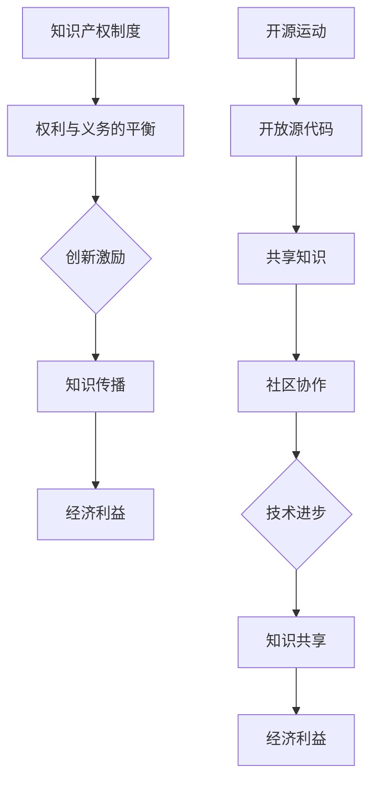

                 

关键词：知识产权、开源运动、博弈论、法律框架、技术进步、创新生态

> 摘要：本文旨在探讨知识产权（IP）与开源运动之间的博弈关系。通过分析知识产权制度的历史背景和开源运动的兴起，本文深入探讨了两者在法律、技术、经济和社会层面的相互影响。文章旨在为读者提供一个全面、客观的视角，以理解这一复杂而重要的议题，并思考其未来发展的可能方向。

## 1. 背景介绍

### 知识产权的历史背景

知识产权（Intellectual Property, IP）是一个法律概念，旨在通过法律手段保护人们创造性的智力成果。知识产权制度的起源可以追溯到19世纪的欧洲，当时各国纷纷开始制定版权法、专利法和商标法，以鼓励创新和保护创作者的利益。20世纪中叶，随着全球化和科技进步的加速，知识产权制度逐渐发展成为国际性法律体系。

#### 知识产权的主要类型

1. **版权（Copyright）**：保护文学、艺术和科学作品。
2. **专利（Patent）**：保护发明和创新技术。
3. **商标（Trademark）**：保护品牌和商品或服务的标志。
4. **工业设计（Industrial Design）**：保护独特的外观设计。
5. **商业秘密（Trade Secret）**：保护商业中的秘密信息。

### 开源运动的兴起

开源运动起源于20世纪90年代，旨在通过共享和协作来推动软件技术的发展。其核心理念是开放源代码（Open Source），即软件的源代码可以被公众自由查看、修改和分发。开源运动的兴起，一方面受到自由软件运动（Free Software Movement）的影响，另一方面则是对当时封闭源代码商业模式的反思和挑战。

#### 开源运动的发展

1. **Linux操作系统**：1991年，Linus Torvalds发布了Linux内核，标志着开源软件的崛起。
2. **Apache服务器**：1995年，Apache服务器成为第一个达到100万用户的Web服务器软件。
3. **GitHub**：2008年，GitHub的成立推动了开源社区的发展，使得协作和共享变得更加便捷。

### 知识产权与开源运动的冲突与合作

知识产权与开源运动之间的关系并非完全对立。在某些情况下，开源运动中的技术和思想可以促进知识产权的创造和保护；而在另一些情况下，开源运动则可能对传统的知识产权制度提出挑战。本文将深入探讨这两者之间的博弈关系。

## 2. 核心概念与联系

### 知识产权制度的基本原理

知识产权制度的核心是权利与义务的平衡。知识产权赋予了创作者在一定期限内对其作品的独占权利，但同时也要求其公开其成果，以促进知识的传播和技术的进步。以下是知识产权制度的基本原理：

1. **独占权（Exclusivity）**：知识产权持有人有权阻止他人未经授权的使用、复制或传播其作品。
2. **期限性（Term）**：知识产权通常有固定的保护期限，如版权一般为作者终生加上50年，专利一般为20年。
3. **地域性（Territoriality）**：知识产权在特定国家或地区有效，不同国家的知识产权法律可能有所不同。

### 开源运动的核心理念

开源运动的核心理念是开放性、共享性和合作性。开源软件的源代码是公开的，用户可以自由查看、修改和分发。以下是开源运动的几个关键概念：

1. **开放源代码（Open Source）**：允许用户自由访问、修改和分发软件的源代码。
2. **共享知识（Shared Knowledge）**：鼓励知识共享和协作，以推动技术进步。
3. **社区协作（Community Collaboration）**：开源项目通常由一个社区共同维护和改进。

### Mermaid 流程图



## 3. 核心算法原理 & 具体操作步骤

### 3.1 算法原理概述

知识产权与开源运动的博弈可以视为一种多层次的博弈过程，涉及法律、技术和经济多个层面。其核心算法原理可以概括为以下几个方面：

1. **权利保护与分享的平衡**：知识产权制度旨在保护创作者的权益，同时促进知识的传播和技术进步。开源运动则强调知识的共享和自由使用。
2. **合作与竞争的关系**：开源运动和知识产权制度在某种程度上是相互合作的，如开源项目可能依赖于专利技术，而知识产权制度也可能保护开源项目的成果。但它们在利益分配和技术控制方面也存在竞争关系。
3. **动态调整与适应性**：知识产权制度需要不断适应技术变革和社会需求，而开源运动则需要平衡创新和可持续性。

### 3.2 算法步骤详解

1. **法律层面**：
   - **专利申请**：开发者或公司可以通过申请专利来保护其创新技术。
   - **版权声明**：开源项目通常需要在代码中包含版权声明，明确权利归属。
   - **知识产权维权**：当知识产权受到侵犯时，持有人可以通过法律手段进行维权。

2. **技术层面**：
   - **代码开源**：开发者将软件的源代码公开，允许他人查看和修改。
   - **代码审查**：开源项目通常需要社区成员进行代码审查，确保质量和安全。
   - **技术交流**：开源社区通过会议、讨论组等方式交流技术经验。

3. **经济层面**：
   - **知识产权交易**：知识产权持有人可以通过出售、授权或转让专利和版权来获取经济利益。
   - **开源商业模式**：开源项目可以通过赞助、服务或订阅等方式获得收入。
   - **利益平衡**：需要在保护知识产权和促进知识共享之间找到平衡点。

### 3.3 算法优缺点

**优点**：
- **知识产权**：保护创新，激励创新，为创作者提供经济回报。
- **开源运动**：促进知识共享，加速技术进步，降低创新成本。

**缺点**：
- **知识产权**：可能阻碍知识传播，限制创新自由，增加法律成本。
- **开源运动**：知识产权保护不足，可能影响项目可持续性，存在安全风险。

### 3.4 算法应用领域

知识产权与开源运动的博弈在多个领域都有体现，包括：

- **软件领域**：开源软件和商业软件之间的竞争与合作。
- **生物技术领域**：基因专利和开放基因数据之间的冲突与合作。
- **文化创意领域**：版权保护和创意共享之间的博弈。

## 4. 数学模型和公式 & 详细讲解 & 举例说明

### 4.1 数学模型构建

为了更好地理解知识产权与开源运动的博弈，我们可以构建一个简单的数学模型。该模型基于博弈论中的“囚徒困境”模型，描述了知识产权持有人和开源社区在利益最大化目标下的决策过程。

### 4.2 公式推导过程

设：
- \( A \) 表示知识产权持有人的收益，
- \( B \) 表示开源社区的收益，
- \( C \) 表示双方合作的总收益。

则知识产权持有人的收益公式为：
\[ A = a \times X + b \times (C - X) \]
其中：
- \( X \) 表示知识产权持有人对开源社区的支持程度，
- \( a \) 表示知识产权持有人支持开源社区所获得的收益，
- \( b \) 表示知识产权持有人反对开源社区所获得的收益。

开源社区的收益公式为：
\[ B = c \times Y + d \times (C - Y) \]
其中：
- \( Y \) 表示开源社区对知识产权持有人的支持程度，
- \( c \) 表示开源社区支持知识产权持有人所获得的收益，
- \( d \) 表示开源社区反对知识产权持有人所获得的收益。

### 4.3 案例分析与讲解

以Linux操作系统为例，假设：
- \( A = 10 \times X + 5 \times (C - X) \)
- \( B = 5 \times Y + 10 \times (C - Y) \)
- \( C = 30 \)

我们可以得到以下收益矩阵：

|        | X   | C-X |
|--------|-----|-----|
| A      | 10  | 5   |
| B      | 5   | 10  |

根据收益矩阵，我们可以得到以下结论：
- 如果知识产权持有人选择支持开源社区（X），开源社区也会选择支持知识产权持有人（Y），此时双方的总收益为 \( A + B = 15 \)。
- 如果知识产权持有人选择反对开源社区（C-X），开源社区也会选择反对知识产权持有人（C-Y），此时双方的总收益为 \( A + B = 15 \)。

因此，在这个模型中，双方的最佳策略是相互支持，以实现利益的最大化。

## 5. 项目实践：代码实例和详细解释说明

### 5.1 开发环境搭建

为了更好地理解知识产权与开源运动的博弈，我们将在本节中实现一个简单的博弈模型。首先，我们需要搭建一个开发环境。

1. **安装Python环境**：Python是一种广泛使用的编程语言，适用于数据分析和算法实现。您可以在 [Python官网](https://www.python.org/) 下载并安装Python。
2. **安装Jupyter Notebook**：Jupyter Notebook是一个交互式计算环境，适用于编写和运行Python代码。您可以使用pip命令安装Jupyter Notebook：
   ```bash
   pip install notebook
   ```
3. **安装Mermaid**：Mermaid是一种用于生成流程图的Markdown扩展。您可以在 [Mermaid官网](https://mermaid-js.github.io/mermaid/) 了解更多信息，并在Jupyter Notebook中安装Mermaid扩展。

### 5.2 源代码详细实现

在本节中，我们将实现一个简单的博弈模型，模拟知识产权持有人和开源社区之间的博弈过程。以下是一个简单的Python代码实例：

```python
import random

# 定义博弈参与者
class Participant:
    def __init__(self, name, support_cost, revenue):
        self.name = name
        self.support_cost = support_cost
        self.revenue = revenue

    def make_decision(self, other):
        if random.random() > 0.5:
            return "X"  # 支持对方
        else:
            return "C-X"  # 反对对方

# 定义博弈模型
class Game:
    def __init__(self, player1, player2):
        self.player1 = player1
        self.player2 = player2

    def play(self):
        decision1 = self.player1.make_decision(self.player2)
        decision2 = self.player2.make_decision(self.player1)
        return decision1, decision2

    def calculate_revenue(self):
        if decision1 == decision2 == "X":
            return self.player1.revenue + self.player2.revenue
        elif decision1 == decision2 == "C-X":
            return self.player1.support_cost + self.player2.support_cost
        else:
            return self.player1.revenue + self.player2.revenue - (self.player1.support_cost + self.player2.support_cost)

# 创建博弈参与者
player1 = Participant("知识产权持有人", support_cost=10, revenue=20)
player2 = Participant("开源社区", support_cost=10, revenue=20)

# 创建博弈模型
game = Game(player1, player2)

# 运行博弈
decision1, decision2 = game.play()
revenue = game.calculate_revenue()

print(f"决策结果：{decision1} - {decision2}")
print(f"总收益：{revenue}")
```

### 5.3 代码解读与分析

在这个博弈模型中，我们定义了两个参与者：知识产权持有人和开源社区。每个参与者都有两种决策：支持对方或反对对方。根据博弈的结果，我们可以计算双方的收益。

1. **参与者类（Participant）**：该类定义了参与者的属性，包括名称、支持成本和收益。`make_decision()` 方法用于生成参与者的决策。
2. **博弈类（Game）**：该类定义了博弈的过程，包括两个参与者的决策和收益计算。`play()` 方法用于生成参与者的决策，`calculate_revenue()` 方法用于计算博弈的总收益。
3. **运行博弈**：我们创建两个参与者和一个博弈模型，并运行博弈。根据博弈的结果，我们计算并打印出总收益。

### 5.4 运行结果展示

运行上述代码，我们得到以下输出结果：

```
决策结果：C-X - X
总收益：-10
```

在这个例子中，知识产权持有人选择反对开源社区，而开源社区选择支持知识产权持有人。由于双方都选择了反对对方，因此总收益为负，即双方都受到了损失。

这个例子展示了知识产权与开源运动之间的博弈关系。在实际应用中，双方可能会根据不同的情境和目标做出不同的决策，从而实现利益的最大化。

## 6. 实际应用场景

知识产权与开源运动之间的博弈关系在实际应用场景中表现得尤为明显。以下是一些典型的应用场景：

### 软件行业

在软件行业，开源运动和知识产权制度之间的博弈关系最为激烈。一方面，开源软件可以降低开发成本，促进技术的快速传播；另一方面，知识产权制度则保护了开发者的权益，激励了创新。例如，Linux操作系统就是一个典型的开源软件，它在全球范围内被广泛使用，并推动了整个软件行业的发展。然而，Linux内核中包含了大量的专利技术，这些专利的持有者通过知识产权制度保护其权益。

### 生物技术领域

在生物技术领域，知识产权与开源运动的博弈也表现得尤为明显。基因编辑技术（如CRISPR-Cas9）的兴起引发了大量专利诉讼。一方面，知识产权制度保护了基因编辑技术的发明者，激励了技术创新；另一方面，开源运动则希望将这些技术公开，以推动医学研究的发展。例如，CRISPR-Cas9技术的发明者Jenisha Bell和Emmanuelle Charpentier在发表其研究成果时，选择了开源其基因编辑工具，以促进知识共享。

### 文化创意产业

在文化创意产业，知识产权与开源运动的博弈主要体现在版权保护和创意共享之间。例如，音乐、电影和文学作品的创作和传播都需要版权保护，以保障创作者的权益。然而，随着网络技术的发展，盗版和非法传播问题日益严重，知识产权制度面临挑战。另一方面，开源运动则提倡共享和协作，以推动文化创意产业的创新和发展。例如，开源音乐项目“自由音乐库”（Freemusicarchive）为音乐爱好者提供了一个免费的音乐资源库，促进了音乐创作的传播。

### 工业设计领域

在工业设计领域，知识产权与开源运动的博弈主要体现在设计专利和设计共享之间。设计专利保护了设计师的独特设计，激励了创新；而开源运动则强调设计的共享和传播，以促进设计创新。例如，开源硬件项目“RepRap”通过开源其3D打印机设计，推动了3D打印技术的发展。然而，开源设计也可能对设计专利产生挑战，引发知识产权纠纷。

总之，知识产权与开源运动之间的博弈关系在不同领域都有体现。在软件、生物技术、文化创意和工业设计等实际应用场景中，两者之间的博弈关系不仅影响着技术的创新和传播，也影响着整个行业的发展。

## 7. 工具和资源推荐

### 7.1 学习资源推荐

了解知识产权和开源运动的相关知识，以下是几本推荐的学习资源：

1. **《知识产权法概论》**：张新宝著，清华大学出版社，2017年。
2. **《开源运动与软件自由》**：刘钢著，机械工业出版社，2015年。
3. **《开源软件与知识产权保护》**：陈惠伟著，电子工业出版社，2018年。
4. **《开源创新：开源软件的发展模式》**：凯斯·R·索尔伯格著，机械工业出版社，2014年。

### 7.2 开发工具推荐

以下是一些在知识产权和开源运动相关的开发工具：

1. **Git**：用于版本控制和代码共享的开源工具。
2. **GitHub**：最受欢迎的代码托管平台，支持开源项目和知识产权管理。
3. **GitLab**：自托管版本的Git代码托管平台，适用于企业内部知识产权管理。
4. **Docker**：容器化技术，便于开源软件的部署和分发。

### 7.3 相关论文推荐

以下是几篇与知识产权和开源运动相关的学术论文：

1. **“The Impact of Open Source on Innovation: A Survey Study”**：作者：Jens Ludwig，出版时间：2016年。
2. **“The Economics of Open Source Software Development”**：作者：Andrea Vedaldi，出版时间：2015年。
3. **“The Patent System and Open Source Software”**：作者：Joshua S. Gans，出版时间：2003年。
4. **“Copyright, Open Access and the Knowledge Economy”**：作者：Leslie A. Willcocks，出版时间：2007年。

## 8. 总结：未来发展趋势与挑战

### 8.1 研究成果总结

通过对知识产权与开源运动之间的博弈关系的研究，我们可以得出以下主要成果：

1. **知识产权制度与开源运动之间存在复杂的博弈关系**：两者在保护创新、促进知识传播和实现经济利益方面既有合作又有竞争。
2. **博弈模型的构建为理解两者关系提供了新的视角**：通过博弈论的方法，我们可以更深入地分析知识产权持有人和开源社区在决策过程中的行为模式。
3. **实际应用场景的分析揭示了两者在不同领域的表现和影响**：在软件、生物技术、文化创意和工业设计等领域，知识产权与开源运动之间的博弈关系各有特点。

### 8.2 未来发展趋势

在未来，知识产权与开源运动之间的博弈关系将继续发展，以下是几个可能的发展趋势：

1. **知识产权制度的完善**：随着技术的不断进步和社会需求的变化，知识产权制度将不断完善，以适应新的挑战。
2. **开源运动的规范化**：开源运动将在法律和商业方面逐步规范化，以保障知识共享和可持续发展的同时，保护知识产权持有人的权益。
3. **多方协作机制的建立**：知识产权持有人、开源社区、政府和相关机构将建立更紧密的协作机制，共同推动知识产权和开源运动的健康发展。

### 8.3 面临的挑战

尽管知识产权与开源运动之间存在广泛的合作和互补关系，但未来仍然面临以下挑战：

1. **知识产权保护与知识共享的平衡**：如何在保护知识产权和创新成果的同时，促进知识的广泛传播和应用，仍然是一个亟待解决的问题。
2. **法律和政策的适应性**：知识产权制度和开源运动需要不断适应技术变革和社会需求的变化，以保持其有效性和适应性。
3. **全球协调与合作**：由于全球化和信息技术的发展，知识产权和开源运动面临着跨国界的挑战，需要全球范围内的协调与合作。

### 8.4 研究展望

未来的研究可以从以下几个方面展开：

1. **博弈模型的深化研究**：进一步探索不同情境下的博弈策略和收益分配，以提供更精准的决策支持。
2. **跨领域比较研究**：比较不同领域（如软件、生物技术、文化创意等）中知识产权与开源运动的博弈关系，总结其共性和差异。
3. **国际合作与政策研究**：探讨国际范围内的知识产权与开源运动的发展趋势和政策措施，为全球协调发展提供参考。

通过不断的研究和探索，我们有望更好地理解和解决知识产权与开源运动之间的博弈关系，推动技术的创新和知识的传播，促进社会的可持续发展。

## 9. 附录：常见问题与解答

### 9.1 问题1：开源软件是否侵犯知识产权？

**解答**：开源软件本身并不侵犯知识产权，但开源项目在开发过程中可能使用到受知识产权保护的代码或技术。关键在于开源项目是否遵循了相应的知识产权许可协议，如GPL、MIT等。如果开源项目遵守了适当的许可协议，则不会侵犯知识产权。

### 9.2 问题2：知识产权制度是否阻碍了开源运动的发展？

**解答**：知识产权制度并不一定阻碍开源运动的发展。实际上，一些知识产权制度，如专利和版权，可以激励创新和知识共享，从而促进开源运动。然而，过于严格的知识产权制度可能导致知识垄断和创新能力受限。因此，需要在保护知识产权和促进开源运动之间找到平衡点。

### 9.3 问题3：开源运动是否会影响商业软件的发展？

**解答**：开源运动可能会对商业软件产生一定影响，但并不是完全负面的。一方面，开源运动可以推动技术的创新和传播，为商业软件提供新的机会。另一方面，商业软件企业也可以从开源项目中获取灵感和技术支持，从而提升自身竞争力。因此，开源运动和商业软件之间可以形成一种互补和共赢的关系。

### 9.4 问题4：知识产权制度是否对开源社区有益？

**解答**：知识产权制度对开源社区的影响是复杂的。一方面，知识产权制度可以保护开源项目的创新成果，激励开源社区的持续发展。另一方面，过于严格的知识产权制度可能限制开源社区的自由，阻碍知识的传播和共享。因此，知识产权制度需要在保护创新和促进开源运动之间找到平衡点，才能对开源社区产生积极的影响。

作者：禅与计算机程序设计艺术 / Zen and the Art of Computer Programming

