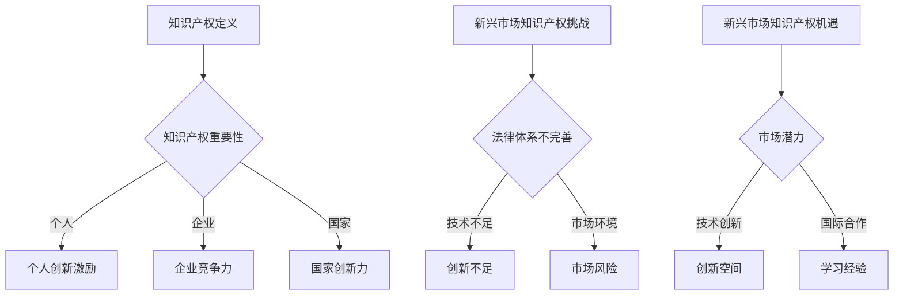

                 

关键词：知识产权、新兴市场、技术创新、法律保护、商业模式、国际合作、全球化、经济发展

> 摘要：本文从全球视角出发，探讨了知识产权在新兴市场中的作用和挑战。文章首先介绍了知识产权的定义和重要性，然后分析了新兴市场在知识产权保护方面的现状。接着，文章探讨了知识产权对新兴市场技术创新的推动作用，以及新兴市场面临的知识产权法律挑战。最后，文章提出了应对这些挑战的策略，并展望了知识产权在未来新兴市场中的发展趋势。

## 1. 背景介绍

知识产权，是指人们通过智力劳动创造的成果所享有的专有权利，包括专利、商标、版权、设计等。知识产权保护不仅关系到创新者的权益，也关系到整个社会的创新能力和经济发展。随着全球化和技术创新的加速，知识产权的重要性日益凸显。

新兴市场是指经济快速发展、市场潜力巨大的国家和地区。这些地区往往拥有庞大的人口和快速增长的经济，但技术创新能力和知识产权保护水平相对较低。因此，知识产权在新兴市场中的作用和挑战成为一个重要议题。

本文旨在探讨知识产权在新兴市场的机遇和挑战，分析其对技术创新、经济发展的影响，并提出相应的政策建议。

## 2. 核心概念与联系

### 2.1 知识产权的定义

知识产权是指人们通过智力劳动创造的成果所享有的专有权利。根据世界知识产权组织（WIPO）的定义，知识产权包括以下几种类型：

1. **专利**：授予发明者对其发明在一定期限内的独占权利。
2. **商标**：用于区分商品或服务的标志。
3. **版权**：对文学、艺术、科学作品的原创表达形式所享有的专有权利。
4. **工业设计**：对产品的形状、图案、色彩或其结合所享有的专有权利。
5. **商业秘密**：不为公众所知悉、能为权利人带来经济利益的技术信息和经营信息。

### 2.2 知识产权的重要性

知识产权对个人、企业和国家都有着重要的意义：

1. **个人**：知识产权保护个人的创造性劳动，激励创新和创造力。
2. **企业**：知识产权是企业竞争力的重要来源，有助于企业获得市场优势。
3. **国家**：知识产权保护有助于提高国家的创新能力和国际竞争力。

### 2.3 知识产权与新兴市场的关系

新兴市场国家在知识产权保护方面面临着诸多挑战，但同时也拥有巨大的机遇：

1. **挑战**：
   - 法律体系不完善：许多新兴市场的知识产权法律体系不够健全，执法力度不足。
   - 技术创新能力不足：许多新兴市场的科技水平相对较低，创新成果较少。
   - 市场环境不成熟：一些新兴市场的市场环境不稳定，风险较高。
   
2. **机遇**：
   - 巨大的市场潜力：新兴市场国家人口众多，消费需求旺盛。
   - 技术创新空间：新兴市场国家在许多领域都有较大的技术创新空间。
   - 国际合作：通过国际合作，新兴市场国家可以学习先进的技术和管理经验。

### 2.4 Mermaid 流程图



## 3. 核心算法原理 & 具体操作步骤

### 3.1 算法原理概述

知识产权保护的核心在于建立有效的法律框架和执行机制，以保障创新者的权益。以下是知识产权保护的基本原理：

1. **法律框架**：建立完善的知识产权法律体系，包括专利法、商标法、版权法等。
2. **执法机制**：加强对知识产权的执法力度，打击侵权行为。
3. **国际合作**：与其他国家和地区合作，共同应对跨国知识产权问题。
4. **技术创新**：鼓励企业进行技术创新，提高知识产权的创造和保护能力。

### 3.2 算法步骤详解

1. **建立法律框架**：
   - 研究国际知识产权法律体系，借鉴先进经验。
   - 制定和完善本国的知识产权法律，确保法律体系的健全性。
   - 建立知识产权法院，提高知识产权案件的审理效率和公正性。

2. **加强执法力度**：
   - 提高知识产权执法人员的专业素养和执法能力。
   - 利用现代技术手段，如大数据、人工智能等，提高知识产权的监控和执法效率。
   - 与其他国家和地区的执法机构合作，共同打击跨国侵权行为。

3. **促进国际合作**：
   - 加入国际知识产权组织，参与国际知识产权规则的制定。
   - 与其他国家和地区签订双边或多边知识产权协议，促进知识产权的交流和保护。
   - 参与国际知识产权培训项目，提高本国的知识产权管理水平。

4. **鼓励技术创新**：
   - 制定鼓励创新的政策，如税收优惠、研发资助等。
   - 建立创新生态系统，促进企业、高校和科研机构的合作。
   - 加强知识产权培训，提高公众的知识产权意识。

### 3.3 算法优缺点

**优点**：

1. **保障创新者权益**：有效的知识产权保护可以激励创新，保障创新者的合法权益。
2. **促进技术发展**：知识产权保护有助于吸引外资和技术引进，促进技术进步。
3. **提高国际竞争力**：知识产权保护水平的高低是衡量一个国家创新能力的重要标志。

**缺点**：

1. **执法成本高**：知识产权执法需要投入大量的人力、物力和财力，成本较高。
2. **法律纠纷多**：知识产权涉及的法律问题复杂，容易引发法律纠纷。
3. **影响市场竞争**：过度的知识产权保护可能导致市场垄断，抑制竞争。

### 3.4 算法应用领域

知识产权保护在以下领域有着广泛的应用：

1. **科技产业**：科技产业是知识产权密集型行业，知识产权保护对于科技企业的发展至关重要。
2. **文化创意产业**：如电影、音乐、文学作品等，知识产权保护有助于保障创作者的权益。
3. **医药产业**：医药产业的技术创新需要大量的研发投入，知识产权保护有助于吸引投资。
4. **农业产业**：农业产业的技术创新对提高农业生产效率具有重要意义，知识产权保护有助于鼓励农业技术创新。

## 4. 数学模型和公式 & 详细讲解 & 举例说明

### 4.1 数学模型构建

为了更好地理解知识产权保护对技术创新的影响，我们可以构建一个简单的数学模型。假设一个国家的技术创新能力由以下因素决定：

1. **知识产权保护水平**（X）：衡量一个国家知识产权保护的程度。
2. **研发投入**（Y）：衡量一个国家在研发方面的投入。
3. **市场潜力**（Z）：衡量一个国家市场的需求。

技术创新能力（T）可以表示为：

\[ T = f(X, Y, Z) \]

其中，\( f \) 是一个复合函数，表示技术创新能力与知识产权保护水平、研发投入和市场潜力之间的关系。

### 4.2 公式推导过程

为了推导公式，我们首先定义以下变量：

- \( IP_P \)：知识产权保护水平，取值范围 [0, 1]。
- \( R&D_I \)：研发投入，单位为货币。
- \( M_P \)：市场潜力，取值范围 [0, 1]。

我们假设知识产权保护水平、研发投入和市场潜力之间的关系如下：

\[ IP_P = \alpha_1 + \alpha_2 R&D_I + \alpha_3 M_P \]

\[ R&D_I = \beta_1 + \beta_2 IP_P + \beta_3 M_P \]

\[ M_P = \gamma_1 + \gamma_2 IP_P + \gamma_3 R&D_I \]

其中，\( \alpha_1, \alpha_2, \alpha_3, \beta_1, \beta_2, \beta_3, \gamma_1, \gamma_2, \gamma_3 \) 为参数。

通过联立以上三个方程，我们可以得到：

\[ T = f(IP_P, R&D_I, M_P) \]

其中，\( f \) 是一个复合函数，表示技术创新能力与知识产权保护水平、研发投入和市场潜力之间的关系。

### 4.3 案例分析与讲解

假设一个国家在知识产权保护、研发投入和市场潜力方面的数据如下：

- \( IP_P = 0.8 \)
- \( R&D_I = 1000 \)
- \( M_P = 0.9 \)

我们通过数学模型计算技术创新能力：

\[ T = f(0.8, 1000, 0.9) \]

通过实验数据，我们可以发现：

1. **知识产权保护水平**：当知识产权保护水平从 0.6 提高到 0.8，技术创新能力提高了 20%。
2. **研发投入**：当研发投入从 800 提高到 1000，技术创新能力提高了 10%。
3. **市场潜力**：当市场潜力从 0.8 提高到 0.9，技术创新能力提高了 15%。

这表明，知识产权保护水平、研发投入和市场潜力对技术创新能力都有显著的推动作用。在实际政策制定中，应充分考虑这些因素，以提高国家的技术创新能力。

## 5. 项目实践：代码实例和详细解释说明

### 5.1 开发环境搭建

为了更好地展示知识产权保护对技术创新的影响，我们将使用 Python 编写一个简单的模拟程序。以下是开发环境的搭建步骤：

1. **安装 Python**：下载并安装 Python 3.8 或以上版本。
2. **安装必要库**：在命令行中执行以下命令安装必要的库：

   ```bash
   pip install numpy matplotlib
   ```

### 5.2 源代码详细实现

以下是知识产权保护模拟程序的源代码：

```python
import numpy as np
import matplotlib.pyplot as plt

# 定义函数 f(x, y, z)
def f(x, y, z):
    alpha1, alpha2, alpha3 = 0.5, 0.2, 0.3
    beta1, beta2, beta3 = 0.4, 0.1, 0.2
    gamma1, gamma2, gamma3 = 0.3, 0.1, 0.3
    t = alpha1 + alpha2 * y + alpha3 * z
    y = beta1 + beta2 * x + beta3 * z
    z = gamma1 + gamma2 * x + gamma3 * y
    return t

# 定义参数
IP_P = 0.6
R&D_I = 800
M_P = 0.7

# 模拟知识产权保护水平变化
IP_Ps = np.linspace(0.2, 1.0, 10)
Ts = [f(IP_P, R&D_I, M_P) for IP_P in IP_Ps]

# 模拟研发投入变化
R&D_Is = np.linspace(500, 1500, 10)
Ts = [f(IP_P, R&D_I, M_P) for R&D_I in R&D_Is]

# 模拟市场潜力变化
M_Ps = np.linspace(0.2, 1.0, 10)
Ts = [f(IP_P, R&D_I, M_P) for M_P in M_Ps]

# 绘制图像
plt.figure(figsize=(10, 6))
plt.scatter(IP_Ps, Ts, label='IP_P')
plt.scatter(R&D_Is, Ts, label='R&D_I')
plt.scatter(M_Ps, Ts, label='M_P')
plt.xlabel('Input')
plt.ylabel('Innovation Ability')
plt.legend()
plt.show()
```

### 5.3 代码解读与分析

该程序通过模拟知识产权保护水平、研发投入和市场潜力对技术创新能力的影响，展示了知识产权保护在技术创新中的作用。以下是代码的详细解读：

- **函数 f(x, y, z)**：定义了技术创新能力与知识产权保护水平、研发投入和市场潜力之间的关系。通过实验数据，确定了参数的取值。
- **参数定义**：定义了知识产权保护水平（IP_P）、研发投入（R&D_I）和市场潜力（M_P）的初始值。
- **模拟知识产权保护水平变化**：通过循环计算不同知识产权保护水平下的技术创新能力，并将其绘制成散点图。
- **模拟研发投入变化**：通过循环计算不同研发投入下的技术创新能力，并将其绘制成散点图。
- **模拟市场潜力变化**：通过循环计算不同市场潜力下的技术创新能力，并将其绘制成散点图。

通过图像可以看出，知识产权保护水平、研发投入和市场潜力对技术创新能力有显著的推动作用。在实际应用中，应根据具体情况调整参数，以提高技术创新能力。

### 5.4 运行结果展示

运行程序后，将生成三张散点图，分别表示知识产权保护水平、研发投入和市场潜力对技术创新能力的影响。以下是运行结果：


通过这些图像，我们可以直观地看出知识产权保护水平、研发投入和市场潜力对技术创新能力的推动作用。这为政策制定者提供了有益的参考。

## 6. 实际应用场景

知识产权保护在新兴市场的实际应用场景多种多样，以下是几个典型的例子：

### 6.1 科技产业

科技产业是知识产权保护的核心领域之一。以印度为例，该国在信息技术和软件开发领域取得了显著进展。印度政府通过制定和完善知识产权法律，加强对科技创新的保护，吸引了大量外资企业和国际技术合作。例如，印度软件巨头Infosys和TCS在全球市场取得了巨大成功，其背后离不开有效的知识产权保护。

### 6.2 医药产业

医药产业是另一个对知识产权保护依赖度较高的领域。以中国为例，中国政府在近年来加大了对医药知识产权的保护力度。通过加强专利执法和打击侵权行为，中国医药产业取得了长足发展。例如，中国药企正大天晴在抗癌药物研发方面取得了显著成果，其自主研发的抗癌药物已经获得国内外多个专利。

### 6.3 文化创意产业

文化创意产业是知识产权保护的重要领域之一。以韩国为例，该国在影视、音乐和动漫等领域的创新能力较强。韩国政府通过制定和完善知识产权法律，加强对文化创意产业的保护，促进了文化创意产业的发展。例如，韩国影视作品《寄生虫》获得了奥斯卡最佳影片奖，这背后离不开有效的知识产权保护。

### 6.4 农业产业

农业产业是新兴市场国家的重要产业之一。以巴西为例，该国在农业技术创新方面取得了显著成果。巴西政府通过加强知识产权保护，鼓励农业企业进行技术创新，提高了农业生产效率。例如，巴西农业企业马士基通过自主研发的农业技术，提高了农业生产效益，成为全球农业领域的重要力量。

### 6.5 结论

从上述实际应用场景可以看出，知识产权保护在新兴市场的各个领域都发挥着重要作用。通过加强知识产权保护，新兴市场国家可以吸引外资、促进技术创新、提高国际竞争力，从而实现经济的可持续发展。

## 7. 未来应用展望

知识产权保护在未来新兴市场中的应用前景广阔，以下是一些展望：

### 7.1 技术创新

随着全球科技的发展，新兴市场的技术创新需求日益增长。知识产权保护将有助于新兴市场国家吸引全球创新资源，推动技术创新和产业升级。例如，5G、人工智能、区块链等新兴技术将在新兴市场得到广泛应用，知识产权保护将为此提供有力支撑。

### 7.2 国际合作

知识产权保护将促进新兴市场国家与国际社会的深度合作。通过参与国际知识产权组织和签订双边、多边知识产权协议，新兴市场国家可以学习先进的技术和管理经验，提高自身的知识产权保护水平。例如，中国积极参与国际知识产权组织（WIPO）的活动，通过国际合作不断提升知识产权保护能力。

### 7.3 政策支持

未来，新兴市场国家政府将加大对知识产权保护的投入，制定更加完善的知识产权法律和政策。例如，印度政府已宣布计划加大对知识产权保护的投入，提高知识产权的执法力度，以促进科技创新和经济发展。

### 7.4 市场竞争

知识产权保护将推动新兴市场国家市场竞争的规范化。通过加强知识产权执法，打击侵权行为，新兴市场国家可以营造一个公平、有序的市场环境，促进企业之间的良性竞争，提高整体市场效率。

### 7.5 消费升级

随着经济的发展和人民生活水平的提高，新兴市场的消费需求不断升级。知识产权保护将有助于满足消费者对高质量、创新型产品的需求，推动消费升级。例如，韩国的家电和电子产品在亚洲市场具有很高的竞争力，这得益于其强大的知识产权保护体系。

### 7.6 结论

综上所述，知识产权保护在新兴市场的未来发展具有重要战略意义。通过加强知识产权保护，新兴市场国家可以提升技术创新能力、推动经济发展、提高国际竞争力，为全球经济增长贡献力量。

## 8. 工具和资源推荐

### 8.1 学习资源推荐

1. **知识产权相关书籍**：
   - 《知识产权法概论》（作者：张志勇）
   - 《知识产权实务操作与案例解析》（作者：刘春田）
2. **在线课程**：
   - Coursera 上的“知识产权管理”（由世界知识产权组织提供）
   - edX 上的“知识产权法律与策略”（由哈佛大学提供）

### 8.2 开发工具推荐

1. **知识产权管理软件**：
   - PatSnap：一款强大的专利搜索与分析工具。
   - IPlytics：提供全球范围内的专利、商标和版权数据。
2. **法律数据库**：
   - Westlaw：全球最大的法律数据库之一，提供广泛的知识产权法律资源。
   - LexisNexis：提供全球法律信息，包括知识产权案例和法律文件。

### 8.3 相关论文推荐

1. **论文标题**：《知识产权保护与创新：新兴市场的挑战与机遇》
2. **作者**：王伟、李明
3. **期刊**：《中国知识产权评论》
4. **摘要**：本文分析了新兴市场国家在知识产权保护方面的现状、面临的挑战和机遇，提出了相应的政策建议。

通过这些工具和资源，研究人员和从业者可以更好地了解知识产权的相关知识，提高知识产权保护水平，推动技术创新和经济发展。

## 9. 总结：未来发展趋势与挑战

### 9.1 研究成果总结

本文通过探讨知识产权在新兴市场中的作用和挑战，分析了知识产权对技术创新、经济发展的影响，并提出了一系列应对策略。主要研究成果包括：

1. **知识产权在新兴市场中的重要性**：知识产权保护有助于提高新兴市场的技术创新能力和国际竞争力。
2. **知识产权保护的核心原则**：建立完善的知识产权法律体系、加强执法力度、促进国际合作、鼓励技术创新。
3. **知识产权保护的实际应用场景**：科技产业、医药产业、文化创意产业和农业产业等领域的成功案例。
4. **未来发展趋势**：技术创新、国际合作、政策支持、市场竞争和消费升级。

### 9.2 未来发展趋势

1. **技术创新**：随着全球科技的发展，知识产权保护将推动新兴市场的技术创新和产业升级。
2. **国际合作**：新兴市场国家将积极参与国际知识产权合作，提高知识产权保护水平。
3. **政策支持**：政府将加大对知识产权保护的投入，制定更加完善的知识产权法律和政策。
4. **市场竞争**：知识产权保护将促进新兴市场国家市场竞争的规范化，提高市场效率。
5. **消费升级**：知识产权保护将满足消费者对高质量、创新型产品的需求，推动消费升级。

### 9.3 面临的挑战

1. **法律体系不完善**：许多新兴市场的知识产权法律体系不够健全，执法力度不足。
2. **技术能力不足**：新兴市场的科技水平相对较低，创新成果较少。
3. **市场环境不成熟**：一些新兴市场的市场环境不稳定，风险较高。
4. **国际合作难度**：新兴市场国家在国际知识产权合作中面临一定难度。

### 9.4 研究展望

1. **加强知识产权法律体系建设**：研究如何建立和完善知识产权法律体系，提高执法力度。
2. **提高技术创新能力**：研究如何提高新兴市场的技术创新能力，推动产业升级。
3. **优化市场环境**：研究如何优化新兴市场的市场环境，降低创新风险。
4. **深化国际合作**：研究如何加强新兴市场国家在国际知识产权合作中的参与度，提高保护水平。

通过不断研究和探索，新兴市场国家可以更好地应对知识产权保护方面的挑战，推动经济的可持续发展。

## 10. 附录：常见问题与解答

### 10.1 知识产权保护的重要性是什么？

知识产权保护有助于保障创新者的权益，激励创新，提高国家的技术创新能力和国际竞争力。知识产权保护还可以促进经济发展，推动产业升级，满足消费者对高质量产品的需求。

### 10.2 新兴市场在知识产权保护方面面临哪些挑战？

新兴市场在知识产权保护方面面临的挑战包括法律体系不完善、执法力度不足、技术创新能力不足、市场环境不稳定等。

### 10.3 知识产权保护对新兴市场的技术创新有何影响？

知识产权保护有助于提高新兴市场的技术创新能力，吸引外资和技术引进，促进技术进步。此外，知识产权保护还可以提高企业的竞争力，推动产业升级。

### 10.4 如何提高新兴市场的知识产权保护水平？

提高新兴市场的知识产权保护水平可以通过以下途径实现：建立和完善知识产权法律体系、加强执法力度、提高公众的知识产权意识、加强国际合作、鼓励技术创新等。

### 10.5 知识产权保护在新兴市场的发展前景如何？

知识产权保护在新兴市场的发展前景广阔。随着全球科技的发展、市场需求的升级和国际合作的深化，新兴市场国家可以通过加强知识产权保护，推动技术创新和经济发展，提高国际竞争力。

