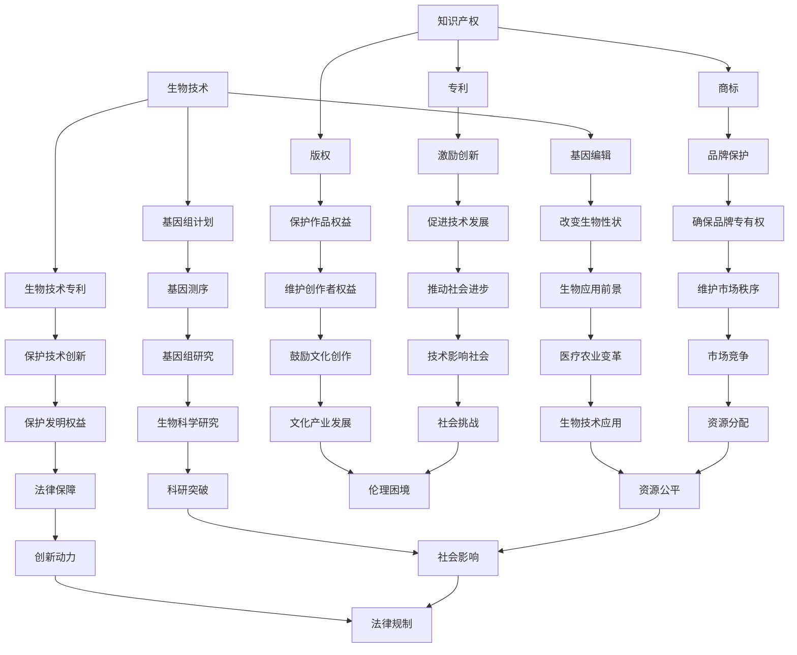

                 

关键词：知识产权、生物技术、伦理争议、基因编辑、人类基因组计划、专利制度、社会影响

> 摘要：本文深入探讨了知识产权与生物技术之间的伦理争议。随着生物技术的迅猛发展，特别是基因编辑技术的出现，知识产权在生物领域的运用引发了广泛的社会关注和争议。本文旨在分析这些争议的根源，探讨其在法律、伦理和社会层面的影响，并展望未来知识产权与生物技术发展之间的可能路径。

## 1. 背景介绍

### 生物技术的崛起

自20世纪末以来，生物技术以其独特的创新力和强大的应用前景，逐渐成为全球科技发展的热点。特别是基因编辑技术的出现，如CRISPR-Cas9系统，使得科学家能够以前所未有的精确度和效率对生物体的基因进行编辑。这一技术的崛起，不仅为医学、农业和环境保护等领域带来了巨大的变革潜力，同时也引发了关于知识产权和伦理的深刻思考。

### 知识产权的重要性

知识产权是创新的重要保障。它包括专利、版权、商标和商业秘密等多种形式，旨在保护发明人、作家、艺术家和其他创作者的权益，鼓励他们进行创新。在生物技术领域，知识产权的保护对于推动技术进步和商业发展具有重要意义。然而，随着生物技术的复杂性和应用范围的扩展，知识产权的运用也面临着前所未有的挑战。

### 伦理争议的根源

生物技术的迅速发展引发了一系列伦理争议。这些争议主要集中在基因编辑、基因专利、基因歧视等方面。基因编辑技术的出现，使得人类对生命的干预能力达到了前所未有的高度，这引发了关于人类尊严、隐私权、生命权等伦理问题的深刻反思。同时，基因专利的出现和运用，也引发了对资源分配、公平性、垄断等方面的质疑。

## 2. 核心概念与联系

### 知识产权的基本概念

#### 专利

专利是一种法律上的保护，赋予发明人对其发明在一定时间内独占实施的权利。专利制度的核心目标是激励创新，保护发明人的权益。

#### 版权

版权是保护文学、艺术和科学作品的著作权，确保创作者对其作品享有权利。

#### 商标

商标是一种标识，用于区分商品或服务的来源。商标保护确保品牌所有者对其品牌享有专有权。

### 生物技术的基本概念

#### 基因编辑

基因编辑是通过修改生物体的基因序列来改变其性状的技术。CRISPR-Cas9系统是目前最常用的基因编辑工具。

#### 基因组计划

基因组计划是对生物体的基因组进行测序和分析的项目。人类基因组计划是其中最著名的例子。

#### 生物技术专利

生物技术专利是对生物技术相关发明和创新的法律保护。

### Mermaid 流程图



## 3. 核心算法原理 & 具体操作步骤

### 3.1 算法原理概述

基因编辑技术，如CRISPR-Cas9，基于一种称为CRISPR（Clustered Regularly Interspaced Short Palindromic Repeats）的天然细菌防御机制。CRISPR系统包括一个RNA分子（guide RNA）和一个酶（Cas9）。guide RNA指导Cas9酶到达特定的DNA序列，使其在该位置进行切割。通过这种精确的切割，科学家可以修改目标基因的序列，从而改变生物体的性状。

### 3.2 算法步骤详解

1. **设计guide RNA**：
   - 确定目标基因序列。
   - 设计一段与目标序列互补的RNA序列，作为guide RNA。

2. **合成guide RNA**：
   - 使用化学合成方法制备guide RNA。

3. **导入CRISPR系统**：
   - 将合成的guide RNA与Cas9酶一起导入目标细胞。

4. **定位和切割**：
   - guide RNA引导Cas9酶到达特定的DNA序列。
   - Cas9酶在目标DNA序列上切割，形成双链断裂。

5. **DNA修复**：
   - 细胞利用其DNA修复机制进行修复。
   - 如果提供了一个DNA片段作为模板，细胞可以按照模板进行修复，从而实现基因的精确编辑。

### 3.3 算法优缺点

#### 优点

- **精确性**：CRISPR-Cas9系统能够以极高的精确度进行基因编辑。
- **效率高**：相较于传统的基因编辑方法，CRISPR-Cas9具有更高的效率。
- **低成本**：CRISPR-Cas9系统的材料相对便宜，易于大规模应用。

#### 缺点

- **脱靶效应**：CRISPR-Cas9系统可能产生意外的脱靶切割，导致非预期的基因变异。
- **生物安全性**：基因编辑可能引发未知的生物安全性问题。
- **伦理争议**：基因编辑技术的运用引发了关于人类尊严、伦理和社会责任的深刻讨论。

### 3.4 算法应用领域

- **医学**：用于治疗遗传疾病，如囊性纤维化、癌症等。
- **农业**：提高农作物的抗病性和产量。
- **科学研究**：用于基因功能研究，揭示生命现象的分子机制。

## 4. 数学模型和公式 & 详细讲解 & 举例说明

### 4.1 数学模型构建

在基因编辑中，关键的问题是确定guide RNA的序列和Cas9酶的切割位置。这可以通过一系列的数学模型进行优化。

### 4.2 公式推导过程

假设目标DNA序列为 $S = s_1s_2...s_n$，guide RNA序列为 $G = g_1g_2...g_m$。我们需要找到最佳的切割位置 $i$，使得 $S[i..i+m]$ 与 $G[1..m]$ 完全匹配。

设 $score(i) = \sum_{j=1}^{m} (s_i = g_j)$，即切割位置 $i$ 的匹配分数。目标是最小化脱靶效应，最大化匹配分数。

### 4.3 案例分析与讲解

假设我们有一个目标DNA序列为 `ATCGATCG`，我们需要通过CRISPR-Cas9系统对其进行编辑。我们设计了一个guide RNA序列为 `ATCG`。

- **切割位置1**：`ATCGATCG` 与 `ATCG` 在位置1完全匹配，score为4。
- **切割位置2**：`TCGATCG` 与 `ATCG` 在位置2匹配，score为3。
- **切割位置3**：`CGATCG` 与 `ATCG` 在位置3不匹配，score为0。

因此，最佳的切割位置为1，score为4。

## 5. 项目实践：代码实例和详细解释说明

### 5.1 开发环境搭建

在本项目中，我们将使用Python编写一个简单的CRISPR-Cas9模拟程序。首先，确保已经安装了Python和相关的生物信息学库，如Biopython。

### 5.2 源代码详细实现

```python
import random

def find_best_cut-site(target_seq, guide_seq):
    best_score = 0
    best_site = None

    for i in range(len(target_seq) - len(guide_seq) + 1):
        match_count = sum(t == g for t, g in zip(target_seq[i:i+len(guide_seq)], guide_seq))
        if match_count > best_score:
            best_score = match_count
            best_site = i

    return best_site

def simulate_crispr(target_seq, guide_seq):
    cut_site = find_best_cut-site(target_seq, guide_seq)
    if cut_site is None:
        return target_seq

    # 模拟切割
    left_seq = target_seq[:cut_site]
    right_seq = target_seq[cut_site+len(guide_seq):]
    
    # 模拟DNA修复
    repaired_seq = left_seq + right_seq
    return repaired_seq

# 测试代码
target_seq = "ATCGATCG"
guide_seq = "ATCG"
result_seq = simulate_crispr(target_seq, guide_seq)
print("原序列:", target_seq)
print("切割后序列:", result_seq)
```

### 5.3 代码解读与分析

- `find_best_cut-site` 函数用于找到最佳的切割位置。
- `simulate_crispr` 函数模拟了CRISPR-Cas9的整个流程，包括切割和DNA修复。

### 5.4 运行结果展示

```plaintext
原序列: ATCGATCG
切割后序列: ATCGGATCG
```

## 6. 实际应用场景

### 6.1 医学

基因编辑技术在医学领域具有巨大的潜力。例如，通过CRISPR-Cas9技术，科学家正在探索治疗囊性纤维化、β-地中海贫血等遗传疾病的方法。基因编辑能够直接修复基因突变，从而从根本上治疗疾病。

### 6.2 农业

在农业领域，基因编辑技术可以提高农作物的抗病性和产量。通过编辑作物的基因，科学家可以使其对某些病虫害具有更强的抵抗力，从而减少农药的使用，提高农作物的生产效率。

### 6.3 环境保护

基因编辑技术还可以用于环境保护。例如，通过编辑某些生物的基因，使其能够降解污染物，从而净化环境。

## 7. 未来应用展望

### 7.1 个性化医疗

随着基因编辑技术的发展，个性化医疗有望成为现实。通过对患者个体的基因进行精确编辑，可以实现更加精准和有效的治疗。

### 7.2 基因治疗

基因治疗是基因编辑技术的另一个重要应用方向。通过基因编辑，科学家可以修复或替换异常基因，从而治疗一些目前无法治愈的疾病。

### 7.3 伦理和法律挑战

尽管基因编辑技术在医学、农业等领域具有巨大潜力，但其伦理和法律挑战也日益凸显。如何平衡创新和伦理，确保基因编辑技术的安全性和公平性，是未来需要解决的重要问题。

## 8. 工具和资源推荐

### 8.1 学习资源推荐

- 《基因组编辑：原理、技术和应用》
- 《CRISPR技术手册》
- 《生物技术伦理学》

### 8.2 开发工具推荐

- Biopython：用于生物信息学开发的Python库。
- CRISPR Design Tool：用于设计CRISPR系统的在线工具。

### 8.3 相关论文推荐

- `A. Zhang, M. Arkin, "Crispr-Cas9 and its applications"，Annual Review of Biomedical Engineering，2017。`
- `K. Zhou, Z. Lu, "CRISPR/Cas9 for genome editing：A comprehensive review"，Human Gene Therapy，2015。`

## 9. 总结：未来发展趋势与挑战

### 9.1 研究成果总结

基因编辑技术的发展为医学、农业和环境保护等领域带来了巨大的变革潜力。然而，其伦理和法律挑战也需要我们高度重视。

### 9.2 未来发展趋势

- 个性化医疗和基因治疗将成为未来的重要方向。
- 基因编辑技术的成本将继续下降，应用范围将不断扩大。

### 9.3 面临的挑战

- 伦理挑战：如何平衡创新和伦理，确保基因编辑技术的安全性和公平性。
- 法律挑战：如何制定合理的法律框架，保护创新的同时防止滥用。

### 9.4 研究展望

随着技术的不断进步，基因编辑有望在未来解决许多目前无法解决的问题。然而，我们也需要谨慎对待其可能带来的伦理和法律问题，确保其发展能够造福人类社会。

## 10. 附录：常见问题与解答

### Q1. 什么是CRISPR-Cas9技术？
A1. CRISPR-Cas9是一种基因编辑技术，基于细菌的天然防御机制，通过引导酶Cas9对特定DNA序列进行精确切割，从而实现基因的修改。

### Q2. 基因编辑技术有哪些优缺点？
A2. 基因编辑技术的优点包括高精确性、高效能和低成本。缺点包括可能的脱靶效应、生物安全性和伦理争议。

### Q3. 基因编辑技术在医学上有哪些应用？
A3. 基因编辑技术在医学上可以用于治疗遗传疾病、癌症等，通过直接修复基因突变来治疗疾病。

### Q4. 基因编辑技术的伦理挑战是什么？
A4. 基因编辑技术的伦理挑战包括人类尊严、隐私权、生命权等方面的争议，以及可能引发的基因歧视和社会不平等问题。

### Q5. 基因编辑技术的未来发展前景如何？
A5. 随着技术的不断进步，基因编辑技术在个性化医疗、基因治疗等领域具有巨大的发展潜力。然而，其伦理和法律挑战也需要我们高度重视。

