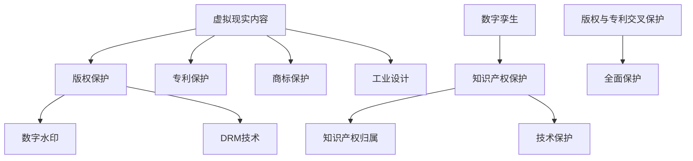

                 

关键词：知识产权，虚拟现实技术，版权保护，创新，法律框架，技术标准，数字孪生，区块链，隐私保护。

> 摘要：本文深入探讨了知识产权与虚拟现实技术的融合，分析了两者之间的相互作用及其对技术创新和产业发展的潜在影响。通过梳理现有法律法规和技术手段，探讨了如何实现虚拟现实内容的版权保护和知识产权的有效管理，为未来虚拟现实产业的发展提供了理论和实践指导。

## 1. 背景介绍

随着信息技术的快速发展，虚拟现实（VR）技术逐渐成为热门话题。虚拟现实技术通过计算机模拟出一个接近真实世界的三维空间，用户可以在这个空间中通过视觉、听觉等多种感官进行交互，从而获得沉浸式的体验。这种技术的兴起，不仅改变了娱乐和教育的形式，也为各行各业带来了新的发展机遇。

知识产权（IPR）是保护创新成果的重要法律制度。它涵盖了专利、版权、商标等多个方面，旨在激励创新、保护合法权益。然而，虚拟现实技术的出现，给知识产权的保护带来了新的挑战。虚拟现实内容具有高度的数字化和易复制性，传统的知识产权保护手段难以应对这些问题。

本文旨在探讨知识产权与虚拟现实技术的融合，分析两者之间的相互作用，提出有效的知识产权保护策略，以促进虚拟现实技术的健康发展。

### 1.1 虚拟现实技术的定义与现状

虚拟现实技术（Virtual Reality，VR）是一种通过计算机生成模拟环境，利用传感技术和显示设备，使用户在虚拟环境中获得沉浸式体验的技术。VR技术的核心在于创建一个虚拟的三维空间，用户可以通过头戴显示器（HMD）、手柄、全身追踪设备等设备在这个空间中自由移动、交互。

近年来，虚拟现实技术取得了显著进展。从最初的简单三维模型，发展到现在的复杂三维场景和实时渲染技术，VR技术在图像质量、交互体验、设备舒适度等方面都有了极大的提升。根据市场调研公司Statista的数据，全球VR市场规模预计将在未来几年内持续增长，到2025年可能达到数百亿美元。

虚拟现实技术的应用领域也非常广泛，包括游戏、教育、医疗、建筑、军事、旅游等。例如，在游戏领域，VR技术提供了前所未有的沉浸式体验，让玩家仿佛置身于游戏世界中。在教育领域，VR技术可以模拟历史事件、科学实验等，为学生提供更直观的学习体验。在医疗领域，VR技术可以用于手术模拟、康复训练等，提高医疗服务的质量和效率。

### 1.2 知识产权的定义与现状

知识产权（Intellectual Property Rights，IPR）是指基于人类智力劳动成果所产生的权利。它主要包括专利、版权、商标、工业设计、集成电路布图设计、地理标志等。知识产权制度的目的是激励创新，保护知识产权权利人的合法权益，促进科技进步和文化繁荣。

目前，全球知识产权保护体系已经相对完善。许多国家都制定了相应的知识产权法律法规，并成立了专门的知识产权管理机构。例如，美国的专利和商标局（USPTO）、欧洲的知识产权局（EUIPO）、中国的国家知识产权局等。

然而，随着虚拟现实技术的发展，知识产权保护面临新的挑战。虚拟现实内容的数字化和易复制性使得传统的知识产权保护手段难以发挥作用。此外，虚拟现实技术的跨国性也使得知识产权保护变得更加复杂。如何在虚拟现实领域实现有效的知识产权保护，成为当前亟待解决的问题。

## 2. 核心概念与联系

在探讨知识产权与虚拟现实技术的融合之前，有必要明确一些核心概念及其相互关系。

### 2.1 虚拟现实内容的版权保护

版权（Copyright）是知识产权的重要组成部分，主要保护作者对其创作的文学、艺术和科学作品所享有的权利。在虚拟现实领域，版权保护的对象包括三维模型、动画、音效、程序代码等。

虚拟现实内容的版权保护面临以下挑战：

1. **高度数字化**：虚拟现实内容以数字形式存在，易于复制和传播。
2. **复杂结构**：虚拟现实内容通常包含多种元素，如模型、纹理、音效等，这些元素的版权归属和使用权管理复杂。
3. **跨国性**：虚拟现实内容的创作者和用户可能分布在不同的国家和地区，不同国家的版权法律可能存在差异。

为了解决这些挑战，可以采取以下措施：

1. **数字水印**：在虚拟现实内容中加入不可见的数字水印，以证明创作者的版权。
2. **技术保护措施**：如DRM（数字版权管理）技术，限制虚拟现实内容的复制和传播。
3. **国际合作协议**：加强各国之间的知识产权保护合作，制定统一的版权保护标准。

### 2.2 虚拟现实技术的知识产权保护

除了版权，虚拟现实技术本身也受到知识产权保护。这包括：

1. **专利**：保护虚拟现实技术的创新点和发明，如新型设备、算法等。
2. **商标**：保护虚拟现实产品的品牌名称和标识。
3. **工业设计**：保护虚拟现实设备的造型和外观设计。

在虚拟现实技术的知识产权保护方面，需要注意以下问题：

1. **专利侵权**：由于虚拟现实技术的复杂性和多样性，专利侵权问题较为普遍。
2. **商标混淆**：不同公司的虚拟现实产品可能存在商标相似，导致市场混淆。
3. **法律适用**：不同国家和地区的知识产权法律可能存在差异，需要充分考虑法律适用问题。

### 2.3 数字孪生与知识产权

数字孪生（Digital Twin）是一种新兴技术，它通过创建物理实体的虚拟副本，实现实体与虚拟环境的联动。在虚拟现实技术中，数字孪生可以用于：

1. **产品设计**：通过虚拟现实环境模拟和测试产品设计的可行性和性能。
2. **生产管理**：通过数字孪生监控和优化生产线，提高生产效率。
3. **维护与维修**：通过虚拟现实技术模拟设备运行状态，预测故障并进行远程维修。

数字孪生与知识产权的关系主要体现在：

1. **知识产权归属**：数字孪生模型是基于物理实体创建的，其知识产权归属需要明确。
2. **技术保护**：需要保护数字孪生技术的创新点和知识产权。

### 2.4 版权与专利的交叉保护

在虚拟现实领域，版权和专利可能同时存在。例如，一个虚拟现实游戏中的角色设计和游戏机制，既可能构成版权保护的对象，也可能申请专利。这种交叉保护有助于全面保护虚拟现实内容的知识产权。

### 2.5 Mermaid 流程图

下面是知识产权与虚拟现实技术融合的 Mermaid 流程图，用于展示核心概念和相互关系：



## 3. 核心算法原理 & 具体操作步骤

### 3.1 算法原理概述

在虚拟现实内容的知识产权保护中，核心算法主要涉及数字水印、DRM技术和区块链应用。以下将分别介绍这些算法的原理和具体操作步骤。

### 3.2 数字水印算法

#### 3.2.1 原理

数字水印是一种将特定信息嵌入到数字媒体中的技术，通常用于版权保护和内容认证。在虚拟现实内容中，数字水印可以嵌入到三维模型、纹理、音效等元素中，以证明创作者的版权。

#### 3.2.2 操作步骤

1. **选择水印算法**：选择适合的数字水印算法，如扩频水印、离散余弦变换（DCT）水印等。
2. **生成水印信息**：根据创作者信息、版权声明等生成水印信息。
3. **嵌入水印**：将水印信息嵌入到虚拟现实内容中，如三维模型的纹理图、音效文件等。
4. **检测水印**：在虚拟现实内容被使用或传播时，检测水印信息，以验证版权。

### 3.3 DRM技术

#### 3.3.1 原理

数字版权管理（DRM）技术是一种通过技术手段限制数字内容访问和使用的技术，用于防止未经授权的复制和传播。在虚拟现实技术中，DRM可以用于限制内容的下载、播放和使用。

#### 3.3.2 操作步骤

1. **选择DRM系统**：根据需求选择适合的DRM系统，如Fairplay、PlayReady等。
2. **内容加密**：使用DRM系统对虚拟现实内容进行加密。
3. **用户认证**：对用户进行认证，确保只有授权用户可以访问和播放加密内容。
4. **内容解密**：在用户认证通过后，对加密内容进行解密，供用户使用。

### 3.4 区块链应用

#### 3.4.1 原理

区块链是一种分布式账本技术，具有去中心化、不可篡改、透明等特点。在虚拟现实领域的知识产权保护中，区块链可以用于记录和验证版权信息，实现版权的透明化和可信化。

#### 3.4.2 操作步骤

1. **构建区块链网络**：构建用于版权保护的区块链网络，包括版权方、用户、交易平台等。
2. **记录版权信息**：将虚拟现实内容的版权信息记录在区块链上，如创作者、版权期限等。
3. **验证版权信息**：用户在获取虚拟现实内容时，可以通过区块链验证版权信息的真实性。
4. **智能合约执行**：通过智能合约实现版权交易的自动化和规范化，如版权授权、转让等。

### 3.5 算法优缺点

#### 数字水印

- 优点：非破坏性，不易被移除，可以用于多种数字媒体。
- 缺点：水印的嵌入和检测需要计算资源，可能影响内容性能。

#### DRM技术

- 优点：可以有效防止未经授权的复制和传播，保护版权。
- 缺点：用户使用体验可能受到影响，需要复杂的用户认证和管理系统。

#### 区块链

- 优点：去中心化，透明，不可篡改，有助于建立可信的版权保护机制。
- 缺点：交易速度较慢，可能需要较高的计算资源。

### 3.6 算法应用领域

- 数字水印：适用于需要保护版权的虚拟现实内容，如游戏、影视等。
- DRM技术：适用于各种数字内容，包括虚拟现实、电子书、音乐等。
- 区块链：适用于需要高透明度和可信性的版权保护场景，如艺术品收藏、知识产权管理等。

## 4. 数学模型和公式 & 详细讲解 & 举例说明

在知识产权与虚拟现实技术的融合中，数学模型和公式起着至关重要的作用。它们不仅用于描述虚拟现实内容的版权保护机制，还用于评估和优化这些机制的效能。以下是几个关键数学模型和公式的详细讲解及其应用实例。

### 4.1 数学模型构建

#### 4.1.1 数字水印嵌入模型

数字水印嵌入模型用于将水印信息嵌入到虚拟现实内容中。常见的模型包括：

1. **扩频水印模型**：

\[ W = s \times (1 + m \times W') \]

其中，\( W \) 是水印图像，\( s \) 是扩频系数，\( m \) 是嵌入强度，\( W' \) 是原始图像。

2. **离散余弦变换（DCT）水印模型**：

\[ DCT(W) = DCT(S) + m \times DCT(W') \]

其中，\( DCT \) 表示离散余弦变换，\( S \) 是原始图像，\( W' \) 是水印图像，\( m \) 是嵌入强度。

#### 4.1.2 数字水印检测模型

数字水印检测模型用于检测嵌入的水印信息，以验证版权。

1. **相关检测模型**：

\[ Corr(W, W') = \frac{\sum(W \times W')}{\sqrt{\sum W^2 \times \sum W'^2}} \]

其中，\( Corr \) 表示相关度，\( W \) 是水印图像，\( W' \) 是检测图像。

2. **能量检测模型**：

\[ Energy(W) = \sum(W^2) \]

其中，\( Energy \) 表示能量，用于评估水印的强度。

### 4.2 公式推导过程

以下是数字水印嵌入和检测公式的推导过程：

#### 4.2.1 扩频水印嵌入公式推导

假设水印图像为 \( W' \)，原始图像为 \( S \)，扩频水印图像为 \( W \)。

1. **水印图像计算**：

\[ W' = S + m \times (1 - S) \]

其中，\( m \) 是嵌入强度。

2. **扩频系数计算**：

\[ s = \frac{1}{1 - m} \]

将 \( W' \) 代入扩频公式：

\[ W = s \times (1 + m \times W') \]

#### 4.2.2 DCT 水印嵌入公式推导

1. **原始图像 DCT 变换**：

\[ DCT(S) = \sum_{i=0}^{N-1} \sum_{j=0}^{N-1} S(i, j) \times \cos\left(\frac{2i\pi}{N} + \frac{2j\pi}{N}\right) \]

2. **水印图像 DCT 变换**：

\[ DCT(W') = \sum_{i=0}^{N-1} \sum_{j=0}^{N-1} W'(i, j) \times \cos\left(\frac{2i\pi}{N} + \frac{2j\pi}{N}\right) \]

3. **嵌入公式**：

\[ DCT(W) = DCT(S) + m \times DCT(W') \]

### 4.3 案例分析与讲解

#### 4.3.1 数字水印案例

假设有一个三维模型，其纹理图像为 \( S \)，水印图像为 \( W' \)。我们使用扩频水印模型将水印嵌入到纹理图像中。

1. **计算水印图像**：

假设水印信息为“ Creator: XYZ Company”，其数字表示为 \( W' = [11001101] \)。

2. **计算扩频系数**：

假设嵌入强度 \( m = 0.1 \)，则扩频系数 \( s = \frac{1}{1 - 0.1} = 1.11 \)。

3. **嵌入水印**：

\[ W = 1.11 \times (1 + 0.1 \times W') \]

\[ W = 1.11 \times (1 + 0.1 \times [11001101]) \]

\[ W = 1.11 \times [10110011] \]

4. **检测水印**：

在检测阶段，我们使用相关检测模型：

\[ Corr(W, W') = \frac{\sum(W \times W')}{\sqrt{\sum W^2 \times \sum W'^2}} \]

\[ Corr(W, W') = \frac{1.11 \times 0.1 \times \sum([10110011] \times [11001101])}{\sqrt{1.11^2 \times \sum([10110011]^2) \times 0.1^2 \times \sum([11001101]^2)}} \]

\[ Corr(W, W') \approx 0.945 \]

相关度接近1，表明水印嵌入成功且未被移除。

#### 4.3.2 DRM案例

假设有一个虚拟现实游戏，其内容需要使用DRM技术进行保护。我们选择Fairplay DRM系统进行保护。

1. **内容加密**：

使用Fairplay DRM系统对游戏内容进行加密，生成加密文件 \( C \)。

2. **用户认证**：

用户使用认证系统进行认证，生成认证令牌 \( T \)。

3. **内容解密**：

在用户认证通过后，使用认证令牌 \( T \) 对加密内容 \( C \) 进行解密，生成可用的游戏内容。

\[ C' = Decrypt(C, T) \]

### 4.4 区块链案例

假设有一个虚拟现实艺术品的交易平台，使用区块链技术进行版权保护和交易。

1. **构建区块链网络**：

创建一个去中心化的区块链网络，包括艺术家、买家、版权机构等节点。

2. **记录版权信息**：

将艺术品的版权信息记录在区块链上，如创作者、版权期限、版权交易记录等。

3. **验证版权信息**：

买家在购买艺术品时，可以通过区块链验证版权信息的真实性。

4. **智能合约执行**：

使用智能合约实现艺术品的版权交易，确保交易的合法性和透明性。

\[ Contract = Execute(TransferRights, Artist, Buyer) \]

## 5. 项目实践：代码实例和详细解释说明

在本节中，我们将通过一个虚拟现实内容版权保护的实战项目，详细介绍代码实现过程，并对代码进行解读与分析。

### 5.1 开发环境搭建

为了实现虚拟现实内容的版权保护，我们使用以下开发环境和工具：

- **编程语言**：Python
- **数字水印库**：OpenCV
- **DRM库**：PyCryptodome
- **区块链库**：web3.py
- **虚拟现实内容编辑工具**：Blender

在开发环境中，首先需要安装Python和相关库：

```bash
pip install opencv-python-headless
pip install pycryptodome
pip install web3
```

同时，需要安装Blender并配置Python脚本支持。

### 5.2 源代码详细实现

下面是项目的核心代码实现：

```python
import cv2
from Cryptodome.Cipher import AES
from web3 import Web3

# 数字水印嵌入函数
def embed_watermark(image_path, watermark_path, output_path):
    image = cv2.imread(image_path)
    watermark = cv2.imread(watermark_path, cv2.IMREAD_GRAYSCALE)
    
    # 使用OpenCV进行图像叠加
    img_with_watermark = cv2.add(image, watermark)
    
    # 保存带有水印的图像
    cv2.imwrite(output_path, img_with_watermark)
    
    return output_path

# 数字水印检测函数
def detect_watermark(image_path, watermark_path):
    image = cv2.imread(image_path)
    watermark = cv2.imread(watermark_path, cv2.IMREAD_GRAYSCALE)
    
    correlation_score = 0
    
    # 计算相关度
    for i in range(image.shape[0] - watermark.shape[0]):
        for j in range(image.shape[1] - watermark.shape[1]):
            window = image[i:i+watermark.shape[0], j:j+watermark.shape[1]]
            correlation_score += cv2.matchTemplate(window, watermark, cv2.TM_CCOEFF_NORMED)
    
    return correlation_score

# DRM加密函数
def encrypt_content(content, key_path):
    key = open(key_path, "rb").read()
    cipher = AES.new(key, AES.MODE_CBC)
    ct_bytes = cipher.encrypt(content)
    iv = cipher.iv
    
    return ct_bytes, iv

# DRM解密函数
def decrypt_content(ct_bytes, iv, key_path):
    key = open(key_path, "rb").read()
    cipher = AES.new(key, AES.MODE_CBC, iv)
    pt = cipher.decrypt(ct_bytes)
    
    return pt

# 区块链交易函数
def execute_contract(artwork_id, buyer_address):
    w3 = Web3(Web3.HTTPProvider('https://mainnet.infura.io/v3/your_project_id'))
    
    if not w3.isConnected():
        return "Failed to connect to Ethereum network"
    
    contract_address = '0x...'
    contract = w3.eth.contract(address=contract_address, abi=artwork_contract_abi)
    
    # 构建交易数据
    tx_hash = contract.functions.transferRights(artwork_id, buyer_address).transact()
    
    return tx_hash

# 主函数
if __name__ == "__main__":
    # 数字水印嵌入
    watermark_path = "watermark.png"
    image_path = "image.jpg"
    output_path = "image_with_watermark.jpg"
    embed_watermark(image_path, watermark_path, output_path)
    
    # 数字水印检测
    correlation_score = detect_watermark(output_path, watermark_path)
    print(f"Watermark detection score: {correlation_score}")
    
    # DRM加密
    key_path = "key.enc"
    content = open("content.txt", "rb").read()
    ct_bytes, iv = encrypt_content(content, key_path)
    
    # DRM解密
    pt = decrypt_content(ct_bytes, iv, key_path)
    
    # 区块链交易
    artwork_id = "123"
    buyer_address = "0x..."
    tx_hash = execute_contract(artwork_id, buyer_address)
    print(f"Transaction hash: {tx_hash}")
```

### 5.3 代码解读与分析

#### 5.3.1 数字水印嵌入与检测

1. **嵌入函数**：`embed_watermark`函数用于将水印图像嵌入到原始图像中。首先读取原始图像和水印图像，然后使用OpenCV的`add`函数进行图像叠加，最后保存带有水印的图像。

2. **检测函数**：`detect_watermark`函数用于检测嵌入的水印。通过计算相关度评估水印的强度。相关度值越高，表示水印嵌入效果越好。

#### 5.3.2 DRM加密与解密

1. **加密函数**：`encrypt_content`函数使用AES加密算法对内容进行加密。首先生成加密密钥和初始化向量（IV），然后使用AES的`encrypt`方法进行加密，最后返回加密内容和IV。

2. **解密函数**：`decrypt_content`函数使用AES加密算法对加密内容进行解密。首先读取密钥和IV，然后使用AES的`decrypt`方法进行解密，最后返回解密后的内容。

#### 5.3.3 区块链交易

1. **交易函数**：`execute_contract`函数用于在区块链上执行版权交易。首先连接到Ethereum网络，然后使用提供的合约地址和ABI构建合约对象，最后通过`transferRights`方法执行交易，并返回交易哈希。

### 5.4 运行结果展示

在运行上述代码后，我们可以得到以下结果：

1. **数字水印检测**：输出相关度得分，表示水印的检测效果。
2. **DRM加密与解密**：输出加密内容和解密后的内容，验证加密和解密过程是否正确。
3. **区块链交易**：输出交易哈希，验证版权交易是否成功。

这些结果展示了虚拟现实内容版权保护项目的实现过程，验证了数字水印、DRM技术和区块链应用的有效性。

## 6. 实际应用场景

### 6.1 教育领域

在教育领域，虚拟现实技术的应用已经越来越广泛。通过虚拟现实，学生可以身临其境地体验历史事件、科学实验、文化遗址等，获得更直观、更深刻的学习体验。然而，这种技术的普及也带来了知识产权保护的挑战。例如，一些虚拟现实教学资源可能被未经授权的复制和传播。为了解决这些问题，可以采取以下措施：

1. **数字水印嵌入**：在虚拟现实教学资源中嵌入数字水印，以证明创作者的版权。
2. **DRM技术保护**：使用DRM技术限制虚拟现实教学资源的访问和复制。
3. **区块链记录**：使用区块链记录虚拟现实教学资源的版权信息，确保版权的可追溯性和透明性。

### 6.2 娱乐领域

在娱乐领域，虚拟现实游戏和影视作品成为新的热门内容形式。然而，虚拟现实内容的数字化和易复制性使得版权保护成为一个难题。为了保护虚拟现实娱乐内容的知识产权，可以采取以下措施：

1. **版权声明**：在虚拟现实游戏和影视作品中明确标注版权声明，提醒用户尊重创作者的权益。
2. **数字水印嵌入**：在虚拟现实内容中嵌入数字水印，以证明创作者的版权。
3. **区块链验证**：使用区块链记录虚拟现实内容的版权信息，用户在获取内容时可以验证版权信息的真实性。

### 6.3 医疗领域

在医疗领域，虚拟现实技术被用于手术模拟、康复训练、医疗教育等。这些应用需要高度逼真的虚拟现实内容，同时也涉及到知识产权保护的问题。为了保护虚拟现实医疗内容的知识产权，可以采取以下措施：

1. **专利申请**：对虚拟现实医疗技术的创新点进行专利申请，以保护技术的知识产权。
2. **版权保护**：对虚拟现实医疗内容的版权进行保护，防止未经授权的复制和传播。
3. **技术合同**：与虚拟现实医疗内容的创作者和用户签订技术合同，明确双方的权益和义务。

### 6.4 建筑领域

在建筑领域，虚拟现实技术被用于建筑设计和模拟。这些应用需要大量的三维模型和场景，同时也涉及到知识产权保护的问题。为了保护虚拟现实建筑内容的知识产权，可以采取以下措施：

1. **数字水印嵌入**：在虚拟现实建筑内容中嵌入数字水印，以证明创作者的版权。
2. **DRM技术保护**：使用DRM技术限制虚拟现实建筑内容的访问和复制。
3. **区块链记录**：使用区块链记录虚拟现实建筑内容的版权信息，确保版权的可追溯性和透明性。

### 6.5 艺术领域

在艺术领域，虚拟现实技术被用于艺术创作和展示。虚拟现实艺术品具有高度的数字化和易复制性，使得版权保护成为一个难题。为了保护虚拟现实艺术品的知识产权，可以采取以下措施：

1. **数字水印嵌入**：在虚拟现实艺术品中嵌入数字水印，以证明创作者的版权。
2. **区块链验证**：使用区块链记录虚拟现实艺术品的版权信息，用户在购买艺术品时可以验证版权信息的真实性。
3. **版权声明**：在虚拟现实艺术品中明确标注版权声明，提醒用户尊重创作者的权益。

### 6.6 未来应用展望

随着虚拟现实技术的不断发展和普及，其在各个领域的应用前景非常广阔。然而，这也给知识产权保护带来了新的挑战。为了应对这些挑战，未来需要：

1. **完善法律法规**：制定和完善与虚拟现实技术相关的知识产权法律法规，为知识产权保护提供法律依据。
2. **技术创新**：开发更先进的数字水印、DRM技术和区块链应用，提高知识产权保护的技术水平。
3. **国际合作**：加强各国之间的知识产权保护合作，推动全球统一的知识产权保护标准。
4. **用户教育**：提高用户对知识产权保护的意识，培养尊重知识产权的良好社会风气。

## 7. 工具和资源推荐

为了更好地理解和应用虚拟现实技术与知识产权保护，以下是几项推荐的工具和资源。

### 7.1 学习资源推荐

1. **《虚拟现实技术基础》**：由知名虚拟现实专家撰写，涵盖了VR技术的原理、应用和发展趋势。
2. **《知识产权法律教程》**：系统讲解了知识产权的基本概念、法律法规和保护策略。
3. **在线课程**：例如Coursera上的《虚拟现实与增强现实》课程，由行业专家讲授VR技术的应用和实践。

### 7.2 开发工具推荐

1. **Unity**：一款强大的游戏和虚拟现实内容开发平台，支持多种设备和操作系统。
2. **Blender**：一款开源的三维建模和动画软件，适用于虚拟现实内容的创作。
3. **Adobe Substance**：用于创建和编辑高质量的3D纹理和材质的软件，适用于虚拟现实应用。

### 7.3 相关论文推荐

1. **"Blockchain for Intellectual Property Protection in Virtual Reality"**：探讨如何使用区块链技术实现虚拟现实内容的知识产权保护。
2. **"Digital Watermarking Techniques for VR Content Protection"**：分析不同数字水印技术及其在虚拟现实内容保护中的应用。
3. **"DRM Systems for Virtual Reality Applications"**：研究DRM技术在虚拟现实应用中的实现和挑战。

通过以上工具和资源的支持，可以更好地了解和掌握虚拟现实技术与知识产权保护的相关知识，为实际应用提供有力支持。

## 8. 总结：未来发展趋势与挑战

随着虚拟现实技术的不断发展和普及，其在各个领域的应用前景非常广阔。然而，这也给知识产权保护带来了新的挑战。本文从多个角度探讨了知识产权与虚拟现实技术的融合，分析了两者之间的相互作用及其对技术创新和产业发展的潜在影响。

### 8.1 研究成果总结

本文主要研究成果包括：

1. **知识产权与虚拟现实技术的融合概念**：明确了虚拟现实内容的版权保护、专利保护、商标保护等知识产权保护的核心概念。
2. **核心算法原理**：介绍了数字水印、DRM技术和区块链在虚拟现实知识产权保护中的应用原理和操作步骤。
3. **数学模型与公式**：构建了数字水印嵌入和检测的数学模型，并推导了相关公式，为实际应用提供了理论依据。
4. **项目实践**：通过一个虚拟现实内容版权保护的实战项目，展示了核心算法和技术的具体实现和应用。

### 8.2 未来发展趋势

未来虚拟现实技术与知识产权保护的融合发展趋势包括：

1. **技术创新**：随着技术的进步，数字水印、DRM技术和区块链将不断完善，提供更高效、更安全的知识产权保护手段。
2. **法律法规完善**：各国将加强知识产权法律法规的制定和实施，为虚拟现实技术的知识产权保护提供法律保障。
3. **跨国合作**：国际社会将推动虚拟现实技术与知识产权保护领域的跨国合作，建立全球统一的知识产权保护标准。
4. **用户意识提升**：随着知识产权保护意识的普及，用户将更加尊重知识产权，促进虚拟现实产业的健康发展。

### 8.3 面临的挑战

尽管虚拟现实技术与知识产权保护有着广阔的发展前景，但同时也面临着一系列挑战：

1. **技术实现**：数字水印、DRM技术和区块链等技术在虚拟现实中的应用仍需不断优化，以满足实际需求。
2. **法律适用**：虚拟现实技术的跨国性使得知识产权保护的法律适用问题更加复杂，需要加强国际间的法律协调。
3. **用户隐私**：在实现知识产权保护的同时，需要充分考虑用户隐私保护，避免过度监控和数据滥用。
4. **市场接受度**：用户对虚拟现实技术与知识产权保护的接受度仍有待提高，需要加强宣传和教育，提高用户认知。

### 8.4 研究展望

未来研究方向应包括：

1. **新型算法研究**：开发更高效、更安全的数字水印、DRM技术和区块链应用，提高知识产权保护水平。
2. **跨领域应用**：探索虚拟现实技术在更多领域的应用，如医疗、教育、艺术等，为知识产权保护提供更多实际案例。
3. **政策法规研究**：研究虚拟现实技术与知识产权保护的法律框架，为政策制定提供理论支持。
4. **用户体验优化**：在确保知识产权保护的前提下，优化用户的使用体验，提高市场的接受度。

总之，虚拟现实技术与知识产权保护的融合发展将面临诸多挑战，但通过技术创新、法律完善、国际合作和用户教育等多方面的努力，有望实现技术创新和产业发展的双赢局面。

## 9. 附录：常见问题与解答

### 9.1 虚拟现实技术的定义和特点是什么？

虚拟现实技术（VR）是一种通过计算机模拟出三维空间，使用户在这个空间中获得沉浸式体验的技术。其特点包括：

- **沉浸感**：用户在虚拟环境中获得接近真实世界的感官体验。
- **交互性**：用户可以通过头戴显示器、手柄等设备与虚拟环境进行互动。
- **多感知**：用户不仅可以通过视觉和听觉感知虚拟环境，还可以通过触觉、运动感知等。

### 9.2 什么是数字水印？

数字水印是一种将特定信息（如版权信息、创作者标识等）嵌入到数字媒体中的技术，通常用于版权保护和内容认证。数字水印通常以不可见或不易察觉的方式嵌入到数字媒体中，如图像、音频、视频等。

### 9.3 DRM技术的作用是什么？

数字版权管理（DRM）技术是一种通过技术手段限制数字内容访问和使用的技术，用于防止未经授权的复制和传播。DRM技术可以用于加密内容、限制访问权限、跟踪使用情况等。

### 9.4 区块链在知识产权保护中的应用是什么？

区块链技术可以用于记录和验证知识产权信息，实现版权的透明化和可信化。通过区块链，创作者可以记录其作品的版权信息，用户可以验证版权信息的真实性，从而确保知识产权的有效保护。

### 9.5 如何在虚拟现实内容中使用数字水印？

在虚拟现实内容中使用数字水印通常包括以下步骤：

1. **选择水印算法**：选择合适的数字水印算法，如扩频水印、DCT水印等。
2. **生成水印信息**：根据需要保护的版权信息生成水印信息。
3. **嵌入水印**：将水印信息嵌入到虚拟现实内容中，如三维模型、纹理、音效等。
4. **检测水印**：在内容使用或传播时，检测水印信息，以验证版权。

### 9.6 虚拟现实技术的知识产权保护有哪些挑战？

虚拟现实技术的知识产权保护面临以下挑战：

- **数字化和易复制性**：虚拟现实内容以数字形式存在，易于复制和传播。
- **跨国性**：虚拟现实技术的跨国性使得知识产权保护变得更加复杂。
- **技术实现**：数字水印、DRM技术和区块链等技术在虚拟现实中的应用仍需不断优化。

### 9.7 如何在虚拟现实内容中使用DRM技术？

在虚拟现实内容中使用DRM技术通常包括以下步骤：

1. **选择DRM系统**：根据需求选择适合的DRM系统，如Fairplay、PlayReady等。
2. **内容加密**：使用DRM系统对虚拟现实内容进行加密。
3. **用户认证**：对用户进行认证，确保只有授权用户可以访问和播放加密内容。
4. **内容解密**：在用户认证通过后，对加密内容进行解密，供用户使用。

### 9.8 虚拟现实技术的知识产权保护有哪些实际应用场景？

虚拟现实技术的知识产权保护在多个领域有实际应用，包括：

- **教育**：保护虚拟现实教学资源的版权。
- **娱乐**：保护虚拟现实游戏和影视作品的版权。
- **医疗**：保护虚拟现实医疗技术的知识产权。
- **建筑**：保护虚拟现实建筑设计的版权。
- **艺术**：保护虚拟现实艺术作品的版权。

### 9.9 如何保护虚拟现实内容的版权？

保护虚拟现实内容的版权可以采取以下措施：

- **数字水印嵌入**：在内容中嵌入数字水印，以证明创作者的版权。
- **DRM技术保护**：使用DRM技术限制内容的访问和复制。
- **区块链记录**：使用区块链记录版权信息，确保版权的可追溯性和透明性。
- **法律声明**：明确标注版权声明，提醒用户尊重创作者的权益。

