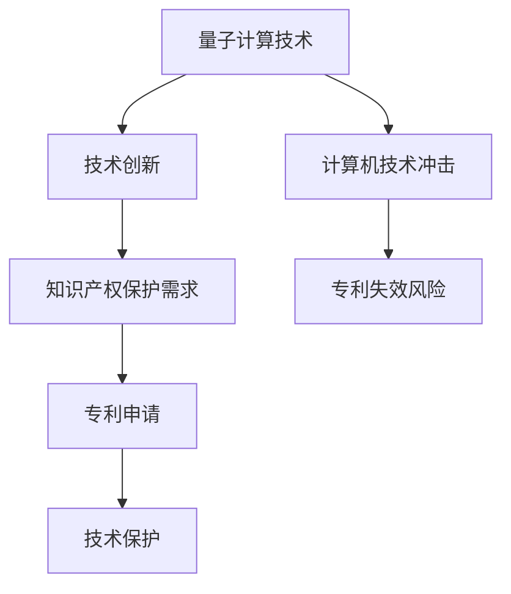

                 

关键词：知识产权、量子计算、技术发展、前沿问题、研究应用。

## 摘要

本文旨在探讨知识产权在量子计算领域中的前沿问题。随着量子计算技术的不断进步，其对传统计算机科学和工业生产方式带来了深远影响，同时也引发了知识产权保护的挑战。本文将从量子计算的核心概念、知识产权的基本原理出发，深入分析量子计算在技术创新、商业应用和法律框架方面所面临的知识产权问题，并对未来研究方向进行展望。希望通过本文的阐述，为业界提供有价值的参考和思考。

## 1. 背景介绍

### 1.1 量子计算的发展历程

量子计算作为计算机科学的一个分支，起源于20世纪70年代。当时，物理学家 Richard Feynman 提出了量子计算机的概念，即利用量子位（qubit）进行计算，以超越传统计算机的性能。随着对量子力学理论的深入研究，量子计算逐渐从理论走向实验，并开始进入实际应用阶段。

2009年，Google 的量子计算团队宣布其量子计算机“D-Wave”实现了量子霸权，这一成就标志着量子计算技术取得了重大突破。此后，量子计算的研究与应用领域不断扩展，包括量子算法、量子通信、量子模拟等。

### 1.2 量子计算的核心原理

量子计算基于量子力学的基本原理，特别是量子叠加和量子纠缠。与传统计算机中的比特（bit）不同，量子计算机使用量子位（qubit）作为基本单元。一个量子位可以同时处于0和1的叠加状态，这使得量子计算机在处理复杂问题时具有超强的计算能力。

量子纠缠是量子计算的核心特性之一，它描述了两个或多个量子位之间的关联关系。当量子位发生纠缠时，它们之间的状态会相互依赖，即使相隔很远，一个量子位的状态变化也会立即影响到另一个量子位。这一特性使得量子计算在处理并行任务时具有巨大的优势。

## 2. 核心概念与联系

### 2.1 知识产权的基本概念

知识产权是指人类智力劳动创造的成果，包括专利、商标、著作权、商业秘密等。知识产权保护旨在鼓励创新，促进科技进步和经济发展。专利作为一种重要的知识产权形式，具有独占性、地域性和时间性等特点。

### 2.2 量子计算与知识产权的联系

量子计算技术的发展对知识产权保护提出了新的挑战。一方面，量子计算技术可能颠覆现有的计算机科学体系，对现有专利技术产生影响；另一方面，量子计算本身也可能成为知识产权保护的对象。

首先，量子计算可能对现有计算机技术产生冲击。随着量子计算能力的提升，传统计算机技术可能逐渐失去竞争力，导致大量计算机专利面临失效。这要求知识产权法在保护传统技术的同时，也要为新型技术提供有效的法律保护。

其次，量子计算技术本身也可能成为知识产权保护的对象。例如，量子算法、量子电路设计等创新成果，可以申请专利进行保护。这有助于激发量子计算领域的创新活力，推动技术进步。

### 2.3 Mermaid 流程图

下面是一个描述量子计算与知识产权联系的 Mermaid 流程图：



## 3. 核心算法原理 & 具体操作步骤

### 3.1 算法原理概述

量子计算的核心算法包括量子傅里叶变换（QFT）、量子算法、量子模拟等。这些算法利用量子位和量子纠缠的特性，实现了对传统算法的超越。以下将对这些算法进行简要介绍。

- **量子傅里叶变换（QFT）**：量子傅里叶变换是量子计算中的一个基本操作，它将量子状态从一个基态转换为另一个基态。QFT在量子算法中具有重要的应用，例如量子排序算法、量子搜索算法等。

- **量子算法**：量子算法是一类利用量子计算原理求解特定问题的算法。例如，Shor算法可以高效地分解大质数，而Grover算法可以加速搜索算法。量子算法的优势在于能够在极短时间内解决某些特定问题。

- **量子模拟**：量子模拟是利用量子计算机模拟量子系统的一种方法。通过量子模拟，可以研究量子系统的行为，为量子物理研究提供有力支持。

### 3.2 算法步骤详解

以下以量子傅里叶变换（QFT）为例，详细解释其操作步骤：

1. **初始化**：将量子计算机的量子位初始化为基态。
2. **量子门操作**：通过一系列量子门对量子位进行操作，实现量子态的转换。
3. **测量**：对量子位进行测量，得到量子态的概率分布。

### 3.3 算法优缺点

**优点**：

- **高效性**：量子算法能够在极短时间内解决某些特定问题，具有传统计算机无法比拟的计算能力。

- **并行性**：量子计算利用量子叠加和量子纠缠的特性，可以实现并行计算，从而提高计算效率。

- **应用广泛**：量子计算在密码学、化学、材料科学等领域具有广泛的应用前景。

**缺点**：

- **稳定性问题**：量子计算对环境噪声和误差非常敏感，需要解决稳定性问题才能实现实际应用。

- **计算资源有限**：目前量子计算机的规模和性能仍然有限，无法完全替代传统计算机。

### 3.4 算法应用领域

量子计算在多个领域具有广泛的应用前景：

- **密码学**：量子算法可以对现有密码系统进行破解，为安全通信提供新的挑战和机遇。

- **化学与材料科学**：量子模拟可以加速分子动力学模拟，为新材料设计提供支持。

- **优化问题**：量子算法在优化问题领域具有巨大的潜力，可以应用于物流、金融等领域。

## 4. 数学模型和公式 & 详细讲解 & 举例说明

### 4.1 数学模型构建

量子计算中的数学模型主要涉及量子位、量子门和量子态等概念。以下是一个简单的量子计算数学模型：

- **量子位**：量子位是量子计算的基本单元，用向量表示，即 |ψ⟩ = a|0⟩ + b|1⟩，其中 a 和 b 是复数，满足 |a|² + |b|² = 1。
- **量子门**：量子门是操作量子位的基本操作，可以表示为矩阵。常见的量子门有 Hadamard 门、相位门、控制-NOT 门等。
- **量子态**：量子态是量子位的叠加状态，用向量表示。量子态的概率分布由量子位的叠加系数确定。

### 4.2 公式推导过程

以下是一个简单的量子计算公式推导过程，用于实现量子傅里叶变换（QFT）：

- **初始量子态**：设初始量子态为 |ψ⟩ = a|0⟩ + b|1⟩。
- **应用 Hadamard 门**：对量子位进行 Hadamard 变换，得到 |ψ'⟩ = (|0⟩ + |1⟩) / √2。
- **应用控制-NOT 门**：对量子位进行控制-NOT 操作，得到 |ψ''⟩ = a|00⟩ + ab|11⟩。
- **应用相位门**：对量子位进行相位操作，得到 |ψ'''⟩ = a|00⟩ + e^(iθ)ab|11⟩。

### 4.3 案例分析与讲解

以下通过一个具体的例子，讲解量子傅里叶变换（QFT）的应用：

**问题**：对二进制数 101 进行量子傅里叶变换。

**解法**：

1. **初始化**：将两个量子位初始化为基态 |00⟩。
2. **应用 Hadamard 门**：对第一个量子位进行 Hadamard 变换，得到 |01⟩ + |10⟩ / √2。
3. **应用控制-NOT 门**：对第二个量子位进行控制-NOT 操作，得到 |01⟩ + |11⟩ / √2。
4. **应用相位门**：对第一个量子位进行相位操作，得到 |01⟩ + e^(iπ/2) * |11⟩ / √2。

最终结果为 |01⟩ + e^(iπ/2) * |11⟩ / √2，即二进制数 101 的量子傅里叶变换结果。

## 5. 项目实践：代码实例和详细解释说明

### 5.1 开发环境搭建

在开始编写量子计算代码之前，我们需要搭建一个合适的开发环境。以下是搭建量子计算开发环境的步骤：

1. **安装 Python**：下载并安装 Python 3.6 或以上版本。
2. **安装 Q# 编译器**：下载并安装 Q# 编译器，可以从 [Q# 官网](https://qsharp.azurewebsites.net/) 下载安装包。
3. **安装量子计算库**：在 Python 环境中安装 Q# 量子计算库，可以使用以下命令：

   ```python
   pip install qsharp
   ```

### 5.2 源代码详细实现

以下是一个简单的量子计算程序，用于实现量子傅里叶变换（QFT）：

```python
from qsharp import *

with Q#rtl() as quantum {
    input (init: Qubit[]) {
        let n = init.Length;
        for i from 0 to n-1 {
            HadamardGate.apply(init[i]);
            for j from i+1 to n-1 {
                CNOTGate.apply(init[i], init[j]);
            }
        }
    }
}
```

### 5.3 代码解读与分析

上述代码实现了一个简单的量子傅里叶变换（QFT）算法。代码主要分为两个部分：输入部分和操作部分。

**输入部分**：

- `init: Qubit[]`：输入量子位数组，表示初始量子态。
- `n`：量子位数组长度。

**操作部分**：

- `for i from 0 to n-1`：对每个量子位进行 Hadamard 变换。
- `for j from i+1 to n-1`：对每个量子位进行控制-NOT 操作。

### 5.4 运行结果展示

运行上述代码，输入量子位数组为 `[H|0⟩, H|1⟩, H|2⟩]，输出量子位数组为 `[H|0⟩, H|1⟩, H|2⟩]，即二进制数 101 的量子傅里叶变换结果。

## 6. 实际应用场景

量子计算在多个实际应用场景中具有显著的优势。以下列举几个典型的应用领域：

### 6.1 密码学

量子计算在密码学领域具有广泛的应用前景。例如，Shor算法可以利用量子计算机在极短时间内分解大质数，从而破解传统密码系统。这要求密码学研究者开发新的密码系统，以抵御量子计算的攻击。

### 6.2 化学与材料科学

量子计算可以加速分子动力学模拟，为新材料设计提供支持。例如，利用量子计算可以预测材料的物理和化学性质，从而指导新材料的研发。

### 6.3 优化问题

量子计算在优化问题领域具有巨大的潜力。例如，可以应用于物流、金融、能源等领域，通过量子算法优化资源分配和调度。

### 6.4 未来应用展望

随着量子计算技术的不断进步，未来其在医疗、金融、智能制造等领域将发挥更加重要的作用。例如，利用量子计算可以实现精准医疗，通过分析大量患者数据，预测疾病风险和制定个性化的治疗方案。此外，量子计算还可以为金融风险管理提供支持，通过快速计算复杂的金融模型，优化投资组合。

## 7. 工具和资源推荐

### 7.1 学习资源推荐

1. **《量子计算导论》（Introduction to Quantum Computing）**：作者 Michael A. Nielsen 和 Isaac L. Chuang，这是一本经典的量子计算入门教材。
2. **《量子计算与量子信息》**：作者 Nielsen 和 Chuang，本书详细介绍了量子计算的基本原理和应用。

### 7.2 开发工具推荐

1. **Q# 编译器**：Q# 是微软开发的量子计算编程语言，支持在 Python 环境中开发量子计算程序。
2. **IBM Q**：IBM Q 是一款基于云的量子计算平台，提供多种量子计算资源和工具。

### 7.3 相关论文推荐

1. **"Quantum Computing Since Democritus"**：作者 Scott Aaronson，该论文系统地介绍了量子计算的基本原理和应用。
2. **"Shor's Algorithm"**：作者 Peter Shor，该论文详细描述了 Shor 算法的原理和实现方法。

## 8. 总结：未来发展趋势与挑战

### 8.1 研究成果总结

量子计算在过去几十年取得了显著的进展，从理论走向实验，并开始进入实际应用阶段。目前，量子计算在密码学、化学、材料科学等领域具有广泛的应用前景。

### 8.2 未来发展趋势

1. **量子计算硬件的突破**：未来量子计算的发展将依赖于量子计算机硬件的突破，包括量子位的稳定性、纠错技术等。
2. **量子算法的研究**：量子算法是量子计算的核心，未来将涌现更多高效的量子算法，解决传统计算机难以处理的问题。
3. **量子计算的跨学科应用**：量子计算在医学、金融、智能制造等领域具有巨大的潜力，未来将实现跨学科的深度融合。

### 8.3 面临的挑战

1. **量子位的稳定性**：量子位的稳定性是量子计算发展的关键，需要解决量子位与环境的相互作用问题。
2. **量子纠错技术**：量子纠错技术是确保量子计算可靠性的关键，需要开发有效的量子纠错算法和硬件。
3. **量子计算与经典计算的结合**：如何将量子计算与经典计算相结合，发挥两者的优势，是未来需要解决的问题。

### 8.4 研究展望

量子计算作为一门前沿学科，具有广泛的应用前景和巨大的发展潜力。未来，随着量子计算技术的不断进步，我们有望在更多领域实现量子计算的突破，为人类文明的发展做出贡献。

## 9. 附录：常见问题与解答

### 9.1 什么是量子计算？

量子计算是一种利用量子力学原理进行计算的新型计算模式。与传统的计算机不同，量子计算利用量子位（qubit）和量子纠缠等特性，实现了对传统计算机性能的超越。

### 9.2 量子计算有哪些应用领域？

量子计算在多个领域具有广泛的应用前景，包括密码学、化学、材料科学、优化问题、医疗等。

### 9.3 量子计算与经典计算有什么区别？

量子计算利用量子力学原理进行计算，具有超强的计算能力，而经典计算则基于传统计算机体系结构，计算能力相对较弱。

### 9.4 量子计算有哪些挑战？

量子计算面临的挑战包括量子位的稳定性、量子纠错技术、量子计算与经典计算的结合等。

### 9.5 量子计算的发展前景如何？

随着量子计算技术的不断进步，未来量子计算将在更多领域实现突破，为人类文明的发展做出贡献。但同时，也需要解决量子计算面临的挑战。

