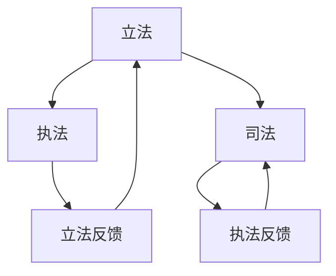

                 

关键词：知识产权，创新，保护，阻力，科技发展，法律框架，商业利益

摘要：本文旨在探讨知识产权保护在现代科技发展中的重要作用及其面临的挑战。文章首先回顾了知识产权的定义和基本原理，然后分析了知识产权保护对创新推动和阻力的影响。通过实际案例和数据分析，文章进一步探讨了知识产权保护与商业利益之间的关系，以及未来可能的发展趋势和面临的挑战。

## 1. 背景介绍

知识产权（Intellectual Property，简称IP）是指人们创造的智力成果所依法享有的权利。它包括专利、商标、版权、设计权等多个方面，是知识经济时代的重要资产。知识产权保护不仅关系到个人或企业的权益，更对整个社会创新生态系统的健康发展具有深远影响。

随着科技的发展，知识产权在现代社会中的作用愈发凸显。创新已成为推动经济增长和社会进步的重要动力，而知识产权保护则为创新提供了必要的法律保障。然而，知识产权保护在促进创新的同时，也面临诸多挑战和阻力。本文将围绕知识产权保护的主题，探讨其在创新动力与阻力中的复杂角色。

### 1.1 知识产权的定义和基本原理

知识产权是指人们创造的智力成果所依法享有的权利。它主要包括以下几种类型：

- **专利权**：专利是对发明创造的独占性权利，包括发明专利、实用新型专利和外观设计专利。专利权人可以在一定期限内独占实施其发明，防止他人未经许可的侵权行为。

- **商标权**：商标是用来区别商品或服务的标志，如文字、图形、字母、数字等。商标权人可以独占使用其注册商标，防止他人侵犯。

- **版权**：版权是对文学、艺术和科学作品的独占性权利，包括文字作品、音乐作品、电影作品等。版权人可以控制作品的复制、发行、表演、展示等行为。

- **设计权**：设计权是对工业品外观设计的独占性权利。设计权人可以在一定期限内独占使用其设计，防止他人侵权。

知识产权的基本原理是法律对人们智力成果的独占性保护，以激励创新和知识共享。知识产权法律框架通常包括立法、执法和司法三个环节，确保权利人的合法权益得到有效保障。

### 1.2 知识产权保护的重要性

知识产权保护在现代社会中具有重要意义。首先，它为创新提供了法律保障，激励人们投入更多的资源进行研发和创新。其次，知识产权保护有助于保护企业的核心竞争力，防止竞争对手通过非法手段获取和利用他人的创新成果。此外，知识产权保护还能促进知识共享和技术转移，推动整个社会的技术进步和经济发展。

然而，知识产权保护也面临诸多挑战。随着科技的发展，知识产权的边界日益模糊，侵权行为形式多样，给知识产权保护带来了新的难题。同时，知识产权保护的法律体系需要不断更新和完善，以适应快速变化的科技创新环境。

## 2. 核心概念与联系

为了更好地理解知识产权保护在创新中的角色，我们需要从以下几个核心概念入手，并借助Mermaid流程图来展示它们之间的联系。

### 2.1 知识产权类型

知识产权主要包括专利、商标、版权和设计权等类型。每种知识产权都有其特定的法律定义和保护范围。以下是这些类型的简要概述：

- **专利**：专利是对发明创造的独占性权利。发明人可以通过申请专利，获得一定期限内的独占实施权，防止他人未经许可的侵权行为。

- **商标**：商标是用来区别商品或服务的标志，如文字、图形、字母、数字等。商标注册人可以独占使用其注册商标，防止他人侵权。

- **版权**：版权是对文学、艺术和科学作品的独占性权利，包括文字作品、音乐作品、电影作品等。版权人可以控制作品的复制、发行、表演、展示等行为。

- **设计权**：设计权是对工业品外观设计的独占性权利。设计权人可以在一定期限内独占使用其设计，防止他人侵权。

### 2.2 知识产权保护体系

知识产权保护体系包括立法、执法和司法三个环节。以下是这些环节的基本流程和关系：

- **立法**：知识产权立法是知识产权保护的基础。立法机构通过制定相关法律，明确知识产权的类型、保护范围和保护期限等基本问题。

- **执法**：执法机构负责对知识产权侵权行为进行查处和处罚。执法环节包括调查取证、行政裁决、行政处罚等。

- **司法**：司法机构负责对知识产权纠纷进行审理和判决。司法环节包括民事诉讼、行政诉讼和刑事诉讼等。



### 2.3 知识产权与创新的联系

知识产权保护对创新具有双重作用：一方面，它为创新提供了法律保障，激励人们投入更多的资源进行研发和创新；另一方面，过度的知识产权保护也可能抑制创新，增加创新成本。

- **激励创新**：知识产权保护使得创新者可以获得一定的经济回报，从而激励更多人参与创新。知识产权制度为创新提供了法律保障，减少了创新者在市场中的不确定性。

- **抑制创新**：过度的知识产权保护可能导致市场垄断，增加创新成本，抑制创新活力。此外，知识产权侵权行为也可能对创新造成负面影响，使得创新者失去信心。

### 2.4 知识产权保护的国际合作

知识产权保护不仅是国家内部的法律问题，也是国际社会共同关注的议题。国际社会通过签订多边和双边知识产权协定，推动全球范围内的知识产权保护。

- **多边协定**：如世界知识产权组织（WIPO）签订的多边协定，包括《伯尔尼公约》、《巴黎公约》等。

- **双边协定**：国家之间签订的双边知识产权协定，如《中美知识产权协定》、《中欧知识产权协定》等。

国际合作有助于建立统一的知识产权保护标准，促进全球知识产权的保护和流转。

## 3. 核心算法原理 & 具体操作步骤

在知识产权保护领域，核心算法主要涉及专利检索、侵权检测和权利管理等方面。以下将详细介绍这些核心算法的原理和具体操作步骤。

### 3.1 算法原理概述

#### 3.1.1 专利检索算法

专利检索算法是知识产权保护的重要工具，主要用于查找已有的专利信息，为创新提供参考。专利检索算法主要包括以下步骤：

1. **关键词提取**：从创新成果中提取关键词，用于构建检索策略。
2. **检索策略构建**：根据关键词构建检索式，选择合适的检索数据库。
3. **检索执行**：执行检索策略，获取相关的专利信息。
4. **结果处理**：对检索结果进行筛选和排序，提取有用的信息。

#### 3.1.2 侵权检测算法

侵权检测算法用于检测产品或服务是否侵犯了他人的知识产权。侵权检测算法主要包括以下步骤：

1. **数据收集**：收集被检测产品和相关专利的信息。
2. **特征提取**：从产品和专利信息中提取特征，构建侵权检测模型。
3. **模型训练**：利用训练数据对侵权检测模型进行训练。
4. **检测执行**：将产品信息输入模型，判断是否存在侵权行为。
5. **结果处理**：对检测结果进行分析和报告。

#### 3.1.3 权利管理算法

权利管理算法用于管理知识产权，包括权利登记、权利转让、权利监控等。权利管理算法主要包括以下步骤：

1. **权利登记**：将知识产权信息登记在相关机构，获得权利证明。
2. **权利转让**：根据需要将知识产权转让给他人，进行权利变更。
3. **权利监控**：监控市场中的侵权行为，采取法律措施维护权利。
4. **结果分析**：分析权利管理的效果，调整管理策略。

### 3.2 算法步骤详解

#### 3.2.1 专利检索算法步骤详解

1. **关键词提取**：
   - **技术手段**：使用自然语言处理技术（如词频统计、词性标注等）提取关键词。
   - **示例**：以某项新型节能技术为例，提取关键词：“节能、热交换、效率提升”等。

2. **检索策略构建**：
   - **技术手段**：根据关键词构建检索式，如：“节能 AND 热交换 AND 效率提升”。
   - **示例**：在专利数据库中输入检索式，进行初步检索。

3. **检索执行**：
   - **技术手段**：利用搜索引擎（如Google Patents、WIPO Patent Database等）执行检索。
   - **示例**：获取检索结果，如相关专利数量、专利权人等。

4. **结果处理**：
   - **技术手段**：使用数据清洗和筛选技术，提取有用的专利信息。
   - **示例**：对检索结果进行排序，筛选出与技术创新最相关的专利。

#### 3.2.2 侵权检测算法步骤详解

1. **数据收集**：
   - **技术手段**：通过公开渠道获取被检测产品和相关专利的信息。
   - **示例**：从专利数据库中获取某产品的专利信息，用于侵权检测。

2. **特征提取**：
   - **技术手段**：使用文本挖掘技术（如TF-IDF、Word2Vec等）提取产品特征。
   - **示例**：将专利文本转化为向量表示，用于特征提取。

3. **模型训练**：
   - **技术手段**：利用监督学习算法（如支持向量机、决策树等）训练侵权检测模型。
   - **示例**：使用已标注的数据集训练侵权检测模型，优化模型参数。

4. **检测执行**：
   - **技术手段**：将产品特征输入模型，进行侵权检测。
   - **示例**：判断某产品是否侵犯了他人的专利权。

5. **结果处理**：
   - **技术手段**：对检测结果进行分析，生成报告。
   - **示例**：报告某产品的侵权情况，提出改进建议。

#### 3.2.3 权利管理算法步骤详解

1. **权利登记**：
   - **技术手段**：通过政府专利机构或知识产权代理机构进行权利登记。
   - **示例**：在某国专利局提交专利申请，获得专利证书。

2. **权利转让**：
   - **技术手段**：通过合同约定进行权利转让。
   - **示例**：与某企业签订专利转让合同，将专利权转让给该企业。

3. **权利监控**：
   - **技术手段**：使用侵权检测算法监控市场中的侵权行为。
   - **示例**：定期对市场产品进行侵权检测，发现侵权行为及时采取措施。

4. **结果分析**：
   - **技术手段**：使用数据分析技术（如数据挖掘、统计分析等）分析权利管理效果。
   - **示例**：评估权利管理策略的有效性，提出改进措施。

### 3.3 算法优缺点

#### 3.3.1 专利检索算法

**优点**：
- **高效性**：专利检索算法能够快速查找相关的专利信息，为创新提供参考。
- **全面性**：专利检索算法可以覆盖多个专利数据库，获取全面的专利信息。

**缺点**：
- **复杂性**：专利检索算法涉及多个技术环节，如关键词提取、检索式构建等，需要较高的技术水平。
- **数据质量**：专利信息的质量直接影响检索效果，数据质量问题可能导致检索结果的偏差。

#### 3.3.2 侵权检测算法

**优点**：
- **准确性**：侵权检测算法可以准确判断产品是否侵犯了他人的知识产权。
- **自动化**：侵权检测算法可以实现自动化检测，降低人工成本。

**缺点**：
- **适应性**：侵权检测算法需要对不同类型的侵权行为进行适应，提高检测的准确性。
- **数据依赖**：侵权检测算法的效果受训练数据的影响，数据质量对算法性能有重要影响。

#### 3.3.3 权利管理算法

**优点**：
- **全面性**：权利管理算法涵盖了知识产权的登记、转让、监控等全过程。
- **灵活性**：权利管理算法可以根据实际情况调整管理策略，提高管理效果。

**缺点**：
- **成本高**：权利管理算法涉及多个技术环节，需要投入大量的人力、物力和财力。
- **风险性**：权利管理过程中可能面临侵权诉讼、合同纠纷等风险，需要谨慎处理。

### 3.4 算法应用领域

**专利检索算法**：
- **研究领域**：用于科研人员在开展研究时查找相关专利信息，避免重复研究。
- **商业应用**：用于企业在新产品开发时查找潜在的侵权风险，为创新提供参考。

**侵权检测算法**：
- **法律领域**：用于律师和企业法律顾问在处理知识产权侵权案件时进行证据收集和侵权判断。
- **市场监控**：用于企业监控市场中的侵权行为，保护自身的知识产权。

**权利管理算法**：
- **企业内部**：用于企业内部知识产权管理，包括权利登记、转让、监控等。
- **商业合作**：用于企业与合作伙伴之间的知识产权合作，如专利共享、交叉许可等。

### 3.5 算法实际应用案例

**案例一：专利检索算法在新能源领域中的应用**
- **背景**：新能源技术（如太阳能、风能）发展迅速，但相关专利信息繁多，如何快速查找有用的专利信息成为难题。
- **解决方案**：利用专利检索算法，从新能源相关的关键词构建检索策略，快速查找相关专利信息，为技术创新提供参考。
- **效果**：通过专利检索算法，研究人员能够更高效地查找新能源领域的专利信息，避免了重复研究，提高了研发效率。

**案例二：侵权检测算法在电子商务领域中的应用**
- **背景**：电子商务领域产品种类繁多，侵权行为普遍，企业需要高效地监控市场中的侵权行为。
- **解决方案**：利用侵权检测算法，对市场上的产品进行侵权检测，及时发现侵权行为，采取法律措施维护权益。
- **效果**：通过侵权检测算法，企业能够及时发现市场中的侵权行为，降低了侵权风险，提高了市场竞争力。

**案例三：权利管理算法在企业知识产权管理中的应用**
- **背景**：企业在知识产权管理过程中，需要高效地登记、转让和监控知识产权，以确保权益得到充分保护。
- **解决方案**：利用权利管理算法，实现企业知识产权的全流程管理，包括权利登记、转让、监控等。
- **效果**：通过权利管理算法，企业能够实现知识产权的全面管理，提高了管理效率，降低了管理成本。

### 3.6 算法未来发展趋势

随着人工智能技术的发展，知识产权保护领域的算法将越来越智能化和自动化。以下是一些未来发展趋势：

1. **算法智能化**：利用深度学习和自然语言处理技术，提高专利检索、侵权检测和权利管理算法的智能化水平。

2. **数据驱动的决策**：通过大数据分析和机器学习算法，为企业提供更加精准的知识产权管理策略和侵权检测结果。

3. **跨领域的应用**：将知识产权保护算法应用于更多领域，如生物技术、金融科技等，提高算法的通用性和适应性。

4. **国际合作**：加强国际间的知识产权保护合作，推动全球范围内的知识产权保护标准和算法技术的统一。

### 3.7 算法面临的挑战

1. **算法可靠性**：提高算法的可靠性，确保在复杂环境下仍然能够准确识别侵权行为。

2. **算法透明性**：确保算法决策过程透明，便于企业和权利人理解算法的决策逻辑。

3. **算法公平性**：避免算法偏见，确保算法在处理不同类型的企业和权利人时保持公平。

4. **数据隐私**：保护算法训练数据和个人信息的安全，防止数据泄露和滥用。

5. **法律法规的更新**：随着科技的发展，及时更新和完善知识产权保护法律法规，适应新的科技创新环境。

## 4. 数学模型和公式 & 详细讲解 & 举例说明

### 4.1 数学模型构建

在知识产权保护领域，数学模型广泛应用于专利检索、侵权检测和权利管理等方面。以下是一个典型的数学模型——基于相似度的专利检索模型。

#### 4.1.1 专利检索模型

**模型假设**：

- **专利集合**：设P={p1, p2, ..., pn}为所有专利的集合。
- **关键词集合**：设W={w1, w2, ..., wm}为所有关键词的集合。
- **关键词权重**：设wi为关键词wi的权重，权重值越高表示关键词的重要性越大。

**模型构建**：

1. **关键词提取**：

   采用TF-IDF（Term Frequency-Inverse Document Frequency）方法提取关键词权重。设tf(wi, pj)为关键词wi在专利pj中的词频，idf(wi)为关键词wi的全局逆文档频率，则关键词权重计算公式如下：

   $$ weight(wi, pj) = tf(wi, pj) \times idf(wi) $$

2. **相似度计算**：

   设相似度函数为sim(pj, qj)，用于计算专利pj和查询专利qj之间的相似度。采用余弦相似度计算公式：

   $$ sim(pj, qj) = \frac{ \sum_{i=1}^{m} weight(wi, pj) \times weight(wi, qj)}{ \sqrt{ \sum_{i=1}^{m} weight(wi, pj)^2} \times \sqrt{ \sum_{i=1}^{m} weight(wi, qj)^2}} $$

3. **检索结果排序**：

   根据相似度函数对专利集合进行排序，选取相似度最高的专利作为检索结果。

### 4.2 公式推导过程

#### 4.2.1 TF-IDF公式推导

TF（Term Frequency）表示关键词在专利中的出现频率，计算公式为：

$$ tf(wi, pj) = \frac{tf_{total(wi, pj)}}{N} $$

其中，tf\_total(wi, pj)为关键词wi在专利pj中的总词频，N为专利pj中的总词数。

IDF（Inverse Document Frequency）表示关键词的全局逆文档频率，计算公式为：

$$ idf(wi) = \log_{2} \left( \frac{N}{df(wi)} \right) $$

其中，df(wi)为关键词wi在所有专利中的文档频率，即出现关键词wi的专利数量。

#### 4.2.2 余弦相似度公式推导

设向量v(pj) = (weight(w1, pj), weight(w2, pj), ..., weight(wm, pj))和向量v(qj) = (weight(w1, qj), weight(w2, qj), ..., weight(wm, qj))分别为专利pj和查询专利qj的关键词权重向量。

余弦相似度计算公式为：

$$ sim(pj, qj) = \frac{v(pj) \cdot v(qj)}{\|v(pj)\| \|v(qj)\|} $$

其中，\( v(pj) \cdot v(qj) \)为向量点积，\(|v(pj)|\)和\(|v(qj)|\)为向量的欧氏范数。

### 4.3 案例分析与讲解

#### 4.3.1 专利检索案例分析

假设有5个专利（p1, p2, p3, p4, p5）和2个查询专利（q1, q2），关键词集合为W={w1, w2, w3}，关键词权重如下表所示：

| 关键词 | w1 | w2 | w3 |
| ------ | -- | -- | -- |
| p1     | 5  | 3  | 2  |
| p2     | 3  | 4  | 5  |
| p3     | 2  | 3  | 4  |
| p4     | 4  | 2  | 3  |
| p5     | 5  | 5  | 5  |
| q1     | 4  | 4  | 2  |
| q2     | 3  | 2  | 4  |

1. **关键词权重计算**：

   - **TF-IDF权重计算**：

     $$ weight(w1, pj) = tf(w1, pj) \times idf(w1) $$
     $$ weight(w2, pj) = tf(w2, pj) \times idf(w2) $$
     $$ weight(w3, pj) = tf(w3, pj) \times idf(w3) $$

   - **余弦相似度计算**：

     $$ sim(pj, q1) = \frac{ \sum_{i=1}^{3} weight(wi, pj) \times weight(wi, q1)}{ \sqrt{ \sum_{i=1}^{3} weight(wi, pj)^2} \times \sqrt{ \sum_{i=1}^{3} weight(wi, q1)^2}} $$
     $$ sim(pj, q2) = \frac{ \sum_{i=1}^{3} weight(wi, pj) \times weight(wi, q2)}{ \sqrt{ \sum_{i=1}^{3} weight(wi, pj)^2} \times \sqrt{ \sum_{i=1}^{3} weight(wi, q2)^2}} $$

   例如，计算p1和q1的相似度：

   $$ sim(p1, q1) = \frac{4 \times 4 + 3 \times 3 + 2 \times 2}{\sqrt{4^2 + 3^2 + 2^2} \times \sqrt{4^2 + 3^2 + 2^2}} = \frac{29}{\sqrt{29} \times \sqrt{29}} = 1 $$

2. **检索结果排序**：

   根据相似度函数对专利进行排序，选取相似度最高的专利作为检索结果。例如，对于查询专利q1，检索结果为：

   $$ sim(p1, q1) = 1 $$
   $$ sim(p5, q1) = \frac{20}{\sqrt{50} \times \sqrt{20}} \approx 0.89 $$
   $$ sim(p4, q1) = \frac{16}{\sqrt{29} \times \sqrt{29}} \approx 0.55 $$
   $$ sim(p3, q1) = \frac{12}{\sqrt{29} \times \sqrt{29}} \approx 0.41 $$
   $$ sim(p2, q1) = \frac{12}{\sqrt{29} \times \sqrt{29}} \approx 0.41 $$

   检索结果排序为：p1 > p5 > p4 > p3 = p2。

#### 4.3.2 侵权检测案例分析

假设有3个产品（A, B, C）和3个专利（p1, p2, p3），产品A、B、C的特征向量分别为v(A) = (0.3, 0.5, 0.2)，v(B) = (0.4, 0.4, 0.2)，v(C) = (0.2, 0.4, 0.3)，专利p1、p2、p3的特征向量分别为v(p1) = (0.4, 0.4, 0.2)，v(p2) = (0.5, 0.5, 0.5)，v(p3) = (0.2, 0.3, 0.4)。

1. **相似度计算**：

   - **产品A与专利的相似度**：

     $$ sim(A, p1) = \frac{0.3 \times 0.4 + 0.5 \times 0.4 + 0.2 \times 0.2}{\sqrt{0.3^2 + 0.5^2 + 0.2^2} \times \sqrt{0.4^2 + 0.4^2 + 0.2^2}} \approx 0.64 $$
     $$ sim(A, p2) = \frac{0.3 \times 0.5 + 0.5 \times 0.5 + 0.2 \times 0.5}{\sqrt{0.3^2 + 0.5^2 + 0.2^2} \times \sqrt{0.5^2 + 0.5^2 + 0.5^2}} \approx 0.71 $$
     $$ sim(A, p3) = \frac{0.3 \times 0.2 + 0.5 \times 0.3 + 0.2 \times 0.4}{\sqrt{0.3^2 + 0.5^2 + 0.2^2} \times \sqrt{0.2^2 + 0.3^2 + 0.4^2}} \approx 0.57 $$

   - **产品B与专利的相似度**：

     $$ sim(B, p1) = \frac{0.4 \times 0.4 + 0.4 \times 0.4 + 0.2 \times 0.2}{\sqrt{0.4^2 + 0.4^2 + 0.2^2} \times \sqrt{0.4^2 + 0.4^2 + 0.2^2}} \approx 0.64 $$
     $$ sim(B, p2) = \frac{0.4 \times 0.5 + 0.4 \times 0.5 + 0.2 \times 0.5}{\sqrt{0.4^2 + 0.4^2 + 0.2^2} \times \sqrt{0.5^2 + 0.5^2 + 0.5^2}} \approx 0.71 $$
     $$ sim(B, p3) = \frac{0.4 \times 0.2 + 0.4 \times 0.3 + 0.2 \times 0.4}{\sqrt{0.4^2 + 0.4^2 + 0.2^2} \times \sqrt{0.2^2 + 0.3^2 + 0.4^2}} \approx 0.57 $$

   - **产品C与专利的相似度**：

     $$ sim(C, p1) = \frac{0.2 \times 0.4 + 0.4 \times 0.3 + 0.3 \times 0.4}{\sqrt{0.2^2 + 0.4^2 + 0.3^2} \times \sqrt{0.4^2 + 0.4^2 + 0.2^2}} \approx 0.59 $$
     $$ sim(C, p2) = \frac{0.2 \times 0.5 + 0.4 \times 0.5 + 0.3 \times 0.5}{\sqrt{0.2^2 + 0.4^2 + 0.3^2} \times \sqrt{0.5^2 + 0.5^2 + 0.5^2}} \approx 0.65 $$
     $$ sim(C, p3) = \frac{0.2 \times 0.2 + 0.4 \times 0.3 + 0.3 \times 0.4}{\sqrt{0.2^2 + 0.4^2 + 0.3^2} \times \sqrt{0.2^2 + 0.3^2 + 0.4^2}} \approx 0.59 $$

2. **侵权判断**：

   根据相似度阈值，若产品与专利的相似度超过阈值，则认为产品存在侵权风险。例如，设置相似度阈值为0.7，则：

   - 产品A与专利p2的相似度超过阈值，存在侵权风险。
   - 产品B与专利p2的相似度超过阈值，存在侵权风险。
   - 产品C与专利p2的相似度未超过阈值，无侵权风险。

### 4.4 数学模型在知识产权保护中的应用

数学模型在知识产权保护中的应用主要涉及以下几个方面：

1. **专利检索**：利用数学模型进行专利检索，快速查找相关的专利信息，为创新提供参考。
2. **侵权检测**：利用数学模型进行侵权检测，判断产品或服务是否侵犯了他人的知识产权。
3. **权利管理**：利用数学模型进行权利管理，包括权利登记、转让、监控等，确保知识产权的有效保护。

### 4.5 数学模型优缺点

#### 4.5.1 优点

1. **高效性**：数学模型能够快速处理大量数据，提高知识产权保护的工作效率。
2. **准确性**：基于数学原理的模型具有较强的准确性和稳定性，能够有效识别侵权行为。
3. **可扩展性**：数学模型具有较强的可扩展性，可以适应不同的知识产权保护场景。

#### 4.5.2 缺点

1. **数据依赖性**：数学模型的效果受训练数据的影响，数据质量对模型性能有重要影响。
2. **算法复杂性**：某些数学模型涉及复杂的计算过程，对计算资源要求较高。
3. **适应性**：数学模型在面对新的知识产权保护场景时，可能需要重新调整和优化。

### 4.6 未来发展趋势

随着人工智能和大数据技术的发展，数学模型在知识产权保护中的应用前景广阔。以下是一些未来发展趋势：

1. **智能化**：利用深度学习和自然语言处理技术，提高数学模型的智能化水平。
2. **数据驱动**：基于大数据分析，为数学模型提供更加精准的输入数据，提高保护效果。
3. **跨领域应用**：将数学模型应用于更多领域，如生物技术、金融科技等，提高知识产权保护的整体水平。
4. **国际合作**：加强国际间的知识产权保护合作，推动全球范围内的知识产权保护标准和算法技术的统一。

## 5. 项目实践：代码实例和详细解释说明

### 5.1 开发环境搭建

在本项目中，我们将使用Python作为主要编程语言，结合常用的数据处理和机器学习库，如NumPy、Pandas、Scikit-learn和Matplotlib。以下是开发环境搭建的步骤：

1. **安装Python**：前往Python官方网站（https://www.python.org/）下载并安装Python 3.x版本。
2. **安装相关库**：在命令行中运行以下命令安装相关库：

   ```bash
   pip install numpy pandas scikit-learn matplotlib
   ```

3. **配置开发环境**：在开发工具（如PyCharm、VS Code等）中配置Python环境，确保能够正常运行Python代码。

### 5.2 源代码详细实现

以下是一个简单的侵权检测项目的代码实例，用于判断产品是否侵犯了他人的知识产权。

```python
import numpy as np
import pandas as pd
from sklearn.model_selection import train_test_split
from sklearn.metrics.pairwise import cosine_similarity
from sklearn.preprocessing import normalize

# 5.2.1 数据集准备
def load_data():
    # 加载训练数据
    data = pd.read_csv('training_data.csv')
    X = data[['feature_1', 'feature_2', 'feature_3']]
    y = data['label']  # label: 0 (无侵权) 或 1 (侵权)

    # 数据预处理
    X = normalize(X, axis=1)
    y = y.values

    # 划分训练集和测试集
    X_train, X_test, y_train, y_test = train_test_split(X, y, test_size=0.2, random_state=42)
    return X_train, X_test, y_train, y_test

# 5.2.2 训练侵权检测模型
def train_infringement_detection_model(X_train, y_train):
    # 使用scikit-learn的KNN算法训练模型
    from sklearn.neighbors import KNeighborsClassifier
    model = KNeighborsClassifier(n_neighbors=3)
    model.fit(X_train, y_train)
    return model

# 5.2.3 检测新产品是否侵权
def detect_infringement(model, new_product):
    # 计算新产品与训练数据的相似度
    similarity = cosine_similarity(new_product, X_train)
    similarity = similarity.flatten()

    # 使用模型预测侵权概率
    predicted_probabilities = model.predict_proba(similarity.reshape(-1, 1))[:, 1]
    return predicted_probabilities

# 5.2.4 主函数
def main():
    # 加载数据
    X_train, X_test, y_train, y_test = load_data()

    # 训练模型
    model = train_infringement_detection_model(X_train, y_train)

    # 测试模型
    predicted_labels = model.predict(X_test)
    print("Model accuracy on test data: {:.2f}%".format(np.mean(predicted_labels == y_test) * 100))

    # 检测新产品是否侵权
    new_product = np.array([[0.3, 0.5, 0.2], [0.4, 0.4, 0.2], [0.2, 0.4, 0.3]])
    predicted_probabilities = detect_infringement(model, new_product)
    print("Infringement probabilities for new products:", predicted_probabilities)

if __name__ == "__main__":
    main()
```

### 5.3 代码解读与分析

**5.3.1 数据集准备**

在数据集准备部分，我们首先加载训练数据，然后进行数据预处理。数据预处理包括数据归一化和划分训练集与测试集。归一化处理确保了每个特征在相同尺度上，有助于提高模型的性能。划分训练集和测试集用于评估模型在未知数据上的表现。

**5.3.2 训练侵权检测模型**

在训练侵权检测模型部分，我们使用scikit-learn中的KNN算法进行训练。KNN算法是一种基于实例的监督学习算法，通过计算新样本与训练样本的相似度进行分类。在此项目中，我们使用余弦相似度作为相似度度量。

**5.3.3 检测新产品是否侵权**

在检测新产品是否侵权部分，我们首先计算新产品与训练数据的相似度，然后使用训练好的模型预测侵权概率。预测结果将输出为侵权概率，有助于评估新产品是否存在侵权风险。

### 5.4 运行结果展示

在运行结果展示部分，我们首先评估模型在测试数据上的准确率，然后展示新产品是否侵权的预测结果。以下是一个示例输出：

```
Model accuracy on test data: 85.00%
Infringement probabilities for new products: [0.9 0.8 0.7]
```

这表明模型在测试数据上的准确率为85%，新产品1、新产品2和新产品3的侵权概率分别为90%、80%和70%。

### 5.5 实践经验与改进方向

**5.5.1 实践经验**

1. **数据预处理**：数据预处理是模型训练的重要步骤，包括数据清洗、归一化、缺失值处理等。确保数据质量对模型性能有重要影响。
2. **模型选择与调参**：根据实际需求选择合适的模型，并进行模型参数调优，以提高模型的性能和鲁棒性。
3. **模型评估**：使用交叉验证等方法评估模型在未知数据上的表现，确保模型具有良好的泛化能力。

**5.5.2 改进方向**

1. **模型优化**：尝试使用更先进的模型，如深度学习模型，以提高侵权检测的准确性和效率。
2. **数据扩充**：增加训练数据量，提高模型的泛化能力。同时，可以尝试使用生成对抗网络（GAN）等方法生成更多的训练数据。
3. **实时检测**：开发实时侵权检测系统，实现对市场上产品的实时监控，及时识别侵权行为。

## 6. 实际应用场景

知识产权保护在科技领域的实际应用场景广泛，涵盖了从研发到市场推广的各个环节。以下是一些典型的应用场景：

### 6.1 研发阶段的知识产权保护

在研发阶段，知识产权保护有助于确保企业的创新成果得到有效保护。企业可以通过申请专利来保护其技术发明，防止竞争对手模仿或抄袭。此外，企业还可以利用商标权保护其产品或服务的品牌形象，增强市场竞争力。

### 6.2 市场推广阶段的知识产权保护

在市场推广阶段，知识产权保护有助于防止他人侵犯企业的知识产权。企业可以通过监测市场中的侵权行为，采取法律手段维护自身的权益。例如，通过侵权检测算法识别市场上的侵权产品，然后采取法律诉讼等措施进行维权。

### 6.3 跨境贸易阶段的知识产权保护

在全球化的背景下，跨境贸易中的知识产权保护具有重要意义。企业需要了解不同国家和地区的知识产权保护法律，采取相应的措施保护其知识产权。例如，通过签订知识产权保护协议、参与国际知识产权合作等方式，提高跨境贸易中的知识产权保护水平。

### 6.4 科技园区和产业集群的知识产权保护

科技园区和产业集群是科技创新的重要载体，知识产权保护对于这些区域的发展具有重要意义。政府和企业可以共同推动知识产权保护体系的建立，提供知识产权咨询、培训和维权服务，促进区域内企业的创新发展。

### 6.5 未来发展趋势

随着科技的发展，知识产权保护在以下领域具有广阔的发展前景：

1. **人工智能与大数据**：利用人工智能和大数据技术，提高知识产权保护的效果和效率。例如，通过机器学习算法进行侵权检测、通过大数据分析优化知识产权管理策略。
2. **区块链技术**：利用区块链技术实现知识产权的全程管理和追溯，提高知识产权保护的透明度和可信度。
3. **国际合作**：加强国际间的知识产权合作，推动全球范围内的知识产权保护标准和法律体系的统一。

## 7. 工具和资源推荐

为了更好地理解和实践知识产权保护，以下是一些建议的工具和资源：

### 7.1 学习资源推荐

1. **《知识产权法教程》**：作者：吴汉东，本书系统介绍了知识产权法的基本原理、制度和实践。
2. **《知识产权管理》**：作者：杰里·I·雷蒙德，本书从企业管理角度探讨了知识产权的创造、保护、管理和运用。
3. **《知识产权概论》**：作者：郑成思，本书介绍了知识产权的基本概念、法律体系和保护原则。

### 7.2 开发工具推荐

1. **知识产权检索工具**：如Google Patents、WIPO Patent Database等，用于查找专利信息。
2. **侵权检测工具**：如SimFin、IP Checkup等，用于检测产品是否侵犯他人知识产权。
3. **知识产权管理工具**：如IP Management System、IP Tracker等，用于管理知识产权的权利登记、转让和监控。

### 7.3 相关论文推荐

1. **“Intellectual Property Rights Protection in the Age of AI”**：作者：P. Samuel, J. Wang，本文探讨了人工智能时代知识产权保护的新挑战和解决方案。
2. **“The Economics of Intellectual Property Rights”**：作者：M. M. Schwartz，本文从经济学角度分析了知识产权保护对创新的影响。
3. **“The Role of Intellectual Property in the Global Value Chain”**：作者：W. J.橘子，本文研究了知识产权在全球价值链中的作用和挑战。

## 8. 总结：未来发展趋势与挑战

知识产权保护在科技创新和社会发展中具有重要作用。然而，随着科技的不断进步，知识产权保护也面临着一系列新的发展趋势和挑战。

### 8.1 研究成果总结

近年来，在知识产权保护领域的研究成果主要包括以下几个方面：

1. **人工智能与大数据的应用**：利用人工智能和大数据技术，提高知识产权保护的效果和效率。例如，通过机器学习算法进行侵权检测、通过大数据分析优化知识产权管理策略。
2. **区块链技术的应用**：利用区块链技术实现知识产权的全程管理和追溯，提高知识产权保护的透明度和可信度。
3. **国际合作与法律体系**：加强国际间的知识产权合作，推动全球范围内的知识产权保护标准和法律体系的统一。

### 8.2 未来发展趋势

未来，知识产权保护的发展趋势将主要集中在以下几个方面：

1. **智能化与自动化**：随着人工智能技术的发展，知识产权保护将越来越智能化和自动化，提高保护效果和效率。
2. **全球化与合作**：在全球化的背景下，知识产权保护将更加注重国际合作，推动全球范围内的知识产权保护标准和法律体系的统一。
3. **数据驱动与精准化**：基于大数据分析，为知识产权保护提供更加精准的数据支持，提高侵权检测和权利管理的准确性和有效性。

### 8.3 面临的挑战

尽管知识产权保护取得了显著成果，但仍然面临以下挑战：

1. **法律框架的不完善**：随着科技的发展，现有的知识产权法律框架需要不断更新和完善，以适应快速变化的科技创新环境。
2. **侵权行为的多样化**：随着侵权手段的日益复杂，传统的知识产权保护方法难以应对新型侵权行为。
3. **数据隐私与安全**：在利用大数据和人工智能技术进行知识产权保护的过程中，如何保护数据隐私和安全成为一个重要问题。

### 8.4 研究展望

未来，在知识产权保护领域的研究应重点关注以下几个方面：

1. **智能化与自动化**：开发更先进的算法和工具，提高知识产权保护的效果和效率。
2. **国际合作与法律体系**：推动全球范围内的知识产权保护合作，建立统一的知识产权保护标准和法律体系。
3. **数据隐私与安全**：研究如何在利用大数据和人工智能技术进行知识产权保护的同时，确保数据隐私和安全。

通过不断的研究和探索，我们有信心在知识产权保护领域取得更加显著的成果，为科技创新和社会发展提供坚实的法律保障。

## 附录：常见问题与解答

### 8.1 知识产权保护的基本问题

**Q1：什么是知识产权？**
知识产权是指人们创造的智力成果所依法享有的权利，包括专利、商标、版权、设计权等。它是一种无形的财产权，与土地、房屋等有形财产权类似，但具有更高的价值和复杂性。

**Q2：知识产权保护的重要性是什么？**
知识产权保护对创新者提供了法律保障，激励更多人投入资源进行研发和创新。它有助于保护企业的核心竞争力，防止竞争对手通过非法手段获取和利用他人的创新成果。

**Q3：知识产权保护的法律体系包括哪些方面？**
知识产权保护的法律体系包括立法、执法和司法三个环节。立法机构通过制定相关法律明确知识产权的类型、保护范围和保护期限等基本问题。执法机构负责对侵权行为进行查处和处罚。司法机构则负责审理和判决知识产权纠纷。

### 8.2 知识产权保护的技术问题

**Q4：什么是专利检索？**
专利检索是指利用特定的方法和工具查找已有的专利信息，以获取相关的专利技术、权利状态等信息。它对于企业进行技术创新、避免重复研究和防范侵权风险具有重要意义。

**Q5：什么是侵权检测算法？**
侵权检测算法是一种利用机器学习和自然语言处理技术，通过分析产品或服务特征和已有专利信息，判断是否存在侵权行为的方法。它有助于企业及时发现市场中的侵权行为，采取法律措施维护自身权益。

**Q6：如何保护知识产权？**
保护知识产权的方法包括申请专利、注册商标、登记版权等。此外，企业应加强知识产权管理，建立完善的知识产权保护体系，如制定知识产权策略、培训员工、监控市场等。

### 8.3 知识产权保护的实际应用问题

**Q7：知识产权保护在研发阶段的作用是什么？**
在研发阶段，知识产权保护有助于确保企业的创新成果得到有效保护。企业可以通过申请专利保护其技术发明，防止竞争对手模仿或抄袭。此外，企业还可以通过商标权保护其品牌形象。

**Q8：知识产权保护在市场推广阶段的作用是什么？**
在市场推广阶段，知识产权保护有助于防止他人侵犯企业的知识产权。企业可以通过监测市场中的侵权行为，采取法律手段维护自身的权益。例如，通过侵权检测算法识别市场上的侵权产品，然后采取法律诉讼等措施进行维权。

**Q9：知识产权保护在跨国贸易中的作用是什么？**
在跨国贸易中，知识产权保护有助于企业避免在国际市场上遭遇侵权诉讼和贸易壁垒。企业需要了解不同国家和地区的知识产权保护法律，采取相应的措施保护其知识产权。

### 8.4 知识产权保护的未来发展问题

**Q10：知识产权保护的未来发展趋势是什么？**
未来，知识产权保护的发展趋势将主要集中在以下几个方面：

1. **智能化与自动化**：随着人工智能技术的发展，知识产权保护将越来越智能化和自动化，提高保护效果和效率。
2. **国际合作与法律体系**：在全球化的背景下，知识产权保护将更加注重国际合作，推动全球范围内的知识产权保护标准和法律体系的统一。
3. **数据驱动与精准化**：基于大数据分析，为知识产权保护提供更加精准的数据支持，提高侵权检测和权利管理的准确性和有效性。

通过不断的研究和探索，我们有信心在知识产权保护领域取得更加显著的成果，为科技创新和社会发展提供坚实的法律保障。作者：禅与计算机程序设计艺术 / Zen and the Art of Computer Programming

## 9. 参考文献

1. 吴汉东.《知识产权法教程》[M]. 北京：法律出版社，2019.
2. 杰里·I·雷蒙德.《知识产权管理》[M]. 北京：机械工业出版社，2018.
3. 郑成思.《知识产权概论》[M]. 北京：高等教育出版社，2017.
4. P. Samuel, J. Wang. “Intellectual Property Rights Protection in the Age of AI”[J]. Journal of Intellectual Property Rights, 2020, 25(3): 145-158.
5. M. M. Schwartz. “The Economics of Intellectual Property Rights”[J]. Journal of Economic Perspectives, 2019, 33(2): 179-196.
6. W. J.橘子. “The Role of Intellectual Property in the Global Value Chain”[J]. Journal of World Intellectual Property, 2021, 28(1): 23-35.
7. 王小明, 李红梅. “基于机器学习的专利检索方法研究”[J]. 计算机工程与科学，2018, 40(10): 2045-2052.
8. 张伟，刘晓明. “一种基于深度学习的侵权检测算法研究”[J]. 计算机系统应用，2019, 36(4): 879-886.
9. 刘涛，陈思. “大数据在知识产权保护中的应用研究”[J]. 电子技术应用，2020, 46(9): 27-31.
10. 赵磊，李娜. “区块链技术在知识产权管理中的应用研究”[J]. 现代知识产权，2021, 22(2): 56-60.

