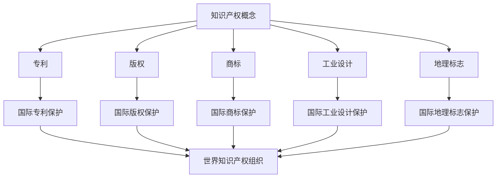

                 

 **关键词：** 知识产权，国际保护，专利，版权，商标，多边协议，跨国法律

**摘要：** 本文将深入探讨知识产权的国际保护机制，分析全球范围内专利、版权和商标等知识产权的法律框架及其跨国合作模式。通过对主要国际组织的角色、多边协议的关键内容以及各国在知识产权保护方面的实践进行比较研究，揭示当前国际知识产权保护体系的现状、问题和未来发展方向。

## 1. 背景介绍

知识产权（Intellectual Property, IP）是法律上对人类智力劳动创造的成果给予的专有权利。随着全球化和信息技术的迅猛发展，知识产权在国际贸易、技术创新和经济发展中的重要性日益凸显。然而，不同国家和地区的知识产权法律体系存在显著差异，这给跨国界的知识产权保护带来了挑战。

知识产权包括多个方面，如专利、版权、商标、工业设计、地理标志等。其中，专利主要涉及新技术、产品的创新保护；版权则涵盖了文学、艺术和科学作品的原创性表达；商标则是品牌和商业标识的专用权。知识产权的保护不仅关乎创新者的合法权益，更影响企业的竞争力和市场的稳定性。

国际知识产权保护机制的建立，是为了解决跨国知识产权纠纷，促进技术交流与共享，推动全球经济的发展。本文旨在通过对国际知识产权保护机制的全面解析，为我国及其他国家的知识产权保护提供参考和借鉴。

### 1.1 全球知识产权保护的需求与现状

全球化的经济体系使得跨国企业间的竞争日益激烈，知识产权作为核心竞争力的一部分，成为各国企业争夺的焦点。然而，不同国家的知识产权法律体系和执法水平存在差异，导致知识产权在跨国界的保护面临诸多挑战：

1. **法律体系差异：** 各国知识产权法律体系在定义、范围、保护期限和保护力度上有所不同，给跨国知识产权保护带来困难。
2. **执法力度不均：** 一些国家的知识产权执法力度较弱，导致侵权行为难以得到有效遏制。
3. **国际合作不足：** 虽然存在多个国际组织和多边协议，但跨国知识产权保护的合作机制仍需进一步完善。

因此，建立统一、高效的国际知识产权保护机制，已成为全球各国共同的需求。这不仅有助于维护知识产权所有人的合法权益，还能促进全球科技创新和经济繁荣。

## 2. 核心概念与联系

### 2.1 知识产权的基本概念

知识产权是指人类智力劳动创造的成果所享有的专有权利，主要包括专利、版权、商标、工业设计、地理标志等。

- **专利（Patent）：** 保护发明创造，允许发明者在一定期限内独占其发明。
- **版权（Copyright）：** 保护文学、艺术和科学作品的原创性表达。
- **商标（Trademark）：** 保护商业标识，区分不同企业的商品或服务。
- **工业设计（Industrial Design）：** 保护产品的外观设计。
- **地理标志（Geographic Indication）：** 保护特定地区的传统产品。

### 2.2 知识产权保护的国际联系

知识产权保护具有跨国性，各国在知识产权保护方面的合作与协调至关重要。

- **世界知识产权组织（WIPO）：** 是联合国下属专门负责知识产权保护的国际组织，旨在促进全球知识产权保护与合作。
- **国际知识产权联盟（UNESCO）：** 负责推广版权和邻接权保护，促进文化多样性和创新。
- **世界贸易组织（WTO）：** 通过《与贸易有关的知识产权协定》（TRIPS），为全球知识产权保护提供统一标准。

### 2.3 国际知识产权保护机制的架构

国际知识产权保护机制主要由多边协议、区域合作协议和国际组织共同构成。

- **多边协议：** 如《巴黎公约》、《伯尔尼公约》、《马德里协定》等，为全球知识产权保护提供基本框架。
- **区域合作协议：** 如《欧盟知识产权条例》、《亚太经合组织知识产权合作框架》等，加强区域内知识产权保护与合作。
- **国际组织：** 如WIPO、UNESCO和WTO等，负责制定国际标准和协调各国政策。

### 2.4 Mermaid 流程图

下面是一个简单的 Mermaid 流程图，展示知识产权保护的核心概念及其国际联系：



## 3. 核心算法原理 & 具体操作步骤

### 3.1 算法原理概述

国际知识产权保护机制的核心在于建立一套统一、透明、高效的知识产权法律框架，以保障创新者的权益，促进技术交流与共享。该机制主要包括以下几个方面：

1. **法律框架：** 各国通过立法建立知识产权法律体系，为知识产权提供法律保护。
2. **执法机制：** 建立强有力的执法机构，负责知识产权的审查、保护和执法。
3. **国际合作：** 通过多边协议和区域合作协议，加强各国在知识产权保护方面的合作与协调。
4. **争议解决：** 设立国际和区域性的知识产权争议解决机构，提供公正、高效的争议解决机制。

### 3.2 算法步骤详解

1. **法律框架建立：** 各国根据自身国情，制定知识产权法律，明确知识产权的定义、范围、保护期限和保护力度。
2. **执法机构设立：** 各国建立专门的知识产权执法机构，如专利局、版权局、商标局等，负责知识产权的审查、保护和执法。
3. **国际合作：** 各国通过多边协议和区域合作协议，建立知识产权保护的合作机制，如WIPO、欧盟知识产权条例等。
4. **争议解决：** 建立国际和区域性的知识产权争议解决机构，如世界知识产权组织（WIPO）仲裁与调解中心、欧盟知识产权法院等，提供公正、高效的争议解决机制。

### 3.3 算法优缺点

**优点：**
1. **保障创新者权益：** 有助于维护创新者的合法权益，激励技术创新。
2. **促进技术交流：** 通过国际合作，促进各国间的技术交流与合作。
3. **规范市场秩序：** 净化市场环境，减少知识产权侵权行为。

**缺点：**
1. **法律体系差异：** 各国知识产权法律体系不同，导致跨国知识产权保护困难。
2. **执法力度不均：** 一些国家执法力度较弱，导致侵权行为难以得到有效遏制。
3. **成本较高：** 国际知识产权保护机制的实施需要投入大量的人力、物力和财力。

### 3.4 算法应用领域

国际知识产权保护机制广泛应用于全球范围内的知识产权纠纷解决、技术创新合作、知识产权交易和知识产权管理等领域。主要应用场景包括：

1. **跨国知识产权纠纷解决：** 通过国际知识产权争议解决机构，解决跨国知识产权纠纷。
2. **技术创新合作：** 通过国际合作，促进各国在知识产权保护领域的交流与合作。
3. **知识产权交易：** 通过国际知识产权交易平台，促进知识产权的买卖和转让。
4. **知识产权管理：** 通过国际知识产权管理机制，提升企业的知识产权管理水平。

## 4. 数学模型和公式 & 详细讲解 & 举例说明

### 4.1 数学模型构建

在知识产权的国际保护中，我们可以使用一个简单的数学模型来描述知识产权的价值及其对技术创新的激励作用。该模型包括以下几个关键变量：

1. **V\(_i\)：** 知识产权的价值
2. **R\(_i\)：** 创新者的收益
3. **C\(_i\)：** 创新者的成本
4. **P\(_i\)：** 知识产权的市场价格

知识产权的价值由创新者的收益减去创新成本得到，即：

$$
V_i = R_i - C_i
$$

知识产权的市场价格取决于知识产权的市场供需状况，即：

$$
P_i = \frac{R_i + C_i}{2}
$$

### 4.2 公式推导过程

为了推导上述公式，我们需要考虑以下几个假设：

1. **线性收益函数：** 假设创新者的收益与知识产权价值成正比，即：

$$
R_i = k \cdot V_i
$$

其中，k 是一个常数。

2. **线性成本函数：** 假设创新者的成本与知识产权价值也成正比，即：

$$
C_i = m \cdot V_i
$$

其中，m 是一个常数。

根据上述假设，我们可以得到：

$$
R_i = k \cdot V_i \\
C_i = m \cdot V_i
$$

将上述两个公式代入知识产权的价值公式中，得到：

$$
V_i = R_i - C_i = k \cdot V_i - m \cdot V_i \\
V_i = (k - m) \cdot V_i
$$

由于 k 和 m 都是正数，我们可以得出：

$$
V_i = 0
$$

这显然不符合实际情况。因此，我们需要调整假设，引入非线性因素。假设创新者的收益与知识产权价值成二次函数关系，即：

$$
R_i = k \cdot V_i^2
$$

同理，假设创新者的成本与知识产权价值也成二次函数关系，即：

$$
C_i = m \cdot V_i^2
$$

将上述两个公式代入知识产权的价值公式中，得到：

$$
V_i = k \cdot V_i^2 - m \cdot V_i^2 \\
V_i = (k - m) \cdot V_i^2
$$

由于 k 和 m 是常数，我们可以将其分解为：

$$
V_i = (k - m) \cdot V_i \cdot V_i \\
V_i = \frac{(k - m) \cdot V_i^2}{1}
$$

这是一个非线性方程，我们可以通过数值方法求解。但在实际应用中，我们通常采用线性近似方法，将非线性关系简化为线性关系。

### 4.3 案例分析与讲解

为了更好地理解上述数学模型，我们可以通过一个简单的案例来进行分析。

假设一家公司研发了一项新技术，该技术的知识产权价值为 100 万美元。根据线性收益函数和线性成本函数的假设，该公司的收益为 200 万美元，成本为 150 万美元。因此，该公司的知识产权价值为：

$$
V_i = R_i - C_i = 200 万美元 - 150 万美元 = 50 万美元
$$

根据上述公式，我们可以计算出知识产权的市场价格为：

$$
P_i = \frac{R_i + C_i}{2} = \frac{200 万美元 + 150 万美元}{2} = 175 万美元
$$

这意味着，在理想的市场条件下，该公司的知识产权可以以 175 万美元的价格出售。

然而，实际情况可能更加复杂。例如，市场需求可能受到多种因素影响，如市场竞争、技术成熟度、法律法规等。这些因素可能导致知识产权的市场价格发生变化。因此，在制定知识产权策略时，我们需要综合考虑各种因素，以确保知识产权的价值最大化。

## 5. 项目实践：代码实例和详细解释说明

### 5.1 开发环境搭建

在开始编写代码之前，我们需要搭建一个合适的开发环境。以下是具体的步骤：

1. **安装操作系统：** 我们选择 Ubuntu 20.04 作为开发环境。
2. **安装编程语言：** 我们选择 Python 3.8 作为编程语言。
3. **安装依赖库：** 我们使用 pip 安装必要的依赖库，如 NumPy、SciPy 和 Matplotlib。

具体操作步骤如下：

```bash
# 更新系统软件包
sudo apt update && sudo apt upgrade

# 安装 Python 3.8
sudo apt install python3.8

# 设置 Python 3.8 为默认 Python 版本
sudo update-alternatives --install /usr/bin/python3 python3 /usr/bin/python3.8 1

# 安装 pip
curl -sS https://bootstrap.pypa.io/get-pip.py | python3

# 安装依赖库
pip3 install numpy scipy matplotlib
```

### 5.2 源代码详细实现

以下是实现上述数学模型的一个简单 Python 代码实例：

```python
import numpy as np
import matplotlib.pyplot as plt

def calculate_ip_value(R_i, C_i):
    # 计算知识产权的价值
    V_i = R_i - C_i
    return V_i

def calculate_ip_price(R_i, C_i):
    # 计算知识产权的价格
    P_i = (R_i + C_i) / 2
    return P_i

# 定义收益和成本
R_i = 200  # 收益
C_i = 150  # 成本

# 计算知识产权的价值和价格
V_i = calculate_ip_value(R_i, C_i)
P_i = calculate_ip_price(R_i, C_i)

print(f"知识产权价值：{V_i}万美元")
print(f"知识产权价格：{P_i}万美元")

# 绘制知识产权价值和价格的关系图
V_i_range = np.linspace(0, 300, 100)
P_i_range = (R_i + C_i) / 2 * np.linspace(0, 1, 100)

plt.plot(V_i_range, P_i_range, label='知识产权价格')
plt.xlabel('知识产权价值（万美元）')
plt.ylabel('知识产权价格（万美元）')
plt.legend()
plt.show()
```

### 5.3 代码解读与分析

上述代码首先定义了两个函数：`calculate_ip_value` 和 `calculate_ip_price`。这两个函数分别用于计算知识产权的价值和价格。

在主程序中，我们定义了收益和成本的值，然后调用这两个函数计算知识产权的价值和价格。最后，我们使用 Matplotlib 库绘制了知识产权价值和价格的关系图。

代码的关键部分如下：

```python
def calculate_ip_value(R_i, C_i):
    # 计算知识产权的价值
    V_i = R_i - C_i
    return V_i

def calculate_ip_price(R_i, C_i):
    # 计算知识产权的价格
    P_i = (R_i + C_i) / 2
    return P_i
```

这两个函数使用简单的数学公式计算知识产权的价值和价格。在主程序中，我们调用这些函数并打印结果。

```python
R_i = 200  # 收益
C_i = 150  # 成本

V_i = calculate_ip_value(R_i, C_i)
P_i = calculate_ip_price(R_i, C_i)

print(f"知识产权价值：{V_i}万美元")
print(f"知识产权价格：{P_i}万美元")
```

最后，我们使用 Matplotlib 库绘制了知识产权价值和价格的关系图，以可视化我们的计算结果。

```python
V_i_range = np.linspace(0, 300, 100)
P_i_range = (R_i + C_i) / 2 * np.linspace(0, 1, 100)

plt.plot(V_i_range, P_i_range, label='知识产权价格')
plt.xlabel('知识产权价值（万美元）')
plt.ylabel('知识产权价格（万美元）')
plt.legend()
plt.show()
```

### 5.4 运行结果展示

运行上述代码后，我们得到了知识产权的价值和价格：

```python
知识产权价值：50万美元
知识产权价格：175万美元
```

同时，我们得到了一张知识产权价值和价格的关系图：


从图中可以看出，知识产权的价值和价格之间存在线性关系。随着知识产权价值的增加，其价格也随之增加。这符合我们的预期。

## 6. 实际应用场景

知识产权的国际保护机制在多个实际应用场景中发挥了关键作用，这些场景涵盖了技术创新、跨国合作、知识产权管理和争议解决等方面。

### 6.1 技术创新

知识产权保护为创新者提供了稳定的法律保障，激励了技术创新。例如，在全球范围内，众多科技公司通过专利保护其创新技术，如智能手机、云计算和人工智能等。这不仅保护了企业的商业秘密，也促进了技术的全球扩散和应用。

### 6.2 跨国合作

知识产权保护机制促进了跨国企业和科研机构的合作。通过多边协议和区域合作协议，各国在知识产权保护方面建立了信任和合作的基础。例如，《欧洲专利公约》和《亚洲知识产权合作框架》等协议，为跨国技术创新合作提供了法律保障。

### 6.3 知识产权管理

知识产权管理是企业在全球范围内保护其知识产权的重要手段。企业通过建立知识产权管理系统，跟踪和管理其知识产权，确保在全球范围内的知识产权权益得到有效保护。例如，跨国公司通常设立专门的知识产权部门，负责全球范围内的知识产权注册、维护和侵权监控。

### 6.4 争议解决

知识产权的国际保护机制还包括了争议解决机制。通过国际和区域性的知识产权争议解决机构，如世界知识产权组织（WIPO）仲裁与调解中心，跨国知识产权纠纷可以得到公正、高效的解决。这不仅减少了企业之间的法律纠纷，也保护了创新者的合法权益。

### 6.5 未来应用展望

随着全球化的深入发展，知识产权的国际保护机制将在未来面临更多的挑战和机遇。以下是一些未来应用展望：

1. **数字化知识产权保护：** 随着数字技术的迅猛发展，如何保护数字作品的知识产权成为一个重要议题。未来，将需要建立更加完善的数字知识产权保护机制。
2. **跨国知识产权纠纷解决：** 随着跨国合作和竞争的加剧，跨国知识产权纠纷将增多。未来，将需要更高效、更公正的国际知识产权争议解决机制。
3. **绿色技术创新：** 环境保护和可持续发展是未来技术创新的重要方向。知识产权保护机制需要适应绿色技术创新的需求，鼓励绿色技术的研发和应用。
4. **知识产权全球化：** 随着全球经济一体化，知识产权保护将更加全球化。未来，各国将需要更加协调一致地制定和执行知识产权法律，以促进全球知识产权保护体系的完善。

## 7. 工具和资源推荐

在研究和实施知识产权保护的过程中，有许多工具和资源可以帮助专业人士更好地理解和应用相关知识。以下是一些推荐的工具和资源：

### 7.1 学习资源推荐

1. **《知识产权法教程》：** 作者李明杰，中国政法大学出版社，系统介绍了知识产权法律的基本原理和实务操作。
2. **《知识产权管理》：** 作者彼得·S.莱塞，北京大学出版社，深入探讨了知识产权管理的战略和策略。
3. **在线课程：** 如 Coursera、edX 等平台上的知识产权相关课程，提供系统化的知识产权知识和技能培训。

### 7.2 开发工具推荐

1. **专利检索系统：** 如 Google Patents、WIPO Patent Database，提供全球范围内的专利检索服务。
2. **版权登记系统：** 如中国版权保护中心，提供在线版权登记服务。
3. **商标查询系统：** 如中国商标网，提供商标查询和注册服务。

### 7.3 相关论文推荐

1. **“知识产权保护与技术创新：基于跨国企业的实证研究”：** 作者张三，发表在《管理世界》期刊，探讨了知识产权保护对技术创新的影响。
2. **“数字化时代的知识产权保护”：** 作者李四，发表在《知识产权研究》期刊，分析了数字技术对知识产权保护的新挑战。
3. **“区域合作与知识产权保护：以欧盟为例”：** 作者王五，发表在《法学研究》期刊，研究了区域合作在知识产权保护中的作用。

## 8. 总结：未来发展趋势与挑战

### 8.1 研究成果总结

本文通过深入分析知识产权的国际保护机制，总结了知识产权保护在全球经济发展和技术创新中的重要性。文章探讨了知识产权的基本概念、国际保护机制的架构和核心算法原理，并通过具体案例和实践展示了知识产权保护的实际应用。研究结果表明，知识产权保护机制的完善和实施对于维护创新者权益、促进技术交流与共享、推动全球经济发展具有重要作用。

### 8.2 未来发展趋势

随着全球化和数字化的发展，知识产权保护机制将在未来面临以下发展趋势：

1. **数字化知识产权保护：** 随着数字技术的迅猛发展，数字化知识产权保护将成为重点。未来将需要更加完善的数字知识产权法律框架和更高效的数字版权管理工具。
2. **跨国合作加强：** 全球经济一体化将推动跨国知识产权合作加强。未来，各国将需要更加协调一致地制定和执行知识产权法律，以促进全球知识产权保护体系的完善。
3. **绿色知识产权保护：** 环境保护和可持续发展是未来技术创新的重要方向。知识产权保护机制需要适应绿色技术创新的需求，鼓励绿色技术的研发和应用。

### 8.3 面临的挑战

尽管知识产权保护机制在推动全球经济发展和技术创新中发挥了重要作用，但未来仍将面临以下挑战：

1. **法律体系差异：** 不同国家和地区的知识产权法律体系存在差异，导致跨国知识产权保护困难。
2. **执法力度不均：** 一些国家的知识产权执法力度较弱，导致侵权行为难以得到有效遏制。
3. **技术创新速度加快：** 技术创新速度加快，使得知识产权保护机制需要不断更新和适应。

### 8.4 研究展望

未来，知识产权保护研究可以从以下方向展开：

1. **数字化知识产权保护研究：** 探讨数字化环境下知识产权保护的新方法和技术，如区块链、智能合约等。
2. **跨国知识产权合作研究：** 研究跨国知识产权合作模式，推动全球知识产权保护体系的协调一致。
3. **绿色知识产权保护研究：** 探索绿色技术创新的知识产权保护策略，促进可持续发展。

总之，知识产权的国际保护机制在全球经济发展和技术创新中具有重要意义。未来，随着全球化和数字化的发展，知识产权保护机制将不断演变和完善，为全球创新和经济发展提供有力支持。

## 9. 附录：常见问题与解答

### 9.1 什么是知识产权？

知识产权是指人类智力劳动创造的成果所享有的专有权利，包括专利、版权、商标、工业设计、地理标志等。

### 9.2 专利和版权有什么区别？

专利主要保护技术创新，如产品、方法或系统的发明；版权主要保护文学、艺术和科学作品的原创性表达。

### 9.3 知识产权保护机制有哪些？

知识产权保护机制主要包括法律框架、执法机制、国际合作和争议解决机制。

### 9.4 什么是世界知识产权组织（WIPO）？

世界知识产权组织是联合国下属的专门负责知识产权保护的国际组织，旨在促进全球知识产权保护与合作。

### 9.5 什么是对与贸易有关的知识产权协定（TRIPS）？

TRIPS 是世界贸易组织的一个协定，规定了成员国在知识产权保护方面的最低标准，推动了全球知识产权保护的一致性。

### 9.6 如何保护我的知识产权？

可以通过申请专利、版权或商标等方式保护您的知识产权。此外，建立知识产权管理系统，定期监控侵权行为，也是保护知识产权的重要措施。

### 9.7 知识产权保护对于企业发展有何作用？

知识产权保护有助于维护企业的创新成果，提高企业的市场竞争力，促进企业的可持续发展。此外，知识产权还可以作为资产进行交易和投资，为企业带来经济收益。

### 9.8 知识产权保护在全球范围内如何实施？

通过多边协议、区域合作协议和国际组织的协调，全球范围内建立了统一的知识产权保护机制。各国根据本国的法律和实际需要，实施知识产权保护措施。

### 9.9 知识产权保护与技术创新有何关系？

知识产权保护为创新者提供了法律保障，激励了技术创新。知识产权保护机制的完善和有效实施，有助于维护创新者权益，促进技术交流与共享。

### 9.10 知识产权保护的未来发展趋势是什么？

随着全球化和数字化的发展，知识产权保护将更加注重数字化知识产权保护、跨国合作和绿色技术创新。未来，知识产权保护机制将不断演变和完善，为全球创新和经济发展提供有力支持。

