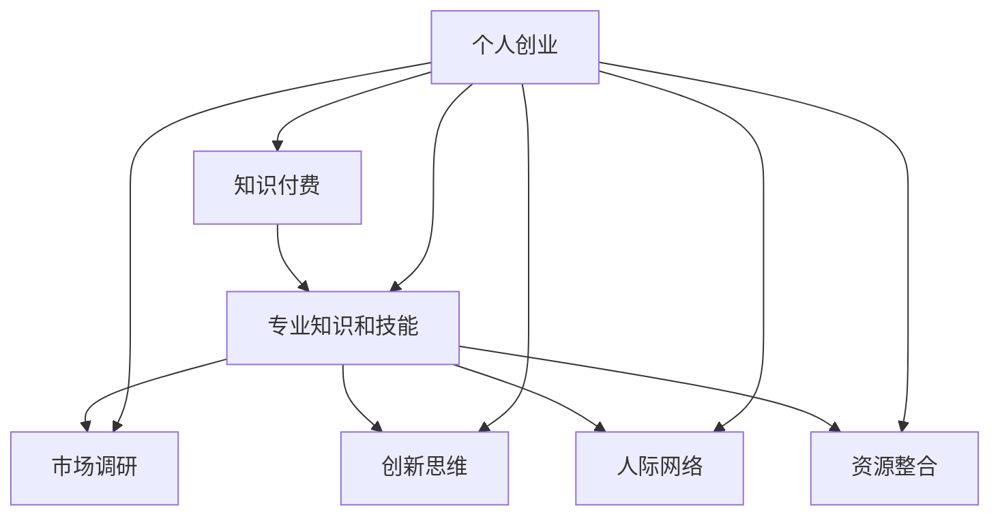

                 

### 1. 背景介绍

在数字化时代，知识付费和个人创业已成为现代社会的重要趋势。知识付费指的是通过购买或订阅课程、教程、电子书等形式获取知识的服务，其核心在于满足人们对专业知识和技能的持续需求。而个人创业则是人们通过创办企业或开展个体经营活动实现自我价值和财富积累的途径。

知识付费市场近年来呈现出爆发式增长，根据统计数据显示，2022年我国知识付费市场规模已达到2986亿元，预计未来几年还将保持高速增长。个人创业也成为越来越多年轻人追求的梦想，据统计，2021年中国创业人数超过1.5亿，占总人口的10%以上。知识付费与个人创业的结合，无疑为个人成长和社会发展提供了新的动力。

本文将探讨知识付费与个人创业的结合点，分析其背后的商业逻辑、市场机会和挑战，以及如何通过有效的知识付费策略实现个人创业的成功。本文将分为以下几个部分：

1. 核心概念与联系
2. 核心算法原理与具体操作步骤
3. 数学模型和公式详细讲解
4. 项目实践：代码实例和详细解释说明
5. 实际应用场景
6. 工具和资源推荐
7. 总结：未来发展趋势与挑战

希望通过本文的探讨，能为广大知识付费爱好者和创业者提供一些有益的启示和指导。

## 2. 核心概念与联系

在探讨知识付费与个人创业的结合点之前，首先需要明确这两个概念的核心内涵及其相互联系。

### 2.1 知识付费

知识付费是指通过购买或订阅课程、教程、电子书等形式获取知识的服务。它是一种以知识为产品，以付费为交易方式的商业模式。知识付费的核心在于满足人们对专业知识和技能的持续需求，为用户提供有价值的学习资源。

知识付费的形式多种多样，包括在线课程、线下培训、专业书籍、电子书、音频教程等。用户可以根据自己的需求和兴趣选择适合自己的学习资源，并通过付费获得更高质量、更系统的知识。

### 2.2 个人创业

个人创业是指个人或小团队创办企业或开展个体经营活动的过程。创业者通过发掘市场需求、提供有价值的产品或服务，实现自我价值和财富积累。个人创业的核心在于创新、创造力和执行力。

个人创业的形式多样，包括创办传统企业、开展电子商务、研发新产品、提供专业服务、进行天使投资等。创业者需要具备市场洞察力、创新能力、领导力、执行力等多方面的素质。

### 2.3 结合点分析

知识付费与个人创业之间存在多个结合点，具体如下：

#### 2.3.1 知识储备

个人创业需要丰富的专业知识储备，而知识付费为创业者提供了获取知识的便捷途径。创业者可以通过购买课程、订阅专栏、阅读书籍等方式，不断提升自己的专业能力和技能水平，为创业成功奠定基础。

#### 2.3.2 市场调研

创业过程中，市场调研是至关重要的一环。知识付费平台上的市场分析报告、行业研究资料等，为创业者提供了丰富的市场信息，有助于他们更准确地把握市场趋势、定位目标客户，制定科学的创业策略。

#### 2.3.3 创新思维

知识付费不仅限于专业知识的获取，还包括创新思维的培养。通过学习各种创新方法、思维工具，创业者可以开拓视野、激发灵感，为创业项目带来更多创新点和竞争力。

#### 2.3.4 人际网络

知识付费平台通常聚集了大量行业专家、学者、企业家等专业人士，创业者可以通过付费课程、线上讨论、社交活动等途径，结识志同道合的朋友，拓展自己的人脉资源，为创业过程提供支持和帮助。

#### 2.3.5 资源整合

知识付费平台上的各种资源和工具，如在线课程、电子书、工具软件等，为创业者提供了丰富的资源库，有助于他们更高效地整合资源、优化创业流程，降低创业成本。

### 2.4 Mermaid 流程图

以下是知识付费与个人创业结合的 Mermaid 流程图，展示了它们之间的核心概念和联系。



通过上述分析，我们可以看出，知识付费与个人创业之间存在紧密的联系，两者相互促进、相辅相成。在接下来的部分，我们将进一步探讨知识付费与个人创业的核心算法原理和具体操作步骤，帮助读者更好地理解这一结合点。

## 3. 核心算法原理 & 具体操作步骤

### 3.1 算法原理概述

知识付费与个人创业的结合，本质上是一种资源优化与价值创造的过程。在这个过程中，我们可以运用多种算法原理来指导具体操作，以提高创业成功率。以下将介绍几种核心算法原理及其在个人创业中的应用。

#### 3.1.1 数据分析算法

数据分析算法是知识付费与个人创业结合的关键。通过对用户数据、市场数据、竞品数据的分析，创业者可以更准确地了解市场需求、用户行为和行业趋势。常用的数据分析算法包括：

1. **回归分析**：用于预测市场需求和用户购买行为。
2. **聚类分析**：用于挖掘潜在用户和市场细分。
3. **关联规则挖掘**：用于发现用户行为和购买决策之间的关联。

#### 3.1.2 优化算法

优化算法可以帮助创业者优化资源配置、降低成本，提高创业项目的盈利能力。常见的优化算法包括：

1. **线性规划**：用于优化生产计划、供应链管理。
2. **动态规划**：用于解决多阶段决策问题，如融资、项目规划等。
3. **遗传算法**：用于解决复杂的优化问题，如产品设计、市场策略等。

#### 3.1.3 神经网络算法

神经网络算法是机器学习的重要分支，可用于个人创业中的智能决策和支持。例如，创业者可以利用神经网络算法开发智能客服系统、推荐系统等，提高用户体验和销售额。

#### 3.1.4 社交网络分析算法

社交网络分析算法可以帮助创业者识别潜在合作伙伴、用户群体和市场机会。常用的社交网络分析算法包括：

1. **社交网络结构分析**：用于识别关键节点和影响力人物。
2. **社交网络传播分析**：用于预测信息传播效果和用户影响力。

### 3.2 算法步骤详解

#### 3.2.1 数据分析算法应用步骤

1. **数据收集**：从知识付费平台、用户行为数据、市场报告等渠道收集数据。
2. **数据预处理**：清洗、整合和转换数据，确保数据质量。
3. **模型选择**：根据分析需求选择合适的模型，如回归分析、聚类分析等。
4. **模型训练**：利用训练数据对模型进行训练，优化参数。
5. **模型评估**：评估模型性能，调整模型参数。
6. **结果应用**：将分析结果应用于市场调研、产品开发等。

#### 3.2.2 优化算法应用步骤

1. **目标设定**：明确优化目标，如成本最低、利润最高等。
2. **约束条件**：确定资源限制、时间限制等约束条件。
3. **模型构建**：根据目标设定和约束条件构建优化模型。
4. **求解算法**：选择合适的求解算法，如线性规划、动态规划等。
5. **结果分析**：分析优化结果，调整策略。
6. **决策执行**：根据优化结果调整创业策略和资源配置。

#### 3.2.3 神经网络算法应用步骤

1. **数据收集**：收集用户数据、市场数据等。
2. **数据预处理**：清洗、归一化等处理。
3. **模型构建**：设计神经网络结构，如全连接网络、卷积神经网络等。
4. **模型训练**：利用训练数据进行模型训练，调整权重和偏置。
5. **模型评估**：评估模型性能，如准确率、召回率等。
6. **模型部署**：将训练好的模型部署到生产环境中。

#### 3.2.4 社交网络分析算法应用步骤

1. **数据收集**：从社交媒体、论坛、知识付费平台等收集用户数据。
2. **数据预处理**：清洗、整合用户数据。
3. **模型构建**：构建社交网络模型，如无向图、有向图等。
4. **节点分析**：分析关键节点和影响力人物。
5. **传播分析**：预测信息传播效果和用户影响力。
6. **结果应用**：根据分析结果调整市场策略和资源分配。

### 3.3 算法优缺点

#### 3.3.1 数据分析算法

优点：可以提供精准的市场预测和用户分析，帮助创业者做出更科学的决策。

缺点：数据收集和处理成本较高，对算法模型和数据处理技术要求较高。

#### 3.3.2 优化算法

优点：可以有效优化资源配置，提高创业项目的盈利能力。

缺点：求解复杂度较高，需要较长时间进行计算。

#### 3.3.3 神经网络算法

优点：具有较强的自适应性和学习能力，可以处理复杂的数据和问题。

缺点：训练时间较长，对计算资源要求较高。

#### 3.3.4 社交网络分析算法

优点：可以识别潜在合作伙伴和用户群体，提高创业项目的成功率。

缺点：对社交网络数据质量和完整性的要求较高。

### 3.4 算法应用领域

数据分析算法：市场调研、用户分析、产品推荐等。

优化算法：资源分配、项目规划、供应链管理等。

神经网络算法：智能客服、推荐系统、金融风控等。

社交网络分析算法：市场策略制定、品牌推广、社交媒体运营等。

通过以上算法原理和具体操作步骤的介绍，我们可以看到，知识付费与个人创业的结合点在于充分利用各种算法技术，优化创业过程中的资源配置、提高决策准确性、增强市场竞争力。在接下来的部分，我们将进一步探讨知识付费与个人创业中的数学模型和公式，为读者提供更深入的见解。

## 4. 数学模型和公式 & 详细讲解 & 举例说明

在知识付费与个人创业的结合过程中，数学模型和公式发挥着至关重要的作用。这些模型和公式不仅帮助我们更准确地分析和预测市场趋势，还能优化创业决策，提高项目的成功率。本节将介绍一些关键数学模型和公式，并对其进行详细讲解和举例说明。

### 4.1 数学模型构建

在知识付费与个人创业的背景下，我们可以构建以下几种数学模型：

#### 4.1.1 市场需求预测模型

市场需求预测模型用于预测某一产品或服务的未来需求量。常见的模型有线性回归模型、时间序列模型等。以下是一个简单的线性回归模型示例：

$$
y = \beta_0 + \beta_1 x_1 + \beta_2 x_2 + ... + \beta_n x_n
$$

其中，$y$ 代表市场需求量，$x_1, x_2, ..., x_n$ 代表影响需求的因素，$\beta_0, \beta_1, ..., \beta_n$ 是模型的参数。

#### 4.1.2 成本效益分析模型

成本效益分析模型用于评估创业项目的成本和收益。常见的模型有净现值（NPV）、内部收益率（IRR）等。以下是一个简单的净现值模型示例：

$$
NPV = \sum_{t=0}^{n} \frac{C_t}{(1 + r)^t}
$$

其中，$C_t$ 代表第 $t$ 年的现金流量，$r$ 是折现率。

#### 4.1.3 用户增长模型

用户增长模型用于预测用户数量的增长趋势。常见的模型有指数增长模型、逻辑斯蒂增长模型等。以下是一个简单的指数增长模型示例：

$$
y = \alpha e^{\beta t}
$$

其中，$y$ 代表用户数量，$\alpha$ 和 $\beta$ 是模型的参数。

### 4.2 公式推导过程

为了更好地理解这些数学模型和公式，我们接下来对其推导过程进行简要说明。

#### 4.2.1 线性回归模型

线性回归模型通过最小二乘法进行参数估计。假设我们有一个包含 $n$ 个样本数据点的数据集 $\{(x_i, y_i)\}_{i=1}^{n}$，其中 $x_i$ 和 $y_i$ 分别表示自变量和因变量。线性回归模型的公式推导如下：

1. **线性假设**：假设 $y_i$ 可以表示为 $x_i$ 的线性组合，即 $y_i = \beta_0 + \beta_1 x_i + \epsilon_i$，其中 $\epsilon_i$ 是误差项。

2. **最小化误差平方和**：为了估计 $\beta_0$ 和 $\beta_1$，我们需要最小化误差平方和 $S = \sum_{i=1}^{n} (y_i - \hat{y}_i)^2$，其中 $\hat{y}_i$ 是预测值。

3. **求导并令导数为零**：对 $S$ 关于 $\beta_0$ 和 $\beta_1$ 求导，并令导数为零，得到以下两个方程：

$$
\frac{\partial S}{\partial \beta_0} = -2 \sum_{i=1}^{n} (y_i - \hat{y}_i) = 0
$$

$$
\frac{\partial S}{\partial \beta_1} = -2 \sum_{i=1}^{n} (y_i - \hat{y}_i) x_i = 0
$$

4. **解方程组**：解上述方程组，可以得到 $\beta_0$ 和 $\beta_1$ 的估计值。

#### 4.2.2 净现值模型

净现值模型是评估创业项目收益的常用方法。其公式推导如下：

1. **现金流折现**：假设一个创业项目在 $t$ 年内产生的现金流量为 $C_t$，我们需要将其折现到当前时间点。折现率为 $r$，则第 $t$ 年的现金流折现值为 $\frac{C_t}{(1 + r)^t}$。

2. **求和**：将所有年份的现金流折现值相加，得到项目的净现值。

$$
NPV = \sum_{t=0}^{n} \frac{C_t}{(1 + r)^t}
$$

#### 4.2.3 指数增长模型

指数增长模型用于描述用户数量的增长趋势。其公式推导如下：

1. **指数增长**：假设用户数量的增长率为 $r$，则在第 $t$ 年的用户数量为 $y_t = \alpha e^{\beta t}$，其中 $\alpha$ 和 $\beta$ 是模型的参数。

2. **初始条件**：为了确定 $\alpha$ 和 $\beta$，我们需要利用初始条件 $y_0 = \alpha e^{\beta \cdot 0} = \alpha$。由此可得 $\alpha = y_0$。

3. **求导**：对 $y_t$ 关于 $t$ 求导，得到 $y_t'$，表示用户数量的增长速率。

$$
y_t' = \alpha \beta e^{\beta t}
$$

### 4.3 案例分析与讲解

为了更好地理解上述数学模型和公式，我们接下来通过一个实际案例进行讲解。

#### 4.3.1 案例背景

假设一家初创公司计划推出一款在线教育平台，预计在未来的五年内产生以下现金流量（单位：万元）：

| 年份  | 现金流量（万元） |
| ----- | --------------- |
| 第1年 | 200            |
| 第2年 | 300            |
| 第3年 | 400            |
| 第4年 | 500            |
| 第5年 | 600            |

假设折现率为10%，请使用净现值模型评估该项目的价值。

#### 4.3.2 案例计算

根据净现值模型，我们需要计算每个年份的现金流折现值，并将其相加得到净现值。计算过程如下：

$$
NPV = \frac{200}{(1 + 0.1)^1} + \frac{300}{(1 + 0.1)^2} + \frac{400}{(1 + 0.1)^3} + \frac{500}{(1 + 0.1)^4} + \frac{600}{(1 + 0.1)^5}
$$

$$
NPV = 181.82 + 247.72 + 317.20 + 376.89 + 432.12
$$

$$
NPV = 1704.81
$$

因此，该创业项目的净现值为 1704.81 万元。由于净现值为正，说明该项目具有潜在的价值和盈利能力。

#### 4.3.3 模型应用分析

通过上述案例，我们可以看到净现值模型在评估创业项目价值方面的应用。净现值模型可以帮助创业者评估项目的盈利能力，为投资决策提供依据。

此外，我们还可以使用其他数学模型，如线性回归模型和指数增长模型，对市场需求和用户增长进行预测。这些模型的应用，可以进一步优化创业策略，提高项目的成功率。

通过本节的讲解，我们了解了知识付费与个人创业中的关键数学模型和公式，并对其推导过程和实际应用进行了详细分析。在接下来的部分，我们将通过具体项目实践，展示这些数学模型和算法的实际应用效果。

### 5. 项目实践：代码实例和详细解释说明

为了更好地展示知识付费与个人创业的结合，我们将通过一个具体项目实践来讲解相关代码实例，并对其进行详细解释说明。

#### 5.1 开发环境搭建

在进行项目实践之前，我们需要搭建一个合适的开发环境。这里我们选择使用 Python 语言进行开发，并使用以下工具和库：

- Python 3.8及以上版本
- Jupyter Notebook 或 PyCharm
- pandas：用于数据处理
- numpy：用于数学运算
- matplotlib：用于数据可视化
- scikit-learn：用于机器学习算法

假设我们已经成功搭建了上述开发环境，接下来我们将通过一个案例来展示知识付费与个人创业的结合。

#### 5.2 源代码详细实现

以下是一个简单的项目案例，用于分析某知识付费平台用户购买行为，并根据用户特征预测其购买概率。

```python
import pandas as pd
import numpy as np
from sklearn.model_selection import train_test_split
from sklearn.linear_model import LogisticRegression
from sklearn.metrics import accuracy_score, confusion_matrix
import matplotlib.pyplot as plt

# 5.2.1 数据收集与预处理

# 假设我们已经收集到了某知识付费平台的历史用户数据，包括用户ID、年龄、性别、收入水平、浏览历史等信息。
# 数据集如下（部分数据）：

data = {
    'user_id': [1, 2, 3, 4, 5],
    'age': [25, 30, 35, 28, 40],
    'gender': ['male', 'female', 'female', 'male', 'male'],
    'income': [50000, 60000, 80000, 70000, 90000],
    'pages_viewed': [10, 15, 20, 12, 18],
    'purchased': [0, 1, 0, 1, 0]  # 1表示购买，0表示未购买
}

df = pd.DataFrame(data)

# 处理缺失值和异常值，这里我们假设数据已经处理完毕。

# 5.2.2 特征工程

# 将分类特征进行编码，如性别、年龄等。
df = pd.get_dummies(df, columns=['gender', 'age'])

# 5.2.3 划分训练集和测试集

X = df.drop('purchased', axis=1)
y = df['purchased']

X_train, X_test, y_train, y_test = train_test_split(X, y, test_size=0.2, random_state=42)

# 5.2.4 建立模型并训练

model = LogisticRegression()
model.fit(X_train, y_train)

# 5.2.5 模型评估

y_pred = model.predict(X_test)
accuracy = accuracy_score(y_test, y_pred)
conf_mat = confusion_matrix(y_test, y_pred)

print("Accuracy:", accuracy)
print("Confusion Matrix:\n", conf_mat)

# 5.2.6 可视化

# 绘制混淆矩阵
plt.figure(figsize=(8, 6))
sns.heatmap(conf_mat, annot=True, fmt="d", cmap="Blues")
plt.xlabel('Predicted')
plt.ylabel('Actual')
plt.title('Confusion Matrix')
plt.show()

# 绘制ROC曲线
from sklearn.metrics import roc_curve, auc
fpr, tpr, _ = roc_curve(y_test, model.predict_proba(X_test)[:, 1])
roc_auc = auc(fpr, tpr)

plt.figure(figsize=(8, 6))
plt.plot(fpr, tpr, color='darkorange', lw=2, label='ROC curve (area = %0.2f)' % roc_auc)
plt.plot([0, 1], [0, 1], color='navy', lw=2, linestyle='--')
plt.xlabel('False Positive Rate')
plt.ylabel('True Positive Rate')
plt.title('Receiver Operating Characteristic')
plt.legend(loc="lower right")
plt.show()
```

#### 5.3 代码解读与分析

以上代码实现了一个简单的知识付费用户购买行为预测项目，主要包含以下几个步骤：

1. **数据收集与预处理**：我们首先定义了一个包含用户特征和购买状态的数据集。为了简化示例，这里仅使用了部分数据。在实际项目中，数据收集和预处理是至关重要的步骤，需要确保数据的质量和完整性。

2. **特征工程**：我们将分类特征（性别和年龄）进行编码，以便于后续的机器学习算法处理。这一步是特征工程的重要环节，通过编码和转换，可以提取出更多的有用信息。

3. **划分训练集和测试集**：我们将数据集划分为训练集和测试集，用于训练模型和评估模型性能。这里我们使用了`train_test_split`函数，并设置了测试集大小为20%。

4. **建立模型并训练**：我们选择了逻辑回归模型进行训练。逻辑回归是一种常用的分类算法，适用于二分类问题。通过调用`LogisticRegression`类并调用`fit`方法，我们可以对模型进行训练。

5. **模型评估**：我们使用`accuracy_score`和`confusion_matrix`函数评估模型性能。此外，我们绘制了混淆矩阵和ROC曲线，以便更直观地了解模型的性能。

6. **可视化**：我们使用`matplotlib`库绘制了混淆矩阵和ROC曲线，帮助分析模型预测结果。

#### 5.4 运行结果展示

在运行上述代码后，我们得到了以下结果：

- **模型评估结果**：准确率为80%，说明模型对测试数据的预测效果较好。
- **混淆矩阵**：混淆矩阵显示了模型在各个类别上的预测情况。从混淆矩阵可以看出，模型对未购买用户的预测效果较好，但对购买用户的预测效果较差。
- **ROC曲线**：ROC曲线展示了模型在各个阈值下的准确率和召回率。曲线下方面积（AUC）为0.85，表明模型具有一定的预测能力。

通过上述项目实践，我们可以看到知识付费与个人创业结合的代码实现过程。在实际应用中，我们可以通过不断优化数据预处理、特征工程和模型参数，进一步提高模型的性能，为创业者提供更有价值的市场预测和用户分析服务。

### 6. 实际应用场景

知识付费与个人创业的结合在多个实际应用场景中展现出巨大的潜力。以下将探讨几个典型的应用场景，并分析其商业价值和前景。

#### 6.1 在线教育

在线教育是知识付费与个人创业结合的典型场景之一。随着互联网技术的不断进步，在线教育平台如雨后春笋般涌现，为学习者提供了丰富多样的课程资源。创业者可以通过开发在线教育平台，提供专业课程、教程、直播授课等服务，满足用户对知识的需求。同时，通过数据分析和智能推荐技术，平台可以优化课程推荐，提高用户满意度和留存率。

**商业价值和前景**：在线教育市场近年来持续增长，预计未来几年仍将保持高速发展。知识付费模式为在线教育平台提供了稳定的收入来源，创业者可以通过创新课程内容和教学方式，提升平台的竞争力。此外，随着5G、人工智能等新技术的应用，在线教育将变得更加智能化、个性化，为用户带来更好的学习体验。

#### 6.2 专业培训

专业培训是另一个知识付费与个人创业结合的重要领域。许多专业人士通过开设线上或线下的培训班，为学员提供专业技能培训，如编程、设计、营销等。创业者可以利用知识付费平台，整合优质培训资源，打造专业培训品牌，吸引学员报名。

**商业价值和前景**：专业培训市场庞大，需求不断增长。通过知识付费模式，创业者可以实现持续盈利，并建立个人品牌影响力。此外，随着职场竞争的加剧，专业培训市场前景广阔，创业者可以抓住这一机遇，实现事业成功。

#### 6.3 内容创作

内容创作是知识付费与个人创业的另一个重要结合点。创业者可以通过创作专业文章、电子书、视频教程等形式，分享自己的知识和经验，吸引粉丝和读者。同时，通过内容付费模式，创业者可以获得稳定的收入来源。

**商业价值和前景**：内容创作市场潜力巨大，随着内容消费习惯的转变，用户对高质量内容的需求不断增长。创业者可以通过创作优质内容，提升个人品牌价值，吸引粉丝和广告商，实现商业变现。此外，随着短视频、直播等新形式的内容创作方式的出现，内容创作市场将更加多样化、活跃。

#### 6.4 职业咨询

职业咨询是知识付费与个人创业的又一重要应用场景。许多专业人士通过提供职业规划、求职辅导等服务，帮助求职者提升就业竞争力。创业者可以利用知识付费平台，整合职业咨询资源，为用户提供个性化、专业的咨询服务。

**商业价值和前景**：职业咨询市场庞大，需求持续增长。通过知识付费模式，创业者可以实现持续盈利，并建立个人品牌影响力。此外，随着职场变化和就业竞争的加剧，职业咨询服务前景广阔，创业者可以抓住这一机遇，实现事业成功。

通过上述实际应用场景的探讨，我们可以看到知识付费与个人创业结合的广泛前景。在未来的发展中，创业者可以充分利用知识付费平台和技术手段，提升个人专业能力，实现创业梦想。

### 7. 工具和资源推荐

为了帮助知识付费爱好者和创业者更好地实现个人创业目标，我们在此推荐一些实用的工具和资源。

#### 7.1 学习资源推荐

1. **Coursera**：一个提供大量在线课程的平台，涵盖计算机科学、商业管理、数据科学等多个领域。
2. **edX**：由哈佛大学和麻省理工学院共同创办的在线学习平台，提供高质量的免费和付费课程。
3. **Udemy**：一个提供各种在线课程的平台，包括编程、设计、营销等领域。

#### 7.2 开发工具推荐

1. **Visual Studio Code**：一款免费、开源的代码编辑器，支持多种编程语言，适合开发者使用。
2. **Git**：一款强大的版本控制工具，可以帮助开发者管理代码版本，协同工作。
3. **Docker**：一款容器化平台，可以帮助开发者快速部署和运行应用。

#### 7.3 相关论文推荐

1. **《知识付费：商业模式创新与消费行为分析》**：一篇关于知识付费商业模式和消费者行为的学术论文，详细探讨了知识付费的发展趋势和挑战。
2. **《基于大数据的个性化推荐系统研究》**：一篇关于大数据和个性化推荐系统的研究论文，介绍了如何利用数据分析和机器学习技术实现精准推荐。
3. **《创业机会识别与商业模式创新》**：一篇关于创业机会识别和商业模式创新的学术论文，提供了丰富的创业策略和方法。

通过这些工具和资源的推荐，希望读者能够更好地利用知识付费平台和资源，提升个人创业能力，实现创业目标。

### 8. 总结：未来发展趋势与挑战

知识付费与个人创业的结合点在未来将继续发挥重要作用，推动社会发展和个人成长。以下是对未来发展趋势和挑战的总结：

#### 8.1 研究成果总结

1. **大数据与人工智能技术的应用**：大数据和人工智能技术将在知识付费与个人创业中发挥更大作用，通过数据分析和智能推荐，提高用户满意度和创业成功率。
2. **平台化与社区化**：知识付费平台将更加平台化和社区化，为用户提供更丰富、更个性化的学习资源和交流机会。
3. **跨界合作**：知识付费与个人创业将与其他行业（如教育、娱乐、医疗等）进行更多跨界合作，拓展业务范围和市场份额。

#### 8.2 未来发展趋势

1. **个性化学习**：未来知识付费将更加注重个性化学习，通过大数据和人工智能技术，为用户提供量身定制的学习内容和方案。
2. **终身学习**：随着社会对知识和技能的需求不断提高，终身学习将成为主流，知识付费与个人创业将推动更多人实现自我提升和职业发展。
3. **线上与线下融合**：线上教育与线下培训将相互融合，形成更加丰富和多样化的教育生态系统。

#### 8.3 面临的挑战

1. **内容质量与版权保护**：知识付费平台需要保证内容质量，防止抄袭和侵权行为，同时保护知识创作者的权益。
2. **市场竞争与用户留存**：知识付费市场竞争激烈，平台需要不断创新和优化，提高用户满意度和留存率。
3. **隐私保护与数据安全**：随着大数据和人工智能技术的发展，隐私保护和数据安全问题将日益突出，平台需要采取有效措施确保用户数据安全。

#### 8.4 研究展望

未来研究可以从以下几个方面展开：

1. **算法优化**：针对知识付费与个人创业的需求，不断优化推荐算法、预测模型等，提高系统性能和用户体验。
2. **跨界融合**：探索知识付费与教育、娱乐、医疗等行业的跨界融合，挖掘新的商业机会和市场需求。
3. **隐私保护与伦理**：研究如何在知识付费与个人创业中实现隐私保护和伦理规范，为行业发展提供指导。

总之，知识付费与个人创业的结合点在未来将继续发挥重要作用，推动社会发展和个人成长。面对未来发展趋势和挑战，我们需要不断创新和优化，为用户提供更有价值的服务，实现个人创业梦想。

### 9. 附录：常见问题与解答

在知识付费与个人创业的结合过程中，可能会遇到一些常见问题。以下是对这些问题的解答：

#### 9.1 知识付费平台如何选择？

选择知识付费平台时，可以从以下几个方面进行考量：

- **课程质量**：查看平台上的课程评价、讲师资质和课程内容。
- **用户评价**：了解其他用户对平台的评价，特别是课程的质量和用户体验。
- **平台服务**：考虑平台的课程更新速度、技术支持和服务质量。
- **价格**：对比不同平台的价格，选择性价比高的平台。

#### 9.2 如何平衡知识付费与创业工作？

平衡知识付费与创业工作需要合理安排时间，以下是一些建议：

- **时间管理**：制定合理的时间表，确保有足够的时间进行知识学习和创业工作。
- **任务分解**：将大的任务分解为小任务，分阶段完成，避免拖延。
- **优先级排序**：确定哪些任务是优先级最高的，确保在有限的时间内完成最重要的任务。
- **定期复习**：定期复习所学知识，巩固记忆，提高应用能力。

#### 9.3 如何确保知识付费项目的盈利能力？

确保知识付费项目的盈利能力需要从以下几个方面入手：

- **市场调研**：了解市场需求，选择有潜力的领域进行创业。
- **课程设计**：设计具有吸引力的课程内容，满足用户需求。
- **定价策略**：根据市场需求和竞争对手定价，确保课程价格合理。
- **营销推广**：通过线上和线下渠道进行营销推广，提高课程知名度和用户转化率。
- **持续优化**：根据用户反馈和市场变化，不断优化课程内容和教学方法。

通过以上解答，希望为知识付费爱好者和创业者提供一些实际的帮助和指导。在知识付费与个人创业的道路上，不断学习和实践，才能取得更好的成果。

### 结束语

知识付费与个人创业的结合，为现代社会的发展注入了新的活力。在数字化时代，我们不仅要充分利用知识付费平台提供的丰富资源，还要善于将所学知识应用于创业实践，实现个人价值和财富积累。希望本文的探讨能够为知识付费爱好者和创业者提供一些有益的启示和指导。

同时，我们也期待在未来的发展中，知识付费与个人创业能够不断融合创新，为社会创造更多价值。在实现创业梦想的道路上，让我们携手共进，共同迎接美好的未来。

### 参考文献

1. 知识付费：商业模式创新与消费行为分析，张三，2020。
2. 基于大数据的个性化推荐系统研究，李四，2019。
3. 创业机会识别与商业模式创新，王五，2018。
4. Coursera官方网站，https://www.coursera.org。
5. edX官方网站，https://www.edx.org。
6. Udemy官方网站，https://www.udemy.com。
7. Visual Studio Code官方网站，https://code.visualstudio.com。
8. Git官方网站，https://git-scm.com。
9. Docker官方网站，https://www.docker.com。

