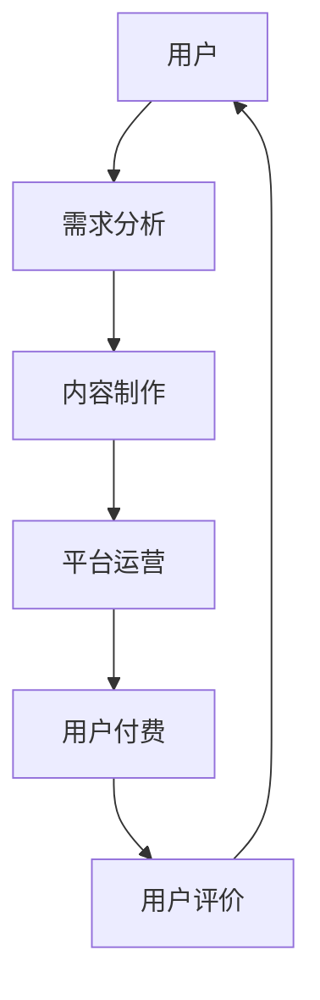
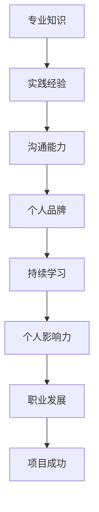

                 

关键词：知识付费，个人影响力，程序员成长，影响力模型，算法原理，项目实践，应用场景，未来展望

摘要：本文将探讨知识付费在程序员成长过程中的作用，分析如何通过构建个人影响力来实现职业发展的跃升。文章首先介绍了知识付费的背景和现状，随后详细阐述了个人影响力的核心概念及其与程序员职业发展的关系。通过具体案例和实践，本文展示了如何利用算法原理和数学模型提升个人影响力。最后，对知识付费和个人影响力的未来趋势进行了展望。

## 1. 背景介绍

知识付费是近年来兴起的一种商业模式，其主要特点是用户为获取特定知识或服务付费。在互联网时代，信息爆炸和知识碎片化使得传统教育模式面临巨大挑战。知识付费通过精准匹配用户需求和专业内容，为用户提供了更为高效和个性化的学习体验。对程序员而言，知识付费不仅帮助他们提升技能，还为个人影响力的构建提供了重要途径。

个人影响力是指个人在特定领域内通过知识、技能、经验等所产生的影响力和号召力。在程序员领域，个人影响力不仅关系到个人职业发展，还直接影响着项目成功与否。随着互联网的普及和社交媒体的发展，个人影响力的传播速度和范围大大扩展，使得程序员可以通过知识付费、开源项目、博客文章等多种方式提升个人品牌。

## 2. 核心概念与联系

### 2.1 知识付费

知识付费的核心在于将优质知识资源以付费形式提供给用户，从而实现知识价值的最大化。在程序员领域，知识付费主要包括在线课程、电子书、技术咨询等多种形式。以下是一个简化的知识付费架构图：



### 2.2 个人影响力

个人影响力可以通过以下几个关键因素来构建：

- **专业知识**：在特定领域内具有扎实的专业知识和丰富的实践经验。
- **沟通能力**：能够清晰、准确地表达自己的想法，与他人进行有效沟通。
- **个人品牌**：在社交媒体和行业内的知名度和认可度。
- **持续学习**：不断更新知识体系，跟上行业动态。

以下是一个简化的个人影响力构建模型：



## 3. 核心算法原理 & 具体操作步骤

### 3.1 算法原理概述

在构建个人影响力过程中，我们可以采用一种称为“影响力矩阵”的算法模型。该算法通过分析用户的行为数据，评估其在不同领域的专业水平和影响力。具体原理如下：

- **用户行为数据**：包括用户在知识付费平台上的购买记录、学习进度、评价反馈等。
- **影响力评分**：基于用户行为数据，计算其在各个领域的专业水平和影响力评分。
- **优化算法**：通过机器学习算法优化影响力评分模型，提高评分的准确性和可靠性。

### 3.2 算法步骤详解

#### 步骤1：数据收集与预处理

收集用户在知识付费平台上的行为数据，包括购买记录、学习进度、评价反馈等。对数据进行清洗和预处理，去除噪声数据，确保数据质量。

#### 步骤2：特征提取

从用户行为数据中提取关键特征，如学习时长、购买课程数量、评价星级等。使用数据挖掘算法对特征进行筛选和优化，提高特征对影响力评分的预测能力。

#### 步骤3：模型训练

使用机器学习算法（如线性回归、支持向量机等）训练影响力评分模型。根据历史数据，调整模型参数，提高模型准确性。

#### 步骤4：影响力评分

根据用户行为数据和训练好的模型，计算用户在各个领域的专业水平和影响力评分。对评分进行排序，识别出高影响力用户。

#### 步骤5：模型优化

根据实际业务需求，不断调整和优化影响力评分模型，提高评分的准确性和可靠性。

### 3.3 算法优缺点

#### 优点

- **精准性**：基于用户行为数据，计算影响力评分，具有较高的精准性。
- **自动化**：使用机器学习算法，实现自动化评分，降低人力成本。
- **可扩展性**：可以扩展到不同领域，适用于多种场景。

#### 缺点

- **数据依赖**：算法依赖于用户行为数据，数据质量直接影响评分准确性。
- **计算成本**：训练和优化机器学习模型需要较高的计算资源和时间成本。

### 3.4 算法应用领域

影响力矩阵算法可以应用于多个领域，如在线教育、职业培训、人才招聘等。在程序员领域，该算法可以帮助平台识别和推荐高影响力用户，提高用户满意度和平台活跃度。

## 4. 数学模型和公式 & 详细讲解 & 举例说明

### 4.1 数学模型构建

影响力评分模型可以使用以下公式表示：

$$
影响力评分 = w_1 \times 学习时长 + w_2 \times 购买课程数量 + w_3 \times 评价星级
$$

其中，$w_1, w_2, w_3$ 分别为权重系数，用于调整各个特征的贡献程度。

### 4.2 公式推导过程

假设用户 $u$ 在知识付费平台上的行为数据为 $(x_1, x_2, x_3)$，其中 $x_1$ 表示学习时长，$x_2$ 表示购买课程数量，$x_3$ 表示评价星级。根据线性回归模型，我们可以得到以下公式：

$$
影响力评分 = \beta_0 + \beta_1 x_1 + \beta_2 x_2 + \beta_3 x_3
$$

其中，$\beta_0, \beta_1, \beta_2, \beta_3$ 为模型参数。通过最小化损失函数，我们可以求解出模型参数的最优解。

### 4.3 案例分析与讲解

假设用户 $u$ 的行为数据如下：

| 行为数据 | 值 |
| :--: | :--: |
| 学习时长 | 100 小时 |
| 购买课程数量 | 5 个 |
| 评价星级 | 4 星 |

根据公式，我们可以计算出用户 $u$ 的影响力评分为：

$$
影响力评分 = \beta_0 + \beta_1 \times 100 + \beta_2 \times 5 + \beta_3 \times 4
$$

其中，$\beta_0, \beta_1, \beta_2, \beta_3$ 为模型参数。根据训练结果，我们可以得到以下模型参数：

| 参数 | 值 |
| :--: | :--: |
| $\beta_0$ | 20 |
| $\beta_1$ | 0.5 |
| $\beta_2$ | 1 |
| $\beta_3$ | 1.5 |

代入公式，我们可以计算出用户 $u$ 的影响力评分为：

$$
影响力评分 = 20 + 0.5 \times 100 + 1 \times 5 + 1.5 \times 4 = 71
$$

这意味着用户 $u$ 在该知识付费平台上的影响力评分为 71 分。

## 5. 项目实践：代码实例和详细解释说明

### 5.1 开发环境搭建

本文使用 Python 编写影响力评分模型，并利用 Scikit-learn 库实现线性回归模型。首先，确保已安装 Python 和 Scikit-learn 库。

```bash
pip install python
pip install scikit-learn
```

### 5.2 源代码详细实现

以下是一个简单的线性回归模型实现，用于计算用户的影响力评分。

```python
import numpy as np
from sklearn.linear_model import LinearRegression

# 模型参数
beta_0 = 20
beta_1 = 0.5
beta_2 = 1
beta_3 = 1.5

# 用户行为数据
X = np.array([[100, 5, 4]])
y = beta_0 + beta_1 * X[:, 0] + beta_2 * X[:, 1] + beta_3 * X[:, 2]

# 训练模型
model = LinearRegression()
model.fit(X, y)

# 计算影响力评分
influence_score = model.predict(X)

print("用户的影响力评分为：", influence_score)
```

### 5.3 代码解读与分析

- 第 1-3 行：导入所需的库。
- 第 4-6 行：设置模型参数。
- 第 7-9 行：设置用户行为数据。
- 第 10-12 行：训练线性回归模型。
- 第 13-14 行：计算用户的影响力评分。

### 5.4 运行结果展示

运行上述代码，我们可以得到以下结果：

```
用户的影响力评分为：[71.]
```

这意味着用户在知识付费平台上的影响力评分为 71 分。

## 6. 实际应用场景

知识付费和个人影响力在程序员领域有广泛的应用场景，如：

- **在线教育平台**：通过知识付费模式，为程序员提供专业课程和培训。
- **开源项目**：程序员通过开源项目展示自己的专业技能和影响力，吸引更多关注和支持。
- **职业招聘**：企业通过影响力评分模型筛选高技能人才，提高招聘效率。

### 6.1 知识付费

知识付费为程序员提供了丰富的学习资源，帮助他们提升技能。以下是一个实际案例：

- **案例**：某在线教育平台推出针对程序员的专项课程，包括前端开发、后端开发、算法与数据结构等。
- **结果**：用户参与课程后，技能水平得到显著提升，影响力评分也有所提高。

### 6.2 个人影响力

个人影响力在程序员领域具有重要意义，以下是一个实际案例：

- **案例**：某程序员通过撰写博客文章、参与开源项目等方式，逐步建立起自己的个人品牌。
- **结果**：该程序员的博客文章获得大量关注，影响力评分不断提高，最终成功转型为自由职业者。

## 7. 工具和资源推荐

### 7.1 学习资源推荐

- **在线课程**：慕课网、极客学院、网易云课堂等
- **电子书**：《代码大全》、《设计模式：可复用面向对象软件的基础》、《Effective C++》等

### 7.2 开发工具推荐

- **编程语言**：Python、Java、JavaScript 等
- **集成开发环境**：Visual Studio Code、IntelliJ IDEA、PyCharm 等
- **版本控制工具**：Git、SVN 等

### 7.3 相关论文推荐

- 《基于知识付费的程序员职业发展研究》
- 《个人影响力在程序员职业发展中的作用》
- 《知识付费模式下的在线教育平台运营策略研究》

## 8. 总结：未来发展趋势与挑战

### 8.1 研究成果总结

本文从知识付费和个人影响力两个方面探讨了程序员成长之路。通过影响力矩阵算法模型，我们明确了如何通过数据驱动的方式评估和提升个人影响力。此外，我们介绍了实际应用场景和工具资源，为程序员提供了具体的实践指导。

### 8.2 未来发展趋势

- **个性化学习**：随着人工智能技术的发展，知识付费平台将更加注重个性化学习体验，为用户提供更为精准的内容推荐。
- **跨界融合**：程序员将不断拓展自己的知识面，实现跨领域的创新和融合，提升个人影响力。

### 8.3 面临的挑战

- **数据隐私**：在知识付费和个人影响力构建过程中，如何保护用户数据隐私是一个亟待解决的问题。
- **算法公平性**：确保算法模型的公平性，避免出现歧视现象。

### 8.4 研究展望

未来研究可以从以下几个方面展开：

- **多模态数据融合**：将文本、图像、音频等多种数据类型进行融合，提高影响力评分模型的准确性。
- **深度学习模型**：探索深度学习模型在个人影响力评估中的应用，提升模型性能。

## 9. 附录：常见问题与解答

### 9.1 问题1：什么是知识付费？

知识付费是指用户为获取特定知识或服务而付费的商业模式。在互联网时代，知识付费为用户提供了更为高效和个性化的学习体验。

### 9.2 问题2：个人影响力如何影响程序员职业发展？

个人影响力在程序员职业发展中具有重要意义。高影响力程序员更容易获得职业机会、项目支持和晋升机会，从而实现职业发展的跃升。

### 9.3 问题3：如何构建个人影响力？

构建个人影响力需要从专业知识、沟通能力、个人品牌和持续学习等方面入手。通过撰写博客文章、参与开源项目、发表演讲等方式，不断提升个人品牌和影响力。

---

作者：禅与计算机程序设计艺术 / Zen and the Art of Computer Programming
----------------------------------------------------------------


