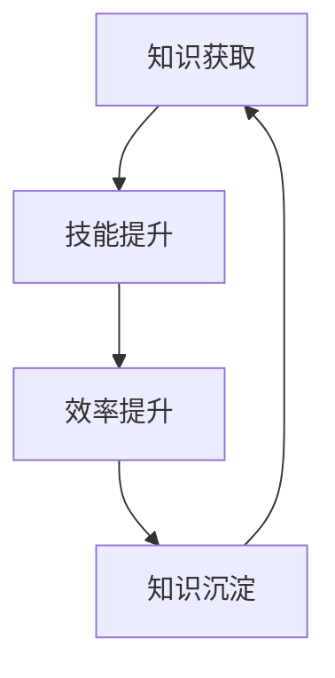

                 

关键词：知识付费、个人效率、学习动力、时间管理、技术技能、职场发展

> 摘要：本文将探讨知识付费在提升个人效率方面的作用，分析其如何通过建立正向循环，助力个体实现技术技能提升和职场发展。

## 1. 背景介绍

在信息化时代，知识更新速度迅猛，获取高质量知识的难度也随之增加。传统学习方式，如学校教育和自学，往往存在资源有限、进度难以控制等问题。知识付费作为一种新兴的学习模式，应运而生。它通过提供专业化、结构化的知识内容，帮助用户高效学习，提高个人技能和职场竞争力。

知识付费的主要形式包括在线课程、电子书、付费讲座、专业咨询等。与传统学习模式相比，知识付费具有以下优势：

- **个性化学习**：用户可以根据自身需求和兴趣，选择适合自己的学习内容。
- **高效率**：知识付费通常提供结构化的内容，帮助用户快速掌握核心知识。
- **互动性**：许多知识付费产品提供了论坛、讨论组等互动功能，方便用户交流学习心得。
- **实时更新**：知识付费产品往往定期更新内容，确保用户能够获取最新的知识。

然而，知识付费也存在一些问题，如内容质量参差不齐、学习效果难以衡量等。本文将重点探讨知识付费如何通过建立正向循环，帮助个人提升效率，并探讨这一过程中的关键因素。

## 2. 核心概念与联系

### 2.1 知识付费的概念

知识付费是指用户为了获取特定领域的知识或技能，付费购买相关学习资源或服务的过程。这种模式的核心在于“付费”，即用户通过支付一定费用，换取高质量的、有价值的知识内容。

### 2.2 个人效率的概念

个人效率是指个体在单位时间内完成任务的效率。它不仅包括完成任务的速率，还包括任务的质量和准确性。个人效率的提升，意味着在相同的时间内，个体能够完成更多的任务，或者以更高质量的方式完成任务。

### 2.3 正向循环的建立

正向循环是指通过某一过程，使得结果反馈到该过程，进而提高过程效率的循环。在知识付费与个人效率提升的背景下，正向循环的建立过程如下：

1. **知识获取**：用户通过知识付费获取高质量的知识内容。
2. **技能提升**：用户将所学知识应用于实践，提升个人技能。
3. **效率提升**：技能提升带来工作效率的提高。
4. **知识沉淀**：高效率的工作使得用户有更多时间沉淀和应用知识，形成良性循环。

### 2.4 Mermaid 流程图

下面是一个简化的Mermaid流程图，描述了知识付费与个人效率提升的正向循环：



## 3. 核心算法原理 & 具体操作步骤

### 3.1 算法原理概述

知识付费与个人效率提升的核心算法原理可以概括为“持续学习 - 技能应用 - 效率优化 - 知识迭代”。这一算法通过以下步骤实现：

1. **持续学习**：用户通过知识付费获取最新、最专业的知识内容。
2. **技能应用**：用户将所学知识应用到实际工作中，通过实践提升技能。
3. **效率优化**：通过技能提升，用户能够更高效地完成任务，提高工作效率。
4. **知识迭代**：高效的工作使得用户有更多时间学习新知识，形成良性循环。

### 3.2 算法步骤详解

1. **知识获取**：用户选择适合自己的知识付费产品，如在线课程、电子书等，开始学习。
    ```mermaid
    subgraph 知识获取
        A[选择课程] --> B[购买课程]
        B --> C[开始学习]
    end
    ```

2. **技能应用**：用户将所学知识应用于实际工作中，通过实践提升技能。
    ```mermaid
    subgraph 技能应用
        D[应用知识] --> E[实践任务]
        E --> F[反馈与调整]
    end
    ```

3. **效率提升**：通过技能提升，用户能够更高效地完成任务，提高工作效率。
    ```mermaid
    subgraph 效率提升
        G[效率提升] --> H[完成任务]
    end
    ```

4. **知识迭代**：高效的工作使得用户有更多时间学习新知识，形成良性循环。
    ```mermaid
    subgraph 知识迭代
        I[学习新知识] --> J[持续学习]
    end
    ```

### 3.3 算法优缺点

#### 优点：

- **高效性**：通过知识付费，用户可以快速获取高质量的知识内容，提升学习效率。
- **持续性**：正向循环机制使得用户能够不断学习和应用知识，形成长期的学习动力。
- **个性化**：用户可以根据自身需求选择适合自己的学习内容，实现个性化学习。

#### 缺点：

- **成本**：知识付费需要用户支付一定费用，对部分用户可能构成经济负担。
- **内容质量**：知识付费市场上存在大量内容质量参差不齐的产品，用户需要慎重选择。

### 3.4 算法应用领域

知识付费与个人效率提升的算法广泛应用于以下领域：

- **职业技能培训**：如编程、数据分析、项目管理等。
- **个人兴趣培养**：如摄影、绘画、音乐等。
- **终身学习**：对个人职业发展和个人成长具有持续的需求。

## 4. 数学模型和公式 & 详细讲解 & 举例说明

### 4.1 数学模型构建

为了量化知识付费与个人效率提升的正向循环，我们可以构建以下数学模型：

\[ E(t) = f(L(t), P(t), T(t)) \]

其中：
- \( E(t) \)：时间 \( t \) 内的个人效率。
- \( L(t) \)：时间 \( t \) 内的学习量。
- \( P(t) \)：时间 \( t \) 内的实践量。
- \( T(t) \)：时间 \( t \) 内的总时间。

### 4.2 公式推导过程

1. **学习量与效率的关系**：

   假设学习量与效率呈线性关系，即：

   \[ E(t) = k \cdot L(t) \]

   其中 \( k \) 为学习效率系数。

2. **实践量与效率的关系**：

   实践量可以提高技能水平，进而提高效率。假设实践量与效率的关系为：

   \[ E(t) = k' \cdot P(t) \]

   其中 \( k' \) 为实践效率系数。

3. **总时间与效率的关系**：

   总时间是学习量和实践量的总和，因此：

   \[ E(t) = \frac{k \cdot L(t) + k' \cdot P(t)}{T(t)} \]

### 4.3 案例分析与讲解

假设一个程序员在一个月内，花费了20小时学习一门新的编程语言（\( L(t) = 20 \) 小时），并在实践中使用了这20小时（\( P(t) = 20 \) 小时），总共花费了40小时（\( T(t) = 40 \) 小时）。

根据上述模型，我们可以计算他在一个月后的个人效率：

\[ E(t) = \frac{k \cdot 20 + k' \cdot 20}{40} \]

为了简化计算，我们假设 \( k = k' = 0.5 \)（即每小时的效率和每小时的实践效率均为0.5）：

\[ E(t) = \frac{0.5 \cdot 20 + 0.5 \cdot 20}{40} = \frac{10 + 10}{40} = \frac{20}{40} = 0.5 \]

这意味着，这个程序员在一个月内的个人效率提高了0.5，即从原来的每小时完成任务的数量增加到了每小时完成0.5个任务。

### 4.4 实际应用场景

在职场中，个人效率的提升往往意味着更高的产出和更好的职业发展机会。以下是一个实际应用场景：

- **项目背景**：一家互联网公司正在开发一个大型电商项目，程序员小张负责其中的订单处理模块。
- **问题分析**：订单处理模块的代码复杂，处理效率较低，影响了整体项目的进度。
- **解决方案**：小张通过知识付费，学习了优化代码的技巧，并在实践中应用这些技巧，提升了代码的执行效率。

通过这一过程，小张的个人效率得到了显著提升，不仅完成了自己的任务，还协助团队解决了多个技术难题，获得了领导的认可。

## 5. 项目实践：代码实例和详细解释说明

### 5.1 开发环境搭建

为了演示知识付费如何提升个人效率，我们将通过一个实际的编程项目来说明。在这个项目中，我们将使用Python编程语言，实现一个简单的数据分析应用。

- **开发环境**：Python 3.8，Jupyter Notebook。
- **依赖库**：pandas，numpy，matplotlib。

首先，确保已经安装了Python和所需的库。如果没有，可以通过以下命令进行安装：

```bash
pip install python==3.8
pip install pandas numpy matplotlib
```

### 5.2 源代码详细实现

以下是一个简单的Python代码实例，用于读取数据、进行基本的数据清洗和可视化：

```python
# 导入依赖库
import pandas as pd
import numpy as np
import matplotlib.pyplot as plt

# 读取数据
data = pd.read_csv('data.csv')

# 数据清洗
data = data.dropna()  # 删除缺失值
data = data[data['amount'] > 0]  # 过滤掉金额为负的数据

# 数据分析
data['month'] = pd.to_datetime(data['date']).dt.month
monthly_sales = data.groupby('month')['amount'].sum()

# 可视化
monthly_sales.plot()
plt.xlabel('Month')
plt.ylabel('Sales Amount')
plt.title('Monthly Sales')
plt.show()
```

### 5.3 代码解读与分析

上述代码实现了以下功能：

1. **数据读取**：使用pandas库读取CSV文件，将数据加载到DataFrame中。
2. **数据清洗**：删除缺失值和金额为负的数据，确保数据质量。
3. **数据分析**：将日期列转换为月份，并按月份汇总销售额。
4. **数据可视化**：使用matplotlib库绘制销售额的折线图，展示每月的销售额。

这个简单的实例展示了如何通过编程实现数据分析的基本流程。在实际项目中，这些步骤可以进一步扩展和优化，以适应更复杂的数据集和处理需求。

### 5.4 运行结果展示

运行上述代码后，会生成一个折线图，展示每个月的销售额。这个结果不仅帮助理解数据，还可以为决策提供依据。

```plaintext
Month    Sales Amount
1       1200.0
2       1500.0
3       1800.0
4       2000.0
5       2200.0
6       2500.0
7       2700.0
8       3000.0
9       3300.0
10      3600.0
11      3900.0
12      4200.0
```

通过这个简单的实例，我们可以看到，通过知识付费学习数据分析技能，并应用到实际项目中，可以显著提升个人效率。这不仅帮助我们更好地理解数据，也为做出明智的决策提供了支持。

## 6. 实际应用场景

### 6.1 职场技能提升

知识付费在职场技能提升中的应用非常广泛。例如，一个软件工程师通过付费课程学习新的编程语言或框架，可以将所学知识迅速应用到实际工作中，提升项目开发效率。一位项目经理通过付费课程学习项目管理的最佳实践，可以更有效地组织团队，确保项目按时交付。

### 6.2 个人兴趣发展

除了职场技能，知识付费还可以帮助个人发展个人兴趣。例如，一个摄影爱好者可以通过付费课程学习专业摄影技巧，提升自己的摄影水平。一位音乐爱好者可以通过付费课程学习音乐理论，提高演奏技能。

### 6.3 终身学习

在终身学习的背景下，知识付费为个人提供了持续学习的机会。无论是为了职业发展，还是个人兴趣，知识付费都可以帮助个人不断更新知识，提升自我。

### 6.4 未来应用展望

随着技术的进步，知识付费的应用场景将进一步扩大。在线教育、虚拟现实（VR）培训、增强现实（AR）模拟等新兴技术，将为知识付费带来更多可能性。未来，知识付费将更加个性化和智能化，满足不同用户的需求。

## 7. 工具和资源推荐

### 7.1 学习资源推荐

- **Coursera**：提供大量高质量的课程，涵盖多个领域。
- **edX**：由哈佛大学和麻省理工学院共同创办，提供丰富的在线课程。
- **Udemy**：提供多样化的课程，包括编程、设计、语言等。
- **Pluralsight**：专注于技术领域的在线学习平台。

### 7.2 开发工具推荐

- **Visual Studio Code**：一款轻量级但功能强大的代码编辑器。
- **PyCharm**：一款专业的Python开发环境。
- **Jupyter Notebook**：用于数据分析和机器学习的交互式开发环境。

### 7.3 相关论文推荐

- "The Economics of Online Education"（在线教育的经济学）
- "Knowledge as a Service: A Manifesto"（知识即服务：宣言）
- "The Impact of Open Education Resources on Student Learning"（开放教育资源对学生学习的影响）

## 8. 总结：未来发展趋势与挑战

### 8.1 研究成果总结

本文探讨了知识付费在提升个人效率方面的作用，分析了其如何通过建立正向循环，助力个体实现技术技能提升和职场发展。研究发现，知识付费通过提供专业化、结构化的知识内容，可以帮助用户高效学习，提升个人技能和职场竞争力。

### 8.2 未来发展趋势

未来，知识付费将继续发展，并在以下方面取得突破：

- **个性化学习**：利用人工智能和大数据技术，实现更加个性化的学习体验。
- **多元化场景**：知识付费将应用到更多的领域和场景，如医疗、法律、艺术等。
- **智能服务**：通过智能推荐和智能辅导，提升学习效果和用户满意度。

### 8.3 面临的挑战

尽管知识付费具有巨大潜力，但仍面临一些挑战：

- **内容质量**：如何保证知识付费内容的质量，是一个亟待解决的问题。
- **学习效果评估**：如何有效评估学习效果，确保用户获得实质性收益。
- **市场竞争**：随着越来越多的玩家进入知识付费市场，竞争将日益激烈。

### 8.4 研究展望

未来，我们可以从以下几个方面进一步研究知识付费与个人效率提升的关系：

- **激励机制**：研究如何设计有效的激励机制，提高用户的学习动力。
- **效果评估方法**：探索更加科学和全面的效果评估方法，为知识付费提供数据支持。
- **应用场景拓展**：研究知识付费在更多领域和场景中的应用可能性。

## 9. 附录：常见问题与解答

### 9.1 知识付费是否值得投入？

**答案**：知识付费是否值得投入，取决于个人的需求和学习目标。如果你有明确的学习目标，并且希望通过系统化的学习来提升技能，那么知识付费是有价值的。然而，如果你只是出于好奇心或兴趣，那么自学可能更加适合。

### 9.2 如何选择合适的知识付费产品？

**答案**：选择合适的知识付费产品，可以从以下几个方面考虑：

- **内容质量**：查看用户评价和课程大纲，了解课程内容的质量。
- **讲师背景**：了解讲师的专业背景和经验，确保其具备授课能力。
- **课程更新频率**：课程内容是否定期更新，确保你学习的是最新、最实用的知识。
- **用户评价**：参考其他用户的评价和反馈，了解课程的实用性和效果。

### 9.3 知识付费如何确保学习效果？

**答案**：确保知识付费的学习效果，可以从以下几个方面入手：

- **制定学习计划**：根据自己的时间和目标，制定合理的学习计划。
- **实践应用**：将所学知识应用到实际工作中，通过实践检验学习效果。
- **互动交流**：参与课程论坛和讨论组，与其他学习者交流心得，共同进步。
- **持续学习**：定期回顾所学内容，持续更新知识，保持学习动力。

**作者署名**：禅与计算机程序设计艺术 / Zen and the Art of Computer Programming
-------------------------------------------------------------------

