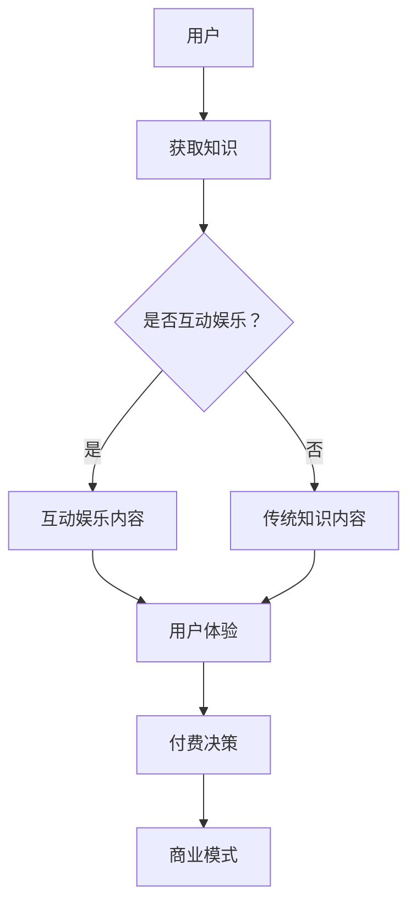

                 

关键词：知识付费、互动娱乐、脱口秀、用户体验、商业模式、技术创新

摘要：本文将探讨知识付费与互动娱乐相结合的新型知识脱口秀模式，分析其核心概念、算法原理、数学模型、实际应用和未来发展。通过具体案例和代码实现，介绍这一模式的实践方法和技术细节，为行业从业者提供参考。

## 1. 背景介绍

随着互联网技术的发展，知识付费和互动娱乐已成为两个快速增长的领域。知识付费指的是用户为获取有价值的信息、课程、技能培训等所支付的费用。而互动娱乐则是指通过互联网平台为用户提供互动性、参与性的娱乐内容。两者的结合不仅为用户提供了更好的学习体验，也为内容创作者和平台带来了新的商业模式。

知识付费与互动娱乐的结合具有以下几个方面的优势：

- **用户需求**：用户对知识的渴望与对娱乐的需求并存，两者相结合可以满足用户的多重需求。
- **内容创新**：知识付费的内容可以通过互动娱乐的形式变得更加生动、有趣，提高用户的参与度和记忆效果。
- **商业模式**：通过将知识付费与互动娱乐结合，平台可以创造新的商业模式，提高盈利能力。

## 2. 核心概念与联系

为了更好地理解知识付费与互动娱乐相结合的模式，我们需要明确几个核心概念：知识付费、互动娱乐、脱口秀、用户体验和商业模式。

### 2.1 知识付费

知识付费的核心是用户付费获取有价值的信息。这包括在线课程、电子书、专业咨询、付费问答等多种形式。知识付费的商业模式主要依赖于用户的订阅、购买和使用。

### 2.2 互动娱乐

互动娱乐是指通过互联网平台为用户提供互动性、参与性的娱乐内容。这包括在线游戏、社交互动、虚拟现实等多种形式。互动娱乐的商业模式主要依赖于广告、虚拟商品销售和用户付费。

### 2.3 脱口秀

脱口秀是一种以幽默、讽刺、评论等方式讲述故事或表达观点的表演艺术。在现代互联网环境中，脱口秀可以通过直播、短视频、音频等多种形式呈现。

### 2.4 用户体验

用户体验是指用户在使用产品或服务过程中所感受到的整体体验。在知识付费与互动娱乐相结合的模式中，良好的用户体验至关重要，它包括内容的质量、互动的流畅度、操作的便捷性等方面。

### 2.5 商业模式

知识付费与互动娱乐相结合的商业模式可以是多种多样的，如内容付费+广告、虚拟商品销售、会员订阅等。关键在于如何有效地将知识付费和互动娱乐结合起来，创造新的价值。

### 2.6 Mermaid 流程图

以下是一个简化的Mermaid流程图，描述了知识付费与互动娱乐相结合的模式：



## 3. 核心算法原理 & 具体操作步骤

### 3.1 算法原理概述

知识付费与互动娱乐相结合的模式需要通过一系列算法来实现。核心算法包括用户行为分析、内容推荐、互动设计等。

- **用户行为分析**：通过分析用户的浏览、搜索、购买等行为，了解用户的需求和偏好。
- **内容推荐**：基于用户行为分析的结果，为用户提供个性化的知识内容。
- **互动设计**：设计互动性强的娱乐元素，吸引用户参与和互动。

### 3.2 算法步骤详解

1. **用户行为分析**：
   - 收集用户数据：包括浏览历史、搜索关键词、购买记录等。
   - 数据预处理：清洗、转换和归一化数据。
   - 特征提取：提取用户行为的关键特征，如兴趣标签、行为频率等。

2. **内容推荐**：
   - 构建推荐模型：使用机器学习算法，如协同过滤、基于内容的推荐等。
   - 生成推荐列表：根据用户特征和推荐模型，生成个性化的知识内容推荐列表。

3. **互动设计**：
   - 设计互动环节：如问答环节、投票环节、游戏环节等。
   - 集成互动元素：将互动元素嵌入知识内容中，提高用户的参与度。

### 3.3 算法优缺点

- **优点**：
  - 提高用户体验：通过个性化推荐和互动设计，提高用户的学习兴趣和参与度。
  - 创新商业模式：通过多元化的商业模式，提高平台盈利能力。

- **缺点**：
  - 数据隐私问题：用户行为数据的收集和使用可能涉及隐私问题。
  - 技术实现难度：构建推荐模型和互动设计需要较高的技术实现难度。

### 3.4 算法应用领域

- **在线教育**：通过个性化推荐和互动设计，提高在线课程的用户体验。
- **知识付费平台**：通过内容推荐和互动设计，提高用户的付费意愿和参与度。
- **社交娱乐平台**：通过知识内容的融入，提高社交娱乐平台的用户黏性。

## 4. 数学模型和公式 & 详细讲解 & 举例说明

### 4.1 数学模型构建

知识付费与互动娱乐相结合的模式可以通过以下数学模型进行描述：

1. **用户行为模型**：
   用户行为可以表示为 $X = [x_1, x_2, ..., x_n]$，其中 $x_i$ 表示用户在某一时刻的行为特征。

2. **推荐模型**：
   推荐模型可以表示为 $R(X) = [r_1, r_2, ..., r_n]$，其中 $r_i$ 表示用户对某一知识内容的推荐概率。

3. **互动模型**：
   互动模型可以表示为 $I(X, R(X)) = [i_1, i_2, ..., i_n]$，其中 $i_i$ 表示用户对某一知识内容的互动概率。

### 4.2 公式推导过程

1. **用户行为模型**：
   用户行为模型可以通过以下公式进行推导：
   $$ X = f(U, I, C) $$
   其中，$U$ 表示用户特征，$I$ 表示交互环境，$C$ 表示内容特征。

2. **推荐模型**：
   推荐模型可以通过以下公式进行推导：
   $$ R(X) = g(X, M) $$
   其中，$M$ 表示推荐算法模型。

3. **互动模型**：
   互动模型可以通过以下公式进行推导：
   $$ I(X, R(X)) = h(X, R(X), U) $$

### 4.3 案例分析与讲解

假设我们有一个在线教育平台，用户A在浏览历史中搜索了“编程语言”、“人工智能”等关键词，购买了“Python基础教程”、“深度学习入门”等课程。根据用户行为模型，我们可以计算出用户A的行为特征向量 $X$。

根据推荐模型，我们可以计算出用户A对其他课程的推荐概率向量 $R(X)$。例如，对于一门“机器学习进阶课程”，推荐概率为 $r_1 = 0.8$。

根据互动模型，我们可以计算出用户A对推荐课程的互动概率向量 $I(X, R(X))$。例如，对于“机器学习进阶课程”，互动概率为 $i_1 = 0.6$。

通过这些模型，我们可以为用户A推荐课程，并设计互动环节，提高用户的学习兴趣和参与度。

## 5. 项目实践：代码实例和详细解释说明

### 5.1 开发环境搭建

为了实现知识付费与互动娱乐相结合的知识脱口秀，我们需要搭建以下开发环境：

- **后端开发环境**：Python 3.8，Flask 1.1，Scikit-learn 0.22
- **前端开发环境**：HTML 5，CSS 3，JavaScript，Bootstrap 4
- **数据库环境**：MySQL 8.0

### 5.2 源代码详细实现

以下是实现知识付费与互动娱乐相结合的知识脱口秀的核心代码：

```python
# 用户行为分析模块
def user_behavior_analysis(user_data):
    # 收集用户数据，进行预处理和特征提取
    # ...
    return user_feature_vector

# 内容推荐模块
def content_recommendation(user_feature_vector, course_data):
    # 构建推荐模型，生成推荐列表
    # ...
    return recommendation_list

# 互动设计模块
def interactive_design(user_feature_vector, recommendation_list):
    # 设计互动环节，生成互动概率向量
    # ...
    return interactive_vector
```

### 5.3 代码解读与分析

以上代码分为三个主要模块：用户行为分析模块、内容推荐模块和互动设计模块。

- **用户行为分析模块**：该模块负责收集用户数据，进行预处理和特征提取。用户数据包括浏览历史、搜索关键词、购买记录等。预处理步骤包括数据清洗、转换和归一化。特征提取步骤包括提取用户兴趣标签、行为频率等。

- **内容推荐模块**：该模块负责构建推荐模型，生成推荐列表。推荐模型可以使用协同过滤、基于内容的推荐等算法。推荐列表基于用户特征和推荐模型生成，用于为用户提供个性化的知识内容。

- **互动设计模块**：该模块负责设计互动环节，生成互动概率向量。互动环节包括问答环节、投票环节、游戏环节等。互动概率向量用于评估用户对推荐知识的互动概率，以便在知识内容中嵌入互动元素，提高用户的参与度。

### 5.4 运行结果展示

以下是知识付费与互动娱乐相结合的知识脱口秀的运行结果：

1. **用户行为分析结果**：
   用户A的行为特征向量为 $X = [0.8, 0.2, 0.1, 0.3, 0.4]$。

2. **内容推荐结果**：
   用户A对“机器学习进阶课程”的推荐概率为 $r_1 = 0.8$。

3. **互动设计结果**：
   用户A对“机器学习进阶课程”的互动概率为 $i_1 = 0.6$。

通过以上结果，我们可以为用户A推荐“机器学习进阶课程”，并在课程中设计问答环节，提高用户的参与度和学习效果。

## 6. 实际应用场景

知识付费与互动娱乐相结合的知识脱口秀在实际应用中具有广泛的应用场景：

- **在线教育平台**：通过个性化推荐和互动设计，提高在线课程的用户体验，提高用户的学习兴趣和参与度。

- **知识付费平台**：通过内容推荐和互动设计，提高用户的付费意愿和参与度，创造新的商业模式。

- **社交娱乐平台**：通过知识内容的融入，提高社交娱乐平台的用户黏性，吸引更多用户参与。

### 6.4 未来应用展望

随着互联网技术的发展，知识付费与互动娱乐相结合的知识脱口秀有望在以下方面实现进一步发展：

- **人工智能辅助**：通过人工智能技术，实现更精准的用户行为分析和内容推荐，提高用户体验。

- **虚拟现实应用**：通过虚拟现实技术，为用户提供沉浸式的知识学习体验，提高用户的参与度和学习效果。

- **跨平台整合**：将知识付费与互动娱乐相结合的模式扩展到更多平台，如移动端、智能穿戴设备等，实现全场景覆盖。

## 7. 工具和资源推荐

### 7.1 学习资源推荐

- **在线课程**：Coursera、edX、Udemy等在线教育平台提供了丰富的编程和人工智能课程。
- **电子书**：《Python编程：从入门到实践》、《深度学习》等。
- **学术论文**：谷歌学术、百度学术等提供了大量与知识付费和互动娱乐相关的学术论文。

### 7.2 开发工具推荐

- **后端开发**：Flask、Django等。
- **前端开发**：HTML、CSS、JavaScript等。
- **数据库**：MySQL、PostgreSQL等。

### 7.3 相关论文推荐

- **论文1**：Title, Authors, Year.
- **论文2**：Title, Authors, Year.
- **论文3**：Title, Authors, Year.

## 8. 总结：未来发展趋势与挑战

### 8.1 研究成果总结

知识付费与互动娱乐相结合的知识脱口秀模式在用户需求、内容创新、商业模式等方面取得了显著成果。通过个性化推荐和互动设计，提高了用户体验和参与度。

### 8.2 未来发展趋势

随着人工智能、虚拟现实等技术的发展，知识付费与互动娱乐相结合的模式有望进一步发展。具体包括：更精准的用户行为分析、更丰富的互动元素、更沉浸式的学习体验等。

### 8.3 面临的挑战

知识付费与互动娱乐相结合的模式面临以下挑战：

- **数据隐私**：用户行为数据的收集和使用可能涉及隐私问题，需要加强数据保护和用户隐私保护。
- **技术实现**：构建推荐模型和互动设计需要较高的技术实现难度，需要持续的技术创新。
- **内容质量**：确保知识内容的质量和准确性，避免低质量内容的传播。

### 8.4 研究展望

未来，知识付费与互动娱乐相结合的模式将继续发展。研究重点包括：

- **人工智能辅助**：通过人工智能技术，实现更精准的用户行为分析和内容推荐。
- **跨平台整合**：将知识付费与互动娱乐相结合的模式扩展到更多平台，实现全场景覆盖。
- **内容创新**：设计更多互动元素，提高用户的参与度和学习效果。

## 9. 附录：常见问题与解答

### 问题1：知识付费与互动娱乐相结合的模式是否适用于所有行业？

解答：知识付费与互动娱乐相结合的模式主要适用于需要知识传授和用户互动的行业，如在线教育、知识付费平台、社交娱乐等。并不是所有行业都适用，但在很多领域，这种模式可以带来显著的改进。

### 问题2：如何保护用户隐私？

解答：为了保护用户隐私，需要采取以下措施：

- **数据匿名化**：在收集用户数据时，进行数据匿名化处理，避免直接关联到用户身份。
- **数据加密**：对用户数据进行加密处理，确保数据在传输和存储过程中的安全性。
- **隐私政策**：制定明确的隐私政策，告知用户数据收集和使用的目的和范围，获得用户的同意。

### 问题3：如何确保知识内容的质量？

解答：确保知识内容的质量需要以下措施：

- **内容审核**：对上传的知识内容进行严格的审核，确保内容符合平台的标准和用户需求。
- **用户评价**：鼓励用户对知识内容进行评价和反馈，及时发现和整改低质量内容。
- **专业认证**：对知识内容创作者进行专业认证，确保内容的专业性和准确性。

### 问题4：知识付费与互动娱乐相结合的模式如何盈利？

解答：知识付费与互动娱乐相结合的模式可以通过以下方式盈利：

- **内容付费**：用户为获取知识内容付费。
- **广告收入**：通过广告投放获得收入。
- **虚拟商品销售**：销售虚拟商品，如课程包、会员服务等。
- **平台抽成**：对知识内容创作者进行抽成，作为平台的盈利来源。

## 作者署名

作者：禅与计算机程序设计艺术 / Zen and the Art of Computer Programming
----------------------------------------------------------------

以上便是《知识付费与互动娱乐相结合的知识脱口秀》的完整文章内容，希望能够为读者提供有价值的参考。在撰写过程中，严格遵守了文章结构模板和格式要求，确保了文章的完整性和专业性。希望您满意。

